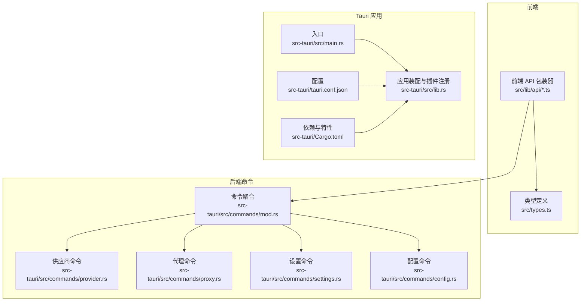
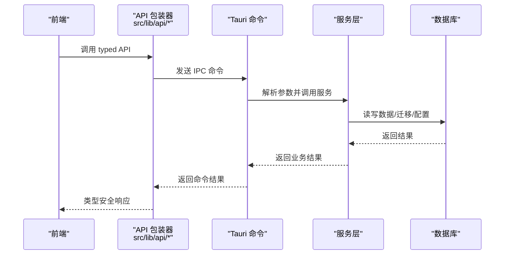
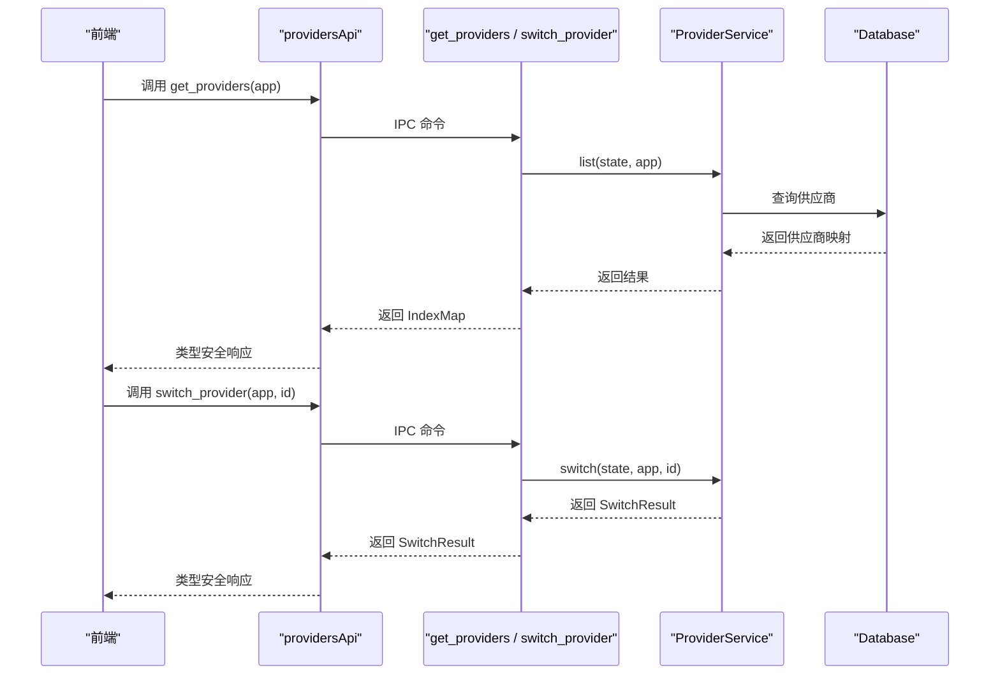
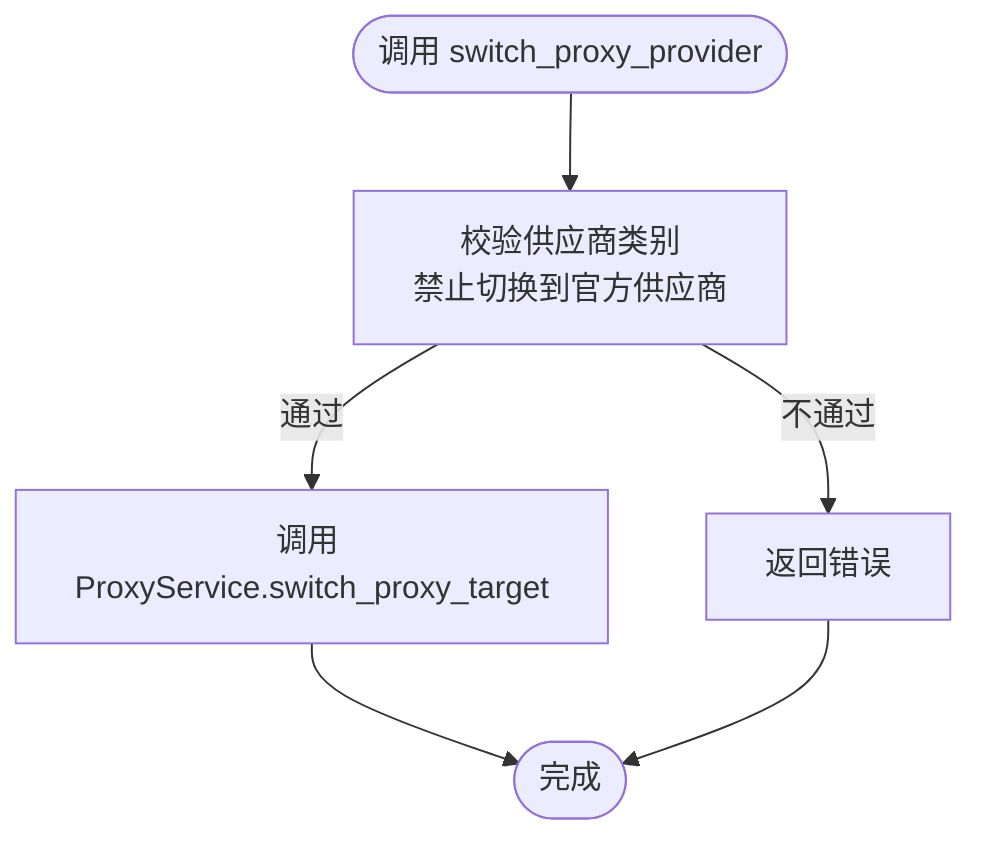
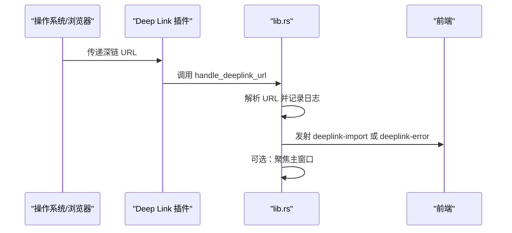
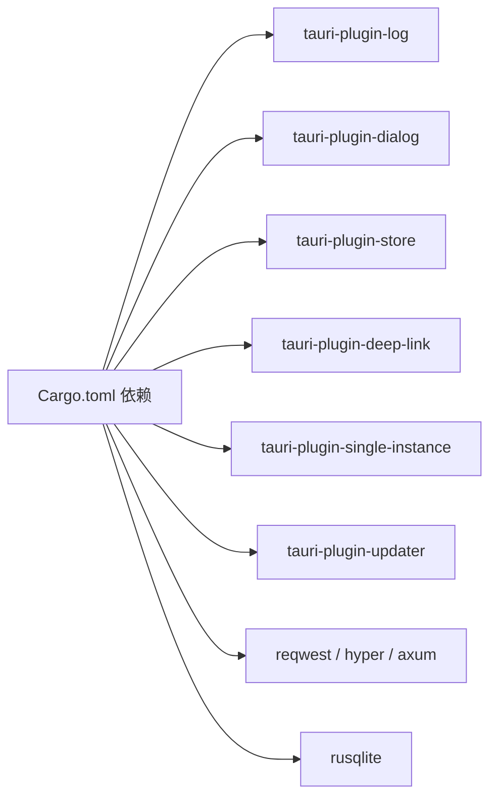

# API 参考

<cite>
**本文引用的文件**
- [src-tauri/Cargo.toml](file://src-tauri/Cargo.toml)
- [src-tauri/src/main.rs](file://src-tauri/src/main.rs)
- [src-tauri/tauri.conf.json](file://src-tauri/tauri.conf.json)
- [src-tauri/src/lib.rs](file://src-tauri/src/lib.rs)
- [src-tauri/src/commands/mod.rs](file://src-tauri/src/commands/mod.rs)
- [src-tauri/src/commands/provider.rs](file://src-tauri/src/commands/provider.rs)
- [src-tauri/src/commands/proxy.rs](file://src-tauri/src/commands/proxy.rs)
- [src-tauri/src/commands/settings.rs](file://src-tauri/src/commands/settings.rs)
- [src-tauri/src/commands/config.rs](file://src-tauri/src/commands/config.rs)
- [src/lib/api/index.ts](file://src/lib/api/index.ts)
- [src/types.ts](file://src/types.ts)
</cite>

## 目录
1. [简介](#简介)
2. [项目结构](#项目结构)
3. [核心组件](#核心组件)
4. [架构总览](#架构总览)
5. [详细组件分析](#详细组件分析)
6. [依赖关系分析](#依赖关系分析)
7. [性能考量](#性能考量)
8. [故障排查指南](#故障排查指南)
9. [结论](#结论)
10. [附录](#附录)

## 简介
本文件为 CC Switch 的全面 API 参考，涵盖以下方面：
- Tauri 命令系统架构：命令定义、参数传递、返回值格式与错误处理
- 前端 API 包装器：类型安全调用、错误处理与状态管理建议
- 后端服务接口：业务逻辑层公共方法、数据访问对象与数据库交互
- HTTP 代理服务：本地代理、故障转移、熔断器与路由
- 深链协议（deeplink）：URL 解析、事件发射与窗口行为
- 文件系统访问：配置目录、通用配置片段与外部打开
- API 端点清单、请求/响应模式、认证方法与错误码
- 实际调用示例、SDK 使用指南与集成最佳实践
- API 版本管理、向后兼容性与迁移指南

## 项目结构
CC Switch 采用 Tauri + Rust 后端 + TypeScript 前端的混合架构。后端通过 Tauri 插件暴露命令，前端通过 typed API 包装器进行类型安全调用。

图表来源
- [src-tauri/src/main.rs:1-23](file://src-tauri/src/main.rs#L1-L23)
- [src-tauri/src/lib.rs:220-360](file://src-tauri/src/lib.rs#L220-L360)
- [src-tauri/tauri.conf.json:1-70](file://src-tauri/tauri.conf.json#L1-L70)
- [src-tauri/Cargo.toml:1-110](file://src-tauri/Cargo.toml#L1-L110)
- [src-tauri/src/commands/mod.rs:1-69](file://src-tauri/src/commands/mod.rs#L1-L69)

章节来源
- [src-tauri/src/main.rs:1-23](file://src-tauri/src/main.rs#L1-L23)
- [src-tauri/src/lib.rs:220-360](file://src-tauri/src/lib.rs#L220-L360)
- [src-tauri/tauri.conf.json:1-70](file://src-tauri/tauri.conf.json#L1-L70)
- [src-tauri/Cargo.toml:1-110](file://src-tauri/Cargo.toml#L1-L110)
- [src-tauri/src/commands/mod.rs:1-69](file://src-tauri/src/commands/mod.rs#L1-L69)

## 核心组件
- Tauri 命令系统：通过 #[tauri::command] 宏导出 Rust 方法为 IPC 命令，前端以类型安全方式调用
- 前端 API 包装器：src/lib/api/* 提供模块化 API，统一导出于 src/lib/api/index.ts
- 类型系统：src/types.ts 定义 Provider、UsageScript、Settings 等核心类型
- 深链与托盘：lib.rs 中 handle_deeplink_url 与 update_tray_menu 等命令
- 代理服务：proxy.rs 提供启动/停止、接管、配置、熔断器与故障转移相关命令
- 设置与配置：settings.rs 与 config.rs 提供设置读写、目录打开、通用配置片段等命令

章节来源
- [src/lib/api/index.ts:1-31](file://src/lib/api/index.ts#L1-L31)
- [src/types.ts:1-709](file://src/types.ts#L1-L709)
- [src-tauri/src/lib.rs:119-204](file://src-tauri/src/lib.rs#L119-L204)
- [src-tauri/src/commands/proxy.rs:1-449](file://src-tauri/src/commands/proxy.rs#L1-L449)
- [src-tauri/src/commands/settings.rs:1-458](file://src-tauri/src/commands/settings.rs#L1-L458)
- [src-tauri/src/commands/config.rs:1-399](file://src-tauri/src/commands/config.rs#L1-L399)

## 架构总览
Tauri 应用启动后注册插件（日志、对话框、进程、Store、窗口状态、深链、单实例等），初始化数据库与迁移，随后将 AppState 注入各服务。前端通过 typed API 调用后端命令，命令内部委托服务层完成业务逻辑，并通过事件向前端广播状态变更。

图表来源
- [src-tauri/src/lib.rs:300-450](file://src-tauri/src/lib.rs#L300-L450)
- [src-tauri/src/commands/mod.rs:1-69](file://src-tauri/src/commands/mod.rs#L1-L69)
- [src/lib/api/index.ts:1-31](file://src/lib/api/index.ts#L1-L31)

## 详细组件分析

### Tauri 命令系统与类型安全
- 命令定义：每个命令以 #[tauri::command] 声明，参数与返回值自动序列化/反序列化
- 参数传递：字符串、枚举、结构体等均可作为参数；State<'_, AppState> 用于访问全局状态
- 返回值格式：Result<T, String> 统一错误包装；复杂结构体通过 serde 序列化
- 错误处理：后端抛出错误以 String 形式返回前端；前端应使用错误回调处理

章节来源
- [src-tauri/src/commands/mod.rs:1-69](file://src-tauri/src/commands/mod.rs#L1-L69)
- [src-tauri/src/lib.rs:184-204](file://src-tauri/src/lib.rs#L184-L204)

### 前端 API 包装器与类型系统
- 统一导出：src/lib/api/index.ts 导出 providersApi、settingsApi、proxyApi 等
- 类型安全：src/types.ts 定义 Provider、UsageScript、Settings 等核心类型
- 状态管理建议：结合 React Query 或类似库缓存命令结果，使用事件驱动更新（如 usage-cache-updated）

章节来源
- [src/lib/api/index.ts:1-31](file://src/lib/api/index.ts#L1-L31)
- [src/types.ts:1-709](file://src/types.ts#L1-L709)

### 供应商命令（provider）
- 查询与切换：获取供应商列表、当前供应商、新增/更新/删除供应商、切换供应商
- 用量查询：支持多种模板类型（GitHub Copilot、Coding Plan、余额、官方订阅）与脚本测试
- 自定义端点：添加/移除/更新自定义端点，支持测速与排序
- 通用配置片段：读取/设置通用配置片段，支持校验与同步

图表来源
- [src-tauri/src/commands/provider.rs:21-110](file://src-tauri/src/commands/provider.rs#L21-L110)

章节来源
- [src-tauri/src/commands/provider.rs:1-800](file://src-tauri/src/commands/provider.rs#L1-L800)

### 代理命令（proxy）
- 代理生命周期：启动/停止/停止并恢复、状态查询、接管开关
- 配置管理：全局代理配置、应用级代理配置、成本倍率与计费模式来源
- 熔断器与故障转移：熔断器配置/统计、健康状态、自动故障转移切换
- 代理模式热切换：在接管模式下禁止切换到官方供应商

图表来源
- [src-tauri/src/commands/proxy.rs:275-299](file://src-tauri/src/commands/proxy.rs#L275-L299)

章节来源
- [src-tauri/src/commands/proxy.rs:1-449](file://src-tauri/src/commands/proxy.rs#L1-L449)

### 设置命令（settings）
- 获取/保存设置：支持合并策略（如 WebDAV/S3 密钥保留）
- 应用重启：在配置目录变更后触发重启
- 自启动：设置/查询开机自启状态
- 优化器/整流器/日志配置：读取/设置代理侧优化器与日志级别

章节来源
- [src-tauri/src/commands/settings.rs:1-458](file://src-tauri/src/commands/settings.rs#L1-L458)

### 配置命令（config）
- 配置状态：查询各应用配置是否存在、路径
- 目录操作：打开配置目录、选择目录、读取应用配置路径
- 通用配置片段：读取/设置通用配置片段，支持格式校验与同步

章节来源
- [src-tauri/src/commands/config.rs:1-399](file://src-tauri/src/commands/config.rs#L1-L399)

### 深链与托盘命令
- 深链处理：统一解析 ccswitch:// URL，发射 deeplink-import/deeplink-error 事件，必要时聚焦窗口
- 托盘菜单：动态更新托盘菜单

图表来源
- [src-tauri/src/lib.rs:119-182](file://src-tauri/src/lib.rs#L119-L182)
- [src-tauri/tauri.conf.json:56-67](file://src-tauri/tauri.conf.json#L56-L67)

章节来源
- [src-tauri/src/lib.rs:119-204](file://src-tauri/src/lib.rs#L119-L204)
- [src-tauri/tauri.conf.json:56-67](file://src-tauri/tauri.conf.json#L56-L67)

## 依赖关系分析
- 插件生态：日志、对话框、进程、Store、窗口状态、深链、单实例、更新器
- 网络栈：reqwest、hyper、axum、tower 等用于代理与 HTTP 服务
- 数据库：rusqlite + 迁移与备份
- 平台适配：Linux/Webkit 修复、Windows 注册表、macOS 图标

图表来源
- [src-tauri/Cargo.toml:25-82](file://src-tauri/Cargo.toml#L25-L82)

章节来源
- [src-tauri/Cargo.toml:1-110](file://src-tauri/Cargo.toml#L1-L110)

## 性能考量
- 二进制体积优化：release 配置启用 LTO、strip、符号裁剪
- 日志策略：单文件轮转，支持运行时级别调整
- 代理性能：熔断器与故障转移减少失败请求对用户体验的影响
- 数据库：迁移与备份在后台异步执行，避免阻塞 UI

章节来源
- [src-tauri/Cargo.toml:98-106](file://src-tauri/Cargo.toml#L98-L106)
- [src-tauri/src/lib.rs:320-356](file://src-tauri/src/lib.rs#L320-L356)

## 故障排查指南
- 深链无法触发：检查 tauri.conf.json 中深链 schemes，Linux/Windows 调试模式需显式注册
- 代理停止失败：若仍有应用处于接管状态，需先关闭对应应用接管再停止本地代理
- 用量查询失败：检查 UsageScript 配置、模板类型与凭据；后端会将业务失败与传输失败区分开
- 设置保存异常：注意 WebDAV/S3 密钥的保留策略，避免前端传入空字符串覆盖现有密钥

章节来源
- [src-tauri/tauri.conf.json:56-67](file://src-tauri/tauri.conf.json#L56-L67)
- [src-tauri/src/commands/proxy.rs:18-40](file://src-tauri/src/commands/proxy.rs#L18-L40)
- [src-tauri/src/commands/provider.rs:373-411](file://src-tauri/src/commands/provider.rs#L373-L411)
- [src-tauri/src/commands/settings.rs:5-72](file://src-tauri/src/commands/settings.rs#L5-L72)

## 结论
本文档提供了 CC Switch 的完整 API 参考，覆盖命令系统、前端包装器、后端服务、代理与深链等关键模块。建议在集成时遵循类型安全调用、事件驱动更新与错误处理最佳实践，并关注版本迁移与兼容性策略。

## 附录

### API 端点清单与请求/响应模式
- 供应商命令
  - get_providers(app: string): 返回 IndexMap<string, Provider>
  - get_current_provider(app: string): 返回当前供应商 id
  - add_provider(app: string, provider: Provider, addToLive?: boolean): 返回布尔
  - update_provider(app: string, provider: Provider, originalId?: string): 返回布尔
  - delete_provider(app: string, id: string): 返回布尔
  - remove_provider_from_live_config(app: string, id: string): 返回布尔
  - switch_provider(app: string, id: string): 返回 SwitchResult
  - queryProviderUsage(app_handle, state, copilot_state, providerId: string, app: string): 返回 UsageResult
  - testUsageScript(state, providerId: string, app: string, scriptCode: string, timeout?: u64, apiKey?: string, baseUrl?: string, accessToken?: string, userId?: string, templateType?: string): 返回 UsageResult
  - get_custom_endpoints(state, app: string, providerId: string): 返回 CustomEndpoint[]
  - add_custom_endpoint(state, app: string, providerId: string, url: string): 返回空
  - remove_custom_endpoint(state, app: string, providerId: string, url: string): 返回空
  - update_endpoint_last_used(state, app: string, providerId: string, url: string): 返回空
  - update_providers_sort_order(state, app: string, updates: ProviderSortUpdate[]): 返回布尔
  - get_universal_providers(state): 返回 HashMap<string, UniversalProvider>
  - get_universal_provider(state, id: string): 返回 UniversalProvider?
  - upsert_universal_provider(app, state, provider: UniversalProvider): 返回布尔

- 代理命令
  - start_proxy_server(state): 返回 ProxyServerInfo
  - stop_proxy_server(state): 返回空
  - stop_proxy_with_restore(state): 返回空
  - get_proxy_takeover_status(state): 返回 ProxyTakeoverStatus
  - set_proxy_takeover_for_app(state, app_type: string, enabled: boolean): 返回空
  - get_proxy_status(state): 返回 ProxyStatus
  - get_proxy_config(state): 返回 ProxyConfig
  - update_proxy_config(state, config: ProxyConfig): 返回空
  - get_global_proxy_config(state): 返回 GlobalProxyConfig
  - update_global_proxy_config(state, config: GlobalProxyConfig): 返回空
  - get_proxy_config_for_app(state, app_type: string): 返回 AppProxyConfig
  - update_proxy_config_for_app(state, config: AppProxyConfig): 返回空
  - get_default_cost_multiplier(state, app_type: string): 返回字符串
  - set_default_cost_multiplier(state, app_type: string, value: string): 返回空
  - get_pricing_model_source(state, app_type: string): 返回字符串
  - set_pricing_model_source(state, app_type: string, value: string): 返回空
  - is_proxy_running(state): 返回布尔
  - is_live_takeover_active(state): 返回布尔
  - switch_proxy_provider(state, app_type: string, provider_id: string): 返回空
  - get_provider_health(state, provider_id: string, app_type: string): 返回 ProviderHealth
  - reset_circuit_breaker(app_handle, state, provider_id: string, app_type: string): 返回空
  - get_circuit_breaker_config(state): 返回 CircuitBreakerConfig
  - update_circuit_breaker_config(state, config: CircuitBreakerConfig): 返回空
  - get_circuit_breaker_stats(state, provider_id: string, app_type: string): 返回 Option<CircuitBreakerStats>

- 设置命令
  - get_settings(): 返回 AppSettings
  - save_settings(settings: AppSettings): 返回布尔
  - restart_app(app: AppHandle): 返回布尔
  - get_app_config_dir_override(app: AppHandle): 返回 Option<string>
  - set_app_config_dir_override(app: AppHandle, path?: string): 返回布尔
  - set_auto_launch(enabled: boolean): 返回布尔
  - get_auto_launch_status(): 返回布尔
  - get_rectifier_config(state): 返回 RectifierConfig
  - set_rectifier_config(state, config: RectifierConfig): 返回布尔
  - get_optimizer_config(state): 返回 OptimizerConfig
  - set_optimizer_config(state, config: OptimizerConfig): 返回布尔
  - get_copilot_optimizer_config(state): 返回 CopilotOptimizerConfig
  - set_copilot_optimizer_config(state, config: CopilotOptimizerConfig): 返回布尔
  - get_log_config(state): 返回 LogConfig
  - set_log_config(state, config: LogConfig): 返回布尔

- 配置命令
  - get_claude_config_status(): 返回 ConfigStatus
  - get_config_status(state, app: string): 返回 ConfigStatus
  - get_claude_code_config_path(): 返回字符串
  - get_config_dir(app: string): 返回字符串
  - open_config_folder(handle: AppHandle, app: string): 返回布尔
  - pick_directory(app: AppHandle, defaultPath?: string): 返回 Option<string>
  - get_app_config_path(): 返回字符串
  - open_app_config_folder(handle: AppHandle): 返回布尔
  - get_claude_common_config_snippet(state): 返回 Option<string>
  - set_claude_common_config_snippet(snippet: string, state): 返回空
  - get_common_config_snippet(app_type: string, state): 返回 Option<string>
  - set_common_config_snippet(app_type: string, snippet: string, state): 返回空
  - extract_common_config_snippet(appType: string, settingsConfig?: string, state: tauri::State): 返回字符串

- 深链与托盘
  - update_tray_menu(app: tauri::AppHandle, state: tauri::State): 返回布尔

章节来源
- [src-tauri/src/commands/provider.rs:21-800](file://src-tauri/src/commands/provider.rs#L21-L800)
- [src-tauri/src/commands/proxy.rs:1-449](file://src-tauri/src/commands/proxy.rs#L1-L449)
- [src-tauri/src/commands/settings.rs:1-458](file://src-tauri/src/commands/settings.rs#L1-L458)
- [src-tauri/src/commands/config.rs:1-399](file://src-tauri/src/commands/config.rs#L1-L399)
- [src-tauri/src/lib.rs:184-204](file://src-tauri/src/lib.rs#L184-L204)

### 认证方法与错误码
- 认证方法
  - 通用配置片段：支持 JSON/TOML 校验，按应用类型区分
  - 用量查询：支持模板类型（Copilot、Coding Plan、余额、官方订阅）与脚本测试
  - 代理配置：支持全局与应用级配置、熔断器与成本倍率
- 错误码
  - 业务失败：UsageResult.success=false，携带 error 字段
  - 传输失败：RPC/DB/网络错误，返回 String 错误消息
  - 权限/配置错误：如代理停止时仍处于接管状态、切换到官方供应商等

章节来源
- [src-tauri/src/commands/config.rs:44-63](file://src-tauri/src/commands/config.rs#L44-L63)
- [src-tauri/src/commands/provider.rs:373-411](file://src-tauri/src/commands/provider.rs#L373-L411)
- [src-tauri/src/commands/proxy.rs:18-40](file://src-tauri/src/commands/proxy.rs#L18-L40)

### 实际调用示例与 SDK 使用指南
- 前端调用建议
  - 使用 src/lib/api/index.ts 导出的模块化 API
  - 使用 src/types.ts 定义的类型进行参数与返回值约束
  - 使用事件（如 usage-cache-updated）驱动 UI 更新
- SDK 集成
  - 通过 tauri.conf.json 配置深链 schemes
  - 在 Linux/Windows 调试模式下显式注册深链处理器
  - 使用 set_log_config 动态调整日志级别

章节来源
- [src/lib/api/index.ts:1-31](file://src/lib/api/index.ts#L1-L31)
- [src/types.ts:1-709](file://src/types.ts#L1-L709)
- [src-tauri/tauri.conf.json:56-67](file://src-tauri/tauri.conf.json#L56-L67)
- [src-tauri/src/commands/settings.rs:432-457](file://src-tauri/src/commands/settings.rs#L432-L457)

### API 版本管理、向后兼容性与迁移指南
- 版本号：应用版本与产品名在 tauri.conf.json 中维护
- 迁移策略
  - 数据库迁移：启动时检测 SQLite schema 并执行迁移，失败时弹窗提示用户重试或退出
  - 配置迁移：从旧版 config.json 迁移到 SQLite，支持归档旧配置
  - 技能迁移：SSOT 迁移标记与自动导入
- 向后兼容
  - 旧字段兼容读取（如 GitHub Copilot 账号 ID）
  - 保留策略：设置保存时对敏感字段（如 WebDAV/S3 密钥）进行保留

章节来源
- [src-tauri/tauri.conf.json:1-11](file://src-tauri/tauri.conf.json#L1-L11)
- [src-tauri/src/lib.rs:363-445](file://src-tauri/src/lib.rs#L363-L445)
- [src-tauri/src/commands/settings.rs:5-72](file://src-tauri/src/commands/settings.rs#L5-L72)