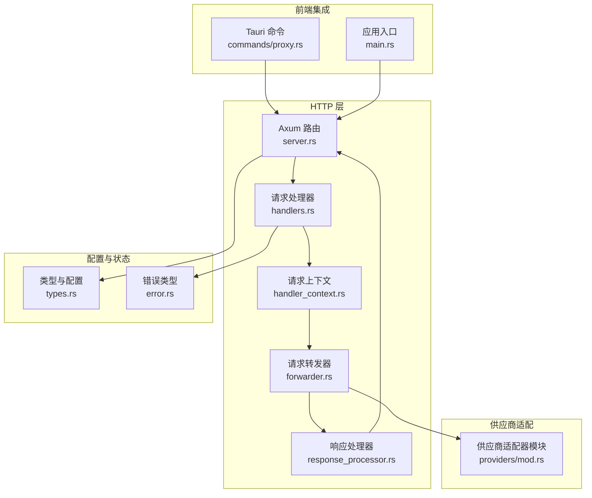
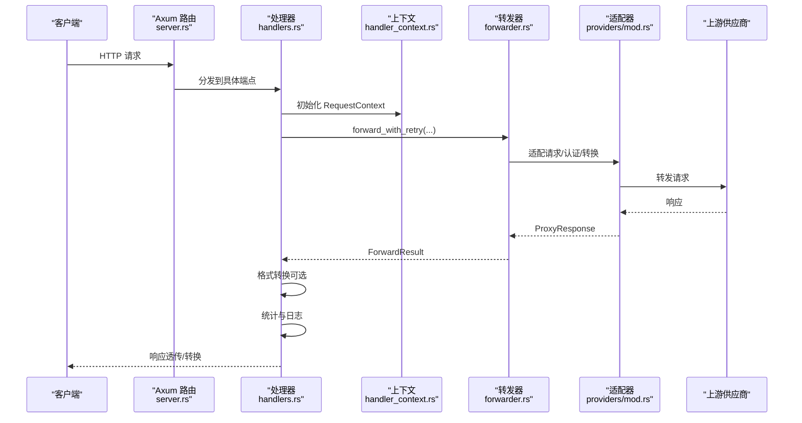
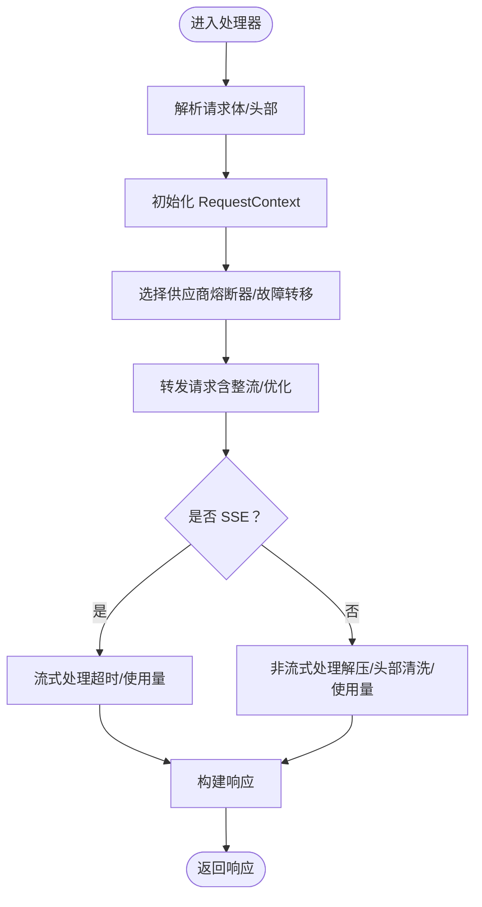
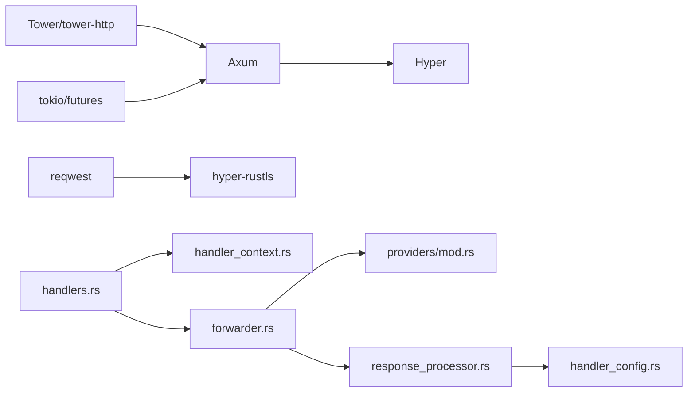

# HTTP REST API

<cite>
**本文引用的文件**
- [src-tauri/src/proxy/server.rs](file://src-tauri/src/proxy/server.rs)
- [src-tauri/src/proxy/handlers.rs](file://src-tauri/src/proxy/handlers.rs)
- [src-tauri/src/proxy/handler_context.rs](file://src-tauri/src/proxy/handler_context.rs)
- [src-tauri/src/proxy/response_processor.rs](file://src-tauri/src/proxy/response_processor.rs)
- [src-tauri/src/proxy/forwarder.rs](file://src-tauri/src/proxy/forwarder.rs)
- [src-tauri/src/proxy/providers/mod.rs](file://src-tauri/src/proxy/providers/mod.rs)
- [src-tauri/src/proxy/types.rs](file://src-tauri/src/proxy/types.rs)
- [src-tauri/src/proxy/error.rs](file://src-tauri/src/proxy/error.rs)
- [src-tauri/src/commands/proxy.rs](file://src-tauri/src/commands/proxy.rs)
- [src-tauri/Cargo.toml](file://src-tauri/Cargo.toml)
- [src-tauri/src/main.rs](file://src-tauri/src/main.rs)
</cite>

## 目录
1. [简介](#简介)
2. [项目结构](#项目结构)
3. [核心组件](#核心组件)
4. [架构总览](#架构总览)
5. [详细组件分析](#详细组件分析)
6. [依赖关系分析](#依赖关系分析)
7. [性能考量](#性能考量)
8. [故障排查指南](#故障排查指南)
9. [结论](#结论)
10. [附录](#附录)

## 简介
本文件面向 CC Switch 的本地 HTTP 代理服务，系统性梳理其 REST API 设计与实现，涵盖：
- HTTP 服务器配置与路由
- 请求拦截、供应商选择、响应转发与流式处理
- 完整端点清单与请求/响应格式
- 认证机制、CORS 与安全注意事项
- 实际调用示例与与前端应用的集成模式

## 项目结构
本地代理服务基于 Rust/Tauri，HTTP 层采用 Axum + Hyper，核心位于 src-tauri/src/proxy 目录，对外暴露两类接口：
- HTTP REST API：Axum 路由与处理器
- Tauri 命令：前端通过 IPC 调用的后端命令

图表来源
- [src-tauri/src/proxy/server.rs:291-360](file://src-tauri/src/proxy/server.rs#L291-L360)
- [src-tauri/src/proxy/handlers.rs:1-120](file://src-tauri/src/proxy/handlers.rs#L1-L120)
- [src-tauri/src/proxy/handler_context.rs:75-177](file://src-tauri/src/proxy/handler_context.rs#L75-L177)
- [src-tauri/src/proxy/response_processor.rs:369-384](file://src-tauri/src/proxy/response_processor.rs#L369-L384)
- [src-tauri/src/proxy/forwarder.rs:325-353](file://src-tauri/src/proxy/forwarder.rs#L325-L353)
- [src-tauri/src/proxy/providers/mod.rs:236-247](file://src-tauri/src/proxy/providers/mod.rs#L236-L247)
- [src-tauri/src/proxy/types.rs:1-120](file://src-tauri/src/proxy/types.rs#L1-L120)
- [src-tauri/src/proxy/error.rs:9-77](file://src-tauri/src/proxy/error.rs#L9-L77)
- [src-tauri/src/commands/proxy.rs:1-120](file://src-tauri/src/commands/proxy.rs#L1-L120)
- [src-tauri/src/main.rs:1-23](file://src-tauri/src/main.rs#L1-L23)

章节来源
- [src-tauri/src/proxy/server.rs:1-396](file://src-tauri/src/proxy/server.rs#L1-L396)
- [src-tauri/src/proxy/handlers.rs:1-120](file://src-tauri/src/proxy/handlers.rs#L1-L120)
- [src-tauri/src/proxy/handler_context.rs:1-120](file://src-tauri/src/proxy/handler_context.rs#L1-L120)
- [src-tauri/src/proxy/response_processor.rs:1-120](file://src-tauri/src/proxy/response_processor.rs#L1-L120)
- [src-tauri/src/proxy/forwarder.rs:1-120](file://src-tauri/src/proxy/forwarder.rs#L1-L120)
- [src-tauri/src/proxy/providers/mod.rs:1-120](file://src-tauri/src/proxy/providers/mod.rs#L1-L120)
- [src-tauri/src/proxy/types.rs:1-120](file://src-tauri/src/proxy/types.rs#L1-L120)
- [src-tauri/src/proxy/error.rs:1-80](file://src-tauri/src/proxy/error.rs#L1-L80)
- [src-tauri/src/commands/proxy.rs:1-120](file://src-tauri/src/commands/proxy.rs#L1-L120)
- [src-tauri/src/main.rs:1-23](file://src-tauri/src/main.rs#L1-L23)

## 核心组件
- HTTP 服务器与路由
  - 服务器负责监听本地地址与端口，构建路由并启动服务。
  - 路由覆盖健康检查、状态查询、多厂商 API（Claude、Codex、Gemini）以及 Claude Desktop 网关。
- 请求处理器
  - 按端点拆分处理逻辑，统一通过 RequestContext 初始化上下文，委托 Forwarder 转发，再由 ResponseProcessor 处理响应。
- 请求上下文
  - 负责读取应用级配置、选择供应商、提取会话 ID、整流与优化器配置注入。
- 请求转发器
  - 支持熔断器、故障转移、整流器（thinking 签名/预算/媒体降级）、优化器（Bedrock）与超时控制。
- 响应处理器
  - 统一处理流式与非流式响应，支持解压、头部清洗、使用量统计与日志。
- 供应商适配器
  - 为 Claude、Codex、Gemini 等提供统一的认证、请求转换与格式适配。
- 配置与状态
  - 代理配置、运行状态、熔断器配置、整流器与优化器配置等。

章节来源
- [src-tauri/src/proxy/server.rs:53-92](file://src-tauri/src/proxy/server.rs#L53-L92)
- [src-tauri/src/proxy/handlers.rs:105-156](file://src-tauri/src/proxy/handlers.rs#L105-L156)
- [src-tauri/src/proxy/handler_context.rs:75-177](file://src-tauri/src/proxy/handler_context.rs#L75-L177)
- [src-tauri/src/proxy/forwarder.rs:325-353](file://src-tauri/src/proxy/forwarder.rs#L325-L353)
- [src-tauri/src/proxy/response_processor.rs:369-384](file://src-tauri/src/proxy/response_processor.rs#L369-L384)
- [src-tauri/src/proxy/providers/mod.rs:236-247](file://src-tauri/src/proxy/providers/mod.rs#L236-L247)
- [src-tauri/src/proxy/types.rs:1-120](file://src-tauri/src/proxy/types.rs#L1-L120)

## 架构总览
本地代理服务采用“Axum 路由 → 处理器 → 上下文 → 转发器 → 适配器 → 上游”的流水线式处理，结合熔断器与故障转移，确保高可用与可观测性。

图表来源
- [src-tauri/src/proxy/server.rs:291-360](file://src-tauri/src/proxy/server.rs#L291-L360)
- [src-tauri/src/proxy/handlers.rs:105-156](file://src-tauri/src/proxy/handlers.rs#L105-L156)
- [src-tauri/src/proxy/handler_context.rs:194-245](file://src-tauri/src/proxy/handler_context.rs#L194-L245)
- [src-tauri/src/proxy/forwarder.rs:325-353](file://src-tauri/src/proxy/forwarder.rs#L325-L353)
- [src-tauri/src/proxy/providers/mod.rs:236-247](file://src-tauri/src/proxy/providers/mod.rs#L236-L247)

## 详细组件分析

### HTTP 服务器与路由
- 监听地址与端口：来自 ProxyConfig，默认监听 127.0.0.1:15721。
- 路由定义：
  - 健康检查：GET /health
  - 状态查询：GET /status
  - Claude API：/v1/messages 与 /claude/v1/messages
  - Claude Desktop 网关：/claude-desktop/v1/models 与 /claude-desktop/v1/messages
  - Codex API：/chat/completions、/v1/chat/completions、/v1/v1/chat/completions、/codex/v1/chat/completions；/models；/responses、/v1/responses、/v1/v1/responses、/codex/v1/responses；/responses/compact、/v1/responses/compact、/v1/v1/responses/compact、/codex/v1/responses/compact
  - Gemini API：/v1beta/*path 与 /gemini/v1beta/*path，以及 /gemini/v1/*path
- 请求体大小限制提升至 200MB，避免 413。

章节来源
- [src-tauri/src/proxy/server.rs:94-123](file://src-tauri/src/proxy/server.rs#L94-L123)
- [src-tauri/src/proxy/server.rs:291-360](file://src-tauri/src/proxy/server.rs#L291-L360)
- [src-tauri/src/proxy/types.rs:1-56](file://src-tauri/src/proxy/types.rs#L1-L56)

### 请求处理器工作原理
- 统一入口：每个端点对应一个处理器函数，读取请求体与头部，构造 RequestContext。
- 供应商选择：通过 ProviderRouter 选择可用供应商，支持熔断器与故障转移。
- 转发与重试：Forwarder.forward_with_retry 控制最大尝试次数、超时与整流器重试。
- 响应处理：根据 SSE/非 SSE 自动分流，进行解压、头部清洗、使用量统计与日志。

图表来源
- [src-tauri/src/proxy/handlers.rs:105-156](file://src-tauri/src/proxy/handlers.rs#L105-L156)
- [src-tauri/src/proxy/handler_context.rs:194-245](file://src-tauri/src/proxy/handler_context.rs#L194-L245)
- [src-tauri/src/proxy/forwarder.rs:325-353](file://src-tauri/src/proxy/forwarder.rs#L325-L353)
- [src-tauri/src/proxy/response_processor.rs:369-384](file://src-tauri/src/proxy/response_processor.rs#L369-L384)

章节来源
- [src-tauri/src/proxy/handlers.rs:105-156](file://src-tauri/src/proxy/handlers.rs#L105-L156)
- [src-tauri/src/proxy/handler_context.rs:75-177](file://src-tauri/src/proxy/handler_context.rs#L75-L177)
- [src-tauri/src/proxy/forwarder.rs:325-353](file://src-tauri/src/proxy/forwarder.rs#L325-L353)
- [src-tauri/src/proxy/response_processor.rs:369-384](file://src-tauri/src/proxy/response_processor.rs#L369-L384)

### 代理处理器（Claude/Codex/Gemini）
- Claude
  - 支持 OpenRouter/Responses/Gemini Native 等格式转换，必要时将上游 SSE 聚合为 Anthropic JSON。
  - 流式场景记录 usage 事件，非流式解析响应体 usage。
- Codex
  - /chat/completions 与 /responses、/responses/compact 端点，支持自动格式检测与转换。
- Gemini
  - 支持 /v1beta 与 /gemini/v1beta 路径，GET/POST 等方法透传，支持模型名提取与使用量统计。

章节来源
- [src-tauri/src/proxy/handlers.rs:105-156](file://src-tauri/src/proxy/handlers.rs#L105-L156)
- [src-tauri/src/proxy/handlers.rs:575-638](file://src-tauri/src/proxy/handlers.rs#L575-L638)
- [src-tauri/src/proxy/handlers.rs:640-794](file://src-tauri/src/proxy/handlers.rs#L640-L794)
- [src-tauri/src/proxy/handlers.rs:356-562](file://src-tauri/src/proxy/handlers.rs#L356-L562)

### 响应处理与流式处理
- 流式处理
  - 透传 SSE，按配置进行首字节与静默期超时控制，支持 usage 事件收集与日志。
- 非流式处理
  - 自动解压 gzip/deflate/br，清洗 hop-by-hop 头，解析 usage 并记录。
- 使用量统计
  - 基于解析器配置（不同 API 的解析器与模型提取器）进行 token usage 归因。

章节来源
- [src-tauri/src/proxy/response_processor.rs:196-256](file://src-tauri/src/proxy/response_processor.rs#L196-L256)
- [src-tauri/src/proxy/response_processor.rs:258-367](file://src-tauri/src/proxy/response_processor.rs#L258-L367)
- [src-tauri/src/proxy/handler_config.rs:138-172](file://src-tauri/src/proxy/handler_config.rs#L138-L172)

### 供应商选择与故障转移
- 选择策略
  - 通过 ProviderRouter.select_providers 获取供应商队列，结合熔断器状态与故障转移配置。
- 整流与优化
  - Claude 思维签名/预算整流、媒体降级；Bedrock 优化器（可选）。
- 超时与重试
  - 非流式整包超时、流式首字节与静默期超时，max_retries 控制尝试次数。

章节来源
- [src-tauri/src/proxy/handler_context.rs:194-245](file://src-tauri/src/proxy/handler_context.rs#L194-L245)
- [src-tauri/src/proxy/forwarder.rs:325-353](file://src-tauri/src/proxy/forwarder.rs#L325-L353)
- [src-tauri/src/proxy/forwarder.rs:524-798](file://src-tauri/src/proxy/forwarder.rs#L524-L798)

## 依赖关系分析
- 依赖栈
  - Axum + Hyper：HTTP 服务器与连接管理
  - Tower + tower-http：中间件与 CORS（间接通过 tower-http）
  - reqwest + hyper-rustls：上游 HTTP 客户端
  - tokio + futures：异步运行时与流式处理
- 关键耦合
  - 路由与处理器强耦合于 RequestContext 与 Forwarder
  - 响应处理器与使用量解析器配置强耦合
  - 供应商适配器与 ProviderRouter 强耦合

图表来源
- [src-tauri/Cargo.toml:50-56](file://src-tauri/Cargo.toml#L50-L56)
- [src-tauri/src/proxy/handlers.rs:10-37](file://src-tauri/src/proxy/handlers.rs#L10-L37)
- [src-tauri/src/proxy/forwarder.rs:5-28](file://src-tauri/src/proxy/forwarder.rs#L5-L28)
- [src-tauri/src/proxy/response_processor.rs:5-29](file://src-tauri/src/proxy/response_processor.rs#L5-L29)
- [src-tauri/src/proxy/handler_config.rs:24-36](file://src-tauri/src/proxy/handler_config.rs#L24-L36)

章节来源
- [src-tauri/Cargo.toml:50-56](file://src-tauri/Cargo.toml#L50-L56)
- [src-tauri/src/proxy/handlers.rs:10-37](file://src-tauri/src/proxy/handlers.rs#L10-L37)
- [src-tauri/src/proxy/forwarder.rs:5-28](file://src-tauri/src/proxy/forwarder.rs#L5-L28)
- [src-tauri/src/proxy/response_processor.rs:5-29](file://src-tauri/src/proxy/response_processor.rs#L5-L29)
- [src-tauri/src/proxy/handler_config.rs:24-36](file://src-tauri/src/proxy/handler_config.rs#L24-L36)

## 性能考量
- 连接与并发
  - 使用手动 HTTP/1.1 accept 循环，保留原始请求头大小写，减少额外解析开销。
  - 通过 ActiveConnectionGuard 精确维护活跃连接计数，避免 UI 计数提前归零。
- 超时与重试
  - 非流式整包超时与流式首字节/静默期超时，避免请求悬挂。
  - max_retries 与熔断器配合，降低雪崩风险。
- 压缩与头部
  - 自动解压 gzip/deflate/br，透传 accept-encoding；清洗 hop-by-hop 头，避免重复压缩。
- 使用量统计
  - SSE 事件按需解析，使用事件过滤器减少 JSON 解析负担。

章节来源
- [src-tauri/src/proxy/server.rs:138-213](file://src-tauri/src/proxy/server.rs#L138-L213)
- [src-tauri/src/proxy/response_processor.rs:727-756](file://src-tauri/src/proxy/response_processor.rs#L727-L756)
- [src-tauri/src/proxy/forwarder.rs:325-353](file://src-tauri/src/proxy/forwarder.rs#L325-L353)

## 故障排查指南
- 常见错误与状态码
  - 已在运行/未运行/绑定失败/停止超时/停止失败：409/503/500
  - 转发失败/无可用供应商/所有供应商熔断：502/503
  - 配置错误/格式转换错误/认证失败：400/422/401
  - 超时（流式/非流式）：504
- 定位建议
  - 查看 /status 与 /health 获取运行状态与最近错误
  - 检查 ProxyConfig 与 AppProxyConfig 的超时与重试配置
  - 使用 usage 日志确认使用量解析是否生效

章节来源
- [src-tauri/src/proxy/error.rs:79-174](file://src-tauri/src/proxy/error.rs#L79-L174)
- [src-tauri/src/proxy/handlers.rs:49-64](file://src-tauri/src/proxy/handlers.rs#L49-L64)
- [src-tauri/src/proxy/types.rs:58-92](file://src-tauri/src/proxy/types.rs#L58-L92)

## 结论
CC Switch 的本地代理服务以清晰的模块化设计实现了多厂商 API 的统一接入与高可用转发，具备完善的故障转移、整流与优化能力，适合在桌面应用与 CLI 工具链中作为本地路由与统计中心使用。

## 附录

### API 端点清单与说明
- 健康检查
  - GET /health：返回服务健康状态与时间戳
- 状态查询
  - GET /status：返回运行状态、活跃连接数、成功率、最近错误等
- Claude API
  - POST /v1/messages 或 /claude/v1/messages：Claude 消息接口，支持 OpenRouter/Responses/Gemini Native 等格式转换
  - GET /claude-desktop/v1/models：Claude Desktop 模型列表（需网关鉴权）
  - POST /claude-desktop/v1/messages：Claude Desktop 消息接口（需网关鉴权）
- Codex API
  - POST /chat/completions 或 /v1/chat/completions 或 /v1/v1/chat/completions 或 /codex/v1/chat/completions：Chat Completions
  - GET /models 或 /v1/models：模型列表（Codex CLI 探针）
  - POST /responses 或 /v1/responses 或 /v1/v1/responses 或 /codex/v1/responses：Responses API
  - POST /responses/compact 或 /v1/responses/compact 或 /v1/v1/responses/compact 或 /codex/v1/responses/compact：Responses 压缩接口
- Gemini API
  - GET/POST /v1beta/*path 或 /gemini/v1beta/*path：Gemini API（透传）
  - GET/POST /gemini/v1/*path：Gemini GA 版本出口

章节来源
- [src-tauri/src/proxy/server.rs:291-360](file://src-tauri/src/proxy/server.rs#L291-L360)
- [src-tauri/src/proxy/handlers.rs:117-147](file://src-tauri/src/proxy/handlers.rs#L117-L147)

### 请求/响应格式与错误结构
- 请求体
  - JSON 格式，遵循各厂商 API 规范（Claude、OpenAI、Gemini）
- 响应体
  - 非流式：透传上游响应体，必要时自动解压
  - 流式：透传 SSE，必要时进行格式转换（Claude）
- 错误响应
  - 统一为 JSON，包含 message 与 type 字段；上游 JSON 错误会透传，否则包装为标准错误对象
  - 状态码依据错误类型映射（详见“故障排查指南”）

章节来源
- [src-tauri/src/proxy/error.rs:79-174](file://src-tauri/src/proxy/error.rs#L79-L174)
- [src-tauri/src/proxy/response_processor.rs:133-184](file://src-tauri/src/proxy/response_processor.rs#L133-L184)

### 认证机制与安全
- Claude Desktop 网关鉴权
  - 需在 Authorization 头中携带 Bearer token，token 来源于本地存储
- 其他供应商
  - 通过 ProviderAdapter 提取认证信息（API Key、OAuth 等），按供应商类型注入
- 安全建议
  - 仅监听本地回环地址（默认 127.0.0.1），避免公网暴露
  - 使用短生命周期 token，定期轮换
  - 启用日志与使用量统计，便于审计

章节来源
- [src-tauri/src/proxy/handlers.rs:249-274](file://src-tauri/src/proxy/handlers.rs#L249-L274)
- [src-tauri/src/proxy/providers/mod.rs:40-55](file://src-tauri/src/proxy/providers/mod.rs#L40-L55)

### CORS 配置
- 项目使用 tower-http 提供 CORS 支持，可在运行时通过中间件配置允许的源、方法与头。
- 建议仅允许本地回环或受信源，避免跨域风险。

章节来源
- [src-tauri/Cargo.toml](file://src-tauri/Cargo.toml#L52)

### 实际调用示例（概念性）
- 健康检查
  - curl -s http://127.0.0.1:15721/health
- 获取状态
  - curl -s http://127.0.0.1:15721/status
- Claude 消息
  - curl -s -H "Content-Type: application/json" -d '{"model":"claude-3-haiku-20240307","messages":[{"role":"user","content":"你好"}]}' http://127.0.0.1:15721/v1/messages
- Codex Chat Completions
  - curl -s -H "Content-Type: application/json" -d '{"model":"gpt-3.5-turbo","messages":[{"role":"user","content":"你好"}]}' http://127.0.0.1:15721/v1/chat/completions
- Gemini
  - curl -s -H "Content-Type: application/json" -d '{"contents":[{"parts":[{"text":"你好"}]}]}' http://127.0.0.1:15721/v1beta/models/gemini-pro:generateContent

[本节为概念性示例，不直接引用具体代码片段]

### 与前端应用的集成模式
- Tauri 命令
  - 前端通过 Tauri 命令启动/停止代理、查询状态、更新配置、切换供应商与重置熔断器
- 前端调用示例（概念性）
  - 启动代理：invoke('start_proxy_server')
  - 查询状态：invoke('get_proxy_status')
  - 更新配置：invoke('update_proxy_config', { listen_address: "127.0.0.1", listen_port: 15721, ... })

章节来源
- [src-tauri/src/commands/proxy.rs:10-82](file://src-tauri/src/commands/proxy.rs#L10-L82)
- [src-tauri/src/commands/proxy.rs:263-273](file://src-tauri/src/commands/proxy.rs#L263-L273)