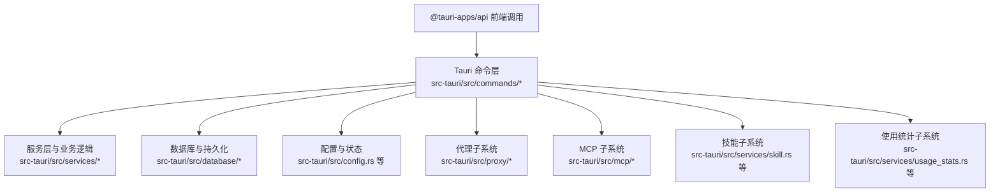
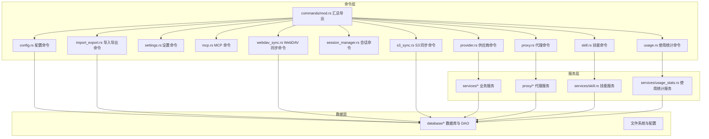
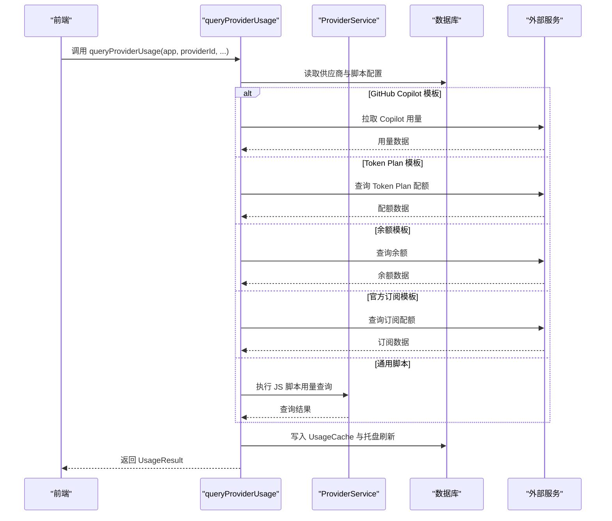
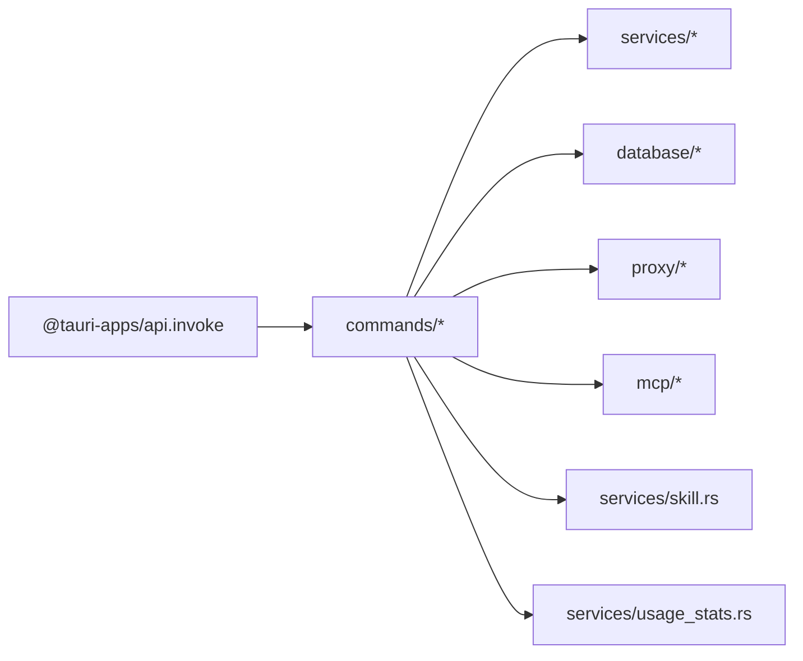

# Tauri 命令系统

<cite>
**本文引用的文件**
- [src-tauri/src/commands/mod.rs](file://src-tauri/src/commands/mod.rs)
- [src-tauri/src/main.rs](file://src-tauri/src/main.rs)
- [src-tauri/Cargo.toml](file://src-tauri/Cargo.toml)
- [src-tauri/src/commands/provider.rs](file://src-tauri/src/commands/provider.rs)
- [src-tauri/src/commands/proxy.rs](file://src-tauri/src/commands/proxy.rs)
- [src-tauri/src/commands/settings.rs](file://src-tauri/src/commands/settings.rs)
- [src-tauri/src/commands/mcp.rs](file://src-tauri/src/commands/mcp.rs)
- [src-tauri/src/commands/skill.rs](file://src-tauri/src/commands/skill.rs)
- [src-tauri/src/commands/session_manager.rs](file://src-tauri/src/commands/session_manager.rs)
- [src-tauri/src/commands/usage.rs](file://src-tauri/src/commands/usage.rs)
- [src-tauri/src/commands/config.rs](file://src-tauri/src/commands/config.rs)
- [src-tauri/src/commands/import_export.rs](file://src-tauri/src/commands/import_export.rs)
- [src-tauri/src/commands/webdav_sync.rs](file://src-tauri/src/commands/webdav_sync.rs)
- [src-tauri/src/commands/s3_sync.rs](file://src-tauri/src/commands/s3_sync.rs)
</cite>

## 目录
1. [简介](#简介)
2. [项目结构](#项目结构)
3. [核心组件](#核心组件)
4. [架构总览](#架构总览)
5. [详细组件分析](#详细组件分析)
6. [依赖关系分析](#依赖关系分析)
7. [性能考量](#性能考量)
8. [故障排查指南](#故障排查指南)
9. [结论](#结论)
10. [附录](#附录)

## 简介
本文件面向 CC Switch 的 Tauri 命令系统，系统性梳理命令定义的架构模式、模块组织、参数校验与返回值格式，并对供应商管理、代理服务、配置管理、设置管理、MCP 协议、技能管理、会话管理与使用统计等命令模块进行深入说明。文档还提供前端通过 @tauri-apps/api 调用后端命令的完整示例、错误处理机制、异步操作模式、命令生命周期与执行上下文、权限控制、扩展指南与性能优化建议。

## 项目结构
- 命令模块采用“按功能域划分”的组织方式，每个命令模块独立定义在 src-tauri/src/commands 下，通过 src-tauri/src/commands/mod.rs 汇总导出。
- 前端通过 @tauri-apps/api 的 invoke 调用后端命令，命令在 Rust 中以 #[tauri::command] 注解声明，接收 State、AppHandle 等上下文，返回 Result 类型。
- 应用入口位于 src-tauri/src/main.rs，初始化平台环境变量后调用 cc_switch_lib::run()。

图示来源
- [src-tauri/src/commands/mod.rs:1-69](file://src-tauri/src/commands/mod.rs#L1-L69)
- [src-tauri/src/main.rs:1-23](file://src-tauri/src/main.rs#L1-L23)

章节来源
- [src-tauri/src/commands/mod.rs:1-69](file://src-tauri/src/commands/mod.rs#L1-L69)
- [src-tauri/src/main.rs:1-23](file://src-tauri/src/main.rs#L1-L23)

## 核心组件
- 命令模块组织：commands/mod.rs 以模块化方式导出全部命令，便于按功能域维护与扩展。
- 命令注解与签名：#[tauri::command] 声明命令，支持 State、AppHandle、Option 参数与异步返回。
- 错误处理：统一返回 Result<T, String>，内部错误通过 AppError 转换为字符串，便于跨语言边界传递。
- 上下文注入：State<'_, AppState> 提供数据库、代理服务、缓存等共享资源；AppHandle 用于事件广播与系统交互。
- 异步与并发：大量命令使用 async/await，配合 tokio::spawn_blocking 处理阻塞任务，避免阻塞 UI 线程。

章节来源
- [src-tauri/src/commands/mod.rs:1-69](file://src-tauri/src/commands/mod.rs#L1-L69)
- [src-tauri/src/commands/provider.rs:1-800](file://src-tauri/src/commands/provider.rs#L1-L800)
- [src-tauri/src/commands/proxy.rs:1-449](file://src-tauri/src/commands/proxy.rs#L1-L449)
- [src-tauri/src/commands/settings.rs:1-458](file://src-tauri/src/commands/settings.rs#L1-L458)
- [src-tauri/src/commands/mcp.rs:1-208](file://src-tauri/src/commands/mcp.rs#L1-L208)
- [src-tauri/src/commands/skill.rs:1-337](file://src-tauri/src/commands/skill.rs#L1-L337)
- [src-tauri/src/commands/session_manager.rs:1-86](file://src-tauri/src/commands/session_manager.rs#L1-L86)
- [src-tauri/src/commands/usage.rs:1-314](file://src-tauri/src/commands/usage.rs#L1-L314)
- [src-tauri/src/commands/config.rs:1-399](file://src-tauri/src/commands/config.rs#L1-L399)
- [src-tauri/src/commands/import_export.rs:1-177](file://src-tauri/src/commands/import_export.rs#L1-L177)
- [src-tauri/src/commands/webdav_sync.rs:1-358](file://src-tauri/src/commands/webdav_sync.rs#L1-L358)
- [src-tauri/src/commands/s3_sync.rs:1-353](file://src-tauri/src/commands/s3_sync.rs#L1-L353)

## 架构总览
命令系统遵循“命令层-服务层-数据层”的分层架构：
- 命令层：负责参数解析、权限校验、异步调度与结果封装。
- 服务层：封装业务规则与算法，协调数据库与外部服务。
- 数据层：数据库访问、文件系统操作与配置读写。

图示来源
- [src-tauri/src/commands/mod.rs:1-69](file://src-tauri/src/commands/mod.rs#L1-L69)
- [src-tauri/src/commands/provider.rs:1-800](file://src-tauri/src/commands/provider.rs#L1-L800)
- [src-tauri/src/commands/proxy.rs:1-449](file://src-tauri/src/commands/proxy.rs#L1-L449)
- [src-tauri/src/commands/settings.rs:1-458](file://src-tauri/src/commands/settings.rs#L1-L458)
- [src-tauri/src/commands/mcp.rs:1-208](file://src-tauri/src/commands/mcp.rs#L1-L208)
- [src-tauri/src/commands/skill.rs:1-337](file://src-tauri/src/commands/skill.rs#L1-L337)
- [src-tauri/src/commands/session_manager.rs:1-86](file://src-tauri/src/commands/session_manager.rs#L1-L86)
- [src-tauri/src/commands/usage.rs:1-314](file://src-tauri/src/commands/usage.rs#L1-L314)
- [src-tauri/src/commands/config.rs:1-399](file://src-tauri/src/commands/config.rs#L1-L399)
- [src-tauri/src/commands/import_export.rs:1-177](file://src-tauri/src/commands/import_export.rs#L1-L177)
- [src-tauri/src/commands/webdav_sync.rs:1-358](file://src-tauri/src/commands/webdav_sync.rs#L1-L358)
- [src-tauri/src/commands/s3_sync.rs:1-353](file://src-tauri/src/commands/s3_sync.rs#L1-L353)

## 详细组件分析

### 供应商管理命令（provider.rs）
- 功能概览
  - 列表、当前供应商、新增、更新、删除、从 Live 移除、切换、导入默认配置、Claude Desktop 状态与路由导入、通用/模板化用量查询、脚本测试、自定义端点管理、排序更新、通用供应商管理等。
- 参数与返回
  - 大多数命令接收 app（AppType 字符串）、Provider 结构体或 id；返回 Result<T, String>。
  - 用量查询支持多模板类型（GitHub Copilot、Token Plan、余额、官方订阅）与通用 JS 脚本路径。
- 异步与并发
  - 用量查询与脚本测试使用 async/await；部分阻塞操作通过 spawn_blocking 执行。
- 错误处理
  - 内部 AppError 统一转为字符串；业务失败与传输失败分别处理并写入缓存与托盘刷新。
- 关键流程（用量查询）

图示来源
- [src-tauri/src/commands/provider.rs:373-648](file://src-tauri/src/commands/provider.rs#L373-L648)

章节来源
- [src-tauri/src/commands/provider.rs:1-800](file://src-tauri/src/commands/provider.rs#L1-L800)

### 代理服务命令（proxy.rs）
- 功能概览
  - 启停代理服务器、接管状态、代理配置（全局与应用级）、成本倍率与计费源、熔断器配置与统计、故障转移与自动切换、热切换供应商等。
- 参数与返回
  - 多数命令接收 State<'_, AppState> 与配置结构体；返回 Result<T, String>。
- 异步与并发
  - 代理状态查询、熔断器配置更新等涉及运行时内存状态，需与 ProxyService 协作。
- 错误处理
  - 启停代理前检查接管状态；热切换禁止官方供应商；熔断器重置后根据策略自动切换。

章节来源
- [src-tauri/src/commands/proxy.rs:1-449](file://src-tauri/src/commands/proxy.rs#L1-L449)

### 配置管理命令（config.rs）
- 功能概览
  - 获取各应用配置状态、打开配置目录、选择目录、读写通用配置片段（JSON/TOML 校验）、从设置提取片段等。
- 参数与返回
  - 大多接收 app 类型字符串或 State；返回 Result<T, String>。
- 校验与安全
  - 对不同应用类型进行 JSON/TOML 格式校验；空片段清空标记；迁移与同步逻辑确保一致性。

章节来源
- [src-tauri/src/commands/config.rs:1-399](file://src-tauri/src/commands/config.rs#L1-L399)

### 设置管理命令（settings.rs）
- 功能概览
  - 获取/保存设置、重启应用、开机自启、整流器/优化器/日志配置、WebDAV/S3 同步配置读写等。
- 参数与返回
  - 保存设置时进行敏感字段保护（密码不清空覆盖）；配置项含枚举值校验（如日志级别）。
- 生命周期
  - 重启应用采用后台延时重启，保证命令响应先返回。

章节来源
- [src-tauri/src/commands/settings.rs:1-458](file://src-tauri/src/commands/settings.rs#L1-L458)

### MCP 协议命令（mcp.rs）
- 功能概览
  - 获取 Claude MCP 状态、读取 mcp.json、新增/删除 MCP 服务器、命令可用性校验、统一管理（新增/删除/切换应用启用）。
- 参数与返回
  - 兼容旧 API 与新统一结构；统一结构使用 McpServer 定义。
- 生命周期
  - 服务器定义与应用启用状态持久化至数据库与配置文件。

章节来源
- [src-tauri/src/commands/mcp.rs:1-208](file://src-tauri/src/commands/mcp.rs#L1-L208)

### 技能管理命令（skill.rs）
- 功能概览
  - 统一管理：获取已安装技能、备份、安装/卸载、恢复、切换应用启用、扫描未管理技能、从应用导入、仓库管理、搜索 skills.sh、更新检查与更新、迁移存储位置、从 ZIP 安装等。
- 参数与返回
  - 多数命令接收 State 与 AppType；返回 Result<T, String>。
- 生命周期
  - 安装/卸载/更新均基于统一存储位置 ~/.cc-switch/skills/。

章节来源
- [src-tauri/src/commands/skill.rs:1-337](file://src-tauri/src/commands/skill.rs#L1-L337)

### 会话管理命令（session_manager.rs）
- 功能概览
  - 列出会话、加载消息、启动终端会话、删除单个/批量会话。
- 参数与返回
  - 多数命令使用 spawn_blocking 处理文件系统与进程启动；返回 Result<T, String>。
- 生命周期
  - 终端启动映射全局首选项，支持 macOS iTerm/iTerm2 映射。

章节来源
- [src-tauri/src/commands/session_manager.rs:1-86](file://src-tauri/src/commands/session_manager.rs#L1-L86)

### 使用统计命令（usage.rs）
- 功能概览
  - 汇总统计、按应用拆分、每日趋势、Provider/模型统计、请求日志、请求详情、模型定价 CRUD、限额检查、手动同步会话日志、数据来源分布。
- 参数与返回
  - 多数命令接收 State 与日期范围/过滤条件；返回 Result<T, AppError> 或序列化结构。
- 生命周期
  - 模型定价更新后回填历史用量成本；手动同步聚合多应用会话日志。

章节来源
- [src-tauri/src/commands/usage.rs:1-314](file://src-tauri/src/commands/usage.rs#L1-L314)

### 导入导出与同步命令（import_export.rs、webdav_sync.rs、s3_sync.rs）
- 导入导出
  - 导出/导入 SQL 备份、同步当前供应商 Live 配置、文件对话框、数据库备份管理。
- WebDAV 同步
  - 测试连接、上传/下载、保存设置、拉取远端信息；并发互斥锁保证同步一致性；错误状态持久化。
- S3 同步
  - 测试连接、上传/下载、保存设置、拉取远端信息；并发互斥锁保证同步一致性；错误状态持久化。

章节来源
- [src-tauri/src/commands/import_export.rs:1-177](file://src-tauri/src/commands/import_export.rs#L1-L177)
- [src-tauri/src/commands/webdav_sync.rs:1-358](file://src-tauri/src/commands/webdav_sync.rs#L1-L358)
- [src-tauri/src/commands/s3_sync.rs:1-353](file://src-tauri/src/commands/s3_sync.rs#L1-L353)

## 依赖关系分析
- 命令层依赖服务层与数据库层；服务层依赖配置与外部服务；代理、MCP、技能、使用统计等子系统相互独立但共享数据库。
- 前端通过 @tauri-apps/api 的 invoke 调用命令；命令层通过 State/AppHandle 访问后端资源。

图示来源
- [src-tauri/src/commands/mod.rs:1-69](file://src-tauri/src/commands/mod.rs#L1-L69)
- [src-tauri/Cargo.toml:25-82](file://src-tauri/Cargo.toml#L25-L82)

章节来源
- [src-tauri/Cargo.toml:25-82](file://src-tauri/Cargo.toml#L25-L82)

## 性能考量
- 异步与并发
  - 大量命令使用 async/await；阻塞任务通过 spawn_blocking 执行，避免阻塞 UI 线程。
  - WebDAV/S3 同步使用互斥锁串行化，防止并发冲突与资源竞争。
- I/O 与数据库
  - SQL 导入导出、备份管理、日志查询等操作应考虑分页与索引优化；模型定价 CRUD 注意批量回填成本的性能影响。
- 熔断与自动故障转移
  - 代理熔断器配置与自动切换减少故障传播，提升整体稳定性。
- 缓存与事件
  - 用量查询写入 UsageCache 并广播事件，前端可增量更新 UI，降低重复查询成本。

## 故障排查指南
- 常见错误类型
  - 参数解析失败：AppType.from_str 失败、JSON/TOML 格式错误、必填字段缺失。
  - 传输失败：网络异常、外部服务不可达、文件系统权限不足。
  - 业务失败：认证失败、配额不足、模板脚本执行异常。
- 排查步骤
  - 查看命令返回的错误字符串，定位失败阶段（解析/传输/业务）。
  - WebDAV/S3 同步：检查 enabled 状态、凭据与远端信息；查看 last_error 与 last_error_source。
  - 代理服务：确认接管状态、熔断器配置与自动故障转移策略。
  - 用量查询：核对模板类型与凭据解析逻辑，检查 UsageCache 与托盘刷新事件。
- 日志与状态
  - 设置日志级别与输出；通过状态接口获取运行时配置与统计信息。

章节来源
- [src-tauri/src/commands/webdav_sync.rs:1-358](file://src-tauri/src/commands/webdav_sync.rs#L1-L358)
- [src-tauri/src/commands/s3_sync.rs:1-353](file://src-tauri/src/commands/s3_sync.rs#L1-L353)
- [src-tauri/src/commands/proxy.rs:1-449](file://src-tauri/src/commands/proxy.rs#L1-L449)
- [src-tauri/src/commands/usage.rs:1-314](file://src-tauri/src/commands/usage.rs#L1-L314)

## 结论
CC Switch 的 Tauri 命令系统采用清晰的模块化组织与分层架构，命令层以 #[tauri::command] 统一声明，结合 State/AppHandle 实现强上下文能力；服务层封装业务规则，数据层保障持久化与一致性。系统在代理、MCP、技能、使用统计等关键领域提供了完善的命令集与错误处理机制，适合扩展与维护。

## 附录

### 命令调用示例（前端 via @tauri-apps/api）
- 基本调用模式
  - 前端通过 invoke 调用命令，传递参数对象，等待 Promise 解析。
  - 异步命令使用 await；阻塞操作由后端 spawn_blocking 执行。
- 参数传递格式
  - 命令参数通常为简单类型（字符串、数字、布尔）或结构体；复杂场景使用 JSON 序列化。
- 错误处理机制
  - 命令返回 Result<T, String>，前端捕获错误字符串并展示本地化提示。
- 异步操作模式
  - 大多数命令返回 Promise，前端可结合 loading 状态与错误提示优化用户体验。

### 命令生命周期与执行上下文
- 生命周期
  - 命令进入：参数解析与校验。
  - 执行：访问 State/AppHandle，调用服务层与数据库。
  - 返回：封装结果，必要时广播事件或写入缓存。
- 执行上下文
  - State<'_, AppState>：共享数据库、代理服务、缓存等。
  - AppHandle：事件广播、系统交互（如打开文件夹）。

### 权限控制
- 命令层不直接处理权限校验，权限控制通常在服务层或外部服务侧完成；命令层负责将错误信息透传给前端。

### 命令扩展指南
- 新增命令步骤
  - 在 src-tauri/src/commands 下新建模块或在现有模块添加命令。
  - 使用 #[tauri::command] 声明命令，接收 State/AppHandle 与参数，返回 Result<T, String>。
  - 在 commands/mod.rs 中导出命令。
  - 在服务层实现业务逻辑，必要时访问数据库与外部服务。
- 自定义命令开发
  - 保持参数与返回值的幂等性与可序列化。
  - 对外部 I/O 与耗时操作使用异步与互斥锁。
  - 记录错误与状态，便于前端与日志排查。

### 性能优化建议
- 使用 spawn_blocking 处理文件系统与阻塞 I/O。
- 对高频查询引入缓存与事件驱动更新。
- 合理设置代理熔断器与自动故障转移阈值。
- 对批量操作（如回填历史用量成本）分批执行并记录进度。