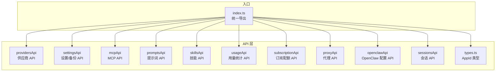
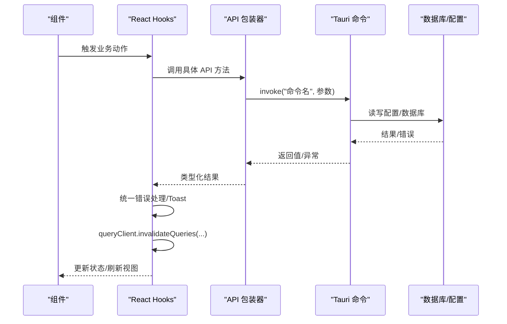
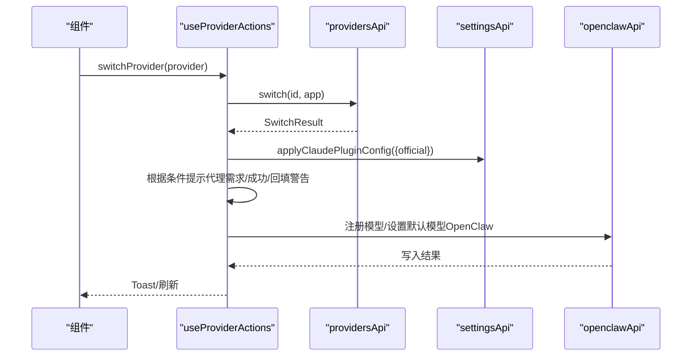
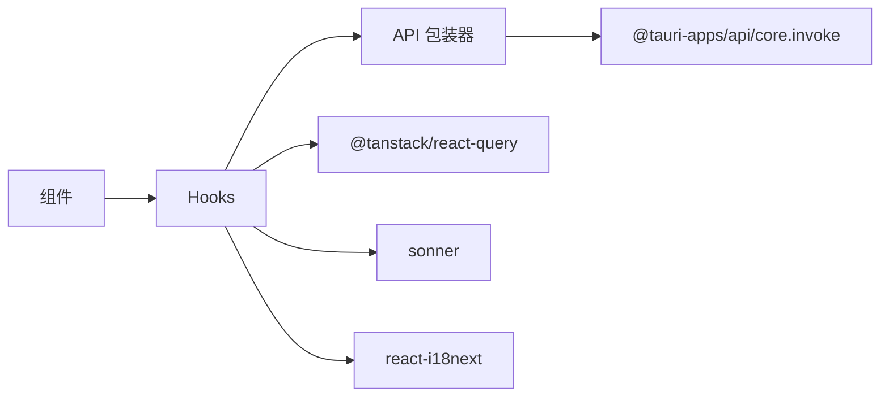

# 前端 API 包装器

<cite>
**本文引用的文件**   
- [src/lib/api/index.ts](file://src/lib/api/index.ts)
- [src/lib/api/providers.ts](file://src/lib/api/providers.ts)
- [src/lib/api/settings.ts](file://src/lib/api/settings.ts)
- [src/lib/api/mcp.ts](file://src/lib/api/mcp.ts)
- [src/lib/api/prompts.ts](file://src/lib/api/prompts.ts)
- [src/lib/api/skills.ts](file://src/lib/api/skills.ts)
- [src/lib/api/usage.ts](file://src/lib/api/usage.ts)
- [src/lib/api/subscription.ts](file://src/lib/api/subscription.ts)
- [src/lib/api/proxy.ts](file://src/lib/api/proxy.ts)
- [src/lib/api/openclaw.ts](file://src/lib/api/openclaw.ts)
- [src/lib/api/sessions.ts](file://src/lib/api/sessions.ts)
- [src/lib/api/types.ts](file://src/lib/api/types.ts)
- [src/hooks/useProviderActions.ts](file://src/hooks/useProviderActions.ts)
- [src/hooks/useProxyConfig.ts](file://src/hooks/useProxyConfig.ts)
- [src/hooks/useSettings.ts](file://src/hooks/useSettings.ts)
- [src/hooks/useMcp.ts](file://src/hooks/useMcp.ts)
</cite>

## 目录
1. [简介](#简介)
2. [项目结构](#项目结构)
3. [核心组件](#核心组件)
4. [架构总览](#架构总览)
5. [详细组件分析](#详细组件分析)
6. [依赖关系分析](#依赖关系分析)
7. [性能考量](#性能考量)
8. [故障排查指南](#故障排查指南)
9. [结论](#结论)
10. [附录](#附录)

## 简介
本文件面向 CC Switch 的前端 API 包装器，系统性阐述其设计模式与实现要点，包括类型安全的 API 调用、自动类型推断、错误处理机制等。文档覆盖供应商、代理、配置、MCP、技能、用量、订阅、工作区、会话等模块的 API 方法清单与行为说明，并详解 React Hooks 的使用方式（如 useProviderActions、useProxyConfig、useSettings、useMcp），包括状态管理、缓存策略与重新获取机制。同时提供实际使用路径与最佳实践，帮助开发者在组件中正确、高效地集成与扩展。

## 项目结构
前端 API 包装器位于 src/lib/api 下，按功能域拆分模块，每个模块导出一个命名空间式对象（如 providersApi、settingsApi），内部封装对 Tauri 命令的调用，统一返回类型并通过类型文件进行约束。入口 index.ts 汇总导出所有 API 命名空间与类型别名，便于全局引入。

**图表来源**
- [src/lib/api/index.ts:1-31](file://src/lib/api/index.ts#L1-L31)
- [src/lib/api/types.ts:1-10](file://src/lib/api/types.ts#L1-L10)

**章节来源**
- [src/lib/api/index.ts:1-31](file://src/lib/api/index.ts#L1-L31)
- [src/lib/api/types.ts:1-10](file://src/lib/api/types.ts#L1-L10)

## 核心组件
- 类型安全与自动类型推断
  - 统一使用 AppId 作为应用标识，确保跨模块一致性。
  - 所有 API 方法通过 invoke 调用后端命令，返回值在模块内定义接口，前端自动推断类型。
- 错误处理机制
  - API 层直接抛错或返回结构化结果，上层 Hook 与业务组件负责统一提示与降级。
  - 提供错误提取工具与国际化提示，保证用户体验一致。
- 缓存与重新获取
  - 通过 React Query 的 queryClient.invalidateQueries 实现细粒度缓存失效，确保数据一致性。
  - 钩子层在关键操作后主动失效相关查询键，避免脏读。

**章节来源**
- [src/lib/api/types.ts:1-10](file://src/lib/api/types.ts#L1-L10)
- [src/hooks/useSettings.ts:131-177](file://src/hooks/useSettings.ts#L131-L177)
- [src/hooks/useProviderActions.ts:306-333](file://src/hooks/useProviderActions.ts#L306-L333)

## 架构总览
前端通过 API 包装器调用 Tauri 命令，完成对后端数据库、配置文件与外部服务的操作。React Query 负责缓存与状态管理，Hooks 将业务逻辑与 UI 解耦，形成“类型安全 + 自动推断 + 统一错误处理 + 缓存失效”的闭环。

**图表来源**
- [src/hooks/useSettings.ts:181-305](file://src/hooks/useSettings.ts#L181-L305)
- [src/hooks/useProviderActions.ts:72-131](file://src/hooks/useProviderActions.ts#L72-L131)
- [src/hooks/useMcp.ts:19-74](file://src/hooks/useMcp.ts#L19-L74)

## 详细组件分析

### 供应商 API（providersApi）
- 功能概览
  - 提供供应商的增删改查、排序、切换、事件监听、终端打开、从各应用 live 配置导入等能力。
- 关键方法与行为
  - getAll/getCurrent/add/update/delete/switch/importDefault/importClaudeDesktopFromClaude/ensureClaudeDesktopOfficialProvider/getClaudeDesktopStatus/getClaudeDesktopDefaultRoutes/updateTrayMenu/updateSortOrder/onSwitched/openTerminal/importOpenCodeFromLive/getOpenCodeLiveProviderIds/getOpenClawLiveProviderIds/getHermesLiveProviderIds/importOpenClawFromLive/importHermesFromLive
- 参数与返回
  - 参数均通过 invoke 传递，返回布尔或结构化对象；部分方法支持可选参数（如 addToLive、originalId、cwd 等）。
- 错误处理
  - 失败时由上层 Hook 捕获并提示；切换供应商时根据条件弹出代理需求警告。
- 使用建议
  - 切换供应商后及时失效相关查询键，避免缓存不一致。
  - 导入 live 配置后需刷新托盘菜单与健康状态。

**图表来源**
- [src/hooks/useProviderActions.ts:152-283](file://src/hooks/useProviderActions.ts#L152-L283)
- [src/lib/api/providers.ts:90-123](file://src/lib/api/providers.ts#L90-L123)
- [src/lib/api/settings.ts:83-96](file://src/lib/api/settings.ts#L83-L96)
- [src/lib/api/openclaw.ts:28-74](file://src/lib/api/openclaw.ts#L28-L74)

**章节来源**
- [src/lib/api/providers.ts:49-199](file://src/lib/api/providers.ts#L49-L199)
- [src/hooks/useProviderActions.ts:72-131](file://src/hooks/useProviderActions.ts#L72-L131)
- [src/hooks/useProviderActions.ts:152-283](file://src/hooks/useProviderActions.ts#L152-L283)

### 代理 API（proxyApi）
- 功能概览
  - 控制代理服务器启停、查询状态、接管模式开关、全局与应用级代理配置、计费默认配置等。
- 关键方法与行为
  - startProxyServer/stopProxyWithRestore/getProxyStatus/isProxyRunning/isLiveTakeoverActive/switchProxyProvider/getProxyTakeoverStatus/setProxyTakeoverForApp/getProxyConfig/updateProxyConfig/getGlobalProxyConfig/updateGlobalProxyConfig/getProxyConfigForApp/updateProxyConfigForApp/getDefaultCostMultiplier/setDefaultCostMultiplier/getPricingModelSource/setPricingModelSource
- 参数与返回
  - 多数方法接受配置对象或布尔值，返回状态对象或布尔结果。
- 错误处理
  - 启停与状态查询失败时由上层 Hook 统一提示。
- 使用建议
  - 切换供应商前检查代理运行状态与接管模式，避免官方供应商被拦截。

**章节来源**
- [src/lib/api/proxy.ts:11-121](file://src/lib/api/proxy.ts#L11-L121)
- [src/hooks/useProxyConfig.ts:14-49](file://src/hooks/useProxyConfig.ts#L14-L49)

### 设置与备份 API（settingsApi/backupsApi）
- 功能概览
  - 读取/保存应用设置、目录管理、插件配置、文件导入导出、WebDAV/S3 同步、工具版本探测与生命周期操作、日志/优化器/校正器配置、便携模式检测、重启等；备份 API 提供数据库备份与恢复。
- 关键方法与行为
  - get/save/restart/checkUpdates/isPortable/getConfigDir/openConfigFolder/pickDirectory/selectConfigDirectory/getClaudeCodeConfigPath/getAppConfigPath/openAppConfigFolder/getAppConfigDirOverride/setAppConfigDirOverride/applyClaudePluginConfig/applyClaudeOnboardingSkip/clearClaudeOnboardingSkip/saveFileDialog/openFileDialog/exportConfigToFile/importConfigFromFile/webdavTestConnection/webdavSyncUpload/webdavSyncDownload/webdavSyncSaveSettings/webdavSyncFetchRemoteInfo/s3TestConnection/s3SyncUpload/s3SyncDownload/s3SyncSaveSettings/s3SyncFetchRemoteInfo/syncCurrentProvidersLive/openExternal/setAutoLaunch/getAutoLaunchStatus/getToolVersions/runToolLifecycleAction/probeToolInstallations/getRectifierConfig/setRectifierConfig/getOptimizerConfig/setOptimizerConfig/getLogConfig/setLogConfig/createDbBackup/listDbBackups/restoreDbBackup/renameDbBackup/deleteDbBackup
- 参数与返回
  - 多为结构化配置对象，返回布尔或结构化结果；URL 校验严格，仅允许 http/https。
- 错误处理
  - 保存失败统一提示；同步失败记录警告并提示。
- 使用建议
  - 修改开机自启、目录覆盖等系统级设置时，注意调用对应系统 API 并处理异常。

**章节来源**
- [src/lib/api/settings.ts:26-350](file://src/lib/api/settings.ts#L26-L350)
- [src/hooks/useSettings.ts:181-484](file://src/hooks/useSettings.ts#L181-L484)

### MCP API（mcpApi）
- 功能概览
  - 统一管理 MCP 服务器（新增 v3.7.0+），支持获取、添加/更新、删除、按应用启用/禁用、从所有应用导入。
- 关键方法与行为
  - getStatus/readConfig/upsertServer/deleteServer/validateCommand/getAllServers/upsertUnifiedServer/deleteUnifiedServer/toggleApp/importFromApps
- 参数与返回
  - 支持统一服务器结构与应用维度开关；导入返回迁移数量。
- 错误处理
  - 失败时由上层 Hook 统一提示。
- 使用建议
  - 成功后统一失效查询键，确保 UI 即时反映变更。

**章节来源**
- [src/lib/api/mcp.ts:11-130](file://src/lib/api/mcp.ts#L11-L130)
- [src/hooks/useMcp.ts:9-75](file://src/hooks/useMcp.ts#L9-L75)

### 提示词 API（promptsApi）
- 功能概览
  - 获取、增删改、启用、从文件导入、读取当前文件内容。
- 关键方法与行为
  - getPrompts/upsertPrompt/deletePrompt/enablePrompt/importFromFile/getCurrentFileContent
- 参数与返回
  - 以应用维度区分，返回提示词映射或空结果。
- 使用建议
  - 导入后刷新当前文件内容，避免缓存不一致。

**章节来源**
- [src/lib/api/prompts.ts:14-39](file://src/lib/api/prompts.ts#L14-L39)

### 技能 API（skillsApi）
- 功能概览
  - 统一管理已安装/可发现/未管理技能，支持安装、卸载、备份恢复、应用启用切换、扫描导入、仓库管理、ZIP 安装、存储位置迁移、搜索 skills.sh 等。
- 关键方法与行为
  - getInstalled/getBackups/deleteBackup/installUnified/uninstallUnified/restoreBackup/toggleApp/scanUnmanaged/importFromApps/discoverAvailable/checkUpdates/updateSkill/migrateStorage/searchSkillsSh/getAll/install/uninstall/getRepos/addRepo/removeRepo/openZipFileDialog/installFromZip
- 参数与返回
  - 统一结构体与应用维度开关；迁移返回统计结果。
- 使用建议
  - 卸载/更新后刷新相关查询键，确保 UI 与后端状态一致。

**章节来源**
- [src/lib/api/skills.ts:136-284](file://src/lib/api/skills.ts#L136-L284)

### 用量与订阅 API（usageApi/subscriptionApi）
- 用量 API
  - query/testScript/getUsageSummary/getUsageSummaryByApp/getUsageTrends/getProviderStats/getModelStats/getRequestLogs/getRequestDetail/getModelPricing/updateModelPricing/deleteModelPricing/checkProviderLimits/syncSessionUsage/getDataSourceBreakdown
- 订阅 API
  - getQuota/getCodexOauthQuota/getCodingPlanQuota/getBalance
- 使用建议
  - 测试脚本时传入超时与凭据参数，避免长时间阻塞；用量查询后失效相关缓存键。

**章节来源**
- [src/lib/api/usage.ts:20-148](file://src/lib/api/usage.ts#L20-L148)
- [src/lib/api/subscription.ts:4-20](file://src/lib/api/subscription.ts#L4-L20)

### OpenClaw 配置 API（openclawApi）
- 功能概览
  - 管理 agents.defaults（默认模型、模型目录）、env（环境变量）、tools（权限）等配置段落。
- 关键方法与行为
  - getDefaultModel/setDefaultModel/getModelCatalog/setModelCatalog/getAgentsDefaults/setAgentsDefaults/getEnv/setEnv/getTools/setTools/scanHealth/getLiveProvider
- 使用建议
  - 写入后失效相关查询键，确保健康检查与默认模型状态即时更新。

**章节来源**
- [src/lib/api/openclaw.ts:20-122](file://src/lib/api/openclaw.ts#L20-L122)

### 会话 API（sessionsApi）
- 功能概览
  - 列出会话、获取消息、删除单个/批量会话、启动终端。
- 关键方法与行为
  - list/getMessages/delete/deleteMany/launchTerminal
- 使用建议
  - 删除后刷新列表，避免重复删除或误操作。

**章节来源**
- [src/lib/api/sessions.ts:15-55](file://src/lib/api/sessions.ts#L15-L55)

### React Hooks 使用指南

#### useProviderActions
- 职责
  - 封装供应商的增删改查与切换逻辑，处理业务规则（如代理需求、官方供应商拦截、Claude 插件同步、OpenClaw 模型注册与默认模型设置）。
- 状态与缓存
  - 通过 React Query 的 mutations 管理加载状态；成功后失效相关查询键，确保 UI 与后端一致。
- 重新获取机制
  - 切换/更新/删除后主动失效 providers、usage、subscription 等相关键。
- 最佳实践
  - 在切换前检查代理状态与接管模式；OpenClaw 成功注册模型后提示用户。

**章节来源**
- [src/hooks/useProviderActions.ts:31-393](file://src/hooks/useProviderActions.ts#L31-L393)

#### useProxyConfig
- 职责
  - 管理代理配置的读取与更新，统一提示保存成功/失败。
- 状态与缓存
  - 查询键为 ["proxyConfig"]，更新成功后同时失效 ["proxyConfig"] 与 ["proxyStatus"]。
- 最佳实践
  - 更新后立即刷新状态，避免旧配置误导。

**章节来源**
- [src/hooks/useProxyConfig.ts:14-49](file://src/hooks/useProxyConfig.ts#L14-L49)

#### useSettings
- 职责
  - 组合设置表单、目录管理、元数据（便携模式、重启需求）与保存逻辑；支持自动保存与完整保存两种模式。
- 状态与缓存
  - 通过 queryClient.getQueryData 捕获变更前状态，避免闭包滞后；保存后统一失效相关键。
- 重新获取机制
  - 修改开机自启、目录覆盖、插件集成等后调用系统 API 并刷新托盘菜单。
- 最佳实践
  - 目录变更时优先考虑同步当前供应商 live 配置，避免不同步导致的配置漂移。

**章节来源**
- [src/hooks/useSettings.ts:62-512](file://src/hooks/useSettings.ts#L62-L512)

#### useMcp
- 职责
  - 提供查询所有 MCP 服务器、添加/更新、删除、按应用启用/禁用、从所有应用导入的 Mutation。
- 状态与缓存
  - 成功后统一失效 ["mcp","all"] 查询键。
- 最佳实践
  - 导入后刷新列表，确保 UI 与后端一致。

**章节来源**
- [src/hooks/useMcp.ts:9-75](file://src/hooks/useMcp.ts#L9-L75)

## 依赖关系分析
- 模块内聚与耦合
  - 各 API 模块相对独立，仅在入口 index.ts 汇总导出，降低耦合。
- 外部依赖
  - @tauri-apps/api/core 用于 invoke 调用后端命令；@tanstack/react-query 用于缓存与状态管理；sonner 用于 Toast 提示；react-i18next 用于国际化。
- 查询键约定
  - 采用 ["模块","键"] 或 ["模块","子键","id"] 的命名规范，便于精确失效与缓存隔离。

**图表来源**
- [src/hooks/useSettings.ts:64-66](file://src/hooks/useSettings.ts#L64-L66)
- [src/hooks/useProviderActions.ts:5-21](file://src/hooks/useProviderActions.ts#L5-L21)
- [src/hooks/useMcp.ts:1-4](file://src/hooks/useMcp.ts#L1-L4)

**章节来源**
- [src/hooks/useSettings.ts:64-66](file://src/hooks/useSettings.ts#L64-L66)
- [src/hooks/useProviderActions.ts:5-21](file://src/hooks/useProviderActions.ts#L5-L21)
- [src/hooks/useMcp.ts:1-4](file://src/hooks/useMcp.ts#L1-L4)

## 性能考量
- 缓存策略
  - 使用 React Query 的查询键与失效机制，避免全量刷新；仅在关键操作后失效相关键。
- 并发与节流
  - 对频繁触发的保存操作（如自动保存）应合并请求，减少无效调用。
- 错误降级
  - 对网络/外部服务失败场景，提供本地兜底与重试策略，避免阻塞主流程。
- 数据一致性
  - 在写入后统一失效相关查询键，确保后续读取命中最新数据。

[本节为通用指导，无需列出具体文件来源]

## 故障排查指南
- 常见问题
  - 代理未运行导致供应商切换失败：检查代理状态与接管模式，必要时启动代理。
  - 官方供应商被拦截：在代理接管模式下禁止切换至官方供应商。
  - 设置保存失败：查看错误提示，确认权限与路径有效性。
  - MCP/技能导入失败：检查后端日志与网络连接，重试导入。
- 定位手段
  - 查看 Toast 提示与控制台日志；确认查询键是否正确失效；核对参数类型与必填项。
- 修复建议
  - 重新获取缓存、刷新状态；必要时回滚配置并重试；联系支持获取进一步帮助。

**章节来源**
- [src/hooks/useProviderActions.ts:210-230](file://src/hooks/useProviderActions.ts#L210-L230)
- [src/hooks/useSettings.ts:293-302](file://src/hooks/useSettings.ts#L293-L302)
- [src/hooks/useMcp.ts:23-47](file://src/hooks/useMcp.ts#L23-L47)

## 结论
CC Switch 的前端 API 包装器以类型安全为核心，结合自动类型推断与统一错误处理，构建了稳定可靠的交互层。通过 React Query 的缓存与失效机制，配合 Hooks 的业务封装，实现了良好的开发体验与运行效率。建议在实际使用中遵循查询键约定、在关键操作后主动失效缓存，并充分利用国际化与提示系统提升用户体验。

[本节为总结性内容，无需列出具体文件来源]

## 附录

### API 方法清单（按模块）
- 供应商 API（providersApi）
  - getAll/getCurrent/add/update/delete/switch/importDefault/importClaudeDesktopFromClaude/ensureClaudeDesktopOfficialProvider/getClaudeDesktopStatus/getClaudeDesktopDefaultRoutes/updateTrayMenu/updateSortOrder/onSwitched/openTerminal/importOpenCodeFromLive/getOpenCodeLiveProviderIds/getOpenClawLiveProviderIds/getHermesLiveProviderIds/importOpenClawFromLive/importHermesFromLive
- 代理 API（proxyApi）
  - startProxyServer/stopProxyWithRestore/getProxyStatus/isProxyRunning/isLiveTakeoverActive/switchProxyProvider/getProxyTakeoverStatus/setProxyTakeoverForApp/getProxyConfig/updateProxyConfig/getGlobalProxyConfig/updateGlobalProxyConfig/getProxyConfigForApp/updateProxyConfigForApp/getDefaultCostMultiplier/setDefaultCostMultiplier/getPricingModelSource/setPricingModelSource
- 设置与备份 API（settingsApi/backupsApi）
  - get/save/restart/checkUpdates/isPortable/getConfigDir/openConfigFolder/pickDirectory/selectConfigDirectory/getClaudeCodeConfigPath/getAppConfigPath/openAppConfigFolder/getAppConfigDirOverride/setAppConfigDirOverride/applyClaudePluginConfig/applyClaudeOnboardingSkip/clearClaudeOnboardingSkip/saveFileDialog/openFileDialog/exportConfigToFile/importConfigFromFile/webdavTestConnection/webdavSyncUpload/webdavSyncDownload/webdavSyncSaveSettings/webdavSyncFetchRemoteInfo/s3TestConnection/s3SyncUpload/s3SyncDownload/s3SyncSaveSettings/s3SyncFetchRemoteInfo/syncCurrentProvidersLive/openExternal/setAutoLaunch/getAutoLaunchStatus/getToolVersions/runToolLifecycleAction/probeToolInstallations/getRectifierConfig/setRectifierConfig/getOptimizerConfig/setOptimizerConfig/getLogConfig/setLogConfig/createDbBackup/listDbBackups/restoreDbBackup/renameDbBackup/deleteDbBackup
- MCP API（mcpApi）
  - getStatus/readConfig/upsertServer/deleteServer/validateCommand/getAllServers/upsertUnifiedServer/deleteUnifiedServer/toggleApp/importFromApps
- 提示词 API（promptsApi）
  - getPrompts/upsertPrompt/deletePrompt/enablePrompt/importFromFile/getCurrentFileContent
- 技能 API（skillsApi）
  - getInstalled/getBackups/deleteBackup/installUnified/uninstallUnified/restoreBackup/toggleApp/scanUnmanaged/importFromApps/discoverAvailable/checkUpdates/updateSkill/migrateStorage/searchSkillsSh/getAll/install/uninstall/getRepos/addRepo/removeRepo/openZipFileDialog/installFromZip
- 用量 API（usageApi）
  - query/testScript/getUsageSummary/getUsageSummaryByApp/getUsageTrends/getProviderStats/getModelStats/getRequestLogs/getRequestDetail/getModelPricing/updateModelPricing/deleteModelPricing/checkProviderLimits/syncSessionUsage/getDataSourceBreakdown
- 订阅 API（subscriptionApi）
  - getQuota/getCodexOauthQuota/getCodingPlanQuota/getBalance
- OpenClaw 配置 API（openclawApi）
  - getDefaultModel/setDefaultModel/getModelCatalog/setModelCatalog/getAgentsDefaults/setAgentsDefaults/getEnv/setEnv/getTools/setTools/scanHealth/getLiveProvider
- 会话 API（sessionsApi）
  - list/getMessages/delete/deleteMany/launchTerminal

**章节来源**
- [src/lib/api/providers.ts:49-199](file://src/lib/api/providers.ts#L49-L199)
- [src/lib/api/proxy.ts:11-121](file://src/lib/api/proxy.ts#L11-L121)
- [src/lib/api/settings.ts:26-350](file://src/lib/api/settings.ts#L26-L350)
- [src/lib/api/mcp.ts:11-130](file://src/lib/api/mcp.ts#L11-L130)
- [src/lib/api/prompts.ts:14-39](file://src/lib/api/prompts.ts#L14-L39)
- [src/lib/api/skills.ts:136-284](file://src/lib/api/skills.ts#L136-L284)
- [src/lib/api/usage.ts:20-148](file://src/lib/api/usage.ts#L20-L148)
- [src/lib/api/subscription.ts:4-20](file://src/lib/api/subscription.ts#L4-L20)
- [src/lib/api/openclaw.ts:20-122](file://src/lib/api/openclaw.ts#L20-L122)
- [src/lib/api/sessions.ts:15-55](file://src/lib/api/sessions.ts#L15-L55)

### Hooks 使用路径参考
- useProviderActions：[src/hooks/useProviderActions.ts:31-393](file://src/hooks/useProviderActions.ts#L31-L393)
- useProxyConfig：[src/hooks/useProxyConfig.ts:14-49](file://src/hooks/useProxyConfig.ts#L14-L49)
- useSettings：[src/hooks/useSettings.ts:62-512](file://src/hooks/useSettings.ts#L62-L512)
- useMcp：[src/hooks/useMcp.ts:9-75](file://src/hooks/useMcp.ts#L9-L75)

**章节来源**
- [src/hooks/useProviderActions.ts:31-393](file://src/hooks/useProviderActions.ts#L31-L393)
- [src/hooks/useProxyConfig.ts:14-49](file://src/hooks/useProxyConfig.ts#L14-L49)
- [src/hooks/useSettings.ts:62-512](file://src/hooks/useSettings.ts#L62-L512)
- [src/hooks/useMcp.ts:9-75](file://src/hooks/useMcp.ts#L9-L75)