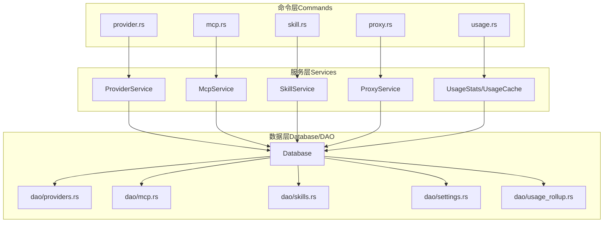
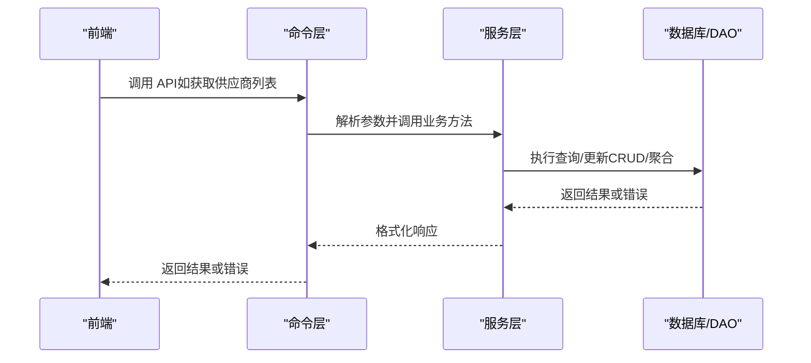
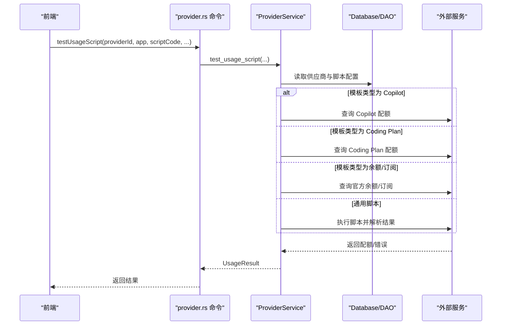
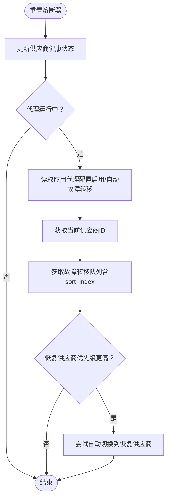
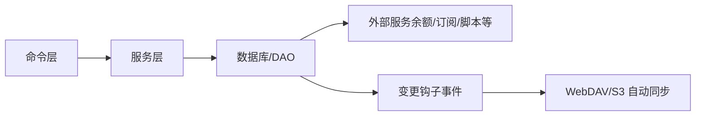

# 后端服务接口

<cite>
**本文引用的文件**
- [Cargo.toml](file://src-tauri/Cargo.toml)
- [main.rs](file://src-tauri/src/main.rs)
- [lib.rs](file://src-tauri/src/lib.rs)
- [commands/mod.rs](file://src-tauri/src/commands/mod.rs)
- [commands/provider.rs](file://src-tauri/src/commands/provider.rs)
- [commands/mcp.rs](file://src-tauri/src/commands/mcp.rs)
- [commands/skill.rs](file://src-tauri/src/commands/skill.rs)
- [commands/proxy.rs](file://src-tauri/src/commands/proxy.rs)
- [commands/usage.rs](file://src-tauri/src/commands/usage.rs)
- [services/mod.rs](file://src-tauri/src/services/mod.rs)
- [database/mod.rs](file://src-tauri/src/database/mod.rs)
</cite>

## 目录
1. [简介](#简介)
2. [项目结构](#项目结构)
3. [核心组件](#核心组件)
4. [架构总览](#架构总览)
5. [详细组件分析](#详细组件分析)
6. [依赖分析](#依赖分析)
7. [性能考虑](#性能考虑)
8. [故障排查指南](#故障排查指南)
9. [结论](#结论)
10. [附录](#附录)

## 简介
本文件面向 CC Switch 的后端服务接口，系统性梳理其服务层架构、DAO 层设计与事务管理策略，覆盖供应商、代理、配置、MCP、技能、使用统计与模型定价等模块。文档提供服务间依赖关系、事件驱动机制与异步处理模式说明，并给出扩展指南、自定义服务开发建议与性能监控要点，帮助开发者快速理解并高效集成。

## 项目结构
后端采用 Rust + Tauri 架构，命令层（commands）通过 #[tauri::command] 注解暴露 API，服务层（services）封装业务逻辑，DAO 层（database.dao）负责数据持久化，整体通过 AppState 在应用生命周期内注入与共享。

图表来源
- [commands/mod.rs:1-69](file://src-tauri/src/commands/mod.rs#L1-L69)
- [services/mod.rs:1-47](file://src-tauri/src/services/mod.rs#L1-L47)
- [database/mod.rs:1-273](file://src-tauri/src/database/mod.rs#L1-L273)

章节来源
- [Cargo.toml:1-110](file://src-tauri/Cargo.toml#L1-L110)
- [main.rs:1-23](file://src-tauri/src/main.rs#L1-L23)
- [lib.rs:1-800](file://src-tauri/src/lib.rs#L1-L800)
- [commands/mod.rs:1-69](file://src-tauri/src/commands/mod.rs#L1-L69)
- [services/mod.rs:1-47](file://src-tauri/src/services/mod.rs#L1-L47)
- [database/mod.rs:1-273](file://src-tauri/src/database/mod.rs#L1-L273)

## 核心组件
- 命令层（Commands）：以 #[tauri::command] 暴露的 API，负责参数解析、校验与错误包装，调用服务层完成业务处理。
- 服务层（Services）：封装业务规则与流程编排，如供应商切换、MCP 管理、技能安装、代理配置与使用统计。
- 数据层（Database/DAO）：基于 SQLite 的持久化，提供表结构、迁移、备份与 DAO 方法，支持并发安全与变更通知。
- 应用状态（AppState）：集中注入数据库、服务实例与插件，贯穿命令与服务调用链。

章节来源
- [lib.rs:1-800](file://src-tauri/src/lib.rs#L1-L800)
- [services/mod.rs:1-47](file://src-tauri/src/services/mod.rs#L1-L47)
- [database/mod.rs:1-273](file://src-tauri/src/database/mod.rs#L1-L273)

## 架构总览
后端通过 Tauri 插件体系初始化日志、存储、窗口状态等能力，随后在 setup 阶段完成数据库初始化、Schema 迁移、默认数据导入与自动同步任务。命令层通过 State 持有的 AppState 访问服务与数据库，服务层内部协调 DAO 与外部服务（如余额查询、订阅配额、编码计划等）。

图表来源
- [lib.rs:300-800](file://src-tauri/src/lib.rs#L300-L800)
- [commands/provider.rs:21-800](file://src-tauri/src/commands/provider.rs#L21-L800)
- [services/mod.rs:1-47](file://src-tauri/src/services/mod.rs#L1-L47)
- [database/mod.rs:92-160](file://src-tauri/src/database/mod.rs#L92-L160)

## 详细组件分析

### 供应商服务（ProviderService）
职责
- 提供供应商的增删改查、排序、当前供应商切换、从 Live 配置导入、与 Claude Desktop 的映射导入、自定义端点管理、使用脚本测试与额度查询等。

关键接口（命令层）
- 获取供应商列表、当前供应商、新增/更新/删除供应商、从 Live 移除、切换供应商、导入默认配置、测试端点延迟、自定义端点增删与最近使用更新、统一通用供应商的增删改查、批量更新排序等。
- 使用脚本测试与额度查询支持多种模板类型（GitHub Copilot、Coding Plan、官方余额、官方订阅）。

参数与返回
- 大多数命令接收 app（AppType 字符串）与 Provider 结构体，返回布尔或结构化结果；错误统一包装为字符串。
- 额度查询返回 UsageResult，包含 success、data（可选）、error（可选）。

异常处理
- 对数据库读取、服务调用、外部 API 查询失败进行捕获与包装，必要时写入 UsageCache 并触发托盘刷新。

图表来源
- [commands/provider.rs:650-680](file://src-tauri/src/commands/provider.rs#L650-L680)
- [commands/provider.rs:373-411](file://src-tauri/src/commands/provider.rs#L373-L411)

章节来源
- [commands/provider.rs:21-800](file://src-tauri/src/commands/provider.rs#L21-L800)

### 代理服务（ProxyService）
职责
- 管理本地代理服务器的启停、接管状态、全局与应用级代理配置、熔断器配置与统计、供应商健康状态与自动故障转移、成本倍率与计费模型来源设置等。

关键接口（命令层）
- 启停代理服务器、获取状态与配置、更新配置、获取/设置默认成本倍率、获取/设置计费模型来源、切换代理目标供应商（热切换）、重置熔断器并自动回切、获取熔断器配置与更新等。

异步与事件
- 代理运行期间通过熔断器与故障转移队列动态切换供应商；重置熔断器后若恢复供应商优先级更高，自动回切。

图表来源
- [commands/proxy.rs:321-402](file://src-tauri/src/commands/proxy.rs#L321-L402)

章节来源
- [commands/proxy.rs:1-449](file://src-tauri/src/commands/proxy.rs#L1-L449)

### 配置服务（ConfigService）
职责
- 统一配置管理，包括应用级与全局代理配置、MCP 服务器统一结构管理、通用设置读写等。

关键接口（命令层）
- 获取/更新全局代理配置、获取/更新指定应用代理配置、获取/设置默认成本倍率、获取/设置计费模型来源等。

章节来源
- [commands/proxy.rs:86-147](file://src-tauri/src/commands/proxy.rs#L86-L147)
- [services/mod.rs:1-47](file://src-tauri/src/services/mod.rs#L1-L47)

### MCP 服务（McpService）
职责
- 管理跨应用的 MCP 服务器配置，支持统一结构与按应用启用/禁用，提供从各应用导入的能力。

关键接口（命令层）
- 获取/新增/删除 MCP 服务器（统一结构）、切换服务器在指定应用的启用状态、从所有应用导入 MCP 服务器等。

章节来源
- [commands/mcp.rs:1-208](file://src-tauri/src/commands/mcp.rs#L1-L208)
- [services/mod.rs:1-47](file://src-tauri/src/services/mod.rs#L1-L47)

### 技能服务（SkillService）
职责
- 统一管理技能仓库与安装，支持扫描未管理技能、从应用目录导入、安装/卸载、更新、备份与恢复、存储位置迁移、搜索 skills.sh 等。

关键接口（命令层）
- 获取已安装技能、备份列表、删除备份、统一安装/卸载、切换应用启用状态、扫描未管理技能、从应用导入、发现可用技能、检查更新、更新单个技能、迁移存储位置、搜索 skills.sh、仓库增删等。

章节来源
- [commands/skill.rs:1-337](file://src-tauri/src/commands/skill.rs#L1-L337)
- [services/mod.rs:1-47](file://src-tauri/src/services/mod.rs#L1-L47)

### 使用统计与模型定价（Usage/Model Pricing）
职责
- 提供使用量汇总、按应用拆分汇总、每日趋势、Provider/模型统计、请求日志分页查询与详情、模型定价维护、手动触发会话日志同步、数据来源分布等。

关键接口（命令层）
- 获取汇总/趋势/统计、请求日志分页与详情、获取/更新/删除模型定价、检查 Provider 限额、手动同步会话使用、获取数据来源分布等。

参数校验与异常
- 更新模型定价时对模型 ID、显示名与价格进行非空与非负校验，失败返回本地化错误。

章节来源
- [commands/usage.rs:1-314](file://src-tauri/src/commands/usage.rs#L1-L314)
- [services/mod.rs:1-47](file://src-tauri/src/services/mod.rs#L1-L47)

### 数据库 DAO 层设计
架构与事务
- Database 封装 Mutex<Connection> 以支持多线程共享；启用外键与增量自动收缩；初始化时创建表、应用迁移、预迁移备份、清理与空间回收。
- DAO 方法通过 impl Database 提供，使用 lock_conn! 宏安全获取锁，避免 panic；变更钩子触发 WebDAV/S3 自动同步通知。

CRUD 与查询优化
- 提供表级空状态检查（如 MCP、提示词表），支持内存数据库（测试）；提供增量自动收缩与 VACUUM 保障空间回收。
- 使用 prepare/query_map 实现高效查询与映射，如模型定价列表查询。

连接池与并发
- 采用单连接 + Mutex 的简单模型，适用于 Tauri State 场景；如需高并发可引入连接池（建议在 DAO 层抽象后替换）。

章节来源
- [database/mod.rs:72-273](file://src-tauri/src/database/mod.rs#L72-L273)

## 依赖分析
- 命令层依赖服务层与 AppState；服务层依赖数据库与外部服务；数据库依赖 rusqlite 与迁移/备份工具。
- 事件驱动：数据库变更触发 WebDAV/S3 自动同步；命令层通过 AppHandle 发射事件（如使用缓存更新）。
- 异步处理：命令层广泛使用 async/await；服务层内部调用外部 API 与数据库操作均异步化。

图表来源
- [lib.rs:80-90](file://src-tauri/src/lib.rs#L80-L90)
- [database/mod.rs:80-90](file://src-tauri/src/database/mod.rs#L80-L90)
- [commands/provider.rs:399-411](file://src-tauri/src/commands/provider.rs#L399-L411)

章节来源
- [lib.rs:1-800](file://src-tauri/src/lib.rs#L1-L800)
- [database/mod.rs:1-273](file://src-tauri/src/database/mod.rs#L1-L273)

## 性能考虑
- 数据库层面：启用增量自动收缩与启动时清理/回收，减少碎片与 IO；查询使用 prepare/query_map，避免不必要的拷贝。
- 代理与熔断：合理配置熔断器阈值与自动故障转移，降低慢请求影响；热切换供应商时避免阻塞主线程。
- 服务层：对外部 API 调用增加超时与重试策略；对大范围扫描（如技能扫描、会话同步）采用分页与进度反馈。
- 日志与事件：避免高频事件发射导致 UI 卡顿，建议合并或节流。

## 故障排查指南
常见问题与定位
- 数据库初始化失败：检查配置文件存在性与权限，查看迁移错误对话框与日志；必要时删除旧配置并重试。
- 代理停止失败：若仍有应用处于接管状态，需先关闭对应应用接管再停止本地路由。
- 额度查询失败：检查模板类型与凭据解析（如 Copilot、Coding Plan、官方余额/订阅），关注返回的错误信息。
- 模型定价更新失败：检查模型 ID/显示名非空与价格非负，查看 Decimal 解析错误。

章节来源
- [lib.rs:363-445](file://src-tauri/src/lib.rs#L363-L445)
- [commands/proxy.rs:18-40](file://src-tauri/src/commands/proxy.rs#L18-L40)
- [commands/provider.rs:373-411](file://src-tauri/src/commands/provider.rs#L373-L411)
- [commands/usage.rs:152-217](file://src-tauri/src/commands/usage.rs#L152-L217)

## 结论
CC Switch 后端以清晰的命令-服务-数据三层架构组织，结合 SQLite 的轻量持久化与变更钩子事件机制，实现了供应商、代理、MCP、技能、使用统计与模型定价等模块的统一管理。通过合理的参数校验、异常包装与异步处理，系统在易用性与可维护性之间取得平衡。建议在高并发场景引入连接池与缓存策略，并持续完善监控与告警体系。

## 附录
- 扩展指南
  - 新增命令：在 commands/mod.rs 中新增模块并在导出列表中注册；在 lib.rs 中通过 #[tauri::command] 暴露函数。
  - 新增服务：在 services/mod.rs 中声明并导出；在 lib.rs 中通过 pub use 暴露给命令层。
  - 新增 DAO：在 database/dao 下新增模块并实现方法；在 database/mod.rs 中导出类型与方法。
  - 事务与并发：使用 lock_conn! 宏获取连接锁；复杂写操作建议封装在单事务中。
- 自定义服务开发
  - 优先在服务层封装业务规则，避免在命令层直接操作数据库。
  - 对外 API 调用增加超时与重试；对错误进行本地化包装并记录日志。
- 性能监控建议
  - 关键路径埋点（命令耗时、数据库查询耗时、外部 API 响应时间）。
  - 监控代理熔断器触发次数与自动回切成功率。
  - 监控数据库空间增长与清理频率，避免碎片化。