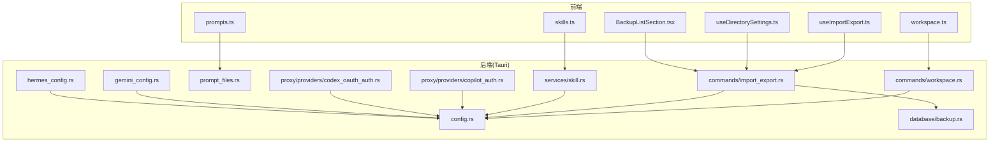
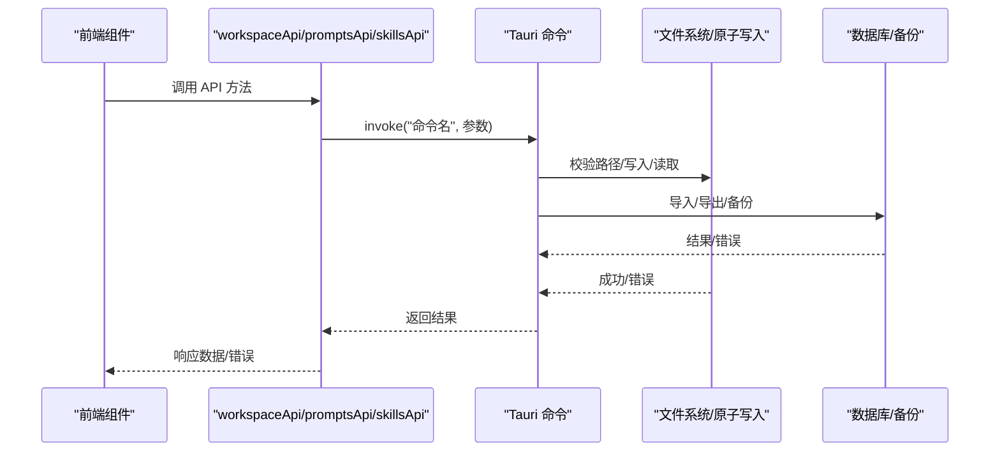
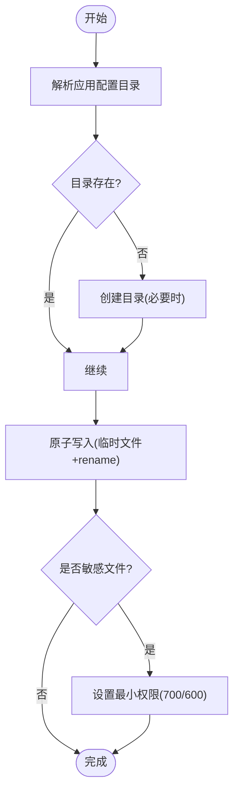
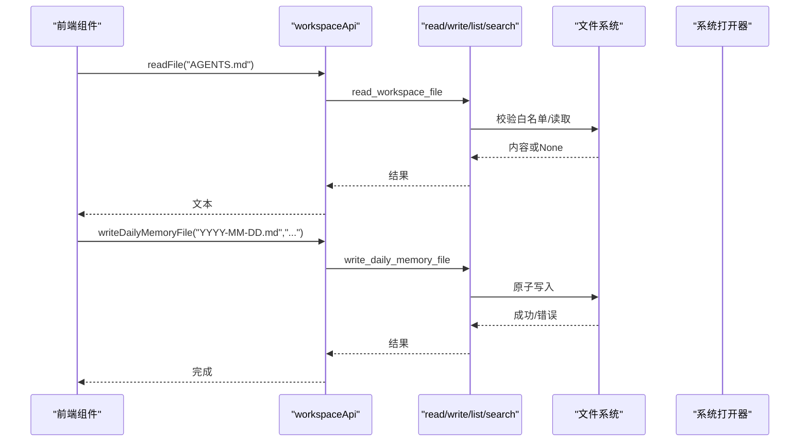
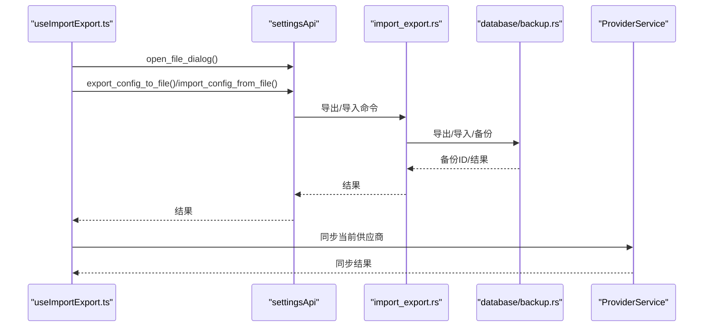
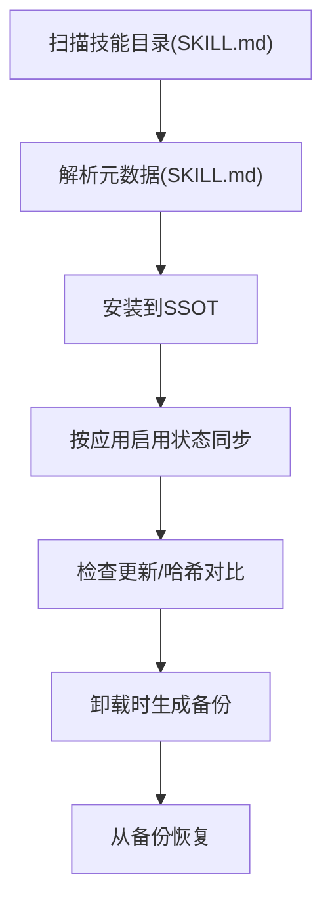
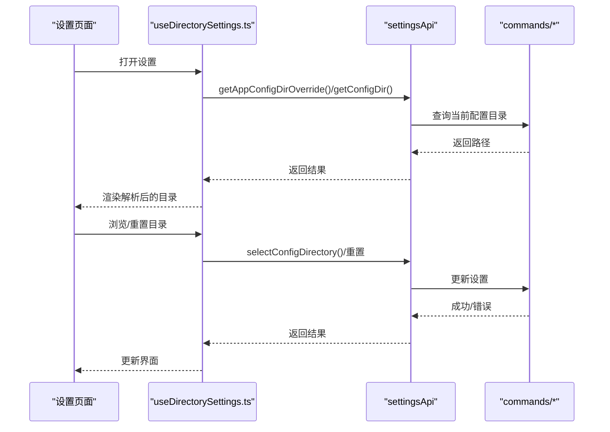
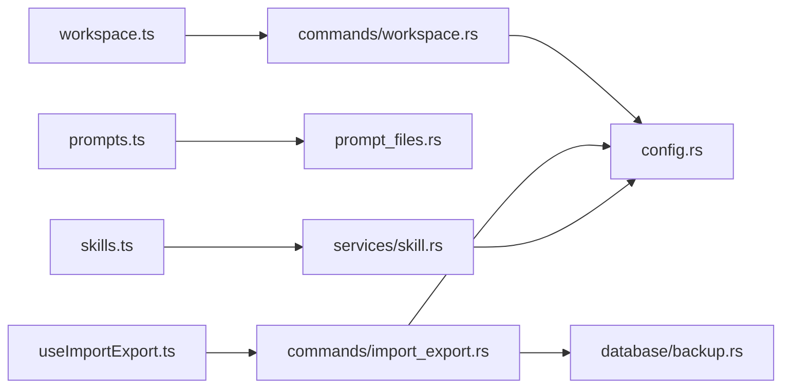

# 文件系统接口

<cite>
**本文引用的文件**
- [src-tauri/src/lib.rs](file://src-tauri/src/lib.rs)
- [src-tauri/src/config.rs](file://src-tauri/src/config.rs)
- [src-tauri/src/commands/workspace.rs](file://src-tauri/src/commands/workspace.rs)
- [src-tauri/src/commands/import_export.rs](file://src-tauri/src/commands/import_export.rs)
- [src-tauri/src/database/backup.rs](file://src-tauri/src/database/backup.rs)
- [src-tauri/src/prompt_files.rs](file://src-tauri/src/prompt_files.rs)
- [src-tauri/src/services/skill.rs](file://src-tauri/src/services/skill.rs)
- [src-tauri/src/proxy/providers/copilot_auth.rs](file://src-tauri/src/proxy/providers/copilot_auth.rs)
- [src-tauri/src/proxy/providers/codex_oauth_auth.rs](file://src-tauri/src/proxy/providers/codex_oauth_auth.rs)
- [src-tauri/src/gemini_config.rs](file://src-tauri/src/gemini_config.rs)
- [src-tauri/src/hermes_config.rs](file://src-tauri/src/hermes_config.rs)
- [src/lib/api/workspace.ts](file://src/lib/api/workspace.ts)
- [src/lib/api/prompts.ts](file://src/lib/api/prompts.ts)
- [src/lib/api/skills.ts](file://src/lib/api/skills.ts)
- [src/hooks/useImportExport.ts](file://src/hooks/useImportExport.ts)
- [src/hooks/useDirectorySettings.ts](file://src/hooks/useDirectorySettings.ts)
- [src/components/settings/BackupListSection.tsx](file://src/components/settings/BackupListSection.tsx)
- [docs/user-manual/en/5-faq/5.1-config-files.md](file://docs/user-manual/en/5-faq/5.1-config-files.md)
- [src-tauri/tests/skill_sync.rs](file://src-tauri/tests/skill_sync.rs)
- [src-tauri/tests/import_export_sync.rs](file://src-tauri/tests/import_export_sync.rs)
</cite>

## 目录
1. [简介](#简介)
2. [项目结构](#项目结构)
3. [核心组件](#核心组件)
4. [架构总览](#架构总览)
5. [详细组件分析](#详细组件分析)
6. [依赖关系分析](#依赖关系分析)
7. [性能考量](#性能考量)
8. [故障排查指南](#故障排查指南)
9. [结论](#结论)
10. [附录](#附录)

## 简介
本文件系统接口文档面向 CC Switch 的文件系统与工作区管理能力，涵盖以下主题：
- 路径管理：应用配置目录、工作区目录、提示词文件定位与权限控制
- 文件操作：工作区文件读写、每日记忆文件管理、导入导出与备份恢复
- 权限控制：敏感文件的原子写入与最小权限设置
- 工作区管理：文件夹结构、文件读写操作与同步机制
- 技能与提示词：统一技能存储、元数据处理与版本控制
- 导入导出：SQL 备份、格式校验与跨设备同步策略
- 实际示例：通过 API 管理配置与数据文件，以及与其他应用的数据交换模式

## 项目结构
文件系统相关代码主要分布在 Rust 后端与前端 API 层：
- 后端命令与服务：工作区、导入导出、数据库备份、路径解析、原子写入等
- 前端 API：对 Tauri 命令的封装，提供类型安全的调用入口
- 钩子与设置：目录解析、导入导出流程、备份列表 UI

**图表来源**
- [src/lib/api/workspace.ts:1-57](file://src/lib/api/workspace.ts#L1-L57)
- [src/lib/api/prompts.ts:1-39](file://src/lib/api/prompts.ts#L1-L39)
- [src/lib/api/skills.ts:1-284](file://src/lib/api/skills.ts#L1-L284)
- [src-tauri/src/commands/workspace.rs:1-363](file://src-tauri/src/commands/workspace.rs#L1-L363)
- [src-tauri/src/commands/import_export.rs:1-177](file://src-tauri/src/commands/import_export.rs#L1-L177)
- [src-tauri/src/config.rs:1-200](file://src-tauri/src/config.rs#L1-L200)
- [src-tauri/src/database/backup.rs:1-200](file://src-tauri/src/database/backup.rs#L1-L200)
- [src-tauri/src/prompt_files.rs:1-58](file://src-tauri/src/prompt_files.rs#L1-L58)
- [src-tauri/src/services/skill.rs:1-200](file://src-tauri/src/services/skill.rs#L1-L200)
- [src-tauri/src/proxy/providers/copilot_auth.rs:1259-1298](file://src-tauri/src/proxy/providers/copilot_auth.rs#L1259-L1298)
- [src-tauri/src/proxy/providers/codex_oauth_auth.rs:781-820](file://src-tauri/src/proxy/providers/codex_oauth_auth.rs#L781-L820)
- [src-tauri/src/gemini_config.rs:150-190](file://src-tauri/src/gemini_config.rs#L150-L190)
- [src-tauri/src/hermes_config.rs:392-434](file://src-tauri/src/hermes_config.rs#L392-L434)

**章节来源**
- [src-tauri/src/lib.rs:1271-1437](file://src-tauri/src/lib.rs#L1271-L1437)
- [docs/user-manual/en/5-faq/5.1-config-files.md:1-73](file://docs/user-manual/en/5-faq/5.1-config-files.md#L1-L73)

## 核心组件
- 路径解析与安全写入
  - 应用配置目录、各应用配置目录解析与回退策略
  - JSON/TOML/纯文本原子写入，避免半写状态
- 工作区文件管理
  - 限定白名单文件名、每日记忆文件全量搜索与预览
  - 原子写入与目录打开
- 导入导出与备份
  - SQL 备份导出/导入、自动备份策略、备份列表与恢复
- 提示词文件
  - 指定应用的提示词文件路径解析（部分应用不支持）
- 技能管理
  - 统一技能存储(SSOT)、仓库扫描、安装/卸载/更新、备份恢复
- 权限控制
  - 敏感文件写入时设置最小权限（Unix: 700/600）

**章节来源**
- [src-tauri/src/config.rs:1-200](file://src-tauri/src/config.rs#L1-L200)
- [src-tauri/src/commands/workspace.rs:1-363](file://src-tauri/src/commands/workspace.rs#L1-L363)
- [src-tauri/src/commands/import_export.rs:1-177](file://src-tauri/src/commands/import_export.rs#L1-L177)
- [src-tauri/src/prompt_files.rs:1-58](file://src-tauri/src/prompt_files.rs#L1-L58)
- [src-tauri/src/services/skill.rs:1-200](file://src-tauri/src/services/skill.rs#L1-L200)
- [src-tauri/src/proxy/providers/copilot_auth.rs:1259-1298](file://src-tauri/src/proxy/providers/copilot_auth.rs#L1259-L1298)
- [src-tauri/src/proxy/providers/codex_oauth_auth.rs:781-820](file://src-tauri/src/proxy/providers/codex_oauth_auth.rs#L781-L820)
- [src-tauri/src/gemini_config.rs:150-190](file://src-tauri/src/gemini_config.rs#L150-L190)
- [src-tauri/src/hermes_config.rs:392-434](file://src-tauri/src/hermes_config.rs#L392-L434)

## 架构总览
文件系统接口采用“前端 API 封装 + 后端命令 + 服务层”的分层设计：
- 前端通过 workspaceApi/promptsApi/skillsApi 调用 Tauri 命令
- 后端命令负责参数校验、路径解析与调用通用写入/读取函数
- 服务层处理业务逻辑（技能扫描、仓库管理、导入导出策略）
- 数据库备份/恢复通过独立模块完成，保证原子性与一致性

**图表来源**
- [src/lib/api/workspace.ts:1-57](file://src/lib/api/workspace.ts#L1-L57)
- [src/lib/api/prompts.ts:1-39](file://src/lib/api/prompts.ts#L1-L39)
- [src/lib/api/skills.ts:1-284](file://src/lib/api/skills.ts#L1-L284)
- [src-tauri/src/commands/workspace.rs:1-363](file://src-tauri/src/commands/workspace.rs#L1-L363)
- [src-tauri/src/commands/import_export.rs:1-177](file://src-tauri/src/commands/import_export.rs#L1-L177)
- [src-tauri/src/database/backup.rs:1-200](file://src-tauri/src/database/backup.rs#L1-L200)

## 详细组件分析

### 路径管理与安全写入
- 应用配置目录与回退策略
  - 应用配置目录默认位于用户主目录下的隐藏目录，支持覆盖与历史兼容
  - 各应用配置目录解析（如 Claude、Codex、Gemini、OpenCode、OpenClaw、Hermes）
- 原子写入与权限控制
  - JSON/TOML/纯文本均通过原子写入：先写临时文件再 rename，避免半写
  - 敏感文件写入后设置最小权限（Unix：目录 700、文件 600）
- 提示词文件路径
  - 指定应用的提示词文件路径解析；部分应用不支持提示词文件

**图表来源**
- [src-tauri/src/config.rs:1-200](file://src-tauri/src/config.rs#L1-L200)
- [src-tauri/src/proxy/providers/copilot_auth.rs:1259-1298](file://src-tauri/src/proxy/providers/copilot_auth.rs#L1259-L1298)
- [src-tauri/src/proxy/providers/codex_oauth_auth.rs:781-820](file://src-tauri/src/proxy/providers/codex_oauth_auth.rs#L781-L820)
- [src-tauri/src/gemini_config.rs:150-190](file://src-tauri/src/gemini_config.rs#L150-L190)
- [src-tauri/src/hermes_config.rs:392-434](file://src-tauri/src/hermes_config.rs#L392-L434)
- [src-tauri/src/prompt_files.rs:1-58](file://src-tauri/src/prompt_files.rs#L1-L58)

**章节来源**
- [src-tauri/src/config.rs:1-200](file://src-tauri/src/config.rs#L1-L200)
- [src-tauri/src/prompt_files.rs:1-58](file://src-tauri/src/prompt_files.rs#L1-L58)

### 工作区文件管理
- 白名单文件名限制：仅允许特定文件名写入工作区目录
- 每日记忆文件管理：列出、读取、写入、删除、全文搜索（大小写不敏感，日期字段参与匹配）
- 目录打开：在系统文件管理器中打开工作区或记忆目录

**图表来源**
- [src-tauri/src/commands/workspace.rs:1-363](file://src-tauri/src/commands/workspace.rs#L1-L363)
- [src/lib/api/workspace.ts:1-57](file://src/lib/api/workspace.ts#L1-L57)

**章节来源**
- [src-tauri/src/commands/workspace.rs:1-363](file://src-tauri/src/commands/workspace.rs#L1-L363)
- [src/lib/api/workspace.ts:1-57](file://src/lib/api/workspace.ts#L1-L57)

### 导入导出与备份恢复
- SQL 导出/导入
  - 导出：生成带头部标记的 SQL 文件
  - 导入：在临时库执行导入，校验并补齐表结构，再原子替换主库
  - 同步导入：保留本地特定表数据，避免云端覆盖本地日志等
- 自动备份与手动备份
  - 自动备份策略：定时创建数据库快照，保留固定数量
  - 备份列表：显示文件名、大小、创建时间，支持重命名/删除/恢复
- 前端流程钩子
  - 导入导出状态机、错误提示、导入后实时同步

**图表来源**
- [src/hooks/useImportExport.ts:1-204](file://src/hooks/useImportExport.ts#L1-L204)
- [src-tauri/src/commands/import_export.rs:1-177](file://src-tauri/src/commands/import_export.rs#L1-L177)
- [src-tauri/src/database/backup.rs:1-200](file://src-tauri/src/database/backup.rs#L1-L200)
- [src/components/settings/BackupListSection.tsx:168-323](file://src/components/settings/BackupListSection.tsx#L168-L323)

**章节来源**
- [src-tauri/src/commands/import_export.rs:1-177](file://src-tauri/src/commands/import_export.rs#L1-L177)
- [src-tauri/src/database/backup.rs:1-200](file://src-tauri/src/database/backup.rs#L1-L200)
- [src/hooks/useImportExport.ts:1-204](file://src/hooks/useImportExport.ts#L1-L204)
- [src/components/settings/BackupListSection.tsx:168-323](file://src/components/settings/BackupListSection.tsx#L168-L323)

### 提示词文件与技能文件管理
- 提示词文件
  - 指定应用的提示词文件路径解析；部分应用不支持提示词
- 技能文件
  - 统一技能存储(SSOT)：集中管理，按需同步到各应用
  - 元数据处理：SKILL.md 解析、仓库扫描、安装/卸载/更新
  - 版本控制：基于内容哈希与更新检测
  - 备份恢复：卸载时生成备份，支持从备份恢复

**图表来源**
- [src-tauri/src/services/skill.rs:1-200](file://src-tauri/src/services/skill.rs#L1-L200)
- [src-tauri/src/services/skill.rs:2546-2582](file://src-tauri/src/services/skill.rs#L2546-L2582)
- [src/lib/api/skills.ts:1-284](file://src/lib/api/skills.ts#L1-L284)
- [src-tauri/tests/skill_sync.rs:1-246](file://src-tauri/tests/skill_sync.rs#L1-L246)

**章节来源**
- [src-tauri/src/prompt_files.rs:1-58](file://src-tauri/src/prompt_files.rs#L1-L58)
- [src-tauri/src/services/skill.rs:1-200](file://src-tauri/src/services/skill.rs#L1-L200)
- [src-tauri/src/services/skill.rs:2546-2582](file://src-tauri/src/services/skill.rs#L2546-L2582)
- [src/lib/api/skills.ts:1-284](file://src/lib/api/skills.ts#L1-L284)
- [src-tauri/tests/skill_sync.rs:1-246](file://src-tauri/tests/skill_sync.rs#L1-L246)

### 目录设置与工作流
- 目录解析与回退
  - 支持为每个应用单独设置配置目录，否则使用默认回退路径
- 目录浏览与重置
  - 前端提供目录选择对话框与一键重置
- 工作区目录打开
  - 一键在系统文件管理器中打开工作区或记忆目录

**图表来源**
- [src/hooks/useDirectorySettings.ts:1-374](file://src/hooks/useDirectorySettings.ts#L1-L374)
- [src-tauri/src/commands/import_export.rs:1-177](file://src-tauri/src/commands/import_export.rs#L1-L177)

**章节来源**
- [src/hooks/useDirectorySettings.ts:1-374](file://src/hooks/useDirectorySettings.ts#L1-L374)

## 依赖关系分析
- 前端 API 依赖后端命令
  - workspaceApi -> commands/workspace.rs
  - promptsApi -> prompt_files.rs
  - skillsApi -> services/skill.rs
  - settingsApi/import_export -> commands/import_export.rs
- 命令层依赖通用配置与数据库模块
  - commands/workspace.rs -> config.rs
  - commands/import_export.rs -> database/backup.rs, config.rs
- 权限控制依赖平台特性
  - Unix 权限设置（700/600）
  - 平台差异处理（Windows/Unix）

**图表来源**
- [src/lib/api/workspace.ts:1-57](file://src/lib/api/workspace.ts#L1-L57)
- [src/lib/api/prompts.ts:1-39](file://src/lib/api/prompts.ts#L1-L39)
- [src/lib/api/skills.ts:1-284](file://src/lib/api/skills.ts#L1-L284)
- [src-tauri/src/commands/workspace.rs:1-363](file://src-tauri/src/commands/workspace.rs#L1-L363)
- [src-tauri/src/commands/import_export.rs:1-177](file://src-tauri/src/commands/import_export.rs#L1-L177)
- [src-tauri/src/config.rs:1-200](file://src-tauri/src/config.rs#L1-L200)
- [src-tauri/src/database/backup.rs:1-200](file://src-tauri/src/database/backup.rs#L1-L200)
- [src-tauri/src/services/skill.rs:1-200](file://src-tauri/src/services/skill.rs#L1-L200)

**章节来源**
- [src-tauri/src/lib.rs:1271-1437](file://src-tauri/src/lib.rs#L1271-L1437)

## 性能考量
- 原子写入减少 IO 失败风险，避免频繁重试
- 数据库导入使用临时库与原子替换，降低锁持有时间
- 每日记忆全文搜索按需构建片段，限制上下文长度
- 备份保留策略控制文件数量，平衡存储与恢复需求

## 故障排查指南
- 导入失败
  - 确认 SQL 文件由 CC Switch 导出（带头部标记）
  - 检查文件格式与编码，排除 BOM 引起的问题
  - 查看导入后自动备份 ID，必要时回滚
- 写入失败
  - 检查目标路径是否存在父目录，必要时创建
  - 确认权限（尤其是 Unix 系统的 700/600）
  - 观察错误上下文是否指向具体文件
- 同步异常
  - 导入后触发实时同步，若失败需手动重新选择供应商
  - 检查网络与代理配置

**章节来源**
- [src-tauri/src/database/backup.rs:166-177](file://src-tauri/src/database/backup.rs#L166-L177)
- [src-tauri/tests/import_export_sync.rs:561-621](file://src-tauri/tests/import_export_sync.rs#L561-L621)
- [src/hooks/useImportExport.ts:68-141](file://src/hooks/useImportExport.ts#L68-L141)

## 结论
CC Switch 的文件系统接口通过严格的路径解析、原子写入与权限控制，结合统一技能存储与完善的导入导出/备份恢复机制，提供了安全、可靠且易用的配置与数据管理能力。工作区与每日记忆文件的管理进一步增强了本地知识沉淀与检索体验。

## 附录

### API 定义概览
- 工作区文件
  - 读取/写入工作区文件
  - 列出/读取/写入/删除每日记忆文件
  - 全文搜索每日记忆文件
  - 打开工作区/记忆目录
- 提示词文件
  - 获取提示词列表
  - 新增/更新/删除提示词
  - 从文件导入提示词
  - 获取当前提示词文件内容
- 技能文件
  - 获取已安装技能列表
  - 获取技能备份列表
  - 安装/卸载/更新技能
  - 从 ZIP 安装技能
  - 仓库管理与搜索
  - 迁移存储位置
- 导入导出与备份
  - 导出/导入数据库 SQL
  - 创建/列出/恢复/重命名/删除备份
  - 保存/打开文件对话框

**章节来源**
- [src/lib/api/workspace.ts:1-57](file://src/lib/api/workspace.ts#L1-L57)
- [src/lib/api/prompts.ts:1-39](file://src/lib/api/prompts.ts#L1-L39)
- [src/lib/api/skills.ts:1-284](file://src/lib/api/skills.ts#L1-L284)
- [src-tauri/src/commands/import_export.rs:1-177](file://src-tauri/src/commands/import_export.rs#L1-L177)

### 目录与结构参考
- 默认存储目录与结构、数据库表说明、自动备份策略
- 各应用配置目录覆盖与回退策略

**章节来源**
- [docs/user-manual/en/5-faq/5.1-config-files.md:1-73](file://docs/user-manual/en/5-faq/5.1-config-files.md#L1-L73)