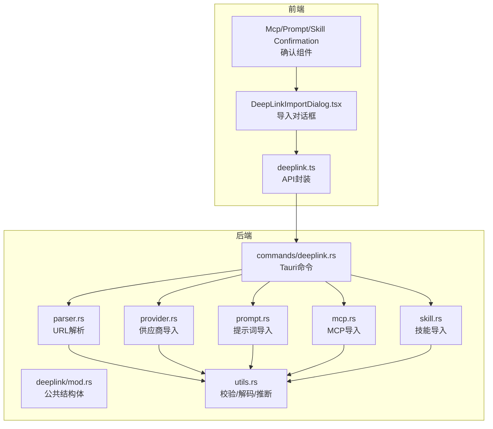
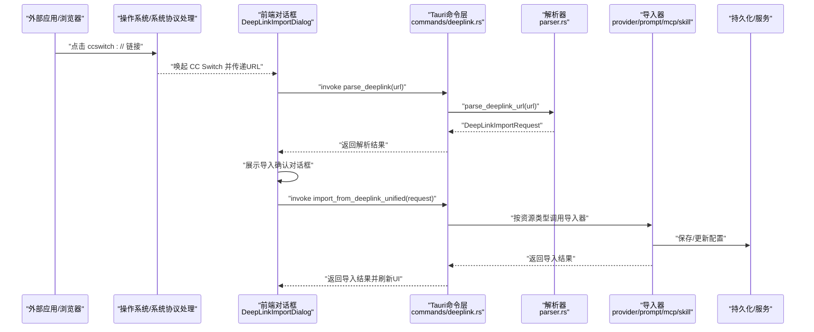
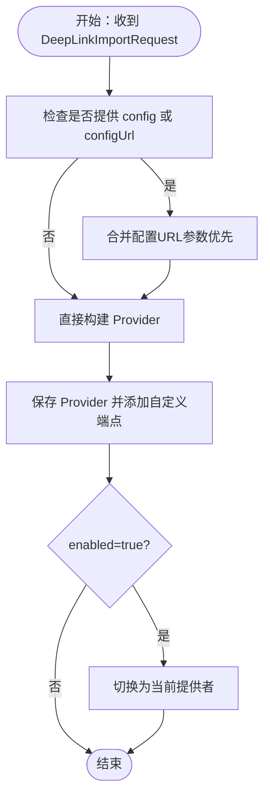
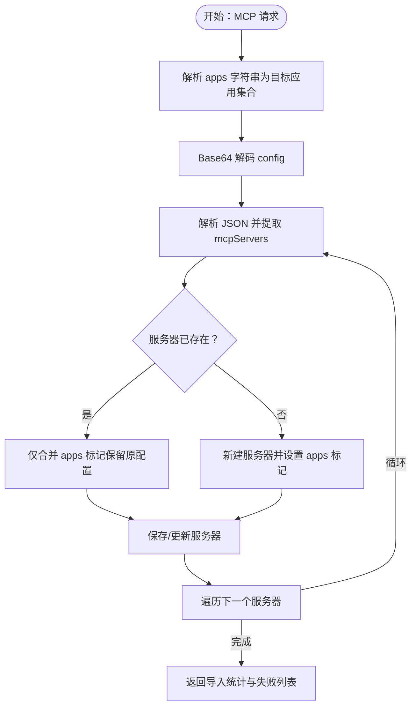
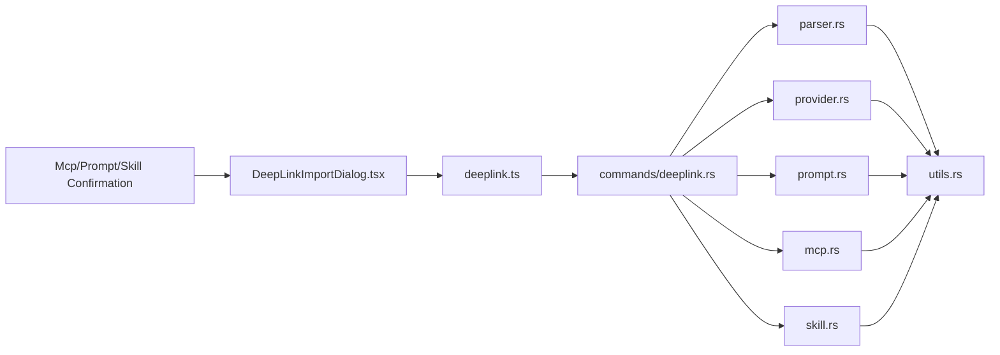

# 深链协议

<cite>
**本文引用的文件**
- [src-tauri/src/deeplink/mod.rs](file://src-tauri/src/deeplink/mod.rs)
- [src-tauri/src/deeplink/parser.rs](file://src-tauri/src/deeplink/parser.rs)
- [src-tauri/src/deeplink/provider.rs](file://src-tauri/src/deeplink/provider.rs)
- [src-tauri/src/deeplink/prompt.rs](file://src-tauri/src/deeplink/prompt.rs)
- [src-tauri/src/deeplink/mcp.rs](file://src-tauri/src/deeplink/mcp.rs)
- [src-tauri/src/deeplink/skill.rs](file://src-tauri/src/deeplink/skill.rs)
- [src-tauri/src/deeplink/utils.rs](file://src-tauri/src/deeplink/utils.rs)
- [src-tauri/src/commands/deeplink.rs](file://src-tauri/src/commands/deeplink.rs)
- [src/lib/api/deeplink.ts](file://src/lib/api/deeplink.ts)
- [src/components/DeepLinkImportDialog.tsx](file://src/components/DeepLinkImportDialog.tsx)
- [src/components/deeplink/McpConfirmation.tsx](file://src/components/deeplink/McpConfirmation.tsx)
- [src/components/deeplink/PromptConfirmation.tsx](file://src/components/deeplink/PromptConfirmation.tsx)
- [src/components/deeplink/SkillConfirmation.tsx](file://src/components/deeplink/SkillConfirmation.tsx)
- [docs/user-manual/zh/5-faq/5.3-deeplink.md](file://docs/user-manual/zh/5-faq/5.3-deeplink.md)
- [docs/user-manual/en/5-faq/5.3-deeplink.md](file://docs/user-manual/en/5-faq/5.3-deeplink.md)
- [deplink.html](file://deplink.html)
</cite>

## 目录
1. [简介](#简介)
2. [项目结构](#项目结构)
3. [核心组件](#核心组件)
4. [架构总览](#架构总览)
5. [详细组件分析](#详细组件分析)
6. [依赖关系分析](#依赖关系分析)
7. [性能考量](#性能考量)
8. [故障排查指南](#故障排查指南)
9. [结论](#结论)
10. [附录](#附录)

## 简介
本文件系统化阐述 CC Switch 的“深链协议”（ccswitch://），涵盖协议设计、URL 结构与参数编码、解析与执行流程、各类深链类型处理、安全机制与最佳实践，并提供可操作的示例与扩展建议。该协议通过统一的 ccswitch://v1/import 路由，支持供应商、MCP、提示词与技能四类资源的一键导入，前端以对话框确认，后端完成参数校验、配置合并与持久化。

## 项目结构
深链协议相关代码主要分布在 Rust 后端模块与前端 API/组件层：
- 后端（Rust）：解析器、资源导入器、命令桥接、工具函数
- 前端（TypeScript + React）：API 封装、导入对话框、各资源确认组件
- 文档与工具：用户手册、在线生成器

图表来源
- [src/lib/api/deeplink.ts:1-105](file://src/lib/api/deeplink.ts#L1-L105)
- [src-tauri/src/commands/deeplink.rs:1-90](file://src-tauri/src/commands/deeplink.rs#L1-L90)
- [src-tauri/src/deeplink/mod.rs:1-139](file://src-tauri/src/deeplink/mod.rs#L1-L139)
- [src-tauri/src/deeplink/parser.rs:1-368](file://src-tauri/src/deeplink/parser.rs#L1-L368)
- [src-tauri/src/deeplink/utils.rs:1-100](file://src-tauri/src/deeplink/utils.rs#L1-L100)
- [src-tauri/src/deeplink/provider.rs:1-923](file://src-tauri/src/deeplink/provider.rs#L1-L923)
- [src-tauri/src/deeplink/prompt.rs:1-87](file://src-tauri/src/deeplink/prompt.rs#L1-L87)
- [src-tauri/src/deeplink/mcp.rs:1-200](file://src-tauri/src/deeplink/mcp.rs#L1-L200)
- [src-tauri/src/deeplink/skill.rs:1-52](file://src-tauri/src/deeplink/skill.rs#L1-L52)

章节来源
- [src/lib/api/deeplink.ts:1-105](file://src/lib/api/deeplink.ts#L1-L105)
- [src-tauri/src/commands/deeplink.rs:1-90](file://src-tauri/src/commands/deeplink.rs#L1-L90)
- [src-tauri/src/deeplink/mod.rs:1-139](file://src-tauri/src/deeplink/mod.rs#L1-L139)

## 核心组件
- 深链请求模型（DeepLinkImportRequest）：统一承载所有资源类型的字段，包含通用字段、供应商字段、提示词字段、MCP 字段、技能字段、配置文件字段与用量脚本字段。
- 解析器（parse_deeplink_url）：校验协议版本、路径与资源类型，按资源类型分派到对应解析函数。
- 统一导入命令（import_from_deeplink_unified）：根据资源类型路由到具体导入器，返回统一的结果结构。
- 各资源导入器：
  - 供应商导入（import_provider_from_deeplink）：合并配置文件、构建 Provider、持久化并可选切换为当前提供者。
  - 提示词导入（import_prompt_from_deeplink）：Base64 解码内容、生成唯一 ID、保存并可选启用。
  - MCP 导入（import_mcp_from_deeplink）：批量导入 MCP 服务器，重复项仅合并目标应用标记。
  - 技能导入（import_skill_from_deeplink）：解析仓库地址，保存为技能仓库条目。
- 工具函数：URL 校验、Base64 解码（兼容多种变体与填充）、从端点推断主页。

章节来源
- [src-tauri/src/deeplink/mod.rs:30-139](file://src-tauri/src/deeplink/mod.rs#L30-L139)
- [src-tauri/src/deeplink/parser.rs:11-68](file://src-tauri/src/deeplink/parser.rs#L11-L68)
- [src-tauri/src/commands/deeplink.rs:44-90](file://src-tauri/src/commands/deeplink.rs#L44-L90)
- [src-tauri/src/deeplink/provider.rs:15-137](file://src-tauri/src/deeplink/provider.rs#L15-L137)
- [src-tauri/src/deeplink/prompt.rs:14-87](file://src-tauri/src/deeplink/prompt.rs#L14-L87)
- [src-tauri/src/deeplink/mcp.rs:36-161](file://src-tauri/src/deeplink/mcp.rs#L36-L161)
- [src-tauri/src/deeplink/skill.rs:10-52](file://src-tauri/src/deeplink/skill.rs#L10-L52)
- [src-tauri/src/deeplink/utils.rs:9-100](file://src-tauri/src/deeplink/utils.rs#L9-L100)

## 架构总览
深链协议的端到端流程如下：

图表来源
- [src-tauri/src/commands/deeplink.rs:8-90](file://src-tauri/src/commands/deeplink.rs#L8-L90)
- [src-tauri/src/deeplink/parser.rs:11-68](file://src-tauri/src/deeplink/parser.rs#L11-L68)
- [src/components/DeepLinkImportDialog.tsx:51-92](file://src/components/DeepLinkImportDialog.tsx#L51-L92)

章节来源
- [src-tauri/src/commands/deeplink.rs:1-90](file://src-tauri/src/commands/deeplink.rs#L1-L90)
- [src/components/DeepLinkImportDialog.tsx:1-731](file://src/components/DeepLinkImportDialog.tsx#L1-L731)

## 详细组件分析

### 协议格式与参数规范
- 协议版本：ccswitch://v1/import
- 资源类型：provider | mcp | prompt | skill
- 通用参数：version、resource、app、name、enabled
- 供应商参数：homepage、endpoint（支持逗号分隔多端点）、apiKey、icon、model、notes、haikuModel、sonnetModel、opusModel、config、configFormat、configUrl、usageScript、usageEnabled、usageApiKey、usageBaseUrl、usageAccessToken、usageUserId、usageAutoInterval
- 提示词参数：content（Base64）、description、enabled
- MCP 参数：apps（逗号分隔，如 claude,codex,gemini,opencode,openclaw,hermes）、config（JSON，Base64 可选）、enabled
- 技能参数：repo（owner/name）、directory、branch

章节来源
- [src-tauri/src/deeplink/mod.rs:34-139](file://src-tauri/src/deeplink/mod.rs#L34-L139)
- [docs/user-manual/zh/5-faq/5.3-deeplink.md:27-98](file://docs/user-manual/zh/5-faq/5.3-deeplink.md#L27-L98)
- [docs/user-manual/en/5-faq/5.3-deeplink.md:27-98](file://docs/user-manual/en/5-faq/5.3-deeplink.md#L27-L98)

### URL 结构与参数编码
- URL 结构：ccswitch://v1/import?resource={type}&...
- 参数编码要点：
  - Base64 内容需 URL 安全或标准编码，解析器支持多种变体与填充恢复
  - 空格在 URL 中通常被编码为空格，解析器会尝试恢复 “+”
  - endpoint 支持逗号分隔的多个端点，第一个作为主端点
  - homepage 可省略，解析器会基于主端点推断（http(s)）

章节来源
- [src-tauri/src/deeplink/parser.rs:13-47](file://src-tauri/src/deeplink/parser.rs#L13-L47)
- [src-tauri/src/deeplink/utils.rs:30-80](file://src-tauri/src/deeplink/utils.rs#L30-L80)
- [src-tauri/src/deeplink/provider.rs:54-78](file://src-tauri/src/deeplink/provider.rs#L54-L78)

### 解析器工作原理
- 协议校验：scheme 必须为 ccswitch；host 为版本（v1）；path 必须为 /import
- 查询参数解析：按 resource 分派到不同解析函数
- 资源解析：
  - 供应商：校验 app 类型、可选校验 homepage/endpoint URL、抽取可选字段、支持配置合并
  - 提示词：校验 app 与 name，强制 content，可选 description 与 enabled
  - MCP：校验 apps 列表合法性，强制 config（JSON），可选 enabled
  - 技能：校验 repo 格式 owner/name，可选 directory、branch

章节来源
- [src-tauri/src/deeplink/parser.rs:11-68](file://src-tauri/src/deeplink/parser.rs#L11-L68)
- [src-tauri/src/deeplink/parser.rs:70-177](file://src-tauri/src/deeplink/parser.rs#L70-L177)
- [src-tauri/src/deeplink/parser.rs:179-247](file://src-tauri/src/deeplink/parser.rs#L179-L247)
- [src-tauri/src/deeplink/parser.rs:249-312](file://src-tauri/src/deeplink/parser.rs#L249-L312)
- [src-tauri/src/deeplink/parser.rs:314-367](file://src-tauri/src/deeplink/parser.rs#L314-L367)

### 供应商深链处理
- 配置合并：支持 inline config（Base64 JSON/TOML）与远程 configUrl（当前版本未实现，解析阶段报错）。优先级：URL 参数 > inline config > 远程 config
- 设置构建：按 app 类型构建不同设置结构（Claude/Codex/Gemini/OpenCode/OpenClaw/Hermes）
- 端点与主页：endpoint 支持多端点；homepage 可从端点推断
- 用量脚本：可选注入 usage_script（Base64），并自动推断启用状态与默认参数
- 导入行为：保存为新提供者，可选设置为当前提供者

图表来源
- [src-tauri/src/deeplink/provider.rs:23-137](file://src-tauri/src/deeplink/provider.rs#L23-L137)
- [src-tauri/src/deeplink/provider.rs:515-586](file://src-tauri/src/deeplink/provider.rs#L515-L586)
- [src-tauri/src/deeplink/provider.rs:588-782](file://src-tauri/src/deeplink/provider.rs#L588-L782)

章节来源
- [src-tauri/src/deeplink/provider.rs:15-137](file://src-tauri/src/deeplink/provider.rs#L15-L137)
- [src-tauri/src/deeplink/provider.rs:515-782](file://src-tauri/src/deeplink/provider.rs#L515-L782)

### MCP 深链处理
- apps 校验：必须为 claude/codex/gemini/opencode/openclaw/hermes 的组合
- config 校验：必须包含 mcpServers 对象，且至少一个服务器
- 导入策略：若服务器已存在，仅合并目标应用标记（保留原配置），否则新建并打上导入标签
- 返回结构：包含成功导入数量、ID 列表与失败列表

图表来源
- [src-tauri/src/deeplink/mcp.rs:36-161](file://src-tauri/src/deeplink/mcp.rs#L36-L161)
- [src-tauri/src/deeplink/mcp.rs:163-200](file://src-tauri/src/deeplink/mcp.rs#L163-L200)

章节来源
- [src-tauri/src/deeplink/mcp.rs:1-200](file://src-tauri/src/deeplink/mcp.rs#L1-L200)

### 提示词深链处理
- content 必须提供，Base64 解码后保存为提示词内容
- 自动生成唯一 ID（名称清洗 + 时间戳），初始禁用
- enabled=true 时启用该提示词（逻辑会禁用同应用其他提示词）
- 返回提示词 ID

章节来源
- [src-tauri/src/deeplink/prompt.rs:14-87](file://src-tauri/src/deeplink/prompt.rs#L14-L87)

### 技能深链处理
- repo 必须为 owner/name 格式
- 保存为技能仓库条目，默认启用，可指定分支
- 返回仓库键（owner/name）

章节来源
- [src-tauri/src/deeplink/skill.rs:10-52](file://src-tauri/src/deeplink/skill.rs#L10-L52)

### 前端导入对话框与确认组件
- DeepLinkImportDialog：监听 deeplink-import 事件，支持合并配置、显示资源详情、导入后刷新缓存、错误提示
- 各资源确认组件：McpConfirmation、PromptConfirmation、SkillConfirmation 展示关键字段与安全提示
- 敏感信息掩码：API Key 与配置中的敏感字段会被掩码显示

章节来源
- [src/components/DeepLinkImportDialog.tsx:1-731](file://src/components/DeepLinkImportDialog.tsx#L1-L731)
- [src/components/deeplink/McpConfirmation.tsx:1-76](file://src/components/deeplink/McpConfirmation.tsx#L1-L76)
- [src/components/deeplink/PromptConfirmation.tsx:1-64](file://src/components/deeplink/PromptConfirmation.tsx#L1-L64)
- [src/components/deeplink/SkillConfirmation.tsx:1-47](file://src/components/deeplink/SkillConfirmation.tsx#L1-L47)

## 依赖关系分析
- 前端 API 封装（deeplink.ts）依赖 Tauri invoke，调用后端命令
- 命令层（commands/deeplink.rs）统一调度解析与导入
- 解析器依赖工具函数（URL 校验、Base64 解码、端点推断）
- 导入器依赖各自的服务与存储（ProviderService、PromptService、McpService、数据库）
- 前端对话框依赖各资源确认组件与 i18n

图表来源
- [src/lib/api/deeplink.ts:72-104](file://src/lib/api/deeplink.ts#L72-L104)
- [src-tauri/src/commands/deeplink.rs:1-90](file://src-tauri/src/commands/deeplink.rs#L1-L90)
- [src-tauri/src/deeplink/parser.rs:1-368](file://src-tauri/src/deeplink/parser.rs#L1-L368)
- [src-tauri/src/deeplink/utils.rs:1-100](file://src-tauri/src/deeplink/utils.rs#L1-L100)
- [src/components/DeepLinkImportDialog.tsx:1-731](file://src/components/DeepLinkImportDialog.tsx#L1-L731)

章节来源
- [src/lib/api/deeplink.ts:1-105](file://src/lib/api/deeplink.ts#L1-L105)
- [src-tauri/src/commands/deeplink.rs:1-90](file://src-tauri/src/commands/deeplink.rs#L1-L90)

## 性能考量
- Base64 解码：解析器尝试多种变体与填充，复杂度与输入长度线性相关；建议前端尽量使用 URL 安全 Base64 并避免多余换行
- JSON/TOML 解析：仅在提供 config 时发生，且为一次性导入流程，对用户体验影响有限
- 端点推断：字符串处理与 URL 解析成本低，仅在 homepage 缺失时触发
- 导入缓存刷新：导入完成后前端会刷新相关查询缓存，避免重复渲染

[本节为通用指导，无需列出章节来源]

## 故障排查指南
- 链接无法打开
  - 检查协议是否正确注册（macOS 重新安装或手动注册；Windows 检查注册表；Linux 检查 .desktop MimeType）
  - 确认链接格式与参数编码正确
- 导入失败
  - Base64 编码错误：确认 Base64 字符集与填充，必要时使用 URL 安全变体
  - JSON/TOML 格式错误：检查 config 内容与格式声明
  - 缺少必填字段：resource、app、name、content（提示词）、config（MCP）、repo（技能）
- 配置未生效
  - 供应商导入后可选 enabled=true 以切换为当前提供者
  - 提示词导入后 enabled=true 才会启用并禁用其他提示词
- 在线生成器
  - 使用官方在线工具生成链接，减少手动生成错误

章节来源
- [docs/user-manual/zh/5-faq/5.3-deeplink.md:172-257](file://docs/user-manual/zh/5-faq/5.3-deeplink.md#L172-L257)
- [docs/user-manual/en/5-faq/5.3-deeplink.md:172-257](file://docs/user-manual/en/5-faq/5.3-deeplink.md#L172-L257)
- [deplink.html](file://deplink.html)

## 结论
CC Switch 的深链协议以 ccswitch://v1/import 为核心，通过统一的请求模型与解析器，实现了供应商、MCP、提示词与技能四类资源的标准化导入。前端提供可视化确认与安全掩码，后端完成严格的参数校验、配置合并与持久化。协议具备良好的扩展性，未来可在保持向后兼容的前提下增加更多资源类型与参数。

[本节为总结性内容，无需列出章节来源]

## 附录

### 完整深链格式规范
- 协议版本：ccswitch://v1/import
- 通用参数：version、resource、app、name、enabled
- 供应商参数：homepage、endpoint（逗号分隔）、apiKey、icon、model、notes、haikuModel、sonnetModel、opusModel、config、configFormat、configUrl、usageScript、usageEnabled、usageApiKey、usageBaseUrl、usageAccessToken、usageUserId、usageAutoInterval
- 提示词参数：content（Base64）、description、enabled
- MCP 参数：apps（逗号分隔）、config（JSON，Base64 可选）、enabled
- 技能参数：repo（owner/name）、directory、branch

章节来源
- [src-tauri/src/deeplink/mod.rs:34-139](file://src-tauri/src/deeplink/mod.rs#L34-L139)
- [docs/user-manual/zh/5-faq/5.3-deeplink.md:27-98](file://docs/user-manual/zh/5-faq/5.3-deeplink.md#L27-L98)
- [docs/user-manual/en/5-faq/5.3-deeplink.md:27-98](file://docs/user-manual/en/5-faq/5.3-deeplink.md#L27-L98)

### 实际深链示例
- 供应商导入（Claude）：包含 endpoint 与 apiKey
- MCP 服务器导入：apps 与 config（JSON）
- 提示词导入：content（Base64）与描述
- 技能导入：repo（owner/name）

章节来源
- [docs/user-manual/zh/5-faq/5.3-deeplink.md:99-124](file://docs/user-manual/zh/5-faq/5.3-deeplink.md#L99-L124)
- [docs/user-manual/en/5-faq/5.3-deeplink.md:99-124](file://docs/user-manual/en/5-faq/5.3-deeplink.md#L99-L124)

### 安全机制与最佳实践
- 来源验证：导入前显示确认对话框，允许用户审查配置
- 参数过滤：严格校验 URL、Base64、JSON/TOML、端点与仓库格式
- 执行权限控制：enabled 控制导入后是否立即启用（供应商切换、提示词启用）
- 敏感信息保护：API Key 与配置中的敏感字段在前端掩码显示；建议不在公开渠道分享包含敏感信息的链接

章节来源
- [src-tauri/src/deeplink/utils.rs:9-22](file://src-tauri/src/deeplink/utils.rs#L9-L22)
- [src-tauri/src/deeplink/parser.rs:101-115](file://src-tauri/src/deeplink/parser.rs#L101-L115)
- [src/components/DeepLinkImportDialog.tsx:209-290](file://src/components/DeepLinkImportDialog.tsx#L209-L290)
- [docs/user-manual/zh/5-faq/5.3-deeplink.md:197-222](file://docs/user-manual/zh/5-faq/5.3-deeplink.md#L197-L222)
- [docs/user-manual/en/5-faq/5.3-deeplink.md:197-222](file://docs/user-manual/en/5-faq/5.3-deeplink.md#L197-L222)

### 扩展与自定义方法
- 新增资源类型：在解析器与命令层新增解析与导入器，遵循统一的 DeepLinkImportRequest 结构
- 参数增强：在 DeepLinkImportRequest 中扩展字段，并在解析器与导入器中实现相应逻辑
- 配置合并：继续完善远程 configUrl 的支持，提升灵活性

章节来源
- [src-tauri/src/deeplink/mod.rs:21-28](file://src-tauri/src/deeplink/mod.rs#L21-L28)
- [src-tauri/src/deeplink/parser.rs:58-67](file://src-tauri/src/deeplink/parser.rs#L58-L67)
- [src-tauri/src/commands/deeplink.rs:44-89](file://src-tauri/src/commands/deeplink.rs#L44-L89)