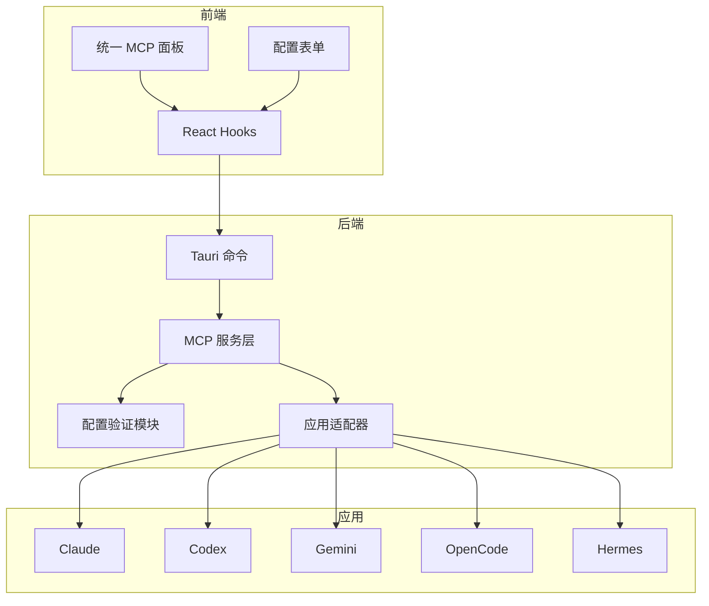
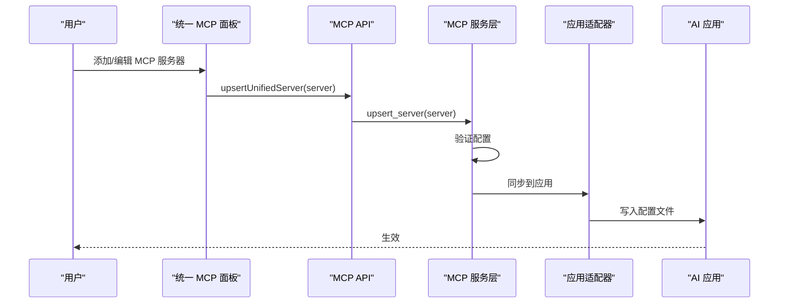
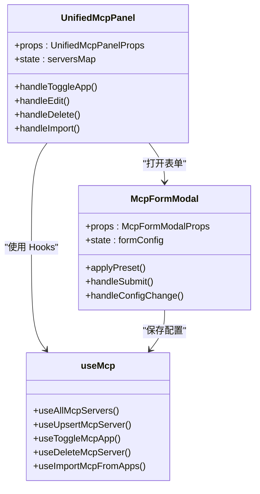
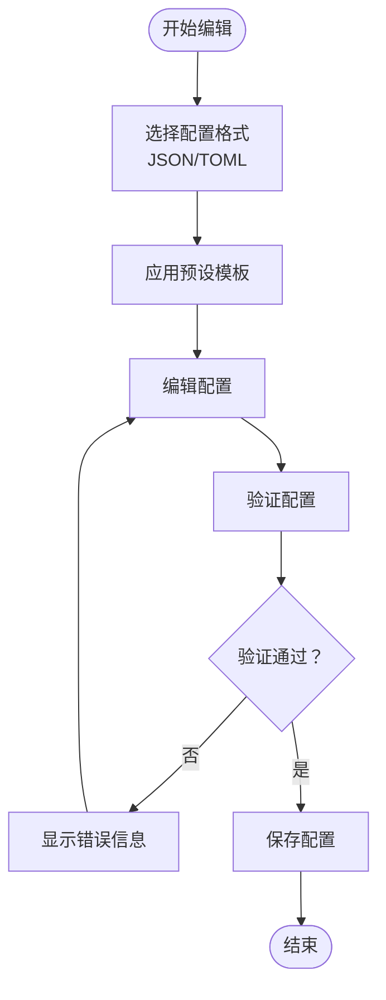
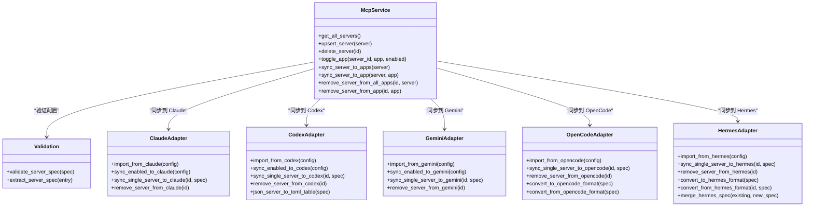
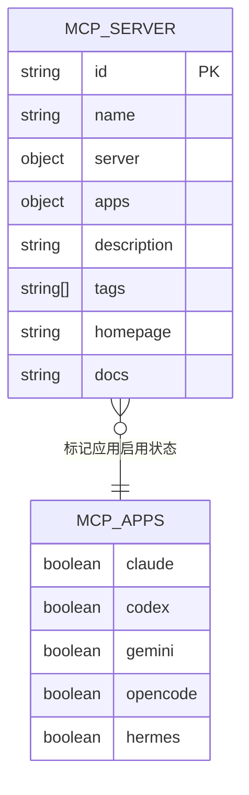
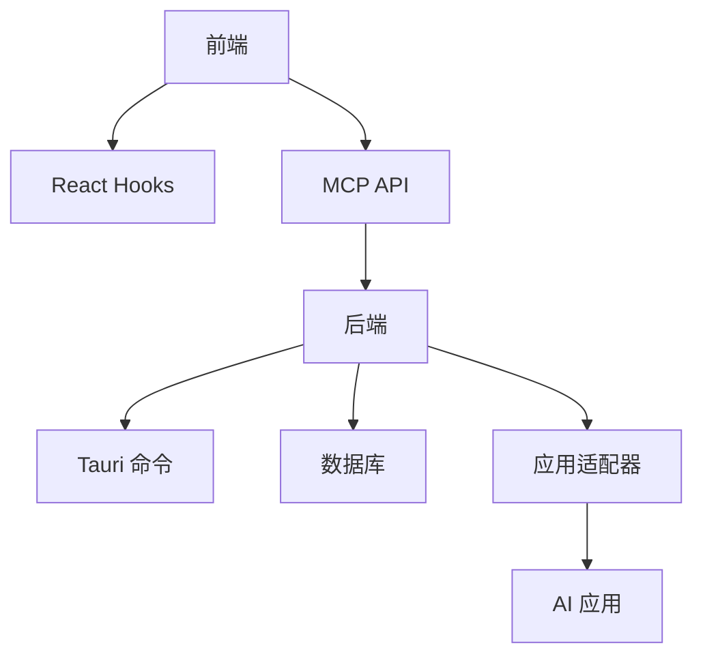

# MCP 协议基础

<cite>
**本文档引用的文件**
- [mcpPresets.ts](file://src/config/mcpPresets.ts)
- [useMcp.ts](file://src/hooks/useMcp.ts)
- [UnifiedMcpPanel.tsx](file://src/components/mcp/UnifiedMcpPanel.tsx)
- [McpFormModal.tsx](file://src/components/mcp/McpFormModal.tsx)
- [mcp.ts](file://src/lib/api/mcp.ts)
- [types.ts](file://src/types.ts)
- [mcp.rs](file://src-tauri/src/services/mcp.rs)
- [mcp.rs](file://src-tauri/src/commands/mcp.rs)
- [validation.rs](file://src-tauri/src/mcp/validation.rs)
- [claude.rs](file://src-tauri/src/mcp/claude.rs)
- [codex.rs](file://src-tauri/src/mcp/codex.rs)
- [gemini.rs](file://src-tauri/src/mcp/gemini.rs)
- [hermes.rs](file://src-tauri/src/mcp/hermes.rs)
- [opencode.rs](file://src-tauri/src/mcp/opencode.rs)
- [3-extensions/3.1-mcp.md](file://docs/user-manual/zh/3-extensions/3.1-mcp.md)
</cite>

## 目录
1. [简介](#简介)
2. [项目结构](#项目结构)
3. [核心组件](#核心组件)
4. [架构总览](#架构总览)
5. [详细组件分析](#详细组件分析)
6. [依赖关系分析](#依赖关系分析)
7. [性能考虑](#性能考虑)
8. [故障排除指南](#故障排除指南)
9. [结论](#结论)

## 简介
MCP（Model Context Protocol）是一种允许 AI 工具访问外部数据源和工具的协议。通过 MCP 服务器，AI 可以执行文件系统访问、网络请求、数据库查询和外部 API 调用等操作。在 CC Switch 中，MCP 协议被统一管理，支持与 Claude、Codex、Gemini、OpenCode、Hermes 等多个 AI 应用进行集成，实现跨应用的 MCP 服务器配置同步与导入。

## 项目结构
CC Switch 的 MCP 实现采用前后端分离的架构：
- 前端（React + TypeScript）：提供 MCP 服务器的可视化管理界面，支持预设模板、表单编辑、应用绑定等功能。
- 后端（Rust + Tauri）：提供 MCP 服务器的统一存储、配置验证、与各 AI 应用的同步与导入功能。

**图表来源**
- [UnifiedMcpPanel.tsx:1-319](file://src/components/mcp/UnifiedMcpPanel.tsx#L1-319)
- [McpFormModal.tsx:1-730](file://src/components/mcp/McpFormModal.tsx#L1-730)
- [useMcp.ts:1-75](file://src/hooks/useMcp.ts#L1-75)
- [mcp.ts:1-130](file://src/lib/api/mcp.ts#L1-130)
- [mcp.rs:1-438](file://src-tauri/src/services/mcp.rs#L1-438)
- [mcp.rs:1-208](file://src-tauri/src/commands/mcp.rs#L1-208)

**章节来源**
- [UnifiedMcpPanel.tsx:1-319](file://src/components/mcp/UnifiedMcpPanel.tsx#L1-319)
- [McpFormModal.tsx:1-730](file://src/components/mcp/McpFormModal.tsx#L1-730)
- [useMcp.ts:1-75](file://src/hooks/useMcp.ts#L1-75)
- [mcp.ts:1-130](file://src/lib/api/mcp.ts#L1-130)

## 核心组件
- 统一 MCP 面板：提供 MCP 服务器的集中管理界面，支持添加、编辑、删除、导入和应用绑定。
- 配置表单：支持 JSON/TOML 格式的 MCP 服务器配置编辑，内置验证与向导。
- React Hooks：封装 MCP API 调用，提供查询、新增、切换、删除等操作。
- MCP 服务层：负责统一存储、配置验证、与各 AI 应用的同步与导入。
- 应用适配器：针对 Claude、Codex、Gemini、OpenCode、Hermes 的格式差异进行转换与同步。

**章节来源**
- [mcpPresets.ts:1-105](file://src/config/mcpPresets.ts#L1-105)
- [useMcp.ts:1-75](file://src/hooks/useMcp.ts#L1-75)
- [UnifiedMcpPanel.tsx:1-319](file://src/components/mcp/UnifiedMcpPanel.tsx#L1-319)
- [McpFormModal.tsx:1-730](file://src/components/mcp/McpFormModal.tsx#L1-730)
- [mcp.rs:1-438](file://src-tauri/src/services/mcp.rs#L1-438)

## 架构总览
CC Switch 的 MCP 架构采用统一存储与多应用适配的设计：
- 统一存储：所有 MCP 服务器以统一结构存储，包含服务器规范、应用绑定状态等。
- 配置验证：对 MCP 服务器配置进行严格验证，确保 type、command/url、headers/env 等字段的有效性。
- 应用适配：针对不同 AI 应用的配置格式差异，进行格式转换与同步。
- 同步机制：当 MCP 服务器状态发生变化时，自动同步到对应的应用配置文件。

**图表来源**
- [mcp.ts:94-121](file://src/lib/api/mcp.ts#L94-121)
- [mcp.rs:18-51](file://src-tauri/src/services/mcp.rs#L18-51)
- [mcp.rs:170-177](file://src-tauri/src/commands/mcp.rs#L170-177)

**章节来源**
- [mcp.ts:94-121](file://src/lib/api/mcp.ts#L94-121)
- [mcp.rs:18-51](file://src-tauri/src/services/mcp.rs#L18-51)
- [mcp.rs:170-177](file://src-tauri/src/commands/mcp.rs#L170-177)

## 详细组件分析

### 统一 MCP 面板
统一 MCP 面板提供 MCP 服务器的集中管理功能：
- 服务器列表展示：显示所有 MCP 服务器的基本信息、描述、标签等。
- 应用绑定：支持为每个 MCP 服务器单独控制在 Claude、Codex、Gemini、OpenCode、Hermes 等应用中的启用状态。
- 操作功能：支持添加、编辑、删除、导入等操作。

**图表来源**
- [UnifiedMcpPanel.tsx:25-319](file://src/components/mcp/UnifiedMcpPanel.tsx#L25-319)
- [McpFormModal.tsx:28-730](file://src/components/mcp/McpFormModal.tsx#L28-730)
- [useMcp.ts:1-75](file://src/hooks/useMcp.ts#L1-75)

**章节来源**
- [UnifiedMcpPanel.tsx:1-319](file://src/components/mcp/UnifiedMcpPanel.tsx#L1-319)
- [McpFormModal.tsx:1-730](file://src/components/mcp/McpFormModal.tsx#L1-730)
- [useMcp.ts:1-75](file://src/hooks/useMcp.ts#L1-75)

### 配置表单与验证
配置表单支持 JSON/TOML 格式的 MCP 服务器配置编辑：
- 预设模板：提供常用 MCP 服务器的预设模板，支持一键应用。
- 格式切换：支持 JSON 与 TOML 格式之间的切换与转换。
- 验证规则：对 type、command/url、headers/env 等字段进行严格验证。

**图表来源**
- [McpFormModal.tsx:285-410](file://src/components/mcp/McpFormModal.tsx#L285-410)
- [validation.rs:7-51](file://src-tauri/src/mcp/validation.rs#L7-51)

**章节来源**
- [McpFormModal.tsx:1-730](file://src/components/mcp/McpFormModal.tsx#L1-730)
- [validation.rs:1-70](file://src-tauri/src/mcp/validation.rs#L1-70)

### 应用适配器与同步机制
应用适配器负责将统一的 MCP 服务器配置转换为各 AI 应用所需的格式，并进行同步：
- Claude：支持 JSON 格式的 mcpServers 配置。
- Codex：支持 TOML 格式的 mcp_servers 配置，包含复杂的字段转换逻辑。
- Gemini：支持 JSON 格式的 mcpServers 配置。
- OpenCode：支持本地/远程两种类型，包含格式转换逻辑。
- Hermes：支持 YAML 格式的 mcp_servers 配置，包含合并写入策略。

**图表来源**
- [mcp.rs:12-198](file://src-tauri/src/services/mcp.rs#L12-198)
- [validation.rs:1-70](file://src-tauri/src/mcp/validation.rs#L1-70)
- [claude.rs:1-149](file://src-tauri/src/mcp/claude.rs#L1-149)
- [codex.rs:1-681](file://src-tauri/src/mcp/codex.rs#L1-681)
- [gemini.rs:1-144](file://src-tauri/src/mcp/gemini.rs#L1-144)
- [opencode.rs:1-356](file://src-tauri/src/mcp/opencode.rs#L1-356)
- [hermes.rs:1-575](file://src-tauri/src/mcp/hermes.rs#L1-575)

**章节来源**
- [mcp.rs:1-438](file://src-tauri/src/services/mcp.rs#L1-438)
- [claude.rs:1-149](file://src-tauri/src/mcp/claude.rs#L1-149)
- [codex.rs:1-681](file://src-tauri/src/mcp/codex.rs#L1-681)
- [gemini.rs:1-144](file://src-tauri/src/mcp/gemini.rs#L1-144)
- [opencode.rs:1-356](file://src-tauri/src/mcp/opencode.rs#L1-356)
- [hermes.rs:1-575](file://src-tauri/src/mcp/hermes.rs#L1-575)

### 数据模型与类型定义
MCP 的数据模型在前端和后端都有明确的定义：
- McpServerSpec：MCP 服务器连接参数，支持 stdio/http/sse 三种传输类型。
- McpServer：统一的 MCP 服务器条目，包含 id、name、server、apps 等字段。
- McpApps：标记 MCP 服务器在各个应用中的启用状态。

**图表来源**
- [types.ts:447-488](file://src/types.ts#L447-488)

**章节来源**
- [types.ts:447-488](file://src/types.ts#L447-488)

### 预设模板与国际化
CC Switch 提供了多种 MCP 服务器的预设模板，涵盖常用的功能场景：
- fetch：HTTP 请求工具，让 AI 能够获取网页内容。
- time：时间工具，提供当前时间信息。
- memory：记忆工具，让 AI 能够存储和检索信息。
- sequential-thinking：思维链工具，增强 AI 推理能力。
- context7：文档搜索工具，查询技术文档。

这些预设模板通过国际化键值进行描述，支持多语言展示。

**章节来源**
- [mcpPresets.ts:1-105](file://src/config/mcpPresets.ts#L1-105)

## 依赖关系分析
MCP 协议在 CC Switch 中的依赖关系如下：
- 前端依赖：React Hooks、API 层、UI 组件库。
- 后端依赖：Tauri 命令系统、数据库存储、应用配置管理。
- 应用适配：针对不同 AI 应用的配置格式差异进行转换。

**图表来源**
- [mcp.ts:1-130](file://src/lib/api/mcp.ts#L1-130)
- [mcp.rs:1-208](file://src-tauri/src/commands/mcp.rs#L1-208)
- [mcp.rs:1-438](file://src-tauri/src/services/mcp.rs#L1-438)

**章节来源**
- [mcp.ts:1-130](file://src/lib/api/mcp.ts#L1-130)
- [mcp.rs:1-208](file://src-tauri/src/commands/mcp.rs#L1-208)
- [mcp.rs:1-438](file://src-tauri/src/services/mcp.rs#L1-438)

## 性能考虑
- 配置验证：在保存前进行严格的配置验证，避免无效配置导致的运行时错误。
- 同步策略：采用增量同步策略，仅对启用的应用进行同步，减少不必要的文件写入。
- 格式转换：针对不同应用的格式转换采用高效的算法，避免重复转换和内存浪费。
- 缓存机制：利用 React Query 的缓存机制，减少重复的 API 调用。

## 故障排除指南
- 配置格式错误：检查 JSON/TOML 格式是否正确，确保必需字段完整。
- 应用同步失败：确认目标应用的配置目录是否存在，检查权限设置。
- 预设模板问题：确保预设模板的包名正确，网络连接正常。
- 导入失败：检查目标应用的配置文件格式是否符合预期，必要时进行手动修复。

**章节来源**
- [McpFormModal.tsx:285-410](file://src/components/mcp/McpFormModal.tsx#L285-410)
- [validation.rs:1-70](file://src-tauri/src/mcp/validation.rs#L1-70)

## 结论
MCP 协议为 AI 工具提供了强大的外部资源访问能力。在 CC Switch 中，通过统一的 MCP 管理界面和多应用适配器，实现了跨应用的 MCP 服务器配置同步与导入。该实现不仅提升了 AI 工具的互操作性，还为用户提供了便捷的管理和维护体验。随着更多 AI 应用的支持，MCP 协议将在 AI 工具生态系统中发挥越来越重要的作用。