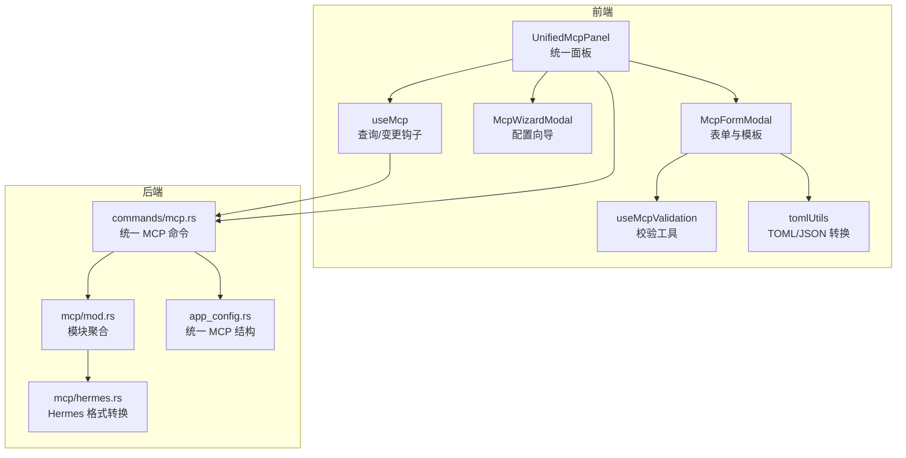
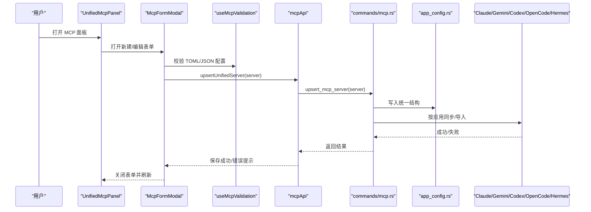
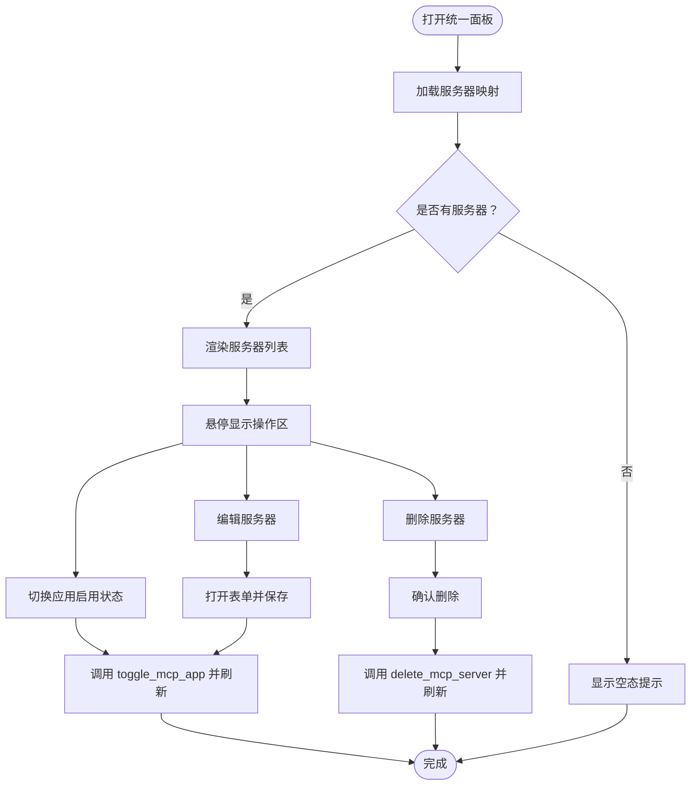
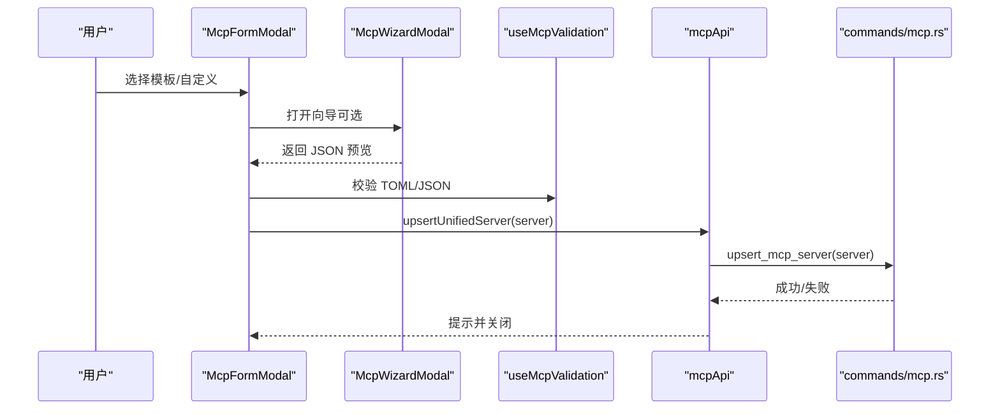
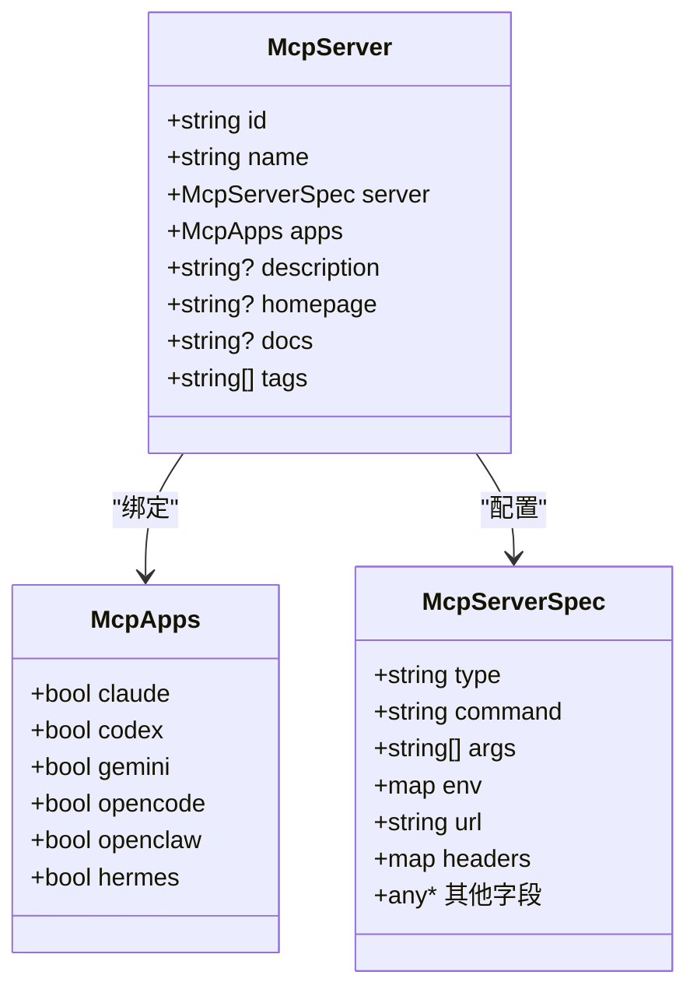
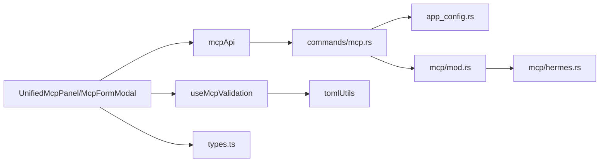

# MCP 协议支持

<cite>
**本文引用的文件**
- [src/config/mcpPresets.ts](file://src/config/mcpPresets.ts)
- [src/hooks/useMcp.ts](file://src/hooks/useMcp.ts)
- [src/components/mcp/McpFormModal.tsx](file://src/components/mcp/McpFormModal.tsx)
- [src/components/mcp/McpWizardModal.tsx](file://src/components/mcp/McpWizardModal.tsx)
- [src/components/mcp/UnifiedMcpPanel.tsx](file://src/components/mcp/UnifiedMcpPanel.tsx)
- [src/components/mcp/useMcpValidation.ts](file://src/components/mcp/useMcpValidation.ts)
- [src/lib/api/mcp.ts](file://src/lib/api/mcp.ts)
- [src/utils/tomlUtils.ts](file://src/utils/tomlUtils.ts)
- [src/types.ts](file://src/types.ts)
- [src-tauri/src/mcp/mod.rs](file://src-tauri/src/mcp/mod.rs)
- [src-tauri/src/commands/mcp.rs](file://src-tauri/src/commands/mcp.rs)
- [src-tauri/src/app_config.rs](file://src-tauri/src/app_config.rs)
- [src-tauri/src/mcp/hermes.rs](file://src-tauri/src/mcp/hermes.rs)
- [docs/user-manual/en/3-extensions/3.1-mcp.md](file://docs/user-manual/en/3-extensions/3.1-mcp.md)
- [docs/user-manual/zh/3-extensions/3.1-mcp.md](file://docs/user-manual/zh/3-extensions/3.1-mcp.md)
- [docs/user-manual/ja/3-extensions/3.1-mcp.md](file://docs/user-manual/ja/3-extensions/3.1-mcp.md)
</cite>

## 目录
1. [简介](#简介)
2. [项目结构](#项目结构)
3. [核心组件](#核心组件)
4. [架构总览](#架构总览)
5. [详细组件分析](#详细组件分析)
6. [依赖关系分析](#依赖关系分析)
7. [性能考量](#性能考量)
8. [故障排查指南](#故障排查指南)
9. [结论](#结论)
10. [附录](#附录)

## 简介
本文件面向 CC Switch 的 MCP（Model Context Protocol）支持系统，系统性阐述 MCP 协议在 AI 工具生态中的定位与价值，以及 CC Switch 在前端与后端的实现方式。重点覆盖以下方面：
- MCP 协议基础与在 AI 工具中的作用
- MCP 服务器的统一配置管理、应用绑定与双向同步机制
- MCP 服务器模板与向导的使用指南、自定义配置与校验规则
- 与 Claude、Codex、Gemini、OpenCode、Hermes 的集成方式
- MCP 配置导入导出与深链导入、备份与恢复
- 实际配置示例、常见问题排查与性能优化建议

## 项目结构
围绕 MCP 的前端与后端实现，主要分布在以下模块：
- 前端 UI 与交互：统一 MCP 面板、表单与向导、校验工具
- 前端 API 与状态：统一的 MCP 查询、增删改、应用绑定与导入
- 工具库：TOML 解析与转换、智能 JSON 解析
- 类型定义：统一的 MCP 服务器结构与应用绑定集合
- 后端服务：统一 MCP 管理命令、各应用的 MCP 导入/同步/转换

图表来源
- [src/components/mcp/UnifiedMcpPanel.tsx:143-212](file://src/components/mcp/UnifiedMcpPanel.tsx#L143-L212)
- [src/components/mcp/McpFormModal.tsx:416-726](file://src/components/mcp/McpFormModal.tsx#L416-L726)
- [src/components/mcp/McpWizardModal.tsx:226-428](file://src/components/mcp/McpWizardModal.tsx#L226-L428)
- [src/components/mcp/useMcpValidation.ts:4-97](file://src/components/mcp/useMcpValidation.ts#L4-L97)
- [src/utils/tomlUtils.ts:1-222](file://src/utils/tomlUtils.ts#L1-L222)
- [src/lib/api/mcp.ts:11-129](file://src/lib/api/mcp.ts#L11-L129)
- [src-tauri/src/commands/mcp.rs:162-207](file://src-tauri/src/commands/mcp.rs#L162-L207)
- [src-tauri/src/mcp/mod.rs:1-37](file://src-tauri/src/mcp/mod.rs#L1-L37)
- [src-tauri/src/mcp/hermes.rs:1-68](file://src-tauri/src/mcp/hermes.rs#L1-L68)
- [src-tauri/src/app_config.rs:252-257](file://src-tauri/src/app_config.rs#L252-L257)

章节来源
- [src/components/mcp/UnifiedMcpPanel.tsx:1-319](file://src/components/mcp/UnifiedMcpPanel.tsx#L1-L319)
- [src/components/mcp/McpFormModal.tsx:1-730](file://src/components/mcp/McpFormModal.tsx#L1-L730)
- [src/components/mcp/McpWizardModal.tsx:1-433](file://src/components/mcp/McpWizardModal.tsx#L1-L433)
- [src/components/mcp/useMcpValidation.ts:1-98](file://src/components/mcp/useMcpValidation.ts#L1-L98)
- [src/utils/tomlUtils.ts:1-222](file://src/utils/tomlUtils.ts#L1-L222)
- [src/lib/api/mcp.ts:1-130](file://src/lib/api/mcp.ts#L1-L130)
- [src-tauri/src/commands/mcp.rs:1-208](file://src-tauri/src/commands/mcp.rs#L1-L208)
- [src-tauri/src/mcp/mod.rs:1-37](file://src-tauri/src/mcp/mod.rs#L1-L37)
- [src-tauri/src/mcp/hermes.rs:1-68](file://src-tauri/src/mcp/hermes.rs#L1-L68)
- [src-tauri/src/app_config.rs:252-257](file://src-tauri/src/app_config.rs#L252-L257)

## 核心组件
- 统一 MCP 面板：集中展示、添加、编辑、删除与应用绑定 MCP 服务器，并支持从各应用批量导入。
- MCP 表单与模板：提供预设模板一键应用、向导辅助生成配置、JSON/TOML 双格式输入与实时校验。
- 校验工具：对 TOML/JSON 格式与关键字段进行严格校验，提供本地化错误提示。
- 前端 API：统一的查询、增删改、应用切换与导入命令，基于 Tauri invoke 调用后端。
- 后端服务：统一 MCP 结构与命令，按应用进行导入/同步/转换，保证与各客户端配置文件的一致性。

章节来源
- [src/components/mcp/UnifiedMcpPanel.tsx:29-319](file://src/components/mcp/UnifiedMcpPanel.tsx#L29-L319)
- [src/components/mcp/McpFormModal.tsx:28-730](file://src/components/mcp/McpFormModal.tsx#L28-L730)
- [src/components/mcp/McpWizardModal.tsx:16-433](file://src/components/mcp/McpWizardModal.tsx#L16-L433)
- [src/components/mcp/useMcpValidation.ts:4-97](file://src/components/mcp/useMcpValidation.ts#L4-L97)
- [src/lib/api/mcp.ts:11-129](file://src/lib/api/mcp.ts#L11-L129)
- [src-tauri/src/commands/mcp.rs:162-207](file://src-tauri/src/commands/mcp.rs#L162-L207)

## 架构总览
MCP 支持采用“前端统一管理 + 后端按应用同步”的架构。前端负责用户交互与配置校验，后端负责与各应用配置文件的读写与格式转换。

图表来源
- [src/components/mcp/UnifiedMcpPanel.tsx:186-200](file://src/components/mcp/UnifiedMcpPanel.tsx#L186-L200)
- [src/components/mcp/McpFormModal.tsx:285-410](file://src/components/mcp/McpFormModal.tsx#L285-L410)
- [src/components/mcp/useMcpValidation.ts:30-57](file://src/components/mcp/useMcpValidation.ts#L30-L57)
- [src/lib/api/mcp.ts:101-103](file://src/lib/api/mcp.ts#L101-L103)
- [src-tauri/src/commands/mcp.rs:170-177](file://src-tauri/src/commands/mcp.rs#L170-L177)
- [src-tauri/src/app_config.rs:252-257](file://src-tauri/src/app_config.rs#L252-L257)

## 详细组件分析

### 组件 A：统一 MCP 面板（UnifiedMcpPanel）
- 功能要点
  - 展示所有 MCP 服务器，统计各应用启用数量
  - 提供添加、编辑、删除入口
  - 应用绑定：每个服务器可独立控制在 Claude、Codex、Gemini、OpenCode、Hermes 等应用中的启用状态
  - 导入：从所有应用导入 MCP 服务器，自动去重与合并
- 交互流程
  - 打开面板 → 加载服务器映射 → 渲染列表项 → 悬浮操作区（编辑/删除）→ 应用切换 → 保存并刷新

图表来源
- [src/components/mcp/UnifiedMcpPanel.tsx:48-141](file://src/components/mcp/UnifiedMcpPanel.tsx#L48-L141)

章节来源
- [src/components/mcp/UnifiedMcpPanel.tsx:29-319](file://src/components/mcp/UnifiedMcpPanel.tsx#L29-L319)

### 组件 B：MCP 表单与模板（McpFormModal）
- 功能要点
  - 预设模板：一键应用内置模板（如 fetch、time、memory、sequential-thinking、context7），自动填充描述与标签
  - 自定义配置：支持 JSON/TOML 双格式输入，智能解析与校验
  - 应用绑定：勾选目标应用，统一写入 apps 字段
  - 元数据：名称、描述、主页、文档、标签等可选信息
  - 向导：McpWizardModal 提供可视化生成 JSON 配置
- 关键流程
  - 选择模板 → 自动生成配置 → 校验并保存
  - 自定义输入 → 实时校验 TOML/JSON → 生成唯一 ID → 保存

图表来源
- [src/components/mcp/McpFormModal.tsx:183-283](file://src/components/mcp/McpFormModal.tsx#L183-L283)
- [src/components/mcp/McpWizardModal.tsx:136-153](file://src/components/mcp/McpWizardModal.tsx#L136-L153)
- [src/components/mcp/useMcpValidation.ts:30-89](file://src/components/mcp/useMcpValidation.ts#L30-L89)
- [src/lib/api/mcp.ts:101-103](file://src/lib/api/mcp.ts#L101-L103)
- [src-tauri/src/commands/mcp.rs:170-177](file://src-tauri/src/commands/mcp.rs#L170-L177)

章节来源
- [src/components/mcp/McpFormModal.tsx:28-730](file://src/components/mcp/McpFormModal.tsx#L28-L730)
- [src/components/mcp/McpWizardModal.tsx:16-433](file://src/components/mcp/McpWizardModal.tsx#L16-L433)
- [src/components/mcp/useMcpValidation.ts:4-97](file://src/components/mcp/useMcpValidation.ts#L4-L97)

### 组件 C：MCP 预设与模板（mcpPresets）
- 功能要点
  - 跨平台命令封装：Windows 使用 cmd /c 包裹 npx，非 Windows 直接使用 npx
  - 内置常用预设：fetch、time、memory、sequential-thinking、context7
  - 国际化描述：通过 t() 注入 description 字段
- 使用场景
  - 新建服务器时快速选择模板
  - 作为默认“回种”配置，disabled 形式写入配置文件，用户可一键启用

章节来源
- [src/config/mcpPresets.ts:1-105](file://src/config/mcpPresets.ts#L1-L105)

### 组件 D：TOML/JSON 转换与校验（tomlUtils）
- 功能要点
  - TOML 校验与规范化：validateToml
  - TOML → McpServerSpec：tomlToMcpServer（兼容多种格式）
  - McpServerSpec → TOML：mcpServerToToml
  - ID 推断：extractIdFromToml
- 校验规则
  - TOML 必须为对象
  - stdio 类型需包含 command
  - http/sse 类型需包含 url
  - JSON 格式要求与 TOML 类似，同时禁止顶层 mcpServers

章节来源
- [src/utils/tomlUtils.ts:10-95](file://src/utils/tomlUtils.ts#L10-L95)
- [src/utils/tomlUtils.ts:184-222](file://src/utils/tomlUtils.ts#L184-L222)
- [src/components/mcp/useMcpValidation.ts:30-89](file://src/components/mcp/useMcpValidation.ts#L30-L89)

### 组件 E：后端命令与应用同步（commands/mcp.rs、mcp/mod.rs、mcp/hermes.rs）
- 统一命令
  - 获取/新增/删除 MCP 服务器
  - 切换某服务器在指定应用的启用状态
  - 从所有应用导入 MCP 服务器
- 应用同步
  - Claude/Gemini/Codex/OpenCode/Hermes 各自的导入/同步/转换逻辑
  - Hermes 特殊字段保留与剥离策略
- 统一结构
  - app_config.rs 定义统一的 McpServer 与 McpRoot，支持 v3.7.0+ 的统一存储

图表来源
- [src-tauri/src/app_config.rs:252-257](file://src-tauri/src/app_config.rs#L252-L257)
- [src/types.ts:261-270](file://src/types.ts#L261-L270)

章节来源
- [src-tauri/src/commands/mcp.rs:162-207](file://src-tauri/src/commands/mcp.rs#L162-L207)
- [src-tauri/src/mcp/mod.rs:1-37](file://src-tauri/src/mcp/mod.rs#L1-L37)
- [src-tauri/src/mcp/hermes.rs:24-68](file://src-tauri/src/mcp/hermes.rs#L24-L68)
- [src-tauri/src/app_config.rs:252-257](file://src-tauri/src/app_config.rs#L252-L257)

## 依赖关系分析
- 前端依赖
  - 统一 API：mcpApi → commands/mcp.rs
  - 校验工具：useMcpValidation → tomlUtils
  - 配置结构：types.ts 中 McpServer/McpServerSpec/McpApps
- 后端依赖
  - 统一结构：app_config.rs
  - 应用模块：mcp/mod.rs 聚合各应用同步逻辑
  - 特殊转换：mcp/hermes.rs 处理 Hermes 格式差异

图表来源
- [src/lib/api/mcp.ts:11-129](file://src/lib/api/mcp.ts#L11-L129)
- [src-tauri/src/commands/mcp.rs:162-207](file://src-tauri/src/commands/mcp.rs#L162-L207)
- [src-tauri/src/mcp/mod.rs:1-37](file://src-tauri/src/mcp/mod.rs#L1-L37)
- [src-tauri/src/mcp/hermes.rs:1-68](file://src-tauri/src/mcp/hermes.rs#L1-L68)
- [src-tauri/src/app_config.rs:252-257](file://src-tauri/src/app_config.rs#L252-L257)
- [src/components/mcp/useMcpValidation.ts:4-97](file://src/components/mcp/useMcpValidation.ts#L4-L97)
- [src/utils/tomlUtils.ts:1-222](file://src/utils/tomlUtils.ts#L1-L222)
- [src/types.ts:261-270](file://src/types.ts#L261-L270)

章节来源
- [src/lib/api/mcp.ts:11-129](file://src/lib/api/mcp.ts#L11-L129)
- [src-tauri/src/commands/mcp.rs:162-207](file://src-tauri/src/commands/mcp.rs#L162-L207)
- [src-tauri/src/mcp/mod.rs:1-37](file://src-tauri/src/mcp/mod.rs#L1-L37)
- [src-tauri/src/mcp/hermes.rs:1-68](file://src-tauri/src/mcp/hermes.rs#L1-L68)
- [src-tauri/src/app_config.rs:252-257](file://src-tauri/src/app_config.rs#L252-L257)
- [src/components/mcp/useMcpValidation.ts:4-97](file://src/components/mcp/useMcpValidation.ts#L4-L97)
- [src/utils/tomlUtils.ts:1-222](file://src/utils/tomlUtils.ts#L1-L222)
- [src/types.ts:261-270](file://src/types.ts#L261-L270)

## 性能考量
- 配置解析与校验
  - TOML/JSON 解析与规范化在前端即时进行，避免无效提交
  - 校验失败时尽早返回，减少后端往返
- 同步策略
  - 按应用增量同步，避免全量写入
  - 导入时先读取再合并，减少冲突
- UI 响应
  - 使用 React Query 缓存与失效策略，减少重复请求
  - 列表渲染使用虚拟化与懒加载（如存在）

## 故障排查指南
- 常见错误与定位
  - TOML/JSON 格式错误：查看本地化错误提示，检查对象结构与必需字段
  - 命令不可用：通过命令校验接口确认 PATH 中是否存在对应可执行文件
  - 应用未同步：确认对应应用目录是否存在，以及应用版本是否支持 MCP
- 建议排查步骤
  - 在表单中切换格式（JSON/TOML）以定位问题
  - 使用向导生成最小可用配置，逐步增加字段
  - 从应用导入，确认现有配置是否可被正确解析
  - 查看后端日志与命令返回，确认统一结构写入是否成功

章节来源
- [src/components/mcp/useMcpValidation.ts:21-57](file://src/components/mcp/useMcpValidation.ts#L21-L57)
- [src/lib/api/mcp.ts:31-33](file://src/lib/api/mcp.ts#L31-L33)
- [src-tauri/src/commands/mcp.rs:197-207](file://src-tauri/src/commands/mcp.rs#L197-L207)

## 结论
CC Switch 的 MCP 支持以“统一结构 + 分应用同步”为核心设计，前端提供直观易用的模板与向导，后端保障与各应用配置文件的兼容与一致性。通过严格的校验与导入机制，用户可以安全地管理跨应用的 MCP 服务器，并在 Claude、Codex、Gemini、OpenCode、Hermes 之间实现高效的双向同步。

## 附录

### MCP 协议与在 AI 工具生态中的作用
- MCP 允许 AI 工具访问外部数据源与工具，如文件系统、网络请求、数据库与外部 API
- 通过 MCP 服务器，AI 能力得到扩展，形成更强大的上下文与推理能力

章节来源
- [docs/user-manual/en/3-extensions/3.1-mcp.md:3-11](file://docs/user-manual/en/3-extensions/3.1-mcp.md#L3-L11)

### MCP 服务器配置管理与应用绑定
- 统一结构：McpServer + McpApps，支持在各应用中独立启用/禁用
- 同步机制：按应用导入/同步，写入对应客户端配置文件
- 双向同步：启用/禁用状态与服务器定义在 CC Switch 与客户端之间保持一致

章节来源
- [src-tauri/src/app_config.rs:252-257](file://src-tauri/src/app_config.rs#L252-L257)
- [src-tauri/src/commands/mcp.rs:185-195](file://src-tauri/src/commands/mcp.rs#L185-L195)
- [docs/user-manual/en/3-extensions/3.1-mcp.md:95-107](file://docs/user-manual/en/3-extensions/3.1-mcp.md#L95-L107)

### MCP 服务器模板与向导使用指南
- 预设模板：fetch、time、memory、sequential-thinking、context7，一键应用并自动填充描述
- 自定义配置：支持 JSON/TOML 双格式，向导可生成最小可用配置
- 校验规则：TOML/JSON 格式、必需字段（stdio 需 command，http/sse 需 url）

章节来源
- [src/config/mcpPresets.ts:31-90](file://src/config/mcpPresets.ts#L31-L90)
- [src/components/mcp/McpWizardModal.tsx:96-134](file://src/components/mcp/McpWizardModal.tsx#L96-L134)
- [src/components/mcp/useMcpValidation.ts:30-89](file://src/components/mcp/useMcpValidation.ts#L30-L89)
- [docs/user-manual/en/3-extensions/3.1-mcp.md:41-94](file://docs/user-manual/en/3-extensions/3.1-mcp.md#L41-L94)

### 与 Claude、Codex、Gemini、OpenCode、Hermes 的集成方式
- Claude：同步到 ~/.claude.json 的 mcpServers
- Codex：同步到 ~/.codex/config.toml 的 [mcp_servers]
- Gemini：同步到 ~/.gemini/settings.json 的 mcpServers
- OpenCode：同步到 ~/.config/opencode/opencode.json 的 mcp
- Hermes：同步到 ~/.hermes/config.yaml 的 mcp_servers，保留额外字段

章节来源
- [docs/user-manual/en/3-extensions/3.1-mcp.md:95-107](file://docs/user-manual/en/3-extensions/3.1-mcp.md#L95-L107)
- [src-tauri/src/mcp/hermes.rs:24-68](file://src-tauri/src/mcp/hermes.rs#L24-L68)

### MCP 配置导入导出与深链导入、备份与恢复
- 导入：从所有应用导入 MCP 服务器，自动去重与合并
- 导出：通过统一结构导出，便于备份与迁移
- 深链导入：可通过深链触发导入流程（具体实现参考深链模块）

章节来源
- [src-tauri/src/commands/mcp.rs:197-207](file://src-tauri/src/commands/mcp.rs#L197-L207)
- [docs/user-manual/zh/3-extensions/3.1-mcp.md:1-55](file://docs/user-manual/zh/3-extensions/3.1-mcp.md#L1-L55)

### 实际 MCP 配置示例与最佳实践
- stdio 示例：包含 command、args、env
- http 示例：包含 url
- sse 示例：包含 url
- 最佳实践：优先使用向导生成最小可用配置，逐步增加字段；为服务器设置清晰的 ID 与描述；在应用中按需启用

章节来源
- [docs/user-manual/en/3-extensions/3.1-mcp.md:57-94](file://docs/user-manual/en/3-extensions/3.1-mcp.md#L57-L94)