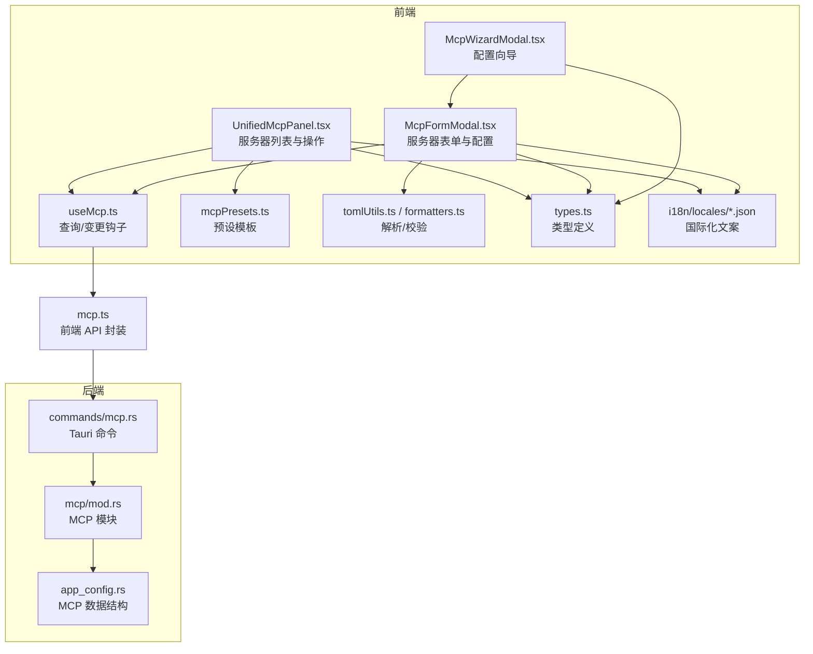
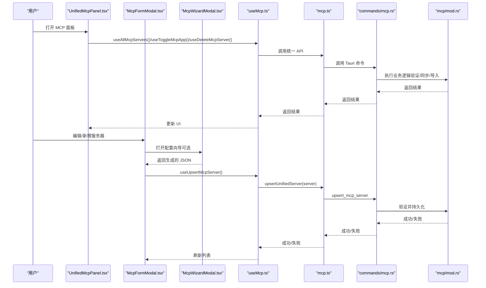
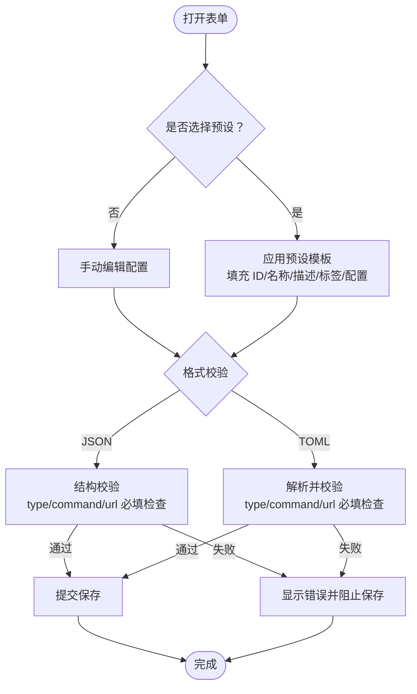
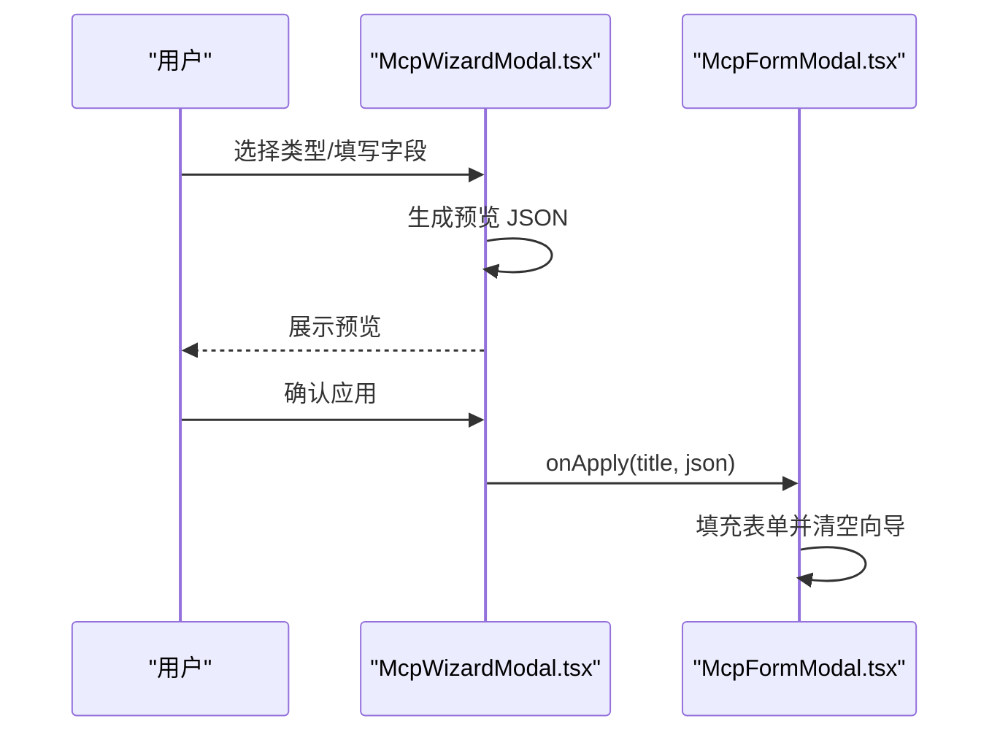
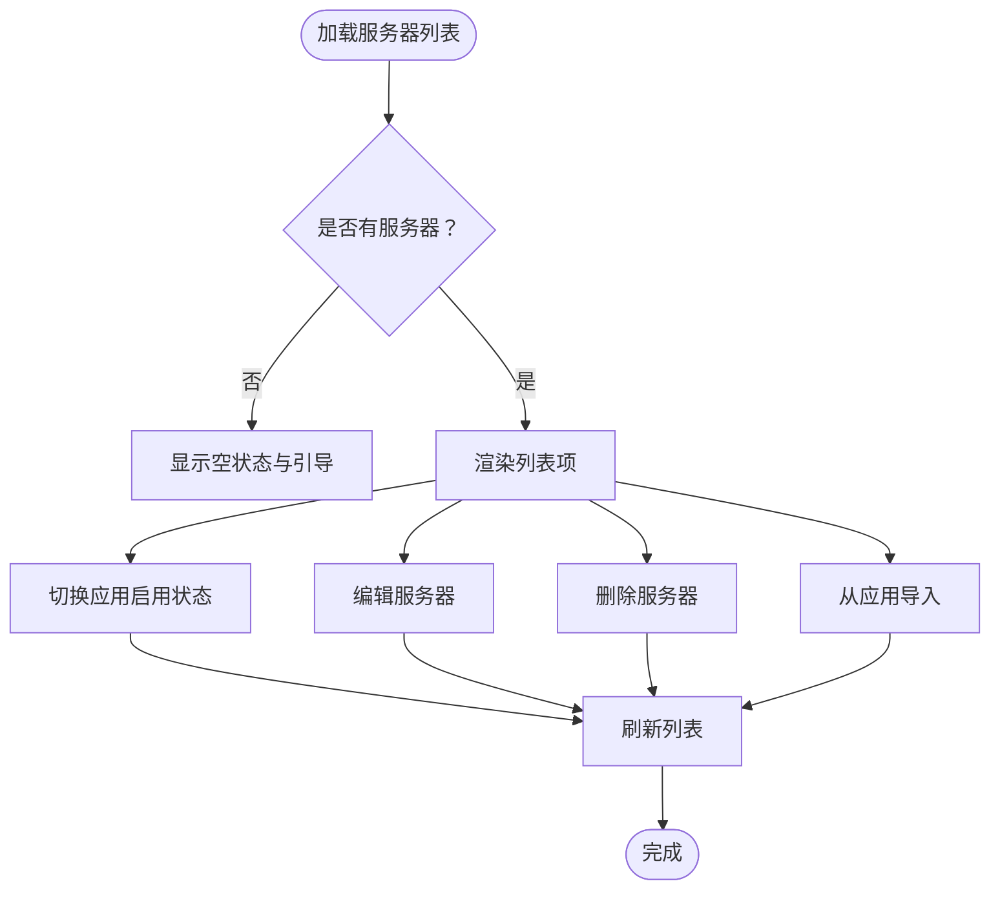
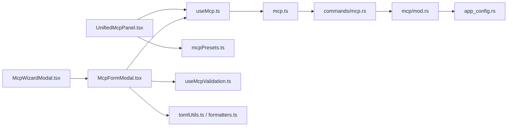

# MCP 服务器管理

<cite>
**本文引用的文件**
- [McpFormModal.tsx](file://src/components/mcp/McpFormModal.tsx)
- [McpWizardModal.tsx](file://src/components/mcp/McpWizardModal.tsx)
- [UnifiedMcpPanel.tsx](file://src/components/mcp/UnifiedMcpPanel.tsx)
- [useMcp.ts](file://src/hooks/useMcp.ts)
- [mcpPresets.ts](file://src/config/mcpPresets.ts)
- [tomlUtils.ts](file://src/utils/tomlUtils.ts)
- [formatters.ts](file://src/utils/formatters.ts)
- [mcp.ts](file://src/lib/api/mcp.ts)
- [types.ts](file://src/types.ts)
- [useMcpValidation.ts](file://src/components/mcp/useMcpValidation.ts)
- [mcp 模块](file://src-tauri/src/mcp/mod.rs)
- [app_config.rs](file://src-tauri/src/app_config.rs)
- [mcp 命令](file://src-tauri/src/commands/mcp.rs)
- [MCP 使用手册（中文）](file://docs/user-manual/zh/3-extensions/3.1-mcp.md)
- [MCP 使用手册（英文）](file://docs/user-manual/en/3-extensions/3.1-mcp.md)
- [MCP 使用手册（日文）](file://docs/user-manual/ja/3-extensions/3.1-mcp.md)
</cite>

## 目录
1. [简介](#简介)
2. [项目结构](#项目结构)
3. [核心组件](#核心组件)
4. [架构总览](#架构总览)
5. [详细组件分析](#详细组件分析)
6. [依赖关系分析](#依赖关系分析)
7. [性能考量](#性能考量)
8. [故障排查指南](#故障排查指南)
9. [结论](#结论)
10. [附录](#附录)

## 简介
本文件面向 CC Switch 中的 MCP（Model Context Protocol）服务器管理功能，系统性阐述服务器的创建、配置与管理流程，解释表单字段与模板机制，说明服务器状态（启用/禁用）与健康检查、故障处理，以及服务器列表的显示、排序与批量操作。同时提供最佳实践与常见配置示例，帮助用户正确设置各类 MCP 服务器。

## 项目结构
MCP 管理相关前端组件集中在 src/components/mcp，配合 hooks/useMcp.ts 提供查询与变更操作；配置模板位于 src/config/mcpPresets.ts；配置解析与校验位于 src/utils；UI 国际化文案位于 src/i18n/locales。后端 Rust 模块位于 src-tauri/src/mcp，提供 MCP 服务器的验证、同步与导入导出能力，并通过 Tauri 命令暴露到前端。

图示来源
- [UnifiedMcpPanel.tsx:1-319](file://src/components/mcp/UnifiedMcpPanel.tsx#L1-319)
- [McpFormModal.tsx:1-730](file://src/components/mcp/McpFormModal.tsx#L1-730)
- [McpWizardModal.tsx:1-433](file://src/components/mcp/McpWizardModal.tsx#L1-433)
- [useMcp.ts:1-75](file://src/hooks/useMcp.ts#L1-75)
- [mcp.ts:1-130](file://src/lib/api/mcp.ts#L1-130)
- [mcp 模块:1-36](file://src-tauri/src/mcp/mod.rs#L1-36)
- [mcp 命令:1-48](file://src-tauri/src/commands/mcp.rs#L1-48)
- [app_config.rs:1-257](file://src-tauri/src/app_config.rs#L1-257)

章节来源
- [UnifiedMcpPanel.tsx:1-319](file://src/components/mcp/UnifiedMcpPanel.tsx#L1-319)
- [McpFormModal.tsx:1-730](file://src/components/mcp/McpFormModal.tsx#L1-730)
- [McpWizardModal.tsx:1-433](file://src/components/mcp/McpWizardModal.tsx#L1-433)
- [useMcp.ts:1-75](file://src/hooks/useMcp.ts#L1-75)
- [mcp.ts:1-130](file://src/lib/api/mcp.ts#L1-130)
- [mcp 模块:1-36](file://src-tauri/src/mcp/mod.rs#L1-36)
- [mcp 命令:1-48](file://src-tauri/src/commands/mcp.rs#L1-48)
- [app_config.rs:1-257](file://src-tauri/src/app_config.rs#L1-257)

## 核心组件
- 服务器列表面板：UnifiedMcpPanel.tsx 提供服务器列表、启用/禁用切换、编辑、删除、导入等操作入口。
- 服务器表单：McpFormModal.tsx 负责服务器基本信息与配置编辑，支持 JSON/TOML 双格式输入与向导辅助。
- 配置向导：McpWizardModal.tsx 提供交互式向导，快速生成 JSON 配置。
- 钩子与 API：useMcp.ts 提供查询与变更的 React Query 钩子；mcp.ts 封装前端调用后端命令。
- 预设模板：mcpPresets.ts 定义常用 MCP 服务器模板，便于快速添加。
- 解析与校验：tomlUtils.ts 与 formatters.ts 提供 TOML/JSON 解析、规范化与错误格式化。
- 类型定义：types.ts 定义 McpServer、McpServerSpec、McpApps 等核心类型。

章节来源
- [UnifiedMcpPanel.tsx:1-319](file://src/components/mcp/UnifiedMcpPanel.tsx#L1-319)
- [McpFormModal.tsx:1-730](file://src/components/mcp/McpFormModal.tsx#L1-730)
- [McpWizardModal.tsx:1-433](file://src/components/mcp/McpWizardModal.tsx#L1-433)
- [useMcp.ts:1-75](file://src/hooks/useMcp.ts#L1-75)
- [mcp.ts:1-130](file://src/lib/api/mcp.ts#L1-130)
- [mcpPresets.ts:1-105](file://src/config/mcpPresets.ts#L1-105)
- [tomlUtils.ts:1-222](file://src/utils/tomlUtils.ts#L1-222)
- [formatters.ts:1-80](file://src/utils/formatters.ts#L1-80)
- [types.ts:448-498](file://src/types.ts#L448-498)

## 架构总览
MCP 管理采用“前端 UI + 钩子 + API 封装 + 后端命令”的分层设计。前端通过 useMcp.ts 发起查询与变更，mcp.ts 将请求转发至 Tauri 命令，后端在 src-tauri/src/commands/mcp.rs 中实现具体逻辑，再委托 src-tauri/src/mcp/mod.rs 的各应用模块完成验证、同步与导入导出。

图示来源
- [UnifiedMcpPanel.tsx:1-319](file://src/components/mcp/UnifiedMcpPanel.tsx#L1-319)
- [McpFormModal.tsx:1-730](file://src/components/mcp/McpFormModal.tsx#L1-730)
- [McpWizardModal.tsx:1-433](file://src/components/mcp/McpWizardModal.tsx#L1-433)
- [useMcp.ts:1-75](file://src/hooks/useMcp.ts#L1-75)
- [mcp.ts:94-128](file://src/lib/api/mcp.ts#L94-128)
- [mcp 命令:1-48](file://src-tauri/src/commands/mcp.rs#L1-48)
- [mcp 模块:1-36](file://src-tauri/src/mcp/mod.rs#L1-36)

## 详细组件分析

### 服务器表单与配置流程
- 字段说明
  - 服务器 ID（唯一）：用于标识服务器，新增时必填且不可重复。
  - 名称：显示名称，未填写时回退为 ID。
  - 启用到应用：勾选后该服务器在对应应用中生效。
  - 附加信息：描述、标签、主页链接、文档链接（可选）。
  - 配置：支持 JSON 或 TOML 输入，向导可自动生成 JSON。
- 预设模板
  - 新增时可从预设模板中选择，自动填充 ID、名称、描述、标签与配置。
- 校验与错误
  - TOML/JSON 格式校验与错误格式化。
  - stdio 类型要求 command 必填；http/sse 类型要求 url 必填。
- 保存流程
  - 校验通过后调用 upsertUnifiedServer，后端持久化并同步到各应用配置。

图示来源
- [McpFormModal.tsx:285-410](file://src/components/mcp/McpFormModal.tsx#L285-410)
- [useMcpValidation.ts:30-89](file://src/components/mcp/useMcpValidation.ts#L30-89)
- [tomlUtils.ts:53-95](file://src/utils/tomlUtils.ts#L53-95)
- [formatters.ts:26-65](file://src/utils/formatters.ts#L26-65)

章节来源
- [McpFormModal.tsx:1-730](file://src/components/mcp/McpFormModal.tsx#L1-730)
- [useMcpValidation.ts:1-98](file://src/components/mcp/useMcpValidation.ts#L1-98)
- [tomlUtils.ts:1-222](file://src/utils/tomlUtils.ts#L1-222)
- [formatters.ts:1-80](file://src/utils/formatters.ts#L1-80)

### 配置向导工作流
- 支持三种类型：stdio、http、sse。
- stdio：命令、参数、环境变量。
- http/sse：URL、请求头。
- 生成预览 JSON 并可一键应用到表单。

图示来源
- [McpWizardModal.tsx:76-172](file://src/components/mcp/McpWizardModal.tsx#L76-172)
- [McpFormModal.tsx:265-283](file://src/components/mcp/McpFormModal.tsx#L265-283)

章节来源
- [McpWizardModal.tsx:1-433](file://src/components/mcp/McpWizardModal.tsx#L1-433)
- [McpFormModal.tsx:1-730](file://src/components/mcp/McpFormModal.tsx#L1-730)

### 服务器列表与批量操作
- 列表展示：名称、描述/标签、应用启用状态、操作按钮（编辑、删除）。
- 启用/禁用：针对每个应用独立切换。
- 导入：从各应用导入现有 MCP 服务器，避免重复管理。
- 空状态与加载状态：友好提示与占位。

图示来源
- [UnifiedMcpPanel.tsx:48-212](file://src/components/mcp/UnifiedMcpPanel.tsx#L48-212)
- [useMcp.ts:9-74](file://src/hooks/useMcp.ts#L9-74)

章节来源
- [UnifiedMcpPanel.tsx:1-319](file://src/components/mcp/UnifiedMcpPanel.tsx#L1-319)
- [useMcp.ts:1-75](file://src/hooks/useMcp.ts#L1-75)

### 服务器模板与预设
- 预设列表包含 fetch、time、memory、sequential-thinking、context7 等常用服务器。
- Windows 与非 Windows 的 npx 命令差异自动处理。
- 预设可直接应用，也可作为自定义配置起点。

章节来源
- [mcpPresets.ts:1-105](file://src/config/mcpPresets.ts#L1-105)

### 类型与数据结构
- McpServerSpec：统一的服务器配置结构，支持 stdio/http/sse 三类字段。
- McpServer：包含 id、name、server、apps、附加元信息等。
- McpApps：标记服务器在各应用中的启用状态。

章节来源
- [types.ts:448-498](file://src/types.ts#L448-498)

## 依赖关系分析
- 组件耦合
  - UnifiedMcpPanel.tsx 依赖 useMcp.ts 与 mcpPresets.ts，负责列表与批量操作。
  - McpFormModal.tsx 依赖 useMcpValidation.ts、tomlUtils.ts、formatters.ts，负责表单与校验。
  - McpWizardModal.tsx 依赖 McpFormModal.tsx 的回调，负责向导生成。
- 外部依赖
  - Tauri 命令：mcp.ts 封装 getAllServers、upsertUnifiedServer、deleteUnifiedServer、toggleApp、importFromApps。
  - 后端模块：mcp/mod.rs 提供各应用的同步与导入能力；commands/mcp.rs 暴露命令；app_config.rs 定义数据结构。

图示来源
- [UnifiedMcpPanel.tsx:1-319](file://src/components/mcp/UnifiedMcpPanel.tsx#L1-319)
- [McpFormModal.tsx:1-730](file://src/components/mcp/McpFormModal.tsx#L1-730)
- [McpWizardModal.tsx:1-433](file://src/components/mcp/McpWizardModal.tsx#L1-433)
- [useMcp.ts:1-75](file://src/hooks/useMcp.ts#L1-75)
- [mcp.ts:94-128](file://src/lib/api/mcp.ts#L94-128)
- [mcp 命令:1-48](file://src-tauri/src/commands/mcp.rs#L1-48)
- [mcp 模块:1-36](file://src-tauri/src/mcp/mod.rs#L1-36)
- [app_config.rs:1-257](file://src-tauri/src/app_config.rs#L1-257)

章节来源
- [useMcp.ts:1-75](file://src/hooks/useMcp.ts#L1-75)
- [mcp.ts:1-130](file://src/lib/api/mcp.ts#L1-130)
- [mcp 命令:1-48](file://src-tauri/src/commands/mcp.rs#L1-48)
- [mcp 模块:1-36](file://src-tauri/src/mcp/mod.rs#L1-36)
- [app_config.rs:1-257](file://src-tauri/src/app_config.rs#L1-257)

## 性能考量
- 前端缓存：React Query 的查询缓存与失效策略，减少重复请求。
- 批量操作：列表项按需渲染，编辑/删除采用确认对话框，避免误操作。
- 配置解析：TOML/JSON 解析与校验在前端即时反馈，降低后端压力。
- 后端同步：按应用维度同步，避免全量重建带来的性能损耗。

## 故障排查指南
- 常见错误
  - JSON/TOML 格式无效：检查语法与必需字段。
  - stdio 类型缺少 command：在向导或表单中补全。
  - http/sse 类型缺少 url：在向导或表单中补全。
  - 服务器 ID 重复：修改为唯一 ID。
- 建议步骤
  - 使用配置向导生成 JSON，确保字段齐全。
  - 通过“导入”功能从应用侧导入已有服务器，避免重复配置。
  - 若保存失败，查看错误提示并根据提示修正配置。

章节来源
- [useMcpValidation.ts:1-98](file://src/components/mcp/useMcpValidation.ts#L1-98)
- [McpFormModal.tsx:285-410](file://src/components/mcp/McpFormModal.tsx#L285-410)
- [McpWizardModal.tsx:136-153](file://src/components/mcp/McpWizardModal.tsx#L136-153)

## 结论
CC Switch 的 MCP 服务器管理以统一的数据结构与清晰的前后端职责划分，提供了从模板选择、向导生成、表单校验到批量操作与导入导出的完整闭环。通过标准化的配置与严格的校验，用户可以高效、安全地管理各类 MCP 服务器，并将其按需启用到不同应用中。

## 附录

### 服务器表单字段说明
- 服务器 ID（唯一）：服务器标识符，新增时必填且不可重复。
- 名称：显示名称，未填写时回退为 ID。
- 启用到应用：勾选后在对应应用中生效。
- 附加信息：描述、标签、主页链接、文档链接（可选）。
- 配置：JSON 或 TOML，stdio 类型需 command，http/sse 类型需 url。

章节来源
- [McpFormModal.tsx:482-668](file://src/components/mcp/McpFormModal.tsx#L482-668)
- [useMcpValidation.ts:30-89](file://src/components/mcp/useMcpValidation.ts#L30-89)

### 服务器模板与最佳实践
- 常用预设：fetch（HTTP 请求）、time（时间查询）、memory（记忆工具）、sequential-thinking（思维链）、context7（文档搜索）。
- 最佳实践
  - 优先使用预设模板，再根据需要微调。
  - stdio 命令建议使用稳定可执行文件（如 npx/uvx），并确保在 PATH 中可用。
  - http/sse 服务器建议提供必要的认证头（如 Authorization）。
  - 为服务器添加描述与标签，便于识别与筛选。

章节来源
- [mcpPresets.ts:31-90](file://src/config/mcpPresets.ts#L31-90)
- [MCP 使用手册（中文）:31-55](file://docs/user-manual/zh/3-extensions/3.1-mcp.md#L31-L55)