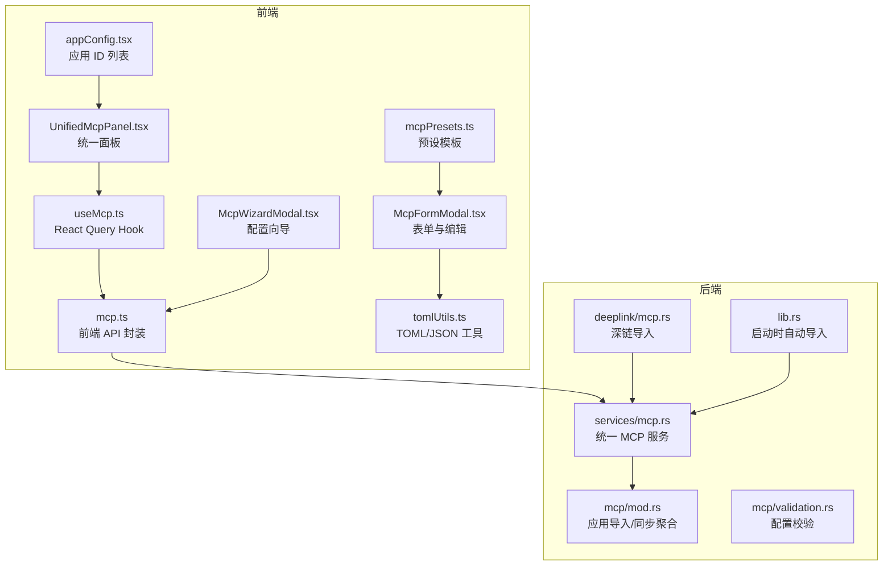
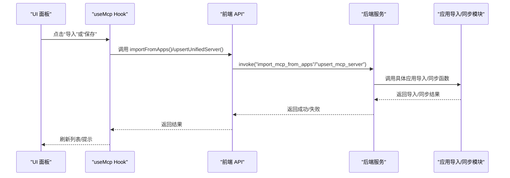
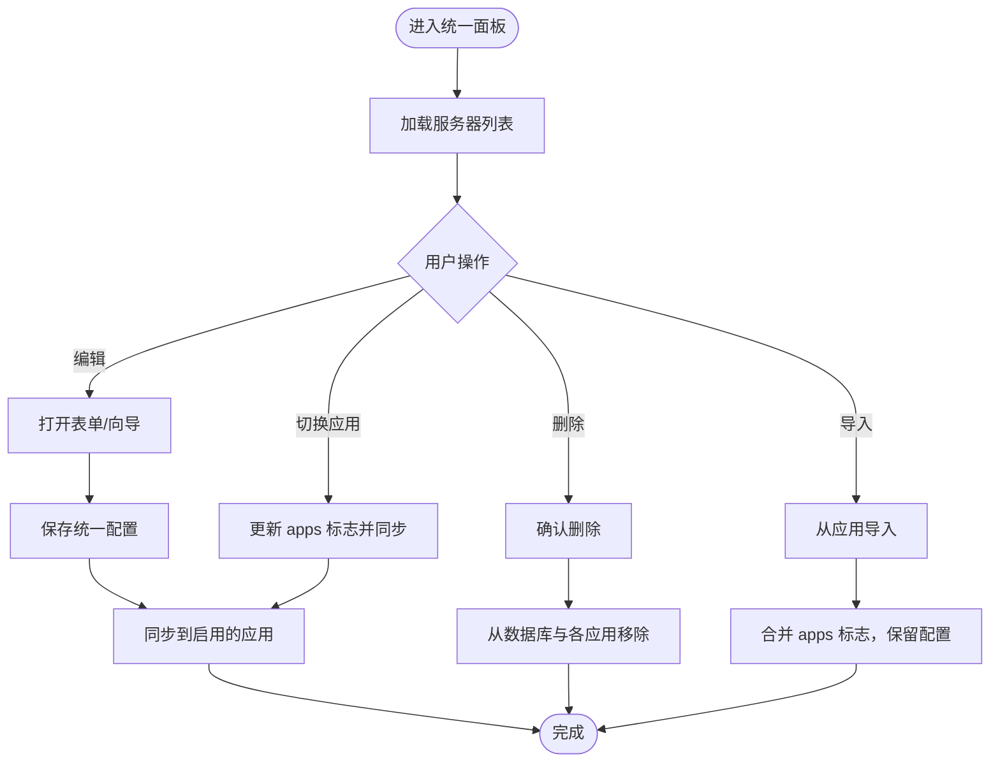
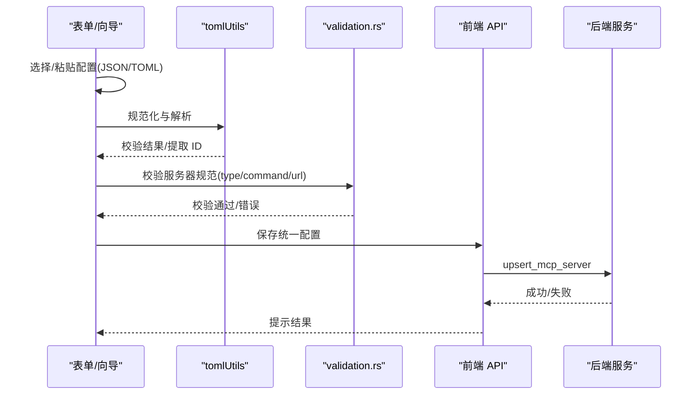
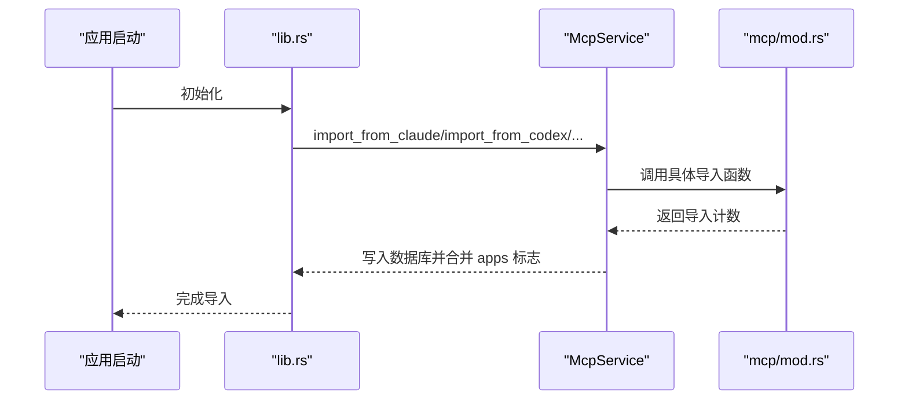
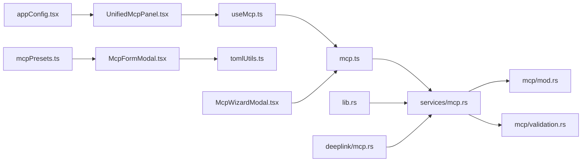

# 应用绑定与同步

<cite>
**本文引用的文件**   
- [UnifiedMcpPanel.tsx](file://src/components/mcp/UnifiedMcpPanel.tsx)
- [McpFormModal.tsx](file://src/components/mcp/McpFormModal.tsx)
- [McpWizardModal.tsx](file://src/components/mcp/McpWizardModal.tsx)
- [useMcp.ts](file://src/hooks/useMcp.ts)
- [mcp.ts](file://src/lib/api/mcp.ts)
- [mcpPresets.ts](file://src/config/mcpPresets.ts)
- [appConfig.tsx](file://src/config/appConfig.tsx)
- [tomlUtils.ts](file://src/utils/tomlUtils.ts)
- [mcp.rs（前端服务）](file://src-tauri/src/services/mcp.rs)
- [mcp.rs（模块聚合）](file://src-tauri/src/mcp/mod.rs)
- [validation.rs](file://src-tauri/src/mcp/validation.rs)
- [mcp.rs（深链导入）](file://src-tauri/src/deeplink/mcp.rs)
- [lib.rs（启动导入）](file://src-tauri/src/lib.rs)
- [3-extensions/3.1-mcp.md（中文手册）](file://docs/user-manual/zh/3-extensions/3.1-mcp.md)
- [3-extensions/3.1-mcp.md（英文手册）](file://docs/user-manual/en/3-extensions/3.1-mcp.md)
- [3-extensions/3.1-mcp.md（日文手册）](file://docs/user-manual/ja/3-extensions/3.1-mcp.md)
</cite>

## 目录
1. [简介](#简介)
2. [项目结构](#项目结构)
3. [核心组件](#核心组件)
4. [架构总览](#架构总览)
5. [详细组件分析](#详细组件分析)
6. [依赖关系分析](#依赖关系分析)
7. [性能考量](#性能考量)
8. [故障排查指南](#故障排查指南)
9. [结论](#结论)
10. [附录](#附录)

## 简介
本文件面向 CC Switch 的 MCP（Model Context Protocol）应用绑定与同步功能，系统性说明以下内容：
- MCP 服务器与不同 AI 应用（Claude、Codex、Gemini、OpenCode、OpenClaw、Hermes）的绑定机制与状态管理
- 启用/禁用绑定、绑定状态显示与状态同步流程
- 自动导入功能：从已安装应用中自动发现并导入 MCP 服务器配置
- 绑定配置的同步机制：配置更新、冲突处理与版本演进
- 应用绑定的优先级与选择策略
- 常见问题排查：连接失败、认证问题、配置冲突等

## 项目结构
围绕 MCP 的前端与后端协作主要分布在以下层次：
- 前端 UI 层：统一 MCP 面板、表单与向导，负责用户交互与输入校验
- 前端服务层：React Query Hook 与 API 封装，负责调用后端命令
- 后端服务层：Rust 服务实现统一 MCP 管理、导入与同步
- 配置与工具：预设模板、TOML/JSON 转换、类型定义与国际化文案

图表来源
- [UnifiedMcpPanel.tsx:1-319](file://src/components/mcp/UnifiedMcpPanel.tsx#L1-L319)
- [McpFormModal.tsx:1-730](file://src/components/mcp/McpFormModal.tsx#L1-L730)
- [McpWizardModal.tsx:1-433](file://src/components/mcp/McpWizardModal.tsx#L1-L433)
- [useMcp.ts:1-75](file://src/hooks/useMcp.ts#L1-L75)
- [mcp.ts:1-130](file://src/lib/api/mcp.ts#L1-L130)
- [mcpPresets.ts:1-105](file://src/config/mcpPresets.ts#L1-L105)
- [appConfig.tsx:1-112](file://src/config/appConfig.tsx#L1-L112)
- [tomlUtils.ts:1-222](file://src/utils/tomlUtils.ts#L1-L222)
- [mcp.rs（前端服务）:1-438](file://src-tauri/src/services/mcp.rs#L1-L438)
- [mcp.rs（模块聚合）:1-37](file://src-tauri/src/mcp/mod.rs#L1-L37)
- [validation.rs:1-70](file://src-tauri/src/mcp/validation.rs#L1-L70)
- [mcp.rs（深链导入）:1-199](file://src-tauri/src/deeplink/mcp.rs#L1-L199)
- [lib.rs（启动导入）:714-737](file://src-tauri/src/lib.rs#L714-L737)

章节来源
- [UnifiedMcpPanel.tsx:1-319](file://src/components/mcp/UnifiedMcpPanel.tsx#L1-L319)
- [mcp.ts:1-130](file://src/lib/api/mcp.ts#L1-L130)
- [mcp.rs（前端服务）:1-438](file://src-tauri/src/services/mcp.rs#L1-L438)

## 核心组件
- 统一 MCP 面板：展示所有服务器、统计各应用启用数量、支持新增、编辑、删除与批量导入
- MCP 表单与向导：支持 JSON/TOML 输入、智能校验、预设模板、向导生成配置
- 前端 API 与 Hook：封装统一查询、新增/更新、删除、切换应用绑定、从应用导入
- 后端服务：统一管理服务器、按应用同步/移除、导入外部配置、深链导入、启动时自动导入
- 配置工具：TOML/JSON 转换、ID 提取、预设模板、应用 ID 列表

章节来源
- [UnifiedMcpPanel.tsx:1-319](file://src/components/mcp/UnifiedMcpPanel.tsx#L1-L319)
- [McpFormModal.tsx:1-730](file://src/components/mcp/McpFormModal.tsx#L1-L730)
- [McpWizardModal.tsx:1-433](file://src/components/mcp/McpWizardModal.tsx#L1-L433)
- [useMcp.ts:1-75](file://src/hooks/useMcp.ts#L1-L75)
- [mcp.ts:1-130](file://src/lib/api/mcp.ts#L1-L130)
- [mcpPresets.ts:1-105](file://src/config/mcpPresets.ts#L1-L105)
- [appConfig.tsx:1-112](file://src/config/appConfig.tsx#L1-L112)
- [tomlUtils.ts:1-222](file://src/utils/tomlUtils.ts#L1-L222)
- [mcp.rs（前端服务）:1-438](file://src-tauri/src/services/mcp.rs#L1-L438)

## 架构总览
MCP 绑定与同步采用“统一结构 + 分应用同步”的设计：
- 统一结构：数据库存储统一的 McpServer（包含 id、name、server、apps 等），apps 是布尔映射，标记每个应用是否启用
- 分应用同步：当某应用启用时，将统一配置写入该应用的 live 配置；禁用时从 live 配置移除
- 导入机制：支持从 Claude、Codex、Gemini、OpenCode、Hermes 等应用导入，合并 apps 标志，保留原有配置

图表来源
- [useMcp.ts:63-74](file://src/hooks/useMcp.ts#L63-L74)
- [mcp.ts:124-128](file://src/lib/api/mcp.ts#L124-L128)
- [mcp.rs（前端服务）:248-436](file://src-tauri/src/services/mcp.rs#L248-L436)
- [mcp.rs（模块聚合）:22-36](file://src-tauri/src/mcp/mod.rs#L22-L36)

章节来源
- [mcp.rs（前端服务）:1-438](file://src-tauri/src/services/mcp.rs#L1-L438)
- [mcp.rs（模块聚合）:1-37](file://src-tauri/src/mcp/mod.rs#L1-L37)

## 详细组件分析

### 统一 MCP 面板与状态管理
- 展示所有服务器与各应用启用计数，支持编辑、删除与导入
- 切换应用绑定：调用后端接口更新数据库并同步到对应应用 live 配置
- 导入功能：从已安装应用批量导入，合并 apps 标志，保留原有配置

图表来源
- [UnifiedMcpPanel.tsx:48-118](file://src/components/mcp/UnifiedMcpPanel.tsx#L48-L118)
- [useMcp.ts:29-74](file://src/hooks/useMcp.ts#L29-L74)
- [mcp.rs（前端服务）:68-90](file://src-tauri/src/services/mcp.rs#L68-L90)

章节来源
- [UnifiedMcpPanel.tsx:1-319](file://src/components/mcp/UnifiedMcpPanel.tsx#L1-L319)
- [useMcp.ts:1-75](file://src/hooks/useMcp.ts#L1-L75)

### MCP 表单与向导：配置输入与校验
- 支持 JSON/TOML 两种输入格式，自动规范化与校验
- 预设模板：内置常用 stdio 服务器模板，一键应用
- 向导：可视化生成 stdio/http/sse 配置，实时预览 JSON
- 应用绑定：选择启用到哪些应用（Claude、Codex、Gemini、OpenCode、Hermes）

图表来源
- [McpFormModal.tsx:105-410](file://src/components/mcp/McpFormModal.tsx#L105-L410)
- [McpWizardModal.tsx:96-172](file://src/components/mcp/McpWizardModal.tsx#L96-L172)
- [tomlUtils.ts:10-95](file://src/utils/tomlUtils.ts#L10-L95)
- [validation.rs:7-51](file://src-tauri/src/mcp/validation.rs#L7-L51)
- [mcp.ts:100-110](file://src/lib/api/mcp.ts#L100-L110)
- [mcp.rs（前端服务）:18-51](file://src-tauri/src/services/mcp.rs#L18-L51)

章节来源
- [McpFormModal.tsx:1-730](file://src/components/mcp/McpFormModal.tsx#L1-L730)
- [McpWizardModal.tsx:1-433](file://src/components/mcp/McpWizardModal.tsx#L1-L433)
- [tomlUtils.ts:1-222](file://src/utils/tomlUtils.ts#L1-L222)
- [validation.rs:1-70](file://src-tauri/src/mcp/validation.rs#L1-L70)

### 自动导入与深链导入
- 启动时自动导入：应用启动后尝试从 Claude、Codex、Gemini、OpenCode、Hermes 导入
- 手动导入：统一面板提供“从应用导入”，逐个应用选择导入
- 深链导入：通过 ccswitch:// 链接批量导入，支持 Base64 编码的 MCP JSON，自动解析 apps 参数

图表来源
- [lib.rs（启动导入）:714-737](file://src-tauri/src/lib.rs#L714-L737)
- [mcp.rs（前端服务）:248-436](file://src-tauri/src/services/mcp.rs#L248-L436)
- [mcp.rs（模块聚合）:22-36](file://src-tauri/src/mcp/mod.rs#L22-L36)

章节来源
- [lib.rs（启动导入）:714-737](file://src-tauri/src/lib.rs#L714-L737)
- [mcp.rs（前端服务）:248-436](file://src-tauri/src/services/mcp.rs#L248-L436)
- [mcp.rs（深链导入）:36-161](file://src-tauri/src/deeplink/mcp.rs#L36-L161)

### 配置同步与冲突处理
- 同步条件：仅在对应应用已安装时同步（检测用户目录是否存在）
- 冲突处理：当同一 ID 在不同应用配置不一致时，保留首次遇到的配置，其余应用仅启用标志
- 版本演进：从旧结构迁移到统一结构时，自动合并并记录冲突

章节来源
- [3-extensions/3.1-mcp.md（中文手册）:119-183](file://docs/user-manual/zh/3-extensions/3.1-mcp.md#L119-L183)
- [3-extensions/3.1-mcp.md（英文手册）:108-145](file://docs/user-manual/en/3-extensions/3.1-mcp.md#L108-L145)
- [3-extensions/3.1-mcp.md（日文手册）:125-160](file://docs/user-manual/ja/3-extensions/3.1-mcp.md#L125-L160)
- [mcp.rs（前端服务）:848-954](file://src-tauri/src/services/mcp.rs#L848-L954)

### 应用绑定优先级与选择策略
- 绑定范围：统一面板列出的应用 ID（不含 OpenClaw），用户可选择启用到任意组合
- 同步策略：启用即写入 live 配置，禁用即移除
- OpenClaw 与 Claude Desktop：当前不支持 MCP 同步（开发中/限制）

章节来源
- [appConfig.tsx:37-38](file://src/config/appConfig.tsx#L37-L38)
- [mcp.rs（前端服务）:110-142](file://src-tauri/src/services/mcp.rs#L110-L142)

## 依赖关系分析
- 前端依赖关系：UnifiedMcpPanel 依赖 useMcp Hook 与 mcp API；表单依赖 tomlUtils 与预设；向导独立生成 JSON
- 后端依赖关系：McpService 调用 mcp/mod.rs 的具体导入/同步函数；validation.rs 提供配置校验
- 导入链路：lib.rs 启动导入 → McpService → mcp/mod.rs → 各应用导入实现

图表来源
- [UnifiedMcpPanel.tsx:1-319](file://src/components/mcp/UnifiedMcpPanel.tsx#L1-L319)
- [useMcp.ts:1-75](file://src/hooks/useMcp.ts#L1-L75)
- [mcp.ts:1-130](file://src/lib/api/mcp.ts#L1-L130)
- [mcp.rs（前端服务）:1-438](file://src-tauri/src/services/mcp.rs#L1-L438)
- [mcp.rs（模块聚合）:1-37](file://src-tauri/src/mcp/mod.rs#L1-L37)
- [validation.rs:1-70](file://src-tauri/src/mcp/validation.rs#L1-L70)
- [McpFormModal.tsx:1-730](file://src/components/mcp/McpFormModal.tsx#L1-L730)
- [McpWizardModal.tsx:1-433](file://src/components/mcp/McpWizardModal.tsx#L1-L433)
- [tomlUtils.ts:1-222](file://src/utils/tomlUtils.ts#L1-L222)
- [mcpPresets.ts:1-105](file://src/config/mcpPresets.ts#L1-L105)
- [appConfig.tsx:1-112](file://src/config/appConfig.tsx#L1-L112)
- [lib.rs（启动导入）:714-737](file://src-tauri/src/lib.rs#L714-L737)
- [mcp.rs（深链导入）:1-199](file://src-tauri/src/deeplink/mcp.rs#L1-L199)

章节来源
- [mcp.rs（前端服务）:1-438](file://src-tauri/src/services/mcp.rs#L1-L438)
- [mcp.rs（模块聚合）:1-37](file://src-tauri/src/mcp/mod.rs#L1-L37)

## 性能考量
- 前端：React Query 缓存与失效策略，避免重复请求；表单与向导仅在交互时计算预览
- 后端：批量导入与同步时按应用循环，避免不必要的 IO；导入后一次性写入数据库
- 配置校验：前端先做格式校验，减少无效请求；后端严格校验 type/command/url

## 故障排查指南
- 连接失败
  - 检查应用是否已安装（对应用户目录是否存在）
  - 确认命令可用（stdio 类型的 command 是否可执行）
  - 检查 URL 与网络（http/sse 类型）
- 认证问题
  - 确认应用自身的认证配置正确
  - 若使用代理或自定义端点，请检查代理设置与端点可达性
- 配置冲突
  - 同一 ID 在不同应用配置不一致时，系统保留首次遇到的配置
  - 建议统一管理并在统一面板中编辑，避免分散配置
- 导入失败
  - 检查深链参数是否正确（apps 与 config）
  - 确认 JSON/TOML 格式有效
- 同步未生效
  - 确认应用已启用绑定
  - 重启对应应用以加载最新配置

章节来源
- [3-extensions/3.1-mcp.md（中文手册）:119-183](file://docs/user-manual/zh/3-extensions/3.1-mcp.md#L119-L183)
- [3-extensions/3.1-mcp.md（英文手册）:108-145](file://docs/user-manual/en/3-extensions/3.1-mcp.md#L108-L145)
- [3-extensions/3.1-mcp.md（日文手册）:125-160](file://docs/user-manual/ja/3-extensions/3.1-mcp.md#L125-L160)
- [mcp.rs（前端服务）:848-954](file://src-tauri/src/services/mcp.rs#L848-L954)

## 结论
CC Switch 的 MCP 绑定与同步通过“统一结构 + 分应用同步”的设计，实现了对多应用 MCP 服务器的集中管理与高效同步。配合自动导入、深链导入与完善的校验机制，用户可以在不同应用间无缝切换与共享 MCP 服务器配置。建议优先使用统一面板进行管理，避免分散配置导致的冲突与维护成本。

## 附录
- 预设模板：内置常用 stdio 服务器（如 fetch、time、memory、sequential-thinking、context7），便于快速体验
- 应用 ID 列表：统一面板展示的应用 ID（不含 OpenClaw），用户可灵活选择启用范围
- 启动导入：应用启动后自动尝试从多个应用导入，减少手动配置成本

章节来源
- [mcpPresets.ts:31-90](file://src/config/mcpPresets.ts#L31-L90)
- [appConfig.tsx:37-38](file://src/config/appConfig.tsx#L37-L38)
- [lib.rs（启动导入）:714-737](file://src-tauri/src/lib.rs#L714-L737)