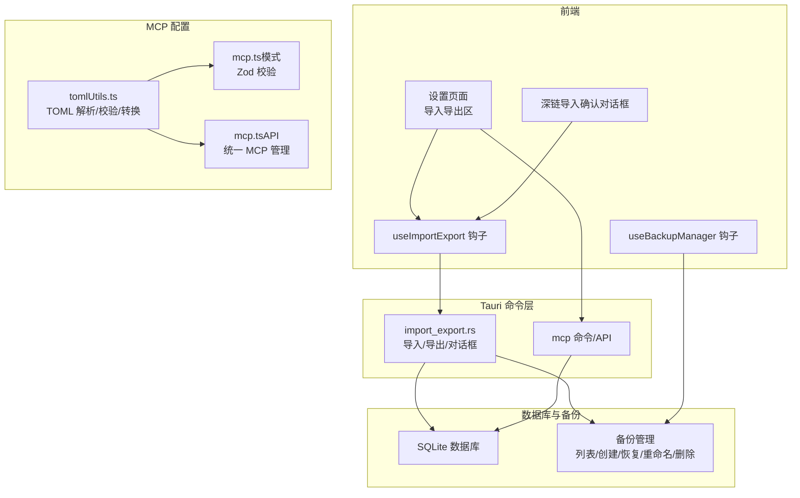
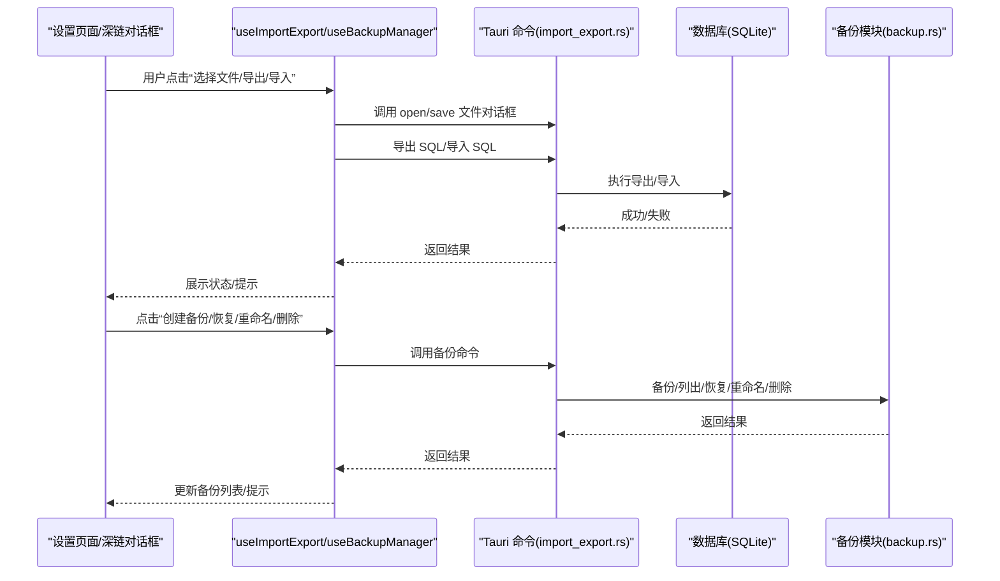
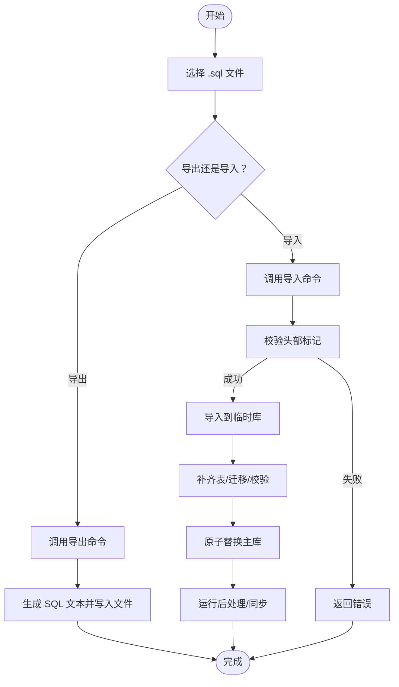
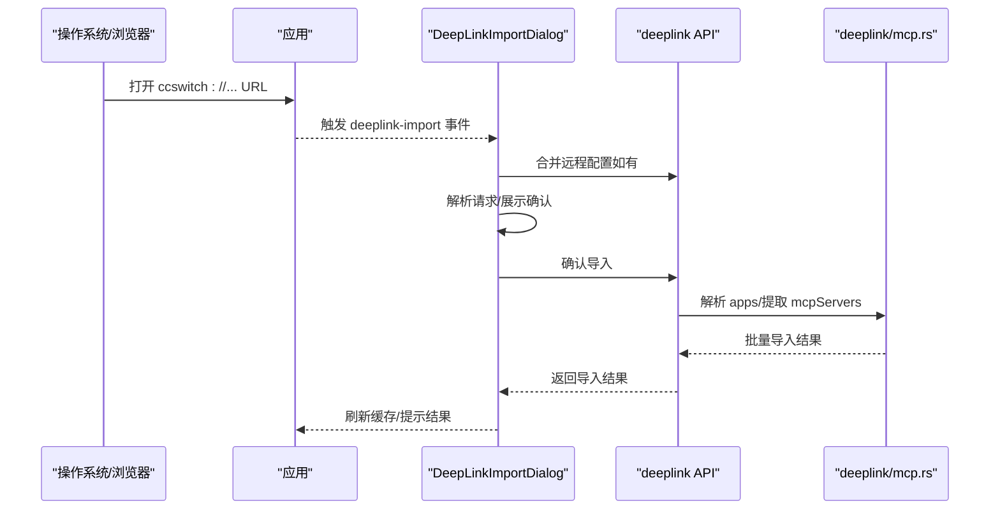
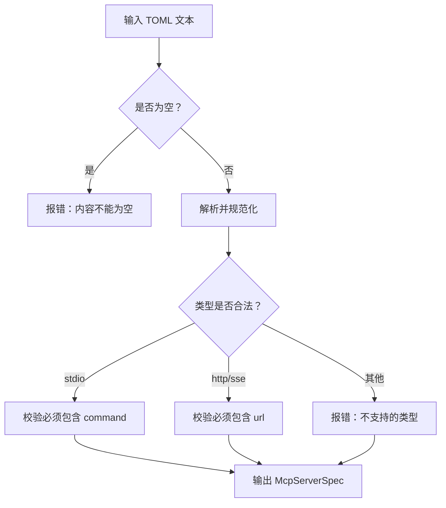
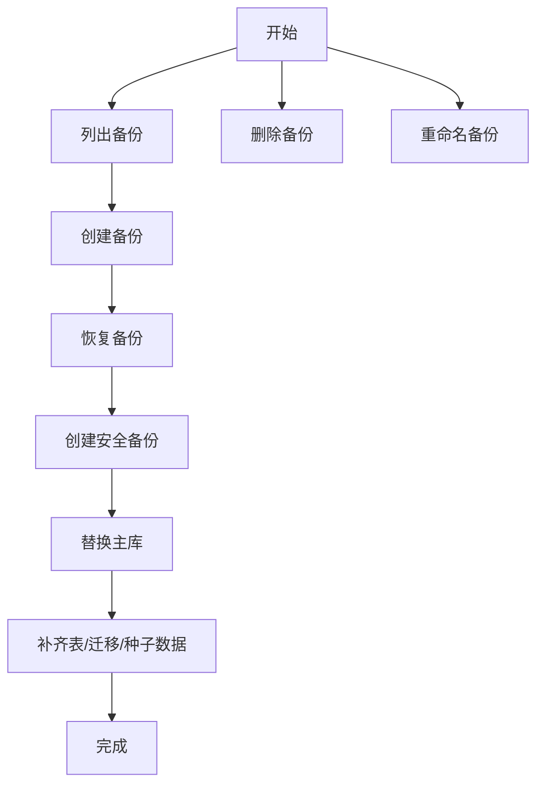
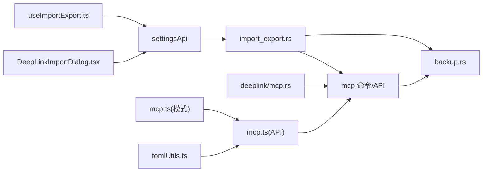

# 配置导入导出

<cite>
**本文引用的文件**
- [useImportExport.ts](file://src/hooks/useImportExport.ts)
- [ImportExportSection.tsx](file://src/components/settings/ImportExportSection.tsx)
- [import_export.rs](file://src-tauri/src/commands/import_export.rs)
- [tomlUtils.ts](file://src/utils/tomlUtils.ts)
- [mod.rs](file://src-tauri/src/deeplink/mod.rs)
- [mcp.rs](file://src-tauri/src/deeplink/mcp.rs)
- [DeepLinkImportDialog.tsx](file://src/components/DeepLinkImportDialog.tsx)
- [mcp.ts](file://src/lib/api/mcp.ts)
- [mcp.ts（模式）](file://src/lib/schemas/mcp.ts)
- [backup.rs](file://src-tauri/src/database/backup.rs)
- [useBackupManager.ts](file://src/hooks/useBackupManager.ts)
- [mcp/mod.rs](file://src-tauri/src/mcp/mod.rs)
- [codex.rs](file://src-tauri/src/mcp/codex.rs)
</cite>

## 目录
1. [简介](#简介)
2. [项目结构](#项目结构)
3. [核心组件](#核心组件)
4. [架构总览](#架构总览)
5. [详细组件分析](#详细组件分析)
6. [依赖关系分析](#依赖关系分析)
7. [性能考量](#性能考量)
8. [故障排查指南](#故障排查指南)
9. [结论](#结论)
10. [附录](#附录)

## 简介
本章节面向 MCP 配置的导入与导出，系统性说明以下能力：
- 配置文件格式规范：SQL 备份（导入导出）、JSON/TOML（MCP 服务器配置）
- 配置验证机制：格式校验、必填字段检查、值范围与类型约束
- 深链（Deep Link）导入：URL 结构、参数解析、自动配置导入流程
- 配置导出：完整数据库导出、部分导出（用于同步）
- 备份与恢复：本地数据库备份、备份列表管理、从备份恢复
- 迁移与兼容：版本升级时的数据库迁移、Codex TOML 与统一结构的互转
- 实际示例与常见问题：提供可参考的配置片段路径与排障建议

## 项目结构
围绕“配置导入导出”的关键目录与文件如下：
- 前端导入导出与深链确认 UI：src/hooks/useImportExport.ts、src/components/settings/ImportExportSection.tsx、src/components/DeepLinkImportDialog.tsx
- Tauri 命令与数据库备份：src-tauri/src/commands/import_export.rs、src-tauri/src/database/backup.rs
- MCP 配置格式与校验：src/utils/tomlUtils.ts、src/lib/schemas/mcp.ts、src/lib/api/mcp.ts
- 深链协议与解析：src-tauri/src/deeplink/mod.rs、src-tauri/src/deeplink/mcp.rs
- MCP 同步与迁移：src-tauri/src/mcp/mod.rs、src-tauri/src/mcp/codex.rs
- 备份管理 Hook：src/hooks/useBackupManager.ts

图表来源
- [useImportExport.ts:31-203](file://src/hooks/useImportExport.ts#L31-L203)
- [ImportExportSection.tsx:26-124](file://src/components/settings/ImportExportSection.tsx#L26-L124)
- [DeepLinkImportDialog.tsx:26-92](file://src/components/DeepLinkImportDialog.tsx#L26-L92)
- [import_export.rs:21-108](file://src-tauri/src/commands/import_export.rs#L21-L108)
- [backup.rs:45-147](file://src-tauri/src/database/backup.rs#L45-L147)
- [tomlUtils.ts:10-95](file://src/utils/tomlUtils.ts#L10-L95)
- [mcp.ts（模式）:3-42](file://src/lib/schemas/mcp.ts#L3-L42)
- [mcp.ts:11-129](file://src/lib/api/mcp.ts#L11-L129)

章节来源
- [useImportExport.ts:31-203](file://src/hooks/useImportExport.ts#L31-L203)
- [ImportExportSection.tsx:26-124](file://src/components/settings/ImportExportSection.tsx#L26-L124)
- [import_export.rs:21-108](file://src-tauri/src/commands/import_export.rs#L21-L108)
- [backup.rs:45-147](file://src-tauri/src/database/backup.rs#L45-L147)
- [tomlUtils.ts:10-95](file://src/utils/tomlUtils.ts#L10-L95)
- [mcp.ts（模式）:3-42](file://src/lib/schemas/mcp.ts#L3-L42)
- [mcp.ts:11-129](file://src/lib/api/mcp.ts#L11-L129)

## 核心组件
- 导入导出钩子与界面
  - useImportExport：封装文件选择、导入/导出、状态管理与错误提示；调用 Tauri 命令完成 SQL 备份的导入与导出，并在导入后触发“当前供应商”同步。
  - ImportExportSection：渲染导入/导出按钮、状态消息与文件名展示。
- 深链导入对话框
  - DeepLinkImportDialog：监听深链事件，合并远程配置，解析并展示待导入资源详情，支持 Provider/Prompt/MCP/Skill 的确认导入。
- 数据库备份与恢复
  - import_export.rs：提供保存/打开文件对话框、SQL 导入/导出、数据库备份列表、创建、恢复、重命名、删除等命令。
  - backup.rs：实现 SQL 导出/导入、内存快照、原子替换、基础状态校验、周期性维护、备份清理与安全备份策略。
- MCP 配置格式与校验
  - tomlUtils.ts：TOML 格式校验、MCP 服务器配置与 TOML 的相互转换、ID 推断。
  - mcp.ts（模式）：Zod 校验规则（类型、URL、必填字段等）。
  - mcp.ts（API）：统一 MCP 管理接口（新增/更新/删除/切换应用启用）。
- 深链协议与 MCP 导入
  - deeplink/mod.rs：定义 DeepLinkImportRequest 结构，涵盖 provider/prompt/mcp/skill 等资源的参数。
  - deeplink/mcp.rs：解析 apps 参数、从 Base64 JSON 中提取 mcpServers、去重合并、批量导入。

章节来源
- [useImportExport.ts:31-203](file://src/hooks/useImportExport.ts#L31-L203)
- [ImportExportSection.tsx:26-124](file://src/components/settings/ImportExportSection.tsx#L26-L124)
- [DeepLinkImportDialog.tsx:26-92](file://src/components/DeepLinkImportDialog.tsx#L26-L92)
- [import_export.rs:21-108](file://src-tauri/src/commands/import_export.rs#L21-L108)
- [backup.rs:45-147](file://src-tauri/src/database/backup.rs#L45-L147)
- [tomlUtils.ts:10-95](file://src/utils/tomlUtils.ts#L10-L95)
- [mcp.ts（模式）:3-42](file://src/lib/schemas/mcp.ts#L3-L42)
- [mcp.ts:11-129](file://src/lib/api/mcp.ts#L11-L129)
- [mod.rs:34-138](file://src-tauri/src/deeplink/mod.rs#L34-L138)
- [mcp.rs:40-161](file://src-tauri/src/deeplink/mcp.rs#L40-L161)

## 架构总览
下图展示“导入导出”与“深链导入”的端到端流程，以及与数据库备份的交互。

图表来源
- [useImportExport.ts:50-183](file://src/hooks/useImportExport.ts#L50-L183)
- [import_export.rs:21-108](file://src-tauri/src/commands/import_export.rs#L21-L108)
- [backup.rs:298-334](file://src-tauri/src/database/backup.rs#L298-L334)

## 详细组件分析

### 组件一：导入导出（SQL 备份）
- 功能要点
  - 文件对话框：限制文件类型为 .sql，支持保存与打开。
  - 导出：生成包含头部标记的 SQL 文本，写入目标路径。
  - 导入：校验头部标记、导入到临时库、补齐表结构与迁移、基础校验、原子替换主库；可按需保留本地特定表数据。
  - 状态管理：导入中/成功/部分成功/失败，错误消息，备份 ID。
  - 同步：导入成功后触发“当前供应商”同步，若同步失败则提示用户手动切换。
- 关键实现位置
  - 前端：useImportExport.ts、ImportExportSection.tsx
  - 后端：import_export.rs、backup.rs

图表来源
- [import_export.rs:21-60](file://src-tauri/src/commands/import_export.rs#L21-L60)
- [backup.rs:84-147](file://src-tauri/src/database/backup.rs#L84-L147)
- [useImportExport.ts:68-141](file://src/hooks/useImportExport.ts#L68-L141)

章节来源
- [useImportExport.ts:68-141](file://src/hooks/useImportExport.ts#L68-L141)
- [ImportExportSection.tsx:116-212](file://src/components/settings/ImportExportSection.tsx#L116-L212)
- [import_export.rs:21-76](file://src-tauri/src/commands/import_export.rs#L21-L76)
- [backup.rs:84-147](file://src-tauri/src/database/backup.rs#L84-L147)

### 组件二：深链导入（Deep Link）
- 协议与参数
  - 协议：ccswitch://
  - 资源类型：provider、prompt、mcp、skill
  - 通用参数：version、resource、app/name/enabled
  - MCP 特有：apps（逗号分隔）、config（Base64 JSON）、config_format、config_url
  - Provider/Prompt/Skill 亦有各自专属参数
- 流程
  - 前端 DeepLinkImportDialog 监听事件，合并远程配置（如有），解析请求并展示确认对话框。
  - 用户确认后，调用 deeplink API 执行导入，根据资源类型刷新对应缓存并提示结果。
  - MCP 导入：解析 apps 参数，从 Base64 JSON 中提取 mcpServers，去重合并（仅合并应用开关），批量入库。
- 安全与兼容
  - apps 参数容错：忽略不支持的应用（如 OpenClaw 不支持 MCP）。
  - 兼容性：支持旧版返回结构（无 type 字段）。

图表来源
- [DeepLinkImportDialog.tsx:51-92](file://src/components/DeepLinkImportDialog.tsx#L51-L92)
- [mod.rs:34-138](file://src-tauri/src/deeplink/mod.rs#L34-L138)
- [mcp.rs:40-161](file://src-tauri/src/deeplink/mcp.rs#L40-L161)

章节来源
- [DeepLinkImportDialog.tsx:51-92](file://src/components/DeepLinkImportDialog.tsx#L51-L92)
- [mod.rs:34-138](file://src-tauri/src/deeplink/mod.rs#L34-L138)
- [mcp.rs:40-161](file://src-tauri/src/deeplink/mcp.rs#L40-L161)

### 组件三：MCP 配置格式与校验
- TOML 格式
  - 支持直接服务器配置或 [mcp_servers.<id>] 结构；兼容 [mcp.servers.<id>] 错误格式。
  - 校验：非空、对象、字段类型；stdio 必须包含 command；http/sse 必须包含 url。
  - 转换：保留未知字段（如 timeout_ms 等扩展字段），标准化为 McpServerSpec。
  - ID 推断：优先从 [mcp_servers.<id>] 提取，其次从 command 推断。
- JSON 格式
  - Zod 校验：type、command/url、args/env/cwd/headers 等字段约束。
  - 统一 MCP 管理 API：新增/更新/删除/切换应用启用。
- Codex TOML 与统一结构互转
  - 从 Codex 配置导入时，支持官方标准与错误格式；将 TOML 转为统一 JSON 规范，已存在服务器仅合并应用开关。

图表来源
- [tomlUtils.ts:53-95](file://src/utils/tomlUtils.ts#L53-L95)
- [mcp.ts（模式）:3-29](file://src/lib/schemas/mcp.ts#L3-L29)
- [codex.rs:52-74](file://src-tauri/src/mcp/codex.rs#L52-L74)

章节来源
- [tomlUtils.ts:10-95](file://src/utils/tomlUtils.ts#L10-L95)
- [mcp.ts（模式）:3-42](file://src/lib/schemas/mcp.ts#L3-L42)
- [mcp.ts:94-121](file://src/lib/api/mcp.ts#L94-L121)
- [codex.rs:52-74](file://src-tauri/src/mcp/codex.rs#L52-L74)

### 组件四：备份与恢复
- 备份
  - 手动创建：生成带时间戳的 .db 文件，清理超出保留数量的历史备份。
  - 自动备份：按设定间隔检查并创建新备份。
- 列表与管理
  - 列表：按创建时间倒序返回备份文件信息。
  - 重命名：校验新名称长度与字符合法性。
  - 删除：防止路径穿越与非法扩展名。
- 恢复
  - 安全备份：恢复前先创建安全备份，再替换主库。
  - 迁移与补种：恢复后执行表结构补齐、迁移、计费定价种子数据。
- 同步导入的特殊处理
  - 导出用于同步时跳过本地表数据；导入时从本地快照恢复这些表，保证本地日志等数据不被远程覆盖。

图表来源
- [backup.rs:516-599](file://src-tauri/src/database/backup.rs#L516-L599)
- [backup.rs:298-334](file://src-tauri/src/database/backup.rs#L298-L334)
- [backup.rs:602-662](file://src-tauri/src/database/backup.rs#L602-L662)
- [backup.rs:665-687](file://src-tauri/src/database/backup.rs#L665-L687)

章节来源
- [useBackupManager.ts:4-59](file://src/hooks/useBackupManager.ts#L4-L59)
- [backup.rs:516-599](file://src-tauri/src/database/backup.rs#L516-L599)
- [backup.rs:298-334](file://src-tauri/src/database/backup.rs#L298-L334)

## 依赖关系分析
- 前端
  - useImportExport 依赖 settingsApi（文件对话框与导入导出命令）、postChangeSync（导入后的“当前供应商”同步）。
  - DeepLinkImportDialog 依赖 deeplinkApi（深链导入与配置合并）、React Query（缓存刷新）。
- 后端
  - import_export.rs 依赖 AppState/Database，调用 backup.rs 的导出/导入逻辑。
  - deeplink/mcp.rs 依赖 McpService、AppState、数据库查询与合并策略。
- MCP 子系统
  - mcp/mod.rs 统一导出各应用的导入/同步函数，codex.rs 实现 Codex TOML 与统一结构的转换。

图表来源
- [useImportExport.ts:1-6](file://src/hooks/useImportExport.ts#L1-L6)
- [DeepLinkImportDialog.tsx:1-20](file://src/components/DeepLinkImportDialog.tsx#L1-L20)
- [import_export.rs:1-16](file://src-tauri/src/commands/import_export.rs#L1-L16)
- [mcp.ts:1-10](file://src/lib/api/mcp.ts#L1-L10)
- [mcp.ts（模式）:1-4](file://src/lib/schemas/mcp.ts#L1-L4)
- [tomlUtils.ts:1-4](file://src/utils/tomlUtils.ts#L1-L4)
- [mcp.rs:1-12](file://src-tauri/src/deeplink/mcp.rs#L1-L12)

章节来源
- [useImportExport.ts:1-6](file://src/hooks/useImportExport.ts#L1-L6)
- [DeepLinkImportDialog.tsx:1-20](file://src/components/DeepLinkImportDialog.tsx#L1-L20)
- [import_export.rs:1-16](file://src-tauri/src/commands/import_export.rs#L1-L16)
- [mcp.ts:1-10](file://src/lib/api/mcp.ts#L1-L10)
- [mcp.ts（模式）:1-4](file://src/lib/schemas/mcp.ts#L1-L4)
- [tomlUtils.ts:1-4](file://src/utils/tomlUtils.ts#L1-L4)
- [mcp.rs:1-12](file://src-tauri/src/deeplink/mcp.rs#L1-L12)

## 性能考量
- 导入导出
  - 导出采用内存快照（避免长时间锁表），导入使用临时库执行，失败不污染主库，最后原子替换，减少锁竞争与数据不一致风险。
  - 同步导入时可跳过本地表数据，恢复本地快照，降低网络传输与写入压力。
- 深链导入
  - 批量导入时逐条合并，避免重复写入；仅在必要时创建新记录，其余保持原状。
- 备份
  - 自动备份按间隔检查，避免频繁 IO；清理策略控制保留数量，防止磁盘占用增长过快。

[本节为通用指导，无需具体文件分析]

## 故障排查指南
- SQL 导入失败
  - 现象：提示“SQL 文件已损坏或格式不正确”或“仅支持导入由 CC Switch 导出的 SQL 备份文件”。
  - 排查：确认文件为 CC Switch 导出；检查文件头标记；确认文件未被篡改。
  - 参考实现
    - [import_export.rs:42-60](file://src-tauri/src/commands/import_export.rs#L42-L60)
    - [backup.rs:166-177](file://src-tauri/src/database/backup.rs#L166-L177)
- 导入后同步失败
  - 现象：导入成功但“当前供应商”同步失败，提示“请手动重新选择一次供应商”。
  - 处理：在设置中重新选择目标供应商，再次触发同步。
  - 参考实现
    - [useImportExport.ts:104-125](file://src/hooks/useImportExport.ts#L104-L125)
- 深链导入无响应
  - 现象：URL 打开后无弹窗或导入未生效。
  - 排查：确认协议注册正常；检查 deeplink-error 事件是否有错误；确认 apps 参数合法且至少包含一个应用。
  - 参考实现
    - [DeepLinkImportDialog.tsx:80-91](file://src/components/DeepLinkImportDialog.tsx#L80-L91)
    - [mcp.rs:164-199](file://src-tauri/src/deeplink/mcp.rs#L164-L199)
- TOML 配置解析失败
  - 现象：提示“无法识别的 TOML 格式”或“必须包含 command/url”。
  - 处理：确保使用 [mcp_servers.<id>] 结构或提供 type/command/url；stdio 必须包含 command；http/sse 必须包含 url。
  - 参考实现
    - [tomlUtils.ts:53-95](file://src/utils/tomlUtils.ts#L53-L95)
    - [mcp.ts（模式）:3-29](file://src/lib/schemas/mcp.ts#L3-L29)
- 备份/恢复异常
  - 现象：重命名/删除失败或恢复后数据不完整。
  - 处理：检查文件名合法性（不含路径分隔符、以 .db 结尾）；恢复前确保有安全备份；确认迁移与种子数据执行成功。
  - 参考实现
    - [backup.rs:602-662](file://src-tauri/src/database/backup.rs#L602-L662)
    - [backup.rs:551-599](file://src-tauri/src/database/backup.rs#L551-L599)

章节来源
- [import_export.rs:42-60](file://src-tauri/src/commands/import_export.rs#L42-L60)
- [backup.rs:166-177](file://src-tauri/src/database/backup.rs#L166-L177)
- [useImportExport.ts:104-125](file://src/hooks/useImportExport.ts#L104-L125)
- [DeepLinkImportDialog.tsx:80-91](file://src/components/DeepLinkImportDialog.tsx#L80-L91)
- [mcp.rs:164-199](file://src-tauri/src/deeplink/mcp.rs#L164-L199)
- [tomlUtils.ts:53-95](file://src/utils/tomlUtils.ts#L53-L95)
- [mcp.ts（模式）:3-29](file://src/lib/schemas/mcp.ts#L3-L29)
- [backup.rs:602-662](file://src-tauri/src/database/backup.rs#L602-L662)
- [backup.rs:551-599](file://src-tauri/src/database/backup.rs#L551-L599)

## 结论
本方案提供了完整的 MCP 配置导入导出能力：
- 以 SQL 备份为基础的全量导入导出，配合深链一键导入，满足快速迁移与自动化部署场景。
- 严格的格式与字段校验，保障配置质量与运行稳定性。
- 健壮的备份与恢复机制，确保数据安全与可追溯。
- 与数据库迁移、Codex TOML 转换、统一 MCP 结构无缝衔接，便于版本升级与多应用协同。

[本节为总结，无需具体文件分析]

## 附录

### 配置格式规范与示例（片段路径）
- SQL 备份
  - 导出：[export_config_to_file:21-38](file://src-tauri/src/commands/import_export.rs#L21-L38)
  - 导入：[import_config_from_file:42-60](file://src-tauri/src/commands/import_export.rs#L42-L60)
- TOML（MCP 服务器）
  - 校验与转换：[validateToml / mcpServerToToml / tomlToMcpServer:10-95](file://src/utils/tomlUtils.ts#L10-L95)
  - ID 推断：[extractIdFromToml:189-221](file://src/utils/tomlUtils.ts#L189-L221)
- JSON（MCP 服务器）
  - Zod 校验：[mcpServerSchema:31-42](file://src/lib/schemas/mcp.ts#L31-L42)
- 深链参数
  - 请求结构：[DeepLinkImportRequest:34-138](file://src-tauri/src/deeplink/mod.rs#L34-L138)
  - MCP 导入：[import_mcp_from_deeplink:40-161](file://src-tauri/src/deeplink/mcp.rs#L40-L161)

章节来源
- [import_export.rs:21-60](file://src-tauri/src/commands/import_export.rs#L21-L60)
- [tomlUtils.ts:10-95](file://src/utils/tomlUtils.ts#L10-L95)
- [mcp.ts（模式）:31-42](file://src/lib/schemas/mcp.ts#L31-L42)
- [mod.rs:34-138](file://src-tauri/src/deeplink/mod.rs#L34-L138)
- [mcp.rs:40-161](file://src-tauri/src/deeplink/mcp.rs#L40-L161)