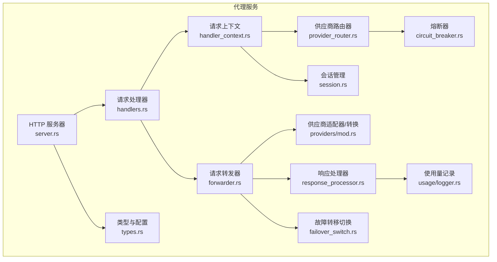
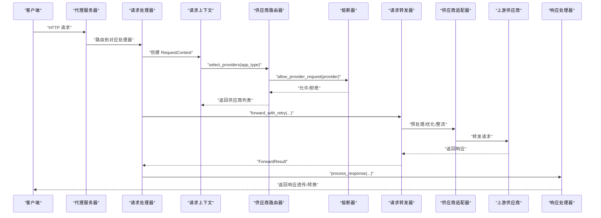
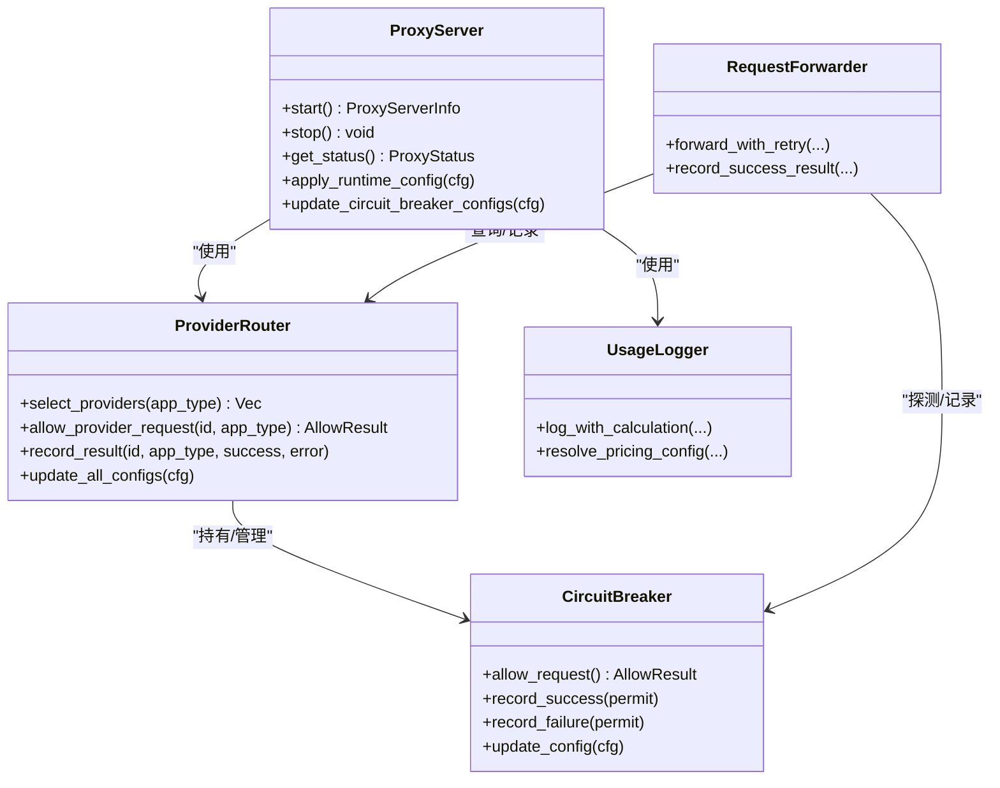

# 代理服务

<cite>
**本文引用的文件**
- [src-tauri/src/proxy/mod.rs](file://src-tauri/src/proxy/mod.rs)
- [src-tauri/src/proxy/server.rs](file://src-tauri/src/proxy/server.rs)
- [src-tauri/src/proxy/handlers.rs](file://src-tauri/src/proxy/handlers.rs)
- [src-tauri/src/proxy/forwarder.rs](file://src-tauri/src/proxy/forwarder.rs)
- [src-tauri/src/proxy/circuit_breaker.rs](file://src-tauri/src/proxy/circuit_breaker.rs)
- [src-tauri/src/proxy/failover_switch.rs](file://src-tauri/src/proxy/failover_switch.rs)
- [src-tauri/src/proxy/provider_router.rs](file://src-tauri/src/proxy/provider_router.rs)
- [src-tauri/src/proxy/types.rs](file://src-tauri/src/proxy/types.rs)
- [src-tauri/src/proxy/handler_context.rs](file://src-tauri/src/proxy/handler_context.rs)
- [src-tauri/src/proxy/response_processor.rs](file://src-tauri/src/proxy/response_processor.rs)
- [src-tauri/src/proxy/providers/mod.rs](file://src-tauri/src/proxy/providers/mod.rs)
- [src-tauri/src/proxy/session.rs](file://src-tauri/src/proxy/session.rs)
- [src-tauri/src/proxy/usage/logger.rs](file://src-tauri/src/proxy/usage/logger.rs)
</cite>

## 目录
1. [简介](#简介)
2. [项目结构](#项目结构)
3. [核心组件](#核心组件)
4. [架构总览](#架构总览)
5. [详细组件分析](#详细组件分析)
6. [依赖关系分析](#依赖关系分析)
7. [性能考量](#性能考量)
8. [故障排查指南](#故障排查指南)
9. [结论](#结论)
10. [附录](#附录)

## 简介
本文件面向 CC Switch 的本地代理服务，系统性阐述其工作原理、HTTP 请求拦截与转发机制、格式转换功能、故障转移与熔断器保护、路由策略与热切换、启动配置与超时参数、日志与性能优化、与各 AI 工具的集成方式（应用级接管与独立代理模式）、实际网络请求示例、错误处理策略与调试技巧，以及安全考虑与最佳实践。

## 项目结构
代理服务位于 Rust 后端 src-tauri/src/proxy 目录，采用模块化设计：
- server：基于 Axum 的 HTTP 服务器，负责路由与生命周期管理
- handlers：按 API 类型拆分的请求处理器（Claude、Codex、Gemini 等）
- forwarder：请求转发器，负责故障转移、整流器、优化器、超时与连接计数
- provider_router：供应商路由器，维护按应用维度的供应商选择与熔断器状态
- circuit_breaker：熔断器，实现 Open/Close/HalfOpen 状态机与阈值控制
- failover_switch：故障转移切换管理，负责 UI/托盘热切换与事件发射
- response_processor：统一处理流式/非流式响应，含解压、头过滤、使用量统计
- providers：适配器与格式转换模块，支持 Claude/Gemini/Codex 等
- usage/logger：使用量记录与计价
- session：会话 ID 提取与格式识别
- types：代理配置、状态、超时、优化器/整流器/日志配置等

图表来源
- [src-tauri/src/proxy/server.rs:54-92](file://src-tauri/src/proxy/server.rs#L54-L92)
- [src-tauri/src/proxy/handlers.rs:110-156](file://src-tauri/src/proxy/handlers.rs#L110-L156)
- [src-tauri/src/proxy/forwarder.rs:94-127](file://src-tauri/src/proxy/forwarder.rs#L94-L127)
- [src-tauri/src/proxy/provider_router.rs:15-31](file://src-tauri/src/proxy/provider_router.rs#L15-L31)
- [src-tauri/src/proxy/circuit_breaker.rs:75-93](file://src-tauri/src/proxy/circuit_breaker.rs#L75-L93)
- [src-tauri/src/proxy/failover_switch.rs:15-23](file://src-tauri/src/proxy/failover_switch.rs#L15-L23)
- [src-tauri/src/proxy/response_processor.rs:372-384](file://src-tauri/src/proxy/response_processor.rs#L372-L384)
- [src-tauri/src/proxy/providers/mod.rs:14-35](file://src-tauri/src/proxy/providers/mod.rs#L14-L35)
- [src-tauri/src/proxy/types.rs:4-56](file://src-tauri/src/proxy/types.rs#L4-L56)
- [src-tauri/src/proxy/handler_context.rs:35-73](file://src-tauri/src/proxy/handler_context.rs#L35-L73)
- [src-tauri/src/proxy/session.rs:107-131](file://src-tauri/src/proxy/session.rs#L107-L131)
- [src-tauri/src/proxy/usage/logger.rs:39-47](file://src-tauri/src/proxy/usage/logger.rs#L39-L47)

章节来源
- [src-tauri/src/proxy/mod.rs:1-60](file://src-tauri/src/proxy/mod.rs#L1-L60)

## 核心组件
- 代理服务器：基于 Axum 的 HTTP 服务器，构建路由、启动/停止、状态查询、运行时配置热更新
- 请求处理器：按 API 类型（Claude、Codex、Gemini）处理请求，负责格式转换与透传
- 请求转发器：统一转发逻辑，支持故障转移、熔断器、整流器、优化器、超时控制、连接计数
- 供应商路由器：按应用维度选择供应商，维护熔断器状态，支持热更新配置
- 熔断器：实现 Open/Close/HalfOpen 状态机，阈值与超时控制
- 故障转移切换：UI/托盘热切换与事件发射
- 响应处理器：统一处理流式/非流式响应，含解压、头过滤、使用量统计
- 供应商适配器与格式转换：支持 Claude/Gemini/Codex 等格式互转
- 会话管理：从请求提取/生成 Session ID，支持日志关联
- 使用量记录：按请求计价模式与定价来源解析计费，记录到数据库

章节来源
- [src-tauri/src/proxy/server.rs:54-92](file://src-tauri/src/proxy/server.rs#L54-L92)
- [src-tauri/src/proxy/handlers.rs:110-156](file://src-tauri/src/proxy/handlers.rs#L110-L156)
- [src-tauri/src/proxy/forwarder.rs:94-127](file://src-tauri/src/proxy/forwarder.rs#L94-L127)
- [src-tauri/src/proxy/provider_router.rs:15-31](file://src-tauri/src/proxy/provider_router.rs#L15-L31)
- [src-tauri/src/proxy/circuit_breaker.rs:75-93](file://src-tauri/src/proxy/circuit_breaker.rs#L75-L93)
- [src-tauri/src/proxy/failover_switch.rs:15-23](file://src-tauri/src/proxy/failover_switch.rs#L15-L23)
- [src-tauri/src/proxy/response_processor.rs:372-384](file://src-tauri/src/proxy/response_processor.rs#L372-L384)
- [src-tauri/src/proxy/providers/mod.rs:14-35](file://src-tauri/src/proxy/providers/mod.rs#L14-L35)
- [src-tauri/src/proxy/session.rs:237-262](file://src-tauri/src/proxy/session.rs#L237-L262)
- [src-tauri/src/proxy/usage/logger.rs:39-47](file://src-tauri/src/proxy/usage/logger.rs#L39-L47)

## 架构总览
代理服务采用“服务器-处理器-转发器-适配器-响应处理器”的分层架构。服务器负责路由与生命周期，处理器负责业务逻辑与格式转换，转发器负责故障转移与熔断器，适配器负责协议差异与格式转换，响应处理器负责统一流式/非流式处理与使用量统计。

图表来源
- [src-tauri/src/proxy/server.rs:291-360](file://src-tauri/src/proxy/server.rs#L291-L360)
- [src-tauri/src/proxy/handlers.rs:149-247](file://src-tauri/src/proxy/handlers.rs#L149-L247)
- [src-tauri/src/proxy/handler_context.rs:75-177](file://src-tauri/src/proxy/handler_context.rs#L75-L177)
- [src-tauri/src/proxy/provider_router.rs:32-109](file://src-tauri/src/proxy/provider_router.rs#L32-L109)
- [src-tauri/src/proxy/circuit_breaker.rs:105-200](file://src-tauri/src/proxy/circuit_breaker.rs#L105-L200)
- [src-tauri/src/proxy/forwarder.rs:318-353](file://src-tauri/src/proxy/forwarder.rs#L318-L353)
- [src-tauri/src/proxy/response_processor.rs:369-384](file://src-tauri/src/proxy/response_processor.rs#L369-L384)

## 详细组件分析

### 代理服务器（HTTP 服务器）
- 负责监听、路由注册、启动/停止、状态查询与运行时配置热更新
- 路由覆盖 Claude、Codex、Gemini 等 API 端点，支持带/不带前缀路径
- 通过手动 HTTP/1.1 accept 循环与 header case 保留，确保与上游一致的请求头大小写

章节来源
- [src-tauri/src/proxy/server.rs:54-92](file://src-tauri/src/proxy/server.rs#L54-L92)
- [src-tauri/src/proxy/server.rs:94-137](file://src-tauri/src/proxy/server.rs#L94-L137)
- [src-tauri/src/proxy/server.rs:291-360](file://src-tauri/src/proxy/server.rs#L291-L360)

### 请求处理器（Handlers）
- Claude：支持 OpenRouter 回退的 Anthropic↔OpenAI 格式转换，透传/转换双路径
- Codex：Chat Completions、Responses、Responses Compact 端点，支持 Responses→Chat 转换
- Gemini：支持 v1beta/v1 等多版本路径，GET/POST 全覆盖
- 统一错误处理与日志记录，支持整流器触发的客户端错误快速返回

章节来源
- [src-tauri/src/proxy/handlers.rs:110-156](file://src-tauri/src/proxy/handlers.rs#L110-L156)
- [src-tauri/src/proxy/handlers.rs:575-638](file://src-tauri/src/proxy/handlers.rs#L575-L638)
- [src-tauri/src/proxy/handlers.rs:640-794](file://src-tauri/src/proxy/handlers.rs#L640-L794)
- [src-tauri/src/proxy/handlers.rs:796-800](file://src-tauri/src/proxy/handlers.rs#L796-L800)

### 请求转发器（Forwarder）
- 统一转发逻辑，支持：
  - 故障转移：按队列顺序尝试多家供应商
  - 熔断器：半开探测、限流、成功/失败统计
  - 整流器：thinking 签名/预算/媒体降级等
  - 优化器：Bedrock 优化、缓存注入
  - 超时控制：非流式整包超时、流式首字节/静默期超时
  - 连接计数：RAII guard 管理活跃连接数
- 支持整流器重试失败的统一收尾与错误分类

章节来源
- [src-tauri/src/proxy/forwarder.rs:94-127](file://src-tauri/src/proxy/forwarder.rs#L94-L127)
- [src-tauri/src/proxy/forwarder.rs:318-353](file://src-tauri/src/proxy/forwarder.rs#L318-L353)
- [src-tauri/src/proxy/forwarder.rs:458-522](file://src-tauri/src/proxy/forwarder.rs#L458-L522)
- [src-tauri/src/proxy/forwarder.rs:524-796](file://src-tauri/src/proxy/forwarder.rs#L524-L796)

### 供应商路由器（ProviderRouter）
- 按应用维度选择供应商，支持：
  - 故障转移关闭：仅当前供应商
  - 故障转移开启：按故障转移队列顺序选择
- 维护熔断器状态，支持热更新配置（全局/按应用）
- 记录请求结果，更新数据库健康状态

章节来源
- [src-tauri/src/proxy/provider_router.rs:32-109](file://src-tauri/src/proxy/provider_router.rs#L32-L109)
- [src-tauri/src/proxy/provider_router.rs:111-162](file://src-tauri/src/proxy/provider_router.rs#L111-L162)
- [src-tauri/src/proxy/provider_router.rs:196-213](file://src-tauri/src/proxy/provider_router.rs#L196-L213)

### 熔断器（CircuitBreaker）
- 状态机：Closed/Open/HalfOpen
- 阈值控制：连续失败次数、错误率、最小请求数
- 超时恢复：Open→HalfOpen 自动转换
- 半开探测限流：限制并发探测数量
- 支持热更新配置与中性释放（整流器等场景）

章节来源
- [src-tauri/src/proxy/circuit_breaker.rs:105-200](file://src-tauri/src/proxy/circuit_breaker.rs#L105-L200)
- [src-tauri/src/proxy/circuit_breaker.rs:202-288](file://src-tauri/src/proxy/circuit_breaker.rs#L202-L288)
- [src-tauri/src/proxy/circuit_breaker.rs:315-356](file://src-tauri/src/proxy/circuit_breaker.rs#L315-L356)

### 故障转移切换（FailoverSwitchManager）
- 去重控制：避免并发切换
- UI/托盘热切换：更新当前供应商、托盘菜单
- 事件发射：向前端发射 provider-switched 事件
- 仅在应用被代理接管时允许切换

章节来源
- [src-tauri/src/proxy/failover_switch.rs:33-72](file://src-tauri/src/proxy/failover_switch.rs#L33-L72)
- [src-tauri/src/proxy/failover_switch.rs:74-134](file://src-tauri/src/proxy/failover_switch.rs#L74-L134)

### 响应处理器（ResponseProcessor）
- 流式/非流式统一处理
- 解压响应体（gzip/deflate/br），保留/移除 hop-by-hop 头
- SSE 使用量收集与日志记录
- 非流式响应整包超时控制
- 构建响应头与正文

章节来源
- [src-tauri/src/proxy/response_processor.rs:190-256](file://src-tauri/src/proxy/response_processor.rs#L190-L256)
- [src-tauri/src/proxy/response_processor.rs:258-367](file://src-tauri/src/proxy/response_processor.rs#L258-L367)
- [src-tauri/src/proxy/response_processor.rs:727-800](file://src-tauri/src/proxy/response_processor.rs#L727-L800)

### 供应商适配器与格式转换（Providers）
- ProviderAdapter 抽象：Claude、Codex、Gemini 等
- 格式转换：Anthropic↔OpenAI、Responses→Chat、Gemini 原生转换
- 认证策略：API Key、Bearer、OAuth 等
- 流式转换：SSE 事件到 Anthropic JSON 的转换

章节来源
- [src-tauri/src/proxy/providers/mod.rs:14-35](file://src-tauri/src/proxy/providers/mod.rs#L14-L35)
- [src-tauri/src/proxy/providers/mod.rs:236-247](file://src-tauri/src/proxy/providers/mod.rs#L236-L247)

### 会话管理（Session）
- 从请求提取/生成 Session ID，支持 Claude/Codex/Gemini
- 客户端格式识别：Claude/Messages、Codex/Responses、OpenAI/Chat、Gemini
- 会话 ID 来源：metadata.user_id、metadata.session_id、headers、生成 UUID

章节来源
- [src-tauri/src/proxy/session.rs:237-262](file://src-tauri/src/proxy/session.rs#L237-L262)
- [src-tauri/src/proxy/session.rs:107-131](file://src-tauri/src/proxy/session.rs#L107-L131)

### 使用量记录（UsageLogger）
- 计价模式：按响应模型/请求模型解析定价来源
- 成本计算：输入/输出/缓存读取/创建费用
- 日志落库：proxy_request_logs 表，支持错误行与回填
- 通知前端：使用统计更新事件

章节来源
- [src-tauri/src/proxy/usage/logger.rs:39-47](file://src-tauri/src/proxy/usage/logger.rs#L39-L47)
- [src-tauri/src/proxy/usage/logger.rs:305-362](file://src-tauri/src/proxy/usage/logger.rs#L305-L362)

## 依赖关系分析
- 低耦合：服务器仅负责路由与生命周期，业务逻辑集中在处理器
- 高内聚：转发器集中处理故障转移、熔断器、整流器、优化器
- 依赖方向：处理器→上下文→路由器→熔断器→转发器→适配器→上游
- 状态共享：ProviderRouter 持有熔断器状态，跨请求保持；ProxyState 共享数据库、状态、当前供应商等

图表来源
- [src-tauri/src/proxy/server.rs:54-92](file://src-tauri/src/proxy/server.rs#L54-L92)
- [src-tauri/src/proxy/provider_router.rs:15-31](file://src-tauri/src/proxy/provider_router.rs#L15-L31)
- [src-tauri/src/proxy/circuit_breaker.rs:75-93](file://src-tauri/src/proxy/circuit_breaker.rs#L75-L93)
- [src-tauri/src/proxy/forwarder.rs:94-127](file://src-tauri/src/proxy/forwarder.rs#L94-L127)
- [src-tauri/src/proxy/usage/logger.rs:39-47](file://src-tauri/src/proxy/usage/logger.rs#L39-L47)

## 性能考量
- 超时参数
  - 非流式整包超时：按应用配置，0 表示禁用
  - 流式首字节超时：按应用配置，0 表示禁用
  - 流式静默期超时：按应用配置，0 表示禁用
- 连接计数：使用 RAII guard 管理活跃连接，避免 UI 计数过早归零
- 解压策略：按 content-encoding 解压，不支持的编码原样透传并保留头
- 使用量统计：按需解析 SSE 事件，关闭 usage logging 时跳过解析
- 熔断器半开限流：限制并发探测，避免雪崩

章节来源
- [src-tauri/src/proxy/types.rs:19-27](file://src-tauri/src/proxy/types.rs#L19-L27)
- [src-tauri/src/proxy/response_processor.rs:128-184](file://src-tauri/src/proxy/response_processor.rs#L128-L184)
- [src-tauri/src/proxy/response_processor.rs:727-800](file://src-tauri/src/proxy/response_processor.rs#L727-L800)
- [src-tauri/src/proxy/circuit_breaker.rs:315-356](file://src-tauri/src/proxy/circuit_breaker.rs#L315-L356)

## 故障排查指南
- 常见错误
  - 无可用供应商：检查故障转移队列与当前供应商配置
  - 所有供应商熔断：查看熔断器状态与阈值配置
  - 超时错误：调整非流式/流式超时参数
  - 响应体解压失败：确认上游 content-encoding 与代理解压支持
- 调试技巧
  - 启用日志：通过 LogConfig 控制日志级别与开关
  - 使用量统计：确认 usage logging 开关与定价来源
  - 会话 ID：检查请求中 metadata/session headers 是否正确
  - 熔断器状态：通过 ProviderRouter 获取统计信息
- 错误映射与返回
  - 代理错误映射到 HTTP 状态码
  - 整流器触发的客户端错误快速返回，避免重试

章节来源
- [src-tauri/src/proxy/types.rs:347-385](file://src-tauri/src/proxy/types.rs#L347-L385)
- [src-tauri/src/proxy/response_processor.rs:128-184](file://src-tauri/src/proxy/response_processor.rs#L128-L184)
- [src-tauri/src/proxy/session.rs:237-262](file://src-tauri/src/proxy/session.rs#L237-L262)
- [src-tauri/src/proxy/provider_router.rs:215-230](file://src-tauri/src/proxy/provider_router.rs#L215-L230)

## 结论
CC Switch 本地代理服务通过清晰的分层架构与完善的故障转移、熔断器保护、格式转换与使用量统计机制，实现了对 Claude、Codex、Gemini 等多供应商的统一接入与高可用保障。配合热切换与运行时配置热更新，满足复杂生产环境的稳定性与可观测性需求。

## 附录

### 启动配置与运行时参数
- 监听地址/端口、最大重试次数、日志开关
- 流式首字节/静默期超时、非流式整包超时
- 应用级代理开关、自动故障转移开关、熔断阈值与超时
- 整流器/优化器/日志配置

章节来源
- [src-tauri/src/proxy/types.rs:4-56](file://src-tauri/src/proxy/types.rs#L4-L56)
- [src-tauri/src/proxy/types.rs:167-195](file://src-tauri/src/proxy/types.rs#L167-L195)
- [src-tauri/src/proxy/types.rs:197-345](file://src-tauri/src/proxy/types.rs#L197-L345)
- [src-tauri/src/proxy/types.rs:347-385](file://src-tauri/src/proxy/types.rs#L347-L385)

### 与 AI 工具的集成方式
- 应用级接管：通过 Live 配置接管（enabled=true），支持故障转移热切换
- 独立代理模式：直接使用本地代理端口，无需接管
- Claude Desktop：独立 gateway，支持独立命名空间与网关鉴权

章节来源
- [src-tauri/src/proxy/server.rs:291-360](file://src-tauri/src/proxy/server.rs#L291-L360)
- [src-tauri/src/proxy/handlers.rs:117-147](file://src-tauri/src/proxy/handlers.rs#L117-L147)
- [src-tauri/src/proxy/failover_switch.rs:81-94](file://src-tauri/src/proxy/failover_switch.rs#L81-L94)

### 实际网络请求示例（概念示意）
- Claude Messages：POST /v1/messages（支持带/不带前缀）
- Codex Chat Completions：POST /v1/chat/completions（支持带/不带前缀）
- Codex Responses：POST /v1/responses（支持带/不带前缀）
- Codex Responses Compact：POST /v1/responses/compact
- Gemini：/v1beta/*path（GET/POST 全覆盖）
- 健康检查：GET /health、GET /status

章节来源
- [src-tauri/src/proxy/server.rs:291-360](file://src-tauri/src/proxy/server.rs#L291-L360)

### 安全考虑与最佳实践
- 仅在应用被接管时执行故障转移切换，避免误切换
- 严格区分客户端提供的 Session ID 与生成的 UUID，避免缓存键不稳定
- 启用合适的日志级别，避免敏感信息泄露
- 合理设置超时参数，防止上游卡顿影响整体性能
- 使用熔断器保护上游不稳定的服务，避免雪崩

章节来源
- [src-tauri/src/proxy/failover_switch.rs:81-94](file://src-tauri/src/proxy/failover_switch.rs#L81-L94)
- [src-tauri/src/proxy/session.rs:63-66](file://src-tauri/src/proxy/session.rs#L63-L66)
- [src-tauri/src/proxy/types.rs:347-385](file://src-tauri/src/proxy/types.rs#L347-L385)