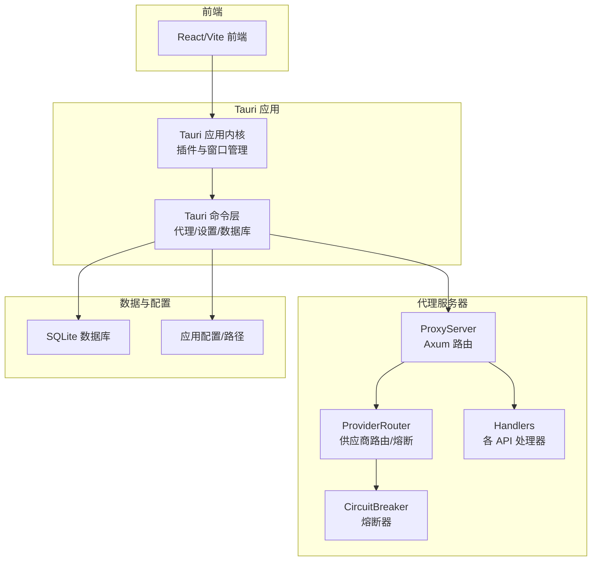
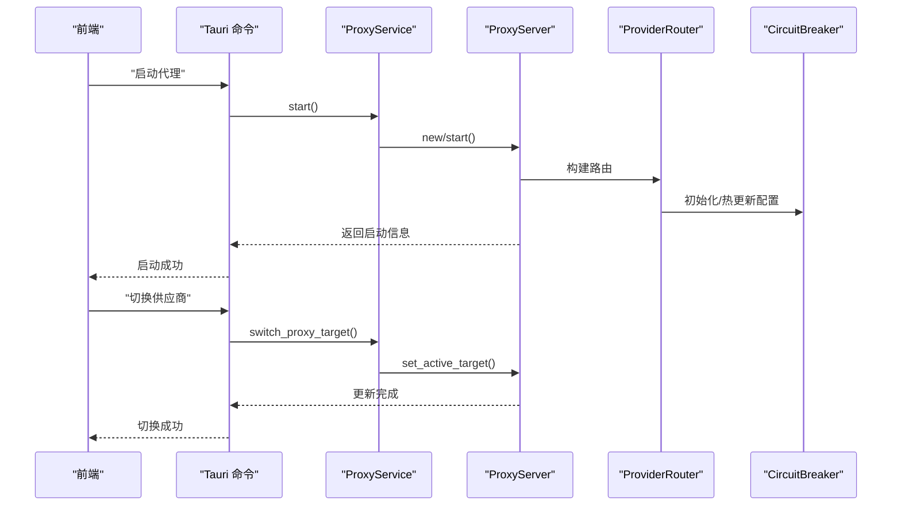
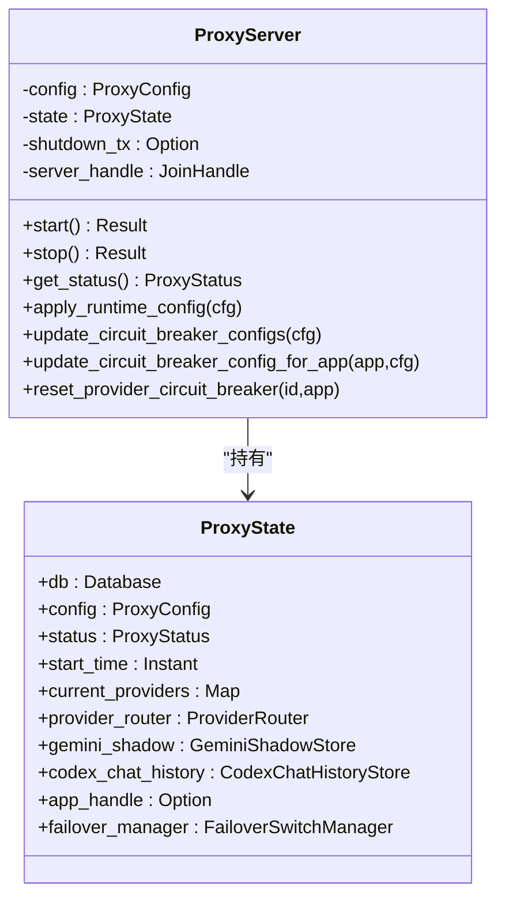
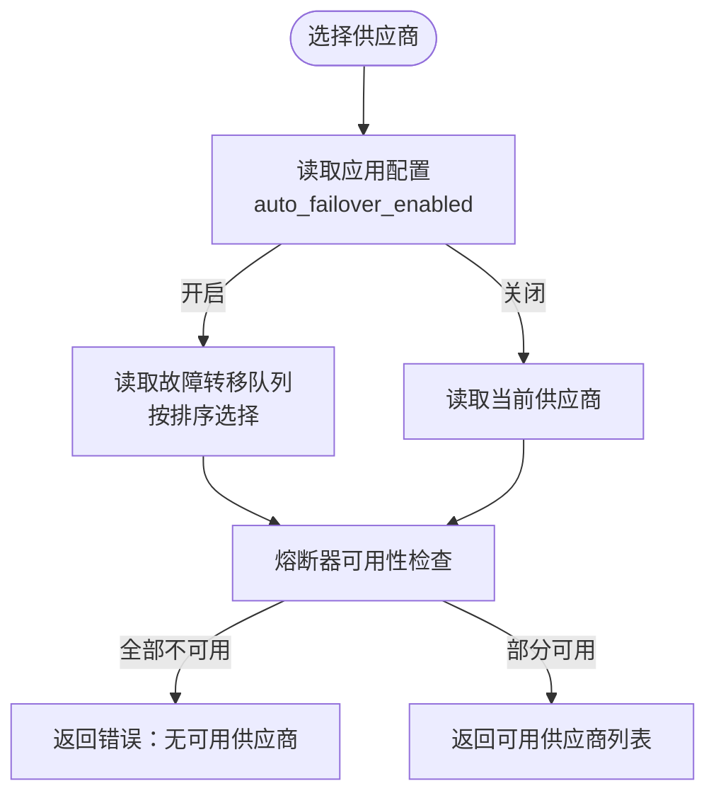
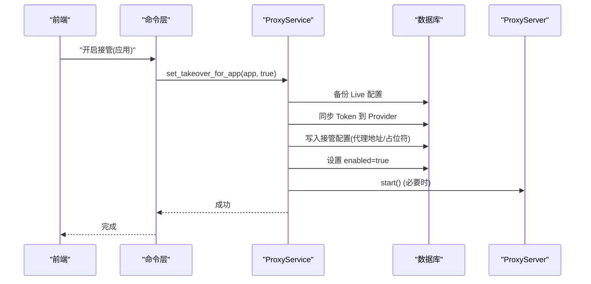
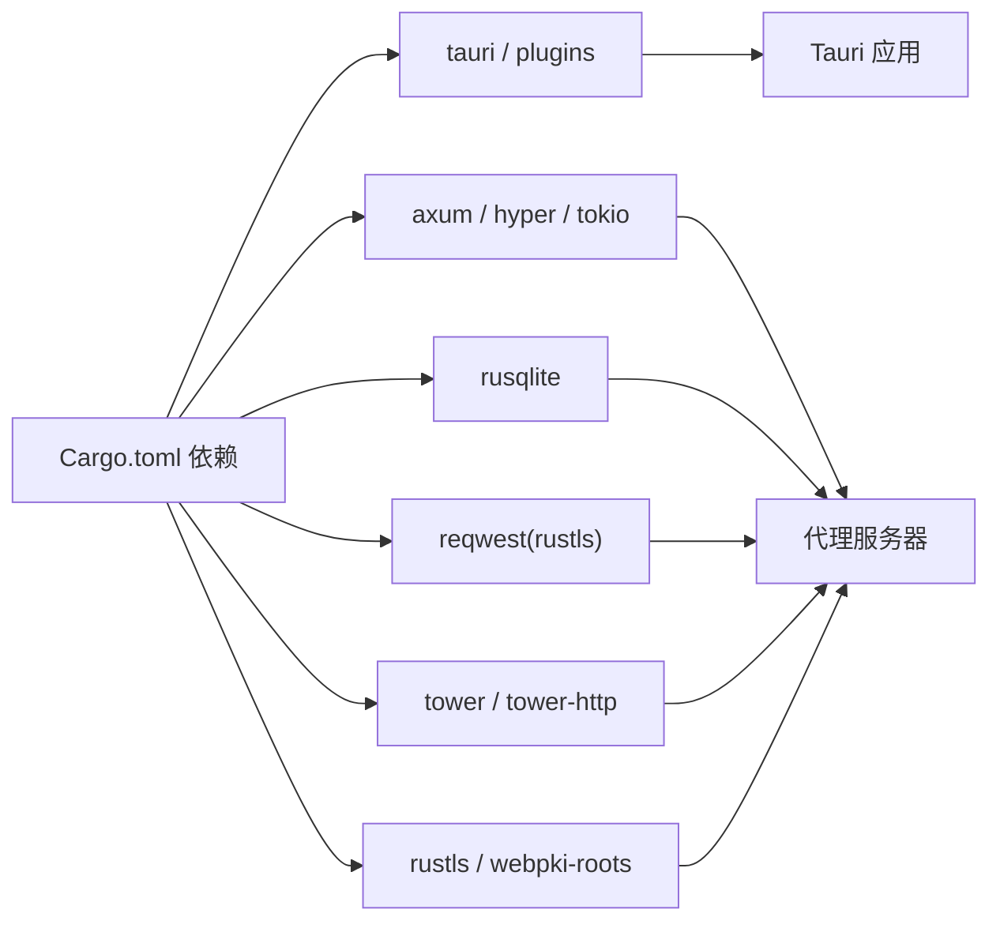

# 代理服务器架构

<cite>
**本文引用的文件**
- [src-tauri/src/main.rs](file://src-tauri/src/main.rs)
- [src-tauri/Cargo.toml](file://src-tauri/Cargo.toml)
- [src-tauri/tauri.conf.json](file://src-tauri/tauri.conf.json)
- [src-tauri/src/lib.rs](file://src-tauri/src/lib.rs)
- [src-tauri/src/proxy/server.rs](file://src-tauri/src/proxy/server.rs)
- [src-tauri/src/proxy/types.rs](file://src-tauri/src/proxy/types.rs)
- [src-tauri/src/proxy/handlers.rs](file://src-tauri/src/proxy/handlers.rs)
- [src-tauri/src/proxy/provider_router.rs](file://src-tauri/src/proxy/provider_router.rs)
- [src-tauri/src/proxy/circuit_breaker.rs](file://src-tauri/src/proxy/circuit_breaker.rs)
- [src-tauri/src/services/proxy.rs](file://src-tauri/src/services/proxy.rs)
- [src-tauri/src/commands/proxy.rs](file://src-tauri/src/commands/proxy.rs)
- [src-tauri/src/database/mod.rs](file://src-tauri/src/database/mod.rs)
- [src-tauri/src/config.rs](file://src-tauri/src/config.rs)
- [src/config/universalProviderPresets.ts](file://src/config/universalProviderPresets.ts)
</cite>

## 目录
1. [引言](#引言)
2. [项目结构](#项目结构)
3. [核心组件](#核心组件)
4. [架构总览](#架构总览)
5. [详细组件分析](#详细组件分析)
6. [依赖关系分析](#依赖关系分析)
7. [性能考虑](#性能考虑)
8. [故障排查指南](#故障排查指南)
9. [结论](#结论)
10. [附录](#附录)

## 引言
本文件面向 CC Switch 代理服务器的架构与实现，系统性阐述其整体设计、启动与生命周期管理、配置参数、监听端口与 TLS 支持、安全配置、状态与健康检查、错误恢复策略，以及与前端 UI、数据库、各 AI 供应商的交互方式。文档同时提供实际的配置示例、启动参数说明与性能调优建议，帮助开发者与运维人员快速理解并高效使用该代理服务器。

## 项目结构
- Rust 后端基于 Tauri 构建，包含代理服务器、数据库、服务层与命令接口。
- 前端为 React/Vite 应用，通过 Tauri 命令与后端交互。
- 代理服务器采用 Axum + Hyper 实现，支持多应用（Claude、Codex、Gemini）与多供应商路由、熔断与故障转移。

图表来源
- [src-tauri/src/main.rs:1-23](file://src-tauri/src/main.rs#L1-L23)
- [src-tauri/src/lib.rs:1-80](file://src-tauri/src/lib.rs#L1-L80)
- [src-tauri/src/proxy/server.rs:1-396](file://src-tauri/src/proxy/server.rs#L1-L396)
- [src-tauri/src/proxy/provider_router.rs:1-524](file://src-tauri/src/proxy/provider_router.rs#L1-L524)
- [src-tauri/src/database/mod.rs:1-273](file://src-tauri/src/database/mod.rs#L1-L273)

章节来源
- [src-tauri/src/main.rs:1-23](file://src-tauri/src/main.rs#L1-L23)
- [src-tauri/src/lib.rs:1-80](file://src-tauri/src/lib.rs#L1-L80)
- [src-tauri/Cargo.toml:1-110](file://src-tauri/Cargo.toml#L1-L110)
- [src-tauri/tauri.conf.json:1-70](file://src-tauri/tauri.conf.json#L1-L70)

## 核心组件
- 代理服务器（ProxyServer）：基于 Axum 的 HTTP 服务器，负责路由与转发请求，维护运行状态与活跃目标。
- 供应商路由器（ProviderRouter）：按应用类型选择可用供应商，集成熔断器，支持故障转移队列。
- 熔断器（CircuitBreaker）：实现失败阈值、错误率、超时恢复等策略，保障上游不稳定时的稳定性。
- 服务层（ProxyService）：封装代理启动/停止、Live 配置接管、配置持久化与热更新。
- 命令层（Tauri Commands）：暴露前端可调用的代理控制与查询接口。
- 数据库（SQLite）：持久化供应商、配置、健康状态、故障转移队列与日志滚动等。

章节来源
- [src-tauri/src/proxy/server.rs:1-396](file://src-tauri/src/proxy/server.rs#L1-L396)
- [src-tauri/src/proxy/provider_router.rs:1-524](file://src-tauri/src/proxy/provider_router.rs#L1-L524)
- [src-tauri/src/proxy/circuit_breaker.rs:1-496](file://src-tauri/src/proxy/circuit_breaker.rs#L1-L496)
- [src-tauri/src/services/proxy.rs:1-800](file://src-tauri/src/services/proxy.rs#L1-L800)
- [src-tauri/src/commands/proxy.rs:1-449](file://src-tauri/src/commands/proxy.rs#L1-L449)
- [src-tauri/src/database/mod.rs:1-273](file://src-tauri/src/database/mod.rs#L1-L273)

## 架构总览
代理服务器采用“共享状态 + 路由器 + 熔断器”的设计：
- ProxyServer 持有共享状态（数据库、配置、状态、当前供应商映射、熔断器管理器、故障转移管理器），并通过 Axum Router 暴露多应用 API。
- ProviderRouter 依据应用配置与故障转移队列选择供应商，并通过 CircuitBreaker 控制请求准入。
- ProxyService 负责启动/停止、Live 接管、配置热更新与 UI 事件通知。
- Tauri Commands 将服务层能力暴露给前端，实现 UI 与代理的交互。

图表来源
- [src-tauri/src/services/proxy.rs:399-454](file://src-tauri/src/services/proxy.rs#L399-L454)
- [src-tauri/src/proxy/server.rs:362-395](file://src-tauri/src/proxy/server.rs#L362-L395)
- [src-tauri/src/proxy/provider_router.rs:119-162](file://src-tauri/src/proxy/provider_router.rs#L119-L162)
- [src-tauri/src/commands/proxy.rs:275-299](file://src-tauri/src/commands/proxy.rs#L275-L299)

## 详细组件分析

### 代理服务器（ProxyServer）
- 启动流程：解析配置、绑定监听地址与端口、创建关闭通道、构建路由、启动 accept 循环、更新状态与启动时间。
- 停止流程：发送关闭信号、等待服务器任务结束（带超时）、更新状态。
- 路由与端点：健康检查、状态查询、Claude、Codex、Gemini 等多应用 API。
- 运行时配置：支持热更新代理配置与熔断器配置。
- 状态管理：运行状态、监听地址/端口、活跃连接数、请求统计、成功率、运行时长、最后请求时间与错误、故障转移次数、活跃目标列表。

图表来源
- [src-tauri/src/proxy/server.rs:32-92](file://src-tauri/src/proxy/server.rs#L32-L92)
- [src-tauri/src/proxy/server.rs:94-255](file://src-tauri/src/proxy/server.rs#L94-L255)
- [src-tauri/src/proxy/server.rs:291-360](file://src-tauri/src/proxy/server.rs#L291-L360)

章节来源
- [src-tauri/src/proxy/server.rs:1-396](file://src-tauri/src/proxy/server.rs#L1-L396)

### 供应商路由器与熔断器
- 供应商选择：支持故障转移开启与关闭两种模式。开启时按队列顺序选择；关闭时仅使用当前供应商。
- 熔断器：支持失败阈值、成功阈值、超时、错误率与最小请求数，半开探测限流，热更新配置。
- 结果记录：成功/失败均会更新熔断器状态与数据库健康状态，并在需要时触发 UI 事件。

图表来源
- [src-tauri/src/proxy/provider_router.rs:32-109](file://src-tauri/src/proxy/provider_router.rs#L32-L109)
- [src-tauri/src/proxy/circuit_breaker.rs:105-200](file://src-tauri/src/proxy/circuit_breaker.rs#L105-L200)

章节来源
- [src-tauri/src/proxy/provider_router.rs:1-524](file://src-tauri/src/proxy/provider_router.rs#L1-L524)
- [src-tauri/src/proxy/circuit_breaker.rs:1-496](file://src-tauri/src/proxy/circuit_breaker.rs#L1-L496)

### 服务层（ProxyService）
- 启动/停止：自动设置代理总开关、读取配置、创建服务器实例、持久化动态端口、保存实例。
- Live 接管：备份 Live 配置、同步 Token、写入接管配置（代理地址与占位符 Token）、设置接管状态。
- 配置热更新：更新全局/应用级代理配置与熔断器配置，通知运行中的服务器。
- 供应商切换：热切换当前目标供应商（接管模式下禁止切换官方供应商）。

图表来源
- [src-tauri/src/services/proxy.rs:601-782](file://src-tauri/src/services/proxy.rs#L601-L782)
- [src-tauri/src/commands/proxy.rs:50-61](file://src-tauri/src/commands/proxy.rs#L50-L61)

章节来源
- [src-tauri/src/services/proxy.rs:1-800](file://src-tauri/src/services/proxy.rs#L1-L800)
- [src-tauri/src/commands/proxy.rs:1-449](file://src-tauri/src/commands/proxy.rs#L1-L449)

### 命令层（Tauri Commands）
- 代理控制：启动/停止、状态查询、配置读取/更新、是否运行/接管状态查询。
- 供应商与熔断：查询健康、重置熔断器、获取/更新熔断器配置。
- 供应商切换：热切换当前目标供应商（接管模式下限制官方供应商）。

章节来源
- [src-tauri/src/commands/proxy.rs:1-449](file://src-tauri/src/commands/proxy.rs#L1-L449)

### 数据库与配置
- 数据库：SQLite，表结构与迁移、备份、自动真空、增量自动真空、模型定价种子数据、变更钩子触发同步。
- 配置：应用配置目录、路径解析、JSON/TOML 原子写入、键排序保证确定性输出。

章节来源
- [src-tauri/src/database/mod.rs:1-273](file://src-tauri/src/database/mod.rs#L1-L273)
- [src-tauri/src/config.rs:1-425](file://src-tauri/src/config.rs#L1-L425)

### 前端与统一供应商预设
- 统一供应商（Universal Provider）：跨应用共享配置，支持 NewAPI 等网关，提供预设模型与图标。
- 与后端交互：通过命令层读取/写入配置，配合代理服务实现跨应用统一管理。

章节来源
- [src/config/universalProviderPresets.ts:1-133](file://src/config/universalProviderPresets.ts#L1-L133)

## 依赖关系分析
- 运行时依赖：Tauri、Axum、Hyper、Tokio、rusqlite、reqwest（含 rustls）、tower/tower-http、webpki-roots 等。
- 插件生态：日志、存储、进程、对话框、窗口状态、单实例、深链、更新器等。
- 代理栈：Axum Router → Handler → ProviderRouter → CircuitBreaker → Upstream。

图表来源
- [src-tauri/Cargo.toml:25-83](file://src-tauri/Cargo.toml#L25-L83)

章节来源
- [src-tauri/Cargo.toml:1-110](file://src-tauri/Cargo.toml#L1-L110)

## 性能考虑
- 连接与并发：Tokio 多线程运行时、异步任务与连接池，合理设置超时与背压。
- 路由与转发：Axum 默认 Body 限制较大，满足大体积请求；注意上游超时与流式传输。
- 熔断与故障转移：合理配置失败阈值、超时与恢复阈值，避免频繁抖动；半开探测限流防止雪崩。
- 数据库：增量自动真空、滚动清理与真空回收，减少 IO 压力。
- TLS：使用 rustls 与 webpki-roots，确保安全与性能平衡。

## 故障排查指南
- 启动失败：检查监听端口占用、配置合法性、数据库初始化与迁移错误；查看日志文件。
- 代理未运行：确认代理总开关与应用级开关；检查 Live 接管状态与备份。
- 供应商不可用：查看熔断器状态与健康记录；必要时重置熔断器并观察自动切换。
- 健康检查：/health 返回健康状态；/status 返回运行时指标。
- 错误恢复：Live 接管失败会尝试恢复备份；代理启动失败会清理接管痕迹并回滚。

章节来源
- [src-tauri/src/proxy/server.rs:225-255](file://src-tauri/src/proxy/server.rs#L225-L255)
- [src-tauri/src/services/proxy.rs:487-565](file://src-tauri/src/services/proxy.rs#L487-L565)
- [src-tauri/src/proxy/handlers.rs:49-64](file://src-tauri/src/proxy/handlers.rs#L49-L64)

## 结论
CC Switch 代理服务器以清晰的分层设计实现了多应用、多供应商的统一代理与路由能力，结合熔断器与故障转移保障稳定性，并通过 Live 接管与配置热更新提升用户体验。借助 SQLite 数据持久化与 Tauri 插件生态，系统在安全性、可观测性与可维护性方面具备良好基础。

## 附录

### 启动流程与生命周期
- 启动：命令层调用服务层 start，服务层创建 ProxyServer 并启动；必要时持久化动态端口。
- 运行：代理服务器接受连接、路由请求、选择供应商、转发并记录状态。
- 停止：发送关闭信号，等待任务结束并清理状态。

章节来源
- [src-tauri/src/services/proxy.rs:399-454](file://src-tauri/src/services/proxy.rs#L399-L454)
- [src-tauri/src/proxy/server.rs:94-137](file://src-tauri/src/proxy/server.rs#L94-L137)
- [src-tauri/src/proxy/server.rs:225-255](file://src-tauri/src/proxy/server.rs#L225-L255)

### 配置参数与示例
- 代理配置（ProxyConfig）
  - 监听地址：listen_address（默认 127.0.0.1）
  - 监听端口：listen_port（默认 15721）
  - 最大重试：max_retries（默认 3）
  - 是否启用日志：enable_logging（默认 true）
  - 流式首字超时：streaming_first_byte_timeout（默认 60s）
  - 流式静默超时：streaming_idle_timeout（默认 120s）
  - 非流式总超时：non_streaming_timeout（默认 600s）

- 全局代理配置（GlobalProxyConfig）
  - 代理总开关：proxy_enabled
  - 监听地址：listen_address
  - 监听端口：listen_port
  - 日志开关：enable_logging

- 应用级代理配置（AppProxyConfig）
  - enabled、auto_failover_enabled、max_retries
  - 超时：streaming_first_byte_timeout、streaming_idle_timeout、non_streaming_timeout
  - 熔断器：failure_threshold、success_threshold、timeout_seconds、error_rate_threshold、min_requests

- 熔断器配置（CircuitBreakerConfig）
  - failure_threshold、success_threshold、timeout_seconds、error_rate_threshold、min_requests

章节来源
- [src-tauri/src/proxy/types.rs:3-56](file://src-tauri/src/proxy/types.rs#L3-L56)
- [src-tauri/src/proxy/types.rs:154-195](file://src-tauri/src/proxy/types.rs#L154-L195)
- [src-tauri/src/proxy/types.rs:35-73](file://src-tauri/src/proxy/types.rs#L35-L73)
- [src-tauri/src/proxy/circuit_breaker.rs:35-73](file://src-tauri/src/proxy/circuit_breaker.rs#L35-L73)

### 监听端口与 TLS 支持
- 监听端口：默认 15721；若配置为 0 则由系统分配，随后持久化到配置。
- TLS：使用 reqwest 的 rustls 特性与 webpki-roots，支持上游 HTTPS；未见内置自签名证书或本地 TLS 终止逻辑。

章节来源
- [src-tauri/src/proxy/server.rs:100-123](file://src-tauri/src/proxy/server.rs#L100-L123)
- [src-tauri/Cargo.toml:42-62](file://src-tauri/Cargo.toml#L42-L62)

### 安全配置
- 深链与 CSP：深链 schemes 为 ccswitch；CSP 限制 connect-src 与脚本来源。
- 日志与隐私：日志单文件轮转、敏感 URL 参数脱敏；Live 接管写入占位符 Token，避免泄露真实密钥。
- 单实例与托盘：单实例回调处理深链与窗口焦点；托盘菜单动态更新。

章节来源
- [src-tauri/tauri.conf.json:28-34](file://src-tauri/tauri.conf.json#L28-L34)
- [src-tauri/src/lib.rs:124-182](file://src-tauri/src/lib.rs#L124-L182)

### 服务器状态管理与健康检查
- 健康检查：/health 返回健康状态与时间戳。
- 状态查询：/status 返回运行状态、端口、请求统计、成功率、运行时长、活跃目标等。
- 健康状态：数据库记录供应商健康度、连续失败次数、最近成功/失败时间与错误。

章节来源
- [src-tauri/src/proxy/handlers.rs:49-64](file://src-tauri/src/proxy/handlers.rs#L49-L64)
- [src-tauri/src/proxy/handlers.rs:60-64](file://src-tauri/src/proxy/handlers.rs#L60-L64)
- [src-tauri/src/proxy/types.rs:129-140](file://src-tauri/src/proxy/types.rs#L129-L140)

### 错误恢复策略
- Live 接管失败：尝试恢复备份；若恢复失败则保留备份以便下次启动恢复。
- 代理启动失败：清理接管痕迹并回滚。
- 熔断恢复：半开探测成功后自动切换回更优供应商（若启用自动故障转移）。

章节来源
- [src-tauri/src/services/proxy.rs:525-565](file://src-tauri/src/services/proxy.rs#L525-L565)
- [src-tauri/src/commands/proxy.rs:322-402](file://src-tauri/src/commands/proxy.rs#L322-L402)

### 与其他组件的交互
- 与前端 UI：通过 Tauri 命令层交互，支持启动/停止、状态查询、配置更新、供应商切换、熔断器操作。
- 与数据库：持久化供应商、配置、健康状态、故障转移队列、日志滚动与备份。
- 与 AI 供应商：通过 ProviderRouter 选择供应商，CircuitBreaker 控制请求，Handler 负责格式转换与转发。

章节来源
- [src-tauri/src/commands/proxy.rs:1-449](file://src-tauri/src/commands/proxy.rs#L1-L449)
- [src-tauri/src/database/mod.rs:1-273](file://src-tauri/src/database/mod.rs#L1-L273)
- [src-tauri/src/proxy/provider_router.rs:1-524](file://src-tauri/src/proxy/provider_router.rs#L1-L524)

### 实际配置示例与启动参数
- 示例：将代理监听地址改为 0.0.0.0，端口改为 8080，启用日志，设置流式超时为 60s/120s/600s。
- 启动参数：通过命令层调用 start_proxy_server；若需接管 Live 配置，使用 start_with_takeover 或 set_proxy_takeover_for_app。

章节来源
- [src-tauri/src/commands/proxy.rs:10-16](file://src-tauri/src/commands/proxy.rs#L10-L16)
- [src-tauri/src/commands/proxy.rs:50-61](file://src-tauri/src/commands/proxy.rs#L50-L61)

### 性能调优建议
- 熔断器：根据上游稳定性调整失败阈值与超时；开启自动故障转移时关注队列排序与半开探测限流。
- 超时：针对流式与非流式场景分别设置合理超时，避免长时间阻塞。
- 数据库：定期清理旧日志与滚动数据，启用增量自动真空以降低碎片化。
- TLS：使用系统根证书与 rustls，避免自签证书带来的握手开销与兼容性问题。