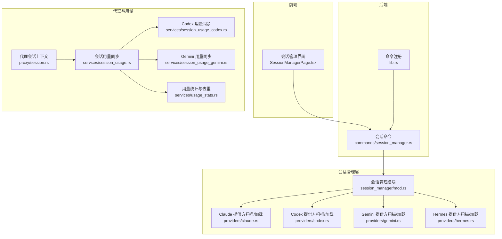
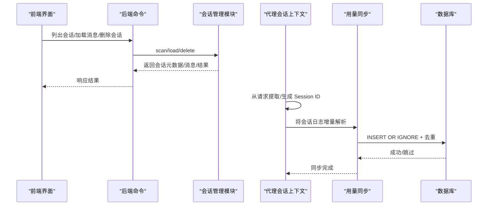
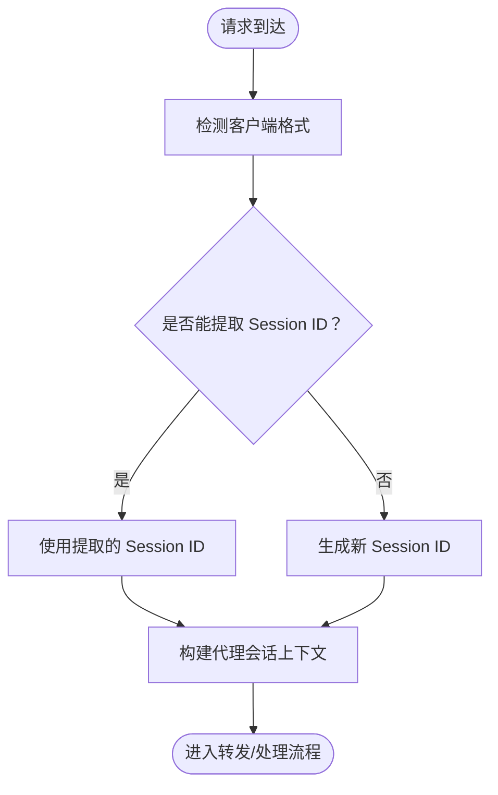
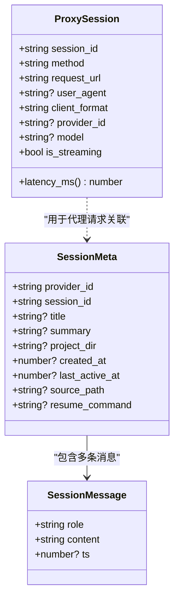
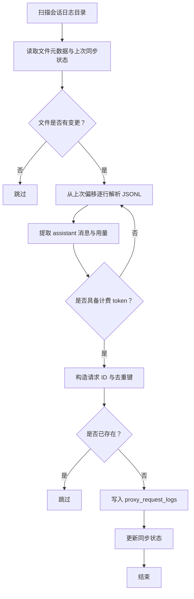
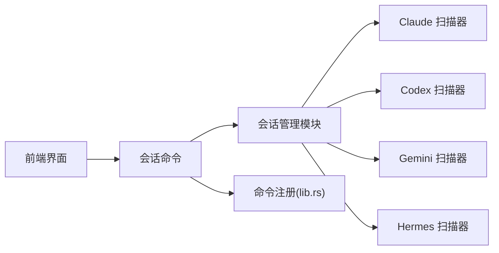

# 会话管理

<cite>
**本文引用的文件**
- [src-tauri/src/session_manager/mod.rs](file://src-tauri/src/session_manager/mod.rs)
- [src-tauri/src/session_manager/providers/mod.rs](file://src-tauri/src/session_manager/providers/mod.rs)
- [src-tauri/src/session_manager/providers/claude.rs](file://src-tauri/src/session_manager/providers/claude.rs)
- [src-tauri/src/session_manager/providers/codex.rs](file://src-tauri/src/session_manager/providers/codex.rs)
- [src-tauri/src/session_manager/providers/gemini.rs](file://src-tauri/src/session_manager/providers/gemini.rs)
- [src-tauri/src/session_manager/providers/hermes.rs](file://src-tauri/src/session_manager/providers/hermes.rs)
- [src-tauri/src/commands/session_manager.rs](file://src-tauri/src/commands/session_manager.rs)
- [src-tauri/src/lib.rs](file://src-tauri/src/lib.rs)
- [src-tauri/src/proxy/session.rs](file://src-tauri/src/proxy/session.rs)
- [src-tauri/src/services/session_usage.rs](file://src-tauri/src/services/session_usage.rs)
- [src-tauri/src/services/session_usage_codex.rs](file://src-tauri/src/services/session_usage_codex.rs)
- [src-tauri/src/services/session_usage_gemini.rs](file://src-tauri/src/services/session_usage_gemini.rs)
- [src-tauri/src/services/usage_stats.rs](file://src-tauri/src/services/usage_stats.rs)
- [src/components/sessions/SessionManagerPage.tsx](file://src/components/sessions/SessionManagerPage.tsx)
- [docs/user-manual/en/3-extensions/3.4-sessions.md](file://docs/user-manual/en/3-extensions/3.4-sessions.md)
- [session-manager.md](file://session-manager.md)
</cite>

## 目录
1. [简介](#简介)
2. [项目结构](#项目结构)
3. [核心组件](#核心组件)
4. [架构总览](#架构总览)
5. [详细组件分析](#详细组件分析)
6. [依赖关系分析](#依赖关系分析)
7. [性能考量](#性能考量)
8. [故障排查指南](#故障排查指南)
9. [结论](#结论)
10. [附录](#附录)

## 简介
本技术文档围绕 CC Switch 的会话管理系统，系统阐述会话生命周期管理、ID 生成策略、状态跟踪与上下文维护，以及与代理服务的集成、持久化与恢复、并发与资源管理、多应用会话隔离与去重策略、状态查询接口与调试工具、性能优化与安全注意事项。文档面向开发者与高级用户，既提供代码级细节，也给出可视化图示与实践建议。

## 项目结构
会话管理由“前端界面 + 后端命令 + 会话扫描与加载 + 代理会话上下文 + 用量同步”五部分组成：
- 前端：会话管理页面负责展示、搜索、批量删除、终端恢复等交互。
- 后端命令：暴露 list/get/delete/launch 等会话管理命令。
- 会话扫描与加载：按提供方扫描会话、解析消息、删除会话。
- 代理会话上下文：从请求中提取/生成会话 ID，贯穿代理请求生命周期。
- 用量同步：从各提供方会话日志导入用量，去重并写入统一统计表。

图表来源
- [src/components/sessions/SessionManagerPage.tsx:1-800](file://src/components/sessions/SessionManagerPage.tsx#L1-L800)
- [src-tauri/src/commands/session_manager.rs:1-86](file://src-tauri/src/commands/session_manager.rs#L1-L86)
- [src-tauri/src/lib.rs:1330-1344](file://src-tauri/src/lib.rs#L1330-L1344)
- [src-tauri/src/session_manager/mod.rs:1-352](file://src-tauri/src/session_manager/mod.rs#L1-L352)
- [src-tauri/src/session_manager/providers/mod.rs:1-8](file://src-tauri/src/session_manager/providers/mod.rs#L1-L8)
- [src-tauri/src/proxy/session.rs:1-627](file://src-tauri/src/proxy/session.rs#L1-L627)
- [src-tauri/src/services/session_usage.rs:1-799](file://src-tauri/src/services/session_usage.rs#L1-L799)

章节来源
- [src-tauri/src/session_manager/mod.rs:1-352](file://src-tauri/src/session_manager/mod.rs#L1-L352)
- [src-tauri/src/session_manager/providers/mod.rs:1-8](file://src-tauri/src/session_manager/providers/mod.rs#L1-L8)
- [src-tauri/src/commands/session_manager.rs:1-86](file://src-tauri/src/commands/session_manager.rs#L1-L86)
- [src-tauri/src/lib.rs:1330-1344](file://src-tauri/src/lib.rs#L1330-L1344)

## 核心组件
- 会话元数据与消息模型：统一的 SessionMeta 与 SessionMessage 结构，跨提供方一致化。
- 会话扫描与聚合：并行扫描多提供方会话，合并排序，支持 SQLite 与 JSONL 双态。
- 会话消息解析：按提供方语义提取角色、内容、时间戳，兼容工具调用与子代理。
- 会话删除与校验：严格校验 session_id 与根路径，避免越权删除。
- 代理会话上下文：从请求中提取或生成 Session ID，区分 Claude/Codex/OpenAI/Gemini 等格式。
- 用量同步与去重：从会话日志增量解析，按请求 ID 与关键维度去重，写入统一统计表。
- 前端交互：两列布局、搜索过滤、批量删除、终端恢复、目录选择等。

章节来源
- [src-tauri/src/session_manager/mod.rs:9-112](file://src-tauri/src/session_manager/mod.rs#L9-L112)
- [src-tauri/src/session_manager/providers/claude.rs:17-86](file://src-tauri/src/session_manager/providers/claude.rs#L17-L86)
- [src-tauri/src/session_manager/providers/codex.rs:26-120](file://src-tauri/src/session_manager/providers/codex.rs#L26-L120)
- [src-tauri/src/session_manager/providers/gemini.rs:11-113](file://src-tauri/src/session_manager/providers/gemini.rs#L11-L113)
- [src-tauri/src/session_manager/providers/hermes.rs:25-105](file://src-tauri/src/session_manager/providers/hermes.rs#L25-L105)
- [src-tauri/src/proxy/session.rs:107-185](file://src-tauri/src/proxy/session.rs#L107-L185)
- [src-tauri/src/services/session_usage.rs:61-108](file://src-tauri/src/services/session_usage.rs#L61-L108)

## 架构总览
会话管理的端到端流程包括：前端发起命令 → 后端命令调度 → 会话扫描/加载/删除 → 代理请求提取会话 ID → 用量从会话日志同步到数据库 → 去重与统计。

图表来源
- [src-tauri/src/commands/session_manager.rs:5-85](file://src-tauri/src/commands/session_manager.rs#L5-L85)
- [src-tauri/src/session_manager/mod.rs:58-139](file://src-tauri/src/session_manager/mod.rs#L58-L139)
- [src-tauri/src/proxy/session.rs:237-262](file://src-tauri/src/proxy/session.rs#L237-L262)
- [src-tauri/src/services/session_usage.rs:182-357](file://src-tauri/src/services/session_usage.rs#L182-L357)

## 详细组件分析

### 会话生命周期与上下文维护
- 生命周期阶段：扫描 → 解析 → 展示 → 删除/恢复。
- 上下文维护：代理层在请求进入时提取或生成 Session ID，贯穿请求处理链路，便于后续用量关联与日志追踪。
- 会话 ID 生成策略：
  - Claude：优先从 metadata.user_id 或 metadata.session_id 提取；若无则从特定头部提取；仍无则生成 UUID。
  - Codex：优先从 headers（session_id/x-session-id）或 metadata.session_id 提取；仍无则生成带前缀的 UUID。
  - 其他：直接生成 UUID。
- 会话上下文字段：方法、URL、UA、客户端格式、模型、是否流式、起始时间、供应商 ID 等。

图表来源
- [src-tauri/src/proxy/session.rs:16-99](file://src-tauri/src/proxy/session.rs#L16-L99)
- [src-tauri/src/proxy/session.rs:237-376](file://src-tauri/src/proxy/session.rs#L237-L376)

章节来源
- [src-tauri/src/proxy/session.rs:1-627](file://src-tauri/src/proxy/session.rs#L1-L627)

### 多应用会话隔离与消息解析
- 隔离策略：按 provider_id 与 session_id 双键隔离，避免跨应用/跨会话混淆。
- 消息解析差异：
  - Claude：识别 tool_result 并重分类为 tool 角色；跳过系统注入的提示与命令。
  - Codex：区分 message/function_call/function_call_output 三类 payload。
  - Gemini：支持字符串或数组内容，合并 toolCalls 名称；过滤 info/error。
  - Hermes：SQLite 与 JSONL 双态，SQLite 优先，避免重复。

图表来源
- [src-tauri/src/session_manager/mod.rs:9-37](file://src-tauri/src/session_manager/mod.rs#L9-L37)
- [src-tauri/src/proxy/session.rs:107-185](file://src-tauri/src/proxy/session.rs#L107-L185)

章节来源
- [src-tauri/src/session_manager/providers/claude.rs:32-86](file://src-tauri/src/session_manager/providers/claude.rs#L32-L86)
- [src-tauri/src/session_manager/providers/codex.rs:55-120](file://src-tauri/src/session_manager/providers/codex.rs#L55-L120)
- [src-tauri/src/session_manager/providers/gemini.rs:57-113](file://src-tauri/src/session_manager/providers/gemini.rs#L57-L113)
- [src-tauri/src/session_manager/providers/hermes.rs:25-105](file://src-tauri/src/session_manager/providers/hermes.rs#L25-L105)

### 会话持久化、恢复与清理
- 持久化位置：
  - Claude Code：~/.cache/claude/projects/*.jsonl
  - Codex：Codex 配置 sessions/archived_sessions 目录
  - OpenCode：~/.local/share/opencode/（JSON 或 SQLite）
  - OpenClaw：~/.openclaw/agents/<agent>/sessions/*.jsonl
  - Gemini CLI：~/.cache/gemini/tmp/<project_hash>/chats/
  - Hermes：~/.hermes/state.db 或 ~/.hermes/sessions/*.jsonl
- 恢复能力：提供 resume 命令或终端启动，支持目录选择器（Claude）。
- 清理策略：严格校验 session_id 与根路径，避免误删；SQLite 会话通过专用删除函数处理。

章节来源
- [docs/user-manual/en/3-extensions/3.4-sessions.md:1-54](file://docs/user-manual/en/3-extensions/3.4-sessions.md#L1-L54)
- [src-tauri/src/session_manager/providers/claude.rs:88-121](file://src-tauri/src/session_manager/providers/claude.rs#L88-L121)
- [src-tauri/src/session_manager/providers/codex.rs:122-141](file://src-tauri/src/session_manager/providers/codex.rs#L122-L141)
- [src-tauri/src/session_manager/providers/gemini.rs:115-138](file://src-tauri/src/session_manager/providers/gemini.rs#L115-L138)
- [src-tauri/src/session_manager/providers/hermes.rs:187-205](file://src-tauri/src/session_manager/providers/hermes.rs#L187-L205)

### 会话与代理服务的集成
- 代理层在请求进入时提取/生成 Session ID，作为后续用量与日志关联的关键键。
- 代理配置包含超时、重试、日志开关等，影响会话体验与稳定性。
- 代理健康与故障切换：提供健康检查、熔断器、自动故障转移等能力，间接保障会话连贯性。

章节来源
- [src-tauri/src/proxy/session.rs:237-376](file://src-tauri/src/proxy/session.rs#L237-L376)
- [src-tauri/src/lib.rs:1301-1332](file://src-tauri/src/lib.rs#L1301-L1332)

### 会话用量同步与去重
- 同步来源：Claude Code、Codex、Gemini CLI 等会话日志。
- 增量同步：记录文件 mtime 与行偏移，仅增量解析。
- 去重策略：按请求 ID 与关键维度（输入/输出/缓存 token、模型、时间）判定重复，INSERT OR IGNORE。
- 数据源分布：支持按数据源统计用量占比，辅助成本分析。

图表来源
- [src-tauri/src/services/session_usage.rs:182-357](file://src-tauri/src/services/session_usage.rs#L182-L357)
- [src-tauri/src/services/session_usage.rs:410-522](file://src-tauri/src/services/session_usage.rs#L410-L522)
- [src-tauri/src/services/session_usage_codex.rs:662-705](file://src-tauri/src/services/session_usage_codex.rs#L662-L705)
- [src-tauri/src/services/session_usage_gemini.rs:375-419](file://src-tauri/src/services/session_usage_gemini.rs#L375-L419)
- [src-tauri/src/services/usage_stats.rs:2548-2756](file://src-tauri/src/services/usage_stats.rs#L2548-L2756)

章节来源
- [src-tauri/src/services/session_usage.rs:1-799](file://src-tauri/src/services/session_usage.rs#L1-L799)
- [src-tauri/src/services/session_usage_codex.rs:662-705](file://src-tauri/src/services/session_usage_codex.rs#L662-L705)
- [src-tauri/src/services/session_usage_gemini.rs:375-419](file://src-tauri/src/services/session_usage_gemini.rs#L375-L419)
- [src-tauri/src/services/usage_stats.rs:2548-2860](file://src-tauri/src/services/usage_stats.rs#L2548-L2860)

### 并发控制与资源管理
- 并发扫描：会话扫描采用线程池并行扫描多提供方，提升整体效率。
- 资源保护：代理层对数据库连接进行互斥访问；会话删除严格校验路径与 ID，避免越权。
- 增量同步：通过文件 mtime 与行偏移避免重复解析，降低 I/O 压力。

章节来源
- [src-tauri/src/session_manager/mod.rs:58-91](file://src-tauri/src/session_manager/mod.rs#L58-L91)
- [src-tauri/src/services/session_usage.rs:362-407](file://src-tauri/src/services/session_usage.rs#L362-L407)

### 状态查询接口与调试工具
- 前端接口：会话列表、消息详情、批量删除、终端恢复等。
- 后端命令：list_sessions、get_session_messages、delete_session(s)、launch_session_terminal。
- 调试要点：查看会话日志同步错误、用量去重结果、代理会话 ID 提取来源、SQLite/JSONL 会话读取异常。

章节来源
- [src-tauri/src/commands/session_manager.rs:5-85](file://src-tauri/src/commands/session_manager.rs#L5-L85)
- [src-tauri/src/lib.rs:1330-1344](file://src-tauri/src/lib.rs#L1330-L1344)
- [src/components/sessions/SessionManagerPage.tsx:1-800](file://src/components/sessions/SessionManagerPage.tsx#L1-L800)

## 依赖关系分析
- 前端依赖后端命令；后端命令依赖会话管理模块；会话管理模块依赖各提供方扫描器；代理上下文与用量同步分别服务于请求处理与统计。
- 命令注册集中于 lib.rs，统一暴露给前端调用。

图表来源
- [src-tauri/src/commands/session_manager.rs:1-86](file://src-tauri/src/commands/session_manager.rs#L1-L86)
- [src-tauri/src/lib.rs:1330-1344](file://src-tauri/src/lib.rs#L1330-L1344)
- [src-tauri/src/session_manager/mod.rs:1-352](file://src-tauri/src/session_manager/mod.rs#L1-L352)

章节来源
- [src-tauri/src/commands/session_manager.rs:1-86](file://src-tauri/src/commands/session_manager.rs#L1-L86)
- [src-tauri/src/lib.rs:1330-1344](file://src-tauri/src/lib.rs#L1330-L1344)

## 性能考量
- 扫描并行化：多提供方并行扫描，缩短总耗时。
- 增量解析：基于文件 mtime 与行偏移，避免全量重扫。
- 去重策略：INSERT OR IGNORE + 去重键，减少重复写入。
- 代理层优化：缓存键稳定化、请求体 JSON 键排序、会话 ID 注入用量日志，提升缓存命中与关联准确性。
- SQLite 只读访问：Hermes 读取使用只读与无互斥标志，降低锁竞争。

章节来源
- [src-tauri/src/session_manager/mod.rs:58-91](file://src-tauri/src/session_manager/mod.rs#L58-L91)
- [src-tauri/src/services/session_usage.rs:182-357](file://src-tauri/src/services/session_usage.rs#L182-L357)
- [src-tauri/src/services/session_usage.rs:410-522](file://src-tauri/src/services/session_usage.rs#L410-L522)
- [src-tauri/src/services/session_usage.rs:362-407](file://src-tauri/src/services/session_usage.rs#L362-L407)
- [src-tauri/src/session_manager/providers/hermes.rs:187-205](file://src-tauri/src/session_manager/providers/hermes.rs#L187-L205)

## 故障排查指南
- 会话列表为空：确认提供方会话目录是否存在；检查扫描器是否抛错；查看前端错误提示。
- 删除失败：核对 session_id 与 source_path；确认路径在允许根目录内；查看具体报错信息。
- 用量未导入：检查会话日志是否具备计费 token；确认去重键是否命中已有记录；查看同步错误列表。
- 代理会话 ID 异常：检查请求头与 body 中的会话标识字段；确认客户端格式识别正确；必要时生成新 ID。
- SQLite 读取失败：确认数据库文件存在与权限；Hermes 会话源格式是否符合预期。

章节来源
- [src-tauri/src/session_manager/mod.rs:114-188](file://src-tauri/src/session_manager/mod.rs#L114-L188)
- [src-tauri/src/services/session_usage.rs:82-108](file://src-tauri/src/services/session_usage.rs#L82-L108)
- [src-tauri/src/services/session_usage.rs:362-407](file://src-tauri/src/services/session_usage.rs#L362-L407)
- [src-tauri/src/proxy/session.rs:237-376](file://src-tauri/src/proxy/session.rs#L237-L376)

## 结论
CC Switch 的会话管理系统通过“统一模型 + 多提供方适配 + 代理上下文 + 增量同步 + 去重策略”的组合，实现了跨应用的会话浏览、搜索、删除与用量统计。代理层的会话 ID 提取与注入，确保了用量与请求的可靠关联；前端交互与命令注册提供了良好的用户体验与扩展空间。在性能方面，扫描并行化、增量解析与只读访问等策略有效降低了资源消耗。建议在生产环境中结合缓存键稳定化、目录选择器与严格的路径校验，进一步提升稳定性与安全性。

## 附录
- 会话管理界面布局与功能参考：[会话管理用户手册:1-54](file://docs/user-manual/en/3-extensions/3.4-sessions.md#L1-L54)
- 会话管理器文档：[session-manager.md](file://session-manager.md)