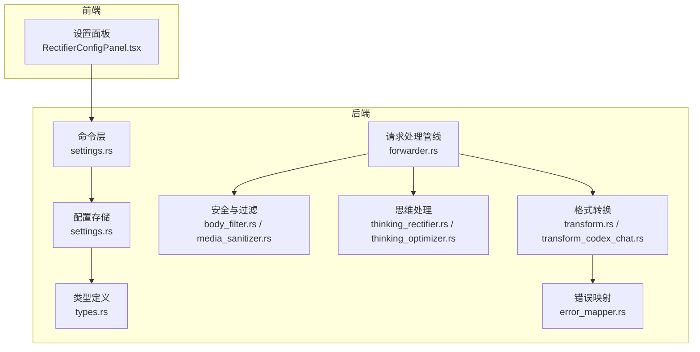
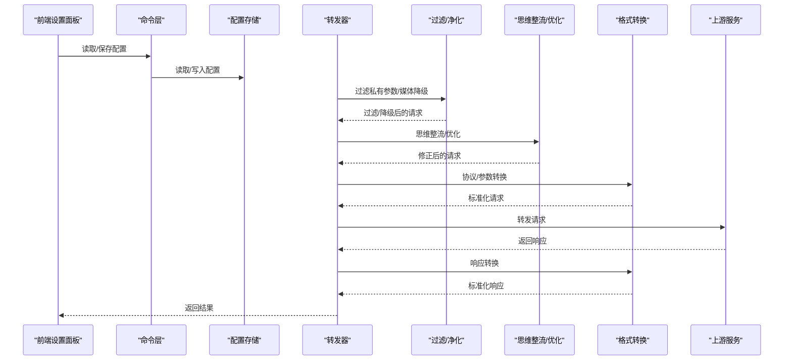
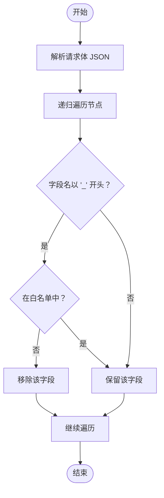
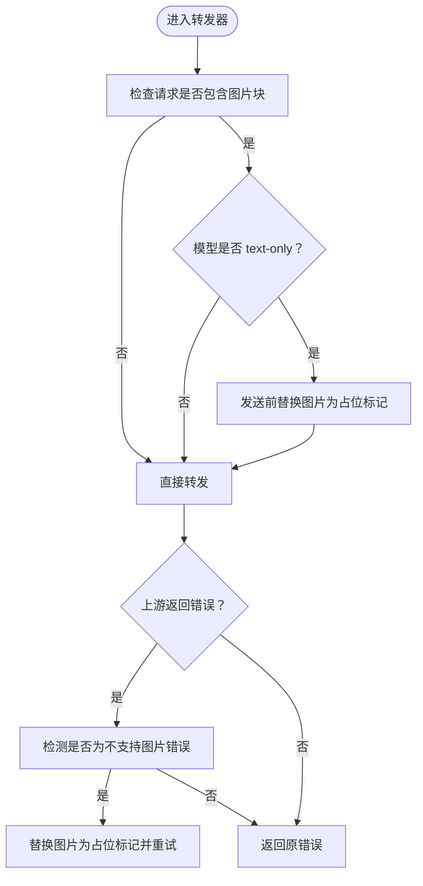
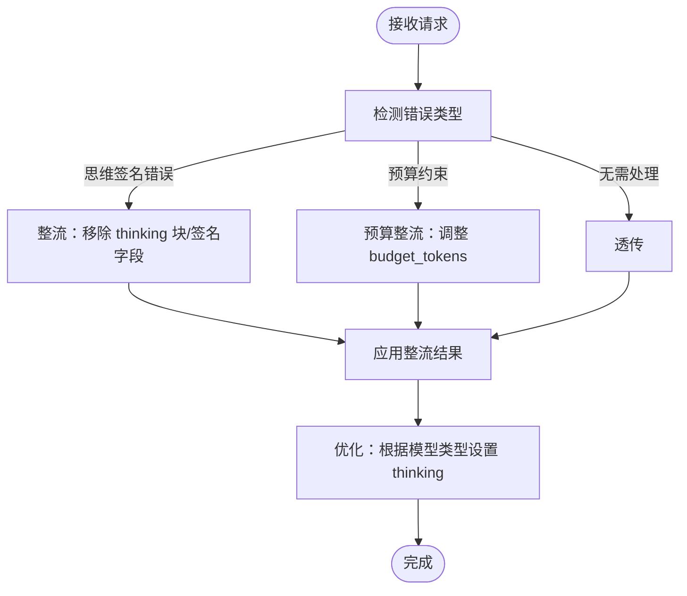
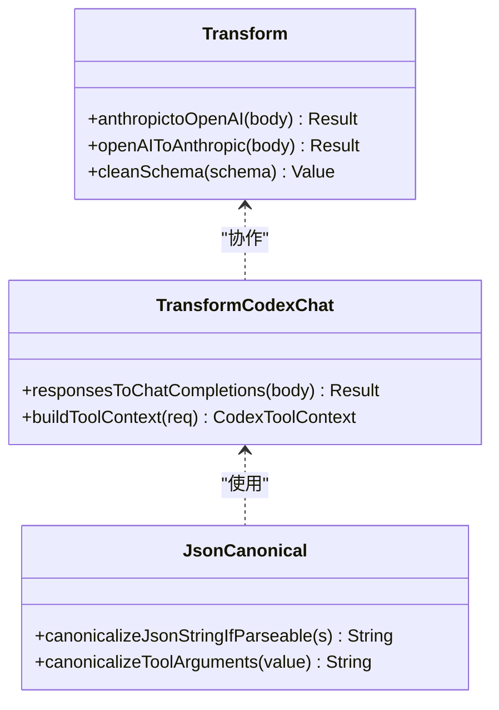
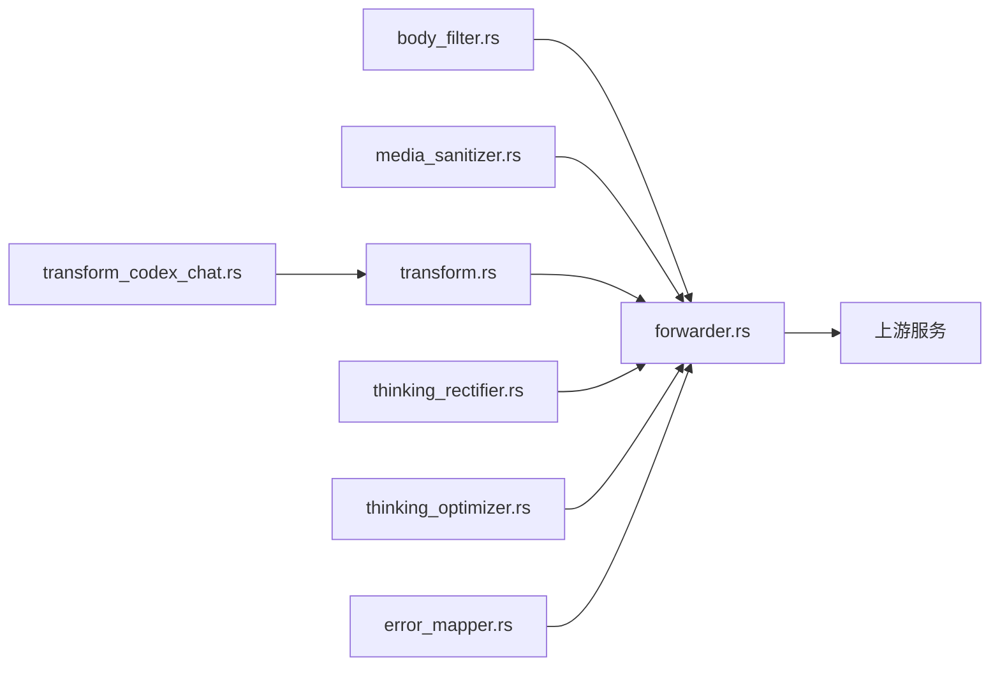

# 内容处理与转换

<cite>
**本文引用的文件**
- [media_sanitizer.rs](file://src-tauri/src/proxy/media_sanitizer.rs)
- [body_filter.rs](file://src-tauri/src/proxy/body_filter.rs)
- [transform.rs](file://src-tauri/src/proxy/providers/transform.rs)
- [transform_codex_chat.rs](file://src-tauri/src/proxy/providers/transform_codex_chat.rs)
- [thinking_rectifier.rs](file://src-tauri/src/proxy/thinking_rectifier.rs)
- [thinking_optimizer.rs](file://src-tauri/src/proxy/thinking_optimizer.rs)
- [json_canonical.rs](file://src-tauri/src/proxy/json_canonical.rs)
- [error_mapper.rs](file://src-tauri/src/proxy/error_mapper.rs)
- [types.rs](file://src-tauri/src/proxy/types.rs)
- [forwarder.rs](file://src-tauri/src/proxy/forwarder.rs)
- [settings.rs](file://src-tauri/src/commands/settings.rs)
- [RectifierConfigPanel.tsx](file://src/components/settings/RectifierConfigPanel.tsx)
- [SECURITY.md](file://SECURITY.md)
</cite>

## 目录
1. [简介](#简介)
2. [项目结构](#项目结构)
3. [核心组件](#核心组件)
4. [架构总览](#架构总览)
5. [详细组件分析](#详细组件分析)
6. [依赖关系分析](#依赖关系分析)
7. [性能考量](#性能考量)
8. [故障排查指南](#故障排查指南)
9. [结论](#结论)
10. [附录](#附录)

## 简介
本技术文档聚焦 CC Switch 的内容处理与转换系统，系统性阐述请求/响应体过滤机制、内容修改策略与安全检查功能，并覆盖媒体文件净化、内容脱敏与敏感信息过滤、JSON 数据转换与字段映射、格式标准化、多 AI 供应商 API 规范适配与参数转换、兼容性处理、实际内容处理示例、过滤规则配置以及性能影响分析。同时，文档强调内容处理的安全考虑、隐私保护与合规要求。

## 项目结构
内容处理与转换系统主要位于 Rust 后端的 proxy 子模块中，前端通过设置面板进行配置管理。关键目录与文件如下：
- 后端核心处理模块：src-tauri/src/proxy/*
- 供应商适配与格式转换：src-tauri/src/proxy/providers/*
- 前端设置面板：src/components/settings/*

**图表来源**
- [RectifierConfigPanel.tsx:1-80](file://src/components/settings/RectifierConfigPanel.tsx#L1-L80)
- [settings.rs:365-417](file://src-tauri/src/commands/settings.rs#L365-L417)
- [types.rs:197-345](file://src-tauri/src/proxy/types.rs#L197-L345)
- [forwarder.rs:129-3396](file://src-tauri/src/proxy/forwarder.rs#L129-L3396)
- [body_filter.rs:1-340](file://src-tauri/src/proxy/body_filter.rs#L1-L340)
- [media_sanitizer.rs:1-832](file://src-tauri/src/proxy/media_sanitizer.rs#L1-L832)
- [thinking_rectifier.rs:1-723](file://src-tauri/src/proxy/thinking_rectifier.rs#L1-L723)
- [thinking_optimizer.rs:1-297](file://src-tauri/src/proxy/thinking_optimizer.rs#L1-L297)
- [transform.rs:1-800](file://src-tauri/src/proxy/providers/transform.rs#L1-L800)
- [transform_codex_chat.rs:1-800](file://src-tauri/src/proxy/providers/transform_codex_chat.rs#L1-L800)
- [error_mapper.rs:1-156](file://src-tauri/src/proxy/error_mapper.rs#L1-L156)

**章节来源**
- [RectifierConfigPanel.tsx:1-80](file://src/components/settings/RectifierConfigPanel.tsx#L1-L80)
- [settings.rs:365-417](file://src-tauri/src/commands/settings.rs#L365-L417)
- [types.rs:197-345](file://src-tauri/src/proxy/types.rs#L197-L345)

## 核心组件
- 请求体过滤与脱敏：过滤以“_”开头的私有参数，支持白名单，避免内部信息泄露至上游。
- 媒体净化与降级：针对 text-only 模型，将图片块替换为占位标记；在上游拒绝图片时进行兜底重试。
- 思维处理整流与优化：自动修复 thinking 签名相关错误；根据模型类型优化 thinking 配置。
- 格式转换与参数映射：实现 Anthropic↔OpenAI、Responses↔Chat 等多协议转换，标准化字段与参数。
- 错误映射与日志：将内部错误映射为合适的 HTTP 状态码，便于诊断与合规审计。
- 配置与持久化：整流器、优化器、日志等配置通过设置面板与数据库持久化。

**章节来源**
- [body_filter.rs:1-340](file://src-tauri/src/proxy/body_filter.rs#L1-L340)
- [media_sanitizer.rs:1-832](file://src-tauri/src/proxy/media_sanitizer.rs#L1-L832)
- [thinking_rectifier.rs:1-723](file://src-tauri/src/proxy/thinking_rectifier.rs#L1-L723)
- [thinking_optimizer.rs:1-297](file://src-tauri/src/proxy/thinking_optimizer.rs#L1-L297)
- [transform.rs:1-800](file://src-tauri/src/proxy/providers/transform.rs#L1-L800)
- [transform_codex_chat.rs:1-800](file://src-tauri/src/proxy/providers/transform_codex_chat.rs#L1-L800)
- [error_mapper.rs:1-156](file://src-tauri/src/proxy/error_mapper.rs#L1-L156)
- [types.rs:197-345](file://src-tauri/src/proxy/types.rs#L197-L345)

## 架构总览
内容处理与转换的总体流程如下：前端设置面板读取/保存配置；后端命令层与数据库交互；请求进入转发器后依次执行过滤、媒体降级、思维整流/优化、格式转换与错误映射，最终转发至上游并回传响应。

**图表来源**
- [RectifierConfigPanel.tsx:1-80](file://src/components/settings/RectifierConfigPanel.tsx#L1-L80)
- [settings.rs:365-417](file://src-tauri/src/commands/settings.rs#L365-L417)
- [forwarder.rs:129-3396](file://src-tauri/src/proxy/forwarder.rs#L129-L3396)
- [body_filter.rs:1-340](file://src-tauri/src/proxy/body_filter.rs#L1-L340)
- [media_sanitizer.rs:1-832](file://src-tauri/src/proxy/media_sanitizer.rs#L1-L832)
- [thinking_rectifier.rs:1-723](file://src-tauri/src/proxy/thinking_rectifier.rs#L1-L723)
- [thinking_optimizer.rs:1-297](file://src-tauri/src/proxy/thinking_optimizer.rs#L1-L297)
- [transform.rs:1-800](file://src-tauri/src/proxy/providers/transform.rs#L1-L800)
- [transform_codex_chat.rs:1-800](file://src-tauri/src/proxy/providers/transform_codex_chat.rs#L1-L800)

## 详细组件分析

### 请求体过滤与脱敏（私有参数）
- 过滤规则：递归遍历 JSON，移除以“_”开头的字段；支持白名单保留特定字段；对 JSON Schema 的 properties/patternProperties/definitions/$defs 名称空间不按私有参数处理。
- 使用场景：防止内部追踪 ID、调试标记、会话令牌、客户端版本等敏感信息泄露。
- 性能：深度遍历，复杂度 O(N)，N 为 JSON 节点总数；日志仅在发生过滤时记录，避免频繁输出。

**图表来源**
- [body_filter.rs:1-340](file://src-tauri/src/proxy/body_filter.rs#L1-L340)

**章节来源**
- [body_filter.rs:1-340](file://src-tauri/src/proxy/body_filter.rs#L1-L340)

### 媒体文件净化与降级（图片替换）
- 预防式降级：在发送前对 text-only 模型将图片块替换为占位标记，减少上游拒绝风险。
- 兜底重试：当上游返回“不支持图片/多模态”等错误时，再次将图片替换为占位标记并重试。
- 检测机制：基于错误文本关键词与状态码判断是否为“不支持图片”类错误。
- 保序与缓存控制：替换时保留 cache_control，避免提示词缓存命中异常。

**图表来源**
- [forwarder.rs:129-3396](file://src-tauri/src/proxy/forwarder.rs#L129-L3396)
- [media_sanitizer.rs:1-832](file://src-tauri/src/proxy/media_sanitizer.rs#L1-L832)

**章节来源**
- [forwarder.rs:129-3396](file://src-tauri/src/proxy/forwarder.rs#L129-L3396)
- [media_sanitizer.rs:1-832](file://src-tauri/src/proxy/media_sanitizer.rs#L1-L832)

### 思维处理整流与优化（Thinking）
- 整流器：检测 thinking 签名相关错误（如 invalid signature、must start with thinking、signature 字段缺失/多余等），自动移除 thinking/redacted_thinking 块与非 thinking 上的 signature 字段，必要时删除顶层 thinking。
- 优化器：根据模型类型自动优化 thinking 配置，haiku 跳过，特定 opus/sonnet 使用 adaptive，其他模型注入 enabled + budget_tokens，并追加 beta 标识。

**图表来源**
- [thinking_rectifier.rs:1-723](file://src-tauri/src/proxy/thinking_rectifier.rs#L1-L723)
- [thinking_optimizer.rs:1-297](file://src-tauri/src/proxy/thinking_optimizer.rs#L1-L297)

**章节来源**
- [thinking_rectifier.rs:1-723](file://src-tauri/src/proxy/thinking_rectifier.rs#L1-L723)
- [thinking_optimizer.rs:1-297](file://src-tauri/src/proxy/thinking_optimizer.rs#L1-L297)

### 格式转换与参数映射（多供应商适配）
- Anthropic↔OpenAI：处理 system 文本、消息块、工具、参数映射（如 max_tokens/max_completion_tokens、tool_choice、reasoning_effort 等），并清理不兼容 schema。
- Responses↔Chat：将 Codex Responses 协议转换为 OpenAI Chat Completions，处理 reasoning、tool_calls、消息折叠与 system 消息合并等。
- JSON 规范化：对工具参数等 JSON 字符串进行规范化，确保严格上游（如 Minimax）可接受。

**图表来源**
- [transform.rs:1-800](file://src-tauri/src/proxy/providers/transform.rs#L1-L800)
- [transform_codex_chat.rs:1-800](file://src-tauri/src/proxy/providers/transform_codex_chat.rs#L1-L800)
- [json_canonical.rs:57-88](file://src-tauri/src/proxy/json_canonical.rs#L57-L88)

**章节来源**
- [transform.rs:1-800](file://src-tauri/src/proxy/providers/transform.rs#L1-L800)
- [transform_codex_chat.rs:1-800](file://src-tauri/src/proxy/providers/transform_codex_chat.rs#L1-L800)
- [json_canonical.rs:57-88](file://src-tauri/src/proxy/json_canonical.rs#L57-L88)

### 错误映射与日志（安全与合规）
- 错误映射：将 ProxyError 映射为合适的 HTTP 状态码（如上游错误透传状态码、超时 504、连接失败 502、认证错误 401、转换错误 422 等）。
- 用户友好消息：提供本地化的错误提示，便于运维与用户理解。
- 日志级别：支持配置日志级别与开关，满足审计与合规需求。

**章节来源**
- [error_mapper.rs:1-156](file://src-tauri/src/proxy/error_mapper.rs#L1-L156)
- [types.rs:347-385](file://src-tauri/src/proxy/types.rs#L347-L385)

### 配置与持久化（整流器/优化器/日志）
- 整流器配置：包含总开关、思维签名整流、思维预算整流、媒体降级与启发式识别等子项，默认全部开启。
- 优化器配置：包含总开关、思维优化、缓存注入与 TTL（5m/1h）等，默认关闭。
- 设置面板：前端提供开关与选项，命令层负责读取/保存到数据库。

**章节来源**
- [types.rs:197-345](file://src-tauri/src/proxy/types.rs#L197-L345)
- [settings.rs:365-417](file://src-tauri/src/commands/settings.rs#L365-L417)
- [RectifierConfigPanel.tsx:1-80](file://src/components/settings/RectifierConfigPanel.tsx#L1-L80)

## 依赖关系分析
- 耦合与内聚：各处理模块职责清晰，耦合通过统一的请求/响应 JSON 结构与错误类型降低；转换模块与净化模块相互独立但共同参与请求预处理。
- 外部依赖：上游 API 的错误语义与参数命名差异是主要外部依赖，系统通过检测与映射进行适配。
- 循环依赖：未发现循环导入；模块间通过函数调用与错误类型传递数据。

**图表来源**
- [forwarder.rs:129-3396](file://src-tauri/src/proxy/forwarder.rs#L129-L3396)
- [body_filter.rs:1-340](file://src-tauri/src/proxy/body_filter.rs#L1-L340)
- [media_sanitizer.rs:1-832](file://src-tauri/src/proxy/media_sanitizer.rs#L1-L832)
- [transform.rs:1-800](file://src-tauri/src/proxy/providers/transform.rs#L1-L800)
- [transform_codex_chat.rs:1-800](file://src-tauri/src/proxy/providers/transform_codex_chat.rs#L1-L800)
- [thinking_rectifier.rs:1-723](file://src-tauri/src/proxy/thinking_rectifier.rs#L1-L723)
- [thinking_optimizer.rs:1-297](file://src-tauri/src/proxy/thinking_optimizer.rs#L1-L297)
- [error_mapper.rs:1-156](file://src-tauri/src/proxy/error_mapper.rs#L1-L156)

**章节来源**
- [forwarder.rs:129-3396](file://src-tauri/src/proxy/forwarder.rs#L129-L3396)

## 性能考量
- 过滤与净化：深度遍历 JSON，复杂度 O(N)；建议在高频请求场景下避免不必要的深层嵌套，合理使用白名单减少过滤开销。
- 媒体降级：预处理替换图片为占位标记，避免上游拒绝导致的重试；在 Codex 路径中，预防式降级显著提升成功率。
- 思维整流/优化：仅在检测到错误或模型匹配时触发，通常为低频操作；优化器注入的 beta 标识与 budget_tokens 会增加少量请求体积，但收益明显。
- 转换与规范化：格式转换与 JSON 规范化为轻量计算，主要瓶颈在于上游往返延迟；建议结合缓存与熔断策略提升整体吞吐。
- 错误映射与日志：错误映射为常量时间操作；日志级别可控，生产环境建议使用 info 或更高级别以减少 IO。

[本节为通用性能讨论，不直接分析具体文件]

## 故障排查指南
- 媒体相关错误
  - 现象：上游返回 400/415/422/501 且错误信息包含 image/vision/multimodal 等关键词。
  - 排查：确认整流器配置中 request_media_fallback/request_media_heuristic 是否开启；查看日志中“[Media]”提示。
  - 处理：系统会自动将图片替换为占位标记并重试；若仍失败，检查模型是否确为 text-only。
- 思维签名错误
  - 现象：错误包含 invalid signature、must start with thinking、signature 字段 required/extra inputs 等。
  - 排查：确认整流器开关 request_thinking_signature 是否开启；查看日志中“Thinking signature”相关提示。
  - 处理：系统自动移除 thinking 块与签名字段并重试；必要时删除顶层 thinking。
- 转换错误
  - 现象：422 Unprocessable Entity，通常为参数不兼容或 schema 不符合上游要求。
  - 排查：检查转换模块日志与错误映射；核对工具参数 JSON 规范化与字段映射。
  - 处理：根据错误提示调整请求参数或禁用严格模式。
- 认证与连接
  - 现象：401 Unauthorized、502 Bad Gateway、504 Gateway Timeout。
  - 排查：确认上游 API Key、网络连通性与超时配置；查看 error_mapper 映射状态码。
  - 处理：修正凭据与网络；适当提高超时或启用熔断。

**章节来源**
- [media_sanitizer.rs:51-102](file://src-tauri/src/proxy/media_sanitizer.rs#L51-L102)
- [thinking_rectifier.rs:22-109](file://src-tauri/src/proxy/thinking_rectifier.rs#L22-L109)
- [error_mapper.rs:19-64](file://src-tauri/src/proxy/error_mapper.rs#L19-L64)

## 结论
CC Switch 的内容处理与转换系统通过“过滤脱敏、媒体净化、思维整流/优化、格式转换与错误映射”的完整链路，实现了对多供应商 API 的高兼容性与安全性。系统默认开启多项保护措施，同时允许用户通过设置面板精细化控制，兼顾易用性与合规要求。在性能方面，系统采用预防式降级与智能整流，有效降低上游拒绝与重试成本，提升整体稳定性与用户体验。

[本节为总结性内容，不直接分析具体文件]

## 附录

### 实际内容处理示例（路径引用）
- 请求体过滤示例：[示例路径:132-183](file://src-tauri/src/proxy/body_filter.rs#L132-L183)
- 媒体降级示例：[示例路径:135-154](file://src-tauri/src/proxy/forwarder.rs#L135-L154)
- 思维整流示例：[示例路径:118-189](file://src-tauri/src/proxy/thinking_rectifier.rs#L118-L189)
- 格式转换示例：[示例路径:115-226](file://src-tauri/src/proxy/providers/transform.rs#L115-L226)
- JSON 规范化示例：[示例路径:70-88](file://src-tauri/src/proxy/json_canonical.rs#L70-L88)

### 过滤规则配置（路径引用）
- 整流器配置项与默认值：[配置定义:197-285](file://src-tauri/src/proxy/types.rs#L197-L285)
- 前端设置面板：[设置面板:1-80](file://src/components/settings/RectifierConfigPanel.tsx#L1-L80)
- 命令层读取/保存：[命令层:365-417](file://src-tauri/src/commands/settings.rs#L365-L417)

### 安全与合规要点
- 安全策略与披露流程：[安全策略:1-50](file://SECURITY.md#L1-L50)
- 错误映射与日志级别：[错误映射:19-87](file://src-tauri/src/proxy/error_mapper.rs#L19-L87)，[日志配置:347-385](file://src-tauri/src/proxy/types.rs#L347-L385)