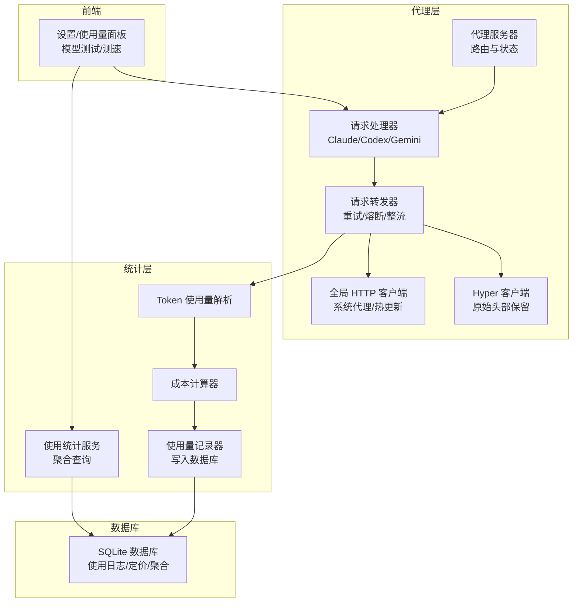
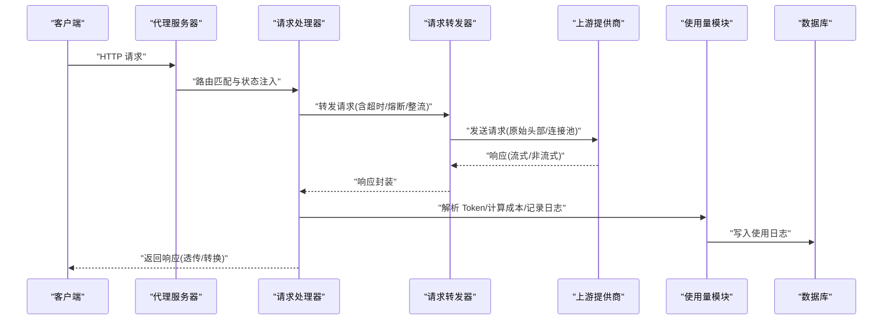
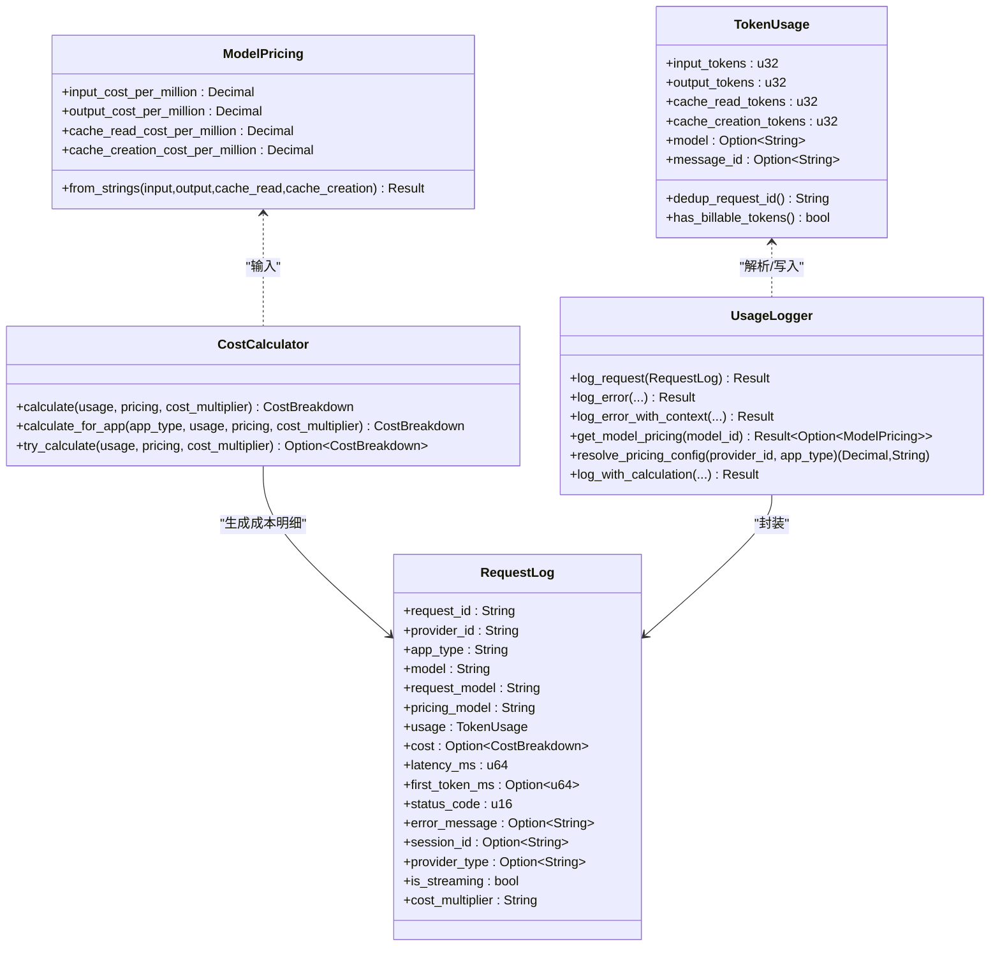
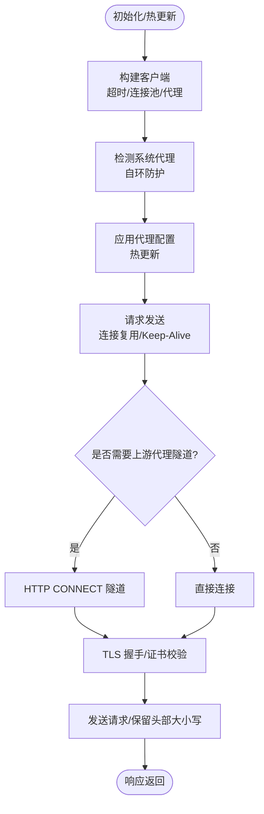
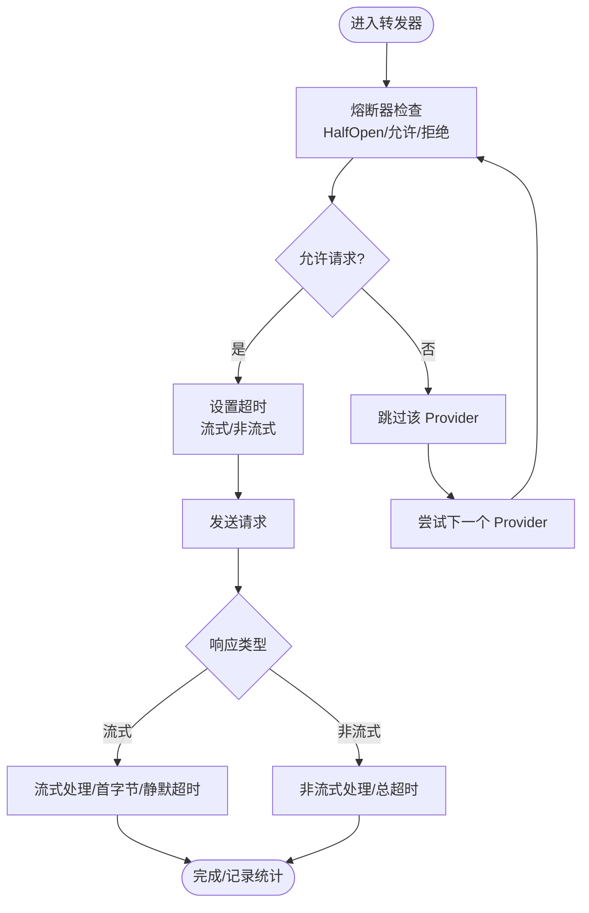
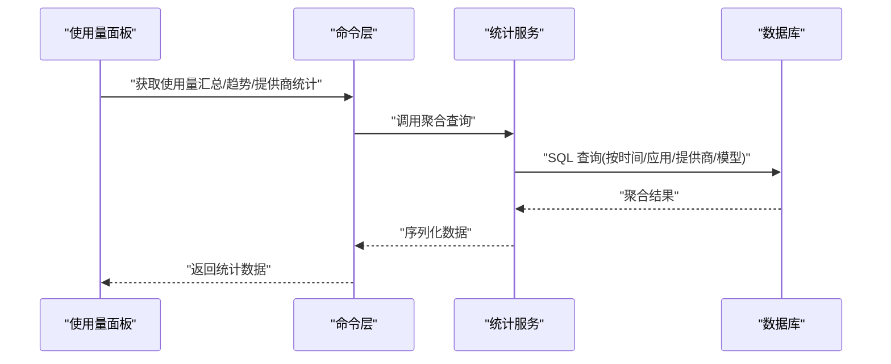
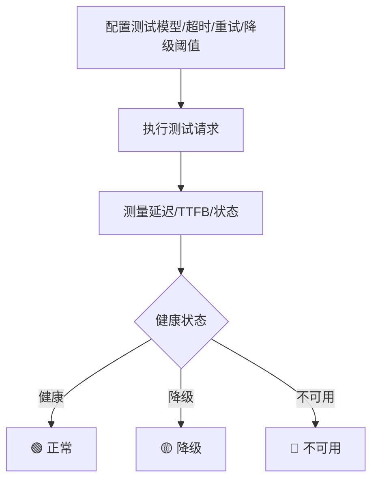
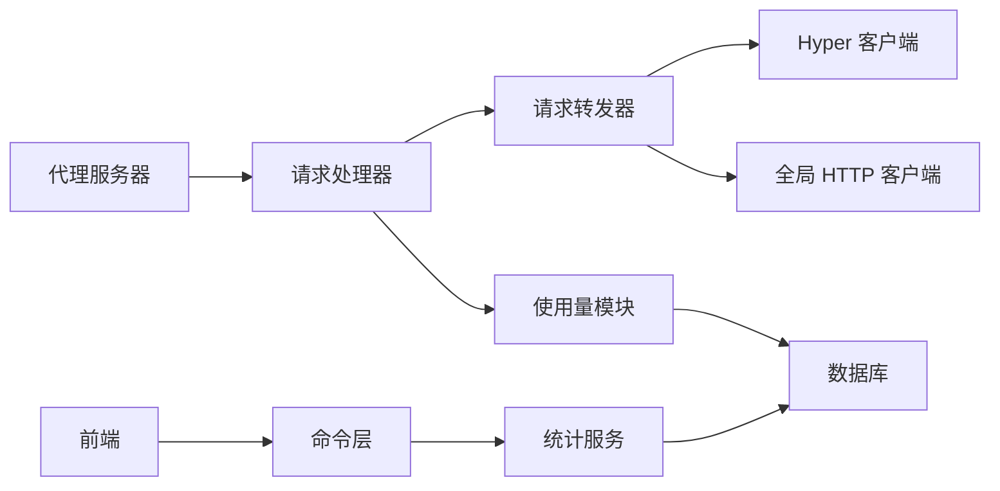

# 性能监控与优化

<cite>
**本文档引用的文件**
- [src-tauri/src/proxy/usage/calculator.rs](file://src-tauri/src/proxy/usage/calculator.rs)
- [src-tauri/src/proxy/usage/logger.rs](file://src-tauri/src/proxy/usage/logger.rs)
- [src-tauri/src/proxy/usage/parser.rs](file://src-tauri/src/proxy/usage/parser.rs)
- [src-tauri/src/proxy/http_client.rs](file://src-tauri/src/proxy/http_client.rs)
- [src-tauri/src/proxy/hyper_client.rs](file://src-tauri/src/proxy/hyper_client.rs)
- [src-tauri/src/proxy/server.rs](file://src-tauri/src/proxy/server.rs)
- [src-tauri/src/proxy/handlers.rs](file://src-tauri/src/proxy/handlers.rs)
- [src-tauri/src/proxy/forwarder.rs](file://src-tauri/src/proxy/forwarder.rs)
- [src-tauri/src/commands/usage.rs](file://src-tauri/src/commands/usage.rs)
- [src-tauri/src/services/usage_stats.rs](file://src-tauri/src/services/usage_stats.rs)
- [src-tauri/src/database/dao/proxy.rs](file://src-tauri/src/database/dao/proxy.rs)
- [src/types/proxy.ts](file://src/types/proxy.ts)
- [src/hooks/useGlobalProxy.ts](file://src/hooks/useGlobalProxy.ts)
- [docs/user-manual/zh/4-proxy/4.4-usage.md](file://docs/user-manual/zh/4-proxy/4.4-usage.md)
- [docs/user-manual/zh/4-proxy/4.5-model-test.md](file://docs/user-manual/zh/4-proxy/4.5-model-test.md)
- [src/i18n/locales/zh.json](file://src/i18n/locales/zh.json)
- [src/i18n/locales/en.json](file://src/i18n/locales/en.json)
- [src/i18n/locales/ja.json](file://src/i18n/locales/ja.json)
</cite>

## 目录
1. [简介](#简介)
2. [项目结构](#项目结构)
3. [核心组件](#核心组件)
4. [架构总览](#架构总览)
5. [详细组件分析](#详细组件分析)
6. [依赖关系分析](#依赖关系分析)
7. [性能考量](#性能考量)
8. [故障排查指南](#故障排查指南)
9. [结论](#结论)
10. [附录](#附录)

## 简介
本文件面向 CC Switch 的性能监控与优化系统，系统性阐述性能指标采集、监控数据记录与分析报告生成机制，涵盖 HTTP 客户端优化、连接池与超时配置、统计收集与成本计算、性能基准测试、瓶颈识别与资源监控、以及与代理服务的集成方式（实时监控与历史数据分析）。文档基于仓库现有实现进行技术解读，并提供可操作的配置建议与排障指引。

## 项目结构
CC Switch 的性能监控与优化能力主要分布在以下层次：
- 代理层：负责请求转发、超时与熔断、头部保留、媒体降级与整流、流式/非流式处理。
- 使用量统计层：负责解析 Token 使用量、成本计算、日志记录与聚合查询。
- 前端与命令层：负责 UI 展示、统计数据查询与导出、模型健康检查与测速。
- 数据库层：负责持久化使用日志、定价配置与统计聚合。

**图表来源**
- [src-tauri/src/proxy/server.rs:94-360](file://src-tauri/src/proxy/server.rs#L94-L360)
- [src-tauri/src/proxy/handlers.rs:149-247](file://src-tauri/src/proxy/handlers.rs#L149-L247)
- [src-tauri/src/proxy/forwarder.rs:325-353](file://src-tauri/src/proxy/forwarder.rs#L325-L353)
- [src-tauri/src/proxy/hyper_client.rs:229-295](file://src-tauri/src/proxy/hyper_client.rs#L229-L295)
- [src-tauri/src/proxy/http_client.rs:53-183](file://src-tauri/src/proxy/http_client.rs#L53-L183)
- [src-tauri/src/proxy/usage/parser.rs:1-1148](file://src-tauri/src/proxy/usage/parser.rs#L1-L1148)
- [src-tauri/src/proxy/usage/calculator.rs:1-271](file://src-tauri/src/proxy/usage/calculator.rs#L1-L271)
- [src-tauri/src/proxy/usage/logger.rs:1-455](file://src-tauri/src/proxy/usage/logger.rs#L1-L455)
- [src-tauri/src/services/usage_stats.rs:1-41](file://src-tauri/src/services/usage_stats.rs#L1-L41)

**章节来源**
- [src-tauri/src/proxy/server.rs:94-360](file://src-tauri/src/proxy/server.rs#L94-L360)
- [src-tauri/src/proxy/handlers.rs:149-247](file://src-tauri/src/proxy/handlers.rs#L149-L247)
- [src-tauri/src/proxy/forwarder.rs:325-353](file://src-tauri/src/proxy/forwarder.rs#L325-L353)
- [src-tauri/src/proxy/hyper_client.rs:229-295](file://src-tauri/src/proxy/hyper_client.rs#L229-L295)
- [src-tauri/src/proxy/http_client.rs:53-183](file://src-tauri/src/proxy/http_client.rs#L53-L183)
- [src-tauri/src/proxy/usage/parser.rs:1-1148](file://src-tauri/src/proxy/usage/parser.rs#L1-L1148)
- [src-tauri/src/proxy/usage/calculator.rs:1-271](file://src-tauri/src/proxy/usage/calculator.rs#L1-L271)
- [src-tauri/src/proxy/usage/logger.rs:1-455](file://src-tauri/src/proxy/usage/logger.rs#L1-L455)
- [src-tauri/src/services/usage_stats.rs:1-41](file://src-tauri/src/services/usage_stats.rs#L1-L41)

## 核心组件
- 代理服务器与状态管理：提供监听、路由、健康检查、状态统计与运行时配置热更新。
- 请求处理器：按应用类型（Claude/Codex/Gemini/OpenRouter）进行格式转换、流式/非流式处理与使用量收集。
- 请求转发器：负责故障转移、熔断器、整流（思维签名/预算/媒体降级）、超时控制与连接计数。
- 使用量解析与成本计算：从响应中提取 Token 使用量，按模型定价与倍率计算成本。
- 使用量记录与统计：将使用日志写入数据库，并提供聚合查询接口。
- HTTP 客户端：全局 HTTP 客户端支持系统代理检测、热更新与连接池配置；Hyper 客户端支持原始头部保留与上游代理隧道。

**章节来源**
- [src-tauri/src/proxy/server.rs:32-395](file://src-tauri/src/proxy/server.rs#L32-L395)
- [src-tauri/src/proxy/handlers.rs:149-562](file://src-tauri/src/proxy/handlers.rs#L149-L562)
- [src-tauri/src/proxy/forwarder.rs:94-799](file://src-tauri/src/proxy/forwarder.rs#L94-L799)
- [src-tauri/src/proxy/usage/parser.rs:15-52](file://src-tauri/src/proxy/usage/parser.rs#L15-L52)
- [src-tauri/src/proxy/usage/calculator.rs:19-129](file://src-tauri/src/proxy/usage/calculator.rs#L19-L129)
- [src-tauri/src/proxy/usage/logger.rs:11-37](file://src-tauri/src/proxy/usage/logger.rs#L11-L37)
- [src-tauri/src/proxy/http_client.rs:13-183](file://src-tauri/src/proxy/http_client.rs#L13-L183)
- [src-tauri/src/proxy/hyper_client.rs:53-73](file://src-tauri/src/proxy/hyper_client.rs#L53-L73)

## 架构总览
代理服务采用“手动 accept 循环 + 头部大小写保留”的设计，确保与上游的请求/响应尽可能接近原生直连。请求在处理器中完成格式转换与使用量收集，转发器负责重试、熔断与整流，使用量模块负责成本计算与日志落库，前端通过命令层访问统计服务。

**图表来源**
- [src-tauri/src/proxy/server.rs:141-223](file://src-tauri/src/proxy/server.rs#L141-L223)
- [src-tauri/src/proxy/handlers.rs:149-247](file://src-tauri/src/proxy/handlers.rs#L149-L247)
- [src-tauri/src/proxy/forwarder.rs:365-522](file://src-tauri/src/proxy/forwarder.rs#L365-L522)
- [src-tauri/src/proxy/usage/logger.rs:305-362](file://src-tauri/src/proxy/usage/logger.rs#L305-L362)

## 详细组件分析

### 使用量统计与成本计算
- Token 使用量解析：支持 Claude、OpenRouter、Codex、Gemini 等多种响应格式，具备流式/非流式解析与去重能力。
- 成本计算：按模型定价与倍率计算输入/输出/缓存读取/缓存创建的成本，并进行高精度 Decimal 计算。
- 使用量记录：将请求日志写入数据库，包含计价模型、延迟、首字节时间、状态码、错误信息等。

**图表来源**
- [src-tauri/src/proxy/usage/parser.rs:15-52](file://src-tauri/src/proxy/usage/parser.rs#L15-L52)
- [src-tauri/src/proxy/usage/calculator.rs:19-129](file://src-tauri/src/proxy/usage/calculator.rs#L19-L129)
- [src-tauri/src/proxy/usage/logger.rs:11-37](file://src-tauri/src/proxy/usage/logger.rs#L11-L37)

**章节来源**
- [src-tauri/src/proxy/usage/parser.rs:64-514](file://src-tauri/src/proxy/usage/parser.rs#L64-L514)
- [src-tauri/src/proxy/usage/calculator.rs:31-129](file://src-tauri/src/proxy/usage/calculator.rs#L31-L129)
- [src-tauri/src/proxy/usage/logger.rs:49-362](file://src-tauri/src/proxy/usage/logger.rs#L49-L362)

### HTTP 客户端优化与连接池管理
- 全局 HTTP 客户端：支持系统代理检测、热更新、禁用自动解压、连接池空闲上限、TCP Keep-Alive 等配置。
- Hyper 客户端：支持原始头部大小写保留、HTTP CONNECT 隧道、标题大小写与原始大小写混合策略、TLS 根证书加载等。
- 代理自环防护：检测系统代理指向本机代理端口时自动跳过，避免递归。

**图表来源**
- [src-tauri/src/proxy/http_client.rs:53-263](file://src-tauri/src/proxy/http_client.rs#L53-L263)
- [src-tauri/src/proxy/hyper_client.rs:229-542](file://src-tauri/src/proxy/hyper_client.rs#L229-L542)

**章节来源**
- [src-tauri/src/proxy/http_client.rs:53-263](file://src-tauri/src/proxy/http_client.rs#L53-L263)
- [src-tauri/src/proxy/hyper_client.rs:229-542](file://src-tauri/src/proxy/hyper_client.rs#L229-L542)

### 超时配置与熔断策略
- 代理配置默认值：流式首字节超时、流式静默超时、非流式超时等。
- 应用级代理配置：支持每应用类型独立的超时与熔断阈值。
- 转发器超时：根据应用配置动态设置流式/非流式超时，结合熔断器与整流器进行重试与降级。

**图表来源**
- [src-tauri/src/proxy/types.rs:1-40](file://src-tauri/src/proxy/types.rs#L1-L40)
- [src-tauri/src/database/dao/proxy.rs:238-272](file://src-tauri/src/database/dao/proxy.rs#L238-L272)
- [src-tauri/src/proxy/forwarder.rs:365-522](file://src-tauri/src/proxy/forwarder.rs#L365-L522)

**章节来源**
- [src-tauri/src/proxy/types.rs:34-40](file://src-tauri/src/proxy/types.rs#L34-L40)
- [src-tauri/src/database/dao/proxy.rs:238-272](file://src-tauri/src/database/dao/proxy.rs#L238-L272)
- [src-tauri/src/proxy/forwarder.rs:365-522](file://src-tauri/src/proxy/forwarder.rs#L365-L522)

### 使用统计与报告生成
- 前端使用量页面：支持按应用类型、状态码、提供商、模型筛选，展示总请求数、真实总 Token、缓存命中率、估算费用、成功率等关键指标。
- 命令层接口：提供使用量汇总、按应用拆分汇总、每日趋势、提供商统计等查询接口。
- 统计服务：提供 SQL 聚合查询、成本回填、限额检查等功能。

**图表来源**
- [src-tauri/src/commands/usage.rs:10-57](file://src-tauri/src/commands/usage.rs#L10-L57)
- [src-tauri/src/services/usage_stats.rs:15-41](file://src-tauri/src/services/usage_stats.rs#L15-L41)

**章节来源**
- [src-tauri/src/commands/usage.rs:10-57](file://src-tauri/src/commands/usage.rs#L10-L57)
- [src-tauri/src/services/usage_stats.rs:1-41](file://src-tauri/src/services/usage_stats.rs#L1-L41)
- [docs/user-manual/zh/4-proxy/4.4-usage.md:44-93](file://docs/user-manual/zh/4-proxy/4.4-usage.md#L44-L93)

### 模型健康检查与性能基准测试
- Stream Check：对 Claude/Codex/Gemini/OpenCode/OpenClaw 等模型进行可用性与延迟测试，支持超时、重试与降级阈值配置。
- 端点测速：对供应商 API 端点进行延迟测试，辅助选择最优端点。

**图表来源**
- [docs/user-manual/zh/4-proxy/4.5-model-test.md:1-149](file://docs/user-manual/zh/4-proxy/4.5-model-test.md#L1-L149)

**章节来源**
- [docs/user-manual/zh/4-proxy/4.5-model-test.md:1-149](file://docs/user-manual/zh/4-proxy/4.5-model-test.md#L1-L149)

## 依赖关系分析
- 代理服务器依赖数据库与状态共享，处理器依赖转发器与使用量模块，转发器依赖适配器、熔断器与整流器，使用量模块依赖数据库与定价配置。
- 前端通过命令层访问统计服务，统计服务依赖数据库 DAO 与 SQL 查询。

**图表来源**
- [src-tauri/src/proxy/server.rs:32-51](file://src-tauri/src/proxy/server.rs#L32-L51)
- [src-tauri/src/proxy/handlers.rs:10-37](file://src-tauri/src/proxy/handlers.rs#L10-L37)
- [src-tauri/src/proxy/forwarder.rs:94-127](file://src-tauri/src/proxy/forwarder.rs#L94-L127)
- [src-tauri/src/proxy/usage/logger.rs:40-42](file://src-tauri/src/proxy/usage/logger.rs#L40-L42)
- [src-tauri/src/services/usage_stats.rs:5-13](file://src-tauri/src/services/usage_stats.rs#L5-L13)

**章节来源**
- [src-tauri/src/proxy/server.rs:32-51](file://src-tauri/src/proxy/server.rs#L32-L51)
- [src-tauri/src/proxy/handlers.rs:10-37](file://src-tauri/src/proxy/handlers.rs#L10-L37)
- [src-tauri/src/proxy/forwarder.rs:94-127](file://src-tauri/src/proxy/forwarder.rs#L94-L127)
- [src-tauri/src/proxy/usage/logger.rs:40-42](file://src-tauri/src/proxy/usage/logger.rs#L40-L42)
- [src-tauri/src/services/usage_stats.rs:5-13](file://src-tauri/src/services/usage_stats.rs#L5-L13)

## 性能考量
- 连接池与超时：合理设置连接池空闲上限与 Keep-Alive 时间，避免频繁握手；为流式与非流式分别设置超时，减少资源占用与阻塞。
- 头部大小写保留：在上游代理场景下保留原始头部大小写，避免因大小写差异导致的兼容性问题。
- 整流与降级：对媒体输入、思维签名与预算进行预防式与反应式整流，降低上游错误率与重试成本。
- 成本计算精度：使用高精度 Decimal 避免浮点误差，确保长期累计的准确性。
- 统计落库与查询：使用 INSERT OR REPLACE 与聚合查询，结合前端防抖通知，平衡实时性与性能。

[本节为通用指导，无需具体文件引用]

## 故障排查指南
- 代理自环问题：若系统代理指向本机代理端口，客户端会自动跳过系统代理，避免递归。可通过日志确认。
- 代理连接测试：前端提供“测试代理连接”功能，显示延迟与错误信息。
- 代理状态查询：通过健康检查与状态接口查看运行状态、活跃连接数、成功率与最后错误。
- 使用量缺失：若上游响应缺少 usage 字段，解析器会跳过记录；可通过 CLI 会话日志补充精确统计。
- 超时与熔断：根据应用类型与网络状况调整流式/非流式超时与熔断阈值；关注 UI 中的失败计数与最后错误。

**章节来源**
- [src-tauri/src/proxy/http_client.rs:265-315](file://src-tauri/src/proxy/http_client.rs#L265-L315)
- [src/hooks/useGlobalProxy.ts:58-109](file://src/hooks/useGlobalProxy.ts#L58-L109)
- [src-tauri/src/proxy/handlers.rs:50-64](file://src-tauri/src/proxy/handlers.rs#L50-L64)
- [src-tauri/src/proxy/usage/parser.rs:321-338](file://src-tauri/src/proxy/usage/parser.rs#L321-L338)

## 结论
CC Switch 的性能监控与优化体系通过代理层的精细化控制、使用量模块的高精度统计与成本计算、以及前端的可视化与健康检查，实现了从实时监控到历史分析的完整闭环。通过合理的超时与熔断策略、连接池与头部保留优化、以及整流与降级机制，系统在稳定性与性能之间取得了良好平衡。建议在生产环境中结合实际网络与模型特性，持续调优超时与熔断参数，并定期进行健康检查与成本审计。

[本节为总结性内容，无需具体文件引用]

## 附录

### 监控配置示例与调优参数
- 代理监听与日志
  - 监听地址与端口：建议使用高位端口，避免权限问题。
  - 日志记录：开启以支持问题定位与审计。
- 超时配置（秒）
  - 流式首字节超时：1-120 秒，默认 60 秒。
  - 流式静默超时：60-600 秒，默认 120 秒；填 0 可禁用（防止中途卡住）。
  - 非流式超时：60-1200 秒，默认 600 秒（10 分钟）。
- 重试次数：0-10 次，默认 3 次。
- 成本倍率：按供应商需求设置，影响最终总价。

**章节来源**
- [src-tauri/src/proxy/types.rs:34-40](file://src-tauri/src/proxy/types.rs#L34-L40)
- [src/i18n/locales/zh.json:2376-2476](file://src/i18n/locales/zh.json#L2376-L2476)
- [src/i18n/locales/en.json:2471-2476](file://src/i18n/locales/en.json#L2471-L2476)
- [src/i18n/locales/ja.json:2469-2476](file://src/i18n/locales/ja.json#L2469-L2476)

### 性能基准测试与模型检查
- Stream Check：对 Claude/Codex/Gemini/OpenCode/OpenClaw 进行可用性与延迟测试，支持超时、重试与降级阈值配置。
- 端点测速：对供应商 API 端点进行延迟测试，辅助选择最优端点。

**章节来源**
- [docs/user-manual/zh/4-proxy/4.5-model-test.md:1-149](file://docs/user-manual/zh/4-proxy/4.5-model-test.md#L1-L149)