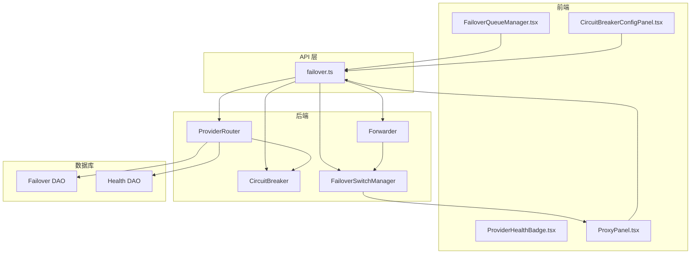
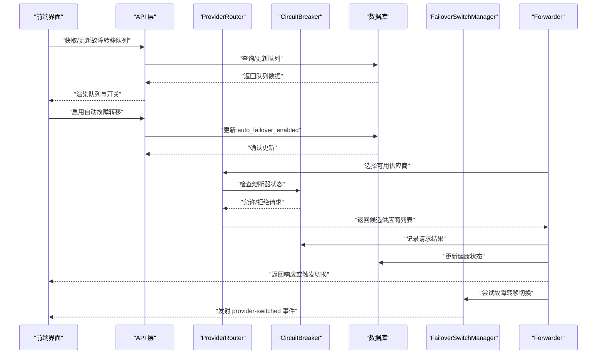
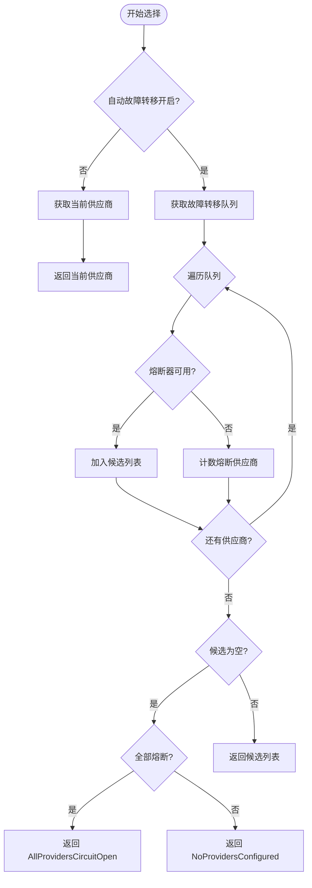
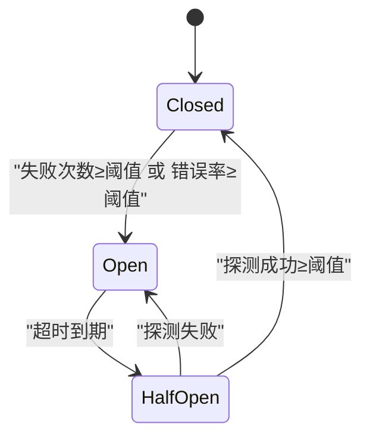
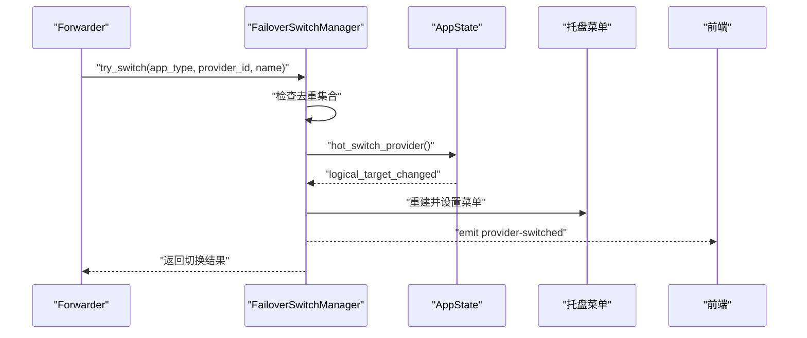
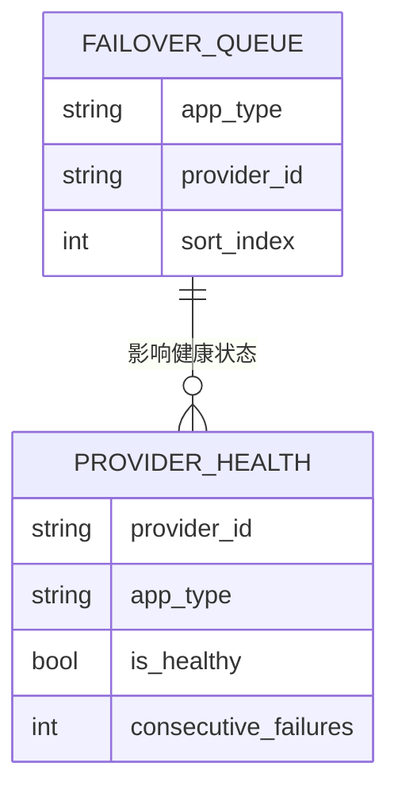
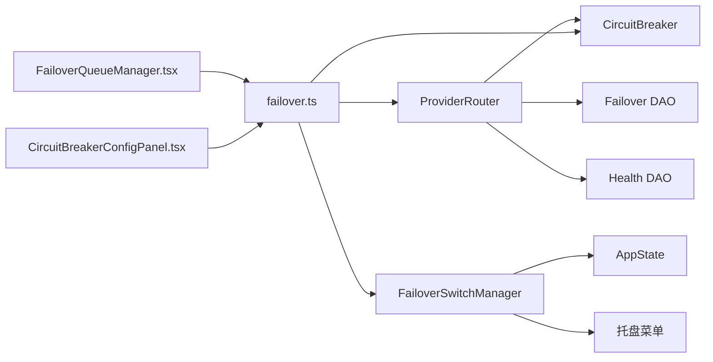

# 故障转移系统

<cite>
**本文档引用的文件**
- [failover_switch.rs](file://src-tauri/src/proxy/failover_switch.rs)
- [circuit_breaker.rs](file://src-tauri/src/proxy/circuit_breaker.rs)
- [failover.rs](file://src-tauri/src/database/dao/failover.rs)
- [proxy.rs](file://src-tauri/src/database/dao/proxy.rs)
- [provider_router.rs](file://src-tauri/src/proxy/provider_router.rs)
- [forwarder.rs](file://src-tauri/src/proxy/forwarder.rs)
- [failover.tsx](file://src/components/proxy/FailoverQueueManager.tsx)
- [CircuitBreakerConfigPanel.tsx](file://src/components/proxy/CircuitBreakerConfigPanel.tsx)
- [ProviderHealthBadge.tsx](file://src/components/providers/ProviderHealthBadge.tsx)
- [ProxyPanel.tsx](file://src/components/proxy/ProxyPanel.tsx)
- [failover.ts](file://src/lib/api/failover.ts)
- [proxy.ts](file://src/types/proxy.ts)
- [failover.md](file://docs/user-manual/en/4-proxy/4.3-failover.md)
</cite>

## 目录
1. [简介](#简介)
2. [项目结构](#项目结构)
3. [核心组件](#核心组件)
4. [架构总览](#架构总览)
5. [详细组件分析](#详细组件分析)
6. [依赖关系分析](#依赖关系分析)
7. [性能考虑](#性能考虑)
8. [故障排查指南](#故障排查指南)
9. [结论](#结论)
10. [附录](#附录)

## 简介
本文件面向 CC Switch 的故障转移系统，提供从底层 Rust 实现到前端交互的全栈技术文档。重点覆盖：
- 故障检测机制与健康检查策略
- 自动切换算法与去重控制
- 电路断路器模式的实现、熔断条件与恢复机制
- 故障转移队列管理、优先级排序与权重分配
- 配置项、延迟设置与重试机制
- 故障场景模拟、切换日志分析与性能监控指标
- 故障转移与健康检查的协调机制、状态同步与一致性保证

## 项目结构
故障转移系统由前端 UI 组件、API 层、Rust 后端服务、数据库访问层以及日志与监控组成。整体采用分层设计：
- 前端层：提供故障转移队列管理、熔断器配置面板、健康状态展示
- API 层：封装 Tauri 命令调用，桥接前端与后端
- 后端层：实现路由选择、熔断器状态机、故障转移切换、健康状态持久化
- 数据库层：维护故障转移队列、供应商健康状态、代理配置

**图表来源**
- [FailoverQueueManager.tsx:1-312](file://src/components/proxy/FailoverQueueManager.tsx#L1-L312)
- [CircuitBreakerConfigPanel.tsx:1-357](file://src/components/proxy/CircuitBreakerConfigPanel.tsx#L1-L357)
- [ProviderHealthBadge.tsx:1-58](file://src/components/providers/ProviderHealthBadge.tsx#L1-L58)
- [ProxyPanel.tsx:686-739](file://src/components/proxy/ProxyPanel.tsx#L686-L739)
- [failover.ts:1-100](file://src/lib/api/failover.ts#L1-L100)
- [provider_router.rs:1-524](file://src-tauri/src/proxy/provider_router.rs#L1-L524)
- [circuit_breaker.rs:1-496](file://src-tauri/src/proxy/circuit_breaker.rs#L1-L496)
- [failover_switch.rs:1-136](file://src-tauri/src/proxy/failover_switch.rs#L1-L136)
- [forwarder.rs:590-616](file://src-tauri/src/proxy/forwarder.rs#L590-L616)
- [failover.rs:1-150](file://src-tauri/src/database/dao/failover.rs#L1-L150)
- [proxy.rs:529-673](file://src-tauri/src/database/dao/proxy.rs#L529-L673)

**章节来源**
- [failover.md:1-233](file://docs/user-manual/en/4-proxy/4.3-failover.md#L1-L233)

## 核心组件
- ProviderRouter：负责根据自动故障转移开关与故障转移队列选择可用供应商，结合熔断器状态进行候选筛选。
- CircuitBreaker：实现三态熔断器状态机，支持失败阈值、错误率阈值、恢复等待时间、半开探测等。
- FailoverSwitchManager：处理故障转移成功后的切换逻辑，包含去重控制、托盘菜单更新与前端事件发射。
- Failover DAO：维护故障转移队列，提供增删改查与排序功能。
- Health DAO：维护供应商健康状态，支持按阈值更新与清空。
- 前端组件：FailoverQueueManager、CircuitBreakerConfigPanel、ProviderHealthBadge、ProxyPanel。

**章节来源**
- [provider_router.rs:1-524](file://src-tauri/src/proxy/provider_router.rs#L1-L524)
- [circuit_breaker.rs:1-496](file://src-tauri/src/proxy/circuit_breaker.rs#L1-L496)
- [failover_switch.rs:1-136](file://src-tauri/src/proxy/failover_switch.rs#L1-L136)
- [failover.rs:1-150](file://src-tauri/src/database/dao/failover.rs#L1-L150)
- [proxy.rs:529-673](file://src-tauri/src/database/dao/proxy.rs#L529-L673)
- [failover.tsx:1-312](file://src/components/proxy/FailoverQueueManager.tsx#L1-L312)
- [CircuitBreakerConfigPanel.tsx:1-357](file://src/components/proxy/CircuitBreakerConfigPanel.tsx#L1-L357)
- [ProviderHealthBadge.tsx:1-58](file://src/components/providers/ProviderHealthBadge.tsx#L1-L58)
- [ProxyPanel.tsx:686-739](file://src/components/proxy/ProxyPanel.tsx#L686-L739)

## 架构总览
故障转移系统的关键流程如下：
- 前端通过 API 层调用后端命令，实现故障转移队列管理与熔断器配置。
- ProviderRouter 在每次请求前选择候选供应商，优先使用故障转移队列顺序，结合熔断器状态进行过滤。
- Forwarder 在请求失败时触发故障转移，FailoverSwitchManager 去重并执行切换，更新托盘菜单与前端事件。
- Health DAO 与 CircuitBreaker 协同维护供应商健康状态与熔断器状态，支持阈值驱动的自动切换。

**图表来源**
- [failover.ts:1-100](file://src/lib/api/failover.ts#L1-L100)
- [provider_router.rs:32-162](file://src-tauri/src/proxy/provider_router.rs#L32-L162)
- [circuit_breaker.rs:105-288](file://src-tauri/src/proxy/circuit_breaker.rs#L105-L288)
- [failover_switch.rs:33-134](file://src-tauri/src/proxy/failover_switch.rs#L33-L134)
- [forwarder.rs:590-616](file://src-tauri/src/proxy/forwarder.rs#L590-L616)
- [failover.rs:22-114](file://src-tauri/src/database/dao/failover.rs#L22-L114)
- [proxy.rs:549-646](file://src-tauri/src/database/dao/proxy.rs#L549-L646)

## 详细组件分析

### ProviderRouter：故障转移与熔断器集成
- 选择策略：当自动故障转移开启时，严格按故障转移队列顺序返回候选供应商；关闭时仅返回当前供应商。
- 熔断器集成：对每个供应商按 app_type:provider_id 维护独立的 CircuitBreaker 实例，使用 is_available() 过滤不可用供应商。
- 结果记录：record_result() 同步更新熔断器状态与健康状态，使用配置的 failure_threshold。

**图表来源**
- [provider_router.rs:32-109](file://src-tauri/src/proxy/provider_router.rs#L32-L109)

**章节来源**
- [provider_router.rs:32-162](file://src-tauri/src/proxy/provider_router.rs#L32-L162)

### CircuitBreaker：三态熔断器状态机
- 状态：Closed、Open、HalfOpen，支持热更新配置。
- 触发条件：
  - 连续失败次数 ≥ failure_threshold（Closed → Open）
  - 错误率 ≥ error_rate_threshold 且请求数 ≥ min_requests（Closed → Open）
  - Open 超时后自动进入 HalfOpen（Open → HalfOpen）
- 恢复机制：
  - HalfOpen 成功次数 ≥ success_threshold → Closed
  - HalfOpen 失败 → Open
- 半开探测：限制半开状态的探测请求数，避免频繁探测导致雪崩。

**图表来源**
- [circuit_breaker.rs:133-288](file://src-tauri/src/proxy/circuit_breaker.rs#L133-L288)

**章节来源**
- [circuit_breaker.rs:105-388](file://src-tauri/src/proxy/circuit_breaker.rs#L105-L388)

### FailoverSwitchManager：切换去重与事件发射
- 去重控制：使用 app_type:provider_id 作为键，避免并发切换重复执行。
- 切换执行：校验应用代理接管状态，调用热切换接口，更新托盘菜单。
- 事件发射：向前端发射 provider-switched 事件，携带 appType、providerId 与来源标识。

**图表来源**
- [failover_switch.rs:33-134](file://src-tauri/src/proxy/failover_switch.rs#L33-L134)

**章节来源**
- [failover_switch.rs:18-134](file://src-tauri/src/proxy/failover_switch.rs#L18-L134)

### 故障转移队列管理：优先级与权重
- 优先级排序：队列按 sort_index 升序排列，sort_index 越小优先级越高。
- 权重分配：队列顺序即权重，系统按顺序依次尝试，形成天然的权重梯度。
- 动态调整：前端拖拽调整顺序，数据库按 sort_index 更新；移除队列项会清除对应健康状态。

**图表来源**
- [failover.rs:22-114](file://src-tauri/src/database/dao/failover.rs#L22-L114)
- [proxy.rs:529-646](file://src-tauri/src/database/dao/proxy.rs#L529-L646)

**章节来源**
- [failover.rs:22-114](file://src-tauri/src/database/dao/failover.rs#L22-L114)
- [failover.tsx:166-250](file://src/components/proxy/FailoverQueueManager.tsx#L166-L250)

### 健康检查与状态展示
- 健康状态：ProviderHealth 包含连续失败次数、最近成功/失败时间、错误信息等。
- 前端徽章：根据连续失败次数与熔断器状态显示健康状态（健康/警告/熔断）。
- 队列展示：在代理面板中展示队列项的优先级与健康状态。

**章节来源**
- [proxy.ts:54-108](file://src/types/proxy.ts#L54-L108)
- [ProviderHealthBadge.tsx:15-58](file://src/components/providers/ProviderHealthBadge.tsx#L15-L58)
- [ProxyPanel.tsx:686-739](file://src/components/proxy/ProxyPanel.tsx#L686-L739)

## 依赖关系分析
- ProviderRouter 依赖 CircuitBreaker 与数据库 DAO，负责路由决策与状态更新。
- FailoverSwitchManager 依赖 AppState 与托盘菜单，负责切换执行与 UI 同步。
- 前端组件通过 API 层调用后端命令，实现配置与队列管理。
- 数据库层提供队列与健康状态的持久化能力。

**图表来源**
- [provider_router.rs:15-30](file://src-tauri/src/proxy/provider_router.rs#L15-L30)
- [circuit_breaker.rs:75-93](file://src-tauri/src/proxy/circuit_breaker.rs#L75-L93)
- [failover_switch.rs:18-31](file://src-tauri/src/proxy/failover_switch.rs#L18-L31)
- [failover.ts:23-99](file://src/lib/api/failover.ts#L23-L99)

**章节来源**
- [provider_router.rs:15-30](file://src-tauri/src/proxy/provider_router.rs#L15-L30)
- [circuit_breaker.rs:75-93](file://src-tauri/src/proxy/circuit_breaker.rs#L75-L93)
- [failover_switch.rs:18-31](file://src-tauri/src/proxy/failover_switch.rs#L18-L31)
- [failover.ts:23-99](file://src/lib/api/failover.ts#L23-L99)

## 性能考虑
- 熔断器半开探测限流：限制半开状态的探测请求数，避免对下游造成压力。
- 去重控制：FailoverSwitchManager 使用哈希集合避免并发切换重复执行，降低资源浪费。
- 队列排序：按 sort_index 排序减少不必要的尝试，提升平均响应速度。
- 热更新配置：CircuitBreaker 支持热更新，无需重启即可调整参数。

[本节为通用指导，无需特定文件引用]

## 故障排查指南
- 故障转移未触发
  - 检查代理服务是否运行、应用接管是否启用、自动故障转移是否开启、队列是否存在备份供应商。
- 故障转移过于频繁
  - 检查主供应商稳定性、网络状况与配置参数；适当提高失败阈值与恢复等待时间。
- 全部供应商熔断
  - 等待恢复等待时间到期自动恢复，或手动重置熔断器状态。
- 切换日志分析
  - 查看使用统计中的请求日志，定位切换时间、原供应商、新供应商与失败原因。

**章节来源**
- [failover.md:170-233](file://docs/user-manual/en/4-proxy/4.3-failover.md#L170-L233)

## 结论
CC Switch 的故障转移系统通过 ProviderRouter 的队列化选择、CircuitBreaker 的智能熔断与 FailoverSwitchManager 的去重切换，实现了高可用与低干扰的故障恢复。前端提供直观的队列管理与熔断器配置面板，配合数据库的健康状态持久化，形成完整的闭环。建议在生产环境中合理配置失败阈值、错误率阈值与恢复等待时间，并持续监控切换频率与健康状态，以获得最佳的稳定性与性能平衡。

[本节为总结性内容，无需特定文件引用]

## 附录

### 配置选项与推荐实践
- 熔断器配置（应用独立）
  - 失败阈值：1-20，默认 4（Claude 为 8）
  - 成功阈值：1-10，默认 2（Claude 为 3）
  - 恢复等待时间：0-300 秒，默认 60（Claude 为 90）
  - 错误率阈值：0-100%，默认 60%（Claude 为 70%）
  - 最小请求数：5-100，默认 10（Claude 为 15）
- 超时配置（应用独立）
  - 流式首字节超时：1-120 秒，默认 60（Claude 为 90）
  - 流式空闲超时：60-600 秒（0 表示禁用），默认 120（Claude 为 180）
  - 非流式超时：60-1200 秒，默认 600（Claude 为 600）
- 重试配置（应用独立）
  - 最大重试次数：0-10，默认 3（Gemini 为 5，Claude 为 6）

**章节来源**
- [CircuitBreakerConfigPanel.tsx:172-285](file://src/components/proxy/CircuitBreakerConfigPanel.tsx#L172-L285)
- [failover.md:101-134](file://docs/user-manual/en/4-proxy/4.3-failover.md#L101-L134)