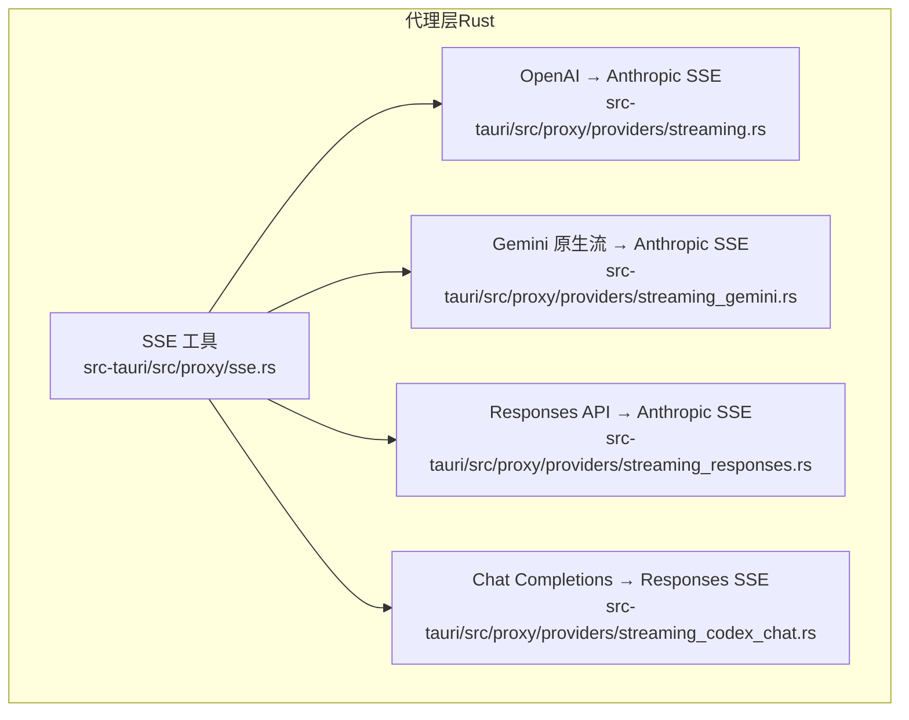
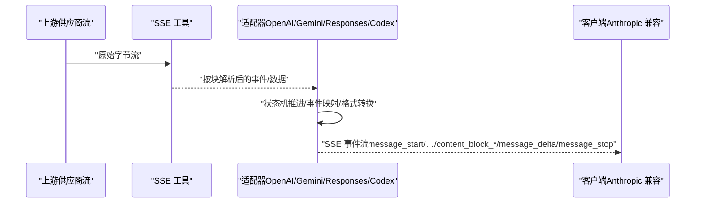
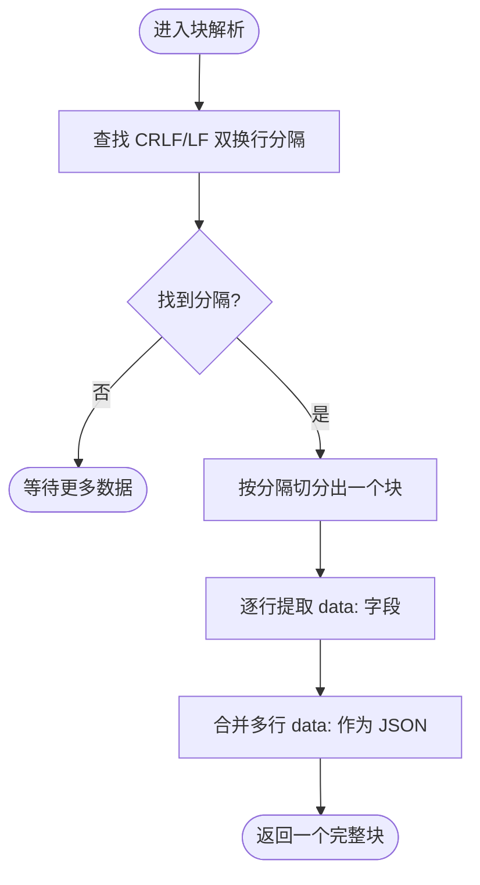
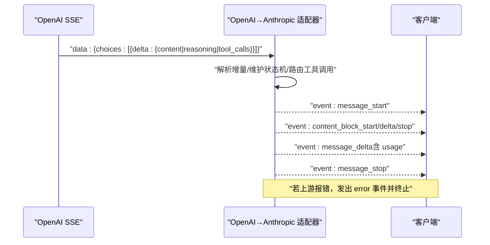
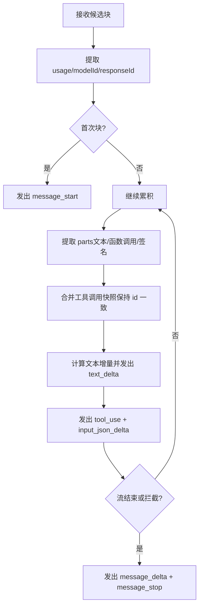
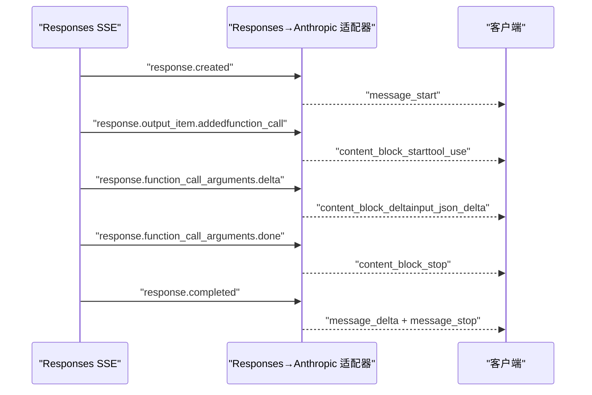
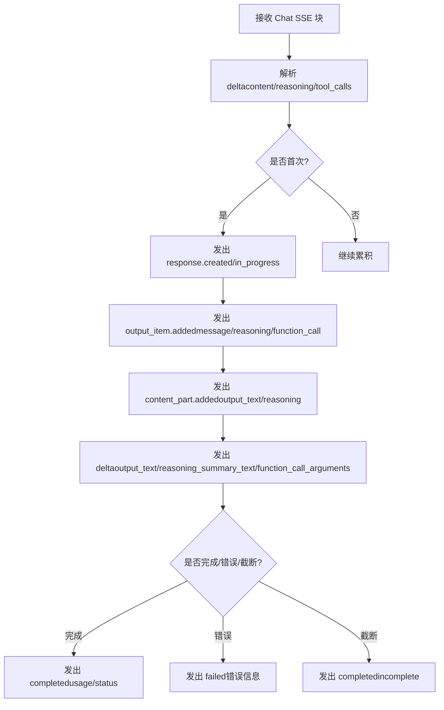
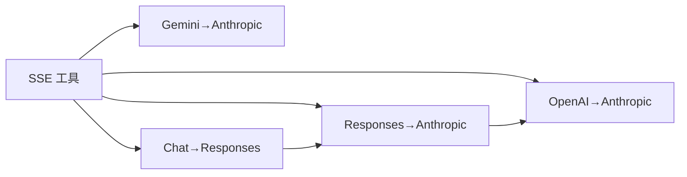

# 流式处理与 SSE

<cite>
**本文引用的文件**
- [src-tauri/src/proxy/sse.rs](file://src-tauri/src/proxy/sse.rs)
- [src-tauri/src/proxy/providers/streaming.rs](file://src-tauri/src/proxy/providers/streaming.rs)
- [src-tauri/src/proxy/providers/streaming_codex_chat.rs](file://src-tauri/src/proxy/providers/streaming_codex_chat.rs)
- [src-tauri/src/proxy/providers/streaming_gemini.rs](file://src-tauri/src/proxy/providers/streaming_gemini.rs)
- [src-tauri/src/proxy/providers/streaming_responses.rs](file://src-tauri/src/proxy/providers/streaming_responses.rs)
</cite>

## 目录
1. [简介](#简介)
2. [项目结构](#项目结构)
3. [核心组件](#核心组件)
4. [架构总览](#架构总览)
5. [详细组件分析](#详细组件分析)
6. [依赖关系分析](#依赖关系分析)
7. [性能考量](#性能考量)
8. [故障排查指南](#故障排查指南)
9. [结论](#结论)
10. [附录](#附录)

## 简介
本文件面向 CC Switch 的流式处理与 Server-Sent Events（SSE）系统，系统性阐述以下主题：
- 流式响应处理机制、数据块分割与实时传输策略
- SSE 连接管理、事件格式解析与客户端推送机制
- 流式数据缓冲、背压处理与内存管理策略
- 多家 AI 供应商（OpenAI、Gemini、Codex/Responses）的流式适配、格式转换与错误处理
- 实际流式请求示例、性能监控指标与调试工具
- 流式处理与传统请求响应的区别、优化策略与最佳实践

## 项目结构
CC Switch 在后端 Rust 模块中集中实现流式转换与 SSE 输出，核心位于 src-tauri/src/proxy/providers 下，围绕 SSE 辅助工具与多供应商流式适配模块构建。

图表来源
- [src-tauri/src/proxy/sse.rs:1-346](file://src-tauri/src/proxy/sse.rs#L1-L346)
- [src-tauri/src/proxy/providers/streaming.rs:1-1235](file://src-tauri/src/proxy/providers/streaming.rs#L1-L1235)
- [src-tauri/src/proxy/providers/streaming_gemini.rs:1-1055](file://src-tauri/src/proxy/providers/streaming_gemini.rs#L1-L1055)
- [src-tauri/src/proxy/providers/streaming_responses.rs:1-1186](file://src-tauri/src/proxy/providers/streaming_responses.rs#L1-L1186)
- [src-tauri/src/proxy/providers/streaming_codex_chat.rs:1-1322](file://src-tauri/src/proxy/providers/streaming_codex_chat.rs#L1-L1322)

章节来源
- [src-tauri/src/proxy/sse.rs:1-346](file://src-tauri/src/proxy/sse.rs#L1-L346)
- [src-tauri/src/proxy/providers/streaming.rs:1-1235](file://src-tauri/src/proxy/providers/streaming.rs#L1-L1235)
- [src-tauri/src/proxy/providers/streaming_gemini.rs:1-1055](file://src-tauri/src/proxy/providers/streaming_gemini.rs#L1-L1055)
- [src-tauri/src/proxy/providers/streaming_responses.rs:1-1186](file://src-tauri/src/proxy/providers/streaming_responses.rs#L1-L1186)
- [src-tauri/src/proxy/providers/streaming_codex_chat.rs:1-1322](file://src-tauri/src/proxy/providers/streaming_codex_chat.rs#L1-L1322)

## 核心组件
- SSE 工具集：提供字段剥离、块级分隔与 UTF-8 安全拼接能力，是所有流式转换的基础。
- OpenAI 流式到 Anthropic SSE：将 OpenAI 风格的增量块转换为 Anthropic 兼容的命名事件序列。
- Gemini 原生流到 Anthropic SSE：将 Gemini 的 alt=sse 响应转换为 Anthropic 风格事件。
- Responses API 到 Anthropic SSE：将 Responses API 的命名事件生命周期转换为 Anthropic 风格事件。
- Chat Completions 到 Responses SSE：将 Chat Completions 的增量块转换为 Responses API 的命名事件流，便于进一步转换为 Anthropic。

章节来源
- [src-tauri/src/proxy/sse.rs:1-86](file://src-tauri/src/proxy/sse.rs#L1-L86)
- [src-tauri/src/proxy/providers/streaming.rs:147-670](file://src-tauri/src/proxy/providers/streaming.rs#L147-L670)
- [src-tauri/src/proxy/providers/streaming_gemini.rs:237-574](file://src-tauri/src/proxy/providers/streaming_gemini.rs#L237-L574)
- [src-tauri/src/proxy/providers/streaming_responses.rs:102-792](file://src-tauri/src/proxy/providers/streaming_responses.rs#L102-L792)
- [src-tauri/src/proxy/providers/streaming_codex_chat.rs:903-998](file://src-tauri/src/proxy/providers/streaming_codex_chat.rs#L903-L998)

## 架构总览
整体架构以“SSE 工具”为核心，各供应商适配器通过统一的块级解析与事件生成策略，输出符合 Anthropic 客户端期望的 SSE 事件序列。同时，提供 Responses API 的中间态转换，增强对复杂工具调用与推理内容的建模。

图表来源
- [src-tauri/src/proxy/sse.rs:1-86](file://src-tauri/src/proxy/sse.rs#L1-L86)
- [src-tauri/src/proxy/providers/streaming.rs:147-670](file://src-tauri/src/proxy/providers/streaming.rs#L147-L670)
- [src-tauri/src/proxy/providers/streaming_gemini.rs:237-574](file://src-tauri/src/proxy/providers/streaming_gemini.rs#L237-L574)
- [src-tauri/src/proxy/providers/streaming_responses.rs:102-792](file://src-tauri/src/proxy/providers/streaming_responses.rs#L102-L792)
- [src-tauri/src/proxy/providers/streaming_codex_chat.rs:903-998](file://src-tauri/src/proxy/providers/streaming_codex_chat.rs#L903-L998)

## 详细组件分析

### SSE 工具与数据块解析
- 字段剥离：支持冒号后可选空格的字段匹配，兼容多种 SSE 写法。
- 块级分隔：优先识别 CRLF 双换行，其次 LF 双换行，确保跨平台兼容。
- UTF-8 安全拼接：在分片边界处正确处理多字节字符，避免 U+FFFD 替代符污染输出。

图表来源
- [src-tauri/src/proxy/sse.rs:8-23](file://src-tauri/src/proxy/sse.rs#L8-L23)

章节来源
- [src-tauri/src/proxy/sse.rs:1-86](file://src-tauri/src/proxy/sse.rs#L1-L86)

### OpenAI → Anthropic SSE 适配器
- 输入：OpenAI 风格的增量块（choices[].delta），可能包含 content、reasoning、tool_calls。
- 状态机：维护 message_start/message_delta/message_stop 与 content_block_* 事件序列，严格控制事件顺序与去重。
- 工具调用：按索引路由，延迟启动直到 id 与 name 就绪；处理参数增量与“无限空白”异常。
- 用量计算：将上游 usage 转换为 Anthropic 风格输入 token（扣除缓存项），并在 [DONE] 或流末尾统一发出 message_delta。
- 错误处理：上游错误直接映射为 error 事件并中断。

图表来源
- [src-tauri/src/proxy/providers/streaming.rs:147-670](file://src-tauri/src/proxy/providers/streaming.rs#L147-L670)

章节来源
- [src-tauri/src/proxy/providers/streaming.rs:1-1235](file://src-tauri/src/proxy/providers/streaming.rs#L1-L1235)

### Gemini 原生流 → Anthropic SSE 适配器
- 输入：Gemini streamGenerateContent?alt=sse 的候选块，包含 parts（文本/函数调用/签名）。
- 累积快照合并：对同一工具调用的多块累积快照进行稳定合并，保持 id 一致性与签名保留。
- 文本增量：基于可见文本的累积差分，避免碎片化文本块。
- 工具调用：统一转换为 tool_use，参数增量以 input_json_delta 推送。
- 终止原因映射：综合 finishReason、安全拦截与工具使用情况，映射为 Anthropic stop_reason。
- 阴影存储：记录助手回合内容与签名，用于后续回放与一致性校验。

图表来源
- [src-tauri/src/proxy/providers/streaming_gemini.rs:237-574](file://src-tauri/src/proxy/providers/streaming_gemini.rs#L237-L574)

章节来源
- [src-tauri/src/proxy/providers/streaming_gemini.rs:1-1055](file://src-tauri/src/proxy/providers/streaming_gemini.rs#L1-L1055)

### Responses API → Anthropic SSE 适配器
- 输入：Responses API 的命名事件流（response.created → ... → response.completed）。
- 生命周期映射：将 output_item.added/content_part.added → Anthropic 的 content_block_start；delta → content_block_delta；done → content_block_stop。
- 工具调用：function_call 类型映射为 tool_use，参数增量以 input_json_delta 推送，并对特定工具（如 Read）进行参数规范化。
- 推理内容：reasoning.delta 映射为 thinking 内容块，随后可衔接文本内容。
- 终止原因：根据 status、是否工具调用与 incomplete_reason 映射为 Anthropic stop_reason。

图表来源
- [src-tauri/src/proxy/providers/streaming_responses.rs:102-792](file://src-tauri/src/proxy/providers/streaming_responses.rs#L102-L792)

章节来源
- [src-tauri/src/proxy/providers/streaming_responses.rs:1-1186](file://src-tauri/src/proxy/providers/streaming_responses.rs#L1-L1186)

### Chat Completions → Responses SSE 适配器
- 输入：Chat Completions 的增量块（content/reasoning/tool_calls）。
- 输出：Responses API 的命名事件流（response.created → output_item.added → content_part.added → delta → done → completed）。
- 特殊处理：内联思考标记剥离、推理内容与工具调用的关联、自定义工具输入事件、参数规范化与签名保留。

图表来源
- [src-tauri/src/proxy/providers/streaming_codex_chat.rs:903-998](file://src-tauri/src/proxy/providers/streaming_codex_chat.rs#L903-L998)

章节来源
- [src-tauri/src/proxy/providers/streaming_codex_chat.rs:1-1322](file://src-tauri/src/proxy/providers/streaming_codex_chat.rs#L1-L1322)

## 依赖关系分析
- SSE 工具是所有适配器的共同依赖，提供块级解析与 UTF-8 安全拼接。
- OpenAI 与 Gemini 适配器均输出 Anthropic 风格事件，前者面向通用 OpenAI 流，后者面向 Gemini 原生流。
- Responses 适配器面向 Responses API 的命名事件生命周期，提供更强的工具与推理建模能力。
- Chat Completions 适配器提供 Responses API 的中间态，便于扩展与测试。

图表来源
- [src-tauri/src/proxy/sse.rs:1-86](file://src-tauri/src/proxy/sse.rs#L1-L86)
- [src-tauri/src/proxy/providers/streaming.rs:1-1235](file://src-tauri/src/proxy/providers/streaming.rs#L1-L1235)
- [src-tauri/src/proxy/providers/streaming_gemini.rs:1-1055](file://src-tauri/src/proxy/providers/streaming_gemini.rs#L1-L1055)
- [src-tauri/src/proxy/providers/streaming_responses.rs:1-1186](file://src-tauri/src/proxy/providers/streaming_responses.rs#L1-L1186)
- [src-tauri/src/proxy/providers/streaming_codex_chat.rs:1-1322](file://src-tauri/src/proxy/providers/streaming_codex_chat.rs#L1-L1322)

章节来源
- [src-tauri/src/proxy/sse.rs:1-86](file://src-tauri/src/proxy/sse.rs#L1-L86)
- [src-tauri/src/proxy/providers/streaming.rs:1-1235](file://src-tauri/src/proxy/providers/streaming.rs#L1-L1235)
- [src-tauri/src/proxy/providers/streaming_gemini.rs:1-1055](file://src-tauri/src/proxy/providers/streaming_gemini.rs#L1-L1055)
- [src-tauri/src/proxy/providers/streaming_responses.rs:1-1186](file://src-tauri/src/proxy/providers/streaming_responses.rs#L1-L1186)
- [src-tauri/src/proxy/providers/streaming_codex_chat.rs:1-1322](file://src-tauri/src/proxy/providers/streaming_codex_chat.rs#L1-L1322)

## 性能考量
- 流式缓冲与分块解析
  - 使用单个字符串缓冲与就地删除策略，减少分配次数；块级解析支持 CRLF/LF 双模式，降低解析成本。
  - UTF-8 安全拼接在分片边界处理多字节字符，避免额外拷贝与替换字符。
- 状态机与事件生成
  - 适配器内部采用紧凑的状态机，仅在必要时发出事件，避免冗余推送。
  - 对工具调用采用索引路由与延迟启动，减少无意义的 content_block_start。
- 背压与内存管理
  - 采用异步流式处理，逐块消费与产出，天然具备背压特性。
  - 使用哈希表与集合追踪打开的块索引，及时关闭以释放内存。
- 用量与令牌计算
  - 对上游 usage 进行缓存与延迟合并，确保 message_delta 时携带完整 usage，避免多次推送。

章节来源
- [src-tauri/src/proxy/sse.rs:1-86](file://src-tauri/src/proxy/sse.rs#L1-L86)
- [src-tauri/src/proxy/providers/streaming.rs:147-670](file://src-tauri/src/proxy/providers/streaming.rs#L147-L670)
- [src-tauri/src/proxy/providers/streaming_gemini.rs:237-574](file://src-tauri/src/proxy/providers/streaming_gemini.rs#L237-L574)
- [src-tauri/src/proxy/providers/streaming_responses.rs:102-792](file://src-tauri/src/proxy/providers/streaming_responses.rs#L102-L792)

## 故障排查指南
- 常见问题与定位
  - UTF-8 替代符（）出现：检查上游是否在分片边界切割多字节字符，确认使用 append_utf8_safe 正确拼接。
  - 工具调用参数缺失或乱序：确认工具调用的 id/name 是否延迟到达，适配器会等待就绪后再启动。
  - message_delta 重复：适配器已去重，确保仅在 [DONE] 或流末尾发出一次 message_delta。
  - Responses API 事件缺失：核对事件名称与数据结构，确保 data: 行存在且 JSON 可解析。
- 调试建议
  - 开启日志：适配器在关键节点记录调试信息，便于追踪事件序列与状态变化。
  - 单元测试：参考各适配器的测试用例，构造最小复现场景验证行为。
  - 分片模拟：对中文等多字节字符进行分片，验证 UTF-8 边界处理。

章节来源
- [src-tauri/src/proxy/providers/streaming.rs:703-1235](file://src-tauri/src/proxy/providers/streaming.rs#L703-L1235)
- [src-tauri/src/proxy/providers/streaming_gemini.rs:576-1055](file://src-tauri/src/proxy/providers/streaming_gemini.rs#L576-L1055)
- [src-tauri/src/proxy/providers/streaming_responses.rs:794-1186](file://src-tauri/src/proxy/providers/streaming_responses.rs#L794-L1186)
- [src-tauri/src/proxy/providers/streaming_codex_chat.rs:1029-1322](file://src-tauri/src/proxy/providers/streaming_codex_chat.rs#L1029-L1322)

## 结论
CC Switch 的流式处理与 SSE 系统通过统一的 SSE 工具与多供应商适配器，实现了从 OpenAI、Gemini、Responses API 到 Anthropic 风格事件的高保真转换。系统在事件顺序、工具调用路由、用量计算与 UTF-8 边界处理等方面具备稳健实现，并提供了完善的测试覆盖与调试手段。对于生产环境，建议结合日志与单元测试持续验证不同供应商的流式行为差异，确保稳定性与一致性。

## 附录
- 实际流式请求示例（路径）
  - OpenAI → Anthropic：[src-tauri/src/proxy/providers/streaming.rs:703-838](file://src-tauri/src/proxy/providers/streaming.rs#L703-L838)
  - Gemini → Anthropic：[src-tauri/src/proxy/providers/streaming_gemini.rs:576-754](file://src-tauri/src/proxy/providers/streaming_gemini.rs#L576-L754)
  - Responses → Anthropic：[src-tauri/src/proxy/providers/streaming_responses.rs:835-871](file://src-tauri/src/proxy/providers/streaming_responses.rs#L835-L871)
  - Chat → Responses：[src-tauri/src/proxy/providers/streaming_codex_chat.rs:1049-1104](file://src-tauri/src/proxy/providers/streaming_codex_chat.rs#L1049-L1104)
- 性能监控指标（建议）
  - 事件序列完整性（message_start/message_delta/message_stop 数量与顺序）
  - 工具调用参数增量长度与去重率
  - UTF-8 边界处理命中率与替代符数量
  - 流式耗时分布（首包时间、平均增量间隔、总时长）
- 最佳实践
  - 优先使用 Responses API 的命名事件生命周期，便于工具与推理建模。
  - 在客户端侧实现幂等消费与错误恢复，避免重复处理同一事件。
  - 对多字节字符流进行分片测试，确保 UTF-8 安全拼接生效。