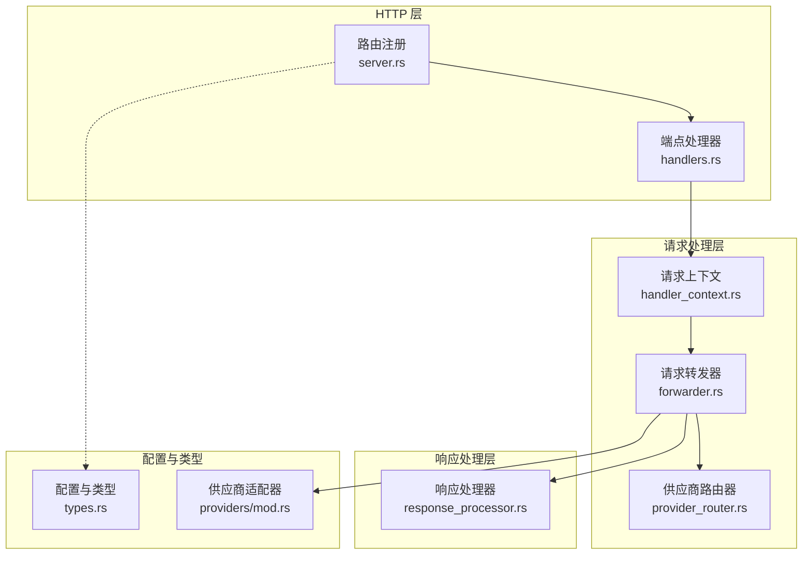
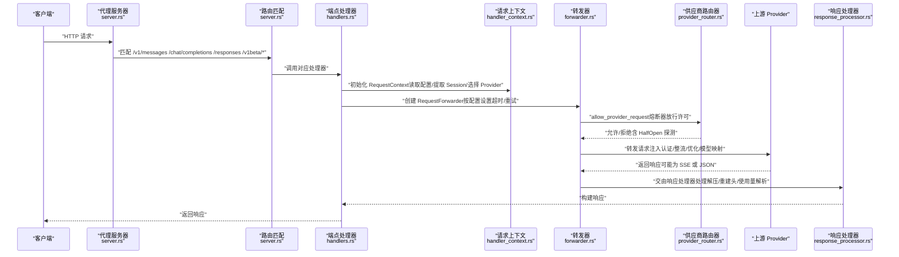
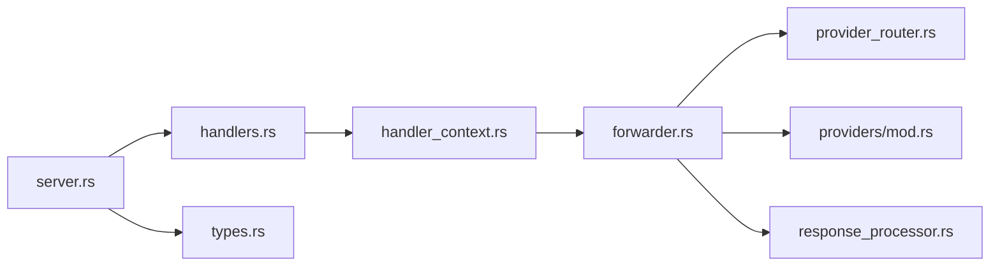

# 请求路由与转发

<cite>
**本文引用的文件**
- [src-tauri/src/proxy/server.rs](file://src-tauri/src/proxy/server.rs)
- [src-tauri/src/proxy/handlers.rs](file://src-tauri/src/proxy/handlers.rs)
- [src-tauri/src/proxy/handler_context.rs](file://src-tauri/src/proxy/handler_context.rs)
- [src-tauri/src/proxy/forwarder.rs](file://src-tauri/src/proxy/forwarder.rs)
- [src-tauri/src/proxy/provider_router.rs](file://src-tauri/src/proxy/provider_router.rs)
- [src-tauri/src/proxy/response_processor.rs](file://src-tauri/src/proxy/response_processor.rs)
- [src-tauri/src/proxy/types.rs](file://src-tauri/src/proxy/types.rs)
- [src-tauri/src/proxy/providers/mod.rs](file://src-tauri/src/proxy/providers/mod.rs)
</cite>

## 目录
1. [简介](#简介)
2. [项目结构](#项目结构)
3. [核心组件](#核心组件)
4. [架构总览](#架构总览)
5. [详细组件分析](#详细组件分析)
6. [依赖关系分析](#依赖关系分析)
7. [性能考量](#性能考量)
8. [故障排查指南](#故障排查指南)
9. [结论](#结论)
10. [附录](#附录)

## 简介
本技术文档围绕 CC Switch 的请求路由与转发系统，系统性阐述以下主题：
- 请求路由算法与 URL 匹配规则
- 目标选择策略与故障转移机制
- 请求转发流程、HTTP 头部处理与请求体转换
- 路由配置选项、优先级与动态规则
- 不同 AI 供应商的路由策略差异与特殊请求处理
- 错误重定向与熔断器策略
- 实际路由配置示例、请求日志分析与调试技巧
- 请求拦截点、中间件处理与性能优化策略

## 项目结构
CC Switch 的代理服务基于 Axum + Hyper 实现，核心位于 src-tauri/src/proxy 目录，采用模块化设计：
- server.rs：HTTP 服务器与路由注册，负责端口监听、路由挂载与状态维护
- handlers.rs：各 API 端点处理器，按应用类型拆分（Claude、Codex、Gemini 等）
- handler_context.rs：请求上下文封装，统一初始化与配置读取
- forwarder.rs：请求转发器，负责故障转移、整流器、优化器、认证注入与超时控制
- provider_router.rs：供应商路由器，负责按应用类型选择可用 Provider 并管理熔断器
- response_processor.rs：响应处理器，统一流式与非流式响应处理、使用量解析与日志
- types.rs：代理配置、状态与运行时配置结构体
- providers/mod.rs：供应商适配器与类型体系，统一不同上游的认证与请求转换

图表来源
- [src-tauri/src/proxy/server.rs:291-360](file://src-tauri/src/proxy/server.rs#L291-L360)
- [src-tauri/src/proxy/handlers.rs:1-120](file://src-tauri/src/proxy/handlers.rs#L1-L120)
- [src-tauri/src/proxy/handler_context.rs:75-177](file://src-tauri/src/proxy/handler_context.rs#L75-L177)
- [src-tauri/src/proxy/forwarder.rs:94-127](file://src-tauri/src/proxy/forwarder.rs#L94-L127)
- [src-tauri/src/proxy/provider_router.rs:15-31](file://src-tauri/src/proxy/provider_router.rs#L15-L31)
- [src-tauri/src/proxy/response_processor.rs:372-384](file://src-tauri/src/proxy/response_processor.rs#L372-L384)
- [src-tauri/src/proxy/types.rs:167-195](file://src-tauri/src/proxy/types.rs#L167-L195)
- [src-tauri/src/proxy/providers/mod.rs:236-261](file://src-tauri/src/proxy/providers/mod.rs#L236-L261)

章节来源
- [src-tauri/src/proxy/server.rs:291-360](file://src-tauri/src/proxy/server.rs#L291-L360)
- [src-tauri/src/proxy/handlers.rs:1-120](file://src-tauri/src/proxy/handlers.rs#L1-L120)
- [src-tauri/src/proxy/handler_context.rs:75-177](file://src-tauri/src/proxy/handler_context.rs#L75-L177)
- [src-tauri/src/proxy/forwarder.rs:94-127](file://src-tauri/src/proxy/forwarder.rs#L94-L127)
- [src-tauri/src/proxy/provider_router.rs:15-31](file://src-tauri/src/proxy/provider_router.rs#L15-L31)
- [src-tauri/src/proxy/response_processor.rs:372-384](file://src-tauri/src/proxy/response_processor.rs#L372-L384)
- [src-tauri/src/proxy/types.rs:167-195](file://src-tauri/src/proxy/types.rs#L167-L195)
- [src-tauri/src/proxy/providers/mod.rs:236-261](file://src-tauri/src/proxy/providers/mod.rs#L236-L261)

## 核心组件
- 代理服务器与路由
  - 监听地址与端口、健康检查、状态查询、端点注册（/health、/status、/v1/messages、/chat/completions、/responses、/responses/compact、/v1beta/*path 等）
  - 默认请求体大小限制提升至 200MB，避免 413
- 请求上下文
  - 读取应用级代理配置（per-app）、整流器/优化器配置、提取 Session ID、选择 Provider 列表
  - 超时配置按“故障转移开关”生效与否进行差异化
- 请求转发器
  - 故障转移：按队列顺序尝试多个 Provider，支持熔断器放行许可与 HalfOpen 探测
  - 整流器：针对 Claude/ClaudeAuth 的 thinking 签名与预算整流，媒体降级（图片替换）
  - 优化器：Bedrock 场景下的 thinking 优化与缓存注入
  - 认证注入：根据 Provider 类型与适配器提取认证信息，注入必要头部
  - 超时控制：流式首字节与静默期超时、非流式整包超时
- 供应商路由器
  - 按应用类型选择 Provider：故障转移开启时使用故障转移队列顺序；关闭时仅使用当前 Provider
  - 熔断器：按应用类型独立配置，支持热更新与手动重置
- 响应处理器
  - 流式与非流式统一处理，自动解压、移除 hop-by-hop 头、重建响应头
  - SSE 使用量收集与日志记录，支持按请求计价模式（outbound_model 优先）

章节来源
- [src-tauri/src/proxy/server.rs:94-223](file://src-tauri/src/proxy/server.rs#L94-L223)
- [src-tauri/src/proxy/handler_context.rs:75-281](file://src-tauri/src/proxy/handler_context.rs#L75-L281)
- [src-tauri/src/proxy/forwarder.rs:318-1086](file://src-tauri/src/proxy/forwarder.rs#L318-L1086)
- [src-tauri/src/proxy/provider_router.rs:32-109](file://src-tauri/src/proxy/provider_router.rs#L32-L109)
- [src-tauri/src/proxy/response_processor.rs:189-384](file://src-tauri/src/proxy/response_processor.rs#L189-L384)

## 架构总览
下图展示了从请求进入、路由匹配、上下文初始化、转发与整流、到响应处理与日志记录的完整链路。

图表来源
- [src-tauri/src/proxy/server.rs:291-360](file://src-tauri/src/proxy/server.rs#L291-L360)
- [src-tauri/src/proxy/handlers.rs:105-247](file://src-tauri/src/proxy/handlers.rs#L105-L247)
- [src-tauri/src/proxy/handler_context.rs:194-281](file://src-tauri/src/proxy/handler_context.rs#L194-L281)
- [src-tauri/src/proxy/forwarder.rs:318-1086](file://src-tauri/src/proxy/forwarder.rs#L318-L1086)
- [src-tauri/src/proxy/provider_router.rs:111-162](file://src-tauri/src/proxy/provider_router.rs#L111-L162)
- [src-tauri/src/proxy/response_processor.rs:189-384](file://src-tauri/src/proxy/response_processor.rs#L189-L384)

## 详细组件分析

### 请求路由与 URL 匹配规则
- 路由注册集中在 server.rs 的 build_router 中，覆盖：
  - 健康检查与状态查询：/health、/status
  - Claude：/v1/messages、/claude/v1/messages
  - Claude Desktop：/claude-desktop/v1/models、/claude-desktop/v1/messages
  - Codex（OpenAI 兼容）：/chat/completions、/v1/chat/completions、/v1/v1/chat/completions、/codex/v1/chat/completions；/responses、/v1/responses、/v1/v1/responses、/codex/v1/responses；/responses/compact、/v1/responses/compact、/v1/v1/responses/compact、/codex/v1/responses/compact；/models、/v1/models
  - Gemini：/v1beta/*path、/gemini/v1beta/*path、/gemini/v1/*path（使用 any 覆盖 GET/POST 等方法）
- URL 匹配遵循最长前缀优先，Claude/Codex 支持多前缀路径以兼容不同客户端；Gemini 使用通配符路径以透传所有端点与查询参数。

章节来源
- [src-tauri/src/proxy/server.rs:291-360](file://src-tauri/src/proxy/server.rs#L291-L360)

### 目标选择策略与故障转移
- 供应商选择
  - 故障转移关闭：仅使用当前 Provider（来自 settings 或数据库）
  - 故障转移开启：使用故障转移队列顺序，按队列优先级逐一尝试
- 熔断器
  - 每个 app_type:provider_id 维护独立熔断器，支持失败/成功阈值、超时、错误率与最小请求数
  - 支持热更新与手动重置；HalfOpen 探测占用名额，避免长时间阻塞
- 整流器与优化器
  - Claude/ClaudeAuth：think 签名整流、budget 整流、媒体降级（图片替换为标记）
  - Copilot：请求分类、工具结果合并、紧凑请求识别、确定性 Request ID、子代理检测、Warmup 降级、主动剥离 thinking
  - Bedrock：thinking 优化、缓存注入

章节来源
- [src-tauri/src/proxy/provider_router.rs:32-109](file://src-tauri/src/proxy/provider_router.rs#L32-L109)
- [src-tauri/src/proxy/forwarder.rs:318-1086](file://src-tauri/src/proxy/forwarder.rs#L318-L1086)
- [src-tauri/src/proxy/types.rs:197-345](file://src-tauri/src/proxy/types.rs#L197-L345)

### 请求转发机制与头部处理
- 转发流程
  - 适配器提取 base_url、认证信息，注入必要头部（如 x-api-key、Authorization、自定义 User-Agent 等）
  - 按 Provider 类型与 API 格式进行请求体转换（Claude → OpenAI Responses/Gemini Native 等）
  - 模型映射与规范化（去除后缀、Copilot 模型归一化、Claude Desktop 路由映射）
  - 超时控制：流式首字节与静默期超时、非流式整包超时（仅在故障转移开启且配置非零时生效）
- 头部处理
  - 透传原始请求头（保留大小写），必要时注入认证与指纹头
  - 响应侧移除 hop-by-hop 头与实体头，重建 Content-Length/Encoding 等

章节来源
- [src-tauri/src/proxy/forwarder.rs:1088-1599](file://src-tauri/src/proxy/forwarder.rs#L1088-L1599)
- [src-tauri/src/proxy/response_processor.rs:100-126](file://src-tauri/src/proxy/response_processor.rs#L100-L126)

### 请求体转换与特殊请求处理
- Claude
  - 格式转换：OpenAI Chat Completions ↔ Anthropic Messages；Responses API ↔ Anthropic；Gemini Native 适配
  - SSE 聚合：对非流式但返回 SSE 的响应进行聚合，确保客户端获得合法 JSON
- Codex
  - Responses 与 Chat Completions 互转；错误体规整；SSE 聚合兜底
- Gemini
  - 模型名从 URI 提取（/v1beta/models/{model}:action），透传查询参数
- Copilot
  - 动态 endpoint 路由（企业版等），认证令牌按账号动态获取，注入指纹头与分类头

章节来源
- [src-tauri/src/proxy/handlers.rs:105-247](file://src-tauri/src/proxy/handlers.rs#L105-L247)
- [src-tauri/src/proxy/handlers.rs:575-794](file://src-tauri/src/proxy/handlers.rs#L575-L794)
- [src-tauri/src/proxy/handlers.rs:1282-1358](file://src-tauri/src/proxy/handlers.rs#L1282-L1358)
- [src-tauri/src/proxy/handler_context.rs:179-199](file://src-tauri/src/proxy/handler_context.rs#L179-L199)

### 错误重定向与熔断器策略
- 错误分类
  - 可重试：上游/网络错误，记录失败并更新熔断器与健康度
  - 不可重试/客户端中断：不污染健康度，仅释放 HalfOpen 探测名额
- 熔断器
  - 支持失败阈值、成功阈值、超时、错误率与最小请求数
  - 热更新与手动重置，避免长时间不可用

章节来源
- [src-tauri/src/proxy/forwarder.rs:981-1044](file://src-tauri/src/proxy/forwarder.rs#L981-L1044)
- [src-tauri/src/proxy/provider_router.rs:111-162](file://src-tauri/src/proxy/provider_router.rs#L111-L162)

### 路由配置选项、优先级与动态规则
- 应用级代理配置（AppProxyConfig）
  - enabled、auto_failover_enabled、max_retries、流式/非流式超时、熔断阈值与等待时间
- 全局代理配置（ProxyConfig）
  - 监听地址/端口、日志开关、默认超时
- 运行时配置
  - 热更新熔断器配置与端口变更
- 优先级
  - 故障转移开启时：严格按队列顺序；关闭时：仅当前 Provider
  - 超时配置仅在故障转移开启时生效

章节来源
- [src-tauri/src/proxy/types.rs:167-195](file://src-tauri/src/proxy/types.rs#L167-L195)
- [src-tauri/src/proxy/types.rs:4-56](file://src-tauri/src/proxy/types.rs#L4-L56)
- [src-tauri/src/proxy/server.rs:362-394](file://src-tauri/src/proxy/server.rs#L362-L394)
- [src-tauri/src/proxy/handler_context.rs:194-244](file://src-tauri/src/proxy/handler_context.rs#L194-L244)

### 不同 AI 供应商的路由策略差异
- Claude
  - 支持 OpenRouter、GitHub Copilot、Codex OAuth 等中转场景；API 格式转换
- Codex
  - 与上游 Responses API 的互转；错误体规整；Gemini Native 适配
- Gemini
  - 模型名从 URI 提取；支持 CLI OAuth 与 API Key 两种认证
- Copilot
  - 动态 endpoint 路由、多账号认证、指纹头注入、请求分类与优化

章节来源
- [src-tauri/src/proxy/providers/mod.rs:56-208](file://src-tauri/src/proxy/providers/mod.rs#L56-L208)
- [src-tauri/src/proxy/providers/mod.rs:236-261](file://src-tauri/src/proxy/providers/mod.rs#L236-L261)
- [src-tauri/src/proxy/handlers.rs:105-247](file://src-tauri/src/proxy/handlers.rs#L105-L247)
- [src-tauri/src/proxy/handlers.rs:1282-1358](file://src-tauri/src/proxy/handlers.rs#L1282-L1358)

### 实际路由配置示例与调试技巧
- 示例
  - 启用故障转移：将 auto_failover_enabled 设为 true，并在故障转移队列中配置 Provider 顺序
  - 调整超时：在 AppProxyConfig 中设置 streaming_first_byte_timeout、streaming_idle_timeout、non_streaming_timeout
  - 熔断器：调整 circuit_failure_threshold、circuit_success_threshold、circuit_timeout_seconds、circuit_error_rate_threshold、circuit_min_requests
- 调试
  - 查看 /status 获取当前 Provider、活跃连接、成功率与最近错误
  - 启用日志：通过 LogConfig 控制日志级别与开关
  - 使用 /health 进行健康检查
  - 观察 SSE 使用量收集与响应体日志，定位解析与超时问题

章节来源
- [src-tauri/src/proxy/server.rs:257-277](file://src-tauri/src/proxy/server.rs#L257-L277)
- [src-tauri/src/proxy/types.rs:347-385](file://src-tauri/src/proxy/types.rs#L347-L385)
- [src-tauri/src/proxy/response_processor.rs:656-662](file://src-tauri/src/proxy/response_processor.rs#L656-L662)

## 依赖关系分析
- 组件耦合
  - server.rs 作为入口，依赖 handlers.rs；handlers.rs 依赖 handler_context.rs 与 forwarder.rs；forwarder.rs 依赖 provider_router.rs 与 providers/mod.rs；response_processor.rs 与 types.rs 提供统一的响应与配置接口
- 关键依赖链
  - 路由 → 处理器 → 上下文 → 转发器 → 供应商路由器/适配器 → 响应处理器
- 循环依赖
  - 未发现循环依赖；模块职责清晰，接口边界明确

图表来源
- [src-tauri/src/proxy/server.rs:291-360](file://src-tauri/src/proxy/server.rs#L291-L360)
- [src-tauri/src/proxy/handlers.rs:1-120](file://src-tauri/src/proxy/handlers.rs#L1-L120)
- [src-tauri/src/proxy/handler_context.rs:75-177](file://src-tauri/src/proxy/handler_context.rs#L75-L177)
- [src-tauri/src/proxy/forwarder.rs:94-127](file://src-tauri/src/proxy/forwarder.rs#L94-L127)
- [src-tauri/src/proxy/provider_router.rs:15-31](file://src-tauri/src/proxy/provider_router.rs#L15-L31)
- [src-tauri/src/proxy/response_processor.rs:372-384](file://src-tauri/src/proxy/response_processor.rs#L372-L384)
- [src-tauri/src/proxy/types.rs:167-195](file://src-tauri/src/proxy/types.rs#L167-L195)

章节来源
- [src-tauri/src/proxy/server.rs:291-360](file://src-tauri/src/proxy/server.rs#L291-L360)
- [src-tauri/src/proxy/handlers.rs:1-120](file://src-tauri/src/proxy/handlers.rs#L1-L120)
- [src-tauri/src/proxy/handler_context.rs:75-177](file://src-tauri/src/proxy/handler_context.rs#L75-L177)
- [src-tauri/src/proxy/forwarder.rs:94-127](file://src-tauri/src/proxy/forwarder.rs#L94-L127)
- [src-tauri/src/proxy/provider_router.rs:15-31](file://src-tauri/src/proxy/provider_router.rs#L15-L31)
- [src-tauri/src/proxy/response_processor.rs:372-384](file://src-tauri/src/proxy/response_processor.rs#L372-L384)
- [src-tauri/src/proxy/types.rs:167-195](file://src-tauri/src/proxy/types.rs#L167-L195)

## 性能考量
- 超时与重试
  - 流式首字节与静默期超时可避免长时间挂起；非流式整包超时仅在故障转移开启时生效
  - max_retries 控制重试次数，避免雪崩效应
- 熔断器
  - 失败阈值、错误率与最小请求数共同决定熔断状态，降低对不稳定 Provider 的压力
- 响应处理
  - 自动解压与实体头重建，避免重复计算；SSE 使用量收集按需启用，减少 JSON 解析开销
- 优化器
  - Copilot 优化器在请求前进行分类、清理与合并，减少上游报错与重复计费风险

[本节为通用指导，无需引用具体文件]

## 故障排查指南
- 常见问题定位
  - 413 Payload Too Large：检查上游网关限制，确认本地代理未限制请求体大小
  - SSE 非流式响应：检查上游是否强制返回 SSE 但未标注 Content-Type，系统提供聚合兜底
  - 首字节/静默期超时：调整 streaming_first_byte_timeout 与 streaming_idle_timeout
  - 所有 Provider 熔断：检查熔断器阈值与超时配置，必要时手动重置
- 日志与状态
  - 使用 /status 查看当前 Provider、活跃连接、成功率与最近错误
  - 通过 LogConfig 调整日志级别，启用详细日志定位问题
- 错误码与消息
  - Codex 代理错误体包含 provider、model、endpoint、upstream_status 等字段，便于快速定位

章节来源
- [src-tauri/src/proxy/handlers.rs:1089-1277](file://src-tauri/src/proxy/handlers.rs#L1089-L1277)
- [src-tauri/src/proxy/response_processor.rs:133-184](file://src-tauri/src/proxy/response_processor.rs#L133-L184)
- [src-tauri/src/proxy/server.rs:257-277](file://src-tauri/src/proxy/server.rs#L257-L277)
- [src-tauri/src/proxy/types.rs:347-385](file://src-tauri/src/proxy/types.rs#L347-L385)

## 结论
CC Switch 的请求路由与转发系统通过模块化设计实现了：
- 灵活的路由匹配与端点覆盖，满足多供应商与多客户端场景
- 健壮的故障转移与熔断器机制，保障服务稳定性
- 深度的请求/响应转换与头部处理，适配不同供应商的 API 差异
- 可配置的超时与重试策略，兼顾性能与可靠性
- 丰富的日志与监控接口，便于运维与调试

[本节为总结，无需引用具体文件]

## 附录
- 请求拦截点
  - 路由层：server.rs 的 build_router
  - 处理器层：handlers.rs 的各端点处理器
  - 上下文层：handler_context.rs 的 RequestContext 初始化
  - 转发层：forwarder.rs 的转发与整流
  - 响应层：response_processor.rs 的响应处理
- 中间件处理
  - 头部大小写保留、认证注入、模型映射、SSE 使用量收集
- 性能优化建议
  - 合理设置超时与重试，避免不必要的熔断与重试
  - 启用按需的日志与使用量收集，减少热路径开销
  - 使用 Copilot/Gemini/Claude 等适配器的优化功能，减少上游错误与重复计费

[本节为补充说明，无需引用具体文件]