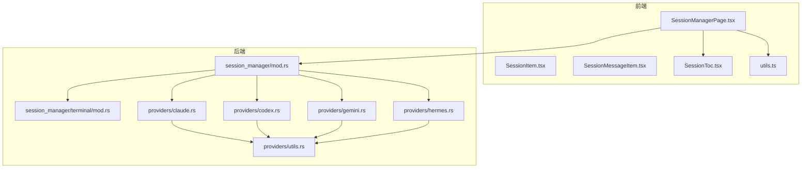
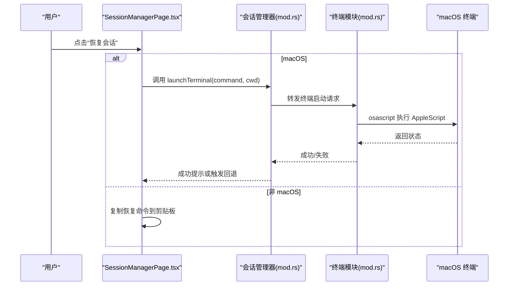
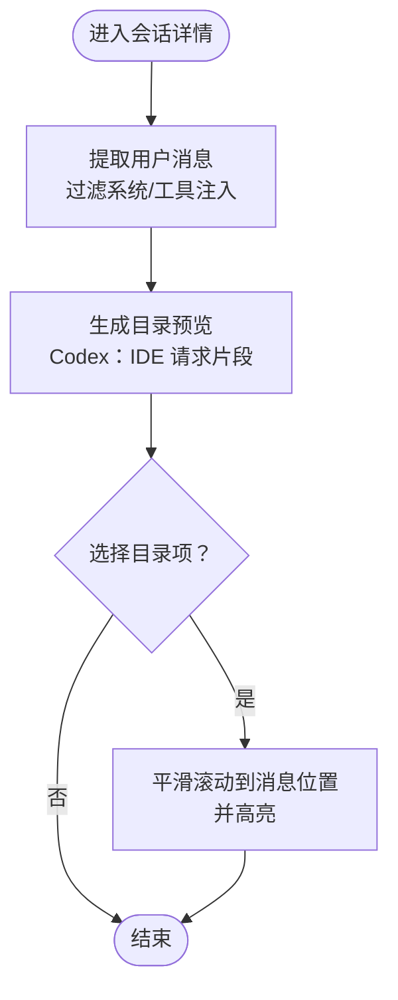
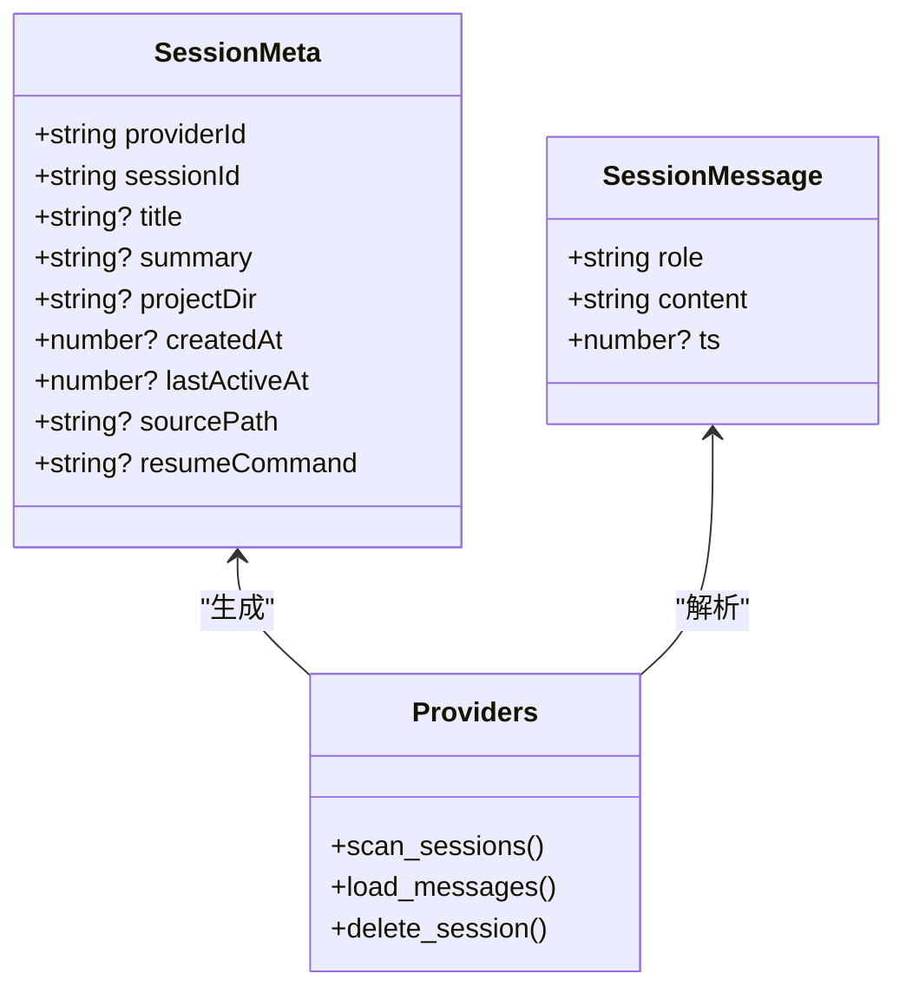
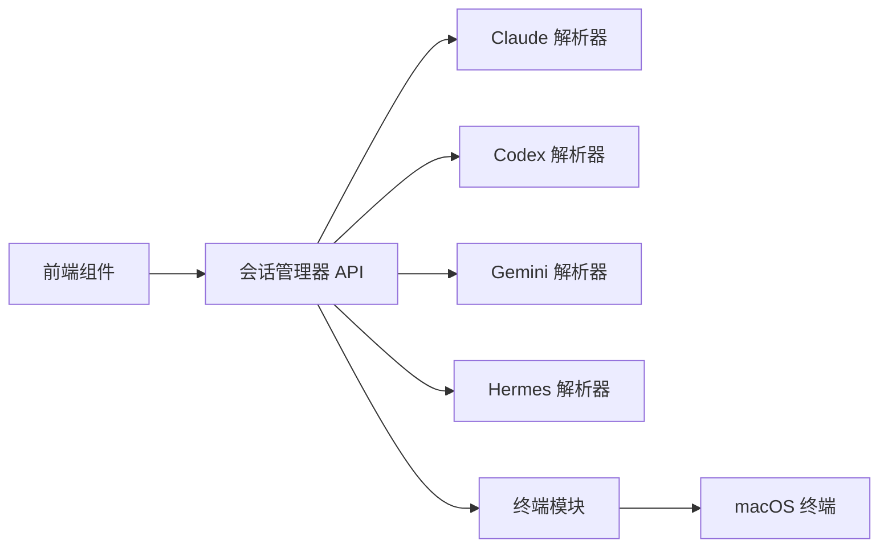

# 会话恢复

<cite>
**本文引用的文件**
- [SessionManagerPage.tsx](file://src/components/sessions/SessionManagerPage.tsx)
- [SessionItem.tsx](file://src/components/sessions/SessionItem.tsx)
- [SessionMessageItem.tsx](file://src/components/sessions/SessionMessageItem.tsx)
- [SessionToc.tsx](file://src/components/sessions/SessionToc.tsx)
- [utils.ts](file://src/components/sessions/utils.ts)
- [mod.rs（终端模块）](file://src-tauri/src/session_manager/terminal/mod.rs)
- [mod.rs（会话管理器）](file://src-tauri/src/session_manager/mod.rs)
- [claude.rs](file://src-tauri/src/session_manager/providers/claude.rs)
- [codex.rs](file://src-tauri/src/session_manager/providers/codex.rs)
- [gemini.rs](file://src-tauri/src/session_manager/providers/gemini.rs)
- [hermes.rs](file://src-tauri/src/session_manager/providers/hermes.rs)
- [utils.rs（提供者工具）](file://src-tauri/src/session_manager/providers/utils.rs)
- [3.4-sessions.md（英文用户手册）](file://docs/user-manual/en/3-extensions/3.4-sessions.md)
- [v3.13.0-en.md（发布说明）](file://docs/release-notes/v3.13.0-en.md)
</cite>

## 目录
1. [简介](#简介)
2. [项目结构](#项目结构)
3. [核心组件](#核心组件)
4. [架构总览](#架构总览)
5. [详细组件分析](#详细组件分析)
6. [依赖关系分析](#依赖关系分析)
7. [性能考量](#性能考量)
8. [故障排查指南](#故障排查指南)
9. [结论](#结论)
10. [附录](#附录)

## 简介
本指南面向 CC Switch 的“会话恢复”能力，系统讲解其概念、支持的会话来源与恢复机制、消息查看方式、消息目录（TOC）导航、以及跨平台恢复操作流程（含 macOS 直接启动终端与非 macOS 平台的命令复制）。文档同时覆盖权限要求、注意事项与常见问题的解决方案，帮助用户高效地在 Claude、Codex、Gemini、OpenCode、OpenClaw、Hermes 等 AI 工具之间恢复对话。

## 项目结构
会话恢复功能由前端界面与后端扫描/加载/执行三部分协作完成：
- 前端负责展示会话列表、消息历史、TOC、复制/恢复命令等交互；
- 后端负责扫描各工具的会话存储、解析消息、生成恢复命令、在 macOS 上调用系统终端执行恢复命令；
- 终端模块封装了 macOS 下的终端启动逻辑。

图表来源
- [SessionManagerPage.tsx](file://src/components/sessions/SessionManagerPage.tsx)
- [SessionToc.tsx](file://src/components/sessions/SessionToc.tsx)
- [mod.rs（会话管理器）](file://src-tauri/src/session_manager/mod.rs)
- [mod.rs（终端模块）](file://src-tauri/src/session_manager/terminal/mod.rs)
- [claude.rs](file://src-tauri/src/session_manager/providers/claude.rs)
- [codex.rs](file://src-tauri/src/session_manager/providers/codex.rs)
- [gemini.rs](file://src-tauri/src/session_manager/providers/gemini.rs)
- [hermes.rs](file://src-tauri/src/session_manager/providers/hermes.rs)
- [utils.rs（提供者工具）](file://src-tauri/src/session_manager/providers/utils.rs)

章节来源
- [SessionManagerPage.tsx](file://src/components/sessions/SessionManagerPage.tsx)
- [mod.rs（会话管理器）](file://src-tauri/src/session_manager/mod.rs)

## 核心组件
- 会话管理页面：提供会话列表、搜索过滤、批量删除、消息详情、恢复命令预览与复制、TOC 导航。
- 会话项与消息项：渲染会话条目与单条消息，支持高亮、折叠长文本、复制消息。
- 会话 TOC：提取用户消息生成目录，支持在桌面端侧边栏与移动端弹窗中跳转到指定消息。
- 会话扫描与加载：按提供者扫描会话、解析消息、生成恢复命令；对 SQLite 与 JSON/JSONL 两种格式分别处理。
- 终端恢复：macOS 下通过 AppleScript 调用系统终端运行恢复命令，失败时回退到复制命令。

章节来源
- [SessionManagerPage.tsx](file://src/components/sessions/SessionManagerPage.tsx)
- [SessionItem.tsx](file://src/components/sessions/SessionItem.tsx)
- [SessionMessageItem.tsx](file://src/components/sessions/SessionMessageItem.tsx)
- [SessionToc.tsx](file://src/components/sessions/SessionToc.tsx)
- [utils.ts](file://src/components/sessions/utils.ts)
- [mod.rs（会话管理器）](file://src-tauri/src/session_manager/mod.rs)
- [mod.rs（终端模块）](file://src-tauri/src/session_manager/terminal/mod.rs)

## 架构总览
下图展示了从用户点击“恢复会话”到实际在终端执行命令的关键流程，涵盖跨平台差异与错误回退。

图表来源
- [SessionManagerPage.tsx](file://src/components/sessions/SessionManagerPage.tsx)
- [mod.rs（终端模块）](file://src-tauri/src/session_manager/terminal/mod.rs)
- [mod.rs（会话管理器）](file://src-tauri/src/session_manager/mod.rs)

## 详细组件分析

### 会话来源与恢复机制
- 支持的会话来源与存储位置
  - Claude Code：缓存目录下的 projects/*.jsonl
  - Codex：配置目录下的 sessions 与 archived_sessions
  - OpenCode：本地数据目录（JSON 或 SQLite）
  - OpenClaw：agents/<agent>/sessions/*.jsonl
  - Gemini CLI：缓存目录 tmp/<project_hash>/chats/*.json
  - Hermes：state.db（SQLite）或 sessions/*.jsonl
- 恢复命令生成
  - Claude：claude --resume <sessionId>
  - Codex：codex resume <sessionId>
  - Gemini：gemini --resume <sessionId>
  - OpenCode/OpenClaw/Hermes：不提供自动恢复命令（由工具自身处理）

章节来源
- [3.4-sessions.md（英文用户手册）](file://docs/user-manual/en/3-extensions/3.4-sessions.md)
- [claude.rs](file://src-tauri/src/session_manager/providers/claude.rs)
- [codex.rs](file://src-tauri/src/session_manager/providers/codex.rs)
- [gemini.rs](file://src-tauri/src/session_manager/providers/gemini.rs)
- [hermes.rs](file://src-tauri/src/session_manager/providers/hermes.rs)

### 消息查看与格式
- 消息角色与时间戳
  - 角色标签：用户、助手、系统、工具等，带语义化颜色区分
  - 时间戳：完整时间或相对时间（如“刚刚”、“X分钟前”）
- 长消息折叠
  - 超过阈值的消息默认折叠，支持展开查看全文
- 搜索高亮
  - 在标题、摘要、路径、消息内容中进行高亮匹配
- 消息 TOC
  - 仅提取用户消息作为目录项，避免系统/工具注入信息干扰
  - Codex 特殊处理：从 IDE 上下文块中提取“我的请求”片段作为预览

章节来源
- [SessionMessageItem.tsx](file://src/components/sessions/SessionMessageItem.tsx)
- [utils.ts](file://src/components/sessions/utils.ts)
- [codex.rs](file://src-tauri/src/session_manager/providers/codex.rs)

### 恢复操作步骤
- 在 macOS 上直接启动终端
  - 选择目标会话，点击“恢复会话”
  - 应用调用系统终端执行恢复命令，并自动定位到会话项目目录
  - 若启动失败，自动复制恢复命令到剪贴板
- 在其他平台
  - 点击“恢复会话”按钮不可用或无命令时，使用“复制命令”按钮复制恢复命令，粘贴至终端执行
- Claude 会话的目录选择（自 v3.13.0 起）
  - 恢复前可选择工作目录，适用于项目移动、符号链接失效或临时切换工作目录的场景

章节来源
- [SessionManagerPage.tsx](file://src/components/sessions/SessionManagerPage.tsx)
- [3.4-sessions.md（英文用户手册）](file://docs/user-manual/en/3-extensions/3.4-sessions.md)
- [v3.13.0-en.md（发布说明）](file://docs/release-notes/v3.13.0-en.md)

### 消息目录（TOC）导航
- 生成规则
  - 仅包含用户消息（role=user）
  - Codex：过滤掉 AGENTS.md 指令与环境上下文注入，优先从 IDE 上下文中提取“我的请求”片段
- 导航方式
  - 桌面端：右侧固定侧边栏，点击序号快速滚动到对应消息
  - 移动端：悬浮按钮打开对话框，点击条目跳转
- 跳转行为
  - 点击后平滑滚动到该消息位置，并短暂高亮

图表来源
- [SessionManagerPage.tsx](file://src/components/sessions/SessionManagerPage.tsx)
- [SessionToc.tsx](file://src/components/sessions/SessionToc.tsx)
- [utils.ts](file://src/components/sessions/utils.ts)
- [codex.rs](file://src-tauri/src/session_manager/providers/codex.rs)

章节来源
- [SessionManagerPage.tsx](file://src/components/sessions/SessionManagerPage.tsx)
- [SessionToc.tsx](file://src/components/sessions/SessionToc.tsx)
- [utils.ts](file://src/components/sessions/utils.ts)

### 会话扫描与消息加载（代码级）
- 扫描策略
  - 并行扫描各提供者的会话根目录，合并结果并按最后活跃时间排序
- 消息加载
  - Claude：解析 JSONL 中的 message 字段，识别工具调用并归类为 tool 角色
  - Codex：解析 response_item payload，支持 function_call/function_call_output
  - Gemini：解析 JSON 中 messages 数组，支持 toolCalls 追加工具名
  - Hermes：优先读取 SQLite（state.db），若不存在则回退 JSONL（sessions/*.jsonl）
- 删除策略
  - 文件型：校验 source_path 是否位于允许的根目录内，再调用对应提供者删除
  - SQLite 型：通过源引用（sqlite:path#id）直接删除数据库记录

图表来源
- [mod.rs（会话管理器）](file://src-tauri/src/session_manager/mod.rs)
- [claude.rs](file://src-tauri/src/session_manager/providers/claude.rs)
- [codex.rs](file://src-tauri/src/session_manager/providers/codex.rs)
- [gemini.rs](file://src-tauri/src/session_manager/providers/gemini.rs)
- [hermes.rs](file://src-tauri/src/session_manager/providers/hermes.rs)

章节来源
- [mod.rs（会话管理器）](file://src-tauri/src/session_manager/mod.rs)
- [claude.rs](file://src-tauri/src/session_manager/providers/claude.rs)
- [codex.rs](file://src-tauri/src/session_manager/providers/codex.rs)
- [gemini.rs](file://src-tauri/src/session_manager/providers/gemini.rs)
- [hermes.rs](file://src-tauri/src/session_manager/providers/hermes.rs)

## 依赖关系分析
- 前端与后端通信
  - 前端通过查询钩子获取会话列表与消息，使用统一 API 访问后端
- 提供者耦合与解耦
  - 后端以 provider_id 为键路由到具体解析器，降低前端对提供者细节的依赖
- 终端集成
  - 仅在 macOS 上启用终端启动，其他平台回退到复制命令

图表来源
- [SessionManagerPage.tsx](file://src/components/sessions/SessionManagerPage.tsx)
- [mod.rs（会话管理器）](file://src-tauri/src/session_manager/mod.rs)
- [mod.rs（终端模块）](file://src-tauri/src/session_manager/terminal/mod.rs)

章节来源
- [SessionManagerPage.tsx](file://src/components/sessions/SessionManagerPage.tsx)
- [mod.rs（会话管理器）](file://src-tauri/src/session_manager/mod.rs)
- [mod.rs（终端模块）](file://src-tauri/src/session_manager/terminal/mod.rs)

## 性能考量
- 扫描并发：后端对多个提供者采用线程池并行扫描，提升整体响应速度
- 小文件优化：提供者工具对小文件（<16KB）一次性读取，减少多次 IO 开销
- 列表虚拟化：消息列表使用虚拟化滚动，避免超大会话导致的渲染压力
- 折叠长消息：默认折叠长消息，仅在需要时展开，降低 DOM 节点数量

章节来源
- [mod.rs（会话管理器）](file://src-tauri/src/session_manager/mod.rs)
- [utils.rs（提供者工具）](file://src-tauri/src/session_manager/providers/utils.rs)
- [SessionManagerPage.tsx](file://src/components/sessions/SessionManagerPage.tsx)

## 故障排查指南
- “恢复会话”按钮不可用
  - 某些提供者（如 OpenCode/OpenClaw/Hermes）不提供自动恢复命令，需手动在工具内恢复
- macOS 无法启动终端
  - 回退到复制恢复命令到剪贴板，手动粘贴执行
  - 检查系统是否允许自动化控制（系统偏好设置-隐私-自动化）
- 会话目录被移动或符号链接失效
  - Claude 会话支持在恢复前选择新的工作目录
- 消息缺失或显示异常
  - 某些注入信息（如 AGENTS.md 指令、环境上下文）会被过滤，属于预期行为
  - Gemini 的 toolCalls 会在消息中追加工具名，属正常展示

章节来源
- [3.4-sessions.md（英文用户手册）](file://docs/user-manual/en/3-extensions/3.4-sessions.md)
- [v3.13.0-en.md（发布说明）](file://docs/release-notes/v3.13.0-en.md)
- [codex.rs](file://src-tauri/src/session_manager/providers/codex.rs)
- [gemini.rs](file://src-tauri/src/session_manager/providers/gemini.rs)

## 结论
CC Switch 的会话恢复功能通过统一的前端界面与多提供者后端解析，实现了对 Claude、Codex、Gemini、OpenCode、OpenClaw、Hermes 等工具会话的集中管理与高效恢复。macOS 用户可直接在终端中恢复对话，非 macOS 用户可通过复制命令在任意终端中继续会话。配合消息 TOC、长消息折叠与搜索高亮，用户可在复杂会话中快速定位关键信息并恢复对话。

## 附录
- 快速操作清单
  - 选择会话 → 点击“恢复会话”（macOS 自动启动终端；其他平台复制命令）
  - 使用 TOC 快速跳转到用户消息
  - 使用搜索框在标题、摘要、路径与消息内容中检索
  - Claude 会话可选择新的工作目录后再恢复