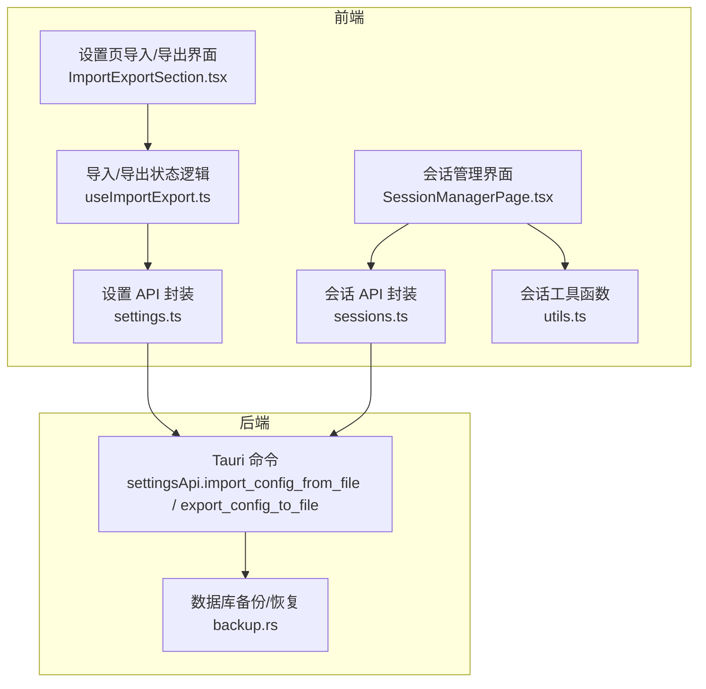
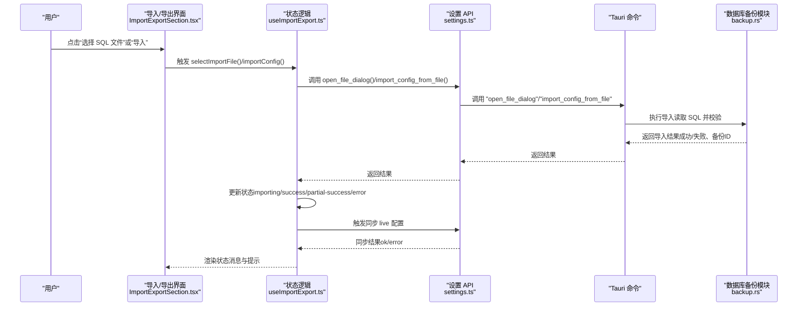
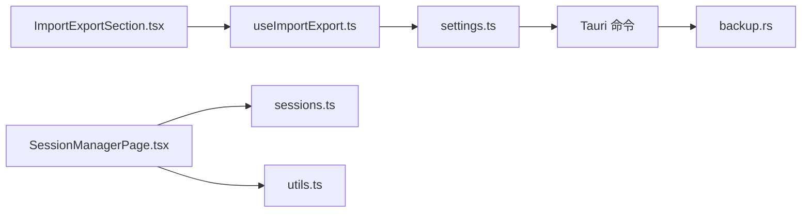

# 会话数据导入

<cite>
**本文引用的文件**
- [useImportExport.ts](file://src/hooks/useImportExport.ts)
- [ImportExportSection.tsx](file://src/components/settings/ImportExportSection.tsx)
- [SettingsPage.tsx](file://src/components/settings/SettingsPage.tsx)
- [settings.ts](file://src/lib/api/settings.ts)
- [backup.rs](file://src-tauri/src/database/backup.rs)
- [session_manager/providers/codex.rs](file://src-tauri/src/session_manager/providers/codex.rs)
- [session_manager/providers/claude.rs](file://src-tauri/src/session_manager/providers/claude.rs)
- [SessionManagerPage.tsx](file://src/components/sessions/SessionManagerPage.tsx)
- [utils.ts](file://src/components/sessions/utils.ts)
- [sessions.ts](file://src/lib/api/sessions.ts)
- [en.json](file://src/i18n/locales/en.json)
- [zh.json](file://src/i18n/locales/zh.json)
- [ja.json](file://src/i18n/locales/ja.json)
</cite>

## 目录
1. [简介](#简介)
2. [项目结构](#项目结构)
3. [核心组件](#核心组件)
4. [架构总览](#架构总览)
5. [详细组件分析](#详细组件分析)
6. [依赖关系分析](#依赖关系分析)
7. [性能考量](#性能考量)
8. [故障排除指南](#故障排除指南)
9. [结论](#结论)
10. [附录](#附录)

## 简介
本技术指南聚焦 CC Switch 的“会话数据导入”能力，明确其整体架构、数据流转过程、支持的会话格式与数据结构、解析与转换机制、导入操作步骤、完整性检查与错误处理、限制条件与不支持格式说明，以及常见问题的诊断与修复方法。需要特别说明的是：当前仓库实现的“导入/导出”是针对应用配置（SQLite 数据库）的 SQL 备份导入导出，而非直接导入第三方聊天客户端的会话日志文件；会话管理页面展示的会话来源于代理拦截与本地会话日志解析，二者属于不同的数据来源与流程。

## 项目结构
围绕会话数据导入与会话管理的关键文件组织如下：
- 设置页的导入/导出 UI 与状态管理：useImportExport.ts、ImportExportSection.tsx、SettingsPage.tsx
- 前端与后端通信接口：settings.ts（封装 Tauri 命令）
- 后端数据库备份/恢复与导入校验：backup.rs
- 会话管理与消息展示：SessionManagerPage.tsx、utils.ts、sessions.ts
- 会话解析示例（Codex/ClauDE JSONL）：session_manager/providers/codex.rs、session_manager/providers/claude.rs
- 国际化文案：en.json、zh.json、ja.json



图表来源
- [ImportExportSection.tsx](file://src/components/settings/ImportExportSection.tsx)
- [useImportExport.ts](file://src/hooks/useImportExport.ts)
- [settings.ts](file://src/lib/api/settings.ts)
- [backup.rs](file://src-tauri/src/database/backup.rs)
- [SessionManagerPage.tsx](file://src/components/sessions/SessionManagerPage.tsx)
- [utils.ts](file://src/components/sessions/utils.ts)
- [sessions.ts](file://src/lib/api/sessions.ts)

章节来源
- [ImportExportSection.tsx](file://src/components/settings/ImportExportSection.tsx)
- [useImportExport.ts](file://src/hooks/useImportExport.ts)
- [settings.ts](file://src/lib/api/settings.ts)
- [backup.rs](file://src-tauri/src/database/backup.rs)
- [SessionManagerPage.tsx](file://src/components/sessions/SessionManagerPage.tsx)
- [utils.ts](file://src/components/sessions/utils.ts)
- [sessions.ts](file://src/lib/api/sessions.ts)

## 核心组件
- 导入/导出状态与流程控制：useImportExport.ts
  - 状态机：idle/importing/success/partial-success/error
  - 行为：选择文件、导入、导出、重置状态
  - 错误处理：统一捕获并提示，区分“配置损坏/格式不正确”“同步失败”等场景
- 导入/导出 UI：ImportExportSection.tsx
  - 展示导入/导出按钮、文件名、状态消息与提示
- 设置页集成：SettingsPage.tsx
  - 将导入/导出 UI 与状态绑定到设置页
- 设置 API 封装：settings.ts
  - 对应 Tauri 命令：open_file_dialog、import_config_from_file、export_config_to_file
- 数据库备份/恢复：backup.rs
  - 导出 SQL 文本、导入 SQL 并进行基础有效性校验
- 会话管理与消息查询：SessionManagerPage.tsx、sessions.ts、utils.ts
  - 会话列表、消息列表、目录（TOC）、Codex 特殊消息过滤与预览
- 会话解析示例：session_manager/providers/codex.rs、session_manager/providers/claude.rs
  - 展示如何解析 JSONL 会话并提取标题

章节来源
- [useImportExport.ts](file://src/hooks/useImportExport.ts)
- [ImportExportSection.tsx](file://src/components/settings/ImportExportSection.tsx)
- [SettingsPage.tsx](file://src/components/settings/SettingsPage.tsx)
- [settings.ts](file://src/lib/api/settings.ts)
- [backup.rs](file://src-tauri/src/database/backup.rs)
- [SessionManagerPage.tsx](file://src/components/sessions/SessionManagerPage.tsx)
- [utils.ts](file://src/components/sessions/utils.ts)
- [sessions.ts](file://src/lib/api/sessions.ts)
- [session_manager/providers/codex.rs](file://src-tauri/src/session_manager/providers/codex.rs)
- [session_manager/providers/claude.rs](file://src-tauri/src/session_manager/providers/claude.rs)

## 架构总览
下图展示了“配置导入”的端到端流程：前端通过设置 API 触发后端命令，后端执行 SQL 导入并在导入前后进行状态校验与同步。



图表来源
- [ImportExportSection.tsx](file://src/components/settings/ImportExportSection.tsx)
- [useImportExport.ts](file://src/hooks/useImportExport.ts)
- [settings.ts](file://src/lib/api/settings.ts)
- [backup.rs](file://src-tauri/src/database/backup.rs)

## 详细组件分析

### 组件 A：导入/导出状态与流程（useImportExport）
- 关键职责
  - 管理导入文件选择、导入状态、错误信息、备份 ID
  - 调用设置 API 完成文件对话框与导入/导出
  - 导入完成后立即触发“当前供应商 live 同步”，若同步失败则提示“部分成功”
- 状态机与行为
  - idle：初始态，可选择文件
  - importing：正在导入
  - success：导入成功且同步成功
  - partial-success：导入成功但同步失败
  - error：导入失败或异常
- 错误处理策略
  - 导入失败：显示“SQL 文件已损坏或格式不正确”等提示
  - 同步失败：提示“已导入，但同步到当前供应商失败，请手动重新选择一次供应商”
  - 通用异常：记录错误并提示
- 与 UI 的交互
  - 通过回调将状态与 UI 绑定，支持清空选择、重置状态

```mermaid
stateDiagram-v2
[*] --> idle
idle --> importing : "开始导入"
importing --> success : "导入+同步均成功"
importing --> partial-success : "导入成功但同步失败"
importing --> error : "导入失败/异常"
success --> idle : "重置"
partial-success --> idle : "重置"
error --> idle : "重置"
```

图表来源
- [useImportExport.ts](file://src/hooks/useImportExport.ts)

章节来源
- [useImportExport.ts](file://src/hooks/useImportExport.ts)

### 组件 B：导入/导出 UI（ImportExportSection）
- 功能要点
  - 导入按钮：未选中文件时显示“选择 SQL 文件”，已选中时显示“导入”
  - 导出按钮：导出当前数据库为 SQL
  - 状态消息：根据状态渲染“导入中/成功/部分成功/失败”提示
  - 文件名展示：显示选中的 SQL 文件名
- 交互细节
  - 选中文件后按钮样式变化，支持一键清空
  - 导入中禁用按钮，避免重复提交

章节来源
- [ImportExportSection.tsx](file://src/components/settings/ImportExportSection.tsx)

### 组件 C：设置页集成（SettingsPage）
- 将导入/导出 UI 与状态逻辑绑定，提供完整的导入/导出入口

章节来源
- [SettingsPage.tsx](file://src/components/settings/SettingsPage.tsx)

### 组件 D：设置 API 封装（settings.ts）
- 关键命令
  - open_file_dialog/save_file_dialog：打开系统文件对话框
  - import_config_from_file/export_config_to_file：导入/导出 SQL 备份
  - sync_current_providers_live：同步当前供应商 live 配置
- 返回值
  - 包含 success/message/backupId 等字段，便于前端展示与后续处理

章节来源
- [settings.ts](file://src/lib/api/settings.ts)

### 组件 E：数据库备份/恢复（backup.rs）
- 导出 SQL
  - 生成带时间戳与 user_version 的 SQL 文本，开启事务与关闭外键约束
- 导入 SQL
  - 基础状态校验：确保导入的 SQL 包含有效的供应商或 MCP 数据
  - 恢复后执行迁移与种子数据初始化
- 备份管理
  - 支持创建、列出、重命名、删除数据库备份

章节来源
- [backup.rs](file://src-tauri/src/database/backup.rs)

### 组件 F：会话管理与消息展示（SessionManagerPage、utils、sessions）
- 会话列表与消息列表
  - 通过 sessionsApi.list 与 sessionsApi.getMessages 获取
- 目录（TOC）与预览
  - Codex 特殊消息过滤：隐藏环境上下文注入与 AGENTS 指令
  - 提取用户消息作为目录项，支持预览与高亮
- 会话键与格式化
  - getSessionKey、formatTimestamp、formatRelativeTime、getProviderLabel 等工具函数

章节来源
- [SessionManagerPage.tsx](file://src/components/sessions/SessionManagerPage.tsx)
- [utils.ts](file://src/components/sessions/utils.ts)
- [sessions.ts](file://src/lib/api/sessions.ts)

### 组件 G：会话解析示例（Codex/ClauDE JSONL）
- Codex
  - 解析 session_meta 中的 id/cwd，标题优先取第一条 user 消息内容，否则回退到目录名
  - 长标题截断并添加省略号
  - 忽略环境上下文注入消息，使用真实用户消息作为标题
- Claude
  - 支持新格式的 file-history-snapshot 类型，标题取自第一条 user 消息

章节来源
- [session_manager/providers/codex.rs](file://src-tauri/src/session_manager/providers/codex.rs)
- [session_manager/providers/claude.rs](file://src-tauri/src/session_manager/providers/claude.rs)

## 依赖关系分析
- 前端依赖
  - useImportExport.ts 依赖 settingsApi（settings.ts）
  - ImportExportSection.tsx 依赖 useImportExport.ts 的状态与回调
  - SessionManagerPage.tsx 依赖 sessionsApi（sessions.ts）与 utils.ts
- 后端依赖
  - settings.ts 的命令最终由 Tauri 注册的 Rust 命令实现
  - backup.rs 依赖 rusqlite 进行数据库操作与迁移



图表来源
- [ImportExportSection.tsx](file://src/components/settings/ImportExportSection.tsx)
- [useImportExport.ts](file://src/hooks/useImportExport.ts)
- [settings.ts](file://src/lib/api/settings.ts)
- [backup.rs](file://src-tauri/src/database/backup.rs)
- [SessionManagerPage.tsx](file://src/components/sessions/SessionManagerPage.tsx)
- [utils.ts](file://src/components/sessions/utils.ts)
- [sessions.ts](file://src/lib/api/sessions.ts)

章节来源
- [ImportExportSection.tsx](file://src/components/settings/ImportExportSection.tsx)
- [useImportExport.ts](file://src/hooks/useImportExport.ts)
- [settings.ts](file://src/lib/api/settings.ts)
- [backup.rs](file://src-tauri/src/database/backup.rs)
- [SessionManagerPage.tsx](file://src/components/sessions/SessionManagerPage.tsx)
- [utils.ts](file://src/components/sessions/utils.ts)
- [sessions.ts](file://src/lib/api/sessions.ts)

## 性能考量
- 导入 SQL 的体积与复杂度
  - 大型 SQL 导入可能占用较多内存与 CPU，建议在低负载时段执行
- 同步 live 配置
  - 导入成功后立即触发同步，避免 UI 与实际配置不一致
- 会话列表虚拟化
  - SessionManagerPage 使用虚拟化滚动提升长列表渲染性能

## 故障排除指南
- 常见错误与诊断
  - “请选择有效的 SQL 备份文件”：未选择文件或文件为空
  - “SQL 文件已损坏或格式不正确”：导入 SQL 缺少必要表或格式异常
  - “已导入，但同步到当前供应商失败”：导入成功但 live 同步失败，需手动重新选择供应商
  - “导入配置失败: {{message}}”：未知异常，查看控制台日志
- 修复建议
  - 确认导入文件为 CC Switch 导出的 SQL 备份
  - 若出现“部分成功”，手动切换一次当前供应商以刷新 live 配置
  - 导入前关闭应用，避免并发写入导致锁冲突
  - 如仍失败，尝试重新导出并导入，或检查数据库权限与磁盘空间

章节来源
- [useImportExport.ts](file://src/hooks/useImportExport.ts)
- [en.json](file://src/i18n/locales/en.json)
- [zh.json](file://src/i18n/locales/zh.json)
- [ja.json](file://src/i18n/locales/ja.json)

## 结论
CC Switch 的“会话数据导入”当前聚焦于应用配置（SQLite）的 SQL 备份导入导出，而非直接导入第三方聊天客户端的会话日志。导入流程具备完善的 UI 状态反馈、错误提示与 live 同步保障。会话管理页面展示的会话来源于代理拦截与本地会话日志解析，二者数据来源与处理方式不同。对于会话日志导入，仓库提供了会话解析示例（Codex/ClauDE JSONL），可作为扩展开发的参考。

## 附录

### 支持的会话格式与数据结构
- 应用配置导入/导出
  - 格式：SQL 文本（SQLite）
  - 导入校验：基础状态校验（必须包含有效供应商或 MCP 数据）
  - 导出特征：包含时间戳与 user_version，开启事务与关闭外键约束
- 会话日志解析（示例）
  - Codex：JSONL，支持 session_meta 与 response_item，标题提取规则与长标题截断
  - Claude：JSONL，支持 file-history-snapshot 新格式，标题取自第一条 user 消息

章节来源
- [backup.rs](file://src-tauri/src/database/backup.rs)
- [session_manager/providers/codex.rs](file://src-tauri/src/session_manager/providers/codex.rs)
- [session_manager/providers/claude.rs](file://src-tauri/src/session_manager/providers/claude.rs)

### 导入操作步骤
- 选择文件：点击“选择 SQL 文件”，从系统对话框选择 CC Switch 导出的 SQL 备份
- 开始导入：点击“导入”，等待导入完成与 live 同步
- 查看结果：根据状态消息判断导入是否成功，如为“部分成功”需手动重新选择供应商
- 导出备份：点击“导出 SQL 备份”，生成带时间戳的 SQL 文件

章节来源
- [ImportExportSection.tsx](file://src/components/settings/ImportExportSection.tsx)
- [useImportExport.ts](file://src/hooks/useImportExport.ts)
- [settings.ts](file://src/lib/api/settings.ts)

### 完整性检查与错误处理
- 导入前校验：SQL 必须包含有效供应商或 MCP 数据
- 导入后同步：立即触发 live 配置同步，失败则提示“部分成功”
- 错误分类：文件选择失败、SQL 损坏/格式不正确、同步失败、未知异常

章节来源
- [backup.rs](file://src-tauri/src/database/backup.rs)
- [useImportExport.ts](file://src/hooks/useImportExport.ts)

### 限制条件与不支持格式
- 仅支持 CC Switch 导出的 SQL 备份文件导入
- 不支持直接导入第三方聊天客户端的会话日志文件
- 会话管理页面展示的会话来源于代理拦截与本地会话日志解析，与配置导入不同源

章节来源
- [settings.ts](file://src/lib/api/settings.ts)
- [SessionManagerPage.tsx](file://src/components/sessions/SessionManagerPage.tsx)