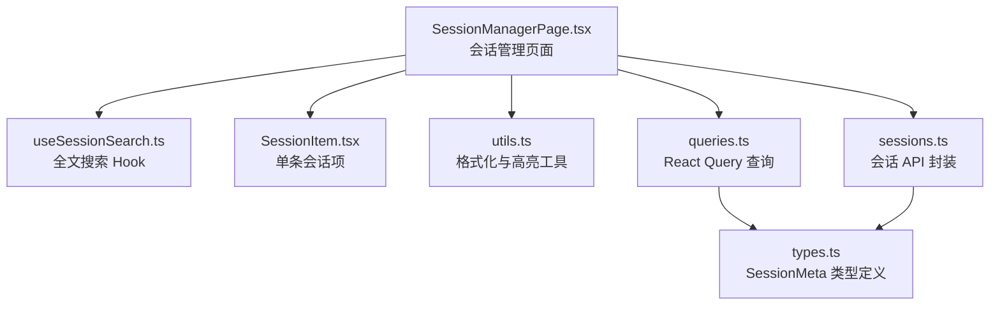
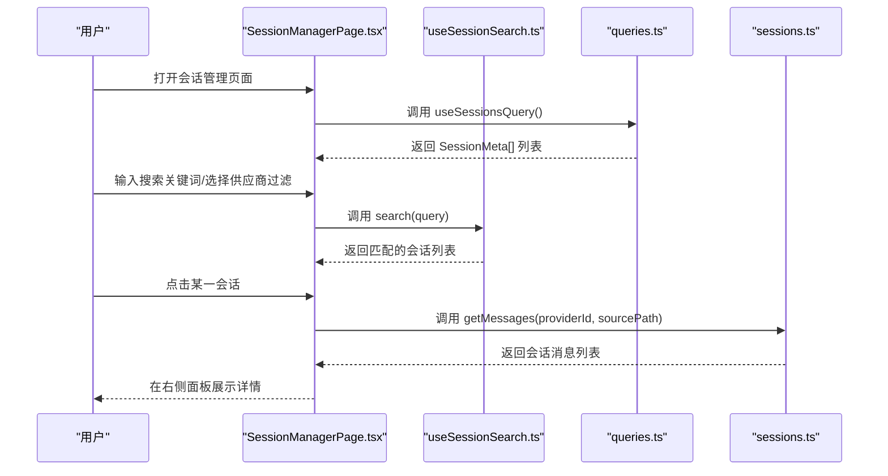
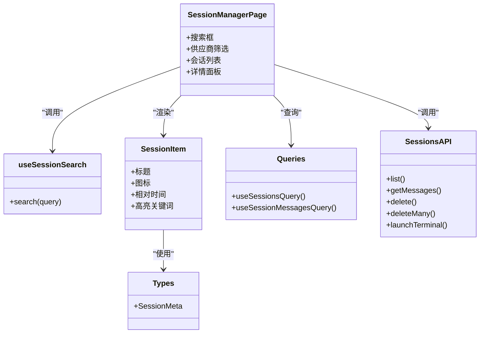

# 会话浏览与搜索

<cite>
**本文引用的文件**
- [src/components/sessions/SessionManagerPage.tsx](file://src/components/sessions/SessionManagerPage.tsx)
- [src/hooks/useSessionSearch.ts](file://src/hooks/useSessionSearch.ts)
- [src/components/sessions/SessionItem.tsx](file://src/components/sessions/SessionItem.tsx)
- [src/components/sessions/utils.ts](file://src/components/sessions/utils.ts)
- [src/lib/query/queries.ts](file://src/lib/query/queries.ts)
- [src/lib/api/sessions.ts](file://src/lib/api/sessions.ts)
- [src/types.ts](file://src/types.ts)
- [docs/user-manual/en/3-extensions/3.4-sessions.md](file://docs/user-manual/en/3-extensions/3.4-sessions.md)
- [docs/user-manual/ja/3-extensions/3.4-sessions.md](file://docs/user-manual/ja/3-extensions/3.4-sessions.md)
</cite>

## 目录
1. [简介](#简介)
2. [项目结构](#项目结构)
3. [核心组件](#核心组件)
4. [架构总览](#架构总览)
5. [详细组件分析](#详细组件分析)
6. [依赖关系分析](#依赖关系分析)
7. [性能考量](#性能考量)
8. [故障排查指南](#故障排查指南)
9. [结论](#结论)
10. [附录](#附录)

## 简介
本指南面向 CC Switch 的“会话浏览与搜索”功能，帮助用户高效地在多供应商（Claude Code、Codex、OpenCode、OpenClaw、Gemini CLI、Hermes）的会话记录中进行浏览、搜索与筛选。内容涵盖：
- 会话列表的显示方式与字段含义
- 按供应商类型过滤的实现机制
- 全文搜索的工作原理与使用方法
- 会话排序与筛选的操作步骤
- 实际搜索示例与最佳实践

## 项目结构
会话管理功能主要由前端页面、查询与 API 层、以及会话搜索 Hook 组成，整体采用两栏布局：左侧为会话列表与搜索/筛选工具栏，右侧为选中会话的详情与对话历史。

图表来源
- [src/components/sessions/SessionManagerPage.tsx:1-120](file://src/components/sessions/SessionManagerPage.tsx#L1-L120)
- [src/hooks/useSessionSearch.ts:1-73](file://src/hooks/useSessionSearch.ts#L1-L73)
- [src/components/sessions/SessionItem.tsx:1-111](file://src/components/sessions/SessionItem.tsx#L1-L111)
- [src/components/sessions/utils.ts:1-176](file://src/components/sessions/utils.ts#L1-L176)
- [src/lib/query/queries.ts:137-156](file://src/lib/query/queries.ts#L137-L156)
- [src/lib/api/sessions.ts:15-55](file://src/lib/api/sessions.ts#L15-L55)
- [src/types.ts:428-446](file://src/types.ts#L428-L446)

章节来源
- [src/components/sessions/SessionManagerPage.tsx:1-120](file://src/components/sessions/SessionManagerPage.tsx#L1-L120)
- [src/lib/query/queries.ts:137-156](file://src/lib/query/queries.ts#L137-L156)
- [src/lib/api/sessions.ts:15-55](file://src/lib/api/sessions.ts#L15-L55)
- [src/types.ts:428-446](file://src/types.ts#L428-L446)

## 核心组件
- 会话管理页面：负责渲染两栏界面、搜索与筛选、批量操作、以及会话详情展示。
- 全文搜索 Hook：基于 FlexSearch 构建索引，支持按会话 ID、标题、摘要、项目目录、源路径等字段检索。
- 会话项组件：展示每条会话的供应商图标、标题、相对活跃时间，并支持高亮关键词。
- 查询与 API：通过 React Query 获取会话列表与消息，封装删除、批量删除与终端恢复命令调用。
- 类型定义：明确会话元数据结构，包括供应商标识、会话 ID、标题、摘要、项目目录、时间戳、源路径等。

章节来源
- [src/components/sessions/SessionManagerPage.tsx:71-131](file://src/components/sessions/SessionManagerPage.tsx#L71-L131)
- [src/hooks/useSessionSearch.ts:14-73](file://src/hooks/useSessionSearch.ts#L14-L73)
- [src/components/sessions/SessionItem.tsx:21-111](file://src/components/sessions/SessionItem.tsx#L21-L111)
- [src/lib/query/queries.ts:137-156](file://src/lib/query/queries.ts#L137-L156)
- [src/lib/api/sessions.ts:15-55](file://src/lib/api/sessions.ts#L15-L55)
- [src/types.ts:428-446](file://src/types.ts#L428-L446)

## 架构总览
会话浏览与搜索的整体流程如下：
- 页面初始化：通过查询 Hook 获取会话列表。
- 搜索与筛选：Hook 基于 FlexSearch 对会话元数据建立索引；支持按供应商类型过滤与关键词全文检索。
- 列表渲染：根据搜索结果与筛选条件生成会话列表，支持相对时间显示与关键词高亮。
- 详情展示：选中会话后，拉取对应的消息列表并在右侧面板展示。
- 批量操作：支持全选、清空、批量删除等操作。

图表来源
- [src/components/sessions/SessionManagerPage.tsx:74-138](file://src/components/sessions/SessionManagerPage.tsx#L74-L138)
- [src/hooks/useSessionSearch.ts:50-72](file://src/hooks/useSessionSearch.ts#L50-L72)
- [src/lib/query/queries.ts:137-156](file://src/lib/query/queries.ts#L137-L156)
- [src/lib/api/sessions.ts:20-34](file://src/lib/api/sessions.ts#L20-L34)

## 详细组件分析

### 会话列表与显示字段
- 供应商图标：根据 providerId 显示对应图标，便于快速识别来源。
- 会话标题：优先使用标题，其次使用项目目录基名，最后使用会话 ID 前缀。
- 相对活跃时间：显示“刚刚”、“X分钟前”、“X小时前”、“X天前”或具体日期。
- 选中态与交互：点击会话项可切换详情展示；支持批量选择与高亮关键词。

章节来源
- [src/components/sessions/SessionItem.tsx:32-111](file://src/components/sessions/SessionItem.tsx#L32-L111)
- [src/components/sessions/utils.ts:126-132](file://src/components/sessions/utils.ts#L126-L132)
- [src/components/sessions/utils.ts:72-88](file://src/components/sessions/utils.ts#L72-L88)

### 供应商类型过滤机制
- 支持的供应商类型：全部、Codex、Claude Code、OpenCode、OpenClaw、Gemini CLI、Hermes。
- 过滤逻辑：Hook 内部先按 providerFilter 进行预过滤，再对剩余会话构建索引，从而缩小搜索范围并提升性能。

章节来源
- [src/components/sessions/SessionManagerPage.tsx:62-69](file://src/components/sessions/SessionManagerPage.tsx#L62-L69)
- [src/hooks/useSessionSearch.ts:22-25](file://src/hooks/useSessionSearch.ts#L22-L25)

### 全文搜索工作原理
- 索引字段：会话 ID、标题、摘要、项目目录、源路径。
- 检索策略：FlexSearch 全词索引，支持大小写不敏感与分词匹配。
- 排序规则：当查询为空时，按最近活跃时间倒序排列；有查询时返回匹配结果并维持原有顺序（由索引决定）。

章节来源
- [src/hooks/useSessionSearch.ts:27-48](file://src/hooks/useSessionSearch.ts#L27-L48)
- [src/hooks/useSessionSearch.ts:50-69](file://src/hooks/useSessionSearch.ts#L50-L69)

### 会话项目显示信息说明
- 时间戳相关字段
  - 创建时间：createdAt（毫秒）
  - 最近活跃时间：lastActiveAt（毫秒）
  - 相对时间：由工具函数根据当前时间差转换为“刚刚/分钟/小时/天前/日期”
- 供应商标识：providerId，用于区分来源（如 codex、claude、opencode、openclaw、gemini、hermes）
- 会话标题：title，若为空则回退到项目目录基名或会话 ID 前缀
- 项目目录：projectDir，用于显示工作目录
- 源路径：sourcePath，用于唯一标识会话来源（数据库或文件路径）
- 恢复命令：resumeCommand，用于在支持的平台通过终端恢复会话

章节来源
- [src/types.ts:428-446](file://src/types.ts#L428-L446)
- [src/components/sessions/utils.ts:67-88](file://src/components/sessions/utils.ts#L67-L88)
- [src/components/sessions/utils.ts:126-132](file://src/components/sessions/utils.ts#L126-L132)
- [src/lib/api/sessions.ts:42-53](file://src/lib/api/sessions.ts#L42-L53)

### 搜索框使用与匹配规则
- 打开搜索：点击顶部搜索按钮，展开搜索框；支持 Esc 关闭。
- 匹配字段：会话 ID、标题、摘要、项目目录、源路径。
- 匹配行为：关键词高亮显示，支持模糊匹配与分词匹配。
- 清空搜索：输入框失焦且内容为空时自动收起搜索框。

章节来源
- [src/components/sessions/SessionManagerPage.tsx:456-516](file://src/components/sessions/SessionManagerPage.tsx#L456-L516)
- [src/components/sessions/SessionItem.tsx:88-90](file://src/components/sessions/SessionItem.tsx#L88-L90)
- [src/components/sessions/utils.ts:157-175](file://src/components/sessions/utils.ts#L157-L175)

### 排序与筛选操作步骤
- 刷新：点击刷新按钮手动拉取最新会话列表。
- 供应商筛选：在筛选下拉中选择目标供应商，或选择“全部”查看全部会话。
- 搜索：在搜索框输入关键词，实时得到匹配结果。
- 排序：无显式排序控件时，查询为空时按最近活跃时间倒序排列；查询存在时按索引命中顺序返回。
- 批量管理：点击批量管理按钮进入选择模式，支持全选当前、清空已选与批量删除。

章节来源
- [src/components/sessions/SessionManagerPage.tsx:572-700](file://src/components/sessions/SessionManagerPage.tsx#L572-L700)
- [src/components/sessions/SessionManagerPage.tsx:716-767](file://src/components/sessions/SessionManagerPage.tsx#L716-L767)
- [src/hooks/useSessionSearch.ts:55-59](file://src/hooks/useSessionSearch.ts#L55-L59)

### 实际搜索示例与最佳实践
- 示例 1：查找特定项目目录下的会话
  - 步骤：在搜索框输入项目目录基名或完整路径片段，回车确认。
  - 效果：仅显示匹配该项目的会话。
- 示例 2：按供应商类型筛选
  - 步骤：在供应商下拉中选择目标供应商，如“OpenCode”。
  - 效果：仅显示该供应商的会话，缩小搜索范围。
- 示例 3：结合关键词与供应商筛选
  - 步骤：先选择供应商，再在搜索框输入关键词（如“部署”）。
  - 效果：在选定供应商范围内进行关键词匹配，提高准确性。
- 最佳实践
  - 优先使用供应商筛选缩小范围，再进行关键词搜索。
  - 使用“全部”作为初始视图，确认会话总数后再进行筛选。
  - 若关键词命中较多，建议配合供应商筛选进一步定位。

章节来源
- [docs/user-manual/en/3-extensions/3.4-sessions.md:45-54](file://docs/user-manual/en/3-extensions/3.4-sessions.md#L45-L54)
- [docs/user-manual/ja/3-extensions/3.4-sessions.md:30-35](file://docs/user-manual/ja/3-extensions/3.4-sessions.md#L30-L35)

## 依赖关系分析
- 组件耦合
  - SessionManagerPage 依赖 useSessionSearch 进行搜索与筛选，依赖 queries 与 sessions API 获取与操作数据。
  - SessionItem 依赖 utils 进行标题与时间格式化、关键词高亮。
- 数据流
  - 列表数据通过 React Query 缓存，API 层封装底层调用。
  - 搜索索引基于当前可见会话构建，减少不必要的计算。

图表来源
- [src/components/sessions/SessionManagerPage.tsx:71-131](file://src/components/sessions/SessionManagerPage.tsx#L71-L131)
- [src/hooks/useSessionSearch.ts:18-72](file://src/hooks/useSessionSearch.ts#L18-L72)
- [src/components/sessions/SessionItem.tsx:21-111](file://src/components/sessions/SessionItem.tsx#L21-L111)
- [src/lib/query/queries.ts:137-156](file://src/lib/query/queries.ts#L137-L156)
- [src/lib/api/sessions.ts:15-55](file://src/lib/api/sessions.ts#L15-L55)
- [src/types.ts:428-446](file://src/types.ts#L428-L446)

章节来源
- [src/components/sessions/SessionManagerPage.tsx:71-131](file://src/components/sessions/SessionManagerPage.tsx#L71-L131)
- [src/hooks/useSessionSearch.ts:18-72](file://src/hooks/useSessionSearch.ts#L18-L72)
- [src/components/sessions/SessionItem.tsx:21-111](file://src/components/sessions/SessionItem.tsx#L21-L111)
- [src/lib/query/queries.ts:137-156](file://src/lib/query/queries.ts#L137-L156)
- [src/lib/api/sessions.ts:15-55](file://src/lib/api/sessions.ts#L15-L55)
- [src/types.ts:428-446](file://src/types.ts#L428-L446)

## 性能考量
- 搜索索引构建：每次筛选或查询变化时，Hook 会对当前可见会话重建索引，建议先进行供应商筛选再输入关键词，以减少索引规模。
- 列表渲染优化：页面使用虚拟滚动渲染消息列表，降低长对话场景的渲染压力。
- 查询缓存：会话列表与消息查询使用 React Query 缓存，减少重复请求。

章节来源
- [src/hooks/useSessionSearch.ts:27-48](file://src/hooks/useSessionSearch.ts#L27-L48)
- [src/lib/query/queries.ts:137-156](file://src/lib/query/queries.ts#L137-L156)

## 故障排查指南
- 无法看到会话列表
  - 检查是否已正确配置相关 CLI 工具（Claude Code、Codex、OpenCode、OpenClaw、Gemini CLI、Hermes）。
  - 点击刷新按钮尝试重新拉取数据。
- 搜索无结果
  - 确认关键词是否准确，可尝试更短或更具体的关键词。
  - 先选择供应商类型，缩小搜索范围后再输入关键词。
- 删除失败
  - 确认会话具备 sourcePath；仅具备 sourcePath 的会话可被删除。
  - 查看批量删除结果提示，关注失败数量与错误信息。

章节来源
- [src/components/sessions/SessionManagerPage.tsx:357-360](file://src/components/sessions/SessionManagerPage.tsx#L357-L360)
- [src/components/sessions/SessionManagerPage.tsx:352-355](file://src/components/sessions/SessionManagerPage.tsx#L352-L355)

## 结论
CC Switch 的会话浏览与搜索功能通过清晰的两栏布局、灵活的供应商筛选与高效的全文搜索，帮助用户在多供应商环境下快速定位所需会话。结合相对时间显示与关键词高亮，用户可在海量会话中高效完成浏览、检索与管理任务。

## 附录
- 支持的应用与会话存储位置参考用户手册中的说明，涵盖 Claude Code、Codex、OpenCode、OpenClaw、Gemini CLI、Hermes 等。
- 术语说明
  - 供应商：指具体的服务提供商（如 Claude Code、Codex 等）
  - 会话：一次对话过程的记录，包含消息与元数据
  - 源路径：唯一标识会话来源的字符串（数据库或文件路径）

章节来源
- [docs/user-manual/en/3-extensions/3.4-sessions.md:5-15](file://docs/user-manual/en/3-extensions/3.4-sessions.md#L5-L15)
- [docs/user-manual/ja/3-extensions/3.4-sessions.md:7-15](file://docs/user-manual/ja/3-extensions/3.4-sessions.md#L7-L15)