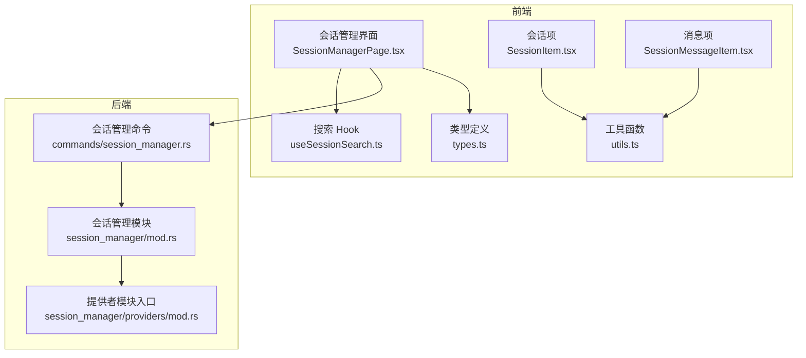
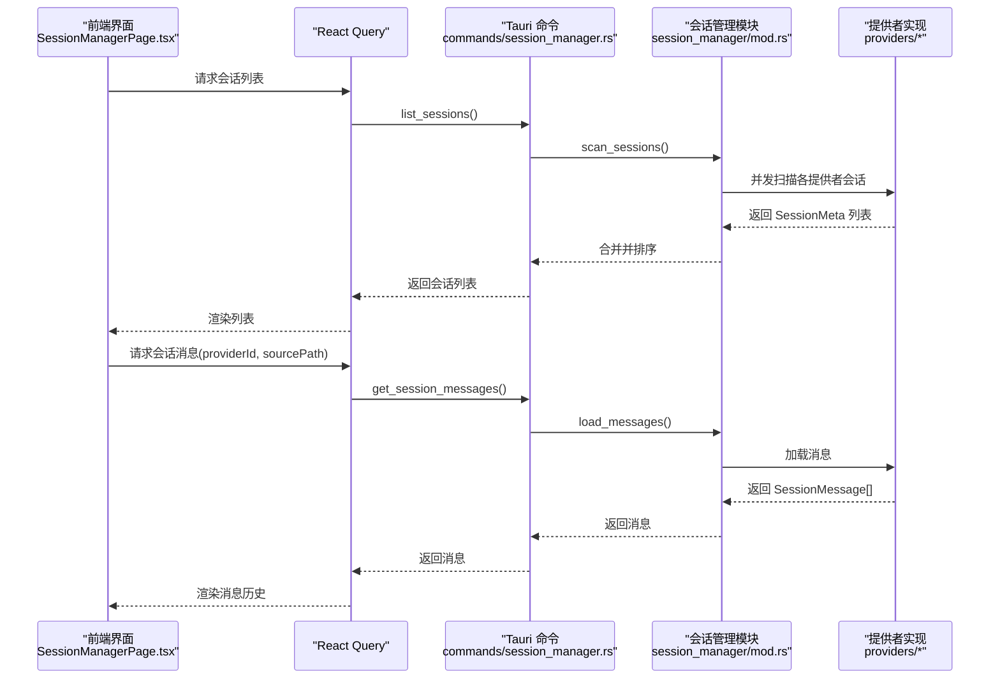
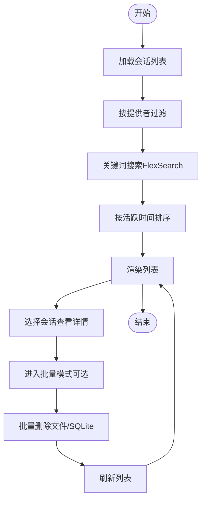
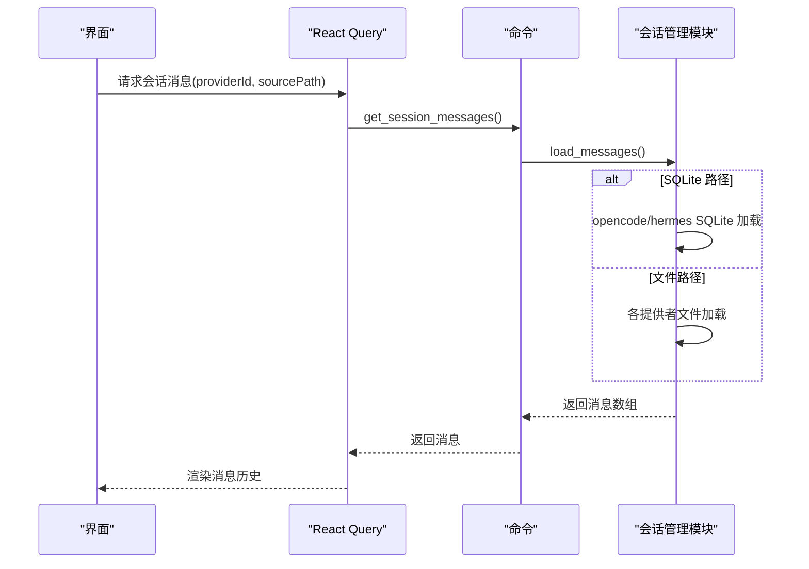
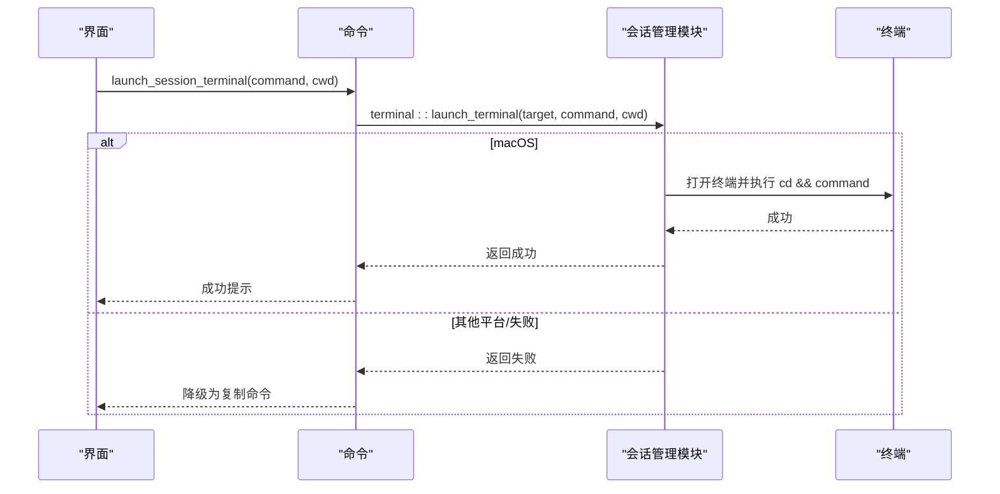
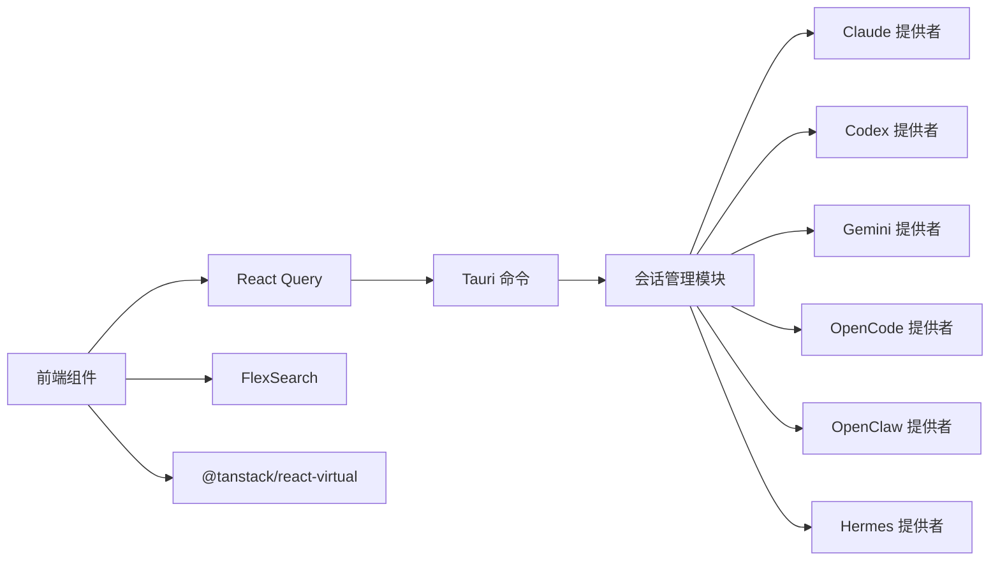

# 会话管理

<cite>
**本文引用的文件**
- [会话管理界面（SessionManagerPage.tsx）](file://src/components/sessions/SessionManagerPage.tsx)
- [会话项组件（SessionItem.tsx）](file://src/components/sessions/SessionItem.tsx)
- [会话消息项组件（SessionMessageItem.tsx）](file://src/components/sessions/SessionMessageItem.tsx)
- [会话工具函数（utils.ts）](file://src/components/sessions/utils.ts)
- [会话搜索 Hook（useSessionSearch.ts）](file://src/hooks/useSessionSearch.ts)
- [会话类型定义（types.ts）](file://src/types.ts)
- [会话管理器 Rust 模块（mod.rs）](file://src-tauri/src/session_manager/mod.rs)
- [会话管理命令（session_manager.rs）](file://src-tauri/src/commands/session_manager.rs)
- [会话管理 PRD 文档（session-manager.md）](file://session-manager.md)
- [用户手册：会话管理（3.4-sessions.md）](file://docs/user-manual/en/3-extensions/3.4-sessions.md)
- [备份与导入导出（backup.rs）](file://src-tauri/src/database/backup.rs)
- [备份列表组件（BackupListSection.tsx）](file://src/components/settings/BackupListSection.tsx)
- [会话提供者模块入口（providers/mod.rs）](file://src-tauri/src/session_manager/providers/mod.rs)
</cite>

## 目录
1. [简介](#简介)
2. [项目结构](#项目结构)
3. [核心组件](#核心组件)
4. [架构总览](#架构总览)
5. [详细组件分析](#详细组件分析)
6. [依赖关系分析](#依赖关系分析)
7. [性能考量](#性能考量)
8. [故障排除指南](#故障排除指南)
9. [结论](#结论)
10. [附录](#附录)

## 简介
本指南面向 CC Switch 的会话管理器使用者，系统讲解会话的概念、在 AI 工具中的作用以及数据存储方式；详述会话的浏览、搜索与恢复功能，包括按时间、工具类型与关键词的筛选；深入说明支持的会话来源（Claude、Codex、Gemini、OpenCode、Hermes、OpenClaw）与数据导入流程；提供会话详情查看、消息历史检索与对话恢复的操作步骤；解释会话数据的备份与导出机制（数据格式与存储位置）；并给出实际会话管理示例、搜索技巧与数据迁移建议，以及故障排除与性能优化建议。

## 项目结构
会话管理器由前端 React 组件与后端 Tauri/Rust 命令共同构成，采用“两栏布局”：左侧为会话列表与搜索/筛选工具栏，右侧为所选会话的消息历史与恢复入口。Rust 层负责扫描多来源会话、加载消息、删除会话与终端恢复调用。

**图表来源**
- [会话管理界面（SessionManagerPage.tsx）:1-1138](file://src/components/sessions/SessionManagerPage.tsx#L1-L1138)
- [会话项组件（SessionItem.tsx）:1-111](file://src/components/sessions/SessionItem.tsx#L1-L111)
- [会话消息项组件（SessionMessageItem.tsx）:1-124](file://src/components/sessions/SessionMessageItem.tsx#L1-L124)
- [会话搜索 Hook（useSessionSearch.ts）:1-73](file://src/hooks/useSessionSearch.ts#L1-L73)
- [会话工具函数（utils.ts）:1-176](file://src/components/sessions/utils.ts#L1-L176)
- [会话类型定义（types.ts）:429-445](file://src/types.ts#L429-L445)
- [会话管理命令（session_manager.rs）:1-86](file://src-tauri/src/commands/session_manager.rs#L1-L86)
- [会话管理器 Rust 模块（mod.rs）:1-352](file://src-tauri/src/session_manager/mod.rs#L1-L352)
- [会话提供者模块入口（providers/mod.rs）:1-8](file://src-tauri/src/session_manager/providers/mod.rs#L1-L8)

**章节来源**
- [会话管理界面（SessionManagerPage.tsx）:1-1138](file://src/components/sessions/SessionManagerPage.tsx#L1-L1138)
- [会话管理命令（session_manager.rs）:1-86](file://src-tauri/src/commands/session_manager.rs#L1-L86)
- [会话管理器 Rust 模块（mod.rs）:1-352](file://src-tauri/src/session_manager/mod.rs#L1-L352)

## 核心组件
- 会话管理界面（SessionManagerPage.tsx）
  - 负责会话列表渲染、搜索、筛选、批量删除、详情区消息加载与滚动定位、终端恢复调用。
  - 使用虚拟列表渲染消息，支持按关键词高亮与展开/折叠长消息。
- 会话项组件（SessionItem.tsx）
  - 渲染单个会话条目，支持选择模式下的复选框、高亮标题、相对时间显示。
- 会话消息项组件（SessionMessageItem.tsx）
  - 渲染消息时间线，支持复制、展开/折叠、按角色着色。
- 会话搜索 Hook（useSessionSearch.ts）
  - 基于 FlexSearch 的全文搜索，索引会话元数据（ID、标题、摘要、项目目录、源路径）。
- 会话工具函数（utils.ts）
  - 提供会话键生成、标题格式化、时间格式化、角色标签与颜色、Codex 特殊消息处理、文本高亮等。
- 会话类型定义（types.ts）
  - 定义 SessionMeta、SessionMessage 等核心类型，统一前后端数据契约。

**章节来源**
- [会话管理界面（SessionManagerPage.tsx）:1-1138](file://src/components/sessions/SessionManagerPage.tsx#L1-L1138)
- [会话项组件（SessionItem.tsx）:1-111](file://src/components/sessions/SessionItem.tsx#L1-L111)
- [会话消息项组件（SessionMessageItem.tsx）:1-124](file://src/components/sessions/SessionMessageItem.tsx#L1-L124)
- [会话搜索 Hook（useSessionSearch.ts）:1-73](file://src/hooks/useSessionSearch.ts#L1-L73)
- [会话工具函数（utils.ts）:1-176](file://src/components/sessions/utils.ts#L1-L176)
- [会话类型定义（types.ts）:429-445](file://src/types.ts#L429-L445)

## 架构总览
会话管理器采用“前端 UI + 后端命令”的分层架构：
- 前端通过 React Query 查询会话列表与消息，使用虚拟列表与搜索索引提升性能。
- 后端通过 Tauri 命令调用 Rust 会话管理模块，扫描多来源会话、加载消息、删除会话、触发终端恢复。
- Rust 模块按提供者拆分实现，统一暴露扫描、加载、删除与终端恢复接口。

**图表来源**
- [会话管理界面（SessionManagerPage.tsx）:1-1138](file://src/components/sessions/SessionManagerPage.tsx#L1-L1138)
- [会话管理命令（session_manager.rs）:1-86](file://src-tauri/src/commands/session_manager.rs#L1-L86)
- [会话管理器 Rust 模块（mod.rs）:1-352](file://src-tauri/src/session_manager/mod.rs#L1-L352)
- [会话提供者模块入口（providers/mod.rs）:1-8](file://src-tauri/src/session_manager/providers/mod.rs#L1-L8)

## 详细组件分析

### 会话浏览与筛选
- 列表展示
  - 左侧列表显示提供者图标、会话标题与相对活跃时间；支持进入选择模式进行批量操作。
- 搜索
  - 支持关键词全文搜索，索引字段包括会话 ID、标题、摘要、项目目录、源路径。
- 过滤
  - 支持按提供者（全部/Claude/Codex/Gemini/OpenCode/OpenClaw/Hermes）筛选。
- 排序
  - 默认按最近活跃时间倒序；无活跃时间时按创建时间倒序。
- 批量管理
  - 支持全选/清空、批量删除；删除时区分文件路径与 SQLite 路径，分别走文件删除或 SQLite 删除路径。

**图表来源**
- [会话管理界面（SessionManagerPage.tsx）:1-1138](file://src/components/sessions/SessionManagerPage.tsx#L1-L1138)
- [会话搜索 Hook（useSessionSearch.ts）:1-73](file://src/hooks/useSessionSearch.ts#L1-L73)
- [会话管理器 Rust 模块（mod.rs）:1-352](file://src-tauri/src/session_manager/mod.rs#L1-L352)

**章节来源**
- [会话管理界面（SessionManagerPage.tsx）:1-1138](file://src/components/sessions/SessionManagerPage.tsx#L1-L1138)
- [会话搜索 Hook（useSessionSearch.ts）:1-73](file://src/hooks/useSessionSearch.ts#L1-L73)
- [会话管理器 Rust 模块（mod.rs）:1-352](file://src-tauri/src/session_manager/mod.rs#L1-L352)

### 会话详情与消息历史
- 详情区展示
  - 标题、最后活跃时间、项目目录（可复制）、恢复命令（可复制/终端恢复）、消息历史。
- 消息历史
  - 按角色（用户/助手/系统/工具）着色；支持复制消息、展开/折叠长内容；支持在当前会话内搜索并高亮。
- 虚拟列表
  - 使用虚拟化渲染长消息列表，保证滚动流畅。

**图表来源**
- [会话管理界面（SessionManagerPage.tsx）:1-1138](file://src/components/sessions/SessionManagerPage.tsx#L1-L1138)
- [会话管理命令（session_manager.rs）:1-86](file://src-tauri/src/commands/session_manager.rs#L1-L86)
- [会话管理器 Rust 模块（mod.rs）:93-112](file://src-tauri/src/session_manager/mod.rs#L93-L112)

**章节来源**
- [会话管理界面（SessionManagerPage.tsx）:1-1138](file://src/components/sessions/SessionManagerPage.tsx#L1-L1138)
- [会话消息项组件（SessionMessageItem.tsx）:1-124](file://src/components/sessions/SessionMessageItem.tsx#L1-L124)
- [会话管理器 Rust 模块（mod.rs）:93-112](file://src-tauri/src/session_manager/mod.rs#L93-L112)

### 会话恢复与终端集成
- 恢复命令
  - 支持复制恢复命令；在 macOS 上可直接在首选终端（Terminal/kitty/等）中恢复。
- 目录与恢复
  - 若可推断项目目录，恢复时自动切换工作目录；否则仅执行恢复命令。
- 降级策略
  - 无权限或终端不可用时自动降级为复制命令，并提示修复步骤。

**图表来源**
- [会话管理界面（SessionManagerPage.tsx）:228-250](file://src/components/sessions/SessionManagerPage.tsx#L228-L250)
- [会话管理命令（session_manager.rs）:28-59](file://src-tauri/src/commands/session_manager.rs#L28-L59)
- [会话管理器 Rust 模块（mod.rs）:1-352](file://src-tauri/src/session_manager/mod.rs#L1-L352)

**章节来源**
- [会话管理界面（SessionManagerPage.tsx）:228-250](file://src/components/sessions/SessionManagerPage.tsx#L228-L250)
- [会话管理命令（session_manager.rs）:28-59](file://src-tauri/src/commands/session_manager.rs#L28-L59)

### 支持的会话来源与数据导入
- 支持来源
  - Claude Code、Codex、Gemini CLI、OpenCode、OpenClaw、Hermes。
- 数据导入
  - 会话日志可从各工具的本地存储导入，无需代理拦截；部分来源支持 SQLite 存储，删除与加载时自动识别。
- 存储位置参考
  - 用户手册提供了各工具的会话存储位置参考，便于排查与迁移。

**章节来源**
- [会话管理 PRD（session-manager.md）:1-269](file://session-manager.md#L1-L269)
- [用户手册：会话管理（3.4-sessions.md）:1-54](file://docs/user-manual/en/3-extensions/3.4-sessions.md#L1-L54)
- [会话管理器 Rust 模块（mod.rs）:58-91](file://src-tauri/src/session_manager/mod.rs#L58-L91)

### 会话删除与批量管理
- 删除策略
  - 文件路径：校验根目录合法性后删除；SQLite 路径：直接走 SQLite 删除。
- 批量删除
  - 支持一次提交多个删除请求，后端收集结果并返回成功/失败明细。

**章节来源**
- [会话管理器 Rust 模块（mod.rs）:114-189](file://src-tauri/src/session_manager/mod.rs#L114-L189)
- [会话管理命令（session_manager.rs）:62-85](file://src-tauri/src/commands/session_manager.rs#L62-L85)
- [会话管理界面（SessionManagerPage.tsx）:252-355](file://src/components/sessions/SessionManagerPage.tsx#L252-L355)

## 依赖关系分析
- 前端依赖
  - React Query：会话与消息的查询与缓存。
  - FlexSearch：全文搜索索引构建与查询。
  - 虚拟列表：@tanstack/react-virtual，提升长列表性能。
- 后端依赖
  - 多提供者并发扫描：线程池并发执行各提供者扫描。
  - 路径校验与规范化：确保删除与加载的安全性。
  - SQLite 适配：OpenCode/Hermes 的 SQLite 会话存储。

**图表来源**
- [会话管理界面（SessionManagerPage.tsx）:1-1138](file://src/components/sessions/SessionManagerPage.tsx#L1-L1138)
- [会话管理命令（session_manager.rs）:1-86](file://src-tauri/src/commands/session_manager.rs#L1-L86)
- [会话管理器 Rust 模块（mod.rs）:1-352](file://src-tauri/src/session_manager/mod.rs#L1-L352)

**章节来源**
- [会话管理界面（SessionManagerPage.tsx）:1-1138](file://src/components/sessions/SessionManagerPage.tsx#L1-L1138)
- [会话管理器 Rust 模块（mod.rs）:58-91](file://src-tauri/src/session_manager/mod.rs#L58-L91)

## 性能考量
- 列表渲染
  - 使用虚拟列表渲染消息，减少 DOM 节点数量，提升滚动性能。
- 搜索性能
  - FlexSearch 全量索引，搜索复杂度低；按提供者过滤后再索引，缩小搜索空间。
- 并发扫描
  - Rust 层对多提供者扫描使用线程池并发执行，缩短总扫描时间。
- 缓存与增量
  - 列表默认按活跃时间排序，未活跃会话可延迟加载详情，降低首屏压力。

[本节为通用性能建议，不直接分析具体文件，故无“章节来源”]

## 故障排除指南
- 无法找到会话
  - 检查提供者配置目录是否正确；确认会话存储位置是否存在；尝试刷新列表。
- 恢复命令无效
  - 确认终端目标与权限（macOS 需开启自动化权限）；若失败将自动降级为复制命令。
- 删除失败
  - 检查会话源路径是否在提供者根目录内；SQLite 会话需使用带前缀的源路径。
- 消息加载异常
  - 某些来源的消息格式可能变化，详情页会提示解析失败；可复制原始文件路径进行手动检查。

**章节来源**
- [会话管理器 Rust 模块（mod.rs）:141-189](file://src-tauri/src/session_manager/mod.rs#L141-L189)
- [会话管理命令（session_manager.rs）:28-59](file://src-tauri/src/commands/session_manager.rs#L28-L59)

## 结论
CC Switch 的会话管理器通过“前端搜索 + 后端并发扫描 + 统一消息加载”的架构，实现了对多来源 AI 工具会话的统一管理。其特性包括：全文搜索、按提供者筛选、批量删除、消息历史查看与恢复、终端一键恢复与降级策略。配合 SQLite 与文件两种存储方式，满足不同工具的数据结构差异。建议在日常使用中结合搜索与筛选快速定位会话，利用批量删除清理冗余记录，并定期备份数据库以防数据丢失。

[本节为总结性内容，不直接分析具体文件，故无“章节来源”]

## 附录

### 会话数据备份与导出
- 备份机制
  - 提供数据库 SQL 导出/导入与二进制快照备份，支持自动备份与保留数量配置。
- 导出格式
  - SQL 导出头部包含标识，便于识别 CC Switch 生成的备份文件。
- 存储位置
  - 备份文件位于应用配置目录，可通过设置面板查看与管理。

**章节来源**
- [备份与导入导出（backup.rs）:1-43](file://src-tauri/src/database/backup.rs#L1-L43)
- [备份列表组件（BackupListSection.tsx）:1-48](file://src/components/settings/BackupListSection.tsx#L1-L48)

### 实际会话管理示例与搜索技巧
- 示例：查找某次讨论的关键词
  - 在左侧面板顶部搜索框输入关键词，命中会话后点击进入详情查看上下文。
- 示例：按工具类型筛选
  - 使用提供者筛选器仅查看 Codex 或 Claude 会话，缩小范围。
- 示例：批量删除
  - 进入批量模式，勾选多个会话后一次性删除，适合清理历史会话。
- 示例：恢复对话
  - 在详情页点击“在终端恢复”，自动切换目录并执行恢复命令；失败时复制命令手动执行。

**章节来源**
- [会话管理界面（SessionManagerPage.tsx）:1-1138](file://src/components/sessions/SessionManagerPage.tsx#L1-L1138)
- [用户手册：会话管理（3.4-sessions.md）:1-54](file://docs/user-manual/en/3-extensions/3.4-sessions.md#L1-L54)

### 数据迁移指南
- 迁移步骤
  - 在新环境导出 SQL 备份，复制到目标机器后导入；或使用 WebDAV/S3 同步功能进行迁移。
  - 确保提供者配置目录指向正确的存储位置，避免会话扫描不到。
- 注意事项
  - 导入 SQL 备份后可能需要重新选择当前提供者以刷新实时配置。
  - 对于 SQLite 会话，确保源路径前缀与目标环境一致。

**章节来源**
- [会话管理 PRD（session-manager.md）:1-269](file://session-manager.md#L1-L269)
- [备份与导入导出（backup.rs）:1-43](file://src-tauri/src/database/backup.rs#L1-L43)