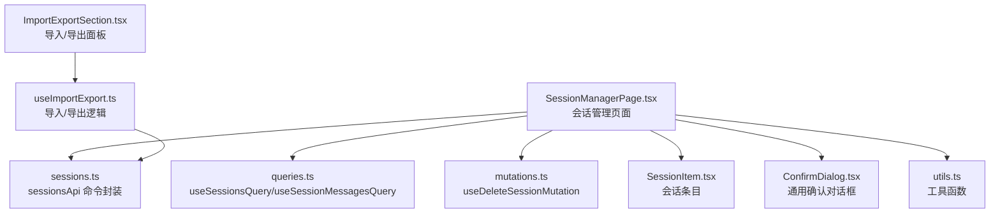
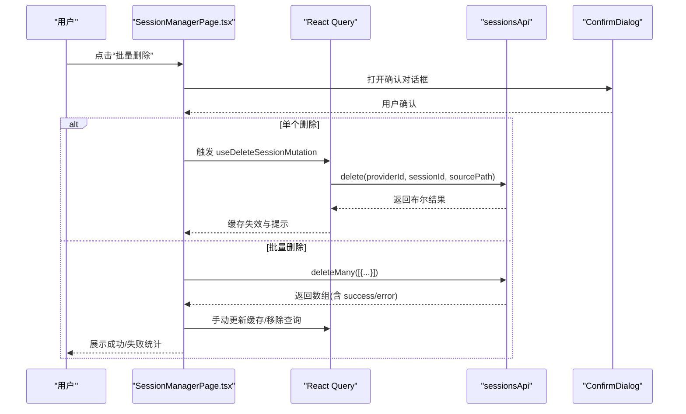
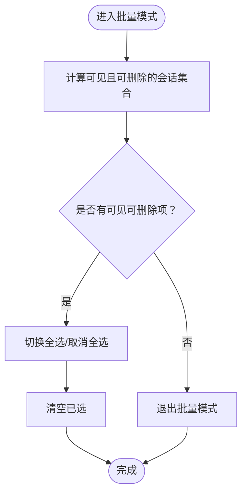
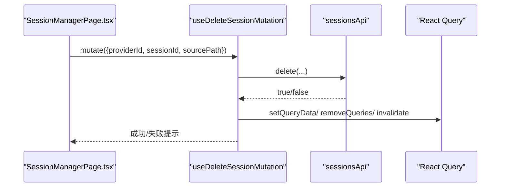
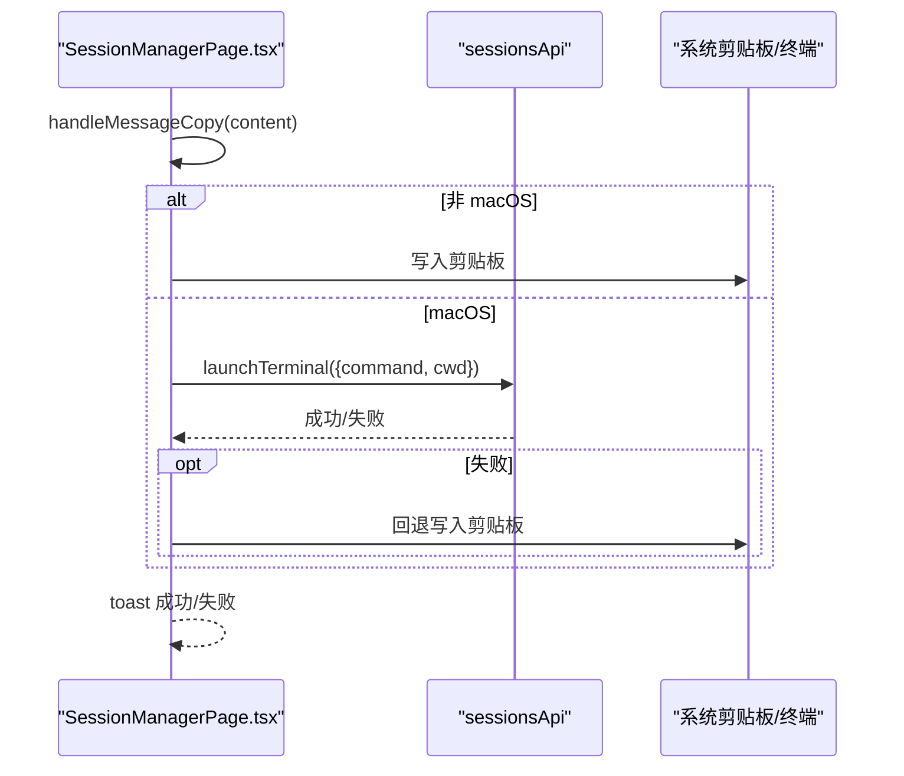
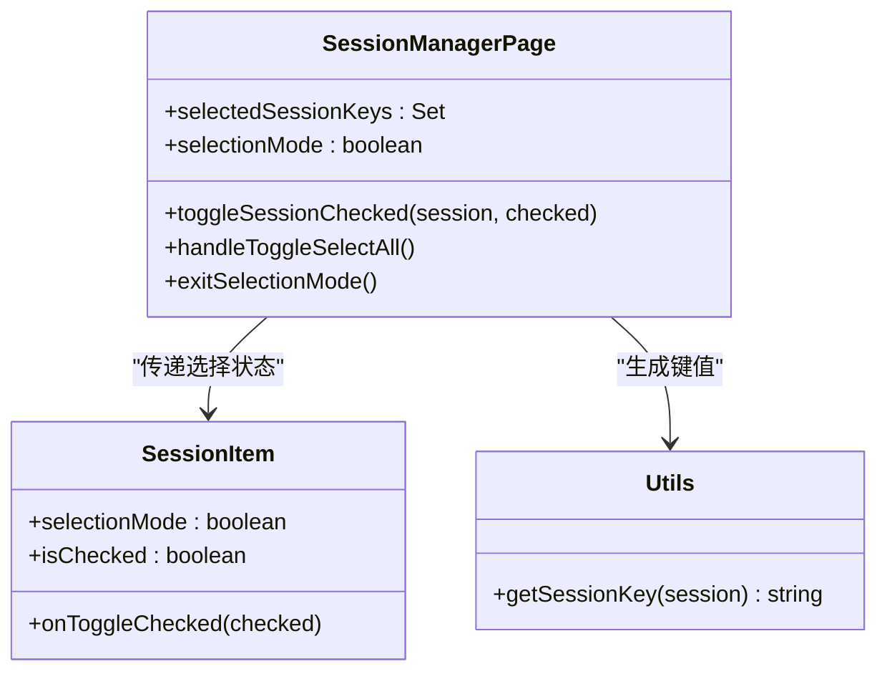
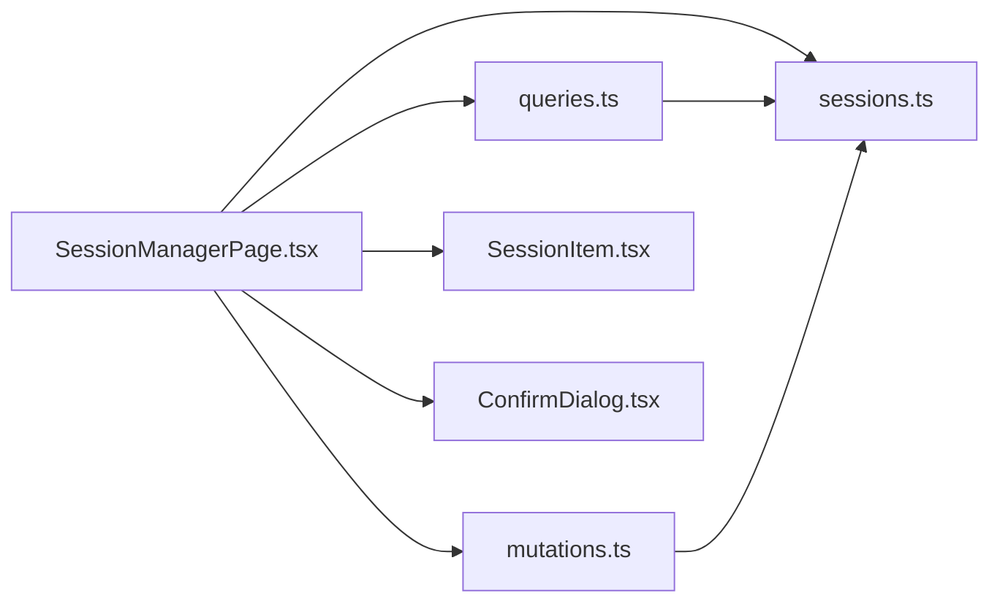

# 会话管理操作

<cite>
**本文引用的文件**
- [SessionManagerPage.tsx](file://src/components/sessions/SessionManagerPage.tsx)
- [SessionItem.tsx](file://src/components/sessions/SessionItem.tsx)
- [utils.ts](file://src/components/sessions/utils.ts)
- [sessions.ts](file://src/lib/api/sessions.ts)
- [queries.ts](file://src/lib/query/queries.ts)
- [mutations.ts](file://src/lib/query/mutations.ts)
- [ConfirmDialog.tsx](file://src/components/ConfirmDialog.tsx)
- [ImportExportSection.tsx](file://src/components/settings/ImportExportSection.tsx)
- [useImportExport.ts](file://src/hooks/useImportExport.ts)
</cite>

## 目录
1. [简介](#简介)
2. [项目结构](#项目结构)
3. [核心组件](#核心组件)
4. [架构总览](#架构总览)
5. [详细组件分析](#详细组件分析)
6. [依赖关系分析](#依赖关系分析)
7. [性能考量](#性能考量)
8. [故障排除指南](#故障排除指南)
9. [结论](#结论)
10. [附录](#附录)

## 简介
本指南面向 CC Switch 用户与维护者，系统讲解“会话管理”页面中的操作流程与实现机制，覆盖以下主题：
- 批量管理模式的启用与使用：全选、取消选择、清空选择
- 单个会话删除与批量删除的实现路径
- 会话选择状态管理：界面变化与交互行为
- 会话复制、导出与备份（基于应用层导入/导出能力）
- 删除安全确认机制与不可恢复性说明
- 最佳实践与故障排除、性能优化建议

## 项目结构
会话管理位于前端组件与查询/命令层之间，采用“页面组件 + 查询钩子 + API 命令 + 确认对话框”的分层设计。

图表来源
- [SessionManagerPage.tsx:1-120](file://src/components/sessions/SessionManagerPage.tsx#L1-L120)
- [queries.ts:137-156](file://src/lib/query/queries.ts#L137-L156)
- [mutations.ts:317-359](file://src/lib/query/mutations.ts#L317-L359)
- [sessions.ts:15-55](file://src/lib/api/sessions.ts#L15-L55)
- [SessionItem.tsx:1-111](file://src/components/sessions/SessionItem.tsx#L1-L111)
- [ConfirmDialog.tsx:1-76](file://src/components/ConfirmDialog.tsx#L1-L76)
- [utils.ts:55-176](file://src/components/sessions/utils.ts#L55-L176)
- [ImportExportSection.tsx:1-213](file://src/components/settings/ImportExportSection.tsx#L1-L213)
- [useImportExport.ts:1-204](file://src/hooks/useImportExport.ts#L1-L204)

章节来源
- [SessionManagerPage.tsx:1-120](file://src/components/sessions/SessionManagerPage.tsx#L1-L120)
- [queries.ts:137-156](file://src/lib/query/queries.ts#L137-L156)
- [sessions.ts:15-55](file://src/lib/api/sessions.ts#L15-L55)

## 核心组件
- 会话管理页面：负责筛选、搜索、批量选择、删除、复制、终端恢复等交互与状态管理
- 会话条目组件：渲染单个会话项，支持在批量模式下显示复选框
- 查询与命令：通过 React Query 管理会话列表与消息列表，通过 sessionsApi 调用后端命令
- 确认对话框：统一的删除确认 UI 组件
- 导入/导出：应用级配置导入/导出，可作为会话备份与迁移手段

章节来源
- [SessionManagerPage.tsx:71-120](file://src/components/sessions/SessionManagerPage.tsx#L71-L120)
- [SessionItem.tsx:21-41](file://src/components/sessions/SessionItem.tsx#L21-L41)
- [queries.ts:137-156](file://src/lib/query/queries.ts#L137-L156)
- [mutations.ts:317-359](file://src/lib/query/mutations.ts#L317-L359)
- [sessions.ts:15-55](file://src/lib/api/sessions.ts#L15-L55)
- [ConfirmDialog.tsx:13-35](file://src/components/ConfirmDialog.tsx#L13-L35)
- [ImportExportSection.tsx:14-36](file://src/components/settings/ImportExportSection.tsx#L14-L36)
- [useImportExport.ts:31-66](file://src/hooks/useImportExport.ts#L31-L66)

## 架构总览
会话管理采用“前端查询 + 命令调用 + 状态反馈”的闭环：
- 列表与消息：通过 useSessionsQuery 与 useSessionMessagesQuery 拉取数据
- 删除：单个使用 useDeleteSessionMutation，批量使用 sessionsApi.deleteMany
- 确认：删除前弹出 ConfirmDialog
- 反馈：通过 toast 与 React Query 缓存失效实现即时 UI 更新

图表来源
- [SessionManagerPage.tsx:252-355](file://src/components/sessions/SessionManagerPage.tsx#L252-L355)
- [mutations.ts:317-359](file://src/lib/query/mutations.ts#L317-L359)
- [sessions.ts:27-40](file://src/lib/api/sessions.ts#L27-L40)
- [ConfirmDialog.tsx:25-35](file://src/components/ConfirmDialog.tsx#L25-L35)

## 详细组件分析

### 批量管理模式与选择状态
- 启用批量管理：点击“批量管理”按钮进入选择模式，显示已选计数与批量操作区
- 全选/取消全选：根据当前过滤可见集合进行切换
- 清空已选：清空当前已选集合
- 选择范围：仅对具有 sourcePath 的会话生效（可删除的会话）

图表来源
- [SessionManagerPage.tsx:375-442](file://src/components/sessions/SessionManagerPage.tsx#L375-L442)
- [SessionManagerPage.tsx:418-432](file://src/components/sessions/SessionManagerPage.tsx#L418-L432)
- [SessionManagerPage.tsx:738-743](file://src/components/sessions/SessionManagerPage.tsx#L738-L743)

章节来源
- [SessionManagerPage.tsx:375-442](file://src/components/sessions/SessionManagerPage.tsx#L375-L442)
- [SessionManagerPage.tsx:418-432](file://src/components/sessions/SessionManagerPage.tsx#L418-L432)
- [SessionManagerPage.tsx:738-743](file://src/components/sessions/SessionManagerPage.tsx#L738-L743)

### 单个会话删除与批量删除
- 单个删除：使用 useDeleteSessionMutation，调用 sessionsApi.delete，成功后从缓存剔除对应会话并移除消息查询
- 批量删除：调用 sessionsApi.deleteMany，返回每个会话的执行结果，成功则更新缓存并移除对应消息查询，失败则提示第一条错误

图表来源
- [mutations.ts:317-359](file://src/lib/query/mutations.ts#L317-L359)
- [sessions.ts:27-34](file://src/lib/api/sessions.ts#L27-L34)

章节来源
- [SessionManagerPage.tsx:252-355](file://src/components/sessions/SessionManagerPage.tsx#L252-L355)
- [mutations.ts:317-359](file://src/lib/query/mutations.ts#L317-L359)
- [sessions.ts:27-40](file://src/lib/api/sessions.ts#L27-L40)

### 会话复制与终端恢复
- 复制：提供消息内容复制能力，复制成功/失败通过 toast 反馈
- 终端恢复：在非 macOS 平台复制恢复命令，在 macOS 平台尝试直接启动终端；失败时回退到复制命令

图表来源
- [SessionManagerPage.tsx:203-250](file://src/components/sessions/SessionManagerPage.tsx#L203-L250)
- [sessions.ts:42-53](file://src/lib/api/sessions.ts#L42-L53)

章节来源
- [SessionManagerPage.tsx:203-250](file://src/components/sessions/SessionManagerPage.tsx#L203-L250)
- [sessions.ts:42-53](file://src/lib/api/sessions.ts#L42-L53)

### 会话选择状态管理与界面交互
- 选择模式下，会话条目显示复选框；点击条目切换选中态并高亮
- 选择集合由 Set<string> 维护，键值来自 getSessionKey(session)
- 过滤与搜索变化时，自动清理不在可见集合内的已选项

图表来源
- [SessionManagerPage.tsx:86-90](file://src/components/sessions/SessionManagerPage.tsx#L86-L90)
- [SessionManagerPage.tsx:404-416](file://src/components/sessions/SessionManagerPage.tsx#L404-L416)
- [SessionManagerPage.tsx:418-432](file://src/components/sessions/SessionManagerPage.tsx#L418-L432)
- [SessionManagerPage.tsx:439-442](file://src/components/sessions/SessionManagerPage.tsx#L439-L442)
- [SessionItem.tsx:21-41](file://src/components/sessions/SessionItem.tsx#L21-L41)
- [utils.ts:55-56](file://src/components/sessions/utils.ts#L55-L56)

章节来源
- [SessionManagerPage.tsx:86-90](file://src/components/sessions/SessionManagerPage.tsx#L86-L90)
- [SessionManagerPage.tsx:404-416](file://src/components/sessions/SessionManagerPage.tsx#L404-L416)
- [SessionManagerPage.tsx:418-432](file://src/components/sessions/SessionManagerPage.tsx#L418-L432)
- [SessionManagerPage.tsx:439-442](file://src/components/sessions/SessionManagerPage.tsx#L439-L442)
- [SessionItem.tsx:21-41](file://src/components/sessions/SessionItem.tsx#L21-L41)
- [utils.ts:55-56](file://src/components/sessions/utils.ts#L55-L56)

### 会话复制、导出与备份
- 复制：通过复制消息内容实现，见“终端恢复”流程中的复制逻辑
- 导出与备份：CC Switch 提供应用级配置导入/导出能力，可作为会话相关数据的备份与迁移手段
  - 导出：生成 SQL 备份文件
  - 导入：从 SQL 文件恢复配置（可能需要后续 live 同步）

章节来源
- [SessionManagerPage.tsx:203-250](file://src/components/sessions/SessionManagerPage.tsx#L203-L250)
- [ImportExportSection.tsx:14-36](file://src/components/settings/ImportExportSection.tsx#L14-L36)
- [useImportExport.ts:143-183](file://src/hooks/useImportExport.ts#L143-L183)

### 删除安全确认机制与不可恢复性
- 安全确认：删除前弹出 ConfirmDialog，支持破坏性与信息两种样式
- 不可恢复性：前端未实现回收站；后端命令执行即删除，删除后缓存与消息查询被移除

章节来源
- [ConfirmDialog.tsx:13-35](file://src/components/ConfirmDialog.tsx#L13-L35)
- [SessionManagerPage.tsx:252-355](file://src/components/sessions/SessionManagerPage.tsx#L252-L355)
- [mutations.ts:317-359](file://src/lib/query/mutations.ts#L317-L359)

## 依赖关系分析
- 页面组件依赖查询钩子与命令封装，确保数据一致性与 UI 即时反馈
- 批量删除通过 sessionsApi.deleteMany 并行处理，减少多次往返
- React Query 在删除成功后主动更新缓存并移除相关查询，避免脏数据

图表来源
- [SessionManagerPage.tsx:71-120](file://src/components/sessions/SessionManagerPage.tsx#L71-L120)
- [queries.ts:137-156](file://src/lib/query/queries.ts#L137-L156)
- [mutations.ts:317-359](file://src/lib/query/mutations.ts#L317-L359)
- [sessions.ts:15-55](file://src/lib/api/sessions.ts#L15-L55)
- [SessionItem.tsx:1-111](file://src/components/sessions/SessionItem.tsx#L1-111)
- [ConfirmDialog.tsx:1-76](file://src/components/ConfirmDialog.tsx#L1-L76)

章节来源
- [SessionManagerPage.tsx:71-120](file://src/components/sessions/SessionManagerPage.tsx#L71-L120)
- [queries.ts:137-156](file://src/lib/query/queries.ts#L137-L156)
- [mutations.ts:317-359](file://src/lib/query/mutations.ts#L317-L359)
- [sessions.ts:15-55](file://src/lib/api/sessions.ts#L15-L55)
- [SessionItem.tsx:1-111](file://src/components/sessions/SessionItem.tsx#L1-111)
- [ConfirmDialog.tsx:1-76](file://src/components/ConfirmDialog.tsx#L1-L76)

## 性能考量
- 列表虚拟化：消息列表使用虚拟滚动，提升长对话渲染性能
- 查询缓存：会话列表与消息查询设置合理的 staleTime，减少重复请求
- 批量删除：一次性提交多个删除任务，降低网络往返次数
- 状态最小化：选择集合使用 Set<string>，键值来自 getSessionKey，便于快速增删与去重

章节来源
- [SessionManagerPage.tsx:141-147](file://src/components/sessions/SessionManagerPage.tsx#L141-L147)
- [queries.ts:137-156](file://src/lib/query/queries.ts#L137-L156)
- [SessionManagerPage.tsx:281-287](file://src/components/sessions/SessionManagerPage.tsx#L281-L287)
- [utils.ts:55](file://src/components/sessions/utils.ts#L55)

## 故障排除指南
- 无法删除会话
  - 检查会话是否具备 sourcePath（仅具备 sourcePath 的会话才可删除）
  - 查看删除失败提示与第一条错误信息
- 批量删除部分失败
  - 查看失败数量与第一条错误描述，逐个定位问题
- 复制/粘贴失败
  - 非 macOS 平台复制命令到剪贴板；macOS 平台终端启动失败时回退复制
- 终端恢复失败
  - 系统权限或终端环境问题导致启动失败，回退复制命令
- 导入/导出异常
  - 确认文件路径与格式；导入后若 live 同步失败，按提示重新选择供应商

章节来源
- [SessionManagerPage.tsx:357-373](file://src/components/sessions/SessionManagerPage.tsx#L357-L373)
- [SessionManagerPage.tsx:345-351](file://src/components/sessions/SessionManagerPage.tsx#L345-L351)
- [SessionManagerPage.tsx:245-249](file://src/components/sessions/SessionManagerPage.tsx#L245-L249)
- [useImportExport.ts:68-141](file://src/hooks/useImportExport.ts#L68-L141)
- [useImportExport.ts:143-183](file://src/hooks/useImportExport.ts#L143-L183)

## 结论
会话管理页面提供了完整的会话浏览、筛选、搜索、批量选择与删除能力，并通过确认对话框保障删除安全。结合应用级导入/导出能力，可实现会话相关数据的备份与迁移。建议在大批量操作前做好数据备份，遵循最佳实践定期清理无用会话，以维持良好的性能与整洁的会话空间。

## 附录
- 操作清单
  - 启用批量管理：点击“批量管理”按钮
  - 全选/取消全选：在批量模式下点击“全选当前/取消全选”
  - 清空已选：点击“清空已选”
  - 单个删除：在列表中选择目标会话并点击删除
  - 批量删除：在批量模式下选择多个会话后点击“批量删除”
  - 复制：在消息项上使用复制功能
  - 终端恢复：在 macOS 上尝试直接启动终端，否则复制命令
  - 导出/备份：使用设置页的导入/导出功能生成/恢复 SQL 备份