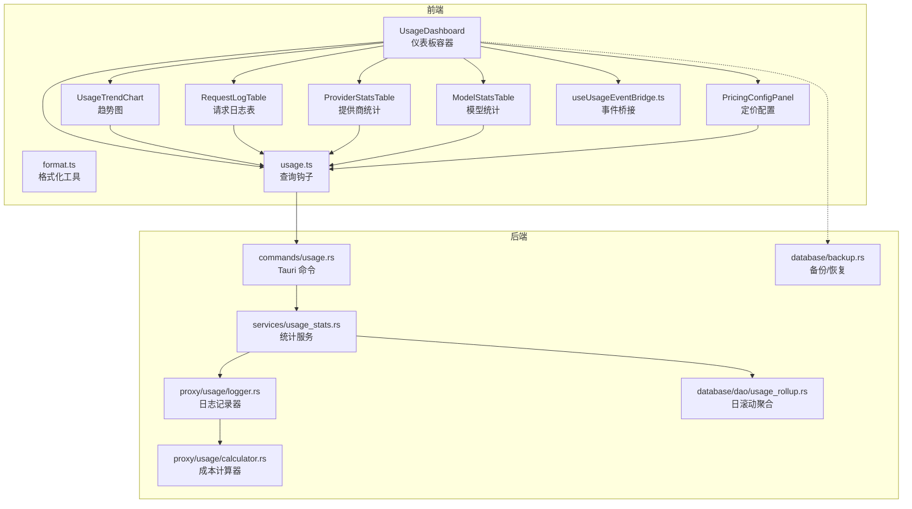
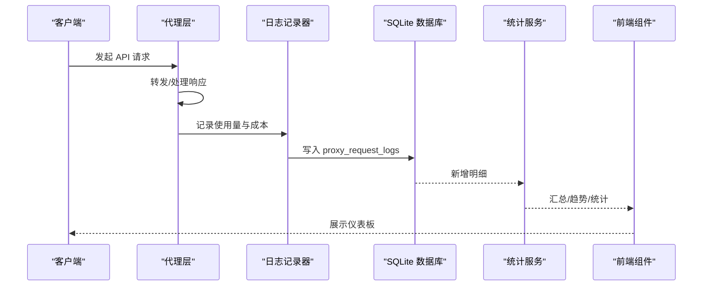
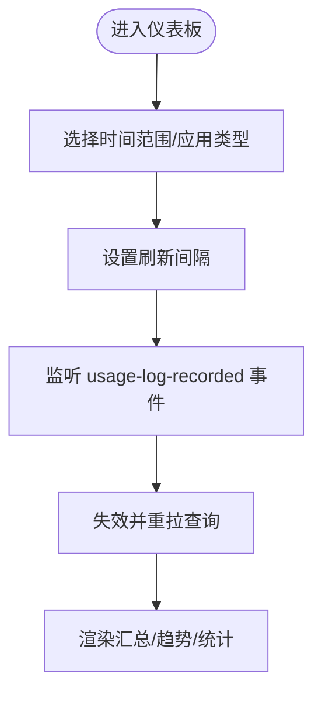
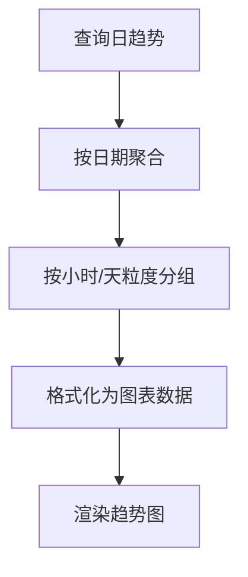
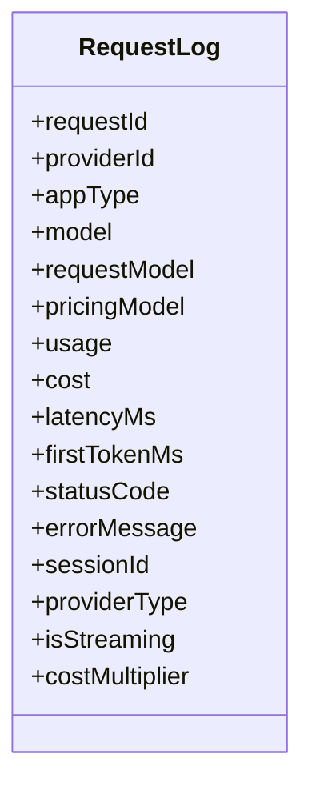
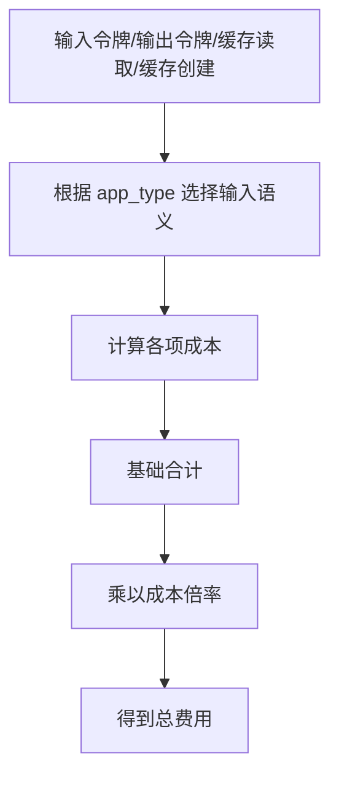
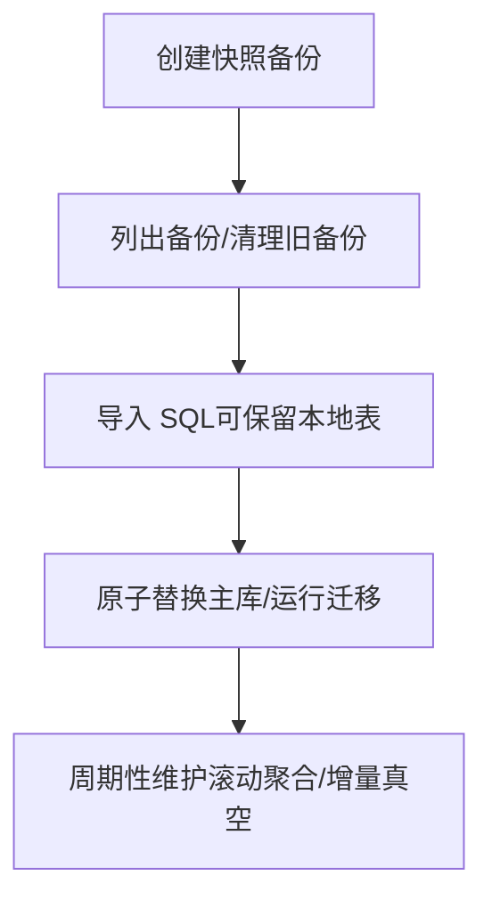
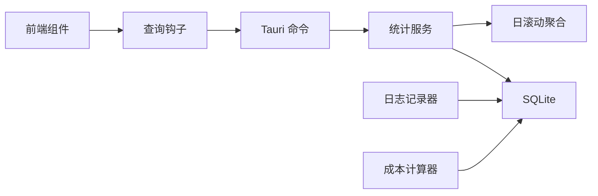

# 使用统计

<cite>
**本文引用的文件**
- [UsageDashboard.tsx](file://src/components/usage/UsageDashboard.tsx)
- [UsageTrendChart.tsx](file://src/components/usage/UsageTrendChart.tsx)
- [RequestLogTable.tsx](file://src/components/usage/RequestLogTable.tsx)
- [ProviderStatsTable.tsx](file://src/components/usage/ProviderStatsTable.tsx)
- [ModelStatsTable.tsx](file://src/components/usage/ModelStatsTable.tsx)
- [PricingConfigPanel.tsx](file://src/components/usage/PricingConfigPanel.tsx)
- [format.ts](file://src/components/usage/format.ts)
- [usage.ts](file://src/lib/query/usage.ts)
- [useUsageEventBridge.ts](file://src/hooks/useUsageEventBridge.ts)
- [usage.ts](file://src/types/usage.ts)
- [usage.rs](file://src-tauri/src/commands/usage.rs)
- [usage_stats.rs](file://src-tauri/src/services/usage_stats.rs)
- [logger.rs](file://src-tauri/src/proxy/usage/logger.rs)
- [calculator.rs](file://src-tauri/src/proxy/usage/calculator.rs)
- [response_processor.rs](file://src-tauri/src/proxy/response_processor.rs)
- [usage_rollup.rs](file://src-tauri/src/database/dao/usage_rollup.rs)
- [backup.rs](file://src-tauri/src/database/backup.rs)
- [useBackupManager.ts](file://src/hooks/useBackupManager.ts)
- [settings.rs](file://src-tauri/src/settings.rs)
- [usage.md](file://docs/user-manual/en/4-proxy/4.4-usage.md)
</cite>

## 目录
1. [简介](#简介)
2. [项目结构](#项目结构)
3. [核心组件](#核心组件)
4. [架构总览](#架构总览)
5. [详细组件分析](#详细组件分析)
6. [依赖关系分析](#依赖关系分析)
7. [性能考量](#性能考量)
8. [故障排查指南](#故障排查指南)
9. [结论](#结论)
10. [附录](#附录)

## 简介
本技术文档面向 CC Switch 的“使用统计”系统，围绕以下目标展开：  
- 解释使用统计的重要性与数据采集机制  
- 详解费用仪表板的功能：支出跟踪、请求统计、令牌使用量分析  
- 深入解析趋势图表生成算法、详细请求日志记录格式与自定义每模型定价  
- 说明成本计算逻辑（令牌计价、倍率、汇率与费用汇总）  
- 介绍数据可视化组件的使用方法（时间范围选择、筛选、导出）  
- 提供统计报表示例、数据解读指南与成本优化建议  
- 说明统计数据的备份与恢复流程  

## 项目结构
使用统计系统由前端 React 组件、查询钩子、类型定义与后端 Rust 服务共同组成，前后端通过 Tauri 命令交互，并持久化到本地 SQLite 数据库。

**图表来源**
- [UsageDashboard.tsx:40-224](file://src/components/usage/UsageDashboard.tsx#L40-L224)
- [UsageTrendChart.tsx:1-118](file://src/components/usage/UsageTrendChart.tsx#L1-L118)
- [RequestLogTable.tsx:276-308](file://src/components/usage/RequestLogTable.tsx#L276-L308)
- [ProviderStatsTable.tsx](file://src/components/usage/ProviderStatsTable.tsx)
- [ModelStatsTable.tsx](file://src/components/usage/ModelStatsTable.tsx)
- [PricingConfigPanel.tsx:1-481](file://src/components/usage/PricingConfigPanel.tsx#L1-L481)
- [format.ts:1-98](file://src/components/usage/format.ts#L1-L98)
- [usage.ts:1-320](file://src/lib/query/usage.ts#L1-L320)
- [useUsageEventBridge.ts:1-42](file://src/hooks/useUsageEventBridge.ts#L1-L42)
- [usage.rs:1-57](file://src-tauri/src/commands/usage.rs#L1-L57)
- [usage_stats.rs:1-3258](file://src-tauri/src/services/usage_stats.rs#L1-L3258)
- [logger.rs:1-393](file://src-tauri/src/proxy/usage/logger.rs#L1-L393)
- [calculator.rs:1-271](file://src-tauri/src/proxy/usage/calculator.rs#L1-L271)
- [usage_rollup.rs:1-534](file://src-tauri/src/database/dao/usage_rollup.rs#L1-L534)
- [backup.rs:1-800](file://src-tauri/src/database/backup.rs#L1-L800)

**章节来源**
- [UsageDashboard.tsx:40-224](file://src/components/usage/UsageDashboard.tsx#L40-L224)
- [usage.ts:1-320](file://src/lib/query/usage.ts#L1-L320)

## 核心组件
- 仪表板容器：负责时间范围选择、应用类型过滤、实时刷新桥接与三大统计区（日志、提供商、模型）的切换展示。
- 趋势图表：基于日滚动聚合数据绘制请求趋势与令牌趋势，支持小时/天粒度与交互缩放。
- 请求日志表：展示单条请求的完整使用与计费信息，支持多维筛选与详情查看。
- 统计表格：按提供商与模型维度聚合请求次数、令牌总量、费用与成功率等指标。
- 定价配置面板：支持全局成本倍率与计价模型来源（请求/响应），以及逐模型定价的增删改。
- 格式化工具：统一数字、美元与令牌的本地化显示。
- 查询钩子：封装 React Query，提供摘要、趋势、提供商统计、模型统计与日志查询。
- 事件桥接：监听后端“记录使用日志”事件，实现无轮询即时刷新。
- 后端统计服务：提供汇总、趋势、聚合查询与限制检查。
- 日志记录器与成本计算器：在代理层解析上游使用量、计算成本并落库。
- 日滚动聚合：将明细日志聚合为每日汇总，同时清理明细，保障查询性能与存储上限。
- 备份与恢复：提供数据库快照备份、SQL 导出/导入、周期性维护与 WebDAV 同步保留策略。

**章节来源**
- [UsageDashboard.tsx:40-224](file://src/components/usage/UsageDashboard.tsx#L40-L224)
- [UsageTrendChart.tsx:1-118](file://src/components/usage/UsageTrendChart.tsx#L1-L118)
- [RequestLogTable.tsx:276-308](file://src/components/usage/RequestLogTable.tsx#L276-L308)
- [ProviderStatsTable.tsx](file://src/components/usage/ProviderStatsTable.tsx)
- [ModelStatsTable.tsx](file://src/components/usage/ModelStatsTable.tsx)
- [PricingConfigPanel.tsx:1-481](file://src/components/usage/PricingConfigPanel.tsx#L1-L481)
- [format.ts:1-98](file://src/components/usage/format.ts#L1-L98)
- [usage.ts:1-320](file://src/lib/query/usage.ts#L1-L320)
- [useUsageEventBridge.ts:1-42](file://src/hooks/useUsageEventBridge.ts#L1-L42)
- [usage.rs:1-57](file://src-tauri/src/commands/usage.rs#L1-L57)
- [usage_stats.rs:1-3258](file://src-tauri/src/services/usage_stats.rs#L1-L3258)
- [logger.rs:1-393](file://src-tauri/src/proxy/usage/logger.rs#L1-L393)
- [calculator.rs:1-271](file://src-tauri/src/proxy/usage/calculator.rs#L1-L271)
- [usage_rollup.rs:1-534](file://src-tauri/src/database/dao/usage_rollup.rs#L1-L534)
- [backup.rs:1-800](file://src-tauri/src/database/backup.rs#L1-L800)

## 架构总览
使用统计系统采用“代理拦截 + 本地落库 + 后端聚合 + 前端可视”的分层架构。代理层在请求完成后解析使用量并计算成本，写入明细表；后台定时进行日滚动聚合与清理；前端通过查询钩子拉取数据并渲染仪表板。

**图表来源**
- [response_processor.rs:696-725](file://src-tauri/src/proxy/response_processor.rs#L696-L725)
- [logger.rs:1-393](file://src-tauri/src/proxy/usage/logger.rs#L1-L393)
- [usage_stats.rs:1-3258](file://src-tauri/src/services/usage_stats.rs#L1-L3258)
- [usage.rs:1-57](file://src-tauri/src/commands/usage.rs#L1-L57)

## 详细组件分析

### 仪表板容器与实时刷新
- 时间范围与应用类型过滤：支持“今天/7天/30天/自定义”，并按应用类型拆分数据。
- 实时刷新：通过事件桥接监听后端“usage-log-recorded”事件，立即失效并重拉全部统计查询。
- 刷新间隔：支持 0/5/10/30/60 秒，点击按钮循环切换。
- 三大统计区：请求日志、提供商统计、模型统计，均支持筛选与分页。

**图表来源**
- [UsageDashboard.tsx:40-224](file://src/components/usage/UsageDashboard.tsx#L40-L224)
- [useUsageEventBridge.ts:1-42](file://src/hooks/useUsageEventBridge.ts#L1-L42)

**章节来源**
- [UsageDashboard.tsx:40-224](file://src/components/usage/UsageDashboard.tsx#L40-L224)
- [useUsageEventBridge.ts:1-42](file://src/hooks/useUsageEventBridge.ts#L1-L42)

### 趋势图表生成算法
- 数据来源：日滚动聚合表 usage_daily_rollups，按日期、应用类型、提供商、模型、请求/计价模型维度聚合。
- 时间粒度：当天按小时聚合（24 点），7/30 天按日聚合。
- 图表元素：请求数量、输入/输出/缓存读取/缓存创建令牌，右侧叠加估算成本曲线。
- 交互：支持缩放与拖拽，Tooltip 统一格式化显示。

**图表来源**
- [usage.ts:167-187](file://src/lib/query/usage.ts#L167-L187)
- [usage_stats.rs:1-3258](file://src-tauri/src/services/usage_stats.rs#L1-L3258)
- [UsageTrendChart.tsx:1-118](file://src/components/usage/UsageTrendChart.tsx#L1-L118)

**章节来源**
- [usage.ts:167-187](file://src/lib/query/usage.ts#L167-L187)
- [usage_stats.rs:1-3258](file://src-tauri/src/services/usage_stats.rs#L1-L3258)
- [UsageTrendChart.tsx:1-118](file://src/components/usage/UsageTrendChart.tsx#L1-L118)

### 详细请求日志记录格式
- 关键字段：请求时间、提供商、模型、输入/输出/缓存读取/缓存创建令牌、总费用、耗时、首 token 耗时、是否流式、状态码、错误信息、数据来源、计价模型等。
- 计价模型来源：支持“请求”或“响应”两种来源，写入时保留实际计价基准，便于回填重算。
- 未计价行：成功但无使用量或费用为 0 的行，UI 以特殊标识提示。

**图表来源**
- [logger.rs:11-37](file://src-tauri/src/proxy/usage/logger.rs#L11-L37)
- [usage.ts:10-37](file://src/types/usage.ts#L10-L37)

**章节来源**
- [logger.rs:1-393](file://src-tauri/src/proxy/usage/logger.rs#L1-L393)
- [usage.ts:10-37](file://src/types/usage.ts#L10-L37)

### 成本计算逻辑（令牌计价、倍率与汇总）
- 计价模型：每模型定价（输入/输出/缓存读取/缓存创建单价，单位“每百万令牌”）。
- 应用语义差异：OpenAI/Gemini 风格的输入令牌包含缓存命中，需扣除缓存读取令牌；Claude/Anthropic 风格输入已是“新鲜输入”。
- 成本计算：各项成本 = 令牌数 × 单价 / 1,000,000；总成本 = 基础合计 × 成本倍率。
- 倍率来源：支持全局默认倍率与应用级配置，亦可在模型级别覆盖。
- 彙总：前端汇总卡片显示总请求、真实总令牌（cache-normalized）、缓存命中率、估算费用与成功率。

**图表来源**
- [calculator.rs:44-129](file://src-tauri/src/proxy/usage/calculator.rs#L44-L129)
- [usage_stats.rs:1-3258](file://src-tauri/src/services/usage_stats.rs#L1-L3258)

**章节来源**
- [calculator.rs:1-271](file://src-tauri/src/proxy/usage/calculator.rs#L1-L271)
- [usage_stats.rs:1-3258](file://src-tauri/src/services/usage_stats.rs#L1-L3258)

### 数据可视化组件使用方法
- 时间范围选择：支持“今天/7天/30天/自定义”，自定义范围显示本地化时间标签。
- 数据筛选：请求日志支持应用类型、提供商、模型、状态码与时间范围筛选；提供商/模型统计支持应用类型筛选。
- 导出功能：SQL 导出/导入（支持 WebDAV 同步场景下的本地表保留策略）。
- 实时刷新：事件桥接实现即时更新，减少轮询等待。

**章节来源**
- [UsageDashboard.tsx:40-224](file://src/components/usage/UsageDashboard.tsx#L40-L224)
- [RequestLogTable.tsx:276-308](file://src/components/usage/RequestLogTable.tsx#L276-L308)
- [backup.rs:1-800](file://src-tauri/src/database/backup.rs#L1-L800)

### 统计报表示例与数据解读
- 摘要卡片：总请求、真实总令牌（cache-normalized）、缓存命中率、估算费用、成功率。
- 趋势图：请求趋势与令牌趋势，区分输入、输出、缓存创建、缓存命中与成本曲线。
- 请求日志：查看单条请求的参数、响应摘要与错误信息。
- 提供商统计：按提供商聚合请求次数、令牌总量、费用与成功率。
- 模型统计：按模型聚合请求次数、令牌总量、费用与平均费用。

**章节来源**
- [usage.md:44-143](file://docs/user-manual/en/4-proxy/4.4-usage.md#L44-L143)
- [usage_stats.rs:1-3258](file://src-tauri/src/services/usage_stats.rs#L1-L3258)

### 成本优化建议
- 启用 Prompt Caching 并复用缓存：缓存命中成本显著低于输入成本，适合重复问答场景。
- 选择合适计价模型来源：根据上游协议特性选择“响应”或“请求”计价来源，避免重复计费。
- 调整成本倍率：对特定提供商或模型设置合理倍率，平衡预算与质量。
- 监控限额：结合每日/月度限额预警，及时调整用量策略。

**章节来源**
- [usage.md:95-96](file://docs/user-manual/en/4-proxy/4.4-usage.md#L95-L96)
- [PricingConfigPanel.tsx:1-481](file://src/components/usage/PricingConfigPanel.tsx#L1-L481)

### 备份与恢复
- 快照备份：生成带时间戳的数据库快照文件，自动清理超出保留数量的旧备份。
- SQL 导出/导入：支持完整导出与 WebDAV 同步专用导出（跳过本地表数据），导入时可保留本地表数据。
- 周期性维护：定期执行增量真空与滚动聚合，回收空间并保持查询性能。
- 恢复流程：创建安全备份后原子替换主库，运行迁移与种子定价初始化。

**图表来源**
- [backup.rs:297-334](file://src-tauri/src/database/backup.rs#L297-L334)
- [backup.rs:336-367](file://src-tauri/src/database/backup.rs#L336-L367)
- [backup.rs:551-599](file://src-tauri/src/database/backup.rs#L551-L599)
- [settings.rs:950-961](file://src-tauri/src/settings.rs#L950-L961)

**章节来源**
- [backup.rs:1-800](file://src-tauri/src/database/backup.rs#L1-L800)
- [useBackupManager.ts:1-60](file://src/hooks/useBackupManager.ts#L1-L60)
- [settings.rs:950-961](file://src-tauri/src/settings.rs#L950-L961)

## 依赖关系分析
- 前端依赖：React Query 管理数据获取与缓存；Recharts 渲染图表；i18n 与本地化格式化工具；Tauri 事件监听。
- 后端依赖：SQLite 存储与 rusqlite 访问；chrono 时间处理；rust_decimal 高精度计算；schema 迁移与备份模块。
- 组件耦合：仪表板容器聚合多个子组件与查询钩子；日志记录器与成本计算器紧密协作；统计服务依赖滚动聚合与定价表。

**图表来源**
- [usage.ts:1-320](file://src/lib/query/usage.ts#L1-L320)
- [usage.rs:1-57](file://src-tauri/src/commands/usage.rs#L1-L57)
- [usage_stats.rs:1-3258](file://src-tauri/src/services/usage_stats.rs#L1-L3258)
- [usage_rollup.rs:1-534](file://src-tauri/src/database/dao/usage_rollup.rs#L1-L534)
- [logger.rs:1-393](file://src-tauri/src/proxy/usage/logger.rs#L1-L393)
- [calculator.rs:1-271](file://src-tauri/src/proxy/usage/calculator.rs#L1-L271)

**章节来源**
- [usage.ts:1-320](file://src/lib/query/usage.ts#L1-L320)
- [usage.rs:1-57](file://src-tauri/src/commands/usage.rs#L1-L57)
- [usage_stats.rs:1-3258](file://src-tauri/src/services/usage_stats.rs#L1-L3258)
- [usage_rollup.rs:1-534](file://src-tauri/src/database/dao/usage_rollup.rs#L1-L534)
- [logger.rs:1-393](file://src-tauri/src/proxy/usage/logger.rs#L1-L393)
- [calculator.rs:1-271](file://src-tauri/src/proxy/usage/calculator.rs#L1-L271)

## 性能考量
- 查询性能：日滚动聚合将高频明细转为低频汇总，降低查询复杂度与 IO 压力。
- 存储上限：周期性维护与增量真空回收空间，避免数据库膨胀。
- 实时性：事件桥接避免长轮询，提升用户体验。
- 精度与稳定性：使用高精度 Decimal 避免浮点误差；严格的时间边界与 DST 对齐保证统计正确性。

[本节为通用指导，无需具体文件分析]

## 故障排查指南
- 无数据或延迟：确认代理拦截、应用接管与日志记录已启用；检查事件桥接是否正常工作。
- 金额异常：核对计价模型来源与成本倍率；检查回填与滚动聚合是否成功。
- 导入失败：确保导入文件为 CC Switch 导出的 SQL；检查备份完整性与迁移状态。
- 备份问题：检查备份目录权限与保留数量配置；必要时手动清理或重命名备份。

**章节来源**
- [useUsageEventBridge.ts:1-42](file://src/hooks/useUsageEventBridge.ts#L1-L42)
- [backup.rs:1-800](file://src-tauri/src/database/backup.rs#L1-L800)
- [usage_rollup.rs:1-534](file://src-tauri/src/database/dao/usage_rollup.rs#L1-L534)

## 结论
CC Switch 的使用统计系统通过“代理拦截 + 本地落库 + 后端聚合 + 前端可视化”的架构，实现了对 API 使用与成本的全面追踪。其高精度的成本计算、灵活的定价配置、完善的日滚动聚合与备份恢复能力，为用户提供了可靠的成本控制与优化依据。

[本节为总结，无需具体文件分析]

## 附录
- 用户手册参考：统计概览、时间范围、趋势图表、详细数据与统计表格说明。
- 类型定义参考：请求日志、统计摘要、每日统计、提供商与模型统计等接口定义。

**章节来源**
- [usage.md:1-143](file://docs/user-manual/en/4-proxy/4.4-usage.md#L1-L143)
- [usage.ts:1-259](file://src/types/usage.ts#L1-L259)