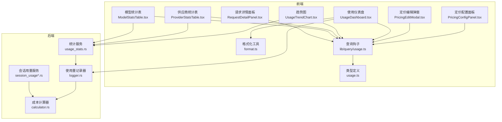
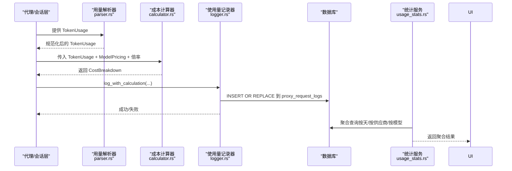
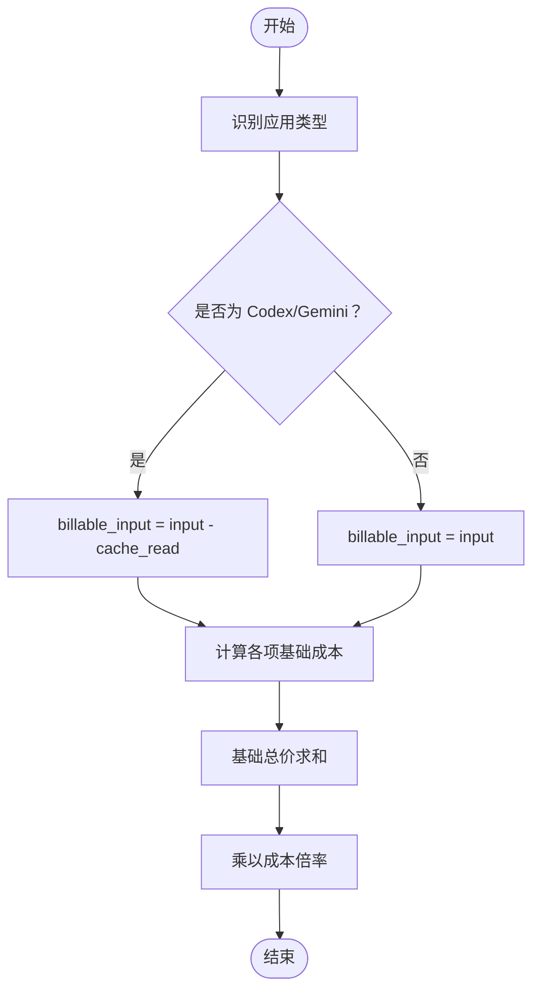
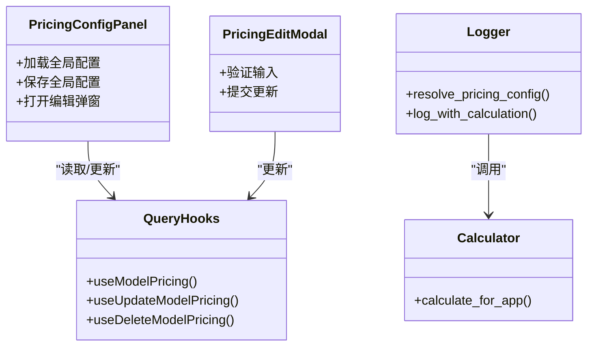
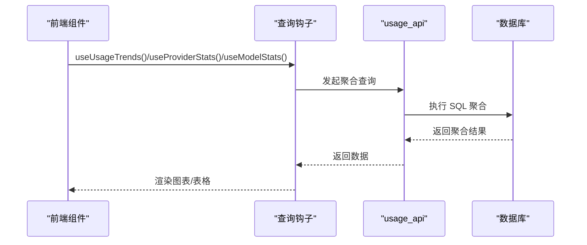
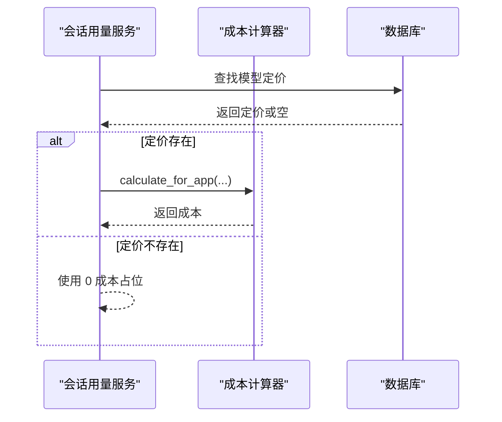
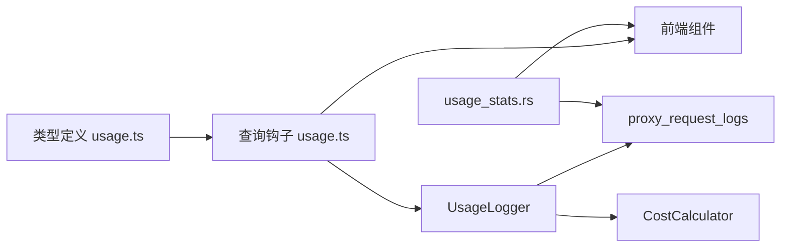

# 成本计算与分析

<cite>
**本文档引用的文件**
- [src/components/usage/PricingConfigPanel.tsx](file://src/components/usage/PricingConfigPanel.tsx)
- [src/components/usage/PricingEditModal.tsx](file://src/components/usage/PricingEditModal.tsx)
- [src-tauri/src/proxy/usage/calculator.rs](file://src-tauri/src/proxy/usage/calculator.rs)
- [src-tauri/src/proxy/usage/logger.rs](file://src-tauri/src/proxy/usage/logger.rs)
- [src-tauri/src/services/usage_stats.rs](file://src-tauri/src/services/usage_stats.rs)
- [src-tauri/src/services/session_usage.rs](file://src-tauri/src/services/session_usage.rs)
- [src-tauri/src/services/session_usage_codex.rs](file://src-tauri/src/services/session_usage_codex.rs)
- [src-tauri/src/services/session_usage_opencode.rs](file://src-tauri/src/services/session_usage_opencode.rs)
- [src/types/usage.ts](file://src/types/usage.ts)
- [src/lib/query/usage.ts](file://src/lib/query/usage.ts)
- [src/components/usage/UsageDashboard.tsx](file://src/components/usage/UsageDashboard.tsx)
- [src/components/usage/UsageTrendChart.tsx](file://src/components/usage/UsageTrendChart.tsx)
- [src/components/usage/ProviderStatsTable.tsx](file://src/components/usage/ProviderStatsTable.tsx)
- [src/components/usage/ModelStatsTable.tsx](file://src/components/usage/ModelStatsTable.tsx)
- [src/components/usage/RequestDetailPanel.tsx](file://src/components/usage/RequestDetailPanel.tsx)
- [src/components/usage/format.ts](file://src/components/usage/format.ts)
- [docs/user-manual/en/4-proxy/4.4-usage.md](file://docs/user-manual/en/4-proxy/4.4-usage.md)
</cite>

## 目录
1. [简介](#简介)
2. [项目结构](#项目结构)
3. [核心组件](#核心组件)
4. [架构总览](#架构总览)
5. [详细组件分析](#详细组件分析)
6. [依赖关系分析](#依赖关系分析)
7. [性能考量](#性能考量)
8. [故障排查指南](#故障排查指南)
9. [结论](#结论)
10. [附录](#附录)

## 简介
本文件面向 CC Switch 的成本计算与分析系统，系统围绕“令牌计价算法”“自定义定价配置”“成本分析组件”三大主题展开，覆盖输入/输出/缓存令牌的区分、单价设置与累计计算、供应商级定价覆盖、时间范围聚合、供应商对比与趋势分析，并提供实际成本计算示例、定价策略建议、成本优化技巧以及异常费用检测方法。

## 项目结构
成本计算与分析涉及前端 UI 组件、类型定义、查询钩子与后端 Rust 实现的协同工作：
- 前端负责定价配置面板、统计图表与表格展示、请求详情面板与格式化工具
- 后端负责令牌用量解析、成本计算、日志记录、统计聚合与会话同步

**图表来源**
- [src/components/usage/PricingConfigPanel.tsx:1-481](file://src/components/usage/PricingConfigPanel.tsx#L1-L481)
- [src/components/usage/PricingEditModal.tsx:1-226](file://src/components/usage/PricingEditModal.tsx#L1-L226)
- [src/components/usage/UsageDashboard.tsx:1-224](file://src/components/usage/UsageDashboard.tsx#L1-L224)
- [src/components/usage/UsageTrendChart.tsx:1-236](file://src/components/usage/UsageTrendChart.tsx#L1-L236)
- [src/components/usage/ProviderStatsTable.tsx:1-96](file://src/components/usage/ProviderStatsTable.tsx#L1-L96)
- [src/components/usage/ModelStatsTable.tsx:1-90](file://src/components/usage/ModelStatsTable.tsx#L1-L90)
- [src/components/usage/RequestDetailPanel.tsx:272-294](file://src/components/usage/RequestDetailPanel.tsx#L272-L294)
- [src/components/usage/format.ts:64-97](file://src/components/usage/format.ts#L64-L97)
- [src/types/usage.ts:1-259](file://src/types/usage.ts#L1-L259)
- [src/lib/query/usage.ts:1-320](file://src/lib/query/usage.ts#L1-L320)
- [src-tauri/src/proxy/usage/calculator.rs:1-271](file://src-tauri/src/proxy/usage/calculator.rs#L1-L271)
- [src-tauri/src/proxy/usage/logger.rs:1-455](file://src-tauri/src/proxy/usage/logger.rs#L1-L455)
- [src-tauri/src/services/usage_stats.rs:1-2384](file://src-tauri/src/services/usage_stats.rs#L1-L2384)
- [src-tauri/src/services/session_usage.rs:455-476](file://src-tauri/src/services/session_usage.rs#L455-L476)
- [src-tauri/src/services/session_usage_codex.rs:476-497](file://src-tauri/src/services/session_usage_codex.rs#L476-L497)
- [src-tauri/src/services/session_usage_opencode.rs:346-367](file://src-tauri/src/services/session_usage_opencode.rs#L346-L367)

**章节来源**
- [src/components/usage/UsageDashboard.tsx:1-224](file://src/components/usage/UsageDashboard.tsx#L1-L224)
- [src/lib/query/usage.ts:1-320](file://src/lib/query/usage.ts#L1-L320)

## 核心组件
- 令牌计价算法：基于高精度十进制计算，区分输入/输出/缓存读取/缓存创建四类成本，支持供应商级成本倍率
- 自定义定价配置：支持按模型设置单价、批量编辑、删除与全局默认配置
- 成本分析组件：提供时间范围聚合、供应商对比、趋势分析与请求详情展示

**章节来源**
- [src-tauri/src/proxy/usage/calculator.rs:1-271](file://src-tauri/src/proxy/usage/calculator.rs#L1-L271)
- [src-tauri/src/proxy/usage/logger.rs:1-455](file://src-tauri/src/proxy/usage/logger.rs#L1-L455)
- [src/components/usage/PricingConfigPanel.tsx:1-481](file://src/components/usage/PricingConfigPanel.tsx#L1-L481)
- [src/components/usage/PricingEditModal.tsx:1-226](file://src/components/usage/PricingEditModal.tsx#L1-L226)
- [src-tauri/src/services/usage_stats.rs:1-2384](file://src-tauri/src/services/usage_stats.rs#L1-L2384)

## 架构总览
成本计算链路从“令牌用量解析”到“成本计算”，再到“日志记录与统计聚合”的完整闭环。

**图表来源**
- [src-tauri/src/proxy/usage/calculator.rs:52-129](file://src-tauri/src/proxy/usage/calculator.rs#L52-L129)
- [src-tauri/src/proxy/usage/logger.rs:305-362](file://src-tauri/src/proxy/usage/logger.rs#L305-L362)
- [src-tauri/src/services/usage_stats.rs:1-2384](file://src-tauri/src/services/usage_stats.rs#L1-L2384)

## 详细组件分析

### 令牌计价算法
- 输入/输出/缓存令牌区分
  - 输入令牌语义因应用而异：Codex/Gemini 的 input_tokens 已包含缓存命中，需扣除 cache_read_tokens 后作为“新鲜输入”计价；Claude/Anthropic 的 input_tokens 已为新鲜输入，无需再次扣减
  - 输出令牌：直接按输出单价计价
  - 缓存读取：按 cache_read_tokens × 单价计价
  - 缓存创建：按 cache_creation_tokens × 单价计价
- 成本累计与倍率
  - 基础总价 = 输入成本 + 输出成本 + 缓存读取成本 + 缓存创建成本
  - 最终总价 = 基础总价 × 成本倍率（供应商或全局默认）
- 高精度计算
  - 使用高精度十进制避免浮点误差，确保小数位精度

**图表来源**
- [src-tauri/src/proxy/usage/calculator.rs:71-109](file://src-tauri/src/proxy/usage/calculator.rs#L71-L109)

**章节来源**
- [src-tauri/src/proxy/usage/calculator.rs:1-271](file://src-tauri/src/proxy/usage/calculator.rs#L1-L271)

### 自定义定价配置
- 全局默认配置
  - 支持为 claude/codex/gemini 设置默认成本倍率与“按请求模型/响应模型”进行定价匹配的模式
  - 倍率与计费模式来源解析：优先供应商级配置，其次全局默认，最后回退到安全默认值
- 模型级定价
  - 支持为每个模型设置每百万 tokens 的单价（输入/输出/缓存读取/缓存创建）
  - 支持批量编辑、删除与新增
- 数据来源与校验
  - 前端通过查询钩子获取与更新定价
  - 后端对倍率与计费模式进行有效性校验

**图表来源**
- [src/components/usage/PricingConfigPanel.tsx:47-180](file://src/components/usage/PricingConfigPanel.tsx#L47-L180)
- [src/components/usage/PricingEditModal.tsx:19-84](file://src/components/usage/PricingEditModal.tsx#L19-L84)
- [src/lib/query/usage.ts:269-319](file://src/lib/query/usage.ts#L269-L319)
- [src-tauri/src/proxy/usage/logger.rs:210-303](file://src-tauri/src/proxy/usage/logger.rs#L210-L303)
- [src-tauri/src/proxy/usage/calculator.rs:52-69](file://src-tauri/src/proxy/usage/calculator.rs#L52-L69)

**章节来源**
- [src/components/usage/PricingConfigPanel.tsx:1-481](file://src/components/usage/PricingConfigPanel.tsx#L1-L481)
- [src/components/usage/PricingEditModal.tsx:1-226](file://src/components/usage/PricingEditModal.tsx#L1-L226)
- [src-tauri/src/proxy/usage/logger.rs:210-303](file://src-tauri/src/proxy/usage/logger.rs#L210-L303)
- [src/lib/query/usage.ts:269-319](file://src/lib/query/usage.ts#L269-L319)

### 成本分析组件
- 时间范围聚合
  - 支持今日/7日/30日预设与自定义时间范围
  - 后端按天粒度聚合请求数量、Token 数与成本
- 供应商对比
  - 按供应商维度统计请求数、Token、成本、成功率与平均延迟
- 趋势分析
  - 按小时/天粒度展示输入/输出/缓存创建/缓存命中与成本趋势
- 请求详情
  - 展示单条请求的 Token 细项与最终成本，含倍率提示

**图表来源**
- [src/lib/query/usage.ts:125-231](file://src/lib/query/usage.ts#L125-L231)
- [src-tauri/src/services/usage_stats.rs:1-2384](file://src-tauri/src/services/usage_stats.rs#L1-L2384)
- [src/components/usage/UsageTrendChart.tsx:1-236](file://src/components/usage/UsageTrendChart.tsx#L1-L236)
- [src/components/usage/ProviderStatsTable.tsx:1-96](file://src/components/usage/ProviderStatsTable.tsx#L1-L96)
- [src/components/usage/ModelStatsTable.tsx:1-90](file://src/components/usage/ModelStatsTable.tsx#L1-L90)

**章节来源**
- [src/components/usage/UsageTrendChart.tsx:1-236](file://src/components/usage/UsageTrendChart.tsx#L1-L236)
- [src/components/usage/ProviderStatsTable.tsx:1-96](file://src/components/usage/ProviderStatsTable.tsx#L1-L96)
- [src/components/usage/ModelStatsTable.tsx:1-90](file://src/components/usage/ModelStatsTable.tsx#L1-L90)
- [src-tauri/src/services/usage_stats.rs:1-2384](file://src-tauri/src/services/usage_stats.rs#L1-L2384)

### 会话用量与成本回填
- 会话用量服务根据会话日志解析 TokenUsage，并尝试按模型定价计算成本
- 对于某些应用（如 Codex、OpenCode），若上游已提供费用，则直接采用；否则回退至本地定价计算
- 对于 Claude/Anthropic，会话用量服务直接使用本地定价计算

**图表来源**
- [src-tauri/src/services/session_usage.rs:455-476](file://src-tauri/src/services/session_usage.rs#L455-L476)
- [src-tauri/src/services/session_usage_codex.rs:476-497](file://src-tauri/src/services/session_usage_codex.rs#L476-L497)
- [src-tauri/src/services/session_usage_opencode.rs:346-367](file://src-tauri/src/services/session_usage_opencode.rs#L346-L367)
- [src-tauri/src/proxy/usage/calculator.rs:52-69](file://src-tauri/src/proxy/usage/calculator.rs#L52-L69)

**章节来源**
- [src-tauri/src/services/session_usage.rs:455-476](file://src-tauri/src/services/session_usage.rs#L455-L476)
- [src-tauri/src/services/session_usage_codex.rs:476-497](file://src-tauri/src/services/session_usage_codex.rs#L476-L497)
- [src-tauri/src/services/session_usage_opencode.rs:346-367](file://src-tauri/src/services/session_usage_opencode.rs#L346-L367)

## 依赖关系分析
- 前端与后端通过查询钩子与 API 进行解耦，前端仅消费标准化类型与聚合接口
- 后端成本计算依赖高精度十进制与应用类型语义差异处理
- 日志记录与统计聚合通过统一的请求日志表实现，支持实时刷新与历史回填

**图表来源**
- [src/types/usage.ts:1-259](file://src/types/usage.ts#L1-L259)
- [src/lib/query/usage.ts:1-320](file://src/lib/query/usage.ts#L1-L320)
- [src-tauri/src/proxy/usage/logger.rs:1-455](file://src-tauri/src/proxy/usage/logger.rs#L1-L455)
- [src-tauri/src/proxy/usage/calculator.rs:1-271](file://src-tauri/src/proxy/usage/calculator.rs#L1-L271)
- [src-tauri/src/services/usage_stats.rs:1-2384](file://src-tauri/src/services/usage_stats.rs#L1-L2384)

**章节来源**
- [src/types/usage.ts:1-259](file://src/types/usage.ts#L1-L259)
- [src/lib/query/usage.ts:1-320](file://src/lib/query/usage.ts#L1-L320)

## 性能考量
- 高精度十进制计算避免浮点误差，适合长期累计与报表展示
- 前端查询默认 30 秒自动刷新，可根据场景调整刷新间隔
- 图表渲染采用响应式容器与按需加载，减少首屏压力
- 后端聚合查询按天粒度进行，降低大数据量下的查询开销

[本节为通用指导，无需特定文件来源]

## 故障排查指南
- 成本估算不准确
  - 检查模型定价是否与实际提供商一致
  - 若使用代理服务，确认其特殊定价策略
- Token 数与提供商不一致
  - CC Switch 使用自有估算方法，与提供商发票以实际为准
- 未定价请求
  - 若请求包含用量但成本为 0，且非错误行，检查定价配置或供应商覆盖设置
- 倍率与计费模式异常
  - 倍率与计费模式来源解析会回退到默认值，检查供应商配置与全局默认

**章节来源**
- [docs/user-manual/en/4-proxy/4.4-usage.md:201-346](file://docs/user-manual/en/4-proxy/4.4-usage.md#L201-L346)
- [src-tauri/src/proxy/usage/logger.rs:210-303](file://src-tauri/src/proxy/usage/logger.rs#L210-L303)
- [src/types/usage.ts:238-252](file://src/types/usage.ts#L238-L252)

## 结论
CC Switch 的成本计算与分析系统通过“高精度计价算法 + 自定义定价配置 + 统一日志与统计聚合”实现了对多模型、多供应商、多时间粒度的精细化成本掌控。前端提供直观的可视化与交互能力，后端保证计算一致性与可审计性。结合本文的策略建议与优化技巧，用户可有效控制预算、识别异常费用并持续优化成本结构。

[本节为总结性内容，无需特定文件来源]

## 附录

### 实际成本计算示例
- 示例一：Claude/Anthropic 风格
  - 输入：1000 tokens，输出：500 tokens，缓存读取：200 tokens，缓存创建：100 tokens
  - 单价：输入 3.0/百万，输出 15.0/百万，缓存读取 0.3/百万，缓存创建 3.75/百万
  - 计算：输入成本 = 1000 × 3.0 / 1M；输出成本 = 500 × 15.0 / 1M；缓存读取成本 = 200 × 0.3 / 1M；缓存创建成本 = 100 × 3.75 / 1M；基础总价求和；最终总价 = 基础总价 × 倍率
- 示例二：Codex/Gemini 风格
  - 输入：1000 tokens（含缓存命中），需先扣除 200 tokens 缓存命中，再按输入单价计价
  - 其他步骤同上
- 示例三：不同模型价格对比
  - 选择多个模型，在“模型统计”中对比总成本与平均成本，辅助选型
- 示例四：月度费用统计与预算控制
  - 使用“今日/7日/30日”预设或自定义时间范围，观察趋势图与供应商对比表，结合预算阈值进行告警与控制

**章节来源**
- [src-tauri/src/proxy/usage/calculator.rs:152-231](file://src-tauri/src/proxy/usage/calculator.rs#L152-L231)
- [src/components/usage/ModelStatsTable.tsx:1-90](file://src/components/usage/ModelStatsTable.tsx#L1-L90)
- [src/components/usage/UsageTrendChart.tsx:1-236](file://src/components/usage/UsageTrendChart.tsx#L1-L236)

### 定价策略建议
- 按模型家族与版本设置差异化单价，关注缓存命中带来的成本节省
- 在代理服务或促销期间设置临时倍率，用于成本归因与预算控制
- 定期核对定价配置与实际发票，保持估算准确性

**章节来源**
- [src-tauri/src/proxy/usage/logger.rs:210-303](file://src-tauri/src/proxy/usage/logger.rs#L210-L303)
- [docs/user-manual/en/4-proxy/4.4-usage.md:244-278](file://docs/user-manual/en/4-proxy/4.4-usage.md#L244-L278)

### 成本优化技巧
- 优先使用具备 Prompt Caching 的模型，提升缓存命中率
- 合理设置刷新间隔，平衡实时性与性能
- 利用趋势图识别高峰时段，结合供应商对比选择性价比更高渠道

**章节来源**
- [src/components/usage/UsageTrendChart.tsx:1-236](file://src/components/usage/UsageTrendChart.tsx#L1-L236)
- [src/components/usage/ProviderStatsTable.tsx:1-96](file://src/components/usage/ProviderStatsTable.tsx#L1-L96)

### 异常费用检测方法
- 关注“未定价”请求与成本为 0 的记录，结合状态码与错误信息定位问题
- 使用“请求日志”筛选与详情面板，核对 Token 细项与倍率
- 对异常波动设置阈值告警，结合趋势图与供应商对比表进行根因分析

**章节来源**
- [src/types/usage.ts:238-252](file://src/types/usage.ts#L238-L252)
- [src/components/usage/RequestDetailPanel.tsx:272-294](file://src/components/usage/RequestDetailPanel.tsx#L272-L294)

### 汇率转换与多币种支持
- 文档与界面中明确使用美元（USD）作为计价货币
- 若需多币种支持，建议在前端展示时增加货币切换与换算逻辑，并在日志与统计中保留原始 USD 值以便复核

**章节来源**
- [docs/user-manual/en/4-proxy/4.4-usage.md:244-278](file://docs/user-manual/en/4-proxy/4.4-usage.md#L244-L278)