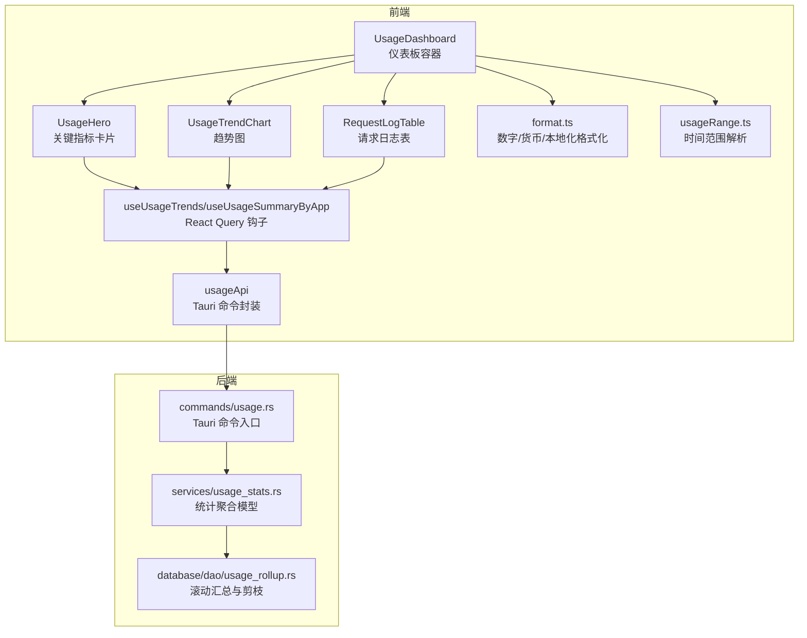
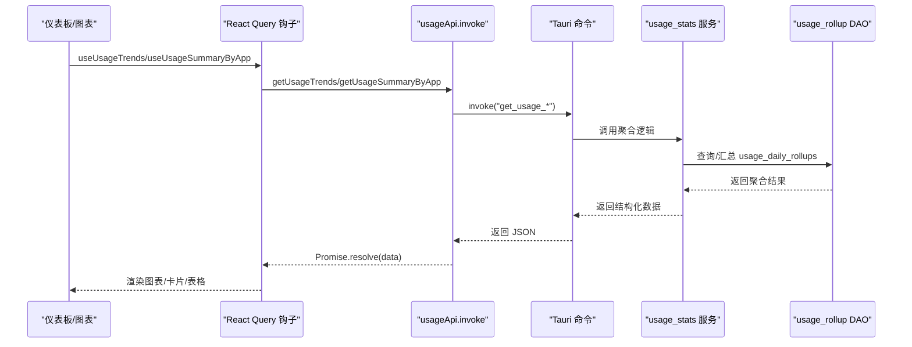
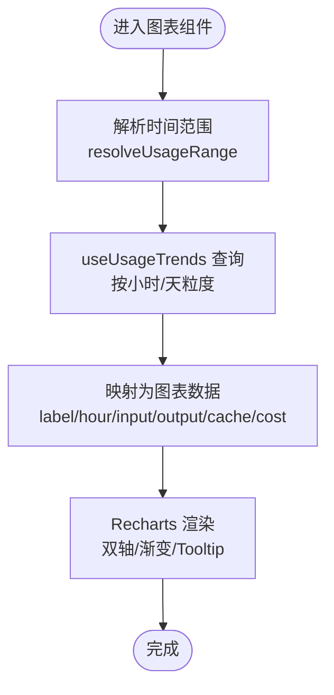
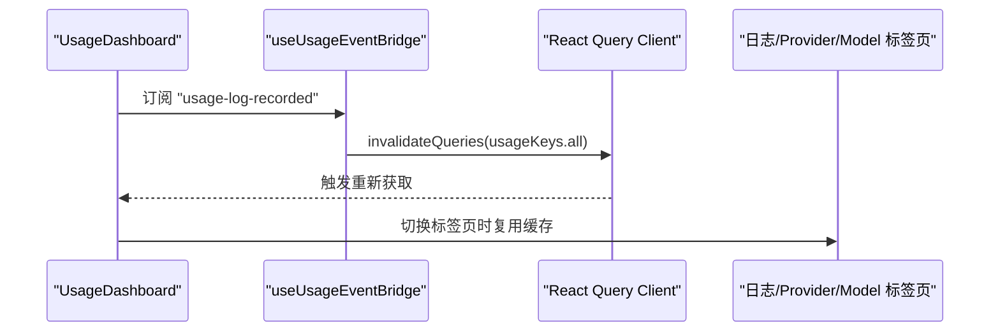
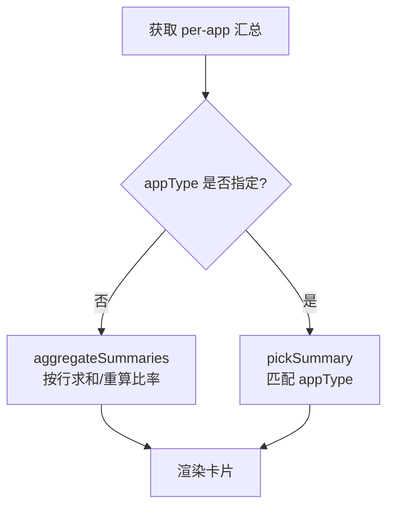
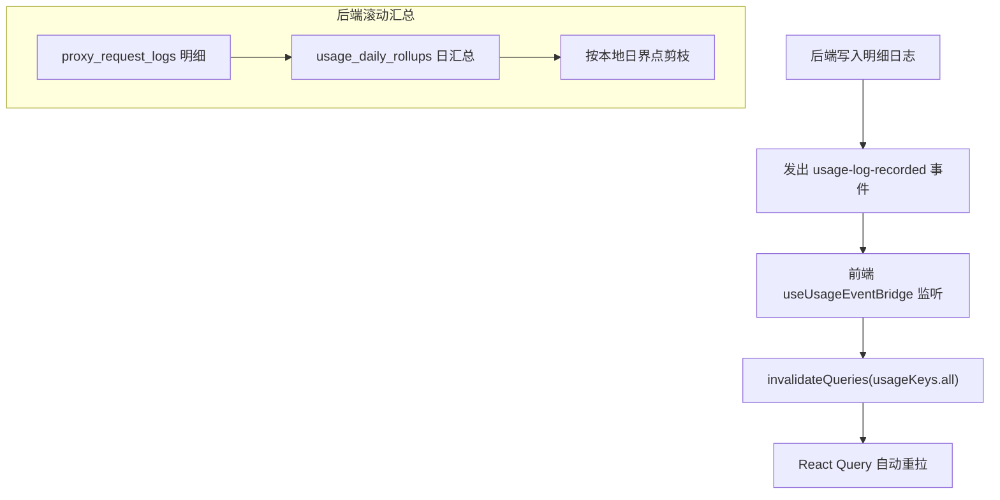
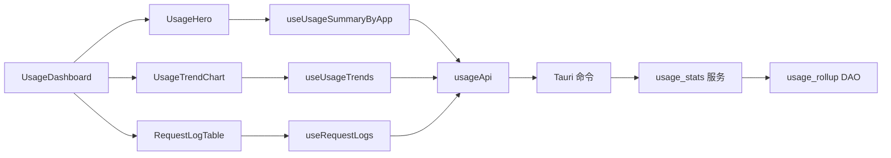

# 数据可视化

<cite>
**本文引用的文件**
- [UsageDashboard.tsx](file://src/components/usage/UsageDashboard.tsx)
- [UsageHero.tsx](file://src/components/usage/UsageHero.tsx)
- [UsageTrendChart.tsx](file://src/components/usage/UsageTrendChart.tsx)
- [RequestLogTable.tsx](file://src/components/usage/RequestLogTable.tsx)
- [format.ts](file://src/components/usage/format.ts)
- [usage.ts](file://src/lib/query/usage.ts)
- [usageRange.ts](file://src/lib/usageRange.ts)
- [usage.ts](file://src/types/usage.ts)
- [usage.ts](file://src/lib/api/usage.ts)
- [useUsageEventBridge.ts](file://src/hooks/useUsageEventBridge.ts)
- [usage_rollup.rs](file://src-tauri/src/database/dao/usage_rollup.rs)
- [usage.rs](file://src-tauri/src/commands/usage.rs)
- [usage_stats.rs](file://src-tauri/src/services/usage_stats.rs)
- [4-proxy/4.4-usage.md](file://docs/user-manual/en/4-proxy/4.4-usage.md)
</cite>

## 目录
1. [简介](#简介)
2. [项目结构](#项目结构)
3. [核心组件](#核心组件)
4. [架构总览](#架构总览)
5. [详细组件分析](#详细组件分析)
6. [依赖分析](#依赖分析)
7. [性能考量](#性能考量)
8. [故障排查指南](#故障排查指南)
9. [结论](#结论)
10. [附录](#附录)

## 简介
本文件面向 CC Switch 的数据可视化系统，聚焦“使用趋势图表”“仪表板组件”“数据格式化工具”“图表配置选项”“动态更新与缓存策略”。文档从代码级视角解析前端组件如何消费后端聚合数据，如何进行时间序列处理与渲染优化，并给出交互与性能建议。

## 项目结构
- 前端可视化模块位于 src/components/usage 与 src/lib 下，包含仪表板容器、关键指标卡片、趋势图、日志表格、查询钩子、范围解析与格式化工具。
- 后端通过 Tauri 命令暴露统计接口，使用 SQLite 聚合 DAO 将明细日志滚动汇总为日粒度快照，保障查询性能与历史稳定性。
- 文档与用户手册对图表含义、时间粒度与筛选项有明确说明，便于理解数据口径。

**图表来源**
- [UsageDashboard.tsx:40-224](file://src/components/usage/UsageDashboard.tsx#L40-L224)
- [UsageHero.tsx:164-356](file://src/components/usage/UsageHero.tsx#L164-L356)
- [UsageTrendChart.tsx:30-235](file://src/components/usage/UsageTrendChart.tsx#L30-L235)
- [RequestLogTable.tsx:45-505](file://src/components/usage/RequestLogTable.tsx#L45-L505)
- [usage.ts:125-320](file://src/lib/query/usage.ts#L125-L320)
- [usageRange.ts:26-80](file://src/lib/usageRange.ts#L26-L80)
- [usage.ts:20-148](file://src/lib/api/usage.ts#L20-L148)
- [usage.rs:10-57](file://src-tauri/src/commands/usage.rs#L10-L57)
- [usage_stats.rs:15-41](file://src-tauri/src/services/usage_stats.rs#L15-L41)
- [usage_rollup.rs:57-180](file://src-tauri/src/database/dao/usage_rollup.rs#L57-L180)

**章节来源**
- [UsageDashboard.tsx:40-224](file://src/components/usage/UsageDashboard.tsx#L40-L224)
- [usageRange.ts:26-80](file://src/lib/usageRange.ts#L26-L80)
- [usage.ts:20-148](file://src/lib/api/usage.ts#L20-L148)
- [usage.rs:10-57](file://src-tauri/src/commands/usage.rs#L10-L57)
- [usage_rollup.rs:57-180](file://src-tauri/src/database/dao/usage_rollup.rs#L57-L180)

## 核心组件
- 仪表板容器：聚合时间范围、应用类型过滤、刷新间隔控制、标签页切换与定价配置面板。
- 关键指标卡片（UsageHero）：汇总请求次数、真实消耗 Token、成本、缓存命中率等，并按应用类型主题化展示。
- 趋势图表（UsageTrendChart）：按小时/天粒度绘制输入/输出/缓存读写 Token 与成本曲线，支持响应式与自定义 Tooltip。
- 请求日志表（RequestLogTable）：支持多维筛选、分页与实时刷新。
- 查询与缓存：基于 React Query 的查询键、默认轮询与后台刷新策略。
- 事件驱动刷新：后端写入新日志时通过 Tauri 事件即时触发前端失效重拉。
- 时间范围解析：统一解析 preset/custom 为本地日界点，确保跨时区与夏令时稳定。
- 格式化工具：数字、货币、本地化、紧凑 Token 显示与语言归一化。

**章节来源**
- [UsageDashboard.tsx:40-224](file://src/components/usage/UsageDashboard.tsx#L40-L224)
- [UsageHero.tsx:164-356](file://src/components/usage/UsageHero.tsx#L164-L356)
- [UsageTrendChart.tsx:30-235](file://src/components/usage/UsageTrendChart.tsx#L30-L235)
- [RequestLogTable.tsx:45-505](file://src/components/usage/RequestLogTable.tsx#L45-L505)
- [usage.ts:125-320](file://src/lib/query/usage.ts#L125-L320)
- [useUsageEventBridge.ts:15-42](file://src/hooks/useUsageEventBridge.ts#L15-L42)
- [usageRange.ts:26-80](file://src/lib/usageRange.ts#L26-L80)
- [format.ts:1-98](file://src/components/usage/format.ts#L1-L98)

## 架构总览
从前端到后端的数据流如下：

**图表来源**
- [usage.ts:50-88](file://src/lib/api/usage.ts#L50-L88)
- [usage.rs:10-57](file://src-tauri/src/commands/usage.rs#L10-L57)
- [usage_stats.rs:15-41](file://src-tauri/src/services/usage_stats.rs#L15-L41)
- [usage_rollup.rs:115-179](file://src-tauri/src/database/dao/usage_rollup.rs#L115-L179)

## 详细组件分析

### 趋势图表组件（UsageTrendChart）
- 数据来源：useUsageTrends 返回每日粒度的 DailyStats 列表。
- 时间粒度判定：根据时间跨度自动选择小时或天粒度，小时粒度显示时分，天粒度显示月日。
- 渲染优化：
  - 使用 Recharts AreaChart，按需渲染区域与渐变填充。
  - 自定义 Tooltip，分别以千计单位与美元格式展示数值。
  - Y 轴双轴：左侧 Token（k 单位）、右侧成本（美元）。
- 交互：支持响应式容器、图例、网格与缩放/拖拽（浏览器端）。
- 动态更新：受父组件 refreshIntervalMs 控制，0 表示关闭轮询。

**图表来源**
- [UsageTrendChart.tsx:30-235](file://src/components/usage/UsageTrendChart.tsx#L30-L235)
- [usage.ts:167-187](file://src/lib/query/usage.ts#L167-L187)
- [usageRange.ts:26-59](file://src/lib/usageRange.ts#L26-L59)

**章节来源**
- [UsageTrendChart.tsx:30-235](file://src/components/usage/UsageTrendChart.tsx#L30-L235)
- [usage.ts:167-187](file://src/lib/query/usage.ts#L167-L187)

### 仪表板组件（UsageDashboard）
- 设计要点：
  - 时间范围选择器与预设标签联动，支持 today/7d/14d/30d/custom。
  - 应用类型过滤按钮组，支持 all 与各应用类型。
  - 刷新间隔切换：0/5/10/30/60 秒，点击切换并失效所有 usage 查询。
  - 标签页：请求日志、Provider 统计、Model 统计三类视图。
  - 定价配置面板折叠展开，支持模型单价编辑与删除。
- 实时更新：挂载 useUsageEventBridge，监听后端 usage-log-recorded 事件，立即失效查询，实现近实时刷新。

**图表来源**
- [UsageDashboard.tsx:40-224](file://src/components/usage/UsageDashboard.tsx#L40-L224)
- [useUsageEventBridge.ts:15-42](file://src/hooks/useUsageEventBridge.ts#L15-L42)

**章节来源**
- [UsageDashboard.tsx:40-224](file://src/components/usage/UsageDashboard.tsx#L40-L224)
- [useUsageEventBridge.ts:15-42](file://src/hooks/useUsageEventBridge.ts#L15-L42)

### 关键指标卡片（UsageHero）
- 数据聚合：按 appType 或 all 聚合 per-app 汇总，计算真实消耗 Token、缓存命中率与成功率。
- 缓存写入状态：根据协议类型（Anthropic/OpenAI）标注“全部/部分/不适用”，避免误导。
- 展示元素：主 Token 数、请求总数、成本、输入/输出/缓存读写拆解、命中率进度条。
- 实时刷新：与趋势图/日志保持相同的刷新间隔策略。

**图表来源**
- [UsageHero.tsx:81-123](file://src/components/usage/UsageHero.tsx#L81-L123)

**章节来源**
- [UsageHero.tsx:164-356](file://src/components/usage/UsageHero.tsx#L164-L356)

### 请求日志表（RequestLogTable）
- 筛选维度：应用类型、状态码、Provider 名称、Model 名称。
- 分页与跳页：固定每页数量，支持跳转到指定页。
- 实时刷新：与仪表板共享刷新间隔。
- 输入 Token 规范化：对 OpenAI 风格协议减去缓存读取，得到“新鲜输入”。

**章节来源**
- [RequestLogTable.tsx:45-505](file://src/components/usage/RequestLogTable.tsx#L45-L505)
- [usage.ts:195-208](file://src/types/usage.ts#L195-L208)

### 数据格式化工具（format.ts）
- 数字格式化：按本地化规则千分位显示整数。
- 货币格式化：美元前缀与固定小数位。
- 语言与地区：根据 i18n 解析语言，归一化 zh/yue/ja 等别名，返回对应区域格式。
- 紧凑 Token 显示：中文繁体/简体、日文、英文分别采用“亿/万/K/M/B”策略，兼顾可读性与一致性。

**章节来源**
- [format.ts:1-98](file://src/components/usage/format.ts#L1-L98)

### 图表配置选项
- 颜色主题：内置输入/输出/缓存创建/缓存命中/成本曲线颜色与渐变。
- 时间范围：today/7d/14d/30d/自定义，自动切换小时/天粒度。
- 数据筛选：应用类型、Provider、Model、状态码、自定义日期范围。
- 实时刷新：支持 0/5/10/30/60 秒轮询，或事件驱动即时刷新。

**章节来源**
- [UsageTrendChart.tsx:120-235](file://src/components/usage/UsageTrendChart.tsx#L120-L235)
- [UsageDashboard.tsx:123-143](file://src/components/usage/UsageDashboard.tsx#L123-L143)
- [RequestLogTable.tsx:130-225](file://src/components/usage/RequestLogTable.tsx#L130-L225)
- [4-proxy/4.4-usage.md:74-93](file://docs/user-manual/en/4-proxy/4.4-usage.md#L74-L93)

### 动态更新机制与缓存策略
- 默认轮询：React Query 默认 30 秒刷新一次，可在组件内调整。
- 事件驱动：后端写入明细日志后发出 usage-log-recorded 事件，前端立即失效所有 usage 查询，实现近实时更新。
- 查询键：以时间范围、应用类型、筛选条件为键，保证缓存命中与失效精准。
- 后端滚动汇总：将明细日志按本地日界点滚动汇总至 usage_daily_rollups，删除过期明细，降低查询压力并保证统计连续性。

**图表来源**
- [useUsageEventBridge.ts:15-42](file://src/hooks/useUsageEventBridge.ts#L15-L42)
- [usage_rollup.rs:57-180](file://src-tauri/src/database/dao/usage_rollup.rs#L57-L180)
- [usage.rs:10-57](file://src-tauri/src/commands/usage.rs#L10-L57)

**章节来源**
- [useUsageEventBridge.ts:15-42](file://src/hooks/useUsageEventBridge.ts#L15-L42)
- [usage_rollup.rs:57-180](file://src-tauri/src/database/dao/usage_rollup.rs#L57-L180)
- [usage.ts:125-320](file://src/lib/query/usage.ts#L125-L320)

## 依赖分析
- 组件耦合：
  - UsageDashboard 作为容器，协调 UsageHero、UsageTrendChart、RequestLogTable、ProviderStatsTable、ModelStatsTable。
  - 各图表/表格均依赖 React Query 钩子与 usageApi。
- 外部依赖：
  - Recharts 用于趋势图渲染。
  - Tauri invoke 与命令层对接后端统计服务。
  - SQLite 聚合 DAO 提供高性能日粒度统计。
- 潜在循环依赖：组件间通过查询钩子与 API 封装解耦，未见直接循环导入。

**图表来源**
- [UsageDashboard.tsx:40-224](file://src/components/usage/UsageDashboard.tsx#L40-L224)
- [UsageHero.tsx:164-356](file://src/components/usage/UsageHero.tsx#L164-L356)
- [UsageTrendChart.tsx:30-235](file://src/components/usage/UsageTrendChart.tsx#L30-L235)
- [RequestLogTable.tsx:45-505](file://src/components/usage/RequestLogTable.tsx#L45-L505)
- [usage.ts:125-320](file://src/lib/query/usage.ts#L125-L320)
- [usage.ts:20-148](file://src/lib/api/usage.ts#L20-L148)
- [usage.rs:10-57](file://src-tauri/src/commands/usage.rs#L10-L57)
- [usage_stats.rs:15-41](file://src-tauri/src/services/usage_stats.rs#L15-L41)
- [usage_rollup.rs:57-180](file://src-tauri/src/database/dao/usage_rollup.rs#L57-L180)

**章节来源**
- [UsageDashboard.tsx:40-224](file://src/components/usage/UsageDashboard.tsx#L40-L224)
- [usage.ts:125-320](file://src/lib/query/usage.ts#L125-L320)
- [usage.ts:20-148](file://src/lib/api/usage.ts#L20-L148)

## 性能考量
- 前端渲染：
  - 趋势图按小时/天自动切换粒度，减少点数与渲染压力。
  - 使用响应式容器与最小必要数据映射，避免不必要的重绘。
- 查询与缓存：
  - 合理设置 refetchInterval，避免频繁轮询造成资源浪费。
  - 使用 invalidateQueries 精准失效，减少冗余请求。
- 后端聚合：
  - 按本地日界点滚动汇总，删除明细日志，显著降低查询扫描范围。
  - 通过 INSERT OR REPLACE 合并已有日汇总，避免重复计算。
- 本地化与格式化：
  - 使用 Intl.NumberFormat 与本地化格式，减少 UI 侧字符串拼接开销。
  - 紧凑 Token 显示统一策略，避免重复计算与分支判断。

[本节为通用指导，无需特定文件来源]

## 故障排查指南
- 图表长时间无更新
  - 检查刷新间隔是否被设为 0；确认事件桥接是否正常监听。
  - 查看网络面板确认 Tauri invoke 是否成功返回。
- 数据不一致或缺失
  - 检查时间范围是否跨越本地日界点；确认 rollup 剪枝是否执行。
  - 核对应用类型过滤与协议差异（OpenAI 风格协议缓存写入为 N/A）。
- 金额显示异常
  - 检查模型定价配置是否正确；确认后端回填流程是否成功。
- 日志表格为空
  - 检查筛选条件是否过于严格；确认分页与跳页输入是否合法。

**章节来源**
- [useUsageEventBridge.ts:15-42](file://src/hooks/useUsageEventBridge.ts#L15-L42)
- [usage_rollup.rs:57-180](file://src-tauri/src/database/dao/usage_rollup.rs#L57-L180)
- [RequestLogTable.tsx:45-505](file://src/components/usage/RequestLogTable.tsx#L45-L505)

## 结论
CC Switch 的数据可视化体系以“前端查询缓存 + 后端滚动汇总”为核心，实现了高可用的趋势图、关键指标卡片与请求日志表。通过事件驱动的近实时刷新、统一的时间范围解析与本地化格式化，系统在准确性、性能与用户体验之间取得良好平衡。建议在生产环境中结合业务需求合理设置刷新间隔，并充分利用应用类型与协议差异提示，提升数据解读效率。

[本节为总结，无需特定文件来源]

## 附录
- 用户手册中的图表说明与时间粒度参考，可帮助理解数据口径与展示逻辑。
  
**章节来源**
- [4-proxy/4.4-usage.md:74-93](file://docs/user-manual/en/4-proxy/4.4-usage.md#L74-L93)