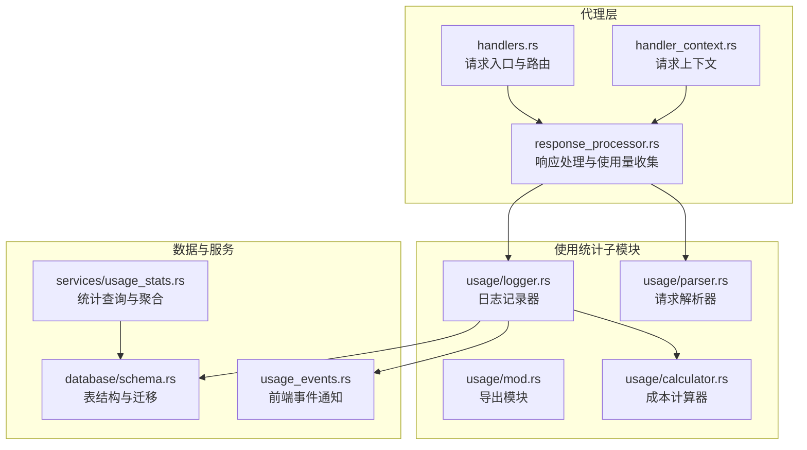
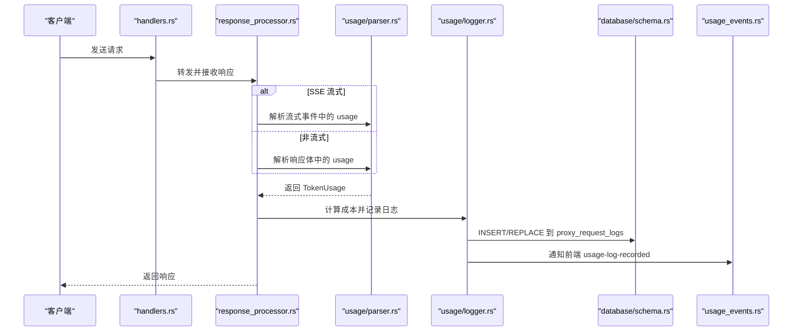
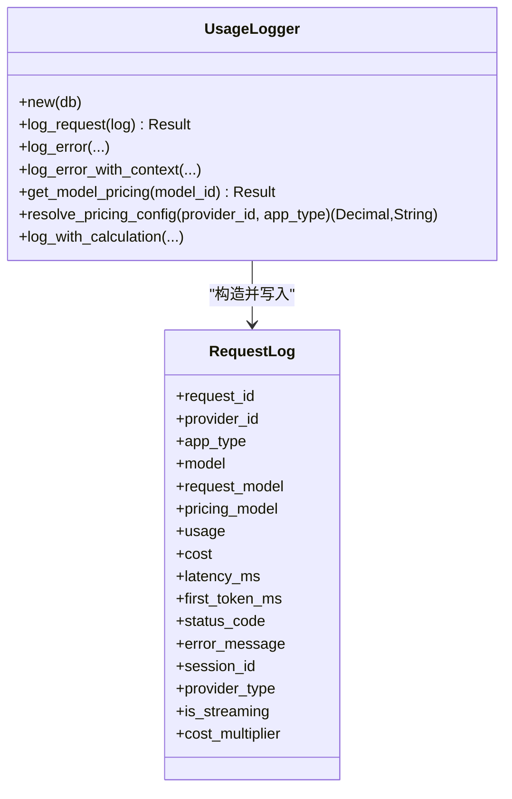
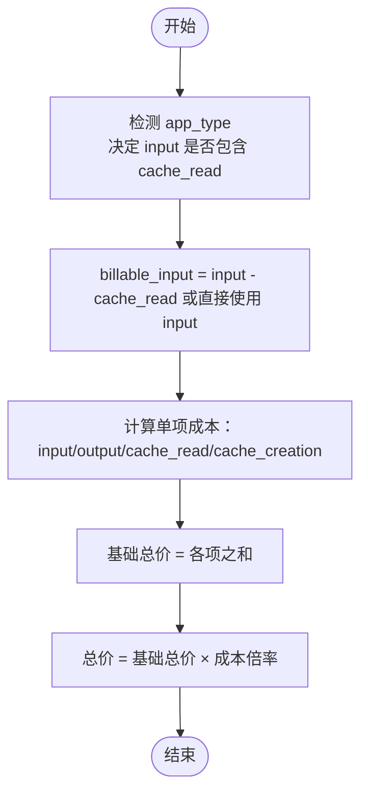
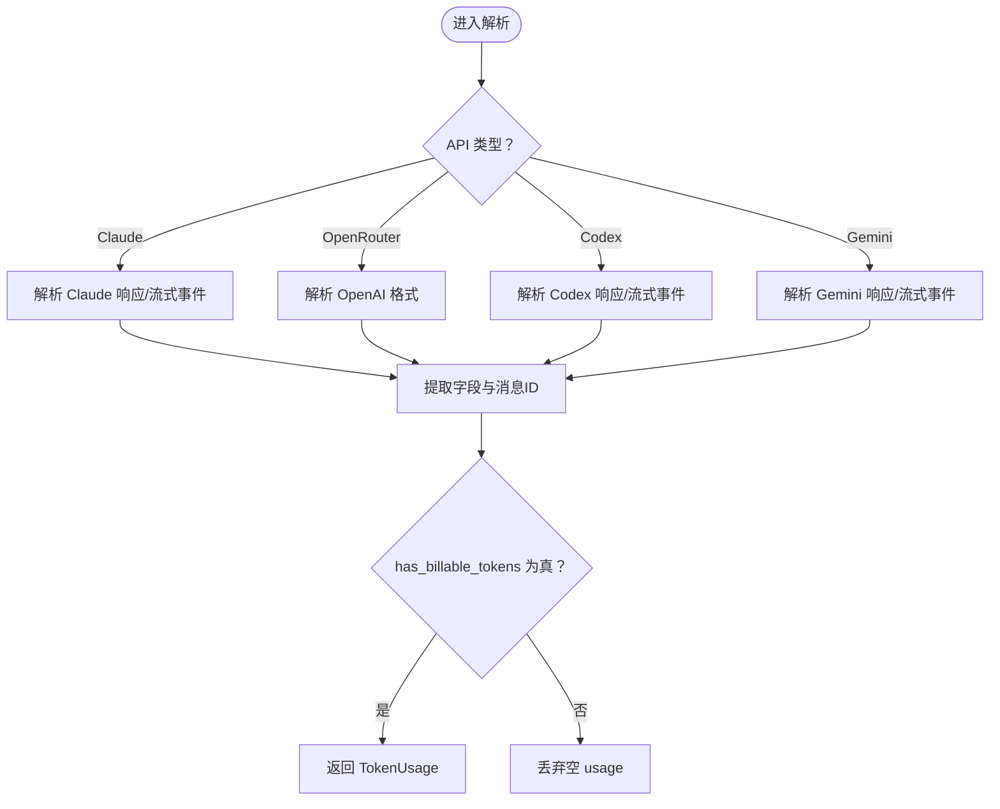
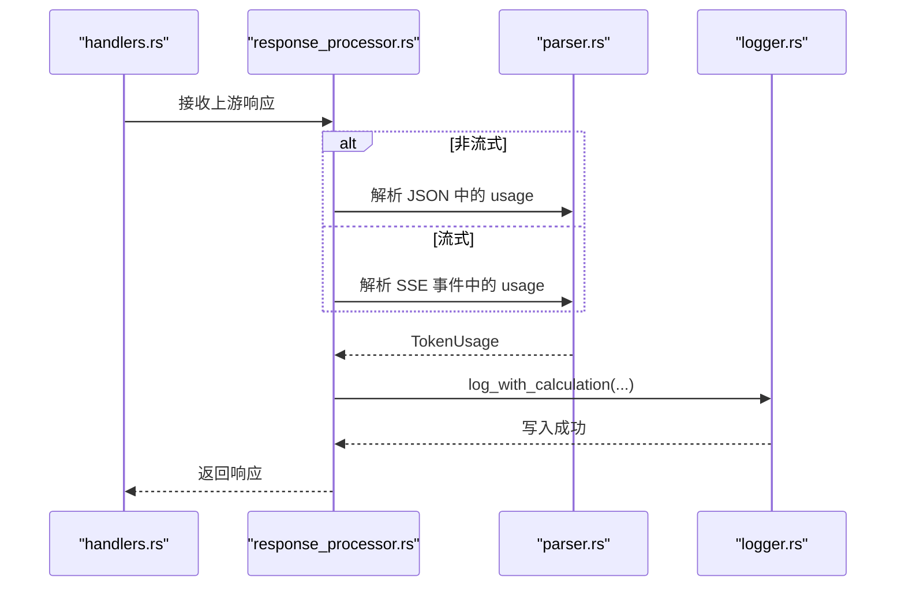
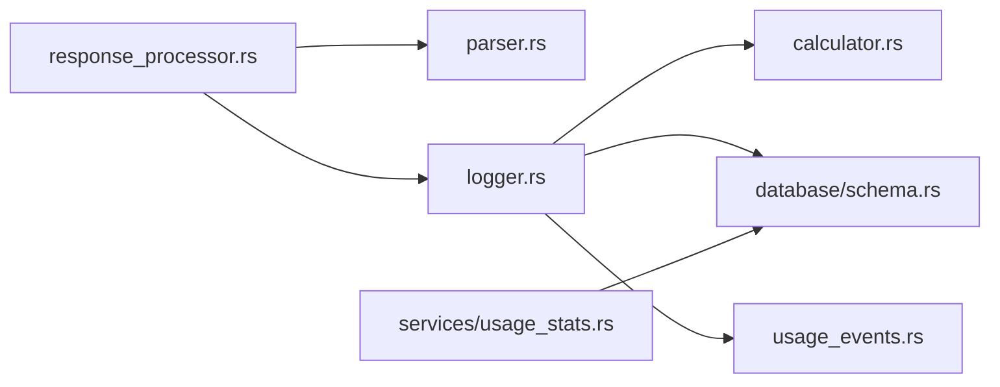

# 数据收集与记录

<cite>
**本文引用的文件**
- [logger.rs](file://src-tauri/src/proxy/usage/logger.rs)
- [calculator.rs](file://src-tauri/src/proxy/usage/calculator.rs)
- [parser.rs](file://src-tauri/src/proxy/usage/parser.rs)
- [mod.rs](file://src-tauri/src/proxy/usage/mod.rs)
- [response_processor.rs](file://src-tauri/src/proxy/response_processor.rs)
- [handlers.rs](file://src-tauri/src/proxy/handlers.rs)
- [schema.rs](file://src-tauri/src/database/schema.rs)
- [usage_stats.rs](file://src-tauri/src/services/usage_stats.rs)
- [usage_events.rs](file://src-tauri/src/usage_events.rs)
- [handler_context.rs](file://src-tauri/src/proxy/handler_context.rs)
</cite>

## 目录
1. [简介](#简介)
2. [项目结构](#项目结构)
3. [核心组件](#核心组件)
4. [架构总览](#架构总览)
5. [详细组件分析](#详细组件分析)
6. [依赖关系分析](#依赖关系分析)
7. [性能考量](#性能考量)
8. [故障排查指南](#故障排查指南)
9. [结论](#结论)
10. [附录](#附录)

## 简介
本文件面向 CC Switch 的“使用统计数据收集与记录”子系统，系统性阐述代理服务器如何拦截与记录 AI 供应商请求的完整流程，涵盖：
- 使用日志记录器的工作机制：请求元数据提取、响应数据解析、错误处理与去重策略
- 令牌计算器的实现逻辑：输入/输出/缓存读取/缓存创建的统计方法、成本计算公式、倍率与计费模式来源
- 请求解析器的数据格式规范：JSON 结构、字段定义与验证规则
- 实际日志记录示例、数据格式对比与性能优化建议
- 数据持久化策略与存储结构设计

## 项目结构
围绕使用统计的关键模块位于 Rust 后端的 proxy/usage 子目录，并与数据库 schema、服务层统计查询、事件通知等模块协同工作。

图示来源
- [handlers.rs:105-200](file://src-tauri/src/proxy/handlers.rs#L105-L200)
- [response_processor.rs:369-384](file://src-tauri/src/proxy/response_processor.rs#L369-L384)
- [handler_context.rs:75-177](file://src-tauri/src/proxy/handler_context.rs#L75-L177)
- [mod.rs:1-16](file://src-tauri/src/proxy/usage/mod.rs#L1-L16)
- [logger.rs:39-42](file://src-tauri/src/proxy/usage/logger.rs#L39-L42)
- [calculator.rs:28-29](file://src-tauri/src/proxy/usage/calculator.rs#L28-L29)
- [parser.rs:15-30](file://src-tauri/src/proxy/usage/parser.rs#L15-L30)
- [schema.rs:183-284](file://src-tauri/src/database/schema.rs#L183-L284)
- [usage_stats.rs:1-20](file://src-tauri/src/services/usage_stats.rs#L1-L20)
- [usage_events.rs:1-69](file://src-tauri/src/usage_events.rs#L1-L69)

章节来源
- [handlers.rs:105-200](file://src-tauri/src/proxy/handlers.rs#L105-L200)
- [response_processor.rs:369-384](file://src-tauri/src/proxy/response_processor.rs#L369-L384)
- [handler_context.rs:75-177](file://src-tauri/src/proxy/handler_context.rs#L75-L177)
- [mod.rs:1-16](file://src-tauri/src/proxy/usage/mod.rs#L1-L16)
- [logger.rs:39-42](file://src-tauri/src/proxy/usage/logger.rs#L39-L42)
- [calculator.rs:28-29](file://src-tauri/src/proxy/usage/calculator.rs#L28-L29)
- [parser.rs:15-30](file://src-tauri/src/proxy/usage/parser.rs#L15-L30)
- [schema.rs:183-284](file://src-tauri/src/database/schema.rs#L183-L284)
- [usage_stats.rs:1-20](file://src-tauri/src/services/usage_stats.rs#L1-L20)
- [usage_events.rs:1-69](file://src-tauri/src/usage_events.rs#L1-L69)

## 核心组件
- 使用日志记录器（UsageLogger）：负责将请求元数据、令牌用量、成本与延迟等写入数据库，并触发前端事件通知
- 成本计算器（CostCalculator）：根据模型定价与令牌用量计算各项成本与总计，支持不同应用类型的输入语义差异
- 请求解析器（TokenUsage）：从各类供应商 API 的响应中提取 input/output/cache 令牌，支持非流式与流式解析
- 数据库表结构：proxy_request_logs、model_pricing、usage_daily_rollups 等，支撑明细与聚合统计
- 统计服务（usage_stats）：提供汇总、分页、按日趋势等查询能力
- 事件通知（usage_events）：在日志写入后向前端发送事件，触发界面刷新

章节来源
- [logger.rs:39-42](file://src-tauri/src/proxy/usage/logger.rs#L39-L42)
- [calculator.rs:28-29](file://src-tauri/src/proxy/usage/calculator.rs#L28-L29)
- [parser.rs:15-30](file://src-tauri/src/proxy/usage/parser.rs#L15-L30)
- [schema.rs:183-284](file://src-tauri/src/database/schema.rs#L183-L284)
- [usage_stats.rs:1-20](file://src-tauri/src/services/usage_stats.rs#L1-L20)
- [usage_events.rs:1-69](file://src-tauri/src/usage_events.rs#L1-L69)

## 架构总览
代理服务器在收到上游响应后，根据响应类型（SSE 或非流式）分别进入流式或非流式处理路径。在处理过程中，解析器抽取令牌用量，日志记录器结合成本计算器与定价表进行成本计算，并将结果持久化到数据库。同时，通过事件模块通知前端刷新。

图示来源
- [handlers.rs:105-200](file://src-tauri/src/proxy/handlers.rs#L105-L200)
- [response_processor.rs:369-384](file://src-tauri/src/proxy/response_processor.rs#L369-L384)
- [parser.rs:64-514](file://src-tauri/src/proxy/usage/parser.rs#L64-L514)
- [logger.rs:305-362](file://src-tauri/src/proxy/usage/logger.rs#L305-L362)
- [schema.rs:183-199](file://src-tauri/src/database/schema.rs#L183-L199)
- [usage_events.rs:42-68](file://src-tauri/src/usage_events.rs#L42-L68)

## 详细组件分析

### 使用日志记录器（UsageLogger）
职责与关键行为：
- 记录成功请求：将请求 ID、供应商、应用类型、模型、令牌用量、成本、延迟、状态码、会话 ID、是否流式、成本倍率等写入 proxy_request_logs
- 记录失败请求：当无法解析 usage 或上游异常时，记录错误行（pricing_model 留空，成本字段为 0）
- 定价解析：从 model_pricing 表读取模型定价，若缺失则记录警告并成本为 0
- 倍率与计费模式来源解析：优先供应商元数据覆盖，其次全局默认，支持响应/请求两种计费模式来源
- 计算并落库：调用成本计算器，组装 RequestLog 并写入数据库，随后通知前端

图示来源
- [logger.rs:11-37](file://src-tauri/src/proxy/usage/logger.rs#L11-L37)
- [logger.rs:49-115](file://src-tauri/src/proxy/usage/logger.rs#L49-L115)
- [logger.rs:117-194](file://src-tauri/src/proxy/usage/logger.rs#L117-L194)
- [logger.rs:196-208](file://src-tauri/src/proxy/usage/logger.rs#L196-L208)
- [logger.rs:210-303](file://src-tauri/src/proxy/usage/logger.rs#L210-L303)
- [logger.rs:305-362](file://src-tauri/src/proxy/usage/logger.rs#L305-L362)

章节来源
- [logger.rs:39-42](file://src-tauri/src/proxy/usage/logger.rs#L39-L42)
- [logger.rs:49-115](file://src-tauri/src/proxy/usage/logger.rs#L49-L115)
- [logger.rs:117-194](file://src-tauri/src/proxy/usage/logger.rs#L117-L194)
- [logger.rs:196-208](file://src-tauri/src/proxy/usage/logger.rs#L196-L208)
- [logger.rs:210-303](file://src-tauri/src/proxy/usage/logger.rs#L210-L303)
- [logger.rs:305-362](file://src-tauri/src/proxy/usage/logger.rs#L305-L362)

### 成本计算器（CostCalculator）
职责与关键行为：
- 输入语义适配：针对 Claude/Anthropic 与 Codex/OpenAI/Gemini 的 input_tokens 语义差异，决定是否从 input 中扣除 cache_read
- 成本分解：分别计算 input/output/cache_read/cache_creation 的单项成本
- 总成本：单项成本之和乘以成本倍率（仅对总价乘以倍率）
- 未知模型处理：当模型定价缺失时返回 None，避免错误计费

图示来源
- [calculator.rs:52-69](file://src-tauri/src/proxy/usage/calculator.rs#L52-L69)
- [calculator.rs:71-109](file://src-tauri/src/proxy/usage/calculator.rs#L71-L109)
- [calculator.rs:111-128](file://src-tauri/src/proxy/usage/calculator.rs#L111-L128)

章节来源
- [calculator.rs:28-29](file://src-tauri/src/proxy/usage/calculator.rs#L28-L29)
- [calculator.rs:52-69](file://src-tauri/src/proxy/usage/calculator.rs#L52-L69)
- [calculator.rs:71-109](file://src-tauri/src/proxy/usage/calculator.rs#L71-L109)
- [calculator.rs:111-128](file://src-tauri/src/proxy/usage/calculator.rs#L111-L128)

### 请求解析器（TokenUsage）
职责与关键行为：
- 支持多种 API 格式：Claude 非流式/流式、OpenRouter（OpenAI）、Codex 非流式/流式、Gemini 非流式/流式
- 字段提取：input_tokens、output_tokens、cache_read_tokens、cache_creation_tokens、model、message_id
- 流式解析增强：Claude 流式支持 message_start/message_delta 的增量合并与缓存字段补全；Codex 流式支持 response.completed 事件
- 去重与闸门：has_billable_tokens 用于过滤全 0 的空 usage，避免插入无意义记录

图示来源
- [parser.rs:64-92](file://src-tauri/src/proxy/usage/parser.rs#L64-L92)
- [parser.rs:94-211](file://src-tauri/src/proxy/usage/parser.rs#L94-L211)
- [parser.rs:213-225](file://src-tauri/src/proxy/usage/parser.rs#L213-L225)
- [parser.rs:227-319](file://src-tauri/src/proxy/usage/parser.rs#L227-L319)
- [parser.rs:321-383](file://src-tauri/src/proxy/usage/parser.rs#L321-L383)
- [parser.rs:432-459](file://src-tauri/src/proxy/usage/parser.rs#L432-L459)
- [parser.rs:462-513](file://src-tauri/src/proxy/usage/parser.rs#L462-L513)
- [parser.rs:41-52](file://src-tauri/src/proxy/usage/parser.rs#L41-L52)

章节来源
- [parser.rs:15-30](file://src-tauri/src/proxy/usage/parser.rs#L15-L30)
- [parser.rs:64-92](file://src-tauri/src/proxy/usage/parser.rs#L64-L92)
- [parser.rs:94-211](file://src-tauri/src/proxy/usage/parser.rs#L94-L211)
- [parser.rs:213-225](file://src-tauri/src/proxy/usage/parser.rs#L213-L225)
- [parser.rs:227-319](file://src-tauri/src/proxy/usage/parser.rs#L227-L319)
- [parser.rs:321-383](file://src-tauri/src/proxy/usage/parser.rs#L321-L383)
- [parser.rs:432-459](file://src-tauri/src/proxy/usage/parser.rs#L432-L459)
- [parser.rs:462-513](file://src-tauri/src/proxy/usage/parser.rs#L462-L513)
- [parser.rs:41-52](file://src-tauri/src/proxy/usage/parser.rs#L41-L52)

### 代理处理与使用量收集（handlers/response_processor）
关键流程：
- handlers 根据请求类型选择对应处理器（如 /v1/messages）
- response_processor 根据响应是否为 SSE 选择流式或非流式处理
- 非流式：解析 JSON，提取 usage 或使用默认空 usage，随后调用日志记录
- 流式：逐块解析 SSE 事件，收集 usage，同时维持超时与首字节计时
- 日志记录：调用 UsageLogger.log_with_calculation，完成成本计算与落库

图示来源
- [handlers.rs:105-200](file://src-tauri/src/proxy/handlers.rs#L105-L200)
- [response_processor.rs:369-384](file://src-tauri/src/proxy/response_processor.rs#L369-L384)
- [response_processor.rs:258-367](file://src-tauri/src/proxy/response_processor.rs#L258-L367)
- [parser.rs:64-514](file://src-tauri/src/proxy/usage/parser.rs#L64-L514)
- [logger.rs:305-362](file://src-tauri/src/proxy/usage/logger.rs#L305-L362)

章节来源
- [handlers.rs:105-200](file://src-tauri/src/proxy/handlers.rs#L105-L200)
- [response_processor.rs:258-367](file://src-tauri/src/proxy/response_processor.rs#L258-L367)
- [parser.rs:64-514](file://src-tauri/src/proxy/usage/parser.rs#L64-L514)
- [logger.rs:305-362](file://src-tauri/src/proxy/usage/logger.rs#L305-L362)

## 依赖关系分析
- 模块耦合
  - response_processor 依赖 parser 与 logger，二者均依赖数据库与定价配置
  - logger 依赖 calculator 与数据库，同时通过 usage_events 与前端解耦
  - usage_stats 依赖数据库表结构与 SQL 辅助函数
- 关键依赖链
  - 请求 → 处理器 → 解析器 → 日志记录器 → 数据库
  - 日志记录器 → 成本计算器 → 定价表
  - 日志记录器 → 事件模块 → 前端

图示来源
- [response_processor.rs:369-384](file://src-tauri/src/proxy/response_processor.rs#L369-L384)
- [parser.rs:64-514](file://src-tauri/src/proxy/usage/parser.rs#L64-L514)
- [logger.rs:305-362](file://src-tauri/src/proxy/usage/logger.rs#L305-L362)
- [calculator.rs:28-29](file://src-tauri/src/proxy/usage/calculator.rs#L28-L29)
- [schema.rs:183-284](file://src-tauri/src/database/schema.rs#L183-L284)
- [usage_events.rs:1-69](file://src-tauri/src/usage_events.rs#L1-L69)
- [usage_stats.rs:1-20](file://src-tauri/src/services/usage_stats.rs#L1-L20)

章节来源
- [response_processor.rs:369-384](file://src-tauri/src/proxy/response_processor.rs#L369-L384)
- [parser.rs:64-514](file://src-tauri/src/proxy/usage/parser.rs#L64-L514)
- [logger.rs:305-362](file://src-tauri/src/proxy/usage/logger.rs#L305-L362)
- [calculator.rs:28-29](file://src-tauri/src/proxy/usage/calculator.rs#L28-L29)
- [schema.rs:183-284](file://src-tauri/src/database/schema.rs#L183-L284)
- [usage_events.rs:1-69](file://src-tauri/src/usage_events.rs#L1-L69)
- [usage_stats.rs:1-20](file://src-tauri/src/services/usage_stats.rs#L1-L20)

## 性能考量
- 高精度计算：使用 Decimal 避免浮点误差，保证成本计算稳定
- 防抖通知：前端事件通知采用 200ms 防抖合并，减少频繁刷新带来的 UI 压力
- 去重与闸门：has_billable_tokens 与跨源去重逻辑有效降低无效记录数量
- 索引与查询：proxy_request_logs 表建立多类索引，usage_stats 提供高效聚合查询
- 流式解析：SSE 流式解析仅在启用 usage logging 时进行，避免不必要的 CPU 开销

## 故障排查指南
- 未能解析 usage
  - 现象：日志记录默认空 usage，或出现“未能解析 usage 信息”的调试日志
  - 排查：确认上游响应格式是否符合解析器预期；检查 usage_logging 是否启用
- 成本为 0
  - 现象：total_cost_usd 为 0
  - 排查：检查 model_pricing 是否存在对应模型；查看日志中“模型定价未找到”的警告
- 倍率与计费模式来源异常
  - 现象：成本与预期不符
  - 排查：检查供应商元数据中的 cost_multiplier 与 pricing_model_source；回退至全局默认值
- 前端未刷新
  - 现象：新增日志后界面未更新
  - 排查：确认 usage_events 已初始化；检查防抖窗口内是否被合并

章节来源
- [response_processor.rs:284-354](file://src-tauri/src/proxy/response_processor.rs#L284-L354)
- [logger.rs:331-333](file://src-tauri/src/proxy/usage/logger.rs#L331-L333)
- [usage_events.rs:42-68](file://src-tauri/src/usage_events.rs#L42-L68)

## 结论
CC Switch 的使用统计数据收集与记录系统通过“解析器 + 记录器 + 计算器 + 数据库 + 事件通知”的协作，实现了对多供应商 API 请求的完整追踪与成本计量。系统在准确性（高精度 Decimal、输入语义适配）、稳定性（去重与防抖）、可观测性（事件通知）方面均有良好设计，适合在生产环境中持续运行与演进。

## 附录

### 数据持久化策略与存储结构设计
- proxy_request_logs：请求级明细表，包含请求 ID、供应商、应用类型、模型、令牌用量、成本、延迟、状态码、会话 ID、是否流式、成本倍率、创建时间等
- model_pricing：模型级定价表，按模型 ID 存储输入/输出/缓存读取/缓存创建的成本单价（每百万 token）
- usage_daily_rollups：日聚合统计表，按日期与维度聚合请求次数、令牌与成本，支持历史回填与审计
- 索引策略：对 provider_id/app_type、created_at、model、session_id、status_code 等常用查询字段建立索引，提升查询效率

章节来源
- [schema.rs:183-284](file://src-tauri/src/database/schema.rs#L183-L284)

### 请求解析器的数据格式规范
- TokenUsage 字段
  - input_tokens：输入令牌数
  - output_tokens：输出令牌数
  - cache_read_tokens：缓存读取令牌数
  - cache_creation_tokens：缓存创建令牌数
  - model：从响应提取的实际模型名（可选）
  - message_id：消息 ID（用于跨源去重）
- API 类型与解析方法
  - Claude：支持非流式与流式，流式通过 message_start/message_delta 合并
  - OpenRouter/OpenAI：使用 prompt_tokens/completion_tokens
  - Codex：支持 Responses 与 Chat Completions 两种格式，流式通过 response.completed 事件
  - Gemini：使用 usageMetadata，输出令牌为 total - prompt

章节来源
- [parser.rs:15-30](file://src-tauri/src/proxy/usage/parser.rs#L15-L30)
- [parser.rs:64-514](file://src-tauri/src/proxy/usage/parser.rs#L64-L514)

### 成本计算公式与倍率机制
- 单项成本
  - input_cost = input_tokens × input_cost_per_million / 1,000,000
  - output_cost = output_tokens × output_cost_per_million / 1,000,000
  - cache_read_cost = cache_read_tokens × cache_read_cost_per_million / 1,000,000
  - cache_creation_cost = cache_creation_tokens × cache_creation_cost_per_million / 1,000,000
- 基础总价：各项之和
- 最终总价：基础总价 × 成本倍率（仅对总价乘以倍率）
- 倍率来源：供应商元数据覆盖优先，其次全局默认；计费模式来源支持“响应/请求”两种

章节来源
- [calculator.rs:44-109](file://src-tauri/src/proxy/usage/calculator.rs#L44-L109)
- [logger.rs:210-303](file://src-tauri/src/proxy/usage/logger.rs#L210-L303)

### 实际日志记录示例与数据格式对比
- 成功请求示例
  - 字段：request_id、provider_id、app_type、model、request_model、pricing_model、input/output/cache 令牌、各项成本、总价、latency_ms、first_token_ms、status_code、session_id、provider_type、is_streaming、cost_multiplier、created_at
  - 来源：INSERT/REPLACE 到 proxy_request_logs
- 失败请求示例
  - 字段：request_id、provider_id、app_type、model、status_code、error_message、latency_ms、其余字段为默认值或空
  - 来源：log_error/log_error_with_context
- 数据格式对比
  - 成功行：pricing_model 填写计价基准模型名，成本字段非零
  - 失败行：pricing_model 为空字符串，成本字段为 0

章节来源
- [logger.rs:74-115](file://src-tauri/src/proxy/usage/logger.rs#L74-L115)
- [logger.rs:117-194](file://src-tauri/src/proxy/usage/logger.rs#L117-L194)