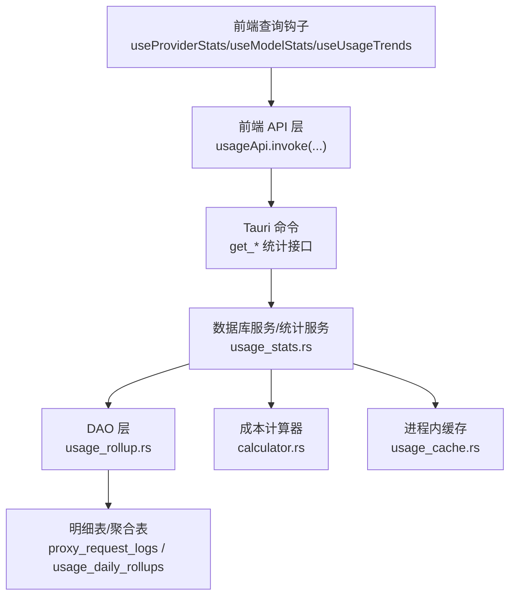
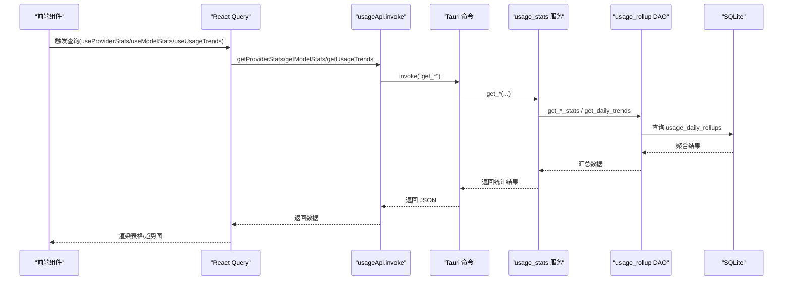
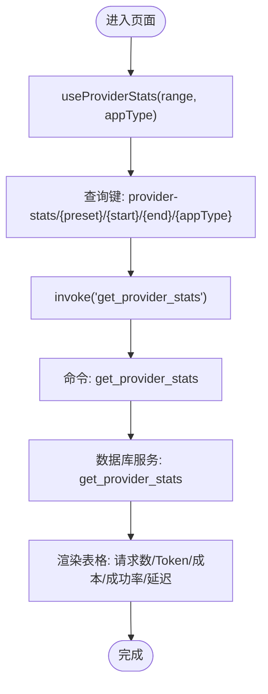
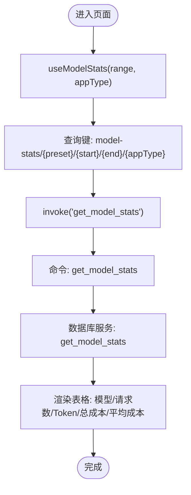
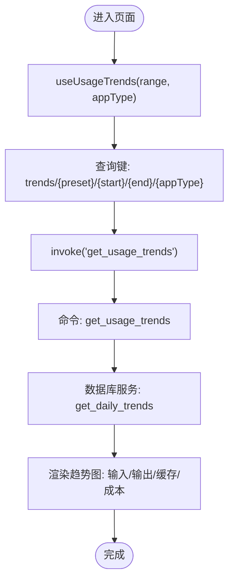
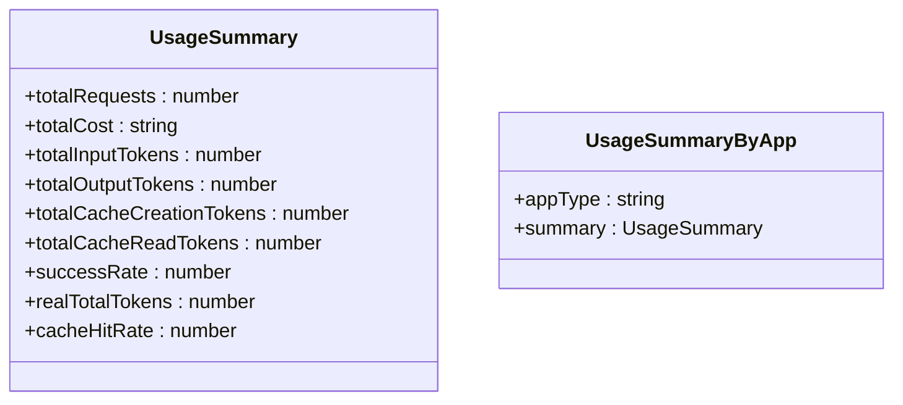
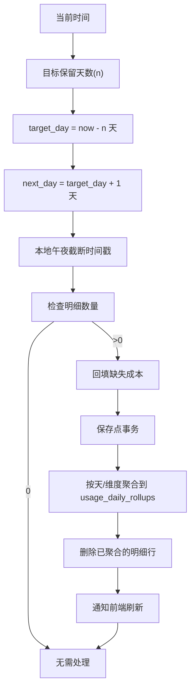
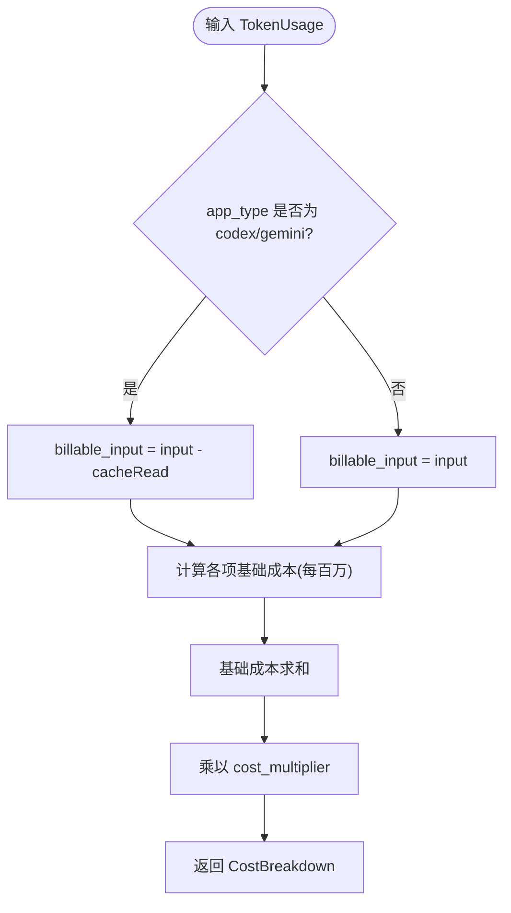
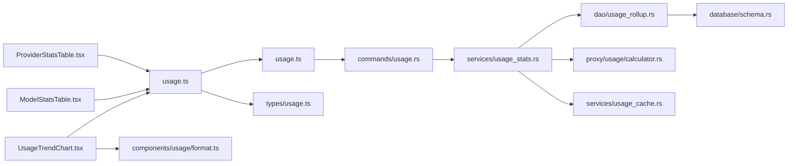

# 统计聚合与报表

<cite>
**本文引用的文件**   
- [src/components/usage/ProviderStatsTable.tsx](file://src/components/usage/ProviderStatsTable.tsx)
- [src/components/usage/ModelStatsTable.tsx](file://src/components/usage/ModelStatsTable.tsx)
- [src/components/usage/UsageTrendChart.tsx](file://src/components/usage/UsageTrendChart.tsx)
- [src/lib/query/usage.ts](file://src/lib/query/usage.ts)
- [src/lib/api/usage.ts](file://src/lib/api/usage.ts)
- [src-tauri/src/commands/usage.rs](file://src-tauri/src/commands/usage.rs)
- [src-tauri/src/services/usage_stats.rs](file://src-tauri/src/services/usage_stats.rs)
- [src-tauri/src/database/dao/usage_rollup.rs](file://src-tauri/src/database/dao/usage_rollup.rs)
- [src-tauri/src/database/schema.rs](file://src-tauri/src/database/schema.rs)
- [src-tauri/src/proxy/usage/calculator.rs](file://src-tauri/src/proxy/usage/calculator.rs)
- [src-tauri/src/services/usage_cache.rs](file://src-tauri/src/services/usage_cache.rs)
- [src/types/usage.ts](file://src/types/usage.ts)
- [src/components/usage/format.ts](file://src/components/usage/format.ts)
- [docs/user-manual/en/4-proxy/4.4-usage.md](file://docs/user-manual/en/4-proxy/4.4-usage.md)
- [docs/user-manual/ja/4-proxy/4.4-usage.md](file://docs/user-manual/ja/4-proxy/4.4-usage.md)
</cite>

## 目录
1. [简介](#简介)
2. [项目结构](#项目结构)
3. [核心组件](#核心组件)
4. [架构总览](#架构总览)
5. [详细组件分析](#详细组件分析)
6. [依赖关系分析](#依赖关系分析)
7. [性能考虑](#性能考虑)
8. [故障排查指南](#故障排查指南)
9. [结论](#结论)
10. [附录](#附录)

## 简介
本文件面向 CC Switch 的统计聚合与报表系统，聚焦以下目标：
- 供应商统计表格：按供应商维度进行请求次数、Token、成本、成功率、平均延迟等指标的聚合与排序。
- 模型统计表格：按模型维度进行使用量、总成本与平均成本的统计与排序。
- 时间窗口与滚动聚合：基于本地时区边界对明细日志进行日级聚合，并裁剪过期明细，支持趋势图的时间粒度切换。
- 成本计算与分摊：通过高精度 Decimal 实现输入/输出/缓存读取/缓存创建的成本拆解与倍率调整。
- 报表与导出：提供前端图表与表格组件、查询键管理、刷新策略与格式化工具；结合用户手册说明使用范围与解读方法。

## 项目结构
统计子系统由“前端查询与展示层”、“后端命令与服务层”、“数据库与聚合层”三部分组成：
- 前端层：表格与趋势图组件负责渲染与交互；React Query 管理查询键、刷新与缓存。
- 后端层：Tauri 命令桥接前端请求到数据库服务；服务层封装统计聚合逻辑。
- 数据库层：明细表记录原始请求日志；日聚合表存储按天聚合结果；定时任务执行滚动与裁剪。

**图表来源**
- [src/lib/query/usage.ts:126-231](file://src/lib/query/usage.ts#L126-L231)
- [src/lib/api/usage.ts:20-147](file://src/lib/api/usage.ts#L20-L147)
- [src-tauri/src/commands/usage.rs:10-70](file://src-tauri/src/commands/usage.rs#L10-L70)
- [src-tauri/src/services/usage_stats.rs:1-41](file://src-tauri/src/services/usage_stats.rs#L1-L41)
- [src-tauri/src/database/dao/usage_rollup.rs:57-179](file://src-tauri/src/database/dao/usage_rollup.rs#L57-L179)
- [src-tauri/src/database/schema.rs:260-283](file://src-tauri/src/database/schema.rs#L260-L283)
- [src-tauri/src/proxy/usage/calculator.rs:28-129](file://src-tauri/src/proxy/usage/calculator.rs#L28-L129)
- [src-tauri/src/services/usage_cache.rs:1-157](file://src-tauri/src/services/usage_cache.rs#L1-L157)

**章节来源**
- [src/lib/query/usage.ts:1-320](file://src/lib/query/usage.ts#L1-L320)
- [src/lib/api/usage.ts:1-148](file://src/lib/api/usage.ts#L1-L148)
- [src-tauri/src/commands/usage.rs:1-314](file://src-tauri/src/commands/usage.rs#L1-L314)
- [src-tauri/src/services/usage_stats.rs:1-41](file://src-tauri/src/services/usage_stats.rs#L1-L41)
- [src-tauri/src/database/dao/usage_rollup.rs:1-534](file://src-tauri/src/database/dao/usage_rollup.rs#L1-L534)
- [src-tauri/src/database/schema.rs:260-1271](file://src-tauri/src/database/schema.rs#L260-L1271)
- [src-tauri/src/proxy/usage/calculator.rs:1-271](file://src-tauri/src/proxy/usage/calculator.rs#L1-L271)
- [src-tauri/src/services/usage_cache.rs:1-157](file://src-tauri/src/services/usage_cache.rs#L1-L157)

## 核心组件
- 供应商统计表格 ProviderStatsTable：展示供应商维度的请求数、Token、成本、成功率、平均延迟。
- 模型统计表格 ModelStatsTable：展示模型维度的请求数、Token、总成本、平均成本。
- 使用趋势图 UsageTrendChart：按小时/天粒度展示 Token 与成本趋势。
- 查询与刷新：React Query 管理查询键、刷新间隔与后台刷新。
- API 层：统一的 invoke 调用封装，屏蔽前后端差异。
- 命令层：Tauri 命令将前端请求转发至数据库服务。
- 服务层：封装汇总、按应用拆分、趋势、供应商/模型统计等逻辑。
- DAO 层：执行日聚合与明细裁剪，确保聚合完整性与时序正确性。
- 成本计算器：高精度 Decimal 计算输入/输出/缓存读取/缓存创建成本，支持倍率。
- 进程内缓存：托盘/脚本用量的轻量缓存，写穿式，进程重启失效。

**章节来源**
- [src/components/usage/ProviderStatsTable.tsx:1-96](file://src/components/usage/ProviderStatsTable.tsx#L1-L96)
- [src/components/usage/ModelStatsTable.tsx:1-90](file://src/components/usage/ModelStatsTable.tsx#L1-L90)
- [src/components/usage/UsageTrendChart.tsx:1-236](file://src/components/usage/UsageTrendChart.tsx#L1-L236)
- [src/lib/query/usage.ts:126-231](file://src/lib/query/usage.ts#L126-L231)
- [src/lib/api/usage.ts:20-147](file://src/lib/api/usage.ts#L20-L147)
- [src-tauri/src/commands/usage.rs:10-70](file://src-tauri/src/commands/usage.rs#L10-L70)
- [src-tauri/src/services/usage_stats.rs:15-41](file://src-tauri/src/services/usage_stats.rs#L15-L41)
- [src-tauri/src/database/dao/usage_rollup.rs:57-179](file://src-tauri/src/database/dao/usage_rollup.rs#L57-L179)
- [src-tauri/src/proxy/usage/calculator.rs:28-129](file://src-tauri/src/proxy/usage/calculator.rs#L28-L129)
- [src-tauri/src/services/usage_cache.rs:1-157](file://src-tauri/src/services/usage_cache.rs#L1-L157)

## 架构总览
统计系统采用“前端查询—命令桥接—服务聚合—数据库滚动”的分层架构。关键流程如下：
- 前端通过 React Query 发起统计请求，携带时间范围与应用类型过滤。
- Tauri 命令接收参数并调用数据库服务层。
- 服务层根据时间范围与过滤条件，从日聚合表中汇总数据；必要时回填缺失成本。
- DAO 层执行日聚合与明细裁剪，保证聚合完整性与存储空间可控。
- 成本计算器按 app_type 语义与定价表计算成本，支持倍率与缓存语义修正。
- 前端组件负责渲染与交互，支持小时/天粒度的趋势图与表格。

**图表来源**
- [src/lib/query/usage.ts:126-231](file://src/lib/query/usage.ts#L126-L231)
- [src/lib/api/usage.ts:50-100](file://src/lib/api/usage.ts#L50-L100)
- [src-tauri/src/commands/usage.rs:10-70](file://src-tauri/src/commands/usage.rs#L10-L70)
- [src-tauri/src/services/usage_stats.rs:935-3286](file://src-tauri/src/services/usage_stats.rs#L935-L3286)
- [src-tauri/src/database/dao/usage_rollup.rs:115-179](file://src-tauri/src/database/dao/usage_rollup.rs#L115-L179)

## 详细组件分析

### 供应商统计表格 ProviderStatsTable
- 功能：按供应商维度展示请求总数、Token 总量、总成本、成功率、平均延迟。
- 数据来源：useProviderStats 钩子，对应 getProviderStats 命令。
- 渲染：表格组件，支持加载态与无数据占位。
- 刷新：可配置刷新间隔，0 或 false 关闭刷新。

**图表来源**
- [src/components/usage/ProviderStatsTable.tsx:20-95](file://src/components/usage/ProviderStatsTable.tsx#L20-L95)
- [src/lib/query/usage.ts:189-209](file://src/lib/query/usage.ts#L189-L209)
- [src/lib/api/usage.ts:74-80](file://src/lib/api/usage.ts#L74-L80)
- [src-tauri/src/commands/usage.rs:46-57](file://src-tauri/src/commands/usage.rs#L46-L57)

**章节来源**
- [src/components/usage/ProviderStatsTable.tsx:1-96](file://src/components/usage/ProviderStatsTable.tsx#L1-L96)
- [src/lib/query/usage.ts:189-209](file://src/lib/query/usage.ts#L189-L209)
- [src/lib/api/usage.ts:74-80](file://src/lib/api/usage.ts#L74-L80)
- [src-tauri/src/commands/usage.rs:46-57](file://src-tauri/src/commands/usage.rs#L46-L57)

### 模型统计表格 ModelStatsTable
- 功能：按模型维度展示请求总数、Token 总量、总成本、平均成本。
- 数据来源：useModelStats 钩子，对应 getModelStats 命令。
- 渲染：表格组件，支持加载态与无数据占位。
- 刷新：可配置刷新间隔。

**图表来源**
- [src/components/usage/ModelStatsTable.tsx:20-89](file://src/components/usage/ModelStatsTable.tsx#L20-L89)
- [src/lib/query/usage.ts:211-231](file://src/lib/query/usage.ts#L211-L231)
- [src/lib/api/usage.ts:82-88](file://src/lib/api/usage.ts#L82-L88)
- [src-tauri/src/commands/usage.rs:59-70](file://src-tauri/src/commands/usage.rs#L59-L70)

**章节来源**
- [src/components/usage/ModelStatsTable.tsx:1-90](file://src/components/usage/ModelStatsTable.tsx#L1-L90)
- [src/lib/query/usage.ts:211-231](file://src/lib/query/usage.ts#L211-L231)
- [src/lib/api/usage.ts:82-88](file://src/lib/api/usage.ts#L82-L88)
- [src-tauri/src/commands/usage.rs:59-70](file://src-tauri/src/commands/usage.rs#L59-L70)

### 使用趋势图 UsageTrendChart
- 功能：按小时（当日）或天（多日）粒度展示输入/输出/缓存创建/缓存命中 Token 与成本曲线。
- 数据来源：useUsageTrends 钩子，对应 getUsageTrends 命令。
- 渲染：面积图，双 Y 轴（左侧 Token，右侧成本），支持 Tooltip 与响应式容器。
- 刷新：可配置刷新间隔。

**图表来源**
- [src/components/usage/UsageTrendChart.tsx:30-235](file://src/components/usage/UsageTrendChart.tsx#L30-L235)
- [src/lib/query/usage.ts:167-187](file://src/lib/query/usage.ts#L167-L187)
- [src/lib/api/usage.ts:66-72](file://src/lib/api/usage.ts#L66-L72)
- [src-tauri/src/commands/usage.rs:33-44](file://src-tauri/src/commands/usage.rs#L33-L44)

**章节来源**
- [src/components/usage/UsageTrendChart.tsx:1-236](file://src/components/usage/UsageTrendChart.tsx#L1-L236)
- [src/lib/query/usage.ts:167-187](file://src/lib/query/usage.ts#L167-L187)
- [src/lib/api/usage.ts:66-72](file://src/lib/api/usage.ts#L66-L72)
- [src-tauri/src/commands/usage.rs:33-44](file://src-tauri/src/commands/usage.rs#L33-L44)

### 统计汇总与按应用拆分
- UsageSummary：总请求、总成本、输入/输出/缓存 Token、成功率、真实总 Token、缓存命中率。
- UsageSummaryByApp：按应用类型拆分的汇总。
- 数据来源：get_usage_summary / get_usage_summary_by_app 命令。

**图表来源**
- [src-tauri/src/services/usage_stats.rs:15-41](file://src-tauri/src/services/usage_stats.rs#L15-L41)
- [src-tauri/src/services/usage_stats.rs:35-41](file://src-tauri/src/services/usage_stats.rs#L35-L41)

**章节来源**
- [src-tauri/src/services/usage_stats.rs:15-41](file://src-tauri/src/services/usage_stats.rs#L15-L41)
- [src-tauri/src/commands/usage.rs:10-31](file://src-tauri/src/commands/usage.rs#L10-L31)

### 日聚合与滚动计算
- 聚合目标：usage_daily_rollups，按日期/应用/供应商/模型/请求模型/计价模型分组汇总。
- 聚合逻辑：INSERT OR REPLACE 合并新聚合与已有行；计算成功率、加权平均延迟。
- 裁剪策略：按本地时区边界对明细表进行裁剪，确保完整日聚合。
- 回填成本：在裁剪前尽力回填缺失成本，避免历史成本为 0 导致统计偏差。

**图表来源**
- [src-tauri/src/database/dao/usage_rollup.rs:19-55](file://src-tauri/src/database/dao/usage_rollup.rs#L19-L55)
- [src-tauri/src/database/dao/usage_rollup.rs:115-179](file://src-tauri/src/database/dao/usage_rollup.rs#L115-L179)
- [src-tauri/src/database/schema.rs:260-283](file://src-tauri/src/database/schema.rs#L260-L283)

**章节来源**
- [src-tauri/src/database/dao/usage_rollup.rs:1-534](file://src-tauri/src/database/dao/usage_rollup.rs#L1-L534)
- [src-tauri/src/database/schema.rs:260-1271](file://src-tauri/src/database/schema.rs#L260-L1271)

### 成本计算与分摊
- 成本构成：输入、输出、缓存读取、缓存创建四项成本之和，再乘以供应商倍率。
- 语义差异：Codex/Gemini 的输入 Token 已包含缓存命中，需扣除缓存读取 Token；Claude/Anthropic 的输入 Token 已为新鲜输入。
- 高精度：使用 Decimal 避免浮点误差；支持从字符串构造与倍率调整。

**图表来源**
- [src-tauri/src/proxy/usage/calculator.rs:44-109](file://src-tauri/src/proxy/usage/calculator.rs#L44-L109)
- [src/types/usage.ts:183-208](file://src/types/usage.ts#L183-L208)

**章节来源**
- [src-tauri/src/proxy/usage/calculator.rs:1-271](file://src-tauri/src/proxy/usage/calculator.rs#L1-L271)
- [src/types/usage.ts:183-208](file://src/types/usage.ts#L183-L208)

### 报表生成功能与使用指南
- 时间范围：今日（按小时）、最近 7/30 天（按天）。
- 图表说明：请求趋势、Token 趋势（输入/输出/缓存创建/缓存命中）、成本曲线。
- 表格字段：供应商/模型统计表的字段含义与排序规则。
- 用户手册参考：英文与日文版用户手册提供了字段说明、筛选器与时间粒度的详细说明。

**章节来源**
- [docs/user-manual/en/4-proxy/4.4-usage.md:44-143](file://docs/user-manual/en/4-proxy/4.4-usage.md#L44-L143)
- [docs/user-manual/ja/4-proxy/4.4-usage.md:60-187](file://docs/user-manual/ja/4-proxy/4.4-usage.md#L60-L187)

## 依赖关系分析
- 前端依赖：React Query 管理查询键与刷新；组件依赖格式化工具与类型定义。
- 后端依赖：Tauri 命令依赖 AppState 与数据库；服务层依赖成本计算器与缓存。
- 数据库依赖：明细表与聚合表的主键与维度设计影响查询性能与聚合准确性。

**图表来源**
- [src/components/usage/ProviderStatsTable.tsx:1-96](file://src/components/usage/ProviderStatsTable.tsx#L1-L96)
- [src/components/usage/ModelStatsTable.tsx:1-90](file://src/components/usage/ModelStatsTable.tsx#L1-L90)
- [src/components/usage/UsageTrendChart.tsx:1-236](file://src/components/usage/UsageTrendChart.tsx#L1-L236)
- [src/lib/query/usage.ts:1-320](file://src/lib/query/usage.ts#L1-L320)
- [src/lib/api/usage.ts:1-148](file://src/lib/api/usage.ts#L1-L148)
- [src-tauri/src/commands/usage.rs:1-314](file://src-tauri/src/commands/usage.rs#L1-L314)
- [src-tauri/src/services/usage_stats.rs:1-41](file://src-tauri/src/services/usage_stats.rs#L1-L41)
- [src-tauri/src/database/dao/usage_rollup.rs:1-534](file://src-tauri/src/database/dao/usage_rollup.rs#L1-L534)
- [src-tauri/src/database/schema.rs:260-1271](file://src-tauri/src/database/schema.rs#L260-L1271)
- [src-tauri/src/proxy/usage/calculator.rs:1-271](file://src-tauri/src/proxy/usage/calculator.rs#L1-L271)
- [src-tauri/src/services/usage_cache.rs:1-157](file://src-tauri/src/services/usage_cache.rs#L1-L157)
- [src/types/usage.ts:1-259](file://src/types/usage.ts#L1-L259)
- [src/components/usage/format.ts:1-98](file://src/components/usage/format.ts#L1-L98)

**章节来源**
- [src/lib/query/usage.ts:1-320](file://src/lib/query/usage.ts#L1-L320)
- [src/lib/api/usage.ts:1-148](file://src/lib/api/usage.ts#L1-L148)
- [src-tauri/src/commands/usage.rs:1-314](file://src-tauri/src/commands/usage.rs#L1-L314)
- [src-tauri/src/services/usage_stats.rs:1-41](file://src-tauri/src/services/usage_stats.rs#L1-L41)
- [src-tauri/src/database/dao/usage_rollup.rs:1-534](file://src-tauri/src/database/dao/usage_rollup.rs#L1-L534)
- [src-tauri/src/database/schema.rs:260-1271](file://src-tauri/src/database/schema.rs#L260-L1271)
- [src-tauri/src/proxy/usage/calculator.rs:1-271](file://src-tauri/src/proxy/usage/calculator.rs#L1-L271)
- [src-tauri/src/services/usage_cache.rs:1-157](file://src-tauri/src/services/usage_cache.rs#L1-L157)
- [src/types/usage.ts:1-259](file://src/types/usage.ts#L1-L259)
- [src/components/usage/format.ts:1-98](file://src/components/usage/format.ts#L1-L98)

## 性能考虑
- 刷新策略：默认 30 秒自动刷新，可通过 refetchInterval 控制；后台刷新可选。
- 查询键：稳定的查询键组合确保缓存命中与去重，减少重复请求。
- 聚合粒度：日聚合显著降低明细查询压力；按维度分组避免全表扫描。
- 滚动与裁剪：按本地时区边界对齐，避免半日聚合导致的统计偏差；裁剪过期明细释放存储。
- 高精度成本：Decimal 避免累积误差，适合长期趋势分析。
- 进程内缓存：托盘/脚本用量缓存避免重复查询，写穿式设计简单可靠。

**章节来源**
- [src/lib/query/usage.ts:6-11](file://src/lib/query/usage.ts#L6-L11)
- [src/lib/query/usage.ts:126-231](file://src/lib/query/usage.ts#L126-L231)
- [src-tauri/src/database/dao/usage_rollup.rs:19-55](file://src-tauri/src/database/dao/usage_rollup.rs#L19-L55)
- [src-tauri/src/proxy/usage/calculator.rs:1-271](file://src-tauri/src/proxy/usage/calculator.rs#L1-L271)
- [src-tauri/src/services/usage_cache.rs:1-157](file://src-tauri/src/services/usage_cache.rs#L1-L157)

## 故障排查指南
- 成本为 0 的请求：检查是否为未定价或倍率为 0；使用 isUnpricedUsage 辅助判断。
- 历史成本缺失：确认回填流程是否执行；DAO 在裁剪前尝试回填。
- 查询无数据：确认时间范围与应用类型过滤；检查查询键是否正确。
- 前端不刷新：检查 refetchInterval 设置；确认网络状态与命令返回。
- 用户手册参考：英文与日文版用户手册提供了字段说明、筛选器与时间粒度的详细说明，便于核对与排错。

**章节来源**
- [src/types/usage.ts:228-252](file://src/types/usage.ts#L228-L252)
- [src-tauri/src/database/dao/usage_rollup.rs:83-85](file://src-tauri/src/database/dao/usage_rollup.rs#L83-L85)
- [docs/user-manual/en/4-proxy/4.4-usage.md:44-143](file://docs/user-manual/en/4-proxy/4.4-usage.md#L44-L143)
- [docs/user-manual/ja/4-proxy/4.4-usage.md:60-187](file://docs/user-manual/ja/4-proxy/4.4-usage.md#L60-L187)

## 结论
CC Switch 的统计聚合与报表系统通过清晰的分层设计实现了高效、准确且易用的用量统计能力。前端以 React Query 管理查询与刷新，后端以 Tauri 命令桥接数据库服务，数据库层以日聚合与裁剪保障性能与准确性。成本计算采用高精度 Decimal 并考虑不同应用类型的缓存语义差异，确保统计结果可靠。配合用户手册与格式化工具，用户可以轻松解读趋势、进行成本分析与效率评估。

## 附录
- 实际统计示例与解读方法：参见用户手册中的字段说明与时间粒度说明。
- 趋势分析技巧：关注缓存命中率与成本曲线的联动，识别重复请求场景与缓存优化机会。
- 报表模板与导出：当前代码未包含自定义报表模板与导出功能；如需扩展，可在前端组件中增加导出按钮与格式化逻辑，并在后端新增相应命令与服务。

**章节来源**
- [docs/user-manual/en/4-proxy/4.4-usage.md:44-143](file://docs/user-manual/en/4-proxy/4.4-usage.md#L44-L143)
- [docs/user-manual/ja/4-proxy/4.4-usage.md:60-187](file://docs/user-manual/ja/4-proxy/4.4-usage.md#L60-L187)
- [src/components/usage/format.ts:1-98](file://src/components/usage/format.ts#L1-L98)