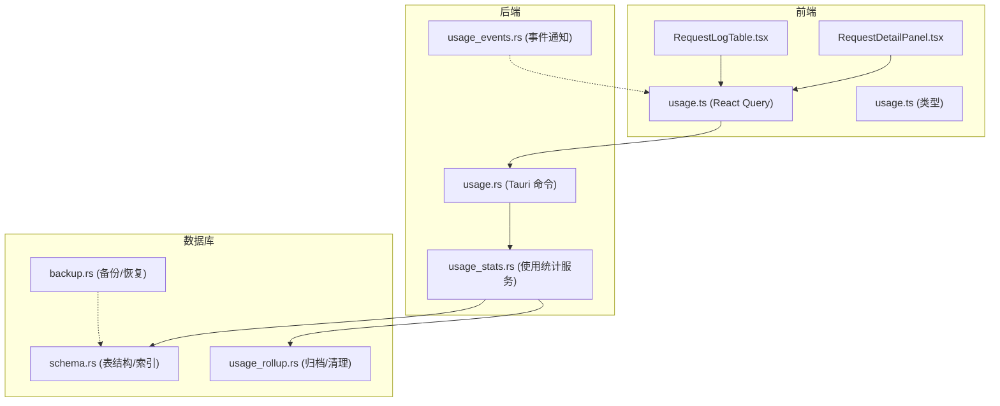
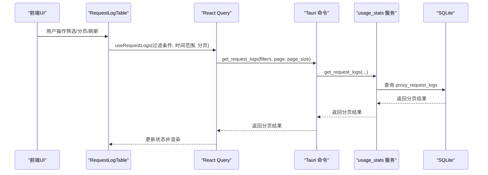
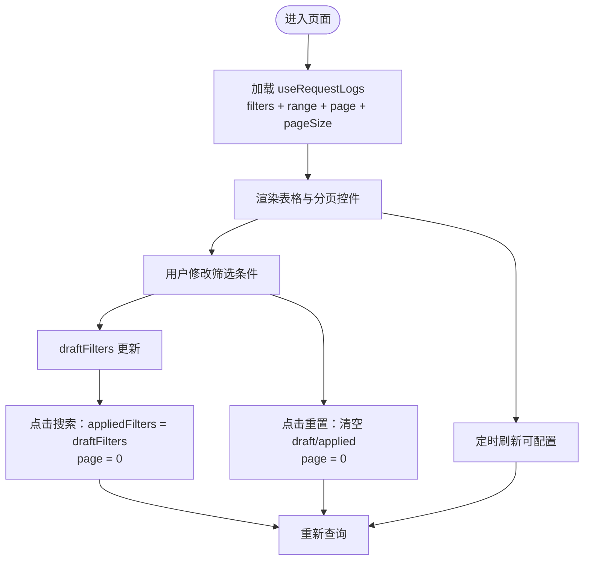
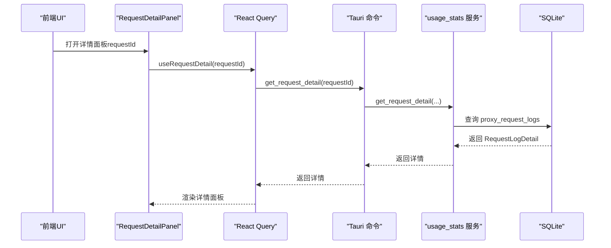
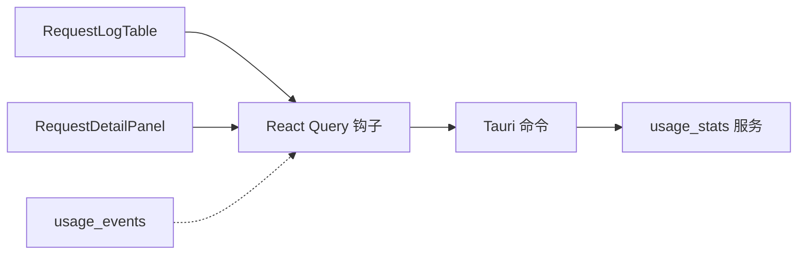

# 请求日志管理

<cite>
**本文引用的文件**
- [RequestLogTable.tsx](file://src/components/usage/RequestLogTable.tsx)
- [RequestDetailPanel.tsx](file://src/components/usage/RequestDetailPanel.tsx)
- [usage.ts](file://src/lib/query/usage.ts)
- [usage.ts](file://src/types/usage.ts)
- [schema.rs](file://src-tauri/src/database/schema.rs)
- [usage_rollup.rs](file://src-tauri/src/database/dao/usage_rollup.rs)
- [usage_stats.rs](file://src-tauri/src/services/usage_stats.rs)
- [usage.rs](file://src-tauri/src/commands/usage.rs)
- [backup.rs](file://src-tauri/src/database/backup.rs)
- [usage.md](file://docs/user-manual/en/4-proxy/4.4-usage.md)
- [usage_events.rs](file://src-tauri/src/usage_events.rs)
</cite>

## 目录
1. [简介](#简介)
2. [项目结构](#项目结构)
3. [核心组件](#核心组件)
4. [架构概览](#架构概览)
5. [详细组件分析](#详细组件分析)
6. [依赖分析](#依赖分析)
7. [性能考虑](#性能考虑)
8. [故障排除指南](#故障排除指南)
9. [结论](#结论)
10. [附录](#附录)

## 简介
本技术文档围绕 CC Switch 的请求日志管理系统展开，重点阐述请求日志表格组件的数据分页、排序筛选与详情查看功能；请求详情面板的设计思路与字段高亮策略；日志数据的存储结构、查询优化与历史清理机制；以及日志管理的最佳实践（日志级别、敏感信息过滤、性能影响评估）、实际查询示例、批量操作与导出格式说明，以及备份恢复策略与存储空间管理。

## 项目结构
请求日志管理涉及前端组件、查询钩子、类型定义、后端服务与数据库层的协同工作：
- 前端组件：请求日志表格与详情面板
- 查询与状态：React Query 钩子与查询键
- 类型系统：日志数据结构与过滤条件
- 后端服务：Tauri 命令、使用统计服务、数据库访问
- 数据库：日志表结构、索引、归档与清理



**图表来源**
- [RequestLogTable.tsx:1-505](file://src/components/usage/RequestLogTable.tsx#L1-L505)
- [RequestDetailPanel.tsx:1-325](file://src/components/usage/RequestDetailPanel.tsx#L1-L325)
- [usage.ts:1-320](file://src/lib/query/usage.ts#L1-L320)
- [usage.ts:1-259](file://src/types/usage.ts#L1-L259)
- [usage.rs:1-314](file://src-tauri/src/commands/usage.rs#L1-L314)
- [usage_stats.rs:1-200](file://src-tauri/src/services/usage_stats.rs#L1-L200)
- [schema.rs:183-220](file://src-tauri/src/database/schema.rs#L183-L220)
- [usage_rollup.rs:1-534](file://src-tauri/src/database/dao/usage_rollup.rs#L1-L534)
- [backup.rs:1-800](file://src-tauri/src/database/backup.rs#L1-L800)
- [usage_events.rs:1-28](file://src-tauri/src/usage_events.rs#L1-L28)

**章节来源**
- [RequestLogTable.tsx:1-505](file://src/components/usage/RequestLogTable.tsx#L1-L505)
- [RequestDetailPanel.tsx:1-325](file://src/components/usage/RequestDetailPanel.tsx#L1-L325)
- [usage.ts:1-320](file://src/lib/query/usage.ts#L1-L320)
- [usage.ts:1-259](file://src/types/usage.ts#L1-L259)
- [usage.rs:1-314](file://src-tauri/src/commands/usage.rs#L1-L314)
- [usage_stats.rs:1-200](file://src-tauri/src/services/usage_stats.rs#L1-L200)
- [schema.rs:183-220](file://src-tauri/src/database/schema.rs#L183-L220)
- [usage_rollup.rs:1-534](file://src-tauri/src/database/dao/usage_rollup.rs#L1-L534)
- [backup.rs:1-800](file://src-tauri/src/database/backup.rs#L1-L800)
- [usage_events.rs:1-28](file://src-tauri/src/usage_events.rs#L1-L28)

## 核心组件
- 请求日志表格组件：提供分页、筛选、范围选择与刷新控制，渲染关键指标并支持查看详情。
- 请求详情面板：展示单条请求的完整信息，包含字段高亮与错误信息标注。
- 查询钩子：封装分页与筛选参数，统一查询键与自动刷新逻辑。
- 类型系统：定义日志数据结构、过滤条件与统计类型，确保前后端一致。
- 后端服务：暴露 Tauri 命令，执行数据库查询与统计计算。
- 数据库层：定义日志表结构与索引，实现日滚动归档与历史清理。

**章节来源**
- [RequestLogTable.tsx:45-505](file://src/components/usage/RequestLogTable.tsx#L45-L505)
- [RequestDetailPanel.tsx:16-325](file://src/components/usage/RequestDetailPanel.tsx#L16-L325)
- [usage.ts:233-259](file://src/lib/query/usage.ts#L233-L259)
- [usage.ts:10-57](file://src/types/usage.ts#L10-L57)
- [usage.rs:72-90](file://src-tauri/src/commands/usage.rs#L72-L90)
- [schema.rs:183-220](file://src-tauri/src/database/schema.rs#L183-L220)

## 架构概览
请求日志管理采用“前端组件 + React Query + Tauri 命令 + Rust 服务 + SQLite 数据库”的分层架构。前端负责交互与展示，React Query 负责缓存与刷新，Tauri 命令桥接前端与后端，Rust 服务处理业务逻辑与数据库访问，SQLite 存储日志明细与聚合统计。



**图表来源**
- [RequestLogTable.tsx:65-73](file://src/components/usage/RequestLogTable.tsx#L65-L73)
- [usage.ts:233-259](file://src/lib/query/usage.ts#L233-L259)
- [usage.rs:72-90](file://src-tauri/src/commands/usage.rs#L72-L90)
- [usage_stats.rs:1314-1341](file://src-tauri/src/services/usage_stats.rs#L1314-L1341)
- [schema.rs:183-220](file://src-tauri/src/database/schema.rs#L183-L220)

## 详细组件分析

### 请求日志表格组件（RequestLogTable）
- 功能特性
  - 分页：固定每页 20 条，支持首页/尾页、上一页/下一页与页码跳转。
  - 筛选：按应用类型、状态码、供应商名称、模型名称与时间范围筛选。
  - 刷新：支持定时自动刷新（默认 30 秒）。
  - 交互：搜索按钮应用筛选，重置按钮清除筛选并回到第一页。
- 关键实现
  - 使用 React Hook 管理 draft/applied 筛选状态，避免即时查询。
  - 通过 useRequestLogs 获取数据，传入 filters、range、page、pageSize。
  - 日期范围变更或应用类型切换时重置到第一页。
  - 渲染关键指标：时间、供应商、计费模型、输入/输出 Token、成本、耗时、状态、数据源。
  - Token 展示支持缓存读取/写入标注，并对“原始输入”进行提示。
- 优化点
  - 自动刷新间隔可配置，避免频繁轮询造成性能压力。
  - 分页控件支持“省略号”显示中间页码，提升大页数体验。



**图表来源**
- [RequestLogTable.tsx:54-121](file://src/components/usage/RequestLogTable.tsx#L54-L121)
- [usage.ts:233-259](file://src/lib/query/usage.ts#L233-L259)

**章节来源**
- [RequestLogTable.tsx:45-505](file://src/components/usage/RequestLogTable.tsx#L45-L505)
- [usage.ts:233-259](file://src/lib/query/usage.ts#L233-L259)

### 请求详情面板（RequestDetailPanel）
- 设计思路
  - 以对话框形式展示单条请求的完整信息，支持加载态与未找到提示。
  - 分区展示：基本信息（请求ID、时间、供应商、模型、状态）、Token 使用量、成本明细、性能信息、错误信息。
  - 字段高亮：状态码按 2xx 成功/非 2xx 失败着色；成本倍率与未定价状态进行视觉强调；缓存读取/写入标注。
  - 错误信息：当存在错误消息时，单独区块展示并使用红色主题突出显示。
- 关键实现
  - 通过 useRequestDetail 按 requestId 查询详情。
  - 使用 getFreshInputTokens 与 isUnpricedUsage 进行语义化展示与样式控制。
  - 日期本地化展示，根据语言环境选择合适的格式。



**图表来源**
- [RequestDetailPanel.tsx:16-54](file://src/components/usage/RequestDetailPanel.tsx#L16-L54)
- [usage.ts:261-267](file://src/lib/query/usage.ts#L261-L267)
- [usage.rs:83-90](file://src-tauri/src/commands/usage.rs#L83-L90)
- [usage_stats.rs:1322-1341](file://src-tauri/src/services/usage_stats.rs#L1322-L1341)

**章节来源**
- [RequestDetailPanel.tsx:16-325](file://src/components/usage/RequestDetailPanel.tsx#L16-L325)
- [usage.ts:261-267](file://src/lib/query/usage.ts#L261-L267)
- [usage.rs:83-90](file://src-tauri/src/commands/usage.rs#L83-L90)
- [usage_stats.rs:124-155](file://src-tauri/src/services/usage_stats.rs#L124-L155)

### 查询与类型系统
- 查询钩子
  - useRequestLogs：组合 filters、range、page、pageSize 生成查询键，支持 refetchInterval 自动刷新。
  - useRequestDetail：按 requestId 查询详情，启用条件为 requestId 存在。
- 类型定义
  - RequestLog：定义日志字段（请求ID、供应商、模型、Token、成本、耗时、状态、时间等）。
  - LogFilters：定义筛选条件（应用类型、供应商名称、模型、状态码、起止时间）。
  - PaginatedLogs：定义分页响应结构。
  - TokenUsage、UsageSummary、DailyStats、ProviderStats、ModelStats：统计相关类型。

**章节来源**
- [usage.ts:233-267](file://src/lib/query/usage.ts#L233-L267)
- [usage.ts:10-123](file://src/types/usage.ts#L10-L123)
- [usage.ts:52-114](file://src/types/usage.ts#L52-L114)

### 数据存储结构与查询优化
- 表结构与索引
  - proxy_request_logs：存储请求日志明细，包含请求ID、供应商、模型、Token、成本、耗时、状态、时间戳、数据源等。
  - 索引：provider_id+app_type、created_at、model、session_id、status_code，加速常用查询。
- 查询优化策略
  - 使用精确索引过滤（如按供应商、状态码、模型）减少扫描。
  - 时间范围过滤结合 created_at 索引，避免全表扫描。
  - 通过 effective_usage_log_filter 过滤重复会话行，保证统计准确性。
- 历史清理与归档
  - 按本地午夜边界对旧数据进行滚动归档，汇总到 usage_daily_rollups 并删除明细。
  - 剪枝前进行成本回填，避免历史 0 成本导致的统计偏差。
  - 定期维护：增量真空化回收空间，清理过期 stream_check_logs。

```mermaid
erDiagram
PROXY_REQUEST_LOGS {
text request_id PK
text provider_id
text app_type
text model
text request_model
text pricing_model
integer input_tokens
integer output_tokens
integer cache_read_tokens
integer cache_creation_tokens
text input_cost_usd
text output_cost_usd
text cache_read_cost_usd
text cache_creation_cost_usd
text total_cost_usd
integer latency_ms
integer first_token_ms
integer duration_ms
integer status_code
text error_message
text session_id
text provider_type
integer is_streaming
text cost_multiplier
integer created_at
text data_source
}
USAGE_DAILY_ROLLUPS {
text date
text app_type
text provider_id
text model
text request_model
text pricing_model
integer request_count
integer success_count
integer input_tokens
integer output_tokens
integer cache_read_tokens
integer cache_creation_tokens
text total_cost_usd
integer avg_latency_ms
PK date_app_type_provider_id_model_request_model_pricing_model
}
PROXY_REQUEST_LOGS ||--o{ USAGE_DAILY_ROLLUPS : "归档/汇总"
```

**图表来源**
- [schema.rs:183-220](file://src-tauri/src/database/schema.rs#L183-L220)
- [schema.rs:260-284](file://src-tauri/src/database/schema.rs#L260-L284)
- [usage_rollup.rs:115-179](file://src-tauri/src/database/dao/usage_rollup.rs#L115-L179)

**章节来源**
- [schema.rs:183-220](file://src-tauri/src/database/schema.rs#L183-L220)
- [usage_rollup.rs:57-179](file://src-tauri/src/database/dao/usage_rollup.rs#L57-L179)

### 后端服务与命令
- Tauri 命令
  - get_request_logs：接收 filters、page、page_size，调用数据库服务查询并返回分页结果。
  - get_request_detail：按 requestId 查询单条详情。
- 使用统计服务
  - 实现分页查询、详情查询、统计汇总、每日趋势、Provider/模型统计等。
  - row_to_request_log_detail：将数据库查询结果映射为 RequestLogDetail 结构。

**章节来源**
- [usage.rs:72-90](file://src-tauri/src/commands/usage.rs#L72-L90)
- [usage_stats.rs:157-198](file://src-tauri/src/services/usage_stats.rs#L157-L198)

### 备份恢复与存储空间管理
- 备份策略
  - 二进制快照备份：定期创建数据库快照，支持列出、重命名、删除备份。
  - SQL 导出/导入：支持完整导出与 WebDAV 同步专用导出（跳过本地数据），导入时进行安全校验与迁移。
- 存储空间管理
  - 定期维护：滚动归档与剪枝、增量真空化回收空间。
  - 备份保留：按配置保留最新 N 个备份，自动清理旧备份。
  - 同步导入时可保留本地“仅本地表”数据（如请求日志、滚动汇总、健康检查日志）。

**章节来源**
- [backup.rs:297-334](file://src-tauri/src/database/backup.rs#L297-L334)
- [backup.rs:515-549](file://src-tauri/src/database/backup.rs#L515-L549)
- [backup.rs:551-599](file://src-tauri/src/database/backup.rs#L551-L599)
- [backup.rs:688-800](file://src-tauri/src/database/backup.rs#L688-L800)
- [usage_rollup.rs:279-293](file://src-tauri/src/database/dao/usage_rollup.rs#L279-L293)

## 依赖分析
- 组件耦合
  - RequestLogTable 依赖 React Query 钩子与 UI 组件库，通过 useRequestLogs 获取数据。
  - RequestDetailPanel 依赖 useRequestDetail 与类型定义，渲染详情。
- 查询键与缓存
  - usageKeys 统一管理查询键，确保相同参数命中同一缓存。
  - refetchInterval 控制自动刷新频率，避免过度轮询。
- 事件驱动刷新
  - 写入日志后通过 usage_events 发送事件，前端收到后主动失效查询缓存，减少轮询延迟。



**图表来源**
- [RequestLogTable.tsx:20-27](file://src/components/usage/RequestLogTable.tsx#L20-L27)
- [RequestDetailPanel.tsx:8-9](file://src/components/usage/RequestDetailPanel.tsx#L8-L9)
- [usage.ts:32-123](file://src/lib/query/usage.ts#L32-L123)
- [usage_events.rs:19-28](file://src-tauri/src/usage_events.rs#L19-L28)

**章节来源**
- [usage.ts:32-123](file://src/lib/query/usage.ts#L32-L123)
- [usage_events.rs:1-28](file://src-tauri/src/usage_events.rs#L1-L28)

## 性能考虑
- 查询性能
  - 利用索引过滤（provider_id、status_code、model、created_at）降低扫描成本。
  - 时间范围与筛选条件组合使用，避免全表扫描。
- 前端性能
  - 分页与自动刷新间隔可控，默认 30 秒，可根据负载调整。
  - 表格渲染使用虚拟化与节流策略（如分页控件省略号显示）。
- 数据库维护
  - 滚动归档与剪枝减少明细表体积，提高查询效率。
  - 增量真空化回收空间，避免数据库膨胀。
- 实时性
  - 写入日志后通过事件通知前端失效缓存，减少轮询等待。

[本节为通用指导，无需特定文件引用]

## 故障排除指南
- 常见问题
  - 详情未显示：确认 requestId 是否有效，检查 useRequestDetail 的 enabled 条件。
  - 查询无数据：检查筛选条件与时间范围，确认索引是否生效。
  - 自动刷新无效：检查 refetchInterval 设置与网络状态。
  - 备份/恢复失败：检查文件格式与权限，确认导入 SQL 为 CC Switch 导出格式。
- 排查步骤
  - 查看浏览器控制台与应用日志。
  - 验证数据库表结构与索引是否存在。
  - 检查定期维护任务（归档/剪枝/备份）执行情况。
  - 使用 RequestDetailPanel 的错误信息区块定位异常请求。

**章节来源**
- [RequestDetailPanel.tsx:41-54](file://src/components/usage/RequestDetailPanel.tsx#L41-L54)
- [backup.rs:166-177](file://src-tauri/src/database/backup.rs#L166-L177)

## 结论
CC Switch 的请求日志管理系统通过清晰的分层架构与完善的数据库设计，实现了高效、可维护的日志查询与管理能力。前端组件提供直观的筛选与分页体验，后端服务与数据库层通过索引、归档与清理策略保障性能与稳定性。配合备份恢复与定期维护机制，系统能够在长期运行中保持良好的可用性与可扩展性。

[本节为总结性内容，无需特定文件引用]

## 附录

### 日志查询示例
- 基本分页查询
  - 参数：filters（应用类型/供应商/模型/状态码/起止时间），page（从 0 开始），pageSize（20）。
  - 返回：PaginatedLogs（data、total、page、pageSize）。
- 详情查询
  - 参数：requestId（字符串）。
  - 返回：RequestLogDetail 或 null。
- 统计查询
  - 汇总：get_usage_summary(start_date?, end_date?, app_type?)
  - 每日趋势：get_usage_trends(start_date?, end_date?, app_type?)
  - Provider 统计：get_provider_stats(start_date?, end_date?, app_type?)
  - 模型统计：get_model_stats(start_date?, end_date?, app_type?)

**章节来源**
- [usage.rs:10-70](file://src-tauri/src/commands/usage.rs#L10-L70)
- [usage_stats.rs:15-97](file://src-tauri/src/services/usage_stats.rs#L15-L97)

### 批量操作与导出格式
- 批量操作
  - 通过前端筛选与分页，可对当前视图下的日志进行批量导出或进一步处理。
- 导出格式
  - SQL 导出：支持完整导出与 WebDAV 同步专用导出（跳过本地数据），导入时进行格式校验与迁移。
  - 备份管理：支持列出、重命名、删除备份文件，自动清理过期备份。

**章节来源**
- [backup.rs:46-92](file://src-tauri/src/database/backup.rs#L46-L92)
- [backup.rs:515-549](file://src-tauri/src/database/backup.rs#L515-L549)
- [backup.rs:601-662](file://src-tauri/src/database/backup.rs#L601-L662)

### 最佳实践
- 日志级别设置
  - 默认启用日志记录，生产环境建议根据负载调整自动刷新间隔。
- 敏感信息过滤
  - 导出/导入时注意 SQL 文件中的敏感字段，必要时进行脱敏处理。
- 性能影响评估
  - 合理设置分页大小与刷新间隔，避免高频查询与大范围扫描。
  - 定期执行归档与维护任务，监控数据库大小与查询性能。
- 可观测性
  - 使用 RequestDetailPanel 的错误信息与状态码快速定位问题。
  - 结合统计数据（Provider/模型/每日趋势）进行容量规划与成本控制。

**章节来源**
- [RequestLogTable.tsx:70-73](file://src/components/usage/RequestLogTable.tsx#L70-L73)
- [usage.md:145-199](file://docs/user-manual/en/4-proxy/4.4-usage.md#L145-L199)