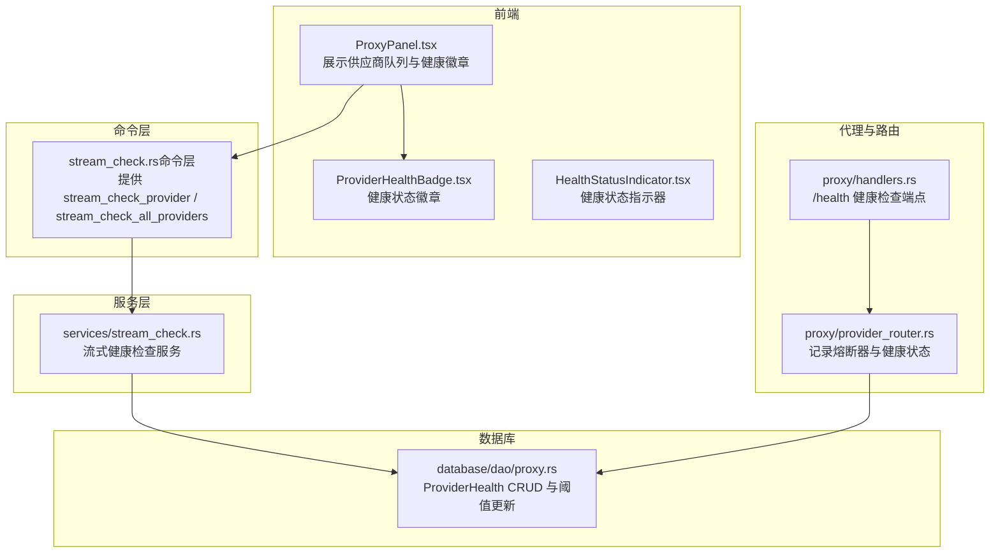
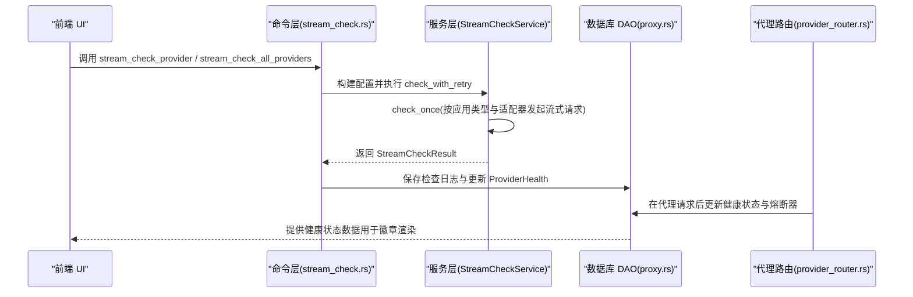
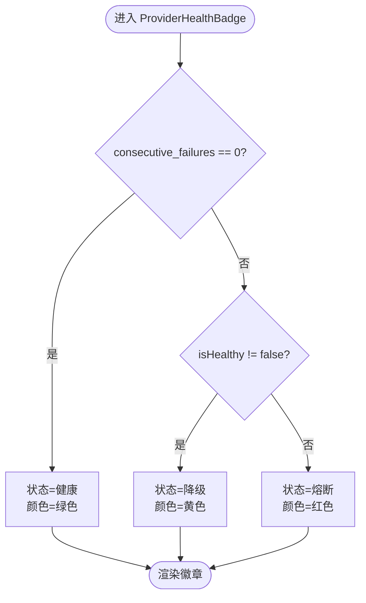
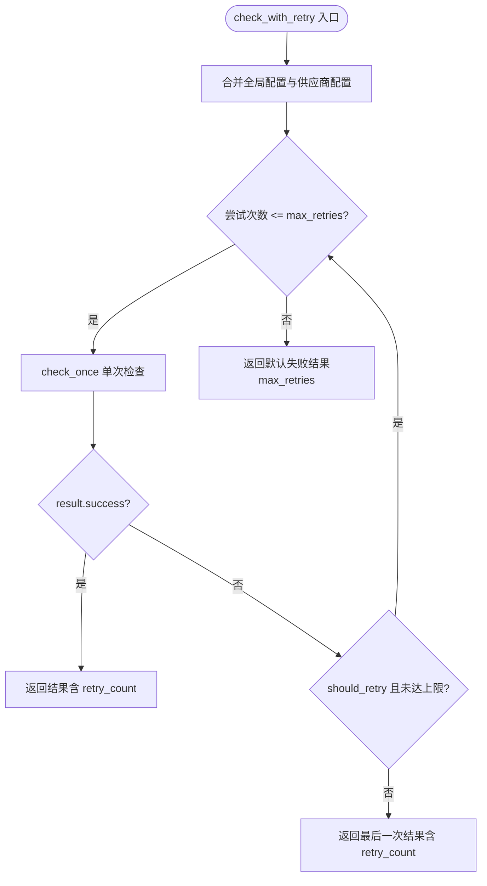
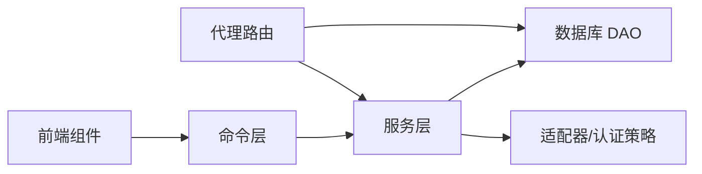

# 供应商健康检查

<cite>
**本文引用的文件列表**
- [HealthStatusIndicator.tsx](file://src/components/providers/HealthStatusIndicator.tsx)
- [ProviderHealthBadge.tsx](file://src/components/providers/ProviderHealthBadge.tsx)
- [ProxyPanel.tsx](file://src/components/proxy/ProxyPanel.tsx)
- [stream_check.rs](file://src-tauri/src/services/stream_check.rs)
- [stream_check.rs（命令层）](file://src-tauri/src/commands/stream_check.rs)
- [proxy.rs（数据库 DAO）](file://src-tauri/src/database/dao/proxy.rs)
- [provider_router.rs](file://src-tauri/src/proxy/provider_router.rs)
- [handlers.rs](file://src-tauri/src/proxy/handlers.rs)
- [en.json（国际化）](file://src/i18n/locales/en.json)
- [zh.json（国际化）](file://src/i18n/locales/zh.json)
</cite>

## 目录
1. [简介](#简介)
2. [项目结构](#项目结构)
3. [核心组件](#核心组件)
4. [架构总览](#架构总览)
5. [详细组件分析](#详细组件分析)
6. [依赖关系分析](#依赖关系分析)
7. [性能考量](#性能考量)
8. [故障排除指南](#故障排除指南)
9. [结论](#结论)
10. [附录](#附录)

## 简介
本文件面向 CC Switch 的“供应商健康检查”功能，系统化阐述健康检查机制的实现原理、状态指示规则、流式检查工作流程、配置选项与故障排除方法。重点覆盖以下方面：
- 连接测试与 API 响应验证
- 健康状态更新逻辑（含熔断器与数据库持久化）
- 健康状态指示器的显示规则（正常、警告、错误）
- 流式检查的实时连接测试、超时处理与错误重试
- 健康检查配置项（检查间隔、超时、失败阈值等）
- 常见问题与排障建议

## 项目结构
围绕健康检查的关键代码分布在前端组件与 Rust 后端服务之间，形成“前端展示 + 命令层 + 服务层 + 数据库”的分层架构。

图表来源
- [ProxyPanel.tsx:686-739](file://src/components/proxy/ProxyPanel.tsx#L686-L739)
- [ProviderHealthBadge.tsx:1-78](file://src/components/providers/ProviderHealthBadge.tsx#L1-L78)
- [HealthStatusIndicator.tsx:1-52](file://src/components/providers/HealthStatusIndicator.tsx#L1-L52)
- [stream_check.rs（命令层）:1-179](file://src-tauri/src/commands/stream_check.rs#L1-L179)
- [stream_check.rs（服务层）:1-2242](file://src-tauri/src/services/stream_check.rs#L1-L2242)
- [proxy.rs（数据库 DAO）:529-745](file://src-tauri/src/database/dao/proxy.rs#L529-L745)
- [provider_router.rs:144-176](file://src-tauri/src/proxy/provider_router.rs#L144-L176)
- [handlers.rs:45-64](file://src-tauri/src/proxy/handlers.rs#L45-L64)

章节来源
- [ProxyPanel.tsx:686-739](file://src/components/proxy/ProxyPanel.tsx#L686-L739)
- [ProviderHealthBadge.tsx:1-78](file://src/components/providers/ProviderHealthBadge.tsx#L1-L78)
- [HealthStatusIndicator.tsx:1-52](file://src/components/providers/HealthStatusIndicator.tsx#L1-L52)
- [stream_check.rs（命令层）:1-179](file://src-tauri/src/commands/stream_check.rs#L1-L179)
- [stream_check.rs（服务层）:1-2242](file://src-tauri/src/services/stream_check.rs#L1-L2242)
- [proxy.rs（数据库 DAO）:529-745](file://src-tauri/src/database/dao/proxy.rs#L529-L745)
- [provider_router.rs:144-176](file://src-tauri/src/proxy/provider_router.rs#L144-L176)
- [handlers.rs:45-64](file://src-tauri/src/proxy/handlers.rs#L45-L64)

## 核心组件
- 健康状态指示器（前端）：根据连续失败次数与健康标志渲染徽章颜色与标签。
- 流式健康检查服务（后端）：按应用类型与供应商适配器发起流式请求，仅需首个数据块即判定成功，并支持重试与错误分类。
- 命令层（后端）：暴露 Tauri 命令，聚合供应商配置与认证覆盖，执行检查并将结果持久化。
- 数据库 DAO：维护 ProviderHealth 记录，按失败阈值更新 is_healthy 与 consecutive_failures。
- 代理路由与熔断器：在代理请求后同步更新健康状态与熔断器状态。

章节来源
- [ProviderHealthBadge.tsx:1-78](file://src/components/providers/ProviderHealthBadge.tsx#L1-L78)
- [HealthStatusIndicator.tsx:1-52](file://src/components/providers/HealthStatusIndicator.tsx#L1-L52)
- [stream_check.rs（服务层）:1-2242](file://src-tauri/src/services/stream_check.rs#L1-L2242)
- [stream_check.rs（命令层）:1-179](file://src-tauri/src/commands/stream_check.rs#L1-L179)
- [proxy.rs（数据库 DAO）:529-745](file://src-tauri/src/database/dao/proxy.rs#L529-L745)
- [provider_router.rs:144-176](file://src-tauri/src/proxy/provider_router.rs#L144-L176)

## 架构总览
健康检查贯穿“前端展示—命令层—服务层—数据库—代理路由”的闭环，确保状态一致性与可观测性。

图表来源
- [stream_check.rs（命令层）:1-179](file://src-tauri/src/commands/stream_check.rs#L1-L179)
- [stream_check.rs（服务层）:88-154](file://src-tauri/src/services/stream_check.rs#L88-L154)
- [proxy.rs（数据库 DAO）:546-627](file://src-tauri/src/database/dao/proxy.rs#L546-L627)
- [provider_router.rs:144-176](file://src-tauri/src/proxy/provider_router.rs#L144-L176)

## 详细组件分析

### 健康状态指示器与徽章
- ProviderHealthBadge（队列卡片徽章）：依据 consecutive_failures 与 is_healthy 决定颜色与标签，0 次为绿色（正常），1-2 次为黄色（降级），≥3 次或 is_healthy=false 为红色（熔断）。
- HealthStatusIndicator（通用指示器）：渲染“正常/降级/失败”状态与可选响应时间，用于更广泛的健康展示场景。

图表来源
- [ProviderHealthBadge.tsx:22-53](file://src/components/providers/ProviderHealthBadge.tsx#L22-L53)

章节来源
- [ProviderHealthBadge.tsx:1-78](file://src/components/providers/ProviderHealthBadge.tsx#L1-L78)
- [HealthStatusIndicator.tsx:1-52](file://src/components/providers/HealthStatusIndicator.tsx#L1-L52)

### 流式健康检查服务
- 配置项
  - timeout_secs：单次请求超时（默认 45 秒）
  - max_retries：最大重试次数（默认 2 次）
  - degraded_threshold_ms：降级阈值（默认 6000 毫秒）
  - 测试模型：Claude、Codex、Gemini 的默认测试模型
  - test_prompt：默认“Who are you?”
- 执行流程
  - 合并供应商单独配置（meta.testConfig.enabled=true 时覆盖全局）
  - 循环重试：若首次失败且可重试，继续最多 max_retries 次
  - 单次检查：按应用类型与适配器构造请求，仅需首个数据块即判定成功
  - 错误分类：基于 HTTP 状态与响应体识别“模型不存在/配额超限”等细粒度类别
  - 结果封装：包含状态、HTTP 状态、响应时间、模型、测试时间、重试次数与错误分类
- 特殊处理
  - OpenCode/OpenClaw/Hermes：独立分发，部分协议不支持（如 Bedrock 需签名）
  - Copilot：特殊认证头与 UA，自动注入
  - Claude：支持多种 API 格式（Anthropic/OpenAI Responses/OpenAI Chat/Gemini Native）

图表来源
- [stream_check.rs（服务层）:88-154](file://src-tauri/src/services/stream_check.rs#L88-L154)

章节来源
- [stream_check.rs（服务层）:32-83](file://src-tauri/src/services/stream_check.rs#L32-L83)
- [stream_check.rs（服务层）:88-154](file://src-tauri/src/services/stream_check.rs#L88-L154)
- [stream_check.rs（服务层）:156-195](file://src-tauri/src/services/stream_check.rs#L156-L195)
- [stream_check.rs（服务层）:197-294](file://src-tauri/src/services/stream_check.rs#L197-L294)
- [stream_check.rs（服务层）:844-883](file://src-tauri/src/services/stream_check.rs#L844-L883)
- [stream_check.rs（服务层）:885-995](file://src-tauri/src/services/stream_check.rs#L885-L995)

### 命令层与配置管理
- 命令
  - stream_check_provider：对单个供应商执行流式检查
  - stream_check_all_providers：批量检查，支持仅代理目标（当前供应商+故障转移队列）
  - get_stream_check_config/save_stream_check_config：读取/保存全局检查配置
- 配置覆盖
  - 供应商 meta.testConfig.enabled=true 时，覆盖全局 timeout_secs、max_retries、degraded_threshold_ms、test_model、test_prompt
- 日志记录
  - 每次检查结果保存至日志表，便于审计与排障

章节来源
- [stream_check.rs（命令层）:13-179](file://src-tauri/src/commands/stream_check.rs#L13-L179)

### 数据库与状态更新
- ProviderHealth 记录
  - 字段：provider_id、app_type、is_healthy、consecutive_failures、last_success_at、last_failure_at、last_error、updated_at
  - 查询缺失记录时视为健康（is_healthy=true，consecutive_failures=0）
- 更新逻辑
  - 成功：重置 consecutive_failures=0，is_healthy=true
  - 失败：consecutive_failures+1，超过失败阈值（默认 5）则 is_healthy=false
  - UPSERT：保留上次成功/失败时间，仅更新变更字段
- 清理
  - reset_provider_health、clear_provider_health_for_app、clear_all_provider_health

章节来源
- [proxy.rs（数据库 DAO）:529-627](file://src-tauri/src/database/dao/proxy.rs#L529-L627)
- [proxy.rs（数据库 DAO）:629-671](file://src-tauri/src/database/dao/proxy.rs#L629-L671)

### 代理路由与熔断器联动
- 代理请求后，根据 success/error_msg 更新熔断器与健康状态
- 使用配置的失败阈值更新 ProviderHealth，确保与熔断器行为一致

章节来源
- [provider_router.rs:144-176](file://src-tauri/src/proxy/provider_router.rs#L144-L176)

### 健康检查端点
- /health：返回服务健康状态与时间戳，便于外部监控集成

章节来源
- [handlers.rs:45-64](file://src-tauri/src/proxy/handlers.rs#L45-L64)

## 依赖关系分析
- 前端依赖命令层提供的健康检查能力，通过 ProxyPanel 展示队列中每个供应商的健康徽章
- 命令层依赖服务层进行流式检查，服务层依赖适配器与认证策略
- 服务层依赖数据库 DAO 进行健康状态持久化
- 代理路由在请求后同步更新健康状态与熔断器，形成闭环

图表来源
- [ProxyPanel.tsx:686-739](file://src/components/proxy/ProxyPanel.tsx#L686-L739)
- [stream_check.rs（命令层）:1-179](file://src-tauri/src/commands/stream_check.rs#L1-L179)
- [stream_check.rs（服务层）:1-2242](file://src-tauri/src/services/stream_check.rs#L1-L2242)
- [proxy.rs（数据库 DAO）:529-745](file://src-tauri/src/database/dao/proxy.rs#L529-L745)
- [provider_router.rs:144-176](file://src-tauri/src/proxy/provider_router.rs#L144-L176)

## 性能考量
- 流式检查仅需首个数据块，显著降低延迟与资源占用
- 默认超时 45 秒、最大重试 2 次，兼顾稳定性与响应速度
- 降级阈值 6 秒用于区分“正常/降级”，避免对轻微抖动过度反应
- 供应商级测试配置可按需缩短超时或调整重试，提升特定环境下的检测效率

## 故障排除指南
- 常见错误与分类
  - 模型不存在/已下架：HTTP 4xx 且响应体包含“model_not_found”等关键词
  - 配额超限（如百度千帆 Coding Plan）：识别“coding_plan_*_quota_exceeded”
  - 请求格式被拒：400，提示探测格式可能与实际使用不同
  - 认证失败：401，检查 API Key/OAuth 设置
  - 访问受限：403，供应商可能校验客户端身份
  - 地址不存在：404，检查 Base URL 与 API 路径
- 前端提示
  - 国际化文案覆盖“运行正常/响应较慢/检查失败/检查被拒/检查出错”等场景
  - 针对“模型不存在/配额超限”提供专用提示与修复建议
- 诊断步骤
  - 使用命令层的 get_stream_check_config 查看当前配置
  - 在供应商设置中启用 meta.testConfig 并覆盖超时/重试/模型
  - 检查网络连通性与代理设置
  - 查看数据库中的 ProviderHealth 记录与最近一次错误
  - 对照 /health 端点确认服务整体健康

章节来源
- [stream_check.rs（服务层）:844-883](file://src-tauri/src/services/stream_check.rs#L844-L883)
- [zh.json（国际化）:2497-2515](file://src/i18n/locales/zh.json#L2497-L2515)
- [en.json（国际化）:2453-2567](file://src/i18n/locales/en.json#L2453-L2567)

## 结论
CC Switch 的健康检查体系以“流式快速检测 + 细粒度错误分类 + 阈值驱动的状态更新”为核心，结合前端徽章与命令层接口，实现了高可用、可观测、易排障的供应商健康保障机制。通过合理的配置与熔断器联动，系统能够在不稳定环境中维持稳定的服务体验。

## 附录

### 健康状态指示规则（前端）
- 正常：连续失败次数为 0
- 警告：连续失败次数为 1-2
- 错误：连续失败次数 ≥3 或 is_healthy=false

章节来源
- [ProviderHealthBadge.tsx:22-53](file://src/components/providers/ProviderHealthBadge.tsx#L22-L53)

### 流式检查配置项（后端）
- timeout_secs：单次请求超时（默认 45）
- max_retries：最大重试次数（默认 2）
- degraded_threshold_ms：降级阈值（默认 6000）
- 测试模型：Claude、Codex、Gemini 的默认测试模型
- 测试提示词：默认“Who are you?”

章节来源
- [stream_check.rs（服务层）:32-83](file://src-tauri/src/services/stream_check.rs#L32-L83)
- [stream_check.rs（服务层）:54-66](file://src-tauri/src/services/stream_check.rs#L54-L66)

### 健康状态更新逻辑（后端）
- 成功：重置连续失败次数，标记为健康
- 失败：连续失败次数+1，超过阈值（默认 5）标记为不健康
- 缺失记录：视为健康（关闭后清空状态，再次打开时默认正常）

章节来源
- [proxy.rs（数据库 DAO）:546-627](file://src-tauri/src/database/dao/proxy.rs#L546-L627)