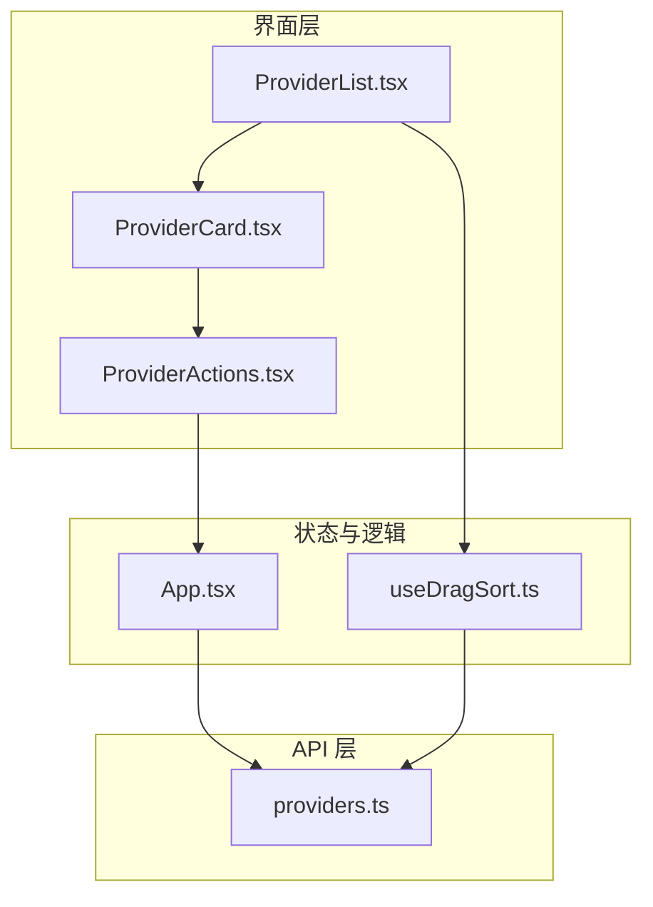
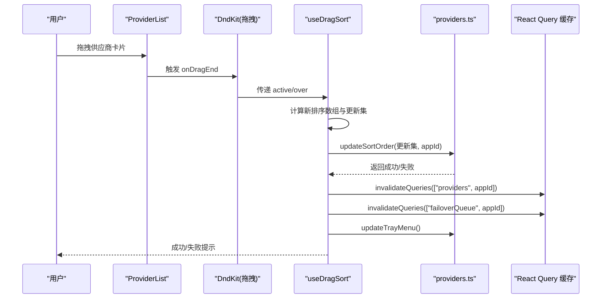
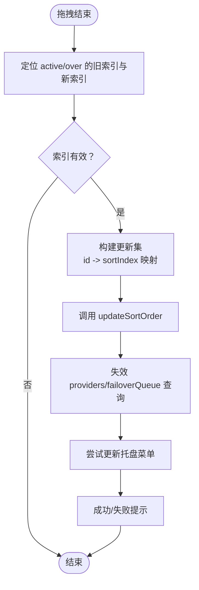
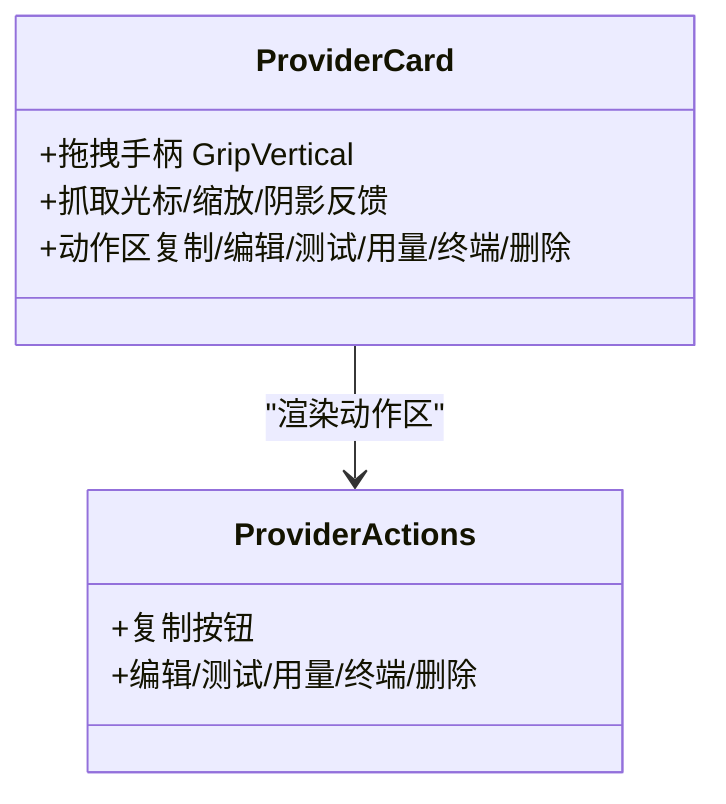
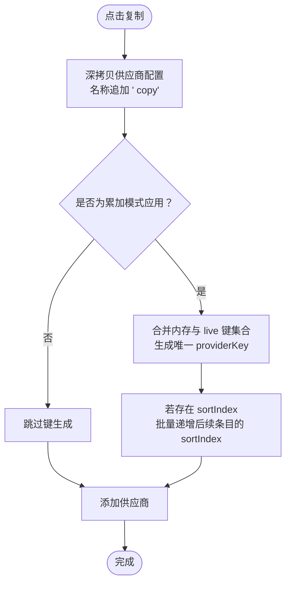
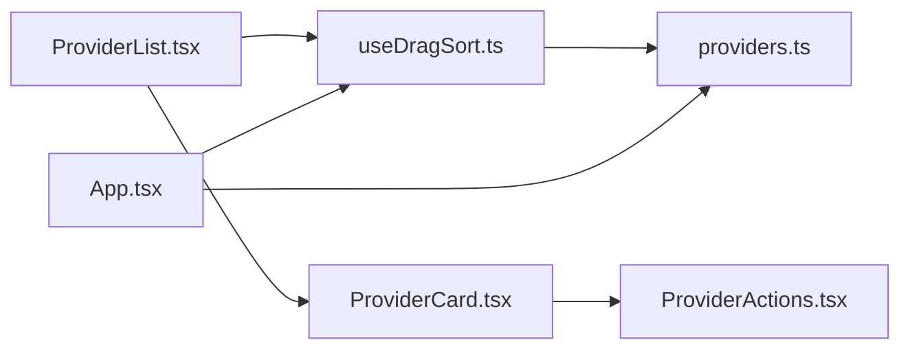

# 供应商排序与去重

<cite>
**本文引用的文件**
- [src/hooks/useDragSort.ts](file://src/hooks/useDragSort.ts)
- [src/components/providers/ProviderList.tsx](file://src/components/providers/ProviderList.tsx)
- [src/components/providers/ProviderCard.tsx](file://src/components/providers/ProviderCard.tsx)
- [src/components/providers/ProviderActions.tsx](file://src/components/providers/ProviderActions.tsx)
- [src/lib/api/providers.ts](file://src/lib/api/providers.ts)
- [src/App.tsx](file://src/App.tsx)
- [tests/hooks/useDragSort.test.tsx](file://tests/hooks/useDragSort.test.tsx)
- [docs/user-manual/zh/2-providers/2.4-sort-duplicate.md](file://docs/user-manual/zh/2-providers/2.4-sort-duplicate.md)
</cite>

## 目录
1. [简介](#简介)
2. [项目结构](#项目结构)
3. [核心组件](#核心组件)
4. [架构总览](#架构总览)
5. [详细组件分析](#详细组件分析)
6. [依赖关系分析](#依赖关系分析)
7. [性能考量](#性能考量)
8. [故障排查指南](#故障排查指南)
9. [结论](#结论)
10. [附录](#附录)

## 简介
本文件面向 CC Switch 的“供应商排序与去重”功能，系统性阐述拖拽排序机制的实现原理（DnD Kit 库使用、排序算法与状态管理）、供应商卡片的交互行为（拖拽手柄、排序动画与视觉反馈）、以及供应商去重工作流（重复检测、冲突解决策略与用户确认机制）。同时提供最佳实践、性能优化建议与用户体验设计原则，并给出实际使用场景与操作示例。

## 项目结构
围绕供应商排序与去重的关键文件组织如下：
- 排序与拖拽：useDragSort 钩子、ProviderList/DndContext、ProviderCard 拖拽手柄
- 去重与复制：App.tsx 中的复制逻辑、ProviderActions.tsx 的复制按钮、API 层 providers.ts
- 测试与文档：useDragSort.test.tsx、用户手册（排序与去重）

**图表来源**
- [src/components/providers/ProviderList.tsx:398-468](file://src/components/providers/ProviderList.tsx#L398-L468)
- [src/components/providers/ProviderCard.tsx:327-339](file://src/components/providers/ProviderCard.tsx#L327-L339)
- [src/components/providers/ProviderActions.tsx:298-306](file://src/components/providers/ProviderActions.tsx#L298-L306)
- [src/hooks/useDragSort.ts:16-118](file://src/hooks/useDragSort.ts#L16-L118)
- [src/lib/api/providers.ts:118-123](file://src/lib/api/providers.ts#L118-L123)
- [src/App.tsx:681-773](file://src/App.tsx#L681-L773)

**章节来源**
- [src/components/providers/ProviderList.tsx:398-468](file://src/components/providers/ProviderList.tsx#L398-L468)
- [src/hooks/useDragSort.ts:16-118](file://src/hooks/useDragSort.ts#L16-L118)
- [src/lib/api/providers.ts:118-123](file://src/lib/api/providers.ts#L118-L123)
- [src/App.tsx:681-773](file://src/App.tsx#L681-L773)

## 核心组件
- useDragSort 钩子：负责根据 sortIndex/createdAt/name 对供应商进行稳定排序；配置 DnD 传感器；处理拖拽结束事件并调用 API 更新排序、失效查询缓存、刷新托盘菜单等。
- ProviderList：封装 DndContext/SortableContext，渲染可拖拽的供应商卡片列表，支持搜索过滤与故障转移队列联动。
- ProviderCard：展示供应商信息与动作，提供拖拽手柄（GripVertical），在拖拽过程中提供视觉反馈（抓取光标、缩放阴影等）。
- ProviderActions：提供复制、编辑、测试、用量配置、打开终端、删除等操作入口。
- providers.ts API：封装 updateSortOrder、updateTrayMenu、getOpenCode/LiveProviderIds 等底层能力。
- App.tsx：实现“复制供应商”的业务逻辑，含去重键生成、排序索引调整、错误处理与用户提示。

**章节来源**
- [src/hooks/useDragSort.ts:16-118](file://src/hooks/useDragSort.ts#L16-L118)
- [src/components/providers/ProviderList.tsx:398-468](file://src/components/providers/ProviderList.tsx#L398-L468)
- [src/components/providers/ProviderCard.tsx:327-339](file://src/components/providers/ProviderCard.tsx#L327-L339)
- [src/components/providers/ProviderActions.tsx:298-306](file://src/components/providers/ProviderActions.tsx#L298-L306)
- [src/lib/api/providers.ts:118-123](file://src/lib/api/providers.ts#L118-L123)
- [src/App.tsx:681-773](file://src/App.tsx#L681-L773)

## 架构总览
排序与去重的端到端流程如下：

**图表来源**
- [src/components/providers/ProviderList.tsx:398-401](file://src/components/providers/ProviderList.tsx#L398-L401)
- [src/hooks/useDragSort.ts:53-112](file://src/hooks/useDragSort.ts#L53-L112)
- [src/lib/api/providers.ts:118-123](file://src/lib/api/providers.ts#L118-L123)

**章节来源**
- [src/components/providers/ProviderList.tsx:398-401](file://src/components/providers/ProviderList.tsx#L398-L401)
- [src/hooks/useDragSort.ts:53-112](file://src/hooks/useDragSort.ts#L53-L112)
- [src/lib/api/providers.ts:118-123](file://src/lib/api/providers.ts#L118-L123)

## 详细组件分析

### 拖拽排序机制与状态管理
- 排序算法
  - 优先级：sortIndex 存在则按数值升序；否则按 createdAt 升序；最后按名称本地化比较。
  - 保证稳定：当 sortIndex/createdAt 均缺失或相等时，通过名称排序确保每次渲染结果一致。
- DnD 集成
  - DndContext + SortableContext + verticalListSortingStrategy。
  - 传感器：PointerSensor（距离阈值 8）+ KeyboardSensor（键盘坐标）。
  - 拖拽结束回调：计算旧索引与新索引，生成连续更新集，批量调用 API 更新排序。
- 状态与副作用
  - 成功：toast 提示；失效 providers 与 failoverQueue 查询；尝试更新托盘菜单（失败不影响主流程）。
  - 失败：记录日志并提示错误。

**图表来源**
- [src/hooks/useDragSort.ts:53-112](file://src/hooks/useDragSort.ts#L53-L112)
- [src/lib/api/providers.ts:118-123](file://src/lib/api/providers.ts#L118-L123)

**章节来源**
- [src/hooks/useDragSort.ts:16-118](file://src/hooks/useDragSort.ts#L16-L118)
- [src/components/providers/ProviderList.tsx:398-401](file://src/components/providers/ProviderList.tsx#L398-L401)
- [tests/hooks/useDragSort.test.tsx:75-119](file://tests/hooks/useDragSort.test.tsx#L75-L119)

### 供应商卡片交互行为
- 拖拽手柄
  - 左侧 GripVertical 按钮，支持鼠标拖拽与键盘操作。
  - 拖拽时卡片获得“抓取光标、轻微放大、阴影增强”的视觉反馈。
- 动画与过渡
  - ProviderList 使用 Framer Motion 实现搜索面板的进入/退出动画。
  - ProviderCard 的容器具备 hover/active 状态下的边框与渐变背景过渡。
- 行为细节
  - 拖拽过程中，卡片层级提升，避免被其他元素遮挡。
  - 手柄区域具备无障碍标签，便于键盘导航。

**图表来源**
- [src/components/providers/ProviderCard.tsx:327-339](file://src/components/providers/ProviderCard.tsx#L327-L339)
- [src/components/providers/ProviderActions.tsx:298-306](file://src/components/providers/ProviderActions.tsx#L298-L306)

**章节来源**
- [src/components/providers/ProviderCard.tsx:327-339](file://src/components/providers/ProviderCard.tsx#L327-L339)
- [src/components/providers/ProviderActions.tsx:298-306](file://src/components/providers/ProviderActions.tsx#L298-L306)

### 供应商去重工作流
- 复制触发
  - 用户点击卡片动作区的“复制”按钮，触发 App.tsx 的 handleDuplicateProvider。
- 复制内容
  - 名称追加 “ copy”，深拷贝 settingsConfig、meta、icon、iconColor 等字段。
  - 若为累加模式应用（OpenCode/OpenClaw/Hermes），复制时将 sortIndex 设为原供应商的 sortIndex + 1，以便插入到原供应商下方。
- 去重键生成（累加模式）
  - 读取当前内存中的供应商键集合与 live 配置中的供应商键集合，合并去重后生成唯一 providerKey。
  - 生成规则：若基础键可用则直接使用；否则追加 -2/-3... 直至可用。
- 排序索引调整
  - 若原供应商存在 sortIndex，则对所有“sortIndex ≥ 新索引且非自身”的供应商批量递增其 sortIndex，确保插入位置正确。
  - 调整失败时中断复制流程并提示错误。
- 创建与完成
  - 调用添加供应商流程（addProvider），完成后返回成功提示。

**图表来源**
- [src/App.tsx:681-773](file://src/App.tsx#L681-L773)
- [src/lib/api/providers.ts:164-182](file://src/lib/api/providers.ts#L164-L182)

**章节来源**
- [src/App.tsx:681-773](file://src/App.tsx#L681-L773)
- [src/components/providers/ProviderActions.tsx:298-306](file://src/components/providers/ProviderActions.tsx#L298-L306)
- [src/lib/api/providers.ts:164-182](file://src/lib/api/providers.ts#L164-L182)

## 依赖关系分析
- ProviderList 依赖 useDragSort 提供排序列表与 DnD 传感器。
- useDragSort 依赖 providersApi.updateSortOrder 与 React Query 进行缓存失效。
- ProviderCard 依赖 ProviderActions 渲染操作按钮。
- App.tsx 在复制逻辑中依赖 providersApi.getOpenCode/LiveProviderIds 与 updateSortOrder。
- 文档与用户手册提供操作步骤与预期行为参考。

**图表来源**
- [src/components/providers/ProviderList.tsx:96-99](file://src/components/providers/ProviderList.tsx#L96-L99)
- [src/hooks/useDragSort.ts:16-118](file://src/hooks/useDragSort.ts#L16-L118)
- [src/components/providers/ProviderCard.tsx:654-691](file://src/components/providers/ProviderCard.tsx#L654-L691)
- [src/components/providers/ProviderActions.tsx:298-306](file://src/components/providers/ProviderActions.tsx#L298-L306)
- [src/lib/api/providers.ts:118-123](file://src/lib/api/providers.ts#L118-L123)
- [src/App.tsx:681-773](file://src/App.tsx#L681-L773)

**章节来源**
- [src/components/providers/ProviderList.tsx:96-99](file://src/components/providers/ProviderList.tsx#L96-L99)
- [src/hooks/useDragSort.ts:16-118](file://src/hooks/useDragSort.ts#L16-L118)
- [src/components/providers/ProviderCard.tsx:654-691](file://src/components/providers/ProviderCard.tsx#L654-L691)
- [src/components/providers/ProviderActions.tsx:298-306](file://src/components/providers/ProviderActions.tsx#L298-L306)
- [src/lib/api/providers.ts:118-123](file://src/lib/api/providers.ts#L118-L123)
- [src/App.tsx:681-773](file://src/App.tsx#L681-L773)

## 性能考量
- 排序稳定性
  - 通过 sortIndex/createdAt/名称三段式排序，减少不必要的 DOM 重排；仅在拖拽结束时批量更新，避免频繁小步变更。
- DnD 体验
  - PointerSensor 设置最小移动距离，降低误触；键盘传感器支持无障碍操作。
- 缓存与网络
  - 成功更新排序后，仅失效相关查询键，避免全量刷新；托盘菜单更新失败不影响主流程。
- 复制流程
  - 仅在累加模式下进行 live 键集合合并与 providerKey 生成，避免对非累加模式产生额外 IO。
  - 批量更新后续条目的 sortIndex，减少多次往返请求。

[本节为通用性能讨论，无需具体文件分析]

## 故障排查指南
- 拖拽排序失败
  - 现象：提示“排序更新失败”，控制台打印错误。
  - 排查：检查网络与后端响应；确认 appId 正确；查看 providersApi.updateSortOrder 的返回。
  - 参考：useDragSort 的错误分支与 toast 提示。
- 托盘菜单未更新
  - 现象：排序成功但托盘菜单未变化。
  - 排查：该操作失败不影响主流程，检查 providersApi.updateTrayMenu 的调用与权限。
- 复制失败或键冲突
  - 现象：复制后出现重复键或 live 键冲突。
  - 排查：确认已正确合并内存与 live 键集合；检查 generateUniqueProviderCopyKey 的生成逻辑；查看 App.tsx 中的错误提示。
- 测试用例验证
  - 参考 useDragSort.test.tsx，覆盖排序顺序、API 调用次数、错误提示与缓存失效行为。

**章节来源**
- [src/hooks/useDragSort.ts:77-109](file://src/hooks/useDragSort.ts#L77-L109)
- [src/App.tsx:721-732](file://src/App.tsx#L721-L732)
- [tests/hooks/useDragSort.test.tsx:121-139](file://tests/hooks/useDragSort.test.tsx#L121-L139)

## 结论
CC Switch 的供应商排序与去重功能以 DnD Kit 为核心，结合稳定的排序算法与 React Query 缓存策略，实现了流畅的拖拽排序体验；在累加模式下，通过合并内存与 live 键集合，确保复制后的键唯一性与插入位置正确。整体设计兼顾了性能、可靠性与用户体验。

[本节为总结，无需具体文件分析]

## 附录

### 最佳实践
- 排序
  - 优先使用 sortIndex 管理稳定顺序；在新增或删除时批量更新，避免碎片化。
  - 为 DnD 设置合理的激活约束（如最小位移），减少误触。
  - 成功后仅失效必要查询键，避免全量刷新。
- 去重
  - 在累加模式下，复制前合并内存与 live 键集合，确保生成唯一键。
  - 批量调整后续条目排序索引，减少多次往返。
  - 对托盘菜单更新采用“尽力而为”策略，不影响主流程。
- 用户体验
  - 拖拽时提供明确的视觉反馈（抓取光标、阴影、缩放）。
  - 提供清晰的成功/失败提示与可选的回滚/重试路径。

[本节为通用指导，无需具体文件分析]

### 使用场景与操作示例
- 场景一：优先级排序
  - 将常用供应商置于顶部，提高日常切换效率；排序直接影响故障转移队列的默认顺序。
- 场景二：快速复制配置
  - 基于现有供应商创建变体、备份或测试配置；复制后通常需修改名称、API Key 或端点。
- 场景三：多应用统一管理
  - 通过“统一供应商”在多个应用间共享配置，复制后可在各应用内进一步细化启用的应用与模型。

**章节来源**
- [docs/user-manual/zh/2-providers/2.4-sort-duplicate.md:1-64](file://docs/user-manual/zh/2-providers/2.4-sort-duplicate.md#L1-L64)