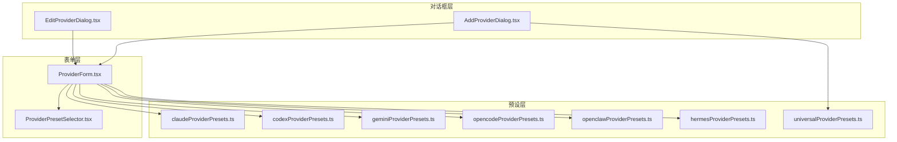
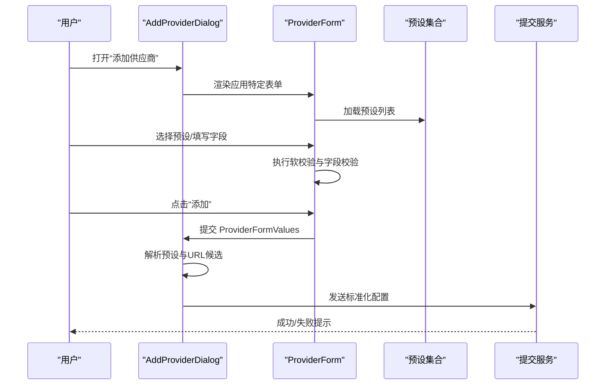
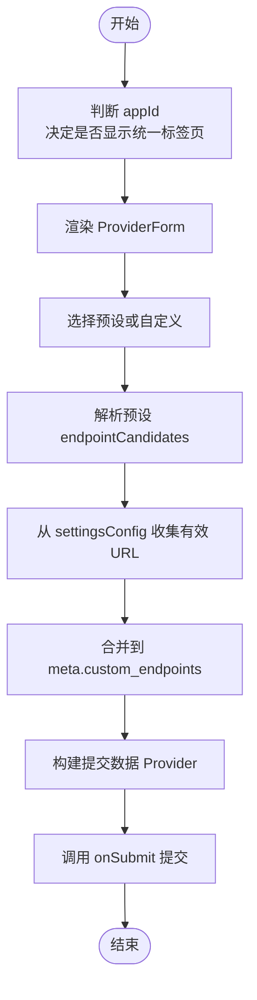
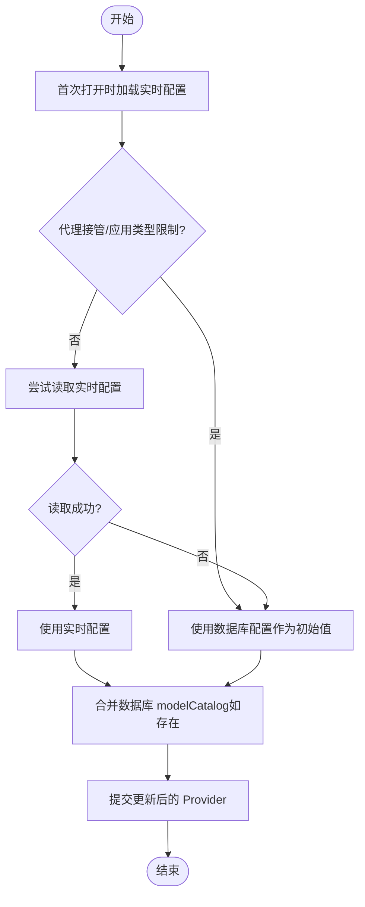
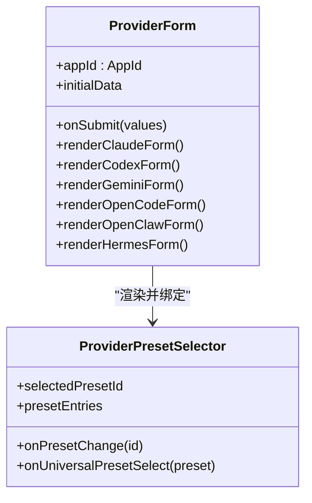
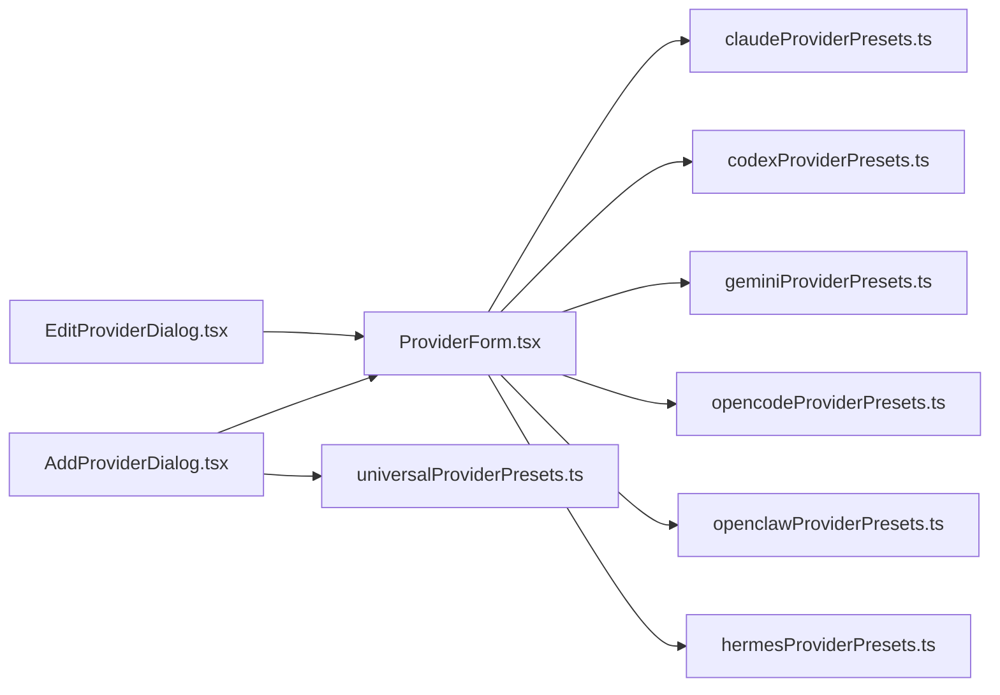

# 供应商添加与编辑

<cite>
**本文档引用的文件**
- [AddProviderDialog.tsx](file://src/components/providers/AddProviderDialog.tsx)
- [EditProviderDialog.tsx](file://src/components/providers/EditProviderDialog.tsx)
- [ProviderForm.tsx](file://src/components/providers/forms/ProviderForm.tsx)
- [ProviderPresetSelector.tsx](file://src/components/providers/forms/ProviderPresetSelector.tsx)
- [universalProviderPresets.ts](file://src/config/universalProviderPresets.ts)
- [claudeProviderPresets.ts](file://src/config/claudeProviderPresets.ts)
- [codexProviderPresets.ts](file://src/config/codexProviderPresets.ts)
- [geminiProviderPresets.ts](file://src/config/geminiProviderPresets.ts)
- [opencodeProviderPresets.ts](file://src/config/opencodeProviderPresets.ts)
- [openclawProviderPresets.ts](file://src/config/openclawProviderPresets.ts)
- [hermesProviderPresets.ts](file://src/config/hermesProviderPresets.ts)
</cite>

## 目录
1. [简介](#简介)
2. [项目结构](#项目结构)
3. [核心组件](#核心组件)
4. [架构总览](#架构总览)
5. [详细组件分析](#详细组件分析)
6. [依赖关系分析](#依赖关系分析)
7. [性能考虑](#性能考虑)
8. [故障排除指南](#故障排除指南)
9. [结论](#结论)
10. [附录](#附录)

## 简介
本指南面向 CC Switch 用户与维护者，系统性阐述“供应商添加与编辑”功能的完整流程与实现细节。内容涵盖：
- 添加新供应商的端到端流程：表单渲染、预设选择、配置校验、提交与持久化
- 编辑现有供应商的交互方式、实时配置读取策略与安全回退
- 五种主流 AI 供应商（Claude Code、Claude Desktop、Codex、Gemini CLI、OpenCode、OpenClaw、Hermes）的配置要点与字段含义
- 50+ 内置供应商预设的分类与用途说明
- 表单验证规则、错误处理机制与最佳实践建议

## 项目结构
围绕供应商添加与编辑的核心模块分布如下：
- 对话框层：AddProviderDialog、EditProviderDialog 负责弹窗控制与提交流程
- 表单层：ProviderForm 负责按应用类型渲染不同字段、绑定预设、执行校验
- 预设层：各应用的 presets 文件提供内置模板与分类
- 通用预设：universalProviderPresets 提供跨应用统一配置能力

**图表来源**
- [AddProviderDialog.tsx:38-378](file://src/components/providers/AddProviderDialog.tsx#L38-L378)
- [EditProviderDialog.tsx:25-255](file://src/components/providers/EditProviderDialog.tsx#L25-L255)
- [ProviderForm.tsx:236-242](file://src/components/providers/forms/ProviderForm.tsx#L236-L242)
- [ProviderPresetSelector.tsx:43-221](file://src/components/providers/forms/ProviderPresetSelector.tsx#L43-L221)
- [universalProviderPresets.ts:61-91](file://src/config/universalProviderPresets.ts#L61-L91)

**章节来源**
- [AddProviderDialog.tsx:38-378](file://src/components/providers/AddProviderDialog.tsx#L38-L378)
- [EditProviderDialog.tsx:25-255](file://src/components/providers/EditProviderDialog.tsx#L25-L255)
- [ProviderForm.tsx:236-242](file://src/components/providers/forms/ProviderForm.tsx#L236-L242)
- [ProviderPresetSelector.tsx:43-221](file://src/components/providers/forms/ProviderPresetSelector.tsx#L43-L221)
- [universalProviderPresets.ts:61-91](file://src/config/universalProviderPresets.ts#L61-L91)

## 核心组件
- AddProviderDialog：负责渲染“添加供应商”对话框，支持应用特定表单与“统一供应商”两种视图，并在提交时进行 URL 自动收集与预设解析。
- EditProviderDialog：负责渲染“编辑供应商”对话框，具备智能读取实时配置的能力，并在代理接管场景下安全回退至数据库配置。
- ProviderForm：根据 appId 渲染对应应用的表单字段，绑定预设选择器、API Key、Base URL、模型等，执行软校验与提交。
- ProviderPresetSelector：提供预设选择 UI，展示分类提示与合作伙伴标识，支持统一供应商预设入口。
- 各应用预设文件：提供内置模板、分类、图标、端点候选、模型目录等元数据。

**章节来源**
- [AddProviderDialog.tsx:38-378](file://src/components/providers/AddProviderDialog.tsx#L38-L378)
- [EditProviderDialog.tsx:25-255](file://src/components/providers/EditProviderDialog.tsx#L25-L255)
- [ProviderForm.tsx:236-242](file://src/components/providers/forms/ProviderForm.tsx#L236-L242)
- [ProviderPresetSelector.tsx:43-221](file://src/components/providers/forms/ProviderPresetSelector.tsx#L43-L221)

## 架构总览
供应商添加与编辑遵循“对话框 → 表单 → 预设”的分层设计，提交阶段对配置进行规范化与 URL 收集，编辑阶段通过“实时配置 + 数据库配置”的双轨策略确保一致性与安全性。

**图表来源**
- [AddProviderDialog.tsx:91-278](file://src/components/providers/AddProviderDialog.tsx#L91-L278)
- [ProviderForm.tsx:385-397](file://src/components/providers/forms/ProviderForm.tsx#L385-L397)

**章节来源**
- [AddProviderDialog.tsx:91-278](file://src/components/providers/AddProviderDialog.tsx#L91-L278)
- [ProviderForm.tsx:385-397](file://src/components/providers/forms/ProviderForm.tsx#L385-L397)

## 详细组件分析

### 添加供应商流程（AddProviderDialog）
- 视图切换：根据 appId 控制是否显示“统一供应商”标签页；OpenCode/OpenClaw/Hermes 不显示统一视图。
- 预设解析：当选择预设时，从对应 presets 列表提取 endpointCandidates 并合并到 meta.custom_endpoints。
- URL 自动收集：根据 settingsConfig 中的 env/config/options/base_url 字段提取有效 URL，去重并写入 meta。
- 提交数据：将表单值标准化为 Provider 结构，附加 category、meta、icon 等字段，调用外部 onSubmit。

**图表来源**
- [AddProviderDialog.tsx:46-50](file://src/components/providers/AddProviderDialog.tsx#L46-L50)
- [AddProviderDialog.tsx:146-267](file://src/components/providers/AddProviderDialog.tsx#L146-L267)

**章节来源**
- [AddProviderDialog.tsx:46-50](file://src/components/providers/AddProviderDialog.tsx#L46-L50)
- [AddProviderDialog.tsx:146-267](file://src/components/providers/AddProviderDialog.tsx#L146-L267)

### 编辑供应商流程（EditProviderDialog）
- 实时配置读取：针对不同应用类型，优先尝试读取“实时配置”，但对代理接管、OpenCode 等场景进行安全回退。
- 数据源优先级：当存在数据库中的 modelCatalog 时，优先保留数据库映射，避免因 Live 反解为空导致数据丢失。
- 提交策略：将表单 JSON 解析为 settingsConfig，结合 providerKey（OpenCode/OpenClaw）生成新的 id，调用外部 onSubmit。

**图表来源**
- [EditProviderDialog.tsx:45-127](file://src/components/providers/EditProviderDialog.tsx#L45-L127)
- [EditProviderDialog.tsx:145-156](file://src/components/providers/EditProviderDialog.tsx#L145-L156)

**章节来源**
- [EditProviderDialog.tsx:45-127](file://src/components/providers/EditProviderDialog.tsx#L45-L127)
- [EditProviderDialog.tsx:145-156](file://src/components/providers/EditProviderDialog.tsx#L145-L156)

### 表单与预设选择（ProviderForm + ProviderPresetSelector）
- 预设渲染：根据 appId 选择对应的 presets 列表，生成按钮组与分类提示。
- 字段绑定：按应用类型绑定 API Key、Base URL、模型、认证参数等。
- 软校验：收集业务约束类问题（如缺少必要字段），允许用户确认后继续保存。
- 统一预设：支持一键创建“统一供应商”，跨应用共享配置。

**图表来源**
- [ProviderForm.tsx:236-800](file://src/components/providers/forms/ProviderForm.tsx#L236-L800)
- [ProviderPresetSelector.tsx:43-221](file://src/components/providers/forms/ProviderPresetSelector.tsx#L43-L221)

**章节来源**
- [ProviderForm.tsx:236-800](file://src/components/providers/forms/ProviderForm.tsx#L236-L800)
- [ProviderPresetSelector.tsx:43-221](file://src/components/providers/forms/ProviderPresetSelector.tsx#L43-L221)

### 七种 AI 供应商的配置要点与字段含义

#### Claude Code 与 Claude Desktop
- 预设分类：official、cn_official、aggregator、third_party、custom
- 关键字段：
  - API Key 字段：支持 ANTHROPIC_AUTH_TOKEN 或 ANTHROPIC_API_KEY（可通过 apiKeyField 指定）
  - Base URL：ANTHROPIC_BASE_URL
  - 模型：ANTHROPIC_MODEL、默认 Haiku/Sonnet/Opus 模型
  - API 格式：anthropic、openai_chat、openai_responses、gemini_native
  - 模板变量：如 Claude Code 的 ENDPOINT_ID
- 特殊能力：支持 Gemini Native 格式转换、模型目录 URL 覆写

**章节来源**
- [claudeProviderPresets.ts:25-73](file://src/config/claudeProviderPresets.ts#L25-L73)
- [claudeProviderPresets.ts:75-1252](file://src/config/claudeProviderPresets.ts#L75-L1252)

#### Codex（ChatGPT Plus/Pro 反代）
- 预设分类：official、cn_official、aggregator、third_party、custom
- 关键字段：
  - auth.json：OPENAI_API_KEY
  - config.toml：model_provider、model、wire_api、requires_openai_auth 等
  - API 格式：openai_chat、openai_responses
  - 模型目录：modelCatalog（含上下文窗口、显示名）
  - 推理能力：codexChatReasoning（thinking/effect）
- 特殊能力：支持 Fast Mode、Chat Reasoning、多账号 OAuth

**章节来源**
- [codexProviderPresets.ts:12-38](file://src/config/codexProviderPresets.ts#L12-L38)
- [codexProviderPresets.ts:87-1278](file://src/config/codexProviderPresets.ts#L87-L1278)

#### Gemini CLI
- 预设分类：official、aggregator、third_party、custom
- 关键字段：
  - Base URL：GOOGLE_GEMINI_BASE_URL
  - API Key：GEMINI_API_KEY
  - 模型：GEMINI_MODEL
  - 额外配置：config.security.auth.selectedType 等
- 特殊能力：支持 OpenRouter、TheRouter 等聚合网关

**章节来源**
- [geminiProviderPresets.ts:15-32](file://src/config/geminiProviderPresets.ts#L15-L32)
- [geminiProviderPresets.ts:34-422](file://src/config/geminiProviderPresets.ts#L34-L422)

#### OpenCode
- 预设分类：official、cn_official、aggregator、third_party、custom、omo
- 关键字段：
  - npm 包：@ai-sdk/openai、@ai-sdk/anthropic、@ai-sdk/google 等
  - options：baseURL、apiKey、setCacheKey 等
  - models：模型 ID 与显示名映射
  - OMO 模式：兼容 oh-my-openagent.jsonc / oh-my-opencode.jsonc
- 特殊能力：模型变体（reasoningEffort、thinkingConfig）、上下文/输出限制

**章节来源**
- [opencodeProviderPresets.ts:4-19](file://src/config/opencodeProviderPresets.ts#L4-L19)
- [opencodeProviderPresets.ts:280-1828](file://src/config/opencodeProviderPresets.ts#L280-L1828)

#### OpenClaw
- 预设分类：official、cn_official、aggregator、third_party、custom
- 关键字段：
  - baseUrl、apiKey、api（协议：openai-completions、openai-responses、anthropic-messages、google-generative-ai、bedrock-converse）
  - models：id、name、contextWindow、cost
  - suggestedDefaults：默认主模型与模型目录别名
- 特殊能力：协议适配、成本与上下文窗口标注

**章节来源**
- [openclawProviderPresets.ts:20-43](file://src/config/openclawProviderPresets.ts#L20-L43)
- [openclawProviderPresets.ts:100-2274](file://src/config/openclawProviderPresets.ts#L100-L2274)

#### Hermes
- 预设分类：official、aggregator、third_party、custom
- 关键字段：
  - name、base_url、api_key、api_mode（chat_completions、anthropic_messages、codex_responses、bedrock_converse）
  - models：id、name、context_length
  - suggestedDefaults：model.default 与 model.provider
- 特殊能力：只读标记（_cc_source）、v12+ providers 字典来源

**章节来源**
- [hermesProviderPresets.ts:99-128](file://src/config/hermesProviderPresets.ts#L99-L128)
- [hermesProviderPresets.ts:130-1386](file://src/config/hermesProviderPresets.ts#L130-L1386)

### 50+ 内置供应商预设详解
- Claude Code：包含官方、国内官方、聚合与第三方供应商，覆盖多家网关与聚合平台，提供 API Key 字段与端点候选、模板变量等。
- Codex：覆盖 Azure OpenAI、DeepSeek、Zhipu、阿里 Bailian、Kimi、StepFun、MiniMax、Longcat、ModelScope、NVIDIA、SiliconFlow 等，提供 auth.json 与 config.toml 模板、模型目录与推理能力。
- Gemini CLI：包含 Google 官方、Shengsuanyun、PackyCode、APIKEY.FUN、APINebula、SudoCode、Cubence、AIGoCode、AICodeMirror、CrazyRouter、SSSAiCode、CTok.ai、E-FlowCode、LemonData、CherryIN、OpenRouter、TheRouter、自定义等。
- OpenCode：覆盖 Shengsuanyun、火山/BytePlus、CCSub、DeepSeek、Zhipu、阿里 Bailian、Kimi、StepFun、ModelScope、KAT-Coder、Longcat、MiniMax、SiliconFlow、NVIDIA、OpenRouter、Together AI、Nous Research 等，提供 npm 包适配、模型变体与上下文限制。
- OpenClaw：覆盖 Shengsuanyun、火山/BytePlus、CCSub、DeepSeek、Zhipu、阿里 Bailian、Kimi、StepFun、MiniMax、KAT-Coder、Longcat、ModelScope、OpenRouter、Together AI、Nous Research 等，提供协议适配与成本标注。
- Hermes：覆盖 Shengsuanyun、火山/BytePlus、CCSub、OpenRouter、DeepSeek、Together AI、Nous Research、Zhipu、阿里 Bailian、Kimi、StepFun、ModelScope、KAT-Coder、Longcat、MiniMax、SiliconFlow 等，提供 api_mode 与模型上下文长度。

**章节来源**
- [claudeProviderPresets.ts:75-1252](file://src/config/claudeProviderPresets.ts#L75-L1252)
- [codexProviderPresets.ts:87-1278](file://src/config/codexProviderPresets.ts#L87-L1278)
- [geminiProviderPresets.ts:34-422](file://src/config/geminiProviderPresets.ts#L34-L422)
- [opencodeProviderPresets.ts:280-1828](file://src/config/opencodeProviderPresets.ts#L280-L1828)
- [openclawProviderPresets.ts:100-2274](file://src/config/openclawProviderPresets.ts#L100-L2274)
- [hermesProviderPresets.ts:130-1386](file://src/config/hermesProviderPresets.ts#L130-L1386)

### 统一供应商（Universal Provider）
- 设计目标：跨应用共享配置，自动同步到 Claude、Codex、Gemini
- 预设结构：包含 providerType、defaultApps、defaultModels、websiteUrl、icon/iconColor、描述、是否自定义模板
- 默认模型：NewAPI 默认模型配置包含 Claude、Codex、Gemini 的默认模型
- 创建方法：根据预设创建 UniversalProvider，支持自定义名称与模板

**章节来源**
- [universalProviderPresets.ts:15-91](file://src/config/universalProviderPresets.ts#L15-L91)
- [universalProviderPresets.ts:96-133](file://src/config/universalProviderPresets.ts#L96-L133)

## 依赖关系分析
- AddProviderDialog 依赖 ProviderForm 与各应用预设文件，负责预设解析与 URL 收集
- EditProviderDialog 依赖 providersApi、vscodeApi、openclawApi 等，实现“实时配置 + 数据库配置”的双轨策略
- ProviderForm 依赖各应用表单字段组件与 hooks，实现字段联动与校验
- 预设文件之间无直接依赖，通过 ProviderForm 的条件渲染进行组合

**图表来源**
- [AddProviderDialog.tsx:17-24](file://src/components/providers/AddProviderDialog.tsx#L17-L24)
- [EditProviderDialog.tsx:7-11](file://src/components/providers/EditProviderDialog.tsx#L7-L11)
- [ProviderForm.tsx:23-47](file://src/components/providers/forms/ProviderForm.tsx#L23-L47)

**章节来源**
- [AddProviderDialog.tsx:17-24](file://src/components/providers/AddProviderDialog.tsx#L17-L24)
- [EditProviderDialog.tsx:7-11](file://src/components/providers/EditProviderDialog.tsx#L7-L11)
- [ProviderForm.tsx:23-47](file://src/components/providers/forms/ProviderForm.tsx#L23-L47)

## 性能考虑
- 预设加载：ProviderForm 在首次渲染时一次性加载预设列表，避免重复计算
- URL 收集：仅在非自定义且无自定义端点时进行候选 URL 收集，减少不必要的网络探测
- 实时配置读取：EditProviderDialog 仅在首次打开时读取，使用 hasLoadedLive 标记避免重复读取
- 提交阶段：JSON 解析与 settingsConfig 合并发生在客户端，避免多次网络往返

[本节为通用指导，无需具体文件引用]

## 故障排除指南
- 预设未生效：检查 selectedPresetId 是否正确绑定，确认 presetEntries 生成逻辑与 appId 匹配
- URL 未自动收集：确认 settingsConfig 中对应字段（env/config/options/base_url）是否正确填写
- 实时配置读取失败：在代理接管或 OpenCode 场景下，系统会回退到数据库配置，属预期行为
- 编辑后数据丢失：数据库中的 modelCatalog 会被优先保留，避免 Live 反解为空导致映射丢失
- 统一供应商保存失败：检查 toast 错误提示与后端返回，确认统一供应商 API 调用状态

**章节来源**
- [AddProviderDialog.tsx:146-267](file://src/components/providers/AddProviderDialog.tsx#L146-L267)
- [EditProviderDialog.tsx:45-127](file://src/components/providers/EditProviderDialog.tsx#L45-L127)
- [EditProviderDialog.tsx:145-156](file://src/components/providers/EditProviderDialog.tsx#L145-L156)

## 结论
CC Switch 的供应商添加与编辑功能通过清晰的分层设计与严谨的数据流控制，实现了对七种主流 AI 供应商的全面支持。借助丰富的内置预设与统一供应商能力，用户可以快速完成配置并获得一致的使用体验。建议在实际使用中结合本文档的验证规则与最佳实践，确保配置的准确性与稳定性。

[本节为总结性内容，无需具体文件引用]

## 附录
- 表单验证规则概览
  - 必填字段：API Key、Base URL（部分分类）
  - URL 格式：必须以 http(s) 开头，末尾去除多余斜杠
  - 模型字段：OpenCode/OpenClaw/Hermes 需提供有效模型 ID
  - 预设模板：模板变量需按预设定义填写
- 最佳实践
  - 优先选择官方或国内官方预设，减少配置复杂度
  - 使用统一供应商统一管理跨应用配置
  - 在代理接管场景下谨慎编辑，避免覆盖实时配置
  - 定期清理无效端点，保持 meta.custom_endpoints 的整洁

[本节为通用指导，无需具体文件引用]