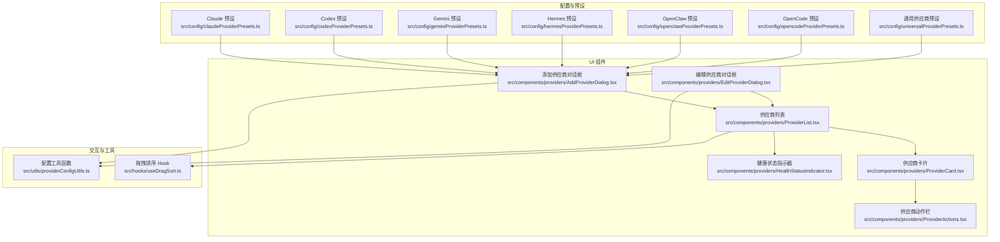
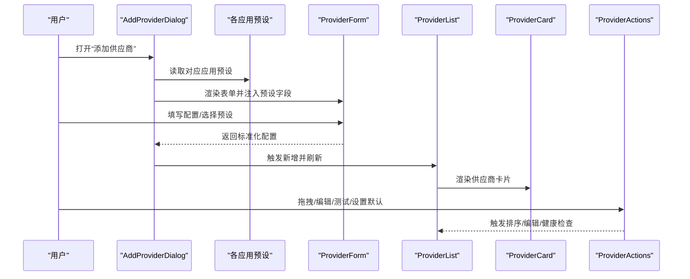
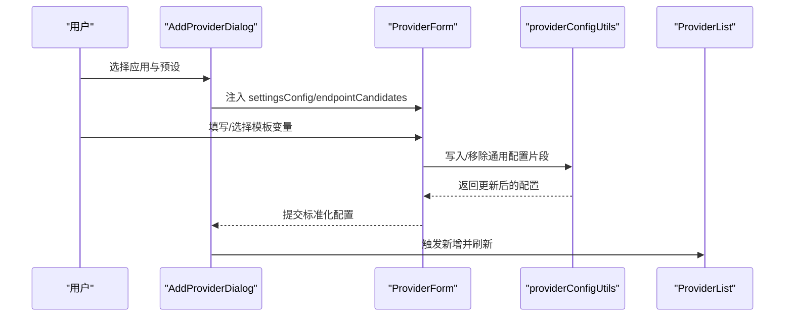
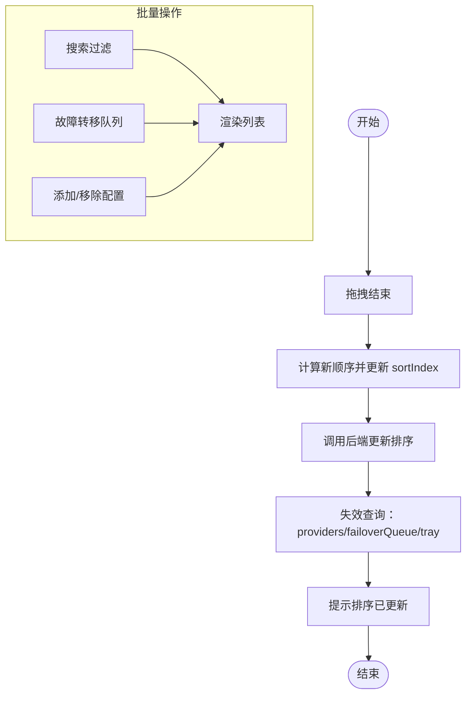
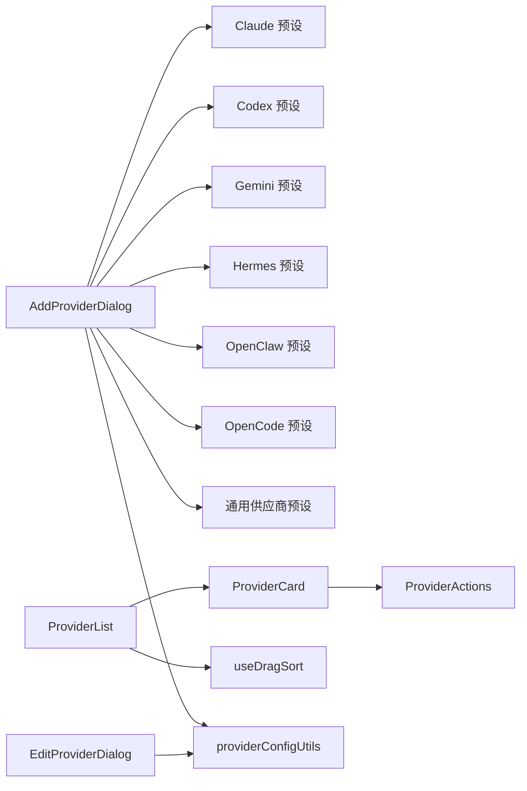

# 供应商管理

<cite>
**本文引用的文件**
- [src/config/universalProviderPresets.ts](file://src/config/universalProviderPresets.ts)
- [cc-switch-main/src/config/universalProviderPresets.ts](file://cc-switch-main/src/config/universalProviderPresets.ts)
- [src/components/providers/AddProviderDialog.tsx](file://src/components/providers/AddProviderDialog.tsx)
- [src/components/providers/EditProviderDialog.tsx](file://src/components/providers/EditProviderDialog.tsx)
- [src/config/claudeProviderPresets.ts](file://src/config/claudeProviderPresets.ts)
- [src/config/codexProviderPresets.ts](file://src/config/codexProviderPresets.ts)
- [src/config/geminiProviderPresets.ts](file://src/config/geminiProviderPresets.ts)
- [src/config/hermesProviderPresets.ts](file://src/config/hermesProviderPresets.ts)
- [src/config/openclawProviderPresets.ts](file://src/config/openclawProviderPresets.ts)
- [src/config/opencodeProviderPresets.ts](file://src/config/opencodeProviderPresets.ts)
- [src/components/providers/ProviderList.tsx](file://src/components/providers/ProviderList.tsx)
- [src/components/providers/ProviderCard.tsx](file://src/components/providers/ProviderCard.tsx)
- [src/components/providers/ProviderActions.tsx](file://src/components/providers/ProviderActions.tsx)
- [src/components/providers/HealthStatusIndicator.tsx](file://src/components/providers/HealthStatusIndicator.tsx)
- [src/hooks/useDragSort.ts](file://src/hooks/useDragSort.ts)
- [src/utils/providerConfigUtils.ts](file://src/utils/providerConfigUtils.ts)
</cite>

## 目录
1. [简介](#简介)
2. [项目结构](#项目结构)
3. [核心组件](#核心组件)
4. [架构总览](#架构总览)
5. [详细组件分析](#详细组件分析)
6. [依赖关系分析](#依赖关系分析)
7. [性能考虑](#性能考虑)
8. [故障排查指南](#故障排查指南)
9. [结论](#结论)
10. [附录](#附录)

## 简介
本文件系统化梳理 CC Switch 的“供应商管理”能力，涵盖供应商概念、七种 AI 工具（Claude Code、Claude Desktop、Codex、Gemini CLI、OpenCode、OpenClaw、Hermes）的配置格式与特性、供应商添加与编辑流程、拖拽排序、批量操作与健康检查机制，并提供 50+ 内置供应商预设的使用指南、通用供应商（Universal Providers）跨应用同步机制，以及“共享配置片段（Shared Config Snippet）”在不同供应商之间的传递方法。文档同时给出最佳实践与常见问题排查建议。

## 项目结构
围绕供应商管理的关键模块与文件如下图所示：

**图表来源**
- [src/config/claudeProviderPresets.ts](file://src/config/claudeProviderPresets.ts)
- [src/config/codexProviderPresets.ts](file://src/config/codexProviderPresets.ts)
- [src/config/geminiProviderPresets.ts](file://src/config/geminiProviderPresets.ts)
- [src/config/hermesProviderPresets.ts](file://src/config/hermesProviderPresets.ts)
- [src/config/openclawProviderPresets.ts](file://src/config/openclawProviderPresets.ts)
- [src/config/opencodeProviderPresets.ts](file://src/config/opencodeProviderPresets.ts)
- [src/config/universalProviderPresets.ts](file://src/config/universalProviderPresets.ts)
- [src/components/providers/AddProviderDialog.tsx](file://src/components/providers/AddProviderDialog.tsx)
- [src/components/providers/EditProviderDialog.tsx](file://src/components/providers/EditProviderDialog.tsx)
- [src/components/providers/ProviderList.tsx](file://src/components/providers/ProviderList.tsx)
- [src/components/providers/ProviderCard.tsx](file://src/components/providers/ProviderCard.tsx)
- [src/components/providers/ProviderActions.tsx](file://src/components/providers/ProviderActions.tsx)
- [src/components/providers/HealthStatusIndicator.tsx](file://src/components/providers/HealthStatusIndicator.tsx)
- [src/hooks/useDragSort.ts](file://src/hooks/useDragSort.ts)
- [src/utils/providerConfigUtils.ts](file://src/utils/providerConfigUtils.ts)

**章节来源**
- [src/config/claudeProviderPresets.ts](file://src/config/claudeProviderPresets.ts)
- [src/config/codexProviderPresets.ts](file://src/config/codexProviderPresets.ts)
- [src/config/geminiProviderPresets.ts](file://src/config/geminiProviderPresets.ts)
- [src/config/hermesProviderPresets.ts](file://src/config/hermesProviderPresets.ts)
- [src/config/openclawProviderPresets.ts](file://src/config/openclawProviderPresets.ts)
- [src/config/opencodeProviderPresets.ts](file://src/config/opencodeProviderPresets.ts)
- [src/config/universalProviderPresets.ts](file://src/config/universalProviderPresets.ts)
- [src/components/providers/AddProviderDialog.tsx](file://src/components/providers/AddProviderDialog.tsx)
- [src/components/providers/EditProviderDialog.tsx](file://src/components/providers/EditProviderDialog.tsx)
- [src/components/providers/ProviderList.tsx](file://src/components/providers/ProviderList.tsx)
- [src/components/providers/ProviderCard.tsx](file://src/components/providers/ProviderCard.tsx)
- [src/components/providers/ProviderActions.tsx](file://src/components/providers/ProviderActions.tsx)
- [src/components/providers/HealthStatusIndicator.tsx](file://src/components/providers/HealthStatusIndicator.tsx)
- [src/hooks/useDragSort.ts](file://src/hooks/useDragSort.ts)
- [src/utils/providerConfigUtils.ts](file://src/utils/providerConfigUtils.ts)

## 核心组件
- 供应商预设与配置格式
  - Claude：支持多 API 格式（原生、OpenAI Chat、Responses、Gemini 原生），含模板变量、端点候选、主题与图标。
  - Codex：以 TOML 配置为主，支持 wire_api、model_provider、自定义模型目录、推理参数映射。
  - Gemini：以环境变量驱动，支持自定义 base_url 与模型，内置多供应商预设。
  - OpenCode：以 npm 包与模型变体定义为核心，提供丰富的模型变体与模态限制。
  - OpenClaw：以 models.providers 结构组织，支持协议选项、默认模型与模型目录。
  - Hermes：以 YAML config.yaml 的 custom_providers 数组为协议，支持模型上下文长度与默认模型建议。
  - 通用供应商（Universal Providers）：跨应用共享，统一管理 baseUrl、apiKey、模型映射与图标。
- 添加与编辑流程
  - 添加：支持“应用专属”与“通用供应商”双标签页；自动推断端点候选；部分应用（如 OpenCode/OpenClaw/Hermes）不支持通用供应商。
  - 编辑：按应用类型读取实时配置；代理接管模式下避免读取被接管的 Live 配置；Codex 特别处理 modelCatalog 投影。
- 拖拽排序与批量操作
  - 拖拽排序：按 sortIndex、创建时间与名称排序；更新后刷新托盘菜单。
  - 批量：搜索过滤、故障转移队列、OpenCode/OpenClaw/Hermes 的“添加/移除配置”模式。
- 健康检查与状态提示
  - ProviderCard 展示健康徽章与故障转移优先级；HealthStatusIndicator 提供可视化状态与响应时间。

**章节来源**
- [src/components/providers/AddProviderDialog.tsx](file://src/components/providers/AddProviderDialog.tsx)
- [src/components/providers/EditProviderDialog.tsx](file://src/components/providers/EditProviderDialog.tsx)
- [src/components/providers/ProviderList.tsx](file://src/components/providers/ProviderList.tsx)
- [src/components/providers/ProviderCard.tsx](file://src/components/providers/ProviderCard.tsx)
- [src/components/providers/ProviderActions.tsx](file://src/components/providers/ProviderActions.tsx)
- [src/components/providers/HealthStatusIndicator.tsx](file://src/components/providers/HealthStatusIndicator.tsx)
- [src/hooks/useDragSort.ts](file://src/hooks/useDragSort.ts)

## 架构总览
供应商管理的前端架构围绕“预设配置 + 表单组件 + 列表渲染 + 排序与批量操作 + 健康检查”的闭环设计。

**图表来源**
- [src/components/providers/AddProviderDialog.tsx](file://src/components/providers/AddProviderDialog.tsx)
- [src/components/providers/ProviderList.tsx](file://src/components/providers/ProviderList.tsx)
- [src/components/providers/ProviderCard.tsx](file://src/components/providers/ProviderCard.tsx)
- [src/components/providers/ProviderActions.tsx](file://src/components/providers/ProviderActions.tsx)
- [src/config/claudeProviderPresets.ts](file://src/config/claudeProviderPresets.ts)
- [src/config/codexProviderPresets.ts](file://src/config/codexProviderPresets.ts)
- [src/config/geminiProviderPresets.ts](file://src/config/geminiProviderPresets.ts)
- [src/config/hermesProviderPresets.ts](file://src/config/hermesProviderPresets.ts)
- [src/config/openclawProviderPresets.ts](file://src/config/openclawProviderPresets.ts)
- [src/config/opencodeProviderPresets.ts](file://src/config/opencodeProviderPresets.ts)

## 详细组件分析

### 供应商概念与七种 AI 工具配置要点
- Claude
  - 支持 apiFormat：anthropic、openai_chat、openai_responses、gemini_native；模板变量用于动态替换；端点候选用于测速与管理。
  - 示例字段：env.ANTHROPIC_BASE_URL、ANTHROPIC_AUTH_TOKEN/API_KEY、模型默认值。
- Codex
  - TOML 配置为主，model_providers.* 结构；wire_api 支持 responses/chat；支持 experimental_bearer_token；modelCatalog 用于本地路由模型目录。
  - 示例字段：model_provider、wire_api、model、disable_response_storage、model_providers.custom.*。
- Gemini
  - 通过环境变量 GOOGLE_GEMINI_BASE_URL、GEMINI_API_KEY/GEMINI_MODEL 控制；内置多供应商预设与端点候选。
- OpenCode
  - 以 npm 包与模型变体为核心，提供上下文限制、输出限制、模态支持与推理变体；支持 preset 模型变体库。
- OpenClaw
  - models.providers 结构，支持协议选项（openai-completions/responses/anthropic-messages/gemini/bedrock）；默认模型与模型目录。
- Hermes
  - YAML config.yaml 的 custom_providers 数组；支持模型上下文长度、默认模型建议、协议模式（chat_completions/anthropic_messages/codex_responses/bedrock_converse）。
- 通用供应商（Universal Providers）
  - 跨应用共享 baseUrl、apiKey、模型映射；支持图标与网站链接；可通过预设一键创建。

**章节来源**
- [src/config/claudeProviderPresets.ts](file://src/config/claudeProviderPresets.ts)
- [src/config/codexProviderPresets.ts](file://src/config/codexProviderPresets.ts)
- [src/config/geminiProviderPresets.ts](file://src/config/geminiProviderPresets.ts)
- [src/config/opencodeProviderPresets.ts](file://src/config/opencodeProviderPresets.ts)
- [src/config/openclawProviderPresets.ts](file://src/config/openclawProviderPresets.ts)
- [src/config/hermesProviderPresets.ts](file://src/config/hermesProviderPresets.ts)
- [src/config/universalProviderPresets.ts](file://src/config/universalProviderPresets.ts)
- [cc-switch-main/src/config/universalProviderPresets.ts](file://cc-switch-main/src/config/universalProviderPresets.ts)

### 添加供应商流程与编辑功能
- 添加流程
  - “应用专属”与“通用供应商”双标签页；根据应用类型决定是否显示通用标签。
  - 自动推断端点候选（基于 preset 或解析 settingsConfig/env/config/base_url）。
  - OpenCode/OpenClaw/Hermes 不支持通用供应商，直接显示应用专属表单。
- 编辑流程
  - 代理接管模式下避免读取被接管的 Live 配置；OpenCode 使用独立存储结构，避免读取 full opencode.json。
  - Codex 特别处理 modelCatalog 投影，确保数据库 SSOT 不被 Live 反解覆盖。
- 共享配置片段（Shared Config Snippet）
  - JSON/TOML 通用片段写入/移除采用深合并/深删除策略；支持校验与结构子集检查；可跨供应商传递通用数据。

**图表来源**
- [src/components/providers/AddProviderDialog.tsx](file://src/components/providers/AddProviderDialog.tsx)
- [src/components/providers/EditProviderDialog.tsx](file://src/components/providers/EditProviderDialog.tsx)
- [src/utils/providerConfigUtils.ts](file://src/utils/providerConfigUtils.ts)
- [src/components/providers/ProviderList.tsx](file://src/components/providers/ProviderList.tsx)

**章节来源**
- [src/components/providers/AddProviderDialog.tsx](file://src/components/providers/AddProviderDialog.tsx)
- [src/components/providers/EditProviderDialog.tsx](file://src/components/providers/EditProviderDialog.tsx)
- [src/utils/providerConfigUtils.ts](file://src/utils/providerConfigUtils.ts)

### 拖拽排序、批量操作与健康检查
- 拖拽排序
  - 按 sortIndex → createdAt → name 排序；更新后刷新故障转移队列与托盘菜单。
- 批量操作
  - ProviderList 支持搜索过滤、故障转移队列（累加模式不支持）、OpenCode/OpenClaw/Hermes 的“添加/移除配置”模式。
- 健康检查
  - ProviderCard 展示健康徽章与故障转移优先级；HealthStatusIndicator 提供状态与响应时间。

**图表来源**
- [src/hooks/useDragSort.ts](file://src/hooks/useDragSort.ts)
- [src/components/providers/ProviderList.tsx](file://src/components/providers/ProviderList.tsx)
- [src/components/providers/ProviderCard.tsx](file://src/components/providers/ProviderCard.tsx)
- [src/components/providers/HealthStatusIndicator.tsx](file://src/components/providers/HealthStatusIndicator.tsx)

**章节来源**
- [src/hooks/useDragSort.ts](file://src/hooks/useDragSort.ts)
- [src/components/providers/ProviderList.tsx](file://src/components/providers/ProviderList.tsx)
- [src/components/providers/ProviderCard.tsx](file://src/components/providers/ProviderCard.tsx)
- [src/components/providers/HealthStatusIndicator.tsx](file://src/components/providers/HealthStatusIndicator.tsx)

### 50+ 内置供应商预设使用指南
- Claude 预设类别
  - official/third_party/aggregator/cn_official/custom；支持模板变量、端点候选、主题与图标。
- Codex 预设类别
  - official/third_party/aggregator/cn_official/custom；支持 wire_api、model_catalog、推理参数映射。
- Gemini 预设类别
  - official/partner/custom；支持 base_url 与模型。
- OpenCode 预设类别
  - 以 npm 包与模型变体为核心，提供上下文与输出限制、模态支持。
- OpenClaw 预设类别
  - 以 models.providers 结构组织，支持协议选项与默认模型。
- Hermes 预设类别
  - custom_providers 数组，支持模型上下文长度与默认模型建议。
- 通用供应商（Universal Providers）
  - n1n.ai/NewAPI/自定义网关等预设；一键创建统一配置，跨应用共享。

**章节来源**
- [src/config/claudeProviderPresets.ts](file://src/config/claudeProviderPresets.ts)
- [src/config/codexProviderPresets.ts](file://src/config/codexProviderPresets.ts)
- [src/config/geminiProviderPresets.ts](file://src/config/geminiProviderPresets.ts)
- [src/config/opencodeProviderPresets.ts](file://src/config/opencodeProviderPresets.ts)
- [src/config/openclawProviderPresets.ts](file://src/config/openclawProviderPresets.ts)
- [src/config/hermesProviderPresets.ts](file://src/config/hermesProviderPresets.ts)
- [src/config/universalProviderPresets.ts](file://src/config/universalProviderPresets.ts)
- [cc-switch-main/src/config/universalProviderPresets.ts](file://cc-switch-main/src/config/universalProviderPresets.ts)

### 通用供应商（Universal Providers）与跨应用同步
- 工作原理
  - 通用供应商预设包含默认应用启用与模型映射；创建时可指定 baseUrl、apiKey、自定义名称；图标与网站链接可继承。
- 跨应用同步
  - 通过预设一键创建统一供应商；修改后自动同步到 Claude、Codex、Gemini 三个应用。
- 与各应用的适配
  - Claude/Codex/Gemini：settingsConfig/env/config 与通用字段对齐。
  - OpenCode/OpenClaw/Hermes：不支持通用供应商，需使用各自专用配置结构。

**章节来源**
- [src/config/universalProviderPresets.ts](file://src/config/universalProviderPresets.ts)
- [cc-switch-main/src/config/universalProviderPresets.ts](file://cc-switch-main/src/config/universalProviderPresets.ts)

### 共享配置片段（Shared Config Snippet）传递机制
- JSON 与 TOML 两种格式
  - JSON：深合并/深删除，支持校验与结构子集检查。
  - TOML：结构化合并/删除，保留注释与格式。
- 传递方式
  - 在不同供应商之间写入/移除通用片段，实现“跨供应商共享通用数据”。
- 最佳实践
  - 优先使用结构化合并，避免覆盖敏感字段；在编辑前先进行片段校验；对 TOML 配置进行规范化处理。

**章节来源**
- [src/utils/providerConfigUtils.ts](file://src/utils/providerConfigUtils.ts)

## 依赖关系分析
- 组件耦合
  - AddProviderDialog 与各应用预设强耦合，负责注入 settingsConfig 与端点候选。
  - ProviderList 与 ProviderCard/ProviderActions 弱耦合，通过 props 传递行为。
  - useDragSort 与 ProviderList 弱耦合，仅负责排序逻辑。
- 外部依赖
  - dnd-kit：拖拽排序。
  - react-query：查询与缓存（providers、failoverQueue、settings 等）。
  - lucide-react：图标。
  - smol-toml：TOML 解析与序列化。

**图表来源**
- [src/components/providers/AddProviderDialog.tsx](file://src/components/providers/AddProviderDialog.tsx)
- [src/components/providers/EditProviderDialog.tsx](file://src/components/providers/EditProviderDialog.tsx)
- [src/components/providers/ProviderList.tsx](file://src/components/providers/ProviderList.tsx)
- [src/components/providers/ProviderCard.tsx](file://src/components/providers/ProviderCard.tsx)
- [src/components/providers/ProviderActions.tsx](file://src/components/providers/ProviderActions.tsx)
- [src/hooks/useDragSort.ts](file://src/hooks/useDragSort.ts)
- [src/utils/providerConfigUtils.ts](file://src/utils/providerConfigUtils.ts)
- [src/config/claudeProviderPresets.ts](file://src/config/claudeProviderPresets.ts)
- [src/config/codexProviderPresets.ts](file://src/config/codexProviderPresets.ts)
- [src/config/geminiProviderPresets.ts](file://src/config/geminiProviderPresets.ts)
- [src/config/hermesProviderPresets.ts](file://src/config/hermesProviderPresets.ts)
- [src/config/openclawProviderPresets.ts](file://src/config/openclawProviderPresets.ts)
- [src/config/opencodeProviderPresets.ts](file://src/config/opencodeProviderPresets.ts)
- [src/config/universalProviderPresets.ts](file://src/config/universalProviderPresets.ts)

**章节来源**
- [src/components/providers/AddProviderDialog.tsx](file://src/components/providers/AddProviderDialog.tsx)
- [src/components/providers/EditProviderDialog.tsx](file://src/components/providers/EditProviderDialog.tsx)
- [src/components/providers/ProviderList.tsx](file://src/components/providers/ProviderList.tsx)
- [src/components/providers/ProviderCard.tsx](file://src/components/providers/ProviderCard.tsx)
- [src/components/providers/ProviderActions.tsx](file://src/components/providers/ProviderActions.tsx)
- [src/hooks/useDragSort.ts](file://src/hooks/useDragSort.ts)
- [src/utils/providerConfigUtils.ts](file://src/utils/providerConfigUtils.ts)

## 性能考虑
- 列表渲染优化
  - ProviderList 使用虚拟滚动与条件渲染，减少不必要的重绘。
  - 搜索过滤在内存中进行，关键词匹配字段有限，避免大规模遍历。
- 排序与缓存
  - useDragSort 仅在拖拽结束时发起网络请求，其余时间保持本地状态；排序更新后失效相关查询。
- 健康检查
  - 健康状态与故障转移队列按需查询，避免频繁轮询。

[本节为通用指导，无需特定文件引用]

## 故障排查指南
- 代理接管导致编辑异常
  - EditProviderDialog 在代理接管模式下避免读取被接管的 Live 配置，确保编辑界面稳定。
- Codex modelCatalog 丢失
  - 当 Live 反解为空时，编辑界面以数据库 SSOT 为准，避免清空映射表。
- OpenCode 配置结构差异
  - OpenCode 使用独立存储结构，读取 Live 会返回完整 opencode.json，需注意嵌套结构差异。
- 健康检查与故障转移
  - ProviderCard 展示健康徽章与故障转移优先级；若供应商处于故障转移队列，可查看连续失败次数与优先级。

**章节来源**
- [src/components/providers/EditProviderDialog.tsx](file://src/components/providers/EditProviderDialog.tsx)
- [src/components/providers/ProviderCard.tsx](file://src/components/providers/ProviderCard.tsx)

## 结论
CC Switch 的供应商管理以“预设驱动 + 通用配置 + 结构化工具”为核心，覆盖七种 AI 工具的差异化配置需求，并提供完善的添加、编辑、排序、批量与健康检查能力。通用供应商（Universal Providers）进一步简化跨应用配置同步，配合共享配置片段实现灵活的数据传递。通过合理的预设选择与最佳实践，用户可在多应用环境中高效管理供应商并提升稳定性与一致性。

[本节为总结性内容，无需特定文件引用]

## 附录
- 最佳实践
  - 优先使用官方或合作伙伴预设，减少自定义风险。
  - 使用模板变量与端点候选提升可维护性与可观测性。
  - 对于 Codex，合理配置 model_catalog 与推理参数映射。
  - 在 OpenCode/OpenClaw/Hermes 中谨慎使用“添加/移除配置”，避免破坏现有配置结构。
  - 定期进行健康检查与故障转移队列维护，确保高可用。
- 常用配置示例（路径参考）
  - Claude：[src/config/claudeProviderPresets.ts](file://src/config/claudeProviderPresets.ts)
  - Codex：[src/config/codexProviderPresets.ts](file://src/config/codexProviderPresets.ts)
  - Gemini：[src/config/geminiProviderPresets.ts](file://src/config/geminiProviderPresets.ts)
  - OpenCode：[src/config/opencodeProviderPresets.ts](file://src/config/opencodeProviderPresets.ts)
  - OpenClaw：[src/config/openclawProviderPresets.ts](file://src/config/openclawProviderPresets.ts)
  - Hermes：[src/config/hermesProviderPresets.ts](file://src/config/hermesProviderPresets.ts)
  - 通用供应商：[src/config/universalProviderPresets.ts](file://src/config/universalProviderPresets.ts)

[本节为补充性内容，无需特定文件引用]