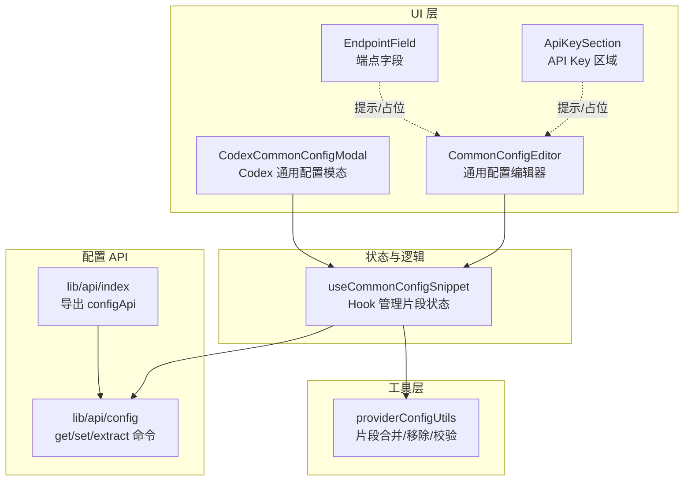
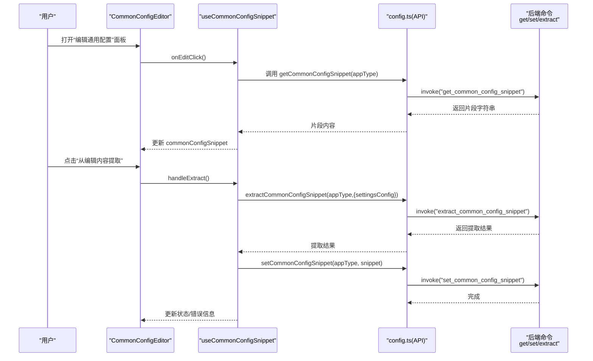
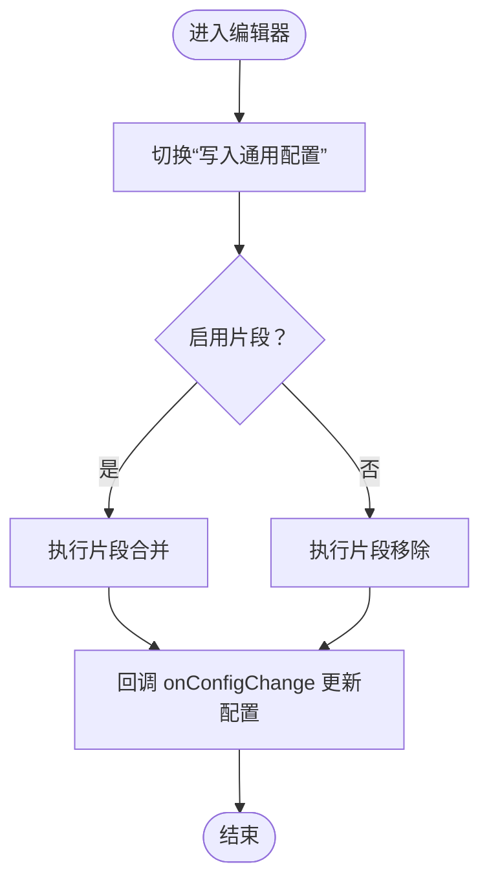
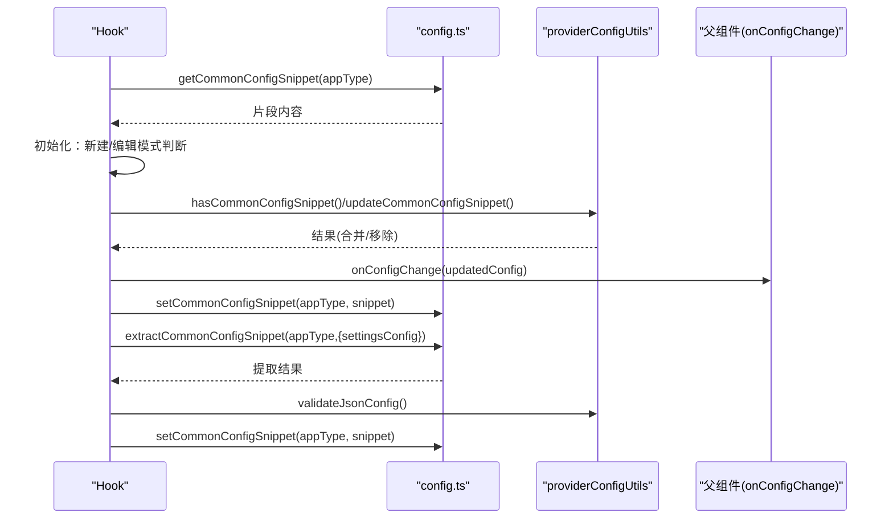
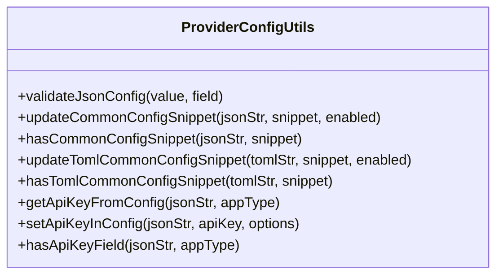
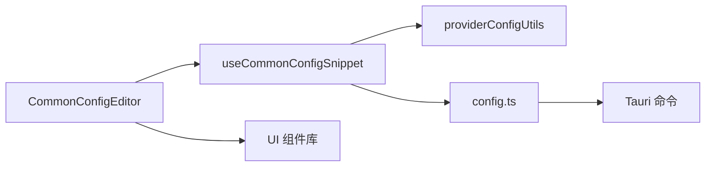

# 共享配置片段

<cite>
**本文引用的文件**
- [src/components/providers/forms/CommonConfigEditor.tsx](file://src/components/providers/forms/CommonConfigEditor.tsx)
- [src/components/providers/forms/hooks/useCommonConfigSnippet.ts](file://src/components/providers/forms/hooks/useCommonConfigSnippet.ts)
- [src/components/providers/forms/shared/ApiKeySection.tsx](file://src/components/providers/forms/shared/ApiKeySection.tsx)
- [src/components/providers/forms/shared/EndpointField.tsx](file://src/components/providers/forms/shared/EndpointField.tsx)
- [src/components/providers/forms/CodexCommonConfigModal.tsx](file://src/components/providers/forms/CodexCommonConfigModal.tsx)
- [src/utils/providerConfigUtils.ts](file://src/utils/providerConfigUtils.ts)
- [src/lib/api/config.ts](file://src/lib/api/config.ts)
- [src/lib/api/index.ts](file://src/lib/api/index.ts)
- [src/config/universalProviderPresets.ts](file://src/config/universalProviderPresets.ts)
- [tests/components/CommonConfigEditor.test.tsx](file://tests/components/CommonConfigEditor.test.tsx)
- [tests/components/CommonConfigModalBehavior.test.tsx](file://tests/components/CommonConfigModalBehavior.test.tsx)
- [tests/hooks/useCommonConfigSave.test.tsx](file://tests/hooks/useCommonConfigSave.test.tsx)
</cite>

## 目录
1. [简介](#简介)
2. [项目结构](#项目结构)
3. [核心组件](#核心组件)
4. [架构总览](#架构总览)
5. [详细组件分析](#详细组件分析)
6. [依赖关系分析](#依赖关系分析)
7. [性能与可靠性考量](#性能与可靠性考量)
8. [故障排查指南](#故障排查指南)
9. [结论](#结论)
10. [附录](#附录)

## 简介
本章节面向 CC Switch 的“共享配置片段”能力，系统性阐述其概念、实现机制与使用方法。该能力允许用户将多个供应商配置中的公共部分抽取为“通用片段”，并在不同供应商之间复用，从而减少重复配置、提升一致性与可维护性。

- 共享配置的核心在于“片段化复用”。通过将 API Key、端点、环境变量等差异化字段从配置中剥离，保留可复用的通用字段，形成“通用片段”，再将其合并回具体供应商配置。
- 本功能同时支持 Claude/Gemini（JSON）与 Codex（TOML）两类配置格式，分别采用不同的合并/移除策略与校验规则。
- 安全方面，API Key 等敏感字段不会被自动纳入通用片段，且在编辑界面中提供明确提示与校验，避免误操作导致泄露。

## 项目结构
围绕共享配置片段的关键代码分布在以下模块：
- UI 编辑器与交互：CommonConfigEditor、CodexCommonConfigModal、ApiKeySection、EndpointField
- 状态与逻辑：useCommonConfigSnippet Hook
- 工具函数：providerConfigUtils（JSON/TOML 片段合并/移除/校验）
- 配置 API：config.ts（调用后端命令以读写通用片段、提取片段）

图表来源
- [src/components/providers/forms/CommonConfigEditor.tsx:1-354](file://src/components/providers/forms/CommonConfigEditor.tsx#L1-L354)
- [src/components/providers/forms/CodexCommonConfigModal.tsx:1-152](file://src/components/providers/forms/CodexCommonConfigModal.tsx#L1-L152)
- [src/components/providers/forms/shared/ApiKeySection.tsx:1-92](file://src/components/providers/forms/shared/ApiKeySection.tsx#L1-L92)
- [src/components/providers/forms/shared/EndpointField.tsx:1-113](file://src/components/providers/forms/shared/EndpointField.tsx#L1-L113)
- [src/components/providers/forms/hooks/useCommonConfigSnippet.ts:1-372](file://src/components/providers/forms/hooks/useCommonConfigSnippet.ts#L1-L372)
- [src/utils/providerConfigUtils.ts:71-151](file://src/utils/providerConfigUtils.ts#L71-L151)
- [src/lib/api/config.ts:1-78](file://src/lib/api/config.ts#L1-L78)
- [src/lib/api/index.ts:15-15](file://src/lib/api/index.ts#L15-L15)

章节来源
- [src/components/providers/forms/CommonConfigEditor.tsx:1-354](file://src/components/providers/forms/CommonConfigEditor.tsx#L1-L354)
- [src/components/providers/forms/hooks/useCommonConfigSnippet.ts:1-372](file://src/components/providers/forms/hooks/useCommonConfigSnippet.ts#L1-L372)
- [src/utils/providerConfigUtils.ts:71-151](file://src/utils/providerConfigUtils.ts#L71-L151)
- [src/lib/api/config.ts:1-78](file://src/lib/api/config.ts#L1-L78)
- [src/lib/api/index.ts:15-15](file://src/lib/api/index.ts#L15-L15)

## 核心组件
- CommonConfigEditor：提供 JSON 配置编辑与通用片段开关，支持从当前编辑内容提取片段、在全屏面板中编辑与保存。
- useCommonConfigSnippet：管理通用片段的加载、切换、保存、提取与校验，内置本地迁移逻辑与初始化行为。
- providerConfigUtils：提供 JSON/TOML 通用片段的合并、移除、子集判断与 JSON 校验。
- config.ts：封装 Tauri 命令，提供获取/设置通用片段、从配置中提取片段的能力。
- CodexCommonConfigModal：针对 Codex 的 TOML 配置提供独立的通用片段编辑体验。
- ApiKeySection/EndpointField：在表单层面提供 API Key 与端点字段的输入与提示，避免将敏感信息误写入通用片段。

章节来源
- [src/components/providers/forms/CommonConfigEditor.tsx:9-37](file://src/components/providers/forms/CommonConfigEditor.tsx#L9-L37)
- [src/components/providers/forms/hooks/useCommonConfigSnippet.ts:15-38](file://src/components/providers/forms/hooks/useCommonConfigSnippet.ts#L15-L38)
- [src/utils/providerConfigUtils.ts:66-151](file://src/utils/providerConfigUtils.ts#L66-L151)
- [src/lib/api/config.ts:27-77](file://src/lib/api/config.ts#L27-L77)
- [src/components/providers/forms/CodexCommonConfigModal.tsx:8-30](file://src/components/providers/forms/CodexCommonConfigModal.tsx#L8-L30)
- [src/components/providers/forms/shared/ApiKeySection.tsx:5-34](file://src/components/providers/forms/shared/ApiKeySection.tsx#L5-L34)
- [src/components/providers/forms/shared/EndpointField.tsx:7-37](file://src/components/providers/forms/shared/EndpointField.tsx#L7-L37)

## 架构总览
下图展示从 UI 到后端命令的调用链路，以及片段提取与合并的流程：

图表来源
- [src/components/providers/forms/CommonConfigEditor.tsx:266-351](file://src/components/providers/forms/CommonConfigEditor.tsx#L266-L351)
- [src/components/providers/forms/hooks/useCommonConfigSnippet.ts:324-359](file://src/components/providers/forms/hooks/useCommonConfigSnippet.ts#L324-L359)
- [src/lib/api/config.ts:32-77](file://src/lib/api/config.ts#L32-L77)

章节来源
- [src/components/providers/forms/CommonConfigEditor.tsx:266-351](file://src/components/providers/forms/CommonConfigEditor.tsx#L266-L351)
- [src/components/providers/forms/hooks/useCommonConfigSnippet.ts:324-359](file://src/components/providers/forms/hooks/useCommonConfigSnippet.ts#L324-L359)
- [src/lib/api/config.ts:32-77](file://src/lib/api/config.ts#L32-L77)

## 详细组件分析

### CommonConfigEditor 分析
- 功能职责
  - 展示与编辑 JSON 配置主体。
  - 提供“写入通用配置”开关，控制是否将通用片段合并入当前配置。
  - 提供“编辑通用配置”入口，打开全屏面板进行片段编辑。
  - 支持从当前编辑内容提取通用片段，一键写入后端。
- 关键交互
  - 本地状态镜像父组件 value，保证开关与编辑器联动一致。
  - 通过 toggleStates 推断多项布尔开关状态，便于快速勾选。
  - 全屏面板内提供引导文案、空片段提示与错误提示。
- 错误处理
  - 当通用片段为空或格式错误时，面板顶部显示错误信息。
  - 提取失败或保存失败时，通过国际化文案反馈错误原因。

图表来源
- [src/components/providers/forms/CommonConfigEditor.tsx:159-264](file://src/components/providers/forms/CommonConfigEditor.tsx#L159-L264)
- [src/components/providers/forms/hooks/useCommonConfigSnippet.ts:202-228](file://src/components/providers/forms/hooks/useCommonConfigSnippet.ts#L202-L228)

章节来源
- [src/components/providers/forms/CommonConfigEditor.tsx:9-37](file://src/components/providers/forms/CommonConfigEditor.tsx#L9-L37)
- [src/components/providers/forms/CommonConfigEditor.tsx:159-264](file://src/components/providers/forms/CommonConfigEditor.tsx#L159-L264)
- [src/components/providers/forms/CommonConfigEditor.tsx:266-351](file://src/components/providers/forms/CommonConfigEditor.tsx#L266-L351)

### useCommonConfigSnippet 分析
- 初始化与迁移
  - 首次加载从后端读取通用片段；若后端无数据，尝试从 localStorage 迁移，成功后清理旧存储。
  - 新建模式：若片段存在且非空，自动启用并合并至当前配置。
  - 编辑模式：根据初始配置推断是否应启用通用片段，必要时自动注入。
- 片段开关与变更
  - 切换开关时，调用工具函数进行合并/移除，并通过回调通知上层更新。
  - 片段内容变更时，先做 JSON 校验，再保存至后端；若当前启用，需先移除旧片段再合并新片段。
- 提取逻辑
  - 从当前编辑内容提取通用片段，自动排除差异化字段，返回可复用片段。
  - 提取后进行格式校验并保存至后端。
- 状态标记
  - isUpdatingFromCommonConfig 用于避免“由通用片段引起的配置变化”再次触发状态检查，防止死循环。

图表来源
- [src/components/providers/forms/hooks/useCommonConfigSnippet.ts:62-116](file://src/components/providers/forms/hooks/useCommonConfigSnippet.ts#L62-L116)
- [src/components/providers/forms/hooks/useCommonConfigSnippet.ts:162-200](file://src/components/providers/forms/hooks/useCommonConfigSnippet.ts#L162-L200)
- [src/components/providers/forms/hooks/useCommonConfigSnippet.ts:202-228](file://src/components/providers/forms/hooks/useCommonConfigSnippet.ts#L202-L228)
- [src/components/providers/forms/hooks/useCommonConfigSnippet.ts:230-309](file://src/components/providers/forms/hooks/useCommonConfigSnippet.ts#L230-L309)
- [src/components/providers/forms/hooks/useCommonConfigSnippet.ts:324-359](file://src/components/providers/forms/hooks/useCommonConfigSnippet.ts#L324-L359)
- [src/utils/providerConfigUtils.ts:90-151](file://src/utils/providerConfigUtils.ts#L90-L151)
- [src/lib/api/config.ts:32-77](file://src/lib/api/config.ts#L32-L77)

章节来源
- [src/components/providers/forms/hooks/useCommonConfigSnippet.ts:15-38](file://src/components/providers/forms/hooks/useCommonConfigSnippet.ts#L15-L38)
- [src/components/providers/forms/hooks/useCommonConfigSnippet.ts:62-116](file://src/components/providers/forms/hooks/useCommonConfigSnippet.ts#L62-L116)
- [src/components/providers/forms/hooks/useCommonConfigSnippet.ts:162-200](file://src/components/providers/forms/hooks/useCommonConfigSnippet.ts#L162-L200)
- [src/components/providers/forms/hooks/useCommonConfigSnippet.ts:202-228](file://src/components/providers/forms/hooks/useCommonConfigSnippet.ts#L202-L228)
- [src/components/providers/forms/hooks/useCommonConfigSnippet.ts:230-309](file://src/components/providers/forms/hooks/useCommonConfigSnippet.ts#L230-L309)
- [src/components/providers/forms/hooks/useCommonConfigSnippet.ts:324-359](file://src/components/providers/forms/hooks/useCommonConfigSnippet.ts#L324-L359)

### providerConfigUtils 分析
- JSON 片段
  - validateJsonConfig：校验字符串是否为合法 JSON 对象。
  - updateCommonConfigSnippet：启用时深合并，禁用时按值精确移除，确保只移除与片段完全一致的部分。
  - hasCommonConfigSnippet：判断当前配置是否已包含通用片段（结构子集）。
- TOML 片段（Codex）
  - updateTomlCommonConfigSnippet：对 TOML 文本进行解析与结构化合并/移除。
  - hasTomlCommonConfigSnippet：支持 TOML 解析失败时的文本近似匹配。
- API Key 与端点
  - getApiKeyFromConfig/setApiKeyInConfig：读取/写入 API Key，支持多应用类型与字段选择。
  - hasApiKeyField：检测配置中是否存在 API Key 字段。
  - EndpointField：提供端点输入与“完整 URL”模式切换，配合提示信息降低误配风险。

图表来源
- [src/utils/providerConfigUtils.ts:71-342](file://src/utils/providerConfigUtils.ts#L71-L342)
- [src/utils/providerConfigUtils.ts:344-397](file://src/utils/providerConfigUtils.ts#L344-L397)
- [src/components/providers/forms/shared/EndpointField.tsx:23-37](file://src/components/providers/forms/shared/EndpointField.tsx#L23-L37)

章节来源
- [src/utils/providerConfigUtils.ts:71-151](file://src/utils/providerConfigUtils.ts#L71-L151)
- [src/utils/providerConfigUtils.ts:344-397](file://src/utils/providerConfigUtils.ts#L344-L397)
- [src/components/providers/forms/shared/EndpointField.tsx:7-37](file://src/components/providers/forms/shared/EndpointField.tsx#L7-L37)

### CodexCommonConfigModal 分析
- 面向 Codex 的专用编辑器，采用 TOML 语法高亮与更宽松的校验策略。
- 提供“从编辑内容提取”按钮，将当前配置中可复用部分提取为通用片段。
- 错误信息与引导文案与通用版本保持一致，确保用户体验连贯。

章节来源
- [src/components/providers/forms/CodexCommonConfigModal.tsx:8-30](file://src/components/providers/forms/CodexCommonConfigModal.tsx#L8-L30)
- [src/components/providers/forms/CodexCommonConfigModal.tsx:67-151](file://src/components/providers/forms/CodexCommonConfigModal.tsx#L67-L151)

### API Key 与端点字段的共享机制
- API Key 区域（ApiKeySection）
  - 根据供应商类别决定是否禁用输入框与占位文案。
  - 提供“获取 API Key”外部链接与合作伙伴促销提示，帮助用户正确配置。
- 端点字段（EndpointField）
  - 支持“完整 URL”模式切换，明确提示该模式下的使用限制与注意事项。
  - 提供“管理和测速”按钮，便于用户进行端点测试与管理。
- 安全考虑
  - 片段提取时会自动排除差异化字段（如 API Key、模型、端点等），避免敏感信息落入通用片段。
  - UI 层提供清晰提示，强调通用片段仅应包含可复用的公共字段。

章节来源
- [src/components/providers/forms/shared/ApiKeySection.tsx:5-34](file://src/components/providers/forms/shared/ApiKeySection.tsx#L5-L34)
- [src/components/providers/forms/shared/EndpointField.tsx:7-37](file://src/components/providers/forms/shared/EndpointField.tsx#L7-L37)
- [src/utils/providerConfigUtils.ts:153-276](file://src/utils/providerConfigUtils.ts#L153-L276)

## 依赖关系分析
- 组件耦合
  - CommonConfigEditor 与 useCommonConfigSnippet 强耦合，前者负责 UI，后者负责状态与业务逻辑。
  - useCommonConfigSnippet 依赖 providerConfigUtils（片段合并/校验）与 config.ts（后端命令）。
- 外部依赖
  - Tauri invoke：通过 config.ts 调用后端命令，实现配置持久化与片段提取。
  - 国际化：大量文案通过 i18n 提供，保证多语言一致性。
- 循环依赖
  - 未发现直接循环依赖；UI 组件通过 Hook 与工具函数间接协作。

图表来源
- [src/components/providers/forms/CommonConfigEditor.tsx:1-354](file://src/components/providers/forms/CommonConfigEditor.tsx#L1-L354)
- [src/components/providers/forms/hooks/useCommonConfigSnippet.ts:1-372](file://src/components/providers/forms/hooks/useCommonConfigSnippet.ts#L1-L372)
- [src/utils/providerConfigUtils.ts:1-800](file://src/utils/providerConfigUtils.ts#L1-L800)
- [src/lib/api/config.ts:1-78](file://src/lib/api/config.ts#L1-L78)

章节来源
- [src/components/providers/forms/CommonConfigEditor.tsx:1-354](file://src/components/providers/forms/CommonConfigEditor.tsx#L1-L354)
- [src/components/providers/forms/hooks/useCommonConfigSnippet.ts:1-372](file://src/components/providers/forms/hooks/useCommonConfigSnippet.ts#L1-L372)
- [src/utils/providerConfigUtils.ts:1-800](file://src/utils/providerConfigUtils.ts#L1-L800)
- [src/lib/api/config.ts:1-78](file://src/lib/api/config.ts#L1-L78)

## 性能与可靠性考量
- 性能
  - 片段合并/移除采用深拷贝与结构化操作，避免不必要的渲染抖动；通过本地状态镜像与 useMemo 优化 UI 更新频率。
  - 提取与保存操作异步执行，避免阻塞主线程。
- 可靠性
  - 多处 try/catch 与错误提示，确保异常情况可感知。
  - isUpdatingFromCommonConfig 标记避免“由通用片段触发的配置变化”再次进入状态检查，防止无限循环。
  - localStorage → config.json 的迁移逻辑具备容错与日志输出，保障数据安全过渡。

[本节为通用指导，不直接分析具体文件]

## 故障排查指南
- 通用片段为空或报错
  - 检查片段是否为合法 JSON 对象；确认后端命令可用。
  - 查看 UI 错误提示与控制台日志，定位具体失败步骤。
- 片段未生效
  - 确认“写入通用配置”开关已启用；检查当前配置是否已包含片段（子集判断）。
  - 若刚保存后未生效，等待状态更新完成或刷新页面。
- 提取失败
  - 确保编辑内容中存在可提取的公共字段；避免将 API Key、端点等差异化字段写入。
  - 检查后端命令返回值与网络状态。
- API Key 与端点配置问题
  - 使用 ApiKeySection/EndpointField 的占位与提示，避免误填。
  - 如需写入 API Key，使用工具函数而非通用片段。

章节来源
- [src/components/providers/forms/CommonConfigEditor.tsx:192-196](file://src/components/providers/forms/CommonConfigEditor.tsx#L192-L196)
- [src/components/providers/forms/CommonConfigEditor.tsx:344-348](file://src/components/providers/forms/CommonConfigEditor.tsx#L344-L348)
- [src/components/providers/forms/hooks/useCommonConfigSnippet.ts:230-309](file://src/components/providers/forms/hooks/useCommonConfigSnippet.ts#L230-L309)
- [src/utils/providerConfigUtils.ts:71-88](file://src/utils/providerConfigUtils.ts#L71-L88)

## 结论
CC Switch 的共享配置片段功能通过“片段提取—校验—合并/移除”的闭环，实现了多供应商配置的高效复用。UI 层提供直观的编辑与提取体验，逻辑层通过 Hook 与工具函数保障一致性与安全性，后端命令确保数据持久化与迁移顺畅。配合 API Key 与端点字段的专用组件，整体方案兼顾易用性与安全性。

[本节为总结性内容，不直接分析具体文件]

## 附录

### 常见使用场景
- 多供应商共用同一基础端点与环境变量，仅差异化的 API Key 与模型配置不同。
- 团队内部共享统一的代理设置、超时参数、调试开关等公共配置。
- 从现有配置中批量抽取可复用字段，形成团队标准模板。

### 命名规范与组织策略（建议）
- 片段命名
  - 以“用途+范围”命名，例如“基础环境变量”“代理与缓存设置”“调试与诊断开关”。
- 组织策略
  - 将片段拆分为“基础设施”“运行时参数”“调试选项”三类，便于检索与复用。
  - 为不同团队/项目建立独立片段，避免交叉污染。
- 最佳实践
  - 仅放入可复用的公共字段，避免任何敏感信息。
  - 定期审查与精简片段，移除不再使用的字段。
  - 在团队内约定片段格式与校验规则，统一 CI/CD 校验。

### 实际配置示例（路径指引）
- 通用 JSON 片段示例（Claude/Gemini）
  - 示例片段位置：[示例片段占位:253-258](file://src/components/providers/forms/CommonConfigEditor.tsx#L253-L258)
- Codex TOML 片段示例
  - 示例片段位置：[示例片段占位:136-138](file://src/components/providers/forms/CodexCommonConfigModal.tsx#L136-L138)
- API Key 输入区域
  - 示例区域位置：[API Key 输入:50-61](file://src/components/providers/forms/shared/ApiKeySection.tsx#L50-L61)
- 端点字段与“完整 URL”模式
  - 示例区域位置：[端点字段:54-82](file://src/components/providers/forms/shared/EndpointField.tsx#L54-L82)

### 测试参考
- 编辑器行为测试
  - [CommonConfigEditor.test.tsx](file://tests/components/CommonConfigEditor.test.tsx)
- 模态行为测试
  - [CommonConfigModalBehavior.test.tsx](file://tests/components/CommonConfigModalBehavior.test.tsx)
- 片段保存逻辑测试
  - [useCommonConfigSave.test.tsx](file://tests/hooks/useCommonConfigSave.test.tsx)