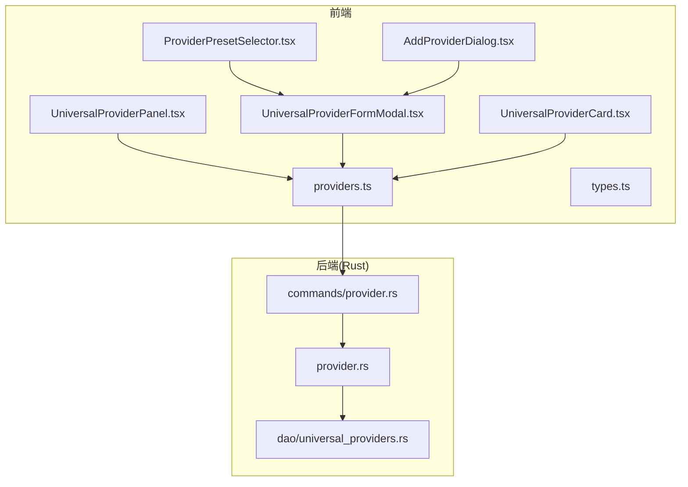
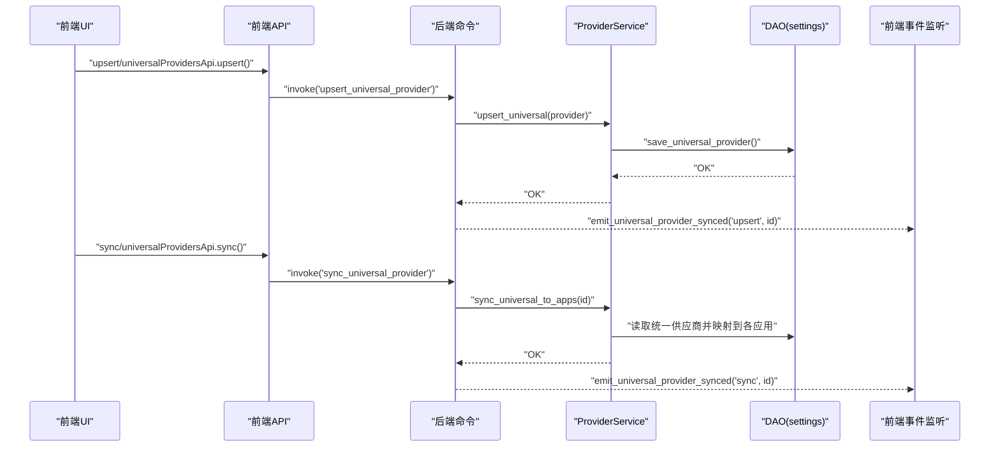
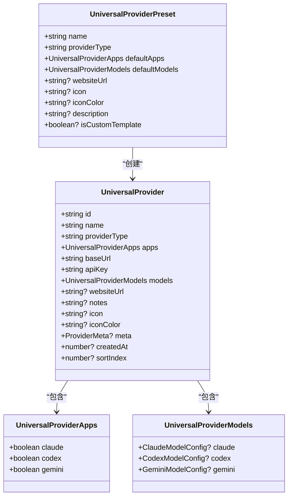
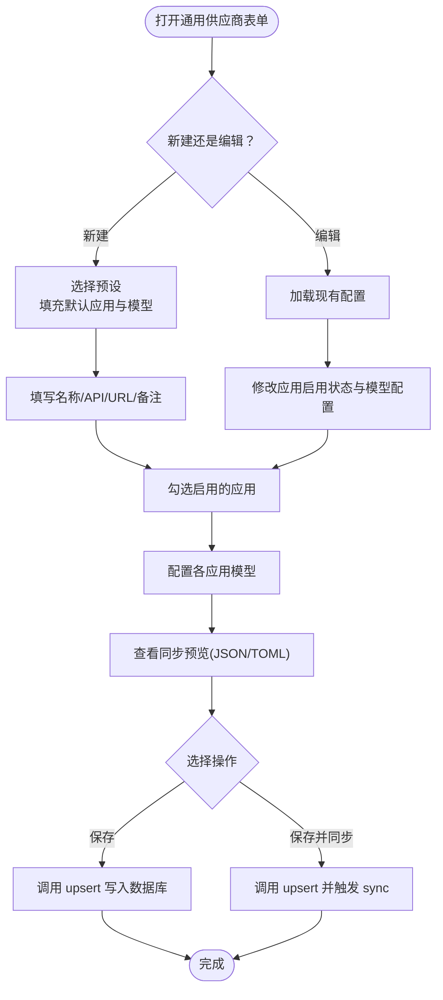
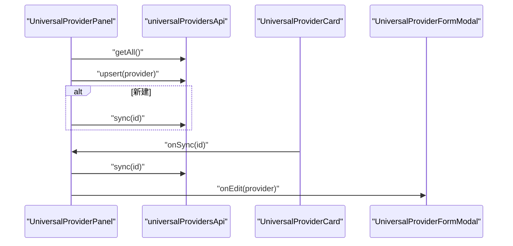
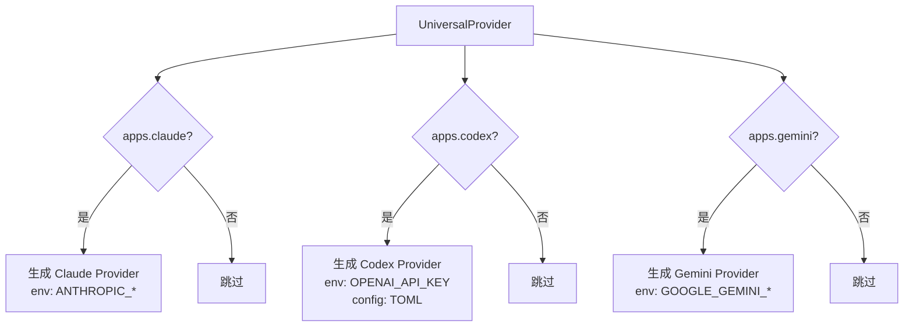
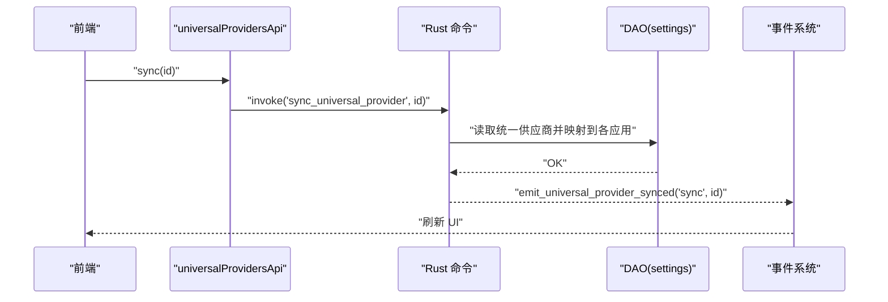
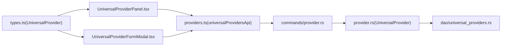

# 通用供应商

<cite>
**本文引用的文件**
- [src/config/universalProviderPresets.ts](file://src/config/universalProviderPresets.ts)
- [src/components/universal/UniversalProviderPanel.tsx](file://src/components/universal/UniversalProviderPanel.tsx)
- [src/components/universal/UniversalProviderFormModal.tsx](file://src/components/universal/UniversalProviderFormModal.tsx)
- [src/components/universal/UniversalProviderCard.tsx](file://src/components/universal/UniversalProviderCard.tsx)
- [src/components/providers/forms/ProviderPresetSelector.tsx](file://src/components/providers/forms/ProviderPresetSelector.tsx)
- [src/components/providers/AddProviderDialog.tsx](file://src/components/providers/AddProviderDialog.tsx)
- [src/lib/api/providers.ts](file://src/lib/api/providers.ts)
- [src/types.ts](file://src/types.ts)
- [src-tauri/src/provider.rs](file://src-tauri/src/provider.rs)
- [src-tauri/src/commands/provider.rs](file://src-tauri/src/commands/provider.rs)
- [src-tauri/src/database/dao/universal_providers.rs](file://src-tauri/src/database/dao/universal_providers.rs)
- [docs/user-manual/en/2-providers/2.1-add.md](file://docs/user-manual/en/2-providers/2.1-add.md)
</cite>

## 目录
1. [简介](#简介)
2. [项目结构](#项目结构)
3. [核心组件](#核心组件)
4. [架构总览](#架构总览)
5. [详细组件分析](#详细组件分析)
6. [依赖关系分析](#依赖关系分析)
7. [性能考量](#性能考量)
8. [故障排除指南](#故障排除指南)
9. [结论](#结论)
10. [附录](#附录)

## 简介
通用供应商（Universal Provider）是 CC Switch 的跨应用共享配置机制，旨在统一管理 Claude Code、OpenAI Codex、Gemini CLI 三大应用的供应商配置。通过“统一配置 + 应用映射”的设计，用户只需维护一套基础配置（Base URL、API Key、模型映射），即可自动同步到目标应用，并在需要时进行手动覆盖同步。

- 跨应用共享：统一配置变更后，自动影响启用的应用。
- 预设模板：内置 NewAPI、n1n.ai、自定义网关等预设，快速生成统一供应商。
- 手动同步：支持“保存”和“保存并同步”，以及卡片上的“同步”操作。
- 数据持久化：统一供应商存储在应用设置表中，采用 JSON 字符串形式保存。

## 项目结构
围绕通用供应商的关键文件分布如下：
- 配置与预设：src/config/universalProviderPresets.ts
- 前端面板与表单：src/components/universal/*.tsx
- 类型定义：src/types.ts
- 前端 API：src/lib/api/providers.ts
- Rust 后端：src-tauri/src/provider.rs、src-tauri/src/commands/provider.rs、src-tauri/src/database/dao/universal_providers.rs
- 用户手册：docs/user-manual/en/2-providers/2.1-add.md

图表来源
- [src/components/universal/UniversalProviderPanel.tsx:12-321](file://src/components/universal/UniversalProviderPanel.tsx#L12-L321)
- [src/components/universal/UniversalProviderFormModal.tsx:1-720](file://src/components/universal/UniversalProviderFormModal.tsx#L1-L720)
- [src/components/universal/UniversalProviderCard.tsx:1-127](file://src/components/universal/UniversalProviderCard.tsx#L1-L127)
- [src/components/providers/forms/ProviderPresetSelector.tsx:177-220](file://src/components/providers/forms/ProviderPresetSelector.tsx#L177-L220)
- [src/components/providers/AddProviderDialog.tsx:274-317](file://src/components/providers/AddProviderDialog.tsx#L274-L317)
- [src/lib/api/providers.ts:205-240](file://src/lib/api/providers.ts#L205-L240)
- [src/types.ts:543-562](file://src/types.ts#L543-L562)
- [src-tauri/src/provider.rs:610-656](file://src-tauri/src/provider.rs#L610-L656)
- [src-tauri/src/commands/provider.rs:782-831](file://src-tauri/src/commands/provider.rs#L782-L831)
- [src-tauri/src/database/dao/universal_providers.rs:1-75](file://src-tauri/src/database/dao/universal_providers.rs#L1-L75)

章节来源
- [src/config/universalProviderPresets.ts:1-133](file://src/config/universalProviderPresets.ts#L1-L133)
- [src/components/universal/UniversalProviderPanel.tsx:12-321](file://src/components/universal/UniversalProviderPanel.tsx#L12-L321)
- [src/components/universal/UniversalProviderFormModal.tsx:1-720](file://src/components/universal/UniversalProviderFormModal.tsx#L1-L720)
- [src/components/universal/UniversalProviderCard.tsx:1-127](file://src/components/universal/UniversalProviderCard.tsx#L1-L127)
- [src/components/providers/forms/ProviderPresetSelector.tsx:177-220](file://src/components/providers/forms/ProviderPresetSelector.tsx#L177-L220)
- [src/components/providers/AddProviderDialog.tsx:274-317](file://src/components/providers/AddProviderDialog.tsx#L274-L317)
- [src/lib/api/providers.ts:205-240](file://src/lib/api/providers.ts#L205-L240)
- [src/types.ts:543-562](file://src/types.ts#L543-L562)
- [src-tauri/src/provider.rs:610-656](file://src-tauri/src/provider.rs#L610-L656)
- [src-tauri/src/commands/provider.rs:782-831](file://src-tauri/src/commands/provider.rs#L782-L831)
- [src-tauri/src/database/dao/universal_providers.rs:1-75](file://src-tauri/src/database/dao/universal_providers.rs#L1-L75)
- [docs/user-manual/en/2-providers/2.1-add.md:298-352](file://docs/user-manual/en/2-providers/2.1-add.md#L298-L352)

## 核心组件
- 统一供应商预设与工厂
  - 预设接口包含名称、类型、默认启用应用、默认模型配置、网站链接、图标、描述等。
  - 提供根据预设创建统一供应商的工厂方法，确保模型配置深拷贝，避免引用污染。
- 统一供应商数据结构
  - 包含 id、name、providerType、apps（启用的应用）、baseUrl、apiKey、models（按应用分组的模型映射）、websiteUrl、notes、icon、iconColor、meta、createdAt、sortIndex 等字段。
- 前端面板与表单
  - 面板负责列出、新增、编辑、复制、删除、同步统一供应商。
  - 表单支持选择预设、填写基本信息、勾选启用的应用、配置各应用模型、查看同步后的配置预览（JSON/TOML）。
- 前端 API
  - 提供 getAll、get、upsert、delete、sync 等方法，封装 Tauri 命令调用。
- 后端服务与命令
  - 提供 get、upsert、delete、sync_universal 等命令，触发事件通知前端。
  - 数据持久化在 settings 表中，键为 universal_providers，值为 JSON 字符串。
- 应用映射与同步
  - 将统一供应商映射为各应用的 Provider 配置（Claude、Codex、Gemini），并在同步时覆盖对应应用的配置。

章节来源
- [src/config/universalProviderPresets.ts:15-133](file://src/config/universalProviderPresets.ts#L15-L133)
- [src/types.ts:543-562](file://src/types.ts#L543-L562)
- [src/components/universal/UniversalProviderPanel.tsx:12-321](file://src/components/universal/UniversalProviderPanel.tsx#L12-L321)
- [src/components/universal/UniversalProviderFormModal.tsx:1-720](file://src/components/universal/UniversalProviderFormModal.tsx#L1-L720)
- [src/lib/api/providers.ts:205-240](file://src/lib/api/providers.ts#L205-L240)
- [src-tauri/src/commands/provider.rs:782-831](file://src-tauri/src/commands/provider.rs#L782-L831)
- [src-tauri/src/database/dao/universal_providers.rs:1-75](file://src-tauri/src/database/dao/universal_providers.rs#L1-L75)

## 架构总览
通用供应商的架构分为三层：前端 UI 层、前端 API 层、后端服务层。前端通过 API 调用后端命令，后端命令操作数据库 DAO，最终持久化到 settings 表。同步流程通过命令触发，向前端广播事件，完成 UI 更新。

图表来源
- [src/lib/api/providers.ts:205-240](file://src/lib/api/providers.ts#L205-L240)
- [src-tauri/src/commands/provider.rs:790-831](file://src-tauri/src/commands/provider.rs#L790-L831)
- [src-tauri/src/database/dao/universal_providers.rs:41-73](file://src-tauri/src/database/dao/universal_providers.rs#L41-L73)
- [src-tauri/src/provider.rs:658-703](file://src-tauri/src/provider.rs#L658-L703)

## 详细组件分析

### 组件A：通用供应商预设与工厂
- 预设接口与默认模型
  - 预设包含 name、providerType、defaultApps、defaultModels、websiteUrl、icon、iconColor、description、isCustomTemplate。
  - 默认模型针对 Claude（主模型、Haiku、Sonnet、Opus）、Codex（模型、reasoningEffort）、Gemini（模型）。
- 工厂方法
  - createUniversalProviderFromPreset：基于预设生成统一供应商，深拷贝默认模型，填充基础字段。
- 预设选择器
  - ProviderPresetSelector.tsx 在“添加应用供应商”界面提供统一供应商预设入口，提示“跨应用统一配置，自动同步到 Claude/Codex/Gemini”。

图表来源
- [src/config/universalProviderPresets.ts:15-133](file://src/config/universalProviderPresets.ts#L15-L133)
- [src/types.ts:543-562](file://src/types.ts#L543-L562)
- [src-tauri/src/provider.rs:548-557](file://src-tauri/src/provider.rs#L548-L557)

章节来源
- [src/config/universalProviderPresets.ts:15-133](file://src/config/universalProviderPresets.ts#L15-L133)
- [src/components/providers/forms/ProviderPresetSelector.tsx:177-220](file://src/components/providers/forms/ProviderPresetSelector.tsx#L177-L220)

### 组件B：通用供应商表单与配置选项
- 表单字段
  - 名称、API 地址、API Key、官网地址、备注。
  - 启用的应用：Claude、Codex、Gemini。
  - 模型配置：按应用分组的模型字段（Claude 的主模型与三档模型；Codex 的模型与 reasoningEffort；Gemini 的模型）。
- 配置预览
  - Claude：生成 env 注入（AN_ANTHROPIC_BASE_URL、AUTH_TOKEN、MODEL 等）。
  - Codex：生成 TOML 配置（model_provider、model、model_reasoning_effort、disable_response_storage、[model_providers.custom] 等），并确保 base_url 以 /v1 结尾。
  - Gemini：生成 env 注入（GOOGLE_GEMINI_BASE_URL、GEMINI_API_KEY、GEMINI_MODEL 等）。
- 交互行为
  - 新建：选择预设后自动填充默认模型；保存即同步到启用的应用。
  - 编辑：可选择“保存”或“保存并同步”；“保存并同步”会立即触发同步；卡片上可单独“同步”。

图表来源
- [src/components/universal/UniversalProviderFormModal.tsx:186-318](file://src/components/universal/UniversalProviderFormModal.tsx#L186-L318)
- [src/lib/api/providers.ts:220-240](file://src/lib/api/providers.ts#L220-L240)
- [src-tauri/src/commands/provider.rs:790-831](file://src-tauri/src/commands/provider.rs#L790-L831)

章节来源
- [src/components/universal/UniversalProviderFormModal.tsx:186-318](file://src/components/universal/UniversalProviderFormModal.tsx#L186-L318)

### 组件C：通用供应商面板与卡片
- 面板功能
  - 列出所有统一供应商，支持新增、编辑、复制、删除、同步。
  - 新建完成后自动同步；编辑时可选择“保存并同步”。
- 卡片展示
  - 显示图标、名称、类型、Base URL、启用的应用列表、备注。
  - 提供同步、复制、编辑、删除操作按钮。

图表来源
- [src/components/universal/UniversalProviderPanel.tsx:54-111](file://src/components/universal/UniversalProviderPanel.tsx#L54-L111)
- [src/components/universal/UniversalProviderCard.tsx:15-127](file://src/components/universal/UniversalProviderCard.tsx#L15-L127)
- [src/lib/api/providers.ts:205-240](file://src/lib/api/providers.ts#L205-L240)

章节来源
- [src/components/universal/UniversalProviderPanel.tsx:54-111](file://src/components/universal/UniversalProviderPanel.tsx#L54-L111)
- [src/components/universal/UniversalProviderCard.tsx:15-127](file://src/components/universal/UniversalProviderCard.tsx#L15-L127)

### 组件D：与 AI 应用的集成与映射
- Claude 映射
  - 当 apps.claude 为真时，生成 Provider，设置 ANTHROPIC_BASE_URL、AUTH_TOKEN、MODEL、DEFAULT_HAIKU/SONNET/OPUS_MODEL 等环境变量。
- Codex 映射
  - 当 apps.codex 为真时，生成 Provider，设置 OPENAI_API_KEY，并生成 TOML 配置（model_provider、model、model_reasoning_effort、disable_response_storage、[model_providers.custom] 等），确保 base_url 以 /v1 结尾。
- Gemini 映射
  - 当 apps.gemini 为真时，生成 Provider，设置 GOOGLE_GEMINI_BASE_URL、GEMINI_API_KEY、GEMINI_MODEL 等环境变量。
- 兼容性处理
  - Codex 使用 OpenAI 兼容 API，自动补全 /v1 后缀。
  - 模型字段缺失时回退到默认模型字符串。

图表来源
- [src-tauri/src/provider.rs:685-703](file://src-tauri/src/provider.rs#L685-L703)
- [src/components/universal/UniversalProviderFormModal.tsx:146-184](file://src/components/universal/UniversalProviderFormModal.tsx#L146-L184)

章节来源
- [src-tauri/src/provider.rs:685-703](file://src-tauri/src/provider.rs#L685-L703)
- [src/components/universal/UniversalProviderFormModal.tsx:146-184](file://src/components/universal/UniversalProviderFormModal.tsx#L146-L184)

### 组件E：数据存储与同步协议
- 存储位置
  - settings 表，key 为 universal_providers，value 为统一供应商的 JSON 字符串。
- 同步协议
  - 前端调用 sync_universal_provider 命令，后端将统一供应商映射为各应用的 Provider 配置并覆盖写入。
  - 后端在 upsert/delete/sync 后通过 emit_universal_provider_synced 事件通知前端，前端收到事件后刷新 UI。
- 事件与命令
  - get_universal_provider、upsert_universal_provider、delete_universal_provider、sync_universal_provider。

图表来源
- [src/lib/api/providers.ts:234-240](file://src/lib/api/providers.ts#L234-L240)
- [src-tauri/src/commands/provider.rs:819-831](file://src-tauri/src/commands/provider.rs#L819-L831)
- [src-tauri/src/database/dao/universal_providers.rs:14-33](file://src-tauri/src/database/dao/universal_providers.rs#L14-L33)

章节来源
- [src-tauri/src/database/dao/universal_providers.rs:1-75](file://src-tauri/src/database/dao/universal_providers.rs#L1-L75)
- [src-tauri/src/commands/provider.rs:782-831](file://src-tauri/src/commands/provider.rs#L782-L831)

## 依赖关系分析
- 前端依赖
  - UniversalProviderPanel 依赖 universalProvidersApi 进行 CRUD 与同步。
  - UniversalProviderFormModal 依赖预设列表与工厂方法，生成统一供应商并提交。
  - ProviderPresetSelector 与 AddProviderDialog 提供统一供应商预设入口。
- 后端依赖
  - commands/provider.rs 调用 ProviderService 的 upsert、delete、sync_universal_to_apps。
  - provider.rs 定义 UniversalProvider、UniversalProviderApps、UniversalProviderModels 等结构体。
  - dao/universal_providers.rs 负责 settings 表的读写。
- 类型一致性
  - 前端 types.ts 与后端 provider.rs 的字段命名保持一致（如 providerType、baseUrl、apiKey、createdAt、sortIndex 等）。

图表来源
- [src/types.ts:543-562](file://src/types.ts#L543-L562)
- [src/components/universal/UniversalProviderPanel.tsx:1-321](file://src/components/universal/UniversalProviderPanel.tsx#L1-L321)
- [src/components/universal/UniversalProviderFormModal.tsx:1-720](file://src/components/universal/UniversalProviderFormModal.tsx#L1-L720)
- [src/lib/api/providers.ts:205-240](file://src/lib/api/providers.ts#L205-L240)
- [src-tauri/src/commands/provider.rs:782-831](file://src-tauri/src/commands/provider.rs#L782-L831)
- [src-tauri/src/provider.rs:610-656](file://src-tauri/src/provider.rs#L610-L656)
- [src-tauri/src/database/dao/universal_providers.rs:1-75](file://src-tauri/src/database/dao/universal_providers.rs#L1-L75)

章节来源
- [src/types.ts:543-562](file://src/types.ts#L543-L562)
- [src/components/universal/UniversalProviderPanel.tsx:1-321](file://src/components/universal/UniversalProviderPanel.tsx#L1-L321)
- [src/components/universal/UniversalProviderFormModal.tsx:1-720](file://src/components/universal/UniversalProviderFormModal.tsx#L1-L720)
- [src/lib/api/providers.ts:205-240](file://src/lib/api/providers.ts#L205-L240)
- [src-tauri/src/commands/provider.rs:782-831](file://src-tauri/src/commands/provider.rs#L782-L831)
- [src-tauri/src/provider.rs:610-656](file://src-tauri/src/provider.rs#L610-L656)
- [src-tauri/src/database/dao/universal_providers.rs:1-75](file://src-tauri/src/database/dao/universal_providers.rs#L1-L75)

## 性能考量
- 深拷贝模型配置：工厂方法对默认模型进行深拷贝，避免引用共享导致的副作用。
- 同步粒度：每次同步会覆盖启用应用的配置，建议在批量调整后再执行同步，减少频繁写入。
- 预览渲染：配置预览使用 useMemo 优化，仅在相关字段变化时重新计算。
- 数据库写入：统一供应商以 JSON 字符串整体写入 settings 表，避免逐项更新带来的多次 IO。

## 故障排除指南
- 同步失败
  - 现象：点击“同步”或“保存并同步”后提示失败。
  - 排查：检查网络连通性、Base URL 正确性、API Key 权限；确认目标应用已启用。
  - 参考：前端 toast 错误提示与后端命令返回值。
- 配置未生效
  - 现象：修改统一供应商后，应用未更新。
  - 排查：确认已启用对应应用；尝试手动点击卡片“同步”；检查事件是否被前端监听。
- Codex 模型配置异常
  - 现象：Codex 无法正确识别模型或 reasoningEffort。
  - 排查：确认 base_url 末尾为 /v1；检查 TOML 配置是否完整；核对 model_provider 与 [model_providers.custom] 设置。
- 删除统一供应商的影响
  - 现象：删除统一供应商后，各应用对应的供应商也被删除。
  - 说明：这是预期行为，删除会联动清理各应用生成的子供应商配置。

章节来源
- [src/components/universal/UniversalProviderPanel.tsx:135-167](file://src/components/universal/UniversalProviderPanel.tsx#L135-L167)
- [src/components/universal/UniversalProviderFormModal.tsx:146-184](file://src/components/universal/UniversalProviderFormModal.tsx#L146-L184)
- [src-tauri/src/commands/provider.rs:782-831](file://src-tauri/src/commands/provider.rs#L782-L831)

## 结论
通用供应商通过“统一配置 + 应用映射 + 手动同步”的机制，显著简化了多应用的供应商管理复杂度。其预设模板、配置预览与事件驱动的同步流程，使得团队协作与环境迁移更加高效。建议在团队环境中统一使用预设模板，结合“保存并同步”与卡片“同步”按钮，确保配置一致性与可追溯性。

## 附录
- 使用场景与最佳实践
  - 团队协作：统一使用 NewAPI 或 n1n.ai 预设，集中管理 Base URL 与 API Key，减少重复配置。
  - 环境变量注入：通过 Claude/Gemini 的 env 注入与 Codex 的 TOML 配置，实现跨应用一致的运行时参数。
  - 动态配置更新：先在统一供应商中修改，再选择“保存并同步”或卡片“同步”，避免部分应用未更新。
- 实际配置示例
  - 新建统一供应商：选择预设 → 填写名称/Base URL/API Key → 勾选启用的应用 → 保存并同步。
  - 手动同步：在统一供应商卡片上点击“同步”，确认覆盖各应用配置。
- 参考文档
  - 用户手册：[Universal Provider:298-352](file://docs/user-manual/en/2-providers/2.1-add.md#L298-L352)