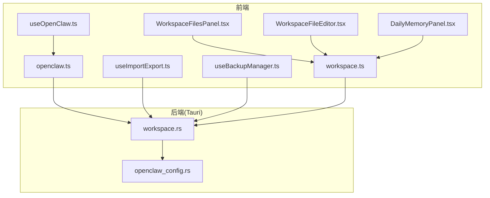
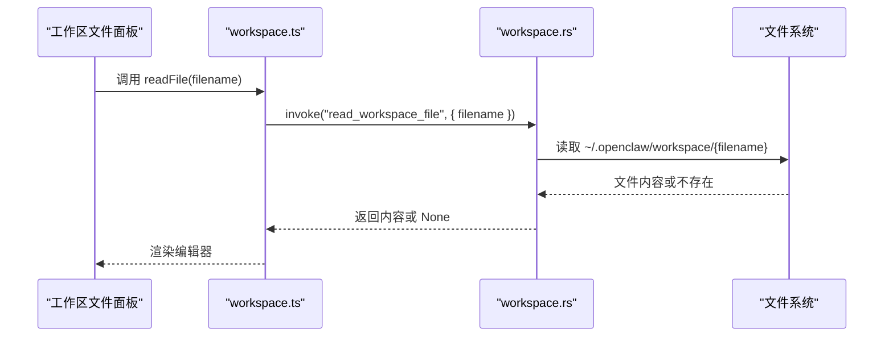
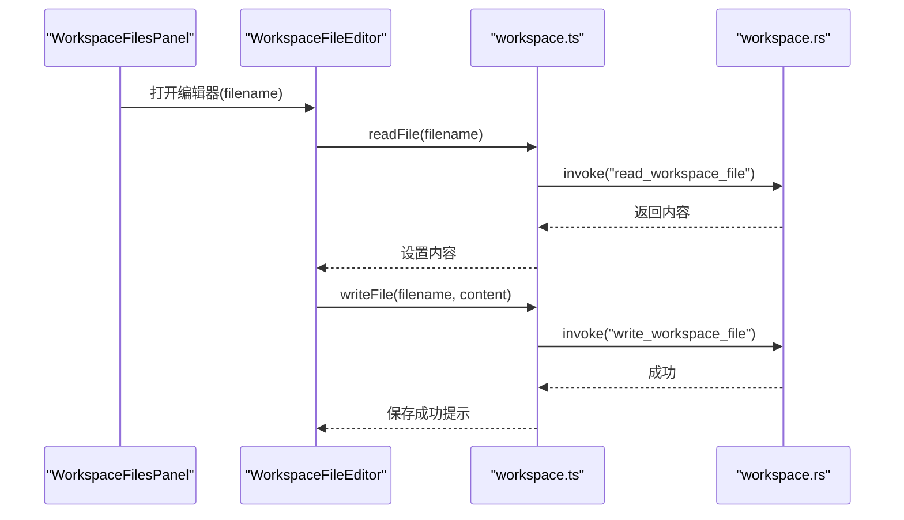
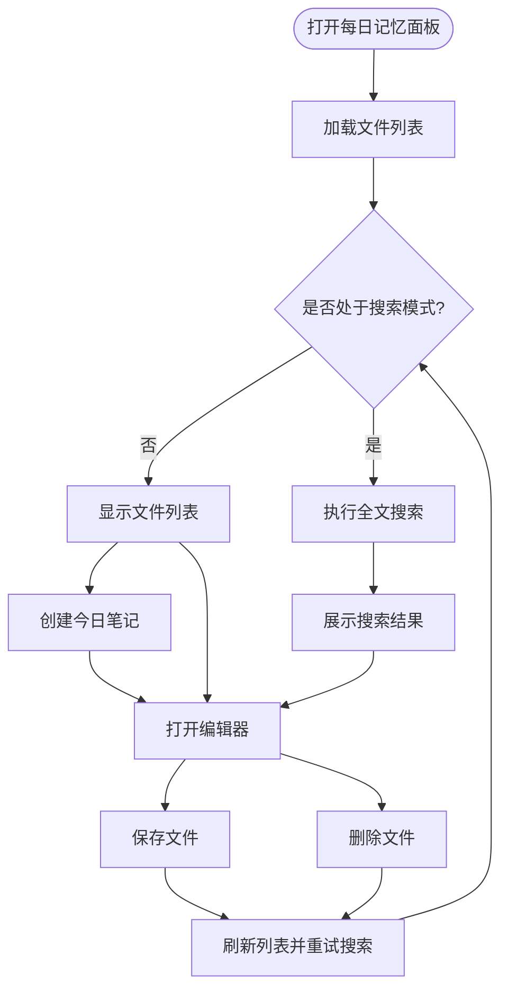
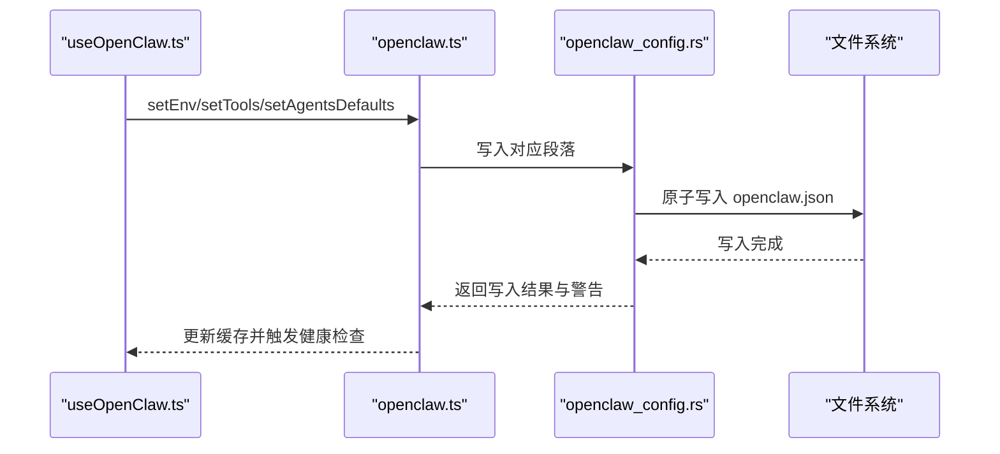
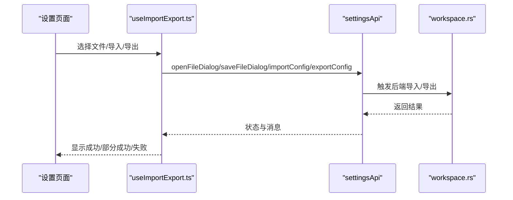
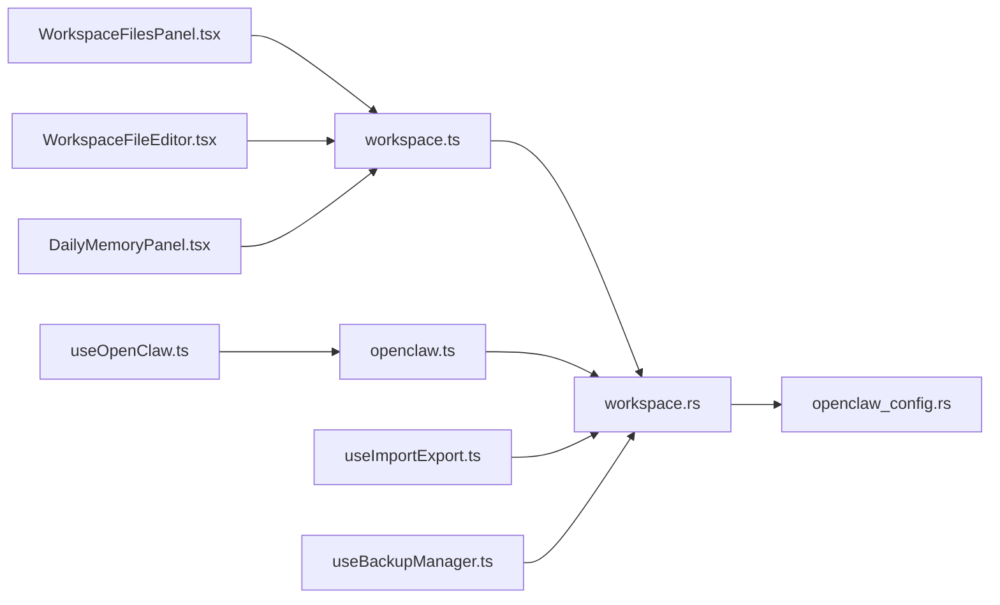

# 工作区管理

<cite>
**本文引用的文件**
- [WorkspaceFilesPanel.tsx](file://src/components/workspace/WorkspaceFilesPanel.tsx)
- [WorkspaceFileEditor.tsx](file://src/components/workspace/WorkspaceFileEditor.tsx)
- [DailyMemoryPanel.tsx](file://src/components/workspace/DailyMemoryPanel.tsx)
- [workspace.ts](file://src/lib/api/workspace.ts)
- [workspace.rs](file://src-tauri/src/commands/workspace.rs)
- [openclaw_config.rs](file://src-tauri/src/openclaw_config.rs)
- [useOpenClaw.ts](file://src/hooks/useOpenClaw.ts)
- [openclaw.ts](file://src/lib/api/openclaw.ts)
- [useImportExport.ts](file://src/hooks/useImportExport.ts)
- [ImportExportSection.tsx](file://src/components/settings/ImportExportSection.tsx)
- [useBackupManager.ts](file://src/hooks/useBackupManager.ts)
- [3.5 工作区.md](file://docs/user-manual/zh/3-extensions/3.5-workspace.md)
- [5.1 配置文件.md](file://docs/user-manual/en/5-faq/5.1-config-files.md)
- [en.json](file://src/i18n/locales/en.json)
- [zh.json](file://src/i18n/locales/zh.json)
</cite>

## 目录
1. [简介](#简介)
2. [项目结构](#项目结构)
3. [核心组件](#核心组件)
4. [架构总览](#架构总览)
5. [详细组件分析](#详细组件分析)
6. [依赖关系分析](#依赖关系分析)
7. [性能考虑](#性能考虑)
8. [故障排除指南](#故障排除指南)
9. [结论](#结论)
10. [附录](#附录)

## 简介
本章节面向 CC Switch 的“工作区管理”能力，聚焦 OpenClaw 的工作区文件与每日记忆功能。工作区是 OpenClaw 在本地运行时用于存放“心智与行为配置”的一组 Markdown 文件，配合每日记忆（按日期组织的记忆日志）形成完整的“长期记忆与行为基线”。CC Switch 提供了可视化界面，让用户在应用内直接浏览、编辑、搜索与管理这些文件，并与 OpenClaw 的配置文件（openclaw.json）进行联动。

工作区文件位于 `~/.openclaw/workspace/`，包含以下 9 个关键文件：
- AGENTS.md：Agent 定义与配置
- SOUL.md：系统灵魂/性格设置
- USER.md：用户资料信息
- IDENTITY.md：身份与角色定义
- TOOLS.md：可用工具配置
- MEMORY.md：系统记忆
- HEARTBEAT.md：心跳配置
- BOOTSTRAP.md：引导序列
- BOOT.md：启动配置

每日记忆文件位于 `~/.openclaw/workspace/memory/`，采用 `YYYY-MM-DD.md` 的命名规则，支持全文检索、按日期排序与删除等操作。

## 项目结构
工作区管理由前端 React 组件与 Tauri 命令层共同实现，前后端通过 Tauri 的 invoke 机制通信。核心文件组织如下：
- 前端组件：工作区文件面板、文件编辑器、每日记忆面板
- 前端 API：workspace.ts 提供统一的 workspaceApi 接口
- 后端命令：workspace.rs 实现文件读写、目录打开、每日记忆列表与搜索
- OpenClaw 集成：openclaw_config.rs 提供 openclaw.json 的读写与健康检查
- 钩子与设置：useOpenClaw.ts、useImportExport.ts、useBackupManager.ts 提供查询、导入导出与备份管理

图表来源
- [WorkspaceFilesPanel.tsx:54-163](file://src/components/workspace/WorkspaceFilesPanel.tsx#L54-L163)
- [WorkspaceFileEditor.tsx:15-95](file://src/components/workspace/WorkspaceFileEditor.tsx#L15-L95)
- [DailyMemoryPanel.tsx:42-553](file://src/components/workspace/DailyMemoryPanel.tsx#L42-L553)
- [workspace.ts:20-56](file://src/lib/api/workspace.ts#L20-L56)
- [workspace.rs:305-363](file://src-tauri/src/commands/workspace.rs#L305-L363)
- [openclaw_config.rs:31-48](file://src-tauri/src/openclaw_config.rs#L31-L48)

章节来源
- [WorkspaceFilesPanel.tsx:1-166](file://src/components/workspace/WorkspaceFilesPanel.tsx#L1-L166)
- [WorkspaceFileEditor.tsx:1-96](file://src/components/workspace/WorkspaceFileEditor.tsx#L1-L96)
- [DailyMemoryPanel.tsx:1-553](file://src/components/workspace/DailyMemoryPanel.tsx#L1-L553)
- [workspace.ts:1-57](file://src/lib/api/workspace.ts#L1-L57)
- [workspace.rs:1-363](file://src-tauri/src/commands/workspace.rs#L1-L363)
- [openclaw_config.rs:1-800](file://src-tauri/src/openclaw_config.rs#L1-L800)

## 核心组件
- 工作区文件面板：展示 9 个工作区文件，支持打开目录、查看存在状态、进入编辑器
- 工作区文件编辑器：Markdown 编辑器，支持暗色模式检测、占位符、保存
- 每日记忆面板：列出 memory 目录下所有日期文件，支持搜索、创建今日、删除、打开编辑
- workspaceApi：前端统一接口，封装 invoke 调用，暴露读写、目录打开、每日记忆相关方法
- workspace.rs：后端命令实现，白名单校验、安全写入、目录打开、每日记忆列表/搜索/删除
- openclaw_config.rs：openclaw.json 的读写与健康检查，提供 agents.defaults/env/tools 等段落的访问
- useOpenClaw.ts：OpenClaw 配置查询与保存的 React Query 钩子
- useImportExport.ts：配置导入导出与备份管理钩子
- useBackupManager.ts：数据库备份管理钩子

章节来源
- [WorkspaceFilesPanel.tsx:24-163](file://src/components/workspace/WorkspaceFilesPanel.tsx#L24-L163)
- [WorkspaceFileEditor.tsx:9-95](file://src/components/workspace/WorkspaceFileEditor.tsx#L9-L95)
- [DailyMemoryPanel.tsx:23-553](file://src/components/workspace/DailyMemoryPanel.tsx#L23-L553)
- [workspace.ts:20-56](file://src/lib/api/workspace.ts#L20-L56)
- [workspace.rs:9-363](file://src-tauri/src/commands/workspace.rs#L9-L363)
- [openclaw_config.rs:31-48](file://src-tauri/src/openclaw_config.rs#L31-L48)
- [useOpenClaw.ts:14-145](file://src/hooks/useOpenClaw.ts#L14-L145)
- [useImportExport.ts:31-204](file://src/hooks/useImportExport.ts#L31-L204)
- [useBackupManager.ts:4-59](file://src/hooks/useBackupManager.ts#L4-L59)

## 架构总览
工作区管理采用“前端组件 + Tauri 命令 + 后端文件系统”的分层设计：
- 前端负责 UI 交互与状态管理
- workspaceApi 作为统一入口，将调用转发给 Tauri 命令
- workspace.rs 实现具体业务逻辑，包括文件名校验、安全写入、目录打开、每日记忆搜索
- openclaw_config.rs 提供 openclaw.json 的读写与健康检查，保障配置一致性

图表来源
- [workspace.ts:21-27](file://src/lib/api/workspace.ts#L21-L27)
- [workspace.rs:308-322](file://src-tauri/src/commands/workspace.rs#L308-L322)

章节来源
- [workspace.ts:20-56](file://src/lib/api/workspace.ts#L20-L56)
- [workspace.rs:305-363](file://src-tauri/src/commands/workspace.rs#L305-L363)

## 详细组件分析

### 工作区文件面板与编辑器
- 文件面板：展示 9 个固定文件，带图标、描述与存在状态；点击进入编辑器；支持打开工作区目录
- 文件编辑器：Markdown 编辑器，支持暗色模式检测、加载态、保存按钮禁用、占位符、全屏面板
- 交互流程：点击文件 → 读取内容 → 打开编辑器 → 修改内容 → 保存到工作区目录

图表来源
- [WorkspaceFilesPanel.tsx:54-163](file://src/components/workspace/WorkspaceFilesPanel.tsx#L54-L163)
- [WorkspaceFileEditor.tsx:15-95](file://src/components/workspace/WorkspaceFileEditor.tsx#L15-L95)
- [workspace.ts:21-27](file://src/lib/api/workspace.ts#L21-L27)
- [workspace.rs:308-340](file://src-tauri/src/commands/workspace.rs#L308-L340)

章节来源
- [WorkspaceFilesPanel.tsx:54-163](file://src/components/workspace/WorkspaceFilesPanel.tsx#L54-L163)
- [WorkspaceFileEditor.tsx:15-95](file://src/components/workspace/WorkspaceFileEditor.tsx#L15-L95)
- [workspace.ts:20-56](file://src/lib/api/workspace.ts#L20-L56)
- [workspace.rs:305-363](file://src-tauri/src/commands/workspace.rs#L305-L363)

### 每日记忆面板
- 列表：按日期降序排列，显示文件名、大小、预览
- 搜索：支持按关键词在所有文件中搜索，显示匹配数与片段预览
- 编辑：打开 Markdown 编辑器，保存后写入对应日期文件
- 删除：确认对话框，删除后刷新列表并重试搜索
- 快捷键：Cmd/Ctrl+F 打开搜索，Esc 关闭搜索

图表来源
- [DailyMemoryPanel.tsx:180-290](file://src/components/workspace/DailyMemoryPanel.tsx#L180-L290)
- [workspace.rs:58-150](file://src-tauri/src/commands/workspace.rs#L58-L150)
- [workspace.rs:188-285](file://src-tauri/src/commands/workspace.rs#L188-L285)

章节来源
- [DailyMemoryPanel.tsx:42-553](file://src/components/workspace/DailyMemoryPanel.tsx#L42-L553)
- [workspace.rs:58-150](file://src-tauri/src/commands/workspace.rs#L58-L150)
- [workspace.rs:188-285](file://src-tauri/src/commands/workspace.rs#L188-L285)

### 与 OpenClaw 的集成
- openclaw.json 读写：通过 openclaw_config.rs 提供的 API 读取/写入 agents.defaults、env、tools 等段落
- 查询与保存：useOpenClaw.ts 提供查询与保存的 React Query 钩子，保存后失效相关缓存并触发健康检查
- 健康检查：扫描配置健康状况，输出警告信息（如 tools.profile 非法、agents.defaults.timeout 已废弃等）

图表来源
- [useOpenClaw.ts:102-144](file://src/hooks/useOpenClaw.ts#L102-L144)
- [openclaw.ts:20-121](file://src/lib/api/openclaw.ts#L20-L121)
- [openclaw_config.rs:196-228](file://src-tauri/src/openclaw_config.rs#L196-L228)
- [openclaw_config.rs:379-383](file://src-tauri/src/openclaw_config.rs#L379-L383)

章节来源
- [useOpenClaw.ts:14-145](file://src/hooks/useOpenClaw.ts#L14-L145)
- [openclaw.ts:20-121](file://src/lib/api/openclaw.ts#L20-L121)
- [openclaw_config.rs:196-228](file://src-tauri/src/openclaw_config.rs#L196-L228)
- [openclaw_config.rs:379-383](file://src-tauri/src/openclaw_config.rs#L379-L383)

### 导入导出与备份恢复
- 导入导出：useImportExport.ts 提供导入/导出配置的能力，支持选择文件、执行导入、导出、状态反馈与错误处理
- 数据库备份：useBackupManager.ts 提供备份列表、创建、恢复、重命名、删除等操作
- 设置页面：ImportExportSection.tsx 展示导入导出状态与消息

图表来源
- [useImportExport.ts:31-204](file://src/hooks/useImportExport.ts#L31-L204)
- [ImportExportSection.tsx:26-124](file://src/components/settings/ImportExportSection.tsx#L26-L124)
- [workspace.rs:342-363](file://src-tauri/src/commands/workspace.rs#L342-L363)

章节来源
- [useImportExport.ts:31-204](file://src/hooks/useImportExport.ts#L31-L204)
- [ImportExportSection.tsx:26-124](file://src/components/settings/ImportExportSection.tsx#L26-L124)
- [useBackupManager.ts:4-59](file://src/hooks/useBackupManager.ts#L4-L59)
- [workspace.rs:342-363](file://src-tauri/src/commands/workspace.rs#L342-L363)

## 依赖关系分析
- 组件依赖：WorkspaceFilesPanel 依赖 workspaceApi；WorkspaceFileEditor 依赖 workspaceApi 与 MarkdownEditor；DailyMemoryPanel 依赖 workspaceApi 与 MarkdownEditor
- API 依赖：workspace.ts 依赖 @tauri-apps/api/core 的 invoke；openclaw.ts 依赖 @tauri-apps/api/core 的 invoke
- 命令依赖：workspace.rs 依赖 openclaw_config.rs 进行 openclaw.json 的读写；workspace.rs 依赖 tauri_plugin_opener 打开系统文件管理器
- 配置依赖：useOpenClaw.ts 依赖 openclawApi；useImportExport.ts 依赖 settingsApi；useBackupManager.ts 依赖 backupsApi

图表来源
- [WorkspaceFilesPanel.tsx:20-22](file://src/components/workspace/WorkspaceFilesPanel.tsx#L20-L22)
- [WorkspaceFileEditor.tsx:4-7](file://src/components/workspace/WorkspaceFileEditor.tsx#L4-L7)
- [DailyMemoryPanel.tsx:16-21](file://src/components/workspace/DailyMemoryPanel.tsx#L16-L21)
- [workspace.ts:1-57](file://src/lib/api/workspace.ts#L1-L57)
- [workspace.rs:1-363](file://src-tauri/src/commands/workspace.rs#L1-L363)
- [openclaw_config.rs:1-800](file://src-tauri/src/openclaw_config.rs#L1-L800)
- [useOpenClaw.ts:1-145](file://src/hooks/useOpenClaw.ts#L1-L145)
- [openclaw.ts:1-122](file://src/lib/api/openclaw.ts#L1-L122)
- [useImportExport.ts:1-204](file://src/hooks/useImportExport.ts#L1-L204)
- [useBackupManager.ts:1-60](file://src/hooks/useBackupManager.ts#L1-L60)

章节来源
- [workspace.ts:1-57](file://src/lib/api/workspace.ts#L1-L57)
- [workspace.rs:1-363](file://src-tauri/src/commands/workspace.rs#L1-L363)
- [openclaw_config.rs:1-800](file://src-tauri/src/openclaw_config.rs#L1-L800)
- [useOpenClaw.ts:1-145](file://src/hooks/useOpenClaw.ts#L1-L145)
- [openclaw.ts:1-122](file://src/lib/api/openclaw.ts#L1-L122)
- [useImportExport.ts:1-204](file://src/hooks/useImportExport.ts#L1-L204)
- [useBackupManager.ts:1-60](file://src/hooks/useBackupManager.ts#L1-L60)

## 性能考虑
- 并发读取：工作区文件面板在初始化时并发检查多个文件是否存在，避免串行等待
- 搜索去抖：每日记忆搜索使用 300ms 去抖，降低频繁请求带来的 IO 压力
- 暗色模式监听：编辑器动态监听系统主题变化，避免重复渲染
- 列表排序：每日记忆按日期倒序，保证最新记录优先显示
- 健康检查：OpenClaw 配置写入后进行轻量级健康检查，避免无效配置影响运行

章节来源
- [WorkspaceFilesPanel.tsx:60-77](file://src/components/workspace/WorkspaceFilesPanel.tsx#L60-L77)
- [DailyMemoryPanel.tsx:93-126](file://src/components/workspace/DailyMemoryPanel.tsx#L93-L126)
- [DailyMemoryPanel.tsx:74-84](file://src/components/workspace/DailyMemoryPanel.tsx#L74-L84)
- [useOpenClaw.ts:55-92](file://src/hooks/useOpenClaw.ts#L55-L92)

## 故障排除指南
- 无法打开工作区目录
  - 检查 workspace.rs 中 open_workspace_directory 的实现，确保目录存在且可打开
  - 若目录不存在，命令会自动创建后再打开
- 保存失败
  - 检查 workspace.rs 的 write_workspace_file 与 write_daily_memory_file 是否抛出异常
  - 确认目标目录权限与磁盘空间充足
- 每日记忆搜索无结果
  - 确认 memory 目录存在且包含 .md 文件
  - 检查搜索关键词是否为空，以及正则表达式是否匹配日期格式
- OpenClaw 配置写入失败
  - 检查 openclaw_config.rs 的原子写入逻辑与备份策略
  - 查看健康检查警告，修正 tools.profile 或 agents.defaults.timeout 等问题
- 导入导出失败
  - 检查 useImportExport.ts 的错误处理与状态反馈
  - 确认选择的文件路径有效，后端导入/导出命令返回成功

章节来源
- [workspace.rs:342-363](file://src-tauri/src/commands/workspace.rs#L342-L363)
- [workspace.rs:324-340](file://src-tauri/src/commands/workspace.rs#L324-L340)
- [workspace.rs:188-285](file://src-tauri/src/commands/workspace.rs#L188-L285)
- [openclaw_config.rs:379-383](file://src-tauri/src/openclaw_config.rs#L379-L383)
- [useOpenClaw.ts:102-144](file://src/hooks/useOpenClaw.ts#L102-L144)
- [useImportExport.ts:68-141](file://src/hooks/useImportExport.ts#L68-L141)

## 结论
CC Switch 的工作区管理以“安全白名单 + 原子写入 + 健康检查”为核心原则，为 OpenClaw 提供了稳定可靠的心智与记忆文件管理能力。通过前端组件与 Tauri 命令层的清晰分工，实现了良好的用户体验与可维护性。建议在团队协作中遵循统一的文件命名与内容规范，定期进行备份与健康检查，确保工作区文件的完整性与可用性。

## 附录

### 工作区文件与每日记忆使用示例
- 打开工作区目录：点击面板顶部路径，系统文件管理器中打开 `~/.openclaw/workspace/`
- 编辑工作区文件：点击任一文件卡片，打开 Markdown 编辑器，修改后保存
- 创建今日记忆：点击“每日记忆”卡片，打开面板后点击“添加记忆”，输入内容后保存
- 全文搜索：在每日记忆面板中按 Cmd/Ctrl+F 打开搜索，输入关键词回车即可

章节来源
- [3.5 工作区.md:1-86](file://docs/user-manual/zh/3-extensions/3.5-workspace.md#L1-L86)
- [DailyMemoryPanel.tsx:128-179](file://src/components/workspace/DailyMemoryPanel.tsx#L128-L179)

### 工作区与 OpenClaw 配置的关系
- openclaw.json 的 agents.defaults.workspace 字段指向工作区目录
- 工作区文件与 openclaw.json 的 agents.defaults、env、tools 等段落协同工作
- 健康检查可发现配置中的潜在问题并给出修复建议

章节来源
- [5.1 配置文件.md:251-294](file://docs/user-manual/en/5-faq/5.1-config-files.md#L251-L294)
- [openclaw_config.rs:575-626](file://src-tauri/src/openclaw_config.rs#L575-L626)

### 国际化与本地化
- 工作区与每日记忆的文案在多语言资源中定义，支持英文、中文、日文
- 例如“打开在文件管理器中”、“保存成功/失败”、“搜索全文内容”等

章节来源
- [en.json:1787-1812](file://src/i18n/locales/en.json#L1787-L1812)
- [zh.json:1789-1812](file://src/i18n/locales/zh.json#L1789-L1812)