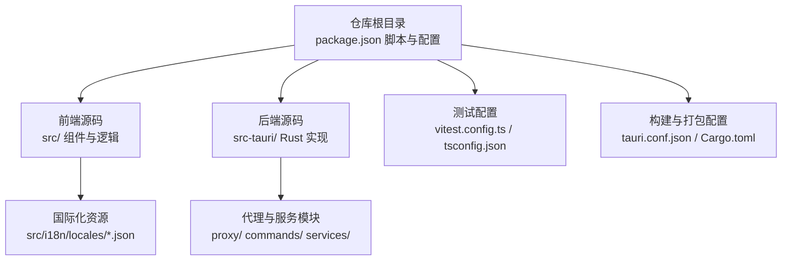
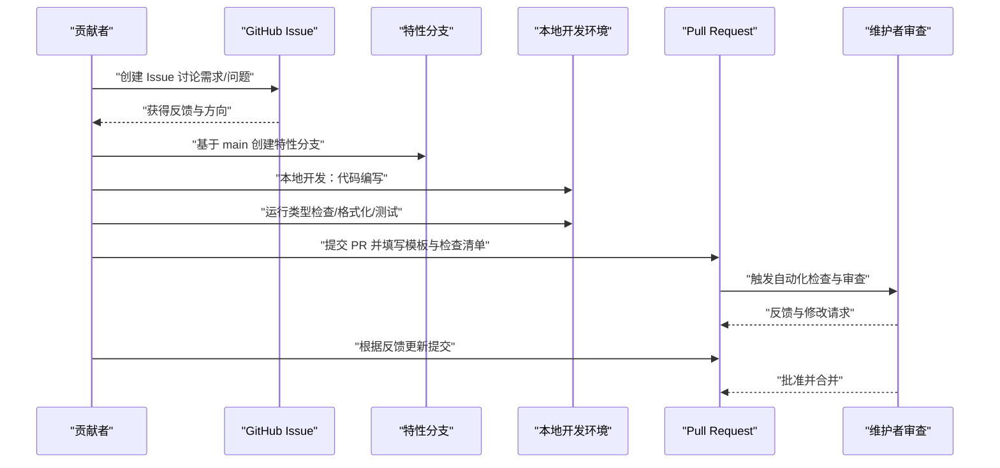
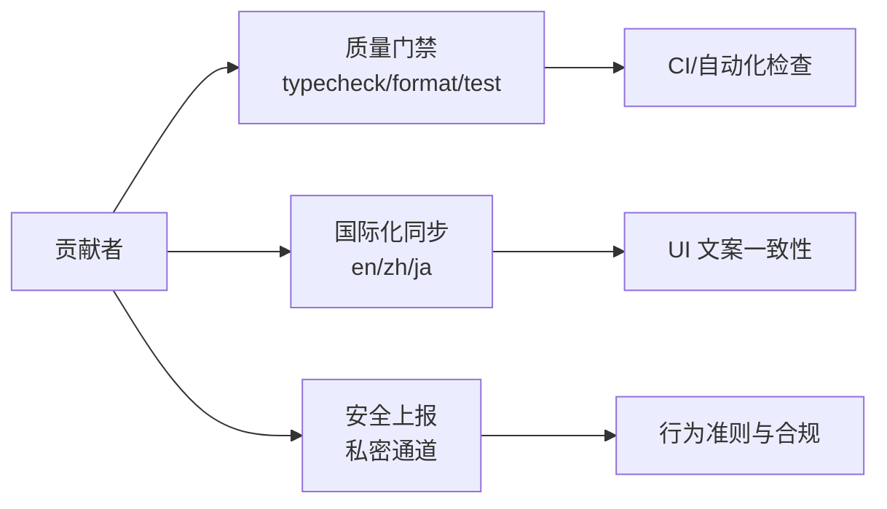

# Pull Request 流程

<cite>
**本文引用的文件**
- [CONTRIBUTING.md](file://CONTRIBUTING.md)
- [CODE_OF_CONDUCT.md](file://CODE_OF_CONDUCT.md)
- [SECURITY.md](file://SECURITY.md)
- [SUPPORT.md](file://SUPPORT.md)
- [package.json](file://package.json)
- [vitest.config.ts](file://vitest.config.ts)
- [tsconfig.json](file://tsconfig.json)
- [src-tauri/Cargo.toml](file://src-tauri/Cargo.toml)
- [src-tauri/tauri.conf.json](file://src-tauri/tauri.conf.json)
</cite>

## 目录
1. [简介](#简介)
2. [项目结构](#项目结构)
3. [核心组件](#核心组件)
4. [架构总览](#架构总览)
5. [详细组件分析](#详细组件分析)
6. [依赖关系分析](#依赖关系分析)
7. [性能考量](#性能考量)
8. [故障排查指南](#故障排查指南)
9. [结论](#结论)
10. [附录](#附录)

## 简介
本文件面向 CC Switch 项目的贡献者，系统化梳理从“开 Issue 讨论”到“分支创建、代码编写、测试验证、PR 审查与合并”的完整 Pull Request 流程。文档重点覆盖：
- PR 创建与前置流程：Issue 讨论、分支命名与范围控制
- 代码质量与测试标准：类型检查、格式化、单元测试、覆盖率
- 提交信息规范（Conventional Commits）与 PR 检查清单
- PR 模板使用说明与最佳实践
- 国际化文案变更与多语言同步
- 安全问题上报与行为准则

## 项目结构
CC Switch 采用前后端分离的桌面应用架构，前端基于 React/Vite/Tauri，后端基于 Rust/Tauri，测试框架为 Vitest。仓库根目录提供统一的脚本与配置，便于本地开发与 CI 集成。

图表来源
- [package.json:1-96](file://package.json#L1-L96)
- [vitest.config.ts:1-21](file://vitest.config.ts#L1-L21)
- [tsconfig.json:1-26](file://tsconfig.json#L1-L26)
- [src-tauri/tauri.conf.json:1-70](file://src-tauri/tauri.conf.json#L1-L70)
- [src-tauri/Cargo.toml:1-110](file://src-tauri/Cargo.toml#L1-L110)

章节来源
- [package.json:1-96](file://package.json#L1-L96)
- [vitest.config.ts:1-21](file://vitest.config.ts#L1-L21)
- [tsconfig.json:1-26](file://tsconfig.json#L1-L26)
- [src-tauri/tauri.conf.json:1-70](file://src-tauri/tauri.conf.json#L1-L70)
- [src-tauri/Cargo.toml:1-110](file://src-tauri/Cargo.toml#L1-L110)

## 核心组件
- 贡献与行为准则：定义贡献入口、讨论渠道、安全问题上报与行为规范
- 开发与测试工具链：统一的脚本命令、类型检查、格式化、单元测试与覆盖率
- 提交信息规范：Conventional Commits 规范与示例
- PR 检查清单：前端与后端质量门禁项
- 国际化：用户可见文案的多语言同步要求

章节来源
- [CONTRIBUTING.md:71-224](file://CONTRIBUTING.md#L71-L224)
- [package.json:6-17](file://package.json#L6-L17)
- [vitest.config.ts:12-19](file://vitest.config.ts#L12-L19)
- [tsconfig.json:13-21](file://tsconfig.json#L13-L21)
- [src-tauri/Cargo.toml:25-83](file://src-tauri/Cargo.toml#L25-L83)

## 架构总览
下图展示一次典型 PR 的端到端流程：从 Issue 讨论、分支创建、本地开发与测试，到 PR 提交与审查。

图表来源
- [CONTRIBUTING.md:71-224](file://CONTRIBUTING.md#L71-L224)

## 详细组件分析

### 1) Issue 讨论与 PR 前置流程
- 新功能必须先开 Issue 讨论，避免无方向的 PR 被关闭
- Bug/文档/安全等问题通过对应模板提交
- 讨论结果将指导后续 PR 的范围与设计

章节来源
- [CONTRIBUTING.md:11-14](file://CONTRIBUTING.md#L11-L14)
- [CONTRIBUTING.md:201-204](file://CONTRIBUTING.md#L201-L204)
- [SUPPORT.md:14-29](file://SUPPORT.md#L14-L29)

### 2) 分支创建与命名规范
- 基于 main 分支创建特性分支，命名建议：
  - 新功能：feat/my-feature
  - 修复：fix/issue-编号
  - 文档：docs/readme
  - 工程：ci、chore(deps)
- 保持 PR 聚焦：每个 PR 解决一个问题或一个功能点

章节来源
- [CONTRIBUTING.md:202-204](file://CONTRIBUTING.md#L202-L204)

### 3) 代码质量与测试验证
- 前端质量门禁
  - 类型检查：pnpm typecheck
  - 格式化检查：pnpm format:check
  - 单元测试：pnpm test:unit
- 后端质量门禁（Rust）
  - cargo fmt --check
  - cargo clippy
  - cargo test
- 测试覆盖率
  - Vitest 配置启用覆盖率输出（text、lcov）

章节来源
- [CONTRIBUTING.md:64-69](file://CONTRIBUTING.md#L64-L69)
- [CONTRIBUTING.md:192-197](file://CONTRIBUTING.md#L192-L197)
- [package.json:12-16](file://package.json#L12-L16)
- [vitest.config.ts:16-18](file://vitest.config.ts#L16-L18)

### 4) 提交信息规范（Conventional Commits）
- 规范格式：type(scope): subject
- 示例类别：feat、fix、docs、ci、chore、refactor 等
- 作用：便于 CHANGELOG 生成、语义化版本与自动化审查

章节来源
- [CONTRIBUTING.md:85-95](file://CONTRIBUTING.md#L85-L95)
- [CONTRIBUTING.md:213-223](file://CONTRIBUTING.md#L213-L223)

### 5) PR 检查清单与模板使用
- 检查清单项
  - 前端：pnpm typecheck、pnpm format:check、测试通过
  - 后端：cargo clippy 通过（若涉及 Rust 修改）
  - 国际化：用户可见文案变更需同步更新三套语言文件
- 模板使用
  - 填写 PR 模板中的摘要、相关 Issue、变更说明与检查清单
  - 保持 PR 小而聚焦，避免无关改动

章节来源
- [CONTRIBUTING.md:78-84](file://CONTRIBUTING.md#L78-L84)
- [CONTRIBUTING.md:206-211](file://CONTRIBUTING.md#L206-L211)

### 6) 国际化（i18n）与文案同步
- 用户可见文案必须在三套语言文件中同步更新
- 使用 i18next 的 t() 函数渲染 UI 文案
- 禁止硬编码用户可见字符串

章节来源
- [CONTRIBUTING.md:111-121](file://CONTRIBUTING.md#L111-L121)
- [CONTRIBUTING.md:239-248](file://CONTRIBUTING.md#L239-L248)

### 7) 安全问题上报与行为准则
- 安全漏洞禁止通过公开 Issue 报告，应使用 GitHub Security Advisories 私密通道
- 行为准则明确了社区互动标准、执行与处理流程

章节来源
- [SECURITY.md:14-23](file://SECURITY.md#L14-L23)
- [CODE_OF_CONDUCT.md:11-28](file://CODE_OF_CONDUCT.md#L11-L28)

### 8) 开发与构建配置要点
- 前端
  - Vite + React + TypeScript
  - Vitest 单测 + 覆盖率
- 后端
  - Tauri 2.0 + Rust
  - Cargo 依赖与 profile.release 优化
- 构建
  - tauri.conf.json 定义窗口、安全策略、插件与打包参数

章节来源
- [package.json:1-96](file://package.json#L1-L96)
- [vitest.config.ts:1-21](file://vitest.config.ts#L1-L21)
- [tsconfig.json:1-26](file://tsconfig.json#L1-L26)
- [src-tauri/Cargo.toml:1-110](file://src-tauri/Cargo.toml#L1-L110)
- [src-tauri/tauri.conf.json:1-70](file://src-tauri/tauri.conf.json#L1-L70)

## 依赖关系分析
PR 流程的关键依赖与耦合点：
- 质量门禁依赖本地工具链：TypeScript、Prettier、ESLint、Cargo、Clippy、Vitest
- 国际化依赖三套语言文件与 i18next 渲染
- 安全与行为准则约束 PR 的提交与沟通方式

图表来源
- [CONTRIBUTING.md:64-69](file://CONTRIBUTING.md#L64-L69)
- [CONTRIBUTING.md:111-121](file://CONTRIBUTING.md#L111-L121)
- [SECURITY.md:14-23](file://SECURITY.md#L14-L23)
- [CODE_OF_CONDUCT.md:11-28](file://CODE_OF_CONDUCT.md#L11-L28)

章节来源
- [CONTRIBUTING.md:64-69](file://CONTRIBUTING.md#L64-L69)
- [CONTRIBUTING.md:111-121](file://CONTRIBUTING.md#L111-L121)
- [SECURITY.md:14-23](file://SECURITY.md#L14-L23)
- [CODE_OF_CONDUCT.md:11-28](file://CODE_OF_CONDUCT.md#L11-L28)

## 性能考量
- 本地开发阶段优先运行轻量级检查（类型检查、格式化），再运行测试，减少等待时间
- Rust 侧使用 cargo clippy 与测试并行，确保编译期与运行期质量
- 构建优化：release profile 已针对二进制体积与符号进行裁剪，PR 中避免引入不必要的大依赖

章节来源
- [CONTRIBUTING.md:64-69](file://CONTRIBUTING.md#L64-L69)
- [src-tauri/Cargo.toml:98-106](file://src-tauri/Cargo.toml#L98-L106)

## 故障排查指南
- 提交信息不符合 Conventional Commits 导致 CI 失败
  - 检查提交信息格式，参考示例类别与格式
- 类型检查失败
  - 运行 pnpm typecheck，逐项修复类型问题
- 格式化检查失败
  - 运行 pnpm format:check，按提示修正格式
- 单元测试失败或覆盖率不足
  - 运行 pnpm test:unit，查看 Vitest 报告；必要时补充测试用例
- Rust 侧 clippy 或测试失败
  - 运行 cargo clippy 与 cargo test，修复警告与错误
- 国际化文案未同步
  - 更新 en/zh/ja 三套语言文件，确保 t() 函数使用正确

章节来源
- [CONTRIBUTING.md:64-69](file://CONTRIBUTING.md#L64-L69)
- [CONTRIBUTING.md:206-211](file://CONTRIBUTING.md#L206-L211)
- [vitest.config.ts:16-18](file://vitest.config.ts#L16-L18)

## 结论
遵循本流程文档可显著提升 PR 的质量与审查效率：先 Issue 讨论、再聚焦开发与测试、最后以规范的提交信息与检查清单完成合并。配合国际化与安全策略，确保变更可控、可追溯、可维护。

## 附录
- 常用命令速查
  - 前端：pnpm dev、pnpm build、pnpm typecheck、pnpm test:unit、pnpm lint、pnpm format、pnpm format:check
  - 后端：cd src-tauri && cargo fmt --check、cargo clippy、cargo test
- 提交信息示例类别
  - feat、fix、docs、ci、chore、refactor、perf、test、build、style、revert

章节来源
- [CONTRIBUTING.md:29-56](file://CONTRIBUTING.md#L29-L56)
- [CONTRIBUTING.md:85-95](file://CONTRIBUTING.md#L85-L95)
- [CONTRIBUTING.md:213-223](file://CONTRIBUTING.md#L213-L223)