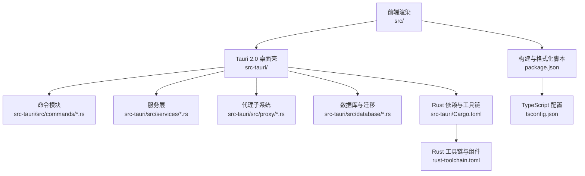
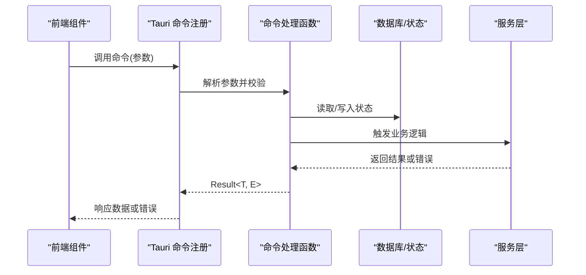
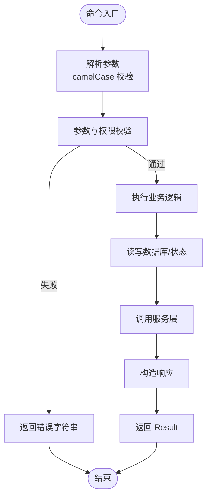
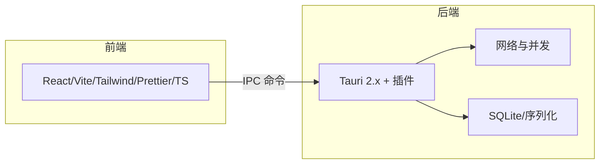

# 代码规范

<cite>
**本文引用的文件**
- [package.json](file://package.json)
- [tsconfig.json](file://tsconfig.json)
- [rust-toolchain.toml](file://rust-toolchain.toml)
- [Cargo.toml](file://src-tauri/Cargo.toml)
- [tauri.conf.json](file://src-tauri/tauri.conf.json)
- [commands/mod.rs](file://src-tauri/src/commands/mod.rs)
- [commands/config.rs](file://src-tauri/src/commands/config.rs)
- [commands/provider.rs](file://src-tauri/src/commands/provider.rs)
- [commands/proxy.rs](file://src-tauri/src/commands/proxy.rs)
</cite>

## 目录
1. [简介](#简介)
2. [项目结构](#项目结构)
3. [核心组件](#核心组件)
4. [架构总览](#架构总览)
5. [详细组件分析](#详细组件分析)
6. [依赖分析](#依赖分析)
7. [性能考虑](#性能考虑)
8. [故障排查指南](#故障排查指南)
9. [结论](#结论)
10. [附录](#附录)

## 简介
本文件为 CC Switch 项目的代码规范文档，面向前端与后端开发者，明确以下要求与最佳实践：
- 前端：Prettier 格式化、ESLint 检查与 TypeScript 严格模式
- 后端：Rust 格式化与静态分析（cargo fmt、cargo clippy）
- Tauri 2.0 特定规范：命令命名约定与跨端交互约束
- 提交前检查流程与检查清单

本规范旨在统一代码风格、提升可维护性与可读性，并确保跨平台构建与运行的一致性。

## 项目结构
本项目采用“前端渲染 + Tauri 2.0 桌面壳 + Rust 后端服务”的混合架构。关键目录与职责如下：
- 前端源码位于 src/，包含 React 组件、国际化、工具函数与类型定义
- Tauri 后端位于 src-tauri/，包含 Rust 命令模块、服务层、代理与数据库逻辑
- 构建与开发脚本通过 package.json 管理，TypeScript 配置由 tsconfig.json 提供
- Rust 工具链与格式化/静态分析由 rust-toolchain.toml 与 Cargo.toml 控制

图表来源
- [package.json:1-96](file://package.json#L1-L96)
- [tsconfig.json:1-26](file://tsconfig.json#L1-L26)
- [Cargo.toml:1-110](file://src-tauri/Cargo.toml#L1-L110)
- [rust-toolchain.toml:1-5](file://rust-toolchain.toml#L1-L5)

章节来源
- [package.json:1-96](file://package.json#L1-L96)
- [tsconfig.json:1-26](file://tsconfig.json#L1-L26)
- [Cargo.toml:1-110](file://src-tauri/Cargo.toml#L1-L110)
- [rust-toolchain.toml:1-5](file://rust-toolchain.toml#L1-L5)

## 核心组件
- 前端工程化
  - Prettier：统一格式化规则，提供格式化与检查脚本
  - TypeScript：启用严格模式与严格未使用项检查
  - Vite：开发与构建工具
- Rust 工程化
  - rust-toolchain.toml：固定工具链版本与组件（rustfmt、clippy）
  - Cargo.toml：依赖管理与发布配置
- Tauri 2.0
  - 命令模块：按功能拆分命令文件，统一通过 mod.rs 导出
  - 配置：tauri.conf.json 管理窗口、安全策略与插件

章节来源
- [package.json:12-16](file://package.json#L12-L16)
- [tsconfig.json:13-16](file://tsconfig.json#L13-L16)
- [rust-toolchain.toml:1-5](file://rust-toolchain.toml#L1-L5)
- [Cargo.toml:1-110](file://src-tauri/Cargo.toml#L1-L110)
- [tauri.conf.json:1-70](file://src-tauri/tauri.conf.json#L1-L70)

## 架构总览
Tauri 2.0 在桌面端提供安全的 IPC 通道，前端通过命令与后端交互。命令按功能模块组织，命令名采用动词短语，参数遵循 camelCase，返回值统一为 Result 类型。

图表来源
- [commands/mod.rs:1-69](file://src-tauri/src/commands/mod.rs#L1-L69)
- [commands/config.rs:13-178](file://src-tauri/src/commands/config.rs#L13-L178)
- [commands/provider.rs:21-152](file://src-tauri/src/commands/provider.rs#L21-L152)
- [commands/proxy.rs:10-82](file://src-tauri/src/commands/proxy.rs#L10-L82)

## 详细组件分析

### 前端代码规范（Prettier + TypeScript + ESLint）
- Prettier
  - 提供格式化与检查脚本，覆盖 src/** 下的 js、jsx、ts、tsx、css、json 文件
  - 建议在提交前执行格式化与检查，确保一致风格
- TypeScript
  - 启用严格模式与未使用项检查，减少潜在问题
  - 路径别名与类型测试环境已配置，便于模块化开发
- ESLint
  - 仓库未提供独立 ESLint 配置文件，建议结合 Prettier 与 TypeScript 的严格模式，必要时补充 ESLint 规则以满足团队风格

章节来源
- [package.json:12-16](file://package.json#L12-L16)
- [tsconfig.json:13-22](file://tsconfig.json#L13-L22)

### 后端 Rust 代码规范（cargo fmt + cargo clippy）
- 工具链与组件
  - 使用 rust-toolchain.toml 固定工具链版本并启用 rustfmt 与 clippy
- 格式化与静态分析
  - 使用 cargo fmt 统一代码风格
  - 使用 cargo clippy 发现潜在问题与改进点
- 依赖与特性
  - Cargo.toml 中声明了 Tauri 2.x 插件与网络、并发、数据库等依赖
  - 特性开关可用于测试钩子等场景

章节来源
- [rust-toolchain.toml:1-5](file://rust-toolchain.toml#L1-L5)
- [Cargo.toml:1-110](file://src-tauri/Cargo.toml#L1-L110)

### Tauri 2.0 命令命名规范
- 命令组织
  - 按功能拆分命令文件，统一通过 mod.rs 导出
  - 命令函数使用 #[tauri::command] 注解，参数与返回值遵循 Result<T, E>
- 命名约定
  - 动词短语命名，如 get_*、set_*、update_*、start_*、stop_* 等
  - 参数采用 camelCase，如 defaultPath、providerId、baseUrl 等
  - 返回值统一为 Result<T, String>，错误字符串用于前端展示
- 示例
  - 配置类命令：get_config_status、open_config_folder、set_common_config_snippet
  - 代理类命令：start_proxy_server、stop_proxy_server、switch_proxy_provider
  - 提供商类命令：get_providers、add_provider、switch_provider、testUsageScript

图表来源
- [commands/mod.rs:1-69](file://src-tauri/src/commands/mod.rs#L1-L69)
- [commands/config.rs:13-178](file://src-tauri/src/commands/config.rs#L13-L178)
- [commands/provider.rs:21-152](file://src-tauri/src/commands/provider.rs#L21-L152)
- [commands/proxy.rs:10-82](file://src-tauri/src/commands/proxy.rs#L10-L82)

章节来源
- [commands/mod.rs:1-69](file://src-tauri/src/commands/mod.rs#L1-L69)
- [commands/config.rs:13-178](file://src-tauri/src/commands/config.rs#L13-L178)
- [commands/provider.rs:21-152](file://src-tauri/src/commands/provider.rs#L21-L152)
- [commands/proxy.rs:10-82](file://src-tauri/src/commands/proxy.rs#L10-L82)

### Tauri 2.0 安全与配置要点
- 窗口与 CSP
  - 窗口尺寸、可见性与安全策略在 tauri.conf.json 中集中配置
  - CSP 限制脚本与样式来源，连接域包含 IPC 与本地资源
- 插件与深链
  - 深链插件配置了自定义协议 ccswitch://
  - 更新器插件配置了公钥与更新源
- 开发与构建
  - beforeDevCommand 与 beforeBuildCommand 指向前端开发与构建脚本
  - 前端产物目录与开发 URL 由配置文件统一管理

章节来源
- [tauri.conf.json:1-70](file://src-tauri/tauri.conf.json#L1-L70)

## 依赖分析
- 前端依赖
  - React 生态、UI 组件库、国际化、状态管理与测试工具
  - Vite、TailwindCSS、Prettier、TypeScript
- Rust 依赖
  - Tauri 2.x 及其插件（日志、进程、存储、更新、深链、窗口状态）
  - 网络栈（reqwest、hyper）、并发（tokio）、数据库（rusqlite）
  - 序列化（serde、serde_json、toml、serde_yaml）

图表来源
- [Cargo.toml:25-82](file://src-tauri/Cargo.toml#L25-L82)
- [package.json:42-94](file://package.json#L42-L94)

章节来源
- [Cargo.toml:25-82](file://src-tauri/Cargo.toml#L25-L82)
- [package.json:42-94](file://package.json#L42-L94)

## 性能考虑
- 前端
  - 合理拆分组件与懒加载，避免一次性渲染大型列表
  - 使用虚拟滚动与缓存策略优化长列表与频繁更新场景
- 后端
  - 使用 tokio 异步运行时处理高并发请求
  - 对数据库操作进行批处理与索引优化
  - 代理子系统启用熔断器与故障转移，降低单点故障影响
- 构建与打包
  - Release 配置优化二进制体积与运行时性能
  - 合理使用插件与最小化依赖，减少打包体积

## 故障排查指南
- 前端
  - 使用 Prettier 检查与格式化，确保提交前无格式差异
  - TypeScript 严格模式可提前发现类型与未使用变量问题
- Rust
  - 使用 cargo fmt 统一风格，cargo clippy 发现潜在问题
  - 若命令返回错误字符串，优先检查参数与数据库状态一致性
- Tauri
  - 检查 tauri.conf.json 中的 CSP 与插件配置，避免资源加载失败
  - 代理停止前确认接管状态，避免残留接管导致的异常

章节来源
- [package.json:12-16](file://package.json#L12-L16)
- [tsconfig.json:13-16](file://tsconfig.json#L13-L16)
- [rust-toolchain.toml:1-5](file://rust-toolchain.toml#L1-L5)
- [tauri.conf.json:28-34](file://src-tauri/tauri.conf.json#L28-L34)

## 结论
本规范明确了 CC Switch 项目的前端与后端代码风格、Tauri 2.0 命令规范与安全配置要点。建议在日常开发中：
- 前端：提交前执行 Prettier 格式化与 TypeScript 严格检查
- 后端：使用 cargo fmt 与 cargo clippy 保持代码质量
- Tauri：遵循命令命名约定与安全配置，确保跨平台一致性

## 附录

### 提交前检查清单
- 前端
  - [ ] 运行 Prettier 格式化与检查
  - [ ] TypeScript 编译通过（tsc --noEmit）
  - [ ] 单元测试通过（vitest run）
- 后端
  - [ ] cargo fmt 格式化
  - [ ] cargo clippy 无警告
  - [ ] 关键命令单元测试通过
- Tauri
  - [ ] tauri.conf.json 配置正确（CSP、插件、深链）
  - [ ] 命令参数命名符合 camelCase 与功能命名约定
  - [ ] 代理停止前确认接管状态