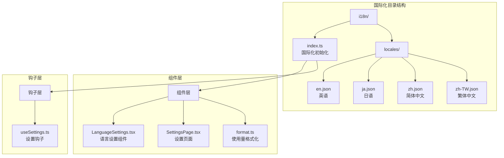
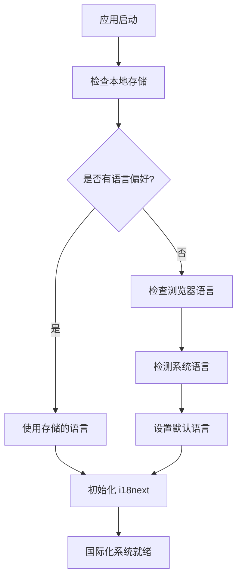
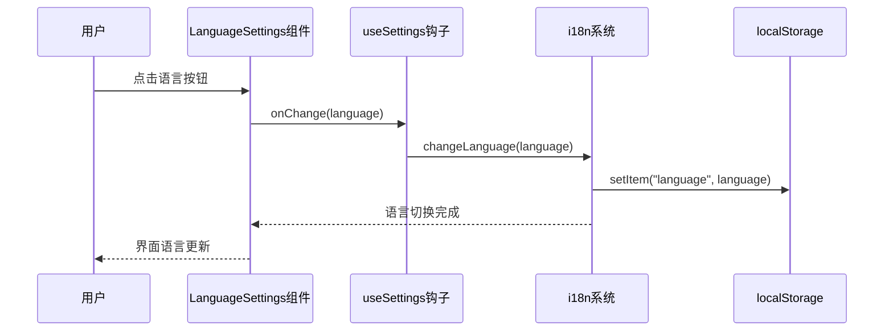
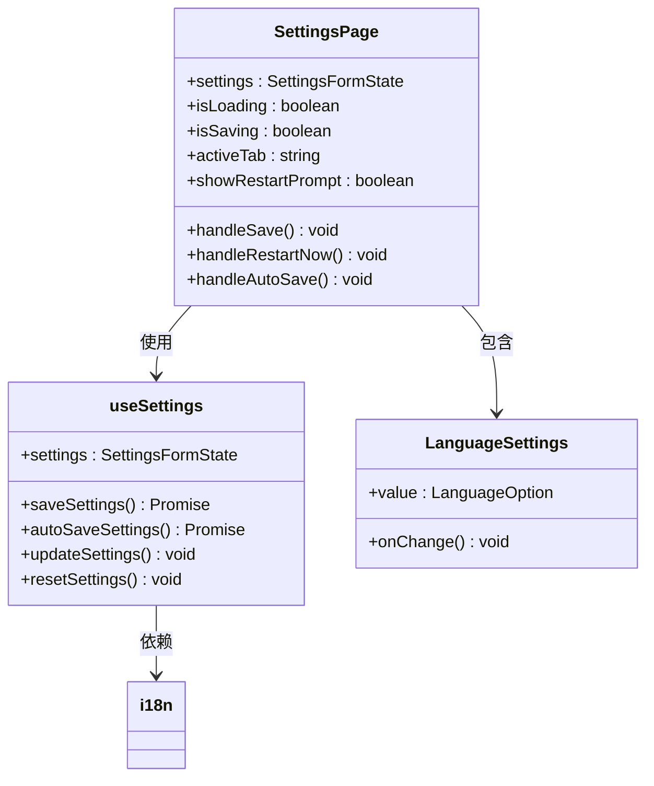
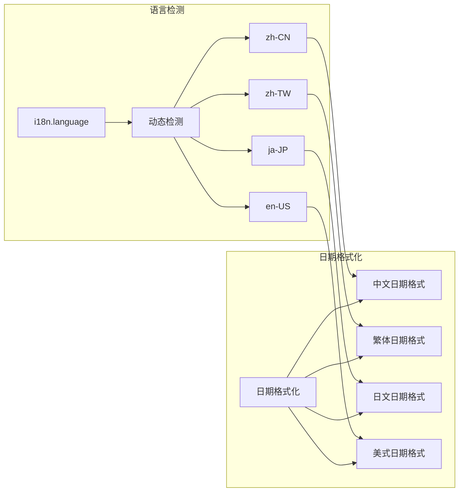
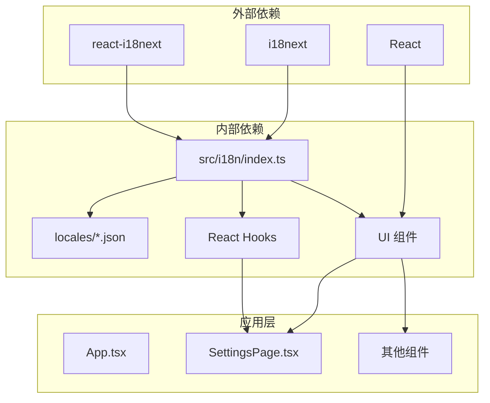

# 国际化工作流程

<cite>
**本文档引用的文件**
- [src/i18n/index.ts](file://src/i18n/index.ts)
- [src/i18n/locales/en.json](file://src/i18n/locales/en.json)
- [src/i18n/locales/ja.json](file://src/i18n/locales/ja.json)
- [src/i18n/locales/zh.json](file://src/i18n/locales/zh.json)
- [src/i18n/locales/zh-TW.json](file://src/i18n/locales/zh-TW.json)
- [src/components/settings/LanguageSettings.tsx](file://src/components/settings/LanguageSettings.tsx)
- [src/components/settings/SettingsPage.tsx](file://src/components/settings/SettingsPage.tsx)
- [src/hooks/useSettings.ts](file://src/hooks/useSettings.ts)
- [src/components/usage/format.ts](file://src/components/usage/format.ts)
- [src/components/usage/RequestDetailPanel.tsx](file://src/components/usage/RequestDetailPanel.tsx)
</cite>

## 目录
1. [简介](#简介)
2. [项目结构](#项目结构)
3. [核心组件](#核心组件)
4. [架构概览](#架构概览)
5. [详细组件分析](#详细组件分析)
6. [依赖关系分析](#依赖关系分析)
7. [性能考虑](#性能考虑)
8. [故障排除指南](#故障排除指南)
9. [结论](#结论)

## 简介

CC Switch 项目采用 i18next 国际化框架实现了多语言支持，目前支持四种语言：简体中文、繁体中文、英语和日语。本文档详细说明了国际化工作流程，包括 i18next 的使用方式、t() 函数的应用、用户界面文本的国际化处理流程，以及翻译文件的组织结构和维护要求。

## 项目结构

国际化相关的文件主要位于 `src/i18n/` 目录下，采用按语言分文件的组织方式：



**图表来源**
- [src/i18n/index.ts:1-93](file://src/i18n/index.ts#L1-L93)
- [src/i18n/locales/en.json:1-800](file://src/i18n/locales/en.json#L1-L800)
- [src/i18n/locales/ja.json:1-800](file://src/i18n/locales/ja.json#L1-L800)
- [src/i18n/locales/zh.json:1-800](file://src/i18n/locales/zh.json#L1-L800)
- [src/i18n/locales/zh-TW.json:1-200](file://src/i18n/locales/zh-TW.json#L1-L200)

**章节来源**
- [src/i18n/index.ts:1-93](file://src/i18n/index.ts#L1-L93)
- [src/i18n/locales/en.json:1-800](file://src/i18n/locales/en.json#L1-L800)
- [src/i18n/locales/ja.json:1-800](file://src/i18n/locales/ja.json#L1-L800)
- [src/i18n/locales/zh.json:1-800](file://src/i18n/locales/zh.json#L1-L800)
- [src/i18n/locales/zh-TW.json:1-200](file://src/i18n/locales/zh-TW.json#L1-L200)

## 核心组件

### 国际化初始化配置

国际化系统的核心配置位于 `src/i18n/index.ts` 文件中，负责：

1. **语言资源加载**：导入四种语言的翻译文件
2. **语言检测机制**：实现智能的语言选择逻辑
3. **i18next 初始化**：配置国际化框架的基本参数



**图表来源**
- [src/i18n/index.ts:13-62](file://src/i18n/index.ts#L13-L62)

### 翻译文件组织结构

每个语言的翻译文件都采用相同的 JSON 结构，包含以下主要分类：

| 分类 | 用途 | 示例键值 |
|------|------|----------|
| `app` | 应用基本信息 | `"title"`、`"description"` |
| `common` | 通用文本 | `"add"`、`"edit"`、`"save"` |
| `settings` | 设置相关文本 | `"language"`、`"theme"` |
| `provider` | 供应商相关文本 | `"tabProvider"`、`"addProvider"` |
| `notifications` | 通知消息 | `"settingsSaved"`、`"providerAdded"` |
| `confirm` | 确认对话框 | `"deleteProvider"`、`"removeProvider"` |

**章节来源**
- [src/i18n/index.ts:64-77](file://src/i18n/index.ts#L64-L77)
- [src/i18n/locales/en.json:1-800](file://src/i18n/locales/en.json#L1-L800)
- [src/i18n/locales/zh.json:1-800](file://src/i18n/locales/zh.json#L1-L800)
- [src/i18n/locales/ja.json:1-800](file://src/i18n/locales/ja.json#L1-L800)
- [src/i18n/locales/zh-TW.json:1-200](file://src/i18n/locales/zh-TW.json#L1-L200)

## 架构概览

CC Switch 的国际化架构采用分层设计，确保了良好的可维护性和扩展性：

```mermaid
graph TB
subgraph "表现层"
UI[UI 组件]
UI --> T_FUNC[t() 函数]
UI --> I18N_OBJ[i18n 对象]
end
subgraph "业务逻辑层"
HOOKS[React Hooks]
HOOKS --> USE_TRANSLATION[useTranslation()]
HOOKS --> USE_SETTINGS[useSettings]
end
subgraph "国际化核心层"
I18NEXT[i18next 核心]
I18NEXT --> INIT_REACT_I18NEXT[initReactI18next]
I18NEXT --> RESOURCES[资源管理]
end
subgraph "数据层"
LOCAL_STORAGE[localStorage]
LOCAL_STORAGE --> LANGUAGE_PREF[语言偏好]
TRANSLATION_FILES[翻译文件]
end
UI --> HOOKS
HOOKS --> I18NEXT
I18NEXT --> TRANSLATION_FILES
I18NEXT --> LOCAL_STORAGE
```

**图表来源**
- [src/i18n/index.ts:1-93](file://src/i18n/index.ts#L1-L93)
- [src/hooks/useSettings.ts:62-512](file://src/hooks/useSettings.ts#L62-L512)

## 详细组件分析

### 语言设置组件

语言设置组件 `LanguageSettings.tsx` 实现了用户界面的语言切换功能：



**图表来源**
- [src/components/settings/LanguageSettings.tsx:12-42](file://src/components/settings/LanguageSettings.tsx#L12-L42)
- [src/hooks/useSettings.ts:309-484](file://src/hooks/useSettings.ts#L309-L484)

### 设置页面集成

设置页面 `SettingsPage.tsx` 集成了完整的国际化功能：



**图表来源**
- [src/components/settings/SettingsPage.tsx:61-200](file://src/components/settings/SettingsPage.tsx#L61-L200)
- [src/hooks/useSettings.ts:62-512](file://src/hooks/useSettings.ts#L62-L512)

**章节来源**
- [src/components/settings/LanguageSettings.tsx:1-68](file://src/components/settings/LanguageSettings.tsx#L1-L68)
- [src/components/settings/SettingsPage.tsx:1-200](file://src/components/settings/SettingsPage.tsx#L1-L200)
- [src/hooks/useSettings.ts:62-512](file://src/hooks/useSettings.ts#L62-L512)

### 使用量格式化国际化

使用量格式化模块 `format.ts` 展示了国际化在数据展示中的应用：

| 语言 | 数字格式化 | 特殊处理 |
|------|------------|----------|
| 中文 | `12,345` | 万/亿单位 |
| 日文 | `12,345` | 万/亿单位 |
| 英文 | `12,345` | K/M/B 单位 |
| 繁体中文 | `12,345` | 萬/億单位 |

**章节来源**
- [src/components/usage/format.ts:1-97](file://src/components/usage/format.ts#L1-L97)

### 请求详情面板国际化

请求详情面板 `RequestDetailPanel.tsx` 展示了动态语言切换的应用：



**图表来源**
- [src/components/usage/RequestDetailPanel.tsx:20-30](file://src/components/usage/RequestDetailPanel.tsx#L20-L30)

**章节来源**
- [src/components/usage/RequestDetailPanel.tsx:1-54](file://src/components/usage/RequestDetailPanel.tsx#L1-L54)

## 依赖关系分析

国际化系统的依赖关系呈现清晰的层次结构：



**图表来源**
- [src/i18n/index.ts:1-93](file://src/i18n/index.ts#L1-L93)

**章节来源**
- [src/i18n/index.ts:1-93](file://src/i18n/index.ts#L1-L93)

## 性能考虑

国际化系统在性能方面采用了多项优化措施：

1. **懒加载翻译文件**：按需加载特定语言的翻译内容
2. **缓存机制**：利用浏览器缓存减少重复加载
3. **增量更新**：只更新受影响的组件而非整个应用
4. **内存优化**：合理管理翻译资源的生命周期

## 故障排除指南

### 常见问题及解决方案

| 问题类型 | 症状 | 解决方案 |
|----------|------|----------|
| 语言切换无效 | 界面语言未更新 | 检查 localStorage 中的 "language" 键值 |
| 翻译缺失 | 显示键名而非翻译内容 | 验证翻译文件中是否存在对应键 |
| 语言检测错误 | 自动选择错误的语言 | 检查浏览器语言设置和系统语言配置 |
| 性能问题 | 页面加载缓慢 | 检查翻译文件大小和网络状况 |

### 调试技巧

1. **启用调试模式**：在开发环境中启用 i18next 调试输出
2. **检查控制台**：观察语言切换过程中的日志信息
3. **验证资源加载**：确认翻译文件正确加载到内存中
4. **测试边界情况**：验证各种语言环境下的显示效果

**章节来源**
- [src/i18n/index.ts:88-90](file://src/i18n/index.ts#L88-L90)

## 结论

CC Switch 的国际化工作流程展现了现代前端应用的国际化最佳实践。通过采用 i18next 框架、合理的文件组织结构、以及完善的组件集成，系统实现了：

1. **完整的多语言支持**：支持简体中文、繁体中文、英语和日语
2. **智能语言检测**：基于用户偏好和系统语言自动选择
3. **灵活的组件集成**：通过 t() 函数和 useTranslation 钩子实现无缝集成
4. **良好的可维护性**：清晰的文件结构和标准化的工作流程

该国际化体系为用户提供了优质的多语言体验，同时也为未来的功能扩展和维护奠定了坚实的基础。