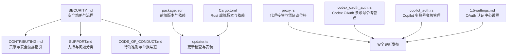
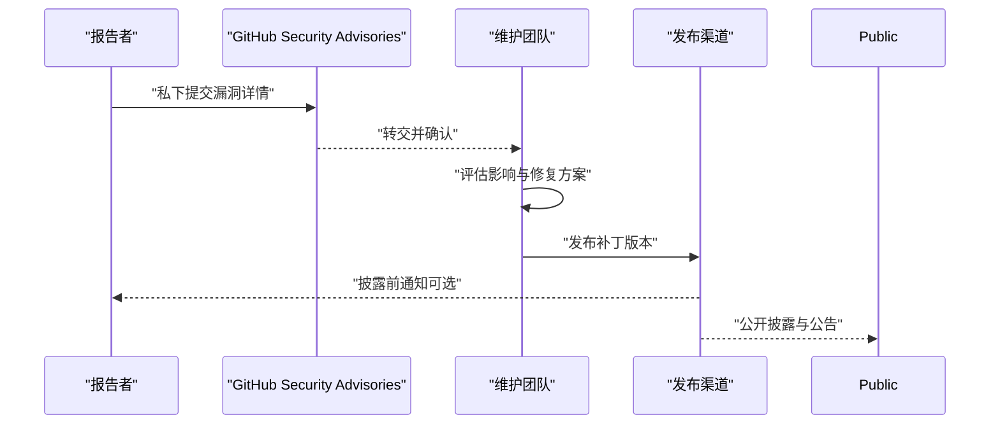
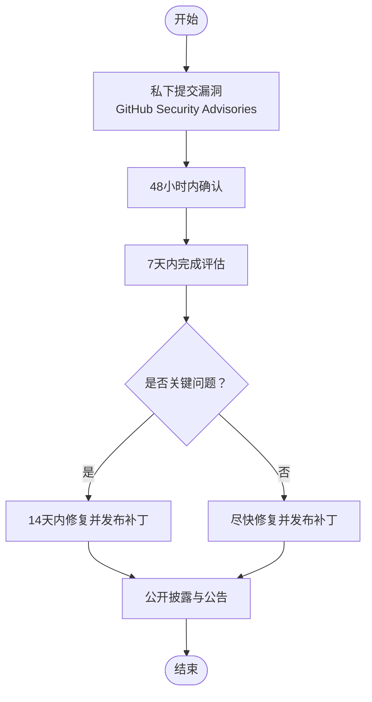
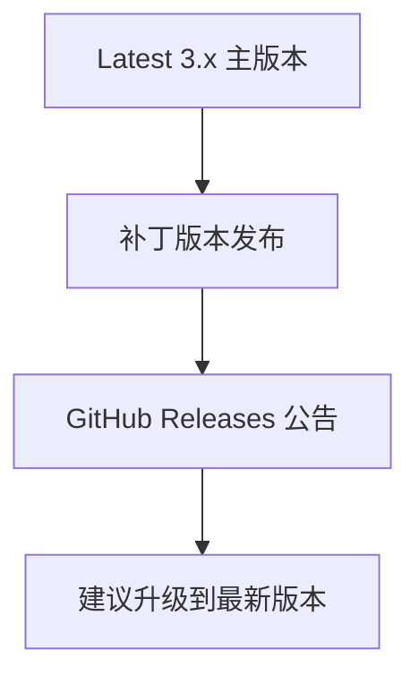
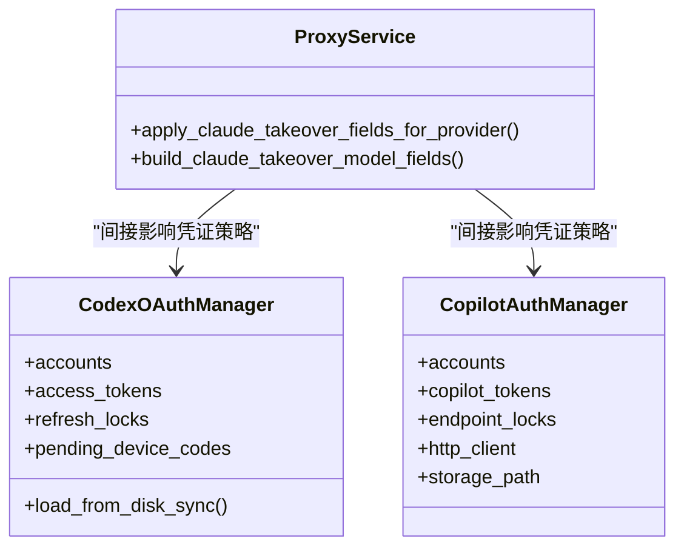
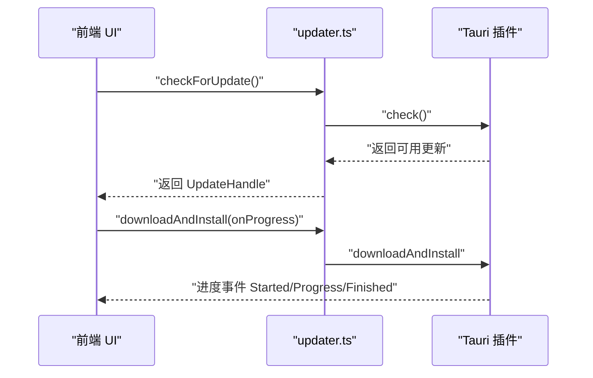
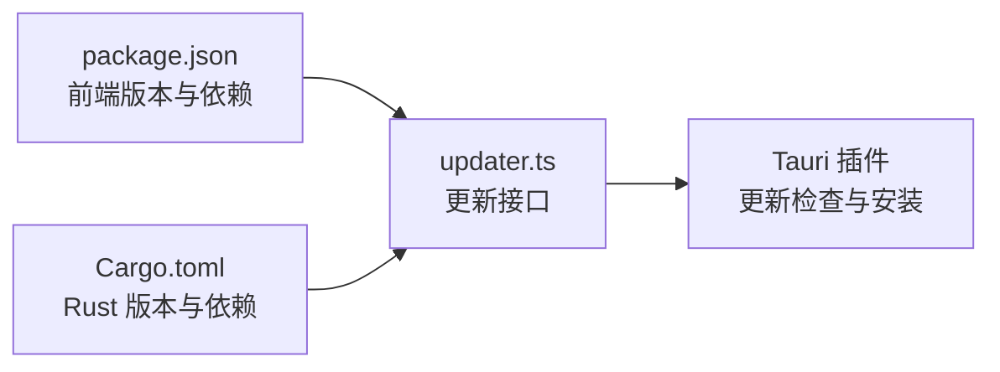

# 安全政策

<cite>
**本文引用的文件**
- [SECURITY.md](file://SECURITY.md)
- [CONTRIBUTING.md](file://CONTRIBUTING.md)
- [SUPPORT.md](file://SUPPORT.md)
- [CODE_OF_CONDUCT.md](file://CODE_OF_CONDUCT.md)
- [package.json](file://package.json)
- [Cargo.toml](file://src-tauri/Cargo.toml)
- [updater.ts](file://src/lib/updater.ts)
- [proxy.rs](file://src-tauri/src/services/proxy.rs)
- [codex_oauth_auth.rs](file://src-tauri/src/proxy/providers/codex_oauth_auth.rs)
- [copilot_auth.rs](file://src-tauri/src/proxy/providers/copilot_auth.rs)
- [1.5-settings.md](file://docs/user-manual/en/1-getting-started/1.5-settings.md)
- [v3.16.1-en.md](file://docs/release-notes/v3.16.1-en.md)
- [v3.16.2-en.md](file://docs/release-notes/v3.16.2-en.md)
- [v3.12.1-en.md](file://docs/release-notes/v3.12.1-en.md)
- [v3.11.0-en.md](file://docs/release-notes/v3.11.0-en.md)
</cite>

## 目录
1. [简介](#简介)
2. [项目结构](#项目结构)
3. [核心组件](#核心组件)
4. [架构总览](#架构总览)
5. [详细组件分析](#详细组件分析)
6. [依赖关系分析](#依赖关系分析)
7. [性能考虑](#性能考虑)
8. [故障排查指南](#故障排查指南)
9. [结论](#结论)
10. [附录](#附录)

## 简介
本安全政策文档面向 CC Switch 用户与贡献者，系统阐述安全漏洞的报告流程、处理机制、优先级与时限、修复与发布策略、版本管理原则，以及开发者与使用者的安全最佳实践与责任边界。项目当前采用“仅对最新主版本发布安全更新”的策略，并通过 GitHub Security Advisories 接收安全问题，遵循协调披露流程。

## 项目结构
围绕安全相关的关键文件与职责分布如下：
- 安全策略与流程：SECURITY.md
- 贡献与安全披露指引：CONTRIBUTING.md
- 支持与问题分类：SUPPORT.md
- 社区行为准则与举报渠道：CODE_OF_CONDUCT.md
- 应用版本与更新机制：package.json（前端）、Cargo.toml（Rust 后端）、updater.ts（更新逻辑）
- 安全相关实现与风险控制：proxy.rs（代理接管与凭证占位符）、codex_oauth_auth.rs（Codex OAuth 多账号令牌管理）、copilot_auth.rs（Copilot 多账号令牌管理）
- 用户手册与设置页：1.5-settings.md（含 OAuth 认证中心）

图示来源
- [SECURITY.md:1-59](file://SECURITY.md#L1-L59)
- [CONTRIBUTING.md:17](file://CONTRIBUTING.md#L17)
- [SUPPORT.md:23](file://SUPPORT.md#L23)
- [CODE_OF_CONDUCT.md:41](file://CODE_OF_CONDUCT.md#L41)
- [package.json:1-96](file://package.json#L1-L96)
- [Cargo.toml:1-110](file://src-tauri/Cargo.toml#L1-L110)
- [updater.ts:1-127](file://src/lib/updater.ts#L1-L127)
- [proxy.rs:166-193](file://src-tauri/src/services/proxy.rs#L166-L193)
- [codex_oauth_auth.rs:222-256](file://src-tauri/src/proxy/providers/codex_oauth_auth.rs#L222-L256)
- [copilot_auth.rs:411-440](file://src-tauri/src/proxy/providers/copilot_auth.rs#L411-L440)
- [1.5-settings.md:277-296](file://docs/user-manual/en/1-getting-started/1.5-settings.md#L277-L296)

章节来源
- [SECURITY.md:1-59](file://SECURITY.md#L1-L59)
- [CONTRIBUTING.md:17](file://CONTRIBUTING.md#L17)
- [SUPPORT.md:23](file://SUPPORT.md#L23)
- [CODE_OF_CONDUCT.md:41](file://CODE_OF_CONDUCT.md#L41)
- [package.json:1-96](file://package.json#L1-L96)
- [Cargo.toml:1-110](file://src-tauri/Cargo.toml#L1-L110)
- [updater.ts:1-127](file://src/lib/updater.ts#L1-L127)

## 核心组件
- 安全策略与支持范围
  - 仅对最新主版本（Latest 3.x）提供安全更新。
  - 旧版本不再接收安全修复。
- 漏洞报告渠道
  - 严禁通过公开 Issue 报告安全漏洞。
  - 正确渠道：GitHub Security Advisories。
  - 报告需包含：漏洞描述、复现步骤、潜在影响、受影响版本。
- 响应时间线
  - 确认：48 小时内
  - 初步评估：7 天内
  - 关键问题修复：14 天内
- 协调披露流程
  - 私下提交 → 确认与修复 → 发布补丁版本 → 公开披露
  - 报告者可选择署名或匿名
- 安全更新发布
  - 通过补丁版本发布，公告渠道：GitHub Releases
  - 强烈建议始终升级到最新版本

章节来源
- [SECURITY.md:3-59](file://SECURITY.md#L3-L59)

## 架构总览
下图展示从“发现安全问题”到“修复与发布”的端到端流程，映射到实际仓库中的策略与实现：

图示来源
- [SECURITY.md:14-59](file://SECURITY.md#L14-L59)

## 详细组件分析

### 漏洞报告与处理流程
- 报告入口与规范
  - 严禁公开 Issue；必须通过 GitHub Security Advisories。
  - 报告内容需包含：漏洞描述、复现步骤、潜在影响、受影响版本。
- 响应与评估
  - 48 小时内确认；7 天内完成初步评估；关键问题 14 天内修复。
- 协调披露
  - 私下 → 修复 → 补丁发布 → 公开披露；可署名或匿名。
- 更新发布
  - 通过补丁版本与 GitHub Releases 公告；建议立即升级。

图示来源
- [SECURITY.md:14-59](file://SECURITY.md#L14-L59)

章节来源
- [SECURITY.md:14-59](file://SECURITY.md#L14-L59)

### 安全更新与版本管理
- 版本支持范围
  - 仅 Latest 3.x 主版本获得安全更新；低于 3.0 的版本不再支持。
- 发布节奏与渠道
  - 安全修复以补丁版本形式发布，通过 GitHub Releases 公告。
  - 建议始终升级到最新版本以获得最新安全修复。
- 实际发布记录参考
  - v3.16.1：Codex 稳定性补丁，强化路由接管所有权检查与 live 文件一致性。
  - v3.16.2：扩展数据可移植性与用量可观测性，继续加固 Codex Chat Completions 路由。
  - v3.12.1：稳定性修复与 i18n 修复，增强 OpenClaw authHeader 支持。
  - v3.11.0：引入 OpenClaw 支持、会话管理器与备份管理等重大更新。

图示来源
- [SECURITY.md:54-59](file://SECURITY.md#L54-L59)
- [v3.16.1-en.md:38-49](file://docs/release-notes/v3.16.1-en.md#L38-L49)
- [v3.16.2-en.md:1-14](file://docs/release-notes/v3.16.2-en.md#L1-L14)
- [v3.12.1-en.md:1-37](file://docs/release-notes/v3.12.1-en.md#L1-L37)
- [v3.11.0-en.md:1-33](file://docs/release-notes/v3.11.0-en.md#L1-L33)

章节来源
- [SECURITY.md:54-59](file://SECURITY.md#L54-L59)
- [v3.16.1-en.md:38-49](file://docs/release-notes/v3.16.1-en.md#L38-L49)
- [v3.16.2-en.md:1-14](file://docs/release-notes/v3.16.2-en.md#L1-L14)
- [v3.12.1-en.md:1-37](file://docs/release-notes/v3.12.1-en.md#L1-L37)
- [v3.11.0-en.md:1-33](file://docs/release-notes/v3.11.0-en.md#L1-L33)

### 安全实现要点与最佳实践
- 代理接管与凭证占位符
  - 代理接管场景下，使用占位符保护真实凭证，避免泄露与覆盖。
  - 管理型账户策略与现有账户策略分别处理，确保接管后不会误用 OAuth 登录语义。
- OAuth 多账号令牌管理
  - Codex OAuth 与 Copilot 均采用多账号模型，支持设备码登录流程与令牌缓存。
  - 通过并发刷新锁避免重复调用上游 API，提升稳定性与安全性。
- 设置与日志
  - OAuth 认证中心（Beta）集中管理第三方 OAuth 凭证，注意风险提示。
  - 日志级别可按需调整，生产环境建议使用 info 或更高级别。

图示来源
- [proxy.rs:166-193](file://src-tauri/src/services/proxy.rs#L166-L193)
- [codex_oauth_auth.rs:222-256](file://src-tauri/src/proxy/providers/codex_oauth_auth.rs#L222-L256)
- [copilot_auth.rs:411-440](file://src-tauri/src/proxy/providers/copilot_auth.rs#L411-L440)

章节来源
- [proxy.rs:166-193](file://src-tauri/src/services/proxy.rs#L166-L193)
- [codex_oauth_auth.rs:222-256](file://src-tauri/src/proxy/providers/codex_oauth_auth.rs#L222-L256)
- [copilot_auth.rs:411-440](file://src-tauri/src/proxy/providers/copilot_auth.rs#L411-L440)
- [1.5-settings.md:277-296](file://docs/user-manual/en/1-getting-started/1.5-settings.md#L277-L296)

### 更新检查与安装（开发者视角）
- 前端更新接口
  - 提供检查更新、下载与安装回调，支持进度事件映射。
  - 支持通道选择（稳定/测试）与超时控制。
- 后端与插件
  - Rust 侧使用 Tauri 插件进行更新检查与安装。
  - 建议在生产环境中启用安全传输与完整性校验（由插件与底层库保障）。

图示来源
- [updater.ts:93-127](file://src/lib/updater.ts#L93-L127)
- [package.json:1-96](file://package.json#L1-L96)
- [Cargo.toml:1-110](file://src-tauri/Cargo.toml#L1-L110)

章节来源
- [updater.ts:93-127](file://src/lib/updater.ts#L93-L127)
- [package.json:1-96](file://package.json#L1-L96)
- [Cargo.toml:1-110](file://src-tauri/Cargo.toml#L1-L110)

## 依赖关系分析
- 版本与更新
  - 前端版本与依赖由 package.json 管理；Rust 后端版本与依赖由 Cargo.toml 管理。
  - 更新检查与安装由 Tauri 插件驱动，确保跨平台一致性。
- 安全相关依赖
  - 后端使用 rustls、webpki 等现代 TLS 实现，提升网络通信安全性。
  - 日志与调试级别可控，便于在生产环境降低敏感信息暴露风险。

图示来源
- [package.json:1-96](file://package.json#L1-L96)
- [Cargo.toml:1-110](file://src-tauri/Cargo.toml#L1-L110)
- [updater.ts:1-127](file://src/lib/updater.ts#L1-L127)

章节来源
- [package.json:1-96](file://package.json#L1-L96)
- [Cargo.toml:1-110](file://src-tauri/Cargo.toml#L1-L110)
- [updater.ts:1-127](file://src/lib/updater.ts#L1-L127)

## 性能考虑
- 更新检查与安装
  - 建议在弱网环境下设置合理超时，避免长时间阻塞 UI。
  - 下载与安装阶段建议提供进度反馈，提升用户体验。
- 日志级别
  - 生产环境建议使用 info 或更高级别，避免 trace 导致磁盘与性能压力。
- 令牌管理
  - 并发刷新锁与内存缓存可减少上游 API 调用频率，提高稳定性与安全性。

## 故障排查指南
- 无法通过公开 Issue 报告安全问题
  - 请改用 GitHub Security Advisories；公开 Issue 不处理安全问题。
- 更新检查失败或无可用更新
  - 检查网络与超时设置；确认当前版本是否为最新；必要时手动检查 GitHub Releases。
- OAuth 登录或令牌异常
  - 使用 OAuth 认证中心（Beta）查看账户状态与默认账户；注意设备码流程与风险提示。
- 代理接管导致凭证覆盖
  - 确认接管策略与占位符生效；避免在接管期间直接修改 live 文件。

章节来源
- [SUPPORT.md:23](file://SUPPORT.md#L23)
- [SECURITY.md:14-59](file://SECURITY.md#L14-L59)
- [1.5-settings.md:277-296](file://docs/user-manual/en/1-getting-started/1.5-settings.md#L277-L296)
- [proxy.rs:166-193](file://src-tauri/src/services/proxy.rs#L166-L193)

## 结论
CC Switch 的安全策略以“仅支持最新主版本、私下报告、协调披露、快速修复与公告”为核心，结合代理接管凭证保护、OAuth 多账号令牌管理与可控日志级别等实现，为用户提供稳定与安全的使用体验。建议用户始终升级到最新版本，并通过正确渠道报告安全问题，共同维护生态安全。

## 附录
- 常见问题
  - Q：如何报告安全漏洞？
    - A：请勿通过公开 Issue；使用 GitHub Security Advisories 私下提交。
  - Q：多久能收到响应？
    - A：确认 48 小时内；初步评估 7 天内；关键问题 14 天内修复。
  - Q：安全修复如何发布？
    - A：以补丁版本发布并通过 GitHub Releases 公告；建议立即升级。
  - Q：旧版本还能得到修复吗？
    - A：仅 Latest 3.x 主版本支持；低于 3.0 的版本不再支持。
  - Q：如何查看与管理 OAuth 凭证？
    - A：使用设置页中的 OAuth 认证中心（Beta），注意风险提示。

章节来源
- [SECURITY.md:14-59](file://SECURITY.md#L14-L59)
- [SUPPORT.md:23](file://SUPPORT.md#L23)
- [1.5-settings.md:277-296](file://docs/user-manual/en/1-getting-started/1.5-settings.md#L277-L296)