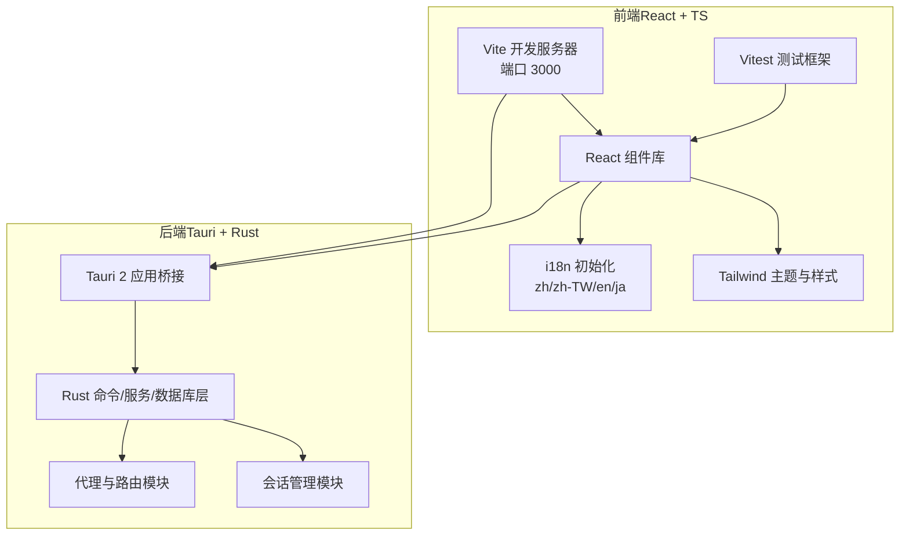
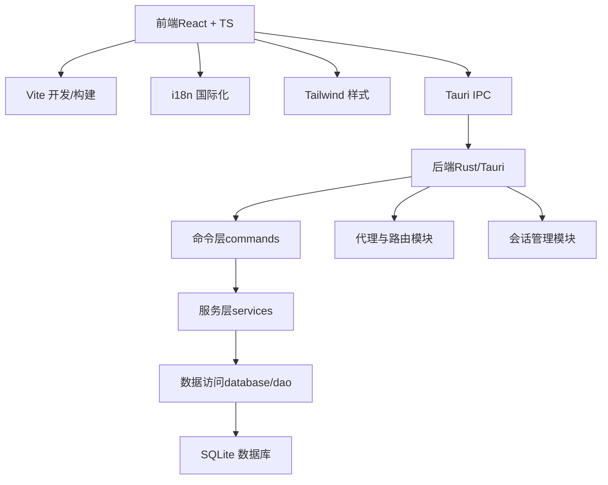
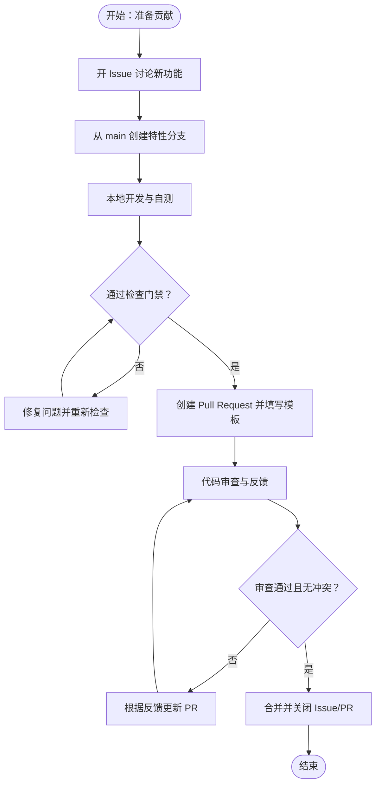
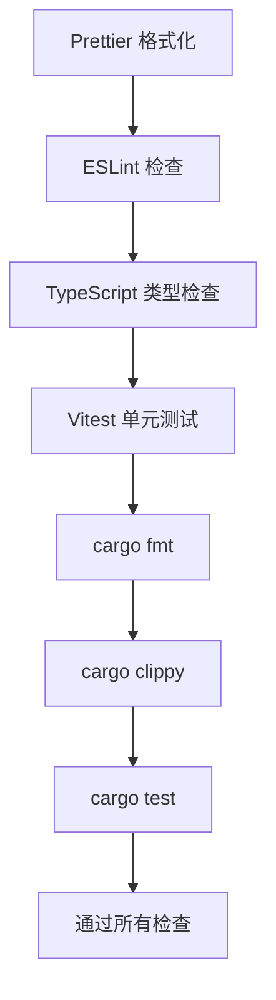
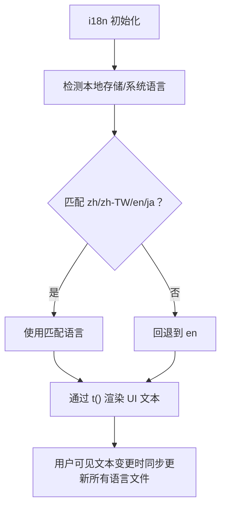
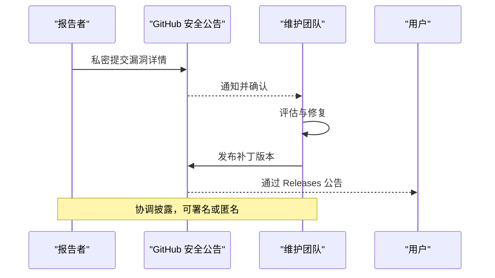
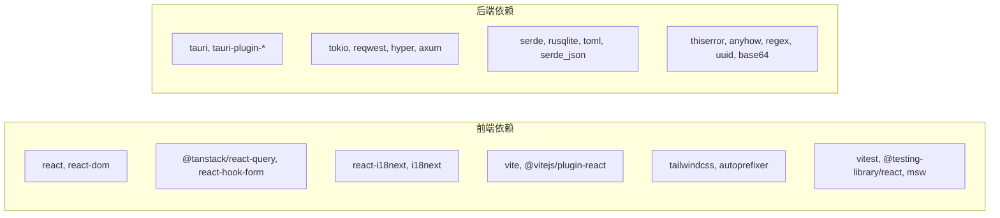

# 开发流程

<cite>
**本文引用的文件**
- [CONTRIBUTING.md](file://CONTRIBUTING.md)
- [SECURITY.md](file://SECURITY.md)
- [CODE_OF_CONDUCT.md](file://CODE_OF_CONDUCT.md)
- [README.md](file://README.md)
- [package.json](file://package.json)
- [tsconfig.json](file://tsconfig.json)
- [tsconfig.node.json](file://tsconfig.node.json)
- [vite.config.ts](file://vite.config.ts)
- [vitest.config.ts](file://vitest.config.ts)
- [tailwind.config.cjs](file://tailwind.config.cjs)
- [postcss.config.cjs](file://postcss.config.cjs)
- [src/i18n/index.ts](file://src/i18n/index.ts)
- [src/i18n/locales/en.json](file://src/i18n/locales/en.json)
- [src-tauri/Cargo.toml](file://src-tauri/Cargo.toml)
</cite>

## 目录
1. [简介](#简介)
2. [项目结构](#项目结构)
3. [核心组件](#核心组件)
4. [架构总览](#架构总览)
5. [详细组件分析](#详细组件分析)
6. [依赖分析](#依赖分析)
7. [性能考虑](#性能考虑)
8. [故障排查指南](#故障排查指南)
9. [结论](#结论)
10. [附录](#附录)

## 简介
本指南面向 CC Switch 项目的贡献者与维护者，系统阐述从问题报告、功能建议、文档改进到代码贡献的全流程；详述 Pull Request 的完整生命周期；统一前端（Prettier、ESLint、TypeScript）与后端（cargo fmt、cargo clippy）的代码规范与检查流程；明确提交信息规范（Conventional Commits）与命名约定；给出代码审查流程与质量保障措施；说明国际化（i18n）处理流程与多语言支持要求；并提供安全漏洞报告与处理流程。

## 项目结构
- 前端采用 React + TypeScript + Vite + TailwindCSS，使用 Vitest + MSW 进行单元测试与 API Mock。
- 后端基于 Tauri 2 + Rust，模块化组织命令层、服务层、DAO 层与代理/会话管理等子域。
- 国际化通过 i18next 实现，支持 zh、zh-TW、en、ja 四种语言。
- 构建与脚本集中在根目录 package.json，Rust 侧在 src-tauri/Cargo.toml。

图表来源
- [vite.config.ts:1-33](file://vite.config.ts#L1-L33)
- [tailwind.config.cjs:1-174](file://tailwind.config.cjs#L1-L174)
- [src/i18n/index.ts:1-93](file://src/i18n/index.ts#L1-L93)
- [src-tauri/Cargo.toml:1-110](file://src-tauri/Cargo.toml#L1-L110)

章节来源
- [README.md:480-518](file://README.md#L480-L518)
- [package.json:1-96](file://package.json#L1-L96)
- [tsconfig.json:1-26](file://tsconfig.json#L1-L26)
- [tsconfig.node.json:1-21](file://tsconfig.node.json#L1-L21)
- [vitest.config.ts:1-21](file://vitest.config.ts#L1-L21)
- [tailwind.config.cjs:1-174](file://tailwind.config.cjs#L1-L174)
- [postcss.config.cjs:1-8](file://postcss.config.cjs#L1-L8)
- [src/i18n/index.ts:1-93](file://src/i18n/index.ts#L1-L93)
- [src-tauri/Cargo.toml:1-110](file://src-tauri/Cargo.toml#L1-L110)

## 核心组件
- 贡献入口与流程
  - 问题报告、功能建议、文档改进、代码贡献、翻译贡献均在贡献指南中明确路径与模板。
  - 安全漏洞严禁通过公开 Issue 报告，需走安全公告通道。
- 开发环境与常用命令
  - 前端：dev、build、typecheck、lint、format、format:check、test:unit、test:unit:watch。
  - 后端：cargo fmt、cargo clippy、cargo test。
- 代码风格与检查
  - 前端：Prettier 格式化、ESLint 检查、严格 TypeScript（noUnusedLocals/Parameters 等）。
  - 后端：cargo fmt、cargo clippy。
  - Tauri 命令命名：camelCase。
- 提交信息规范
  - Conventional Commits，示例涵盖 feat、fix、docs、ci、chore 等类型。
- 国际化（i18n）
  - 支持 zh、zh-TW、en、ja；UI 文本统一通过 i18next 的 t() 函数渲染；用户可见文本必须在所有语言文件中同步更新。
- 行为准则与安全策略
  - 遵循贡献者公约；安全问题按策略处理并遵循协调披露流程。

章节来源
- [CONTRIBUTING.md:7-126](file://CONTRIBUTING.md#L7-L126)
- [CONTRIBUTING.md:186-254](file://CONTRIBUTING.md#L186-L254)
- [SECURITY.md:1-59](file://SECURITY.md#L1-L59)
- [CODE_OF_CONDUCT.md:1-176](file://CODE_OF_CONDUCT.md#L1-L176)
- [README.md:386-477](file://README.md#L386-L477)

## 架构总览
前端通过 Vite 提供开发服务器与构建能力，React 组件通过 i18n 渲染多语言内容，Tailwind 提供主题与样式；前端通过 Tauri IPC 与 Rust 后端交互。后端以命令层（commands）为入口，服务层（services）承载业务逻辑，DAO 层访问 SQLite 数据库，代理与会话管理模块分别负责网络路由与历史会话。

图表来源
- [vite.config.ts:1-33](file://vite.config.ts#L1-L33)
- [tailwind.config.cjs:1-174](file://tailwind.config.cjs#L1-L174)
- [src/i18n/index.ts:1-93](file://src/i18n/index.ts#L1-L93)
- [src-tauri/Cargo.toml:1-110](file://src-tauri/Cargo.toml#L1-L110)

章节来源
- [README.md:344-384](file://README.md#L344-L384)

## 详细组件分析

### 贡献流程与 PR 规范
- 事前沟通：新功能优先开 Issue 讨论，避免方向不符的 PR 被关闭。
- 分支策略：从 main 分支创建特性分支（如 feat/my-feature 或 fix/issue-123），保持 PR 聚焦单一功能。
- PR 模板：填写摘要、关联 Issue、检查清单。
- 质量门禁：提交前确保通过前端类型检查、格式检查、单元测试；若涉及 Rust 修改，还需通过 cargo clippy。
- 国际化：若修改用户可见文本，需同步更新所有语言文件。

图表来源
- [CONTRIBUTING.md:71-110](file://CONTRIBUTING.md#L71-L110)
- [CONTRIBUTING.md:199-238](file://CONTRIBUTING.md#L199-L238)

章节来源
- [CONTRIBUTING.md:71-110](file://CONTRIBUTING.md#L71-L110)
- [CONTRIBUTING.md:199-238](file://CONTRIBUTING.md#L199-L238)

### 代码规范与检查流程
- 前端
  - 格式化：Prettier，提供 format 与 format:check 脚本。
  - 类型检查：TypeScript 严格模式（noUnusedLocals/Parameters 等）。
  - 测试：Vitest + jsdom 环境，支持覆盖率输出。
  - 构建：Vite，开发服务器端口 3000，输出目录 dist。
  - 样式：TailwindCSS + Autoprefixer。
- 后端
  - 格式化：cargo fmt。
  - 代码检查：cargo clippy。
  - 测试：cargo test，支持特性开关（如 test-hooks）。
- 命名约定
  - Tauri 命令名使用 camelCase。
- 提交信息
  - Conventional Commits，示例类型包括 feat、fix、docs、ci、chore 等。

图表来源
- [package.json:6-16](file://package.json#L6-L16)
- [tsconfig.json:12-22](file://tsconfig.json#L12-L22)
- [vitest.config.ts:12-19](file://vitest.config.ts#L12-L19)
- [vite.config.ts:6-31](file://vite.config.ts#L6-L31)
- [tailwind.config.cjs:1-174](file://tailwind.config.cjs#L1-L174)
- [postcss.config.cjs:1-8](file://postcss.config.cjs#L1-L8)
- [src-tauri/Cargo.toml:18-21](file://src-tauri/Cargo.toml#L18-L21)

章节来源
- [CONTRIBUTING.md:58-70](file://CONTRIBUTING.md#L58-L70)
- [CONTRIBUTING.md:186-198](file://CONTRIBUTING.md#L186-L198)
- [README.md:408-446](file://README.md#L408-L446)

### 国际化（i18n）处理流程
- 支持语言：zh、zh-TW、en、ja。
- 默认语言与回退：根据本地存储或系统语言选择初始语言，回退至 en。
- 更新策略：用户界面文本统一通过 i18next 的 t() 函数渲染；任何用户可见文本变更需同步更新所有语言文件。
- 初始化：i18n 在应用启动时初始化，设置资源、语言与调试选项。

图表来源
- [src/i18n/index.ts:1-93](file://src/i18n/index.ts#L1-L93)
- [src/i18n/locales/en.json:1-800](file://src/i18n/locales/en.json#L1-L800)

章节来源
- [CONTRIBUTING.md:111-121](file://CONTRIBUTING.md#L111-L121)
- [src/i18n/index.ts:1-93](file://src/i18n/index.ts#L1-L93)

### 安全漏洞报告与处理流程
- 报告渠道：严禁通过公开 Issue 报告；应使用 GitHub Security Advisories 私密提交。
- 支持版本：仅最新 3.x 版本获得安全更新。
- 响应时间：确认（48 小时内）、初步评估（7 天内）、关键问题修复（14 天内）。
- 披露流程：协调披露，先修复再公开；报告者可在发布说明中署名（可匿名）。
- 更新发布：通过 GitHub Releases 通知，建议始终升级到最新版本。

图表来源
- [SECURITY.md:14-59](file://SECURITY.md#L14-L59)

章节来源
- [SECURITY.md:1-59](file://SECURITY.md#L1-L59)

### 代码审查流程与质量保证
- 审查要点
  - 功能正确性与边界处理。
  - 代码可读性与一致性（命名、结构、注释）。
  - 性能与安全性（避免敏感信息泄露、输入校验、并发安全）。
  - 国际化覆盖（用户可见文本在所有语言文件中存在）。
  - 测试覆盖与稳定性（新增/修改逻辑配套单元测试）。
- 质量门禁
  - 前端：typecheck、format:check、test:unit。
  - 后端：cargo fmt --check、cargo clippy、cargo test。
- 审查反馈处理
  - 逐条响应与修正，必要时补充测试或文档。
  - 保持 PR 聚焦，避免引入无关变更。

章节来源
- [CONTRIBUTING.md:78-84](file://CONTRIBUTING.md#L78-L84)
- [CONTRIBUTING.md:206-212](file://CONTRIBUTING.md#L206-L212)
- [README.md:520-531](file://README.md#L520-L531)

### 提交信息规范（Conventional Commits）
- 结构：type(scope): subject
- 示例类型：feat、fix、docs、ci、chore 等。
- 建议：在 PR 描述中引用相关 Issue 编号，便于追踪。

章节来源
- [CONTRIBUTING.md:85-96](file://CONTRIBUTING.md#L85-L96)
- [CONTRIBUTING.md:213-223](file://CONTRIBUTING.md#L213-L223)

### AI 辅助贡献注意事项
- 责任归属：AI 仅作为辅助工具，最终责任在贡献者本人。
- 自查与测试：必须能解释并验证每行代码；PR 必须小而聚焦；建议先开 Issue 讨论。
- 维护者裁量权：未经充分审查或上下文不清的大规模改动可能被直接关闭。

章节来源
- [CONTRIBUTING.md:97-110](file://CONTRIBUTING.md#L97-L110)
- [CONTRIBUTING.md:225-238](file://CONTRIBUTING.md#L225-L238)

## 依赖分析
- 前端依赖
  - React 生态：react、react-dom、react-hook-form、@tanstack/react-query、react-i18next 等。
  - 构建与样式：vite、@vitejs/plugin-react、tailwindcss、autoprefixer。
  - 测试：vitest、@testing-library/react、msw。
- 后端依赖
  - Tauri 2 与插件：tauri、tauri-plugin-xxx 系列。
  - 网络与并发：tokio、reqwest、hyper、axum。
  - 数据与序列化：serde、rusqlite、toml、serde_json。
  - 其他：thiserror、anyhow、regex、uuid、base64 等。

图表来源
- [package.json:42-94](file://package.json#L42-L94)
- [src-tauri/Cargo.toml:25-83](file://src-tauri/Cargo.toml#L25-L83)

章节来源
- [package.json:1-96](file://package.json#L1-L96)
- [src-tauri/Cargo.toml:1-110](file://src-tauri/Cargo.toml#L1-L110)

## 性能考虑
- 前端
  - 严格 TypeScript 选项减少运行时错误与冗余计算。
  - Tailwind 动态类名与构建优化，避免未使用样式进入产物。
  - Vite 开发服务器启用代码检查插件，提升开发体验。
- 后端
  - 通过 LTO、strip、panic=unwind 等编译配置优化二进制体积与回溯能力。
  - 并发模型采用 tokio，合理拆分任务与连接池，避免阻塞。
- 国际化
  - 仅加载当前语言资源，避免一次性加载全部语言包造成内存压力。

章节来源
- [tsconfig.json:12-22](file://tsconfig.json#L12-L22)
- [tailwind.config.cjs:1-174](file://tailwind.config.cjs#L1-L174)
- [src-tauri/Cargo.toml:98-106](file://src-tauri/Cargo.toml#L98-L106)
- [src/i18n/index.ts:64-90](file://src/i18n/index.ts#L64-L90)

## 故障排查指南
- 常见问题定位
  - 前端：TypeScript 报错优先解决；格式检查失败先运行 format 再 format:check；单元测试失败查看 Vitest 输出与覆盖率报告。
  - 后端：cargo fmt --check 与 cargo clippy 通常能发现潜在问题；测试失败时结合日志与断点定位。
- 环境与依赖
  - 确认 Node.js 与 pnpm 版本满足要求；Rust 与 Tauri 前置条件齐全。
- 国际化问题
  - 用户可见文本缺失或不一致时，检查对应语言文件是否同步更新。
- 安全问题
  - 严禁通过公开 Issue 报告；按安全策略通过安全公告通道提交。

章节来源
- [CONTRIBUTING.md:19-57](file://CONTRIBUTING.md#L19-L57)
- [SECURITY.md:14-59](file://SECURITY.md#L14-L59)

## 结论
本指南提供了 CC Switch 从问题报告、功能建议、文档改进到代码贡献的完整流程，明确了 PR 的生命周期与质量门禁，统一了前后端代码规范与检查流程，规范了提交信息与命名约定，给出了国际化与安全漏洞处理策略。遵循上述流程与规范，有助于提升协作效率与代码质量，保障项目长期健康发展。

## 附录
- 开发命令速查
  - 前端：dev、build、typecheck、lint、format、format:check、test:unit、test:unit:watch。
  - 后端：cargo fmt、cargo clippy、cargo test。
- 关键配置参考
  - TypeScript 严格模式与路径别名：[tsconfig.json:1-26](file://tsconfig.json#L1-L26)
  - Vite 开发服务器与构建：[vite.config.ts:1-33](file://vite.config.ts#L1-L33)
  - Vitest 测试环境与覆盖率：[vitest.config.ts:1-21](file://vitest.config.ts#L1-L21)
  - Tailwind 主题与动画：[tailwind.config.cjs:1-174](file://tailwind.config.cjs#L1-L174)
  - PostCSS 插件链：[postcss.config.cjs:1-8](file://postcss.config.cjs#L1-L8)
  - Rust 依赖与特性：[src-tauri/Cargo.toml:1-110](file://src-tauri/Cargo.toml#L1-L110)