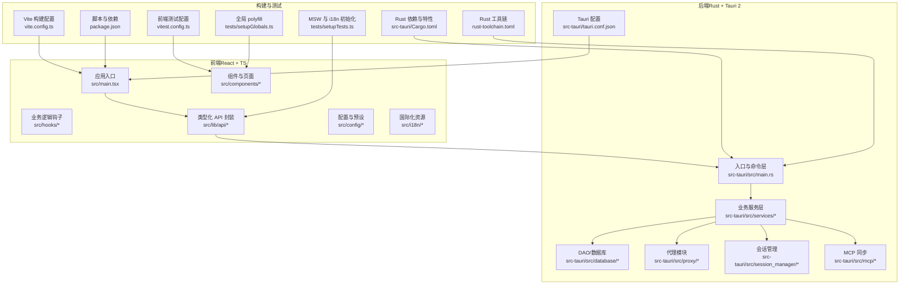
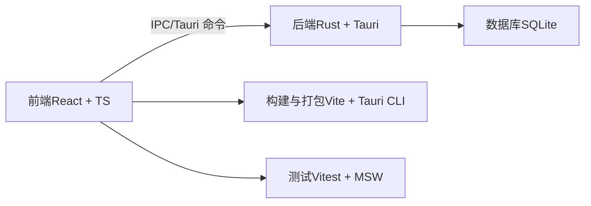
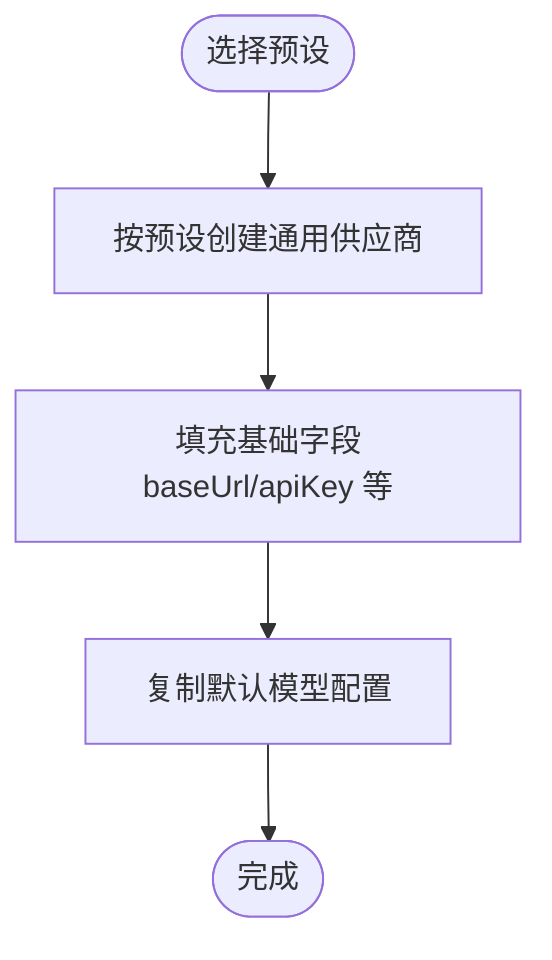
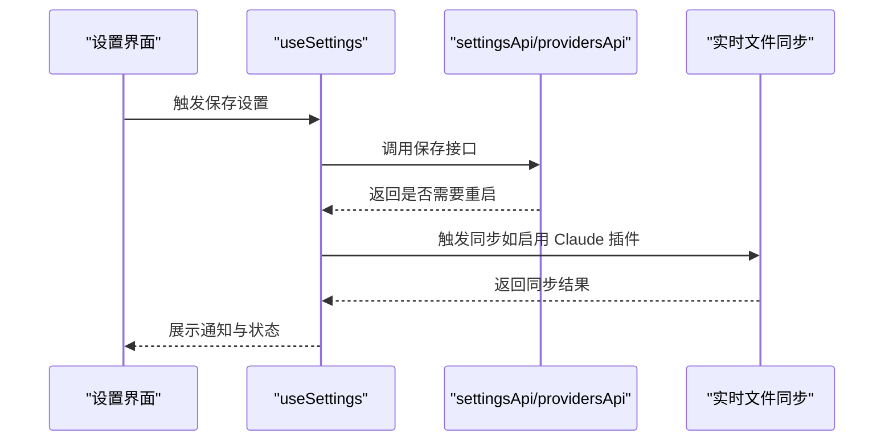
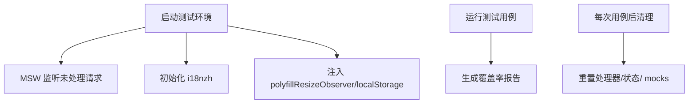
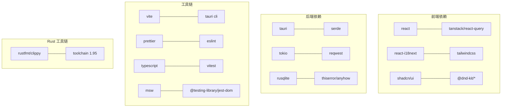

# 贡献指南

<cite>
**本文引用的文件**
- [CONTRIBUTING.md](file://CONTRIBUTING.md)
- [README.md](file://README.md)
- [package.json](file://package.json)
- [Cargo.toml（后端）](file://src-tauri/Cargo.toml)
- [rust-toolchain.toml](file://rust-toolchain.toml)
- [vite.config.ts](file://vite.config.ts)
- [vitest.config.ts](file://vitest.config.ts)
- [src/i18n/index.ts](file://src/i18n/index.ts)
- [src/config/universalProviderPresets.ts](file://src/config/universalProviderPresets.ts)
- [src/lib/api/index.ts](file://src/lib/api/index.ts)
- [src-tauri/tauri.conf.json](file://src-tauri/tauri.conf.json)
- [tests/setupTests.ts](file://tests/setupTests.ts)
- [tests/setupGlobals.ts](file://tests/setupGlobals.ts)
</cite>

## 目录
1. [简介](#简介)
2. [项目结构](#项目结构)
3. [核心贡献方式](#核心贡献方式)
4. [架构总览](#架构总览)
5. [详细组件与流程分析](#详细组件与流程分析)
6. [依赖关系分析](#依赖关系分析)
7. [性能与质量保障](#性能与质量保障)
8. [故障排查指南](#故障排查指南)
9. [结语](#结语)
10. [附录](#附录)

## 简介
本指南面向希望参与 CC Switch 项目的各类贡献者，覆盖从环境搭建、开发命令、代码风格与提交规范，到多语言翻译、文档改进、Bug 报告与功能建议等多条路径。无论你是前端/后端开发者、文档作者、翻译志愿者，还是测试与质量保障人员，都能在此找到清晰的入门与进阶指引。

## 项目结构
CC Switch 采用“前端（React + TypeScript）+ 后端（Rust + Tauri 2）”的桌面应用架构，前后端通过 IPC 通信；测试体系包含前端 Vitest + MSW，以及后端 Rust 测试与集成测试。

图表来源
- [vite.config.ts:1-33](file://vite.config.ts#L1-L33)
- [package.json:1-96](file://package.json#L1-L96)
- [vitest.config.ts:1-21](file://vitest.config.ts#L1-L21)
- [tests/setupTests.ts:1-35](file://tests/setupTests.ts#L1-L35)
- [tests/setupGlobals.ts:1-36](file://tests/setupGlobals.ts#L1-L36)
- [src-tauri/Cargo.toml:1-110](file://src-tauri/Cargo.toml#L1-L110)
- [rust-toolchain.toml:1-5](file://rust-toolchain.toml#L1-L5)
- [src-tauri/tauri.conf.json:1-70](file://src-tauri/tauri.conf.json#L1-L70)

章节来源
- [README.md:386-518](file://README.md#L386-L518)

## 核心贡献方式
- 报告 Bug：通过 GitHub Issues 的模板提交，确保包含复现步骤、期望结果与实际结果。
- 功能建议：先开 Issue 讨论，确认与项目方向契合后再进行实现。
- 改进文档：修复错别字、补充缺失信息、优化用户手册与指南。
- 代码贡献：通过 Pull Request 提交，遵循 PR 模板与检查清单。
- 翻译工作：同步更新三套语言资源，使用 i18n 的 t() 函数，避免硬编码。

章节来源
- [CONTRIBUTING.md:9-17](file://CONTRIBUTING.md#L9-L17)
- [CONTRIBUTING.md:135-145](file://CONTRIBUTING.md#L135-L145)

## 架构总览
- 前端：React 18 + TypeScript + Vite + TailwindCSS + TanStack Query + i18n
- 后端：Tauri 2 + Rust（serde、tokio、thiserror、rusqlite 等）
- 测试：Vitest + MSW + @testing-library/react
- 构建：Vite 前端 + Tauri CLI + Cargo

图表来源
- [README.md:469-476](file://README.md#L469-L476)
- [src-tauri/Cargo.toml:25-83](file://src-tauri/Cargo.toml#L25-L83)

章节来源
- [README.md:344-384](file://README.md#L344-L384)

## 详细组件与流程分析

### 开发环境搭建与常用命令
- 前端
  - 安装依赖：pnpm install
  - 开发模式（热重载）：pnpm dev
  - 类型检查：pnpm typecheck
  - 代码格式化：pnpm format / pnpm format:check
  - 单元测试：pnpm test:unit / pnpm test:unit:watch
  - 生产构建：pnpm build
- 后端（Rust）
  - 格式化：cargo fmt
  - Lint：cargo clippy
  - 测试：cargo test（支持特性开关）
- Tauri 配置
  - 前端开发地址与构建命令在 Tauri 配置中声明，确保 dev 与 build 正常联动

章节来源
- [CONTRIBUTING.md:27-57](file://CONTRIBUTING.md#L27-L57)
- [README.md:396-446](file://README.md#L396-L446)
- [package.json:6-17](file://package.json#L6-L17)
- [src-tauri/tauri.conf.json:6-11](file://src-tauri/tauri.conf.json#L6-L11)

### 代码风格与提交规范
- 前端：Prettier + ESLint + 严格 TypeScript（pnpm typecheck）
- 后端：cargo fmt + cargo clippy
- Tauri 2：命令名使用 camelCase
- 提交信息：Conventional Commits（feat/fix/docs/chore）

章节来源
- [CONTRIBUTING.md:58-96](file://CONTRIBUTING.md#L58-L96)
- [CONTRIBUTING.md:213-223](file://CONTRIBUTING.md#L213-L223)

### 国际化（i18n）与翻译
- 多语言支持：zh、zh-TW、en、ja
- 更新范围：所有用户可见文本需同步更新三套语言文件
- 使用方式：统一通过 react-i18next 的 t() 函数渲染
- 初始化逻辑：根据本地存储或系统语言选择初始语言，开发模式可开启调试

章节来源
- [CONTRIBUTING.md:111-121](file://CONTRIBUTING.md#L111-L121)
- [src/i18n/index.ts:1-93](file://src/i18n/index.ts#L1-L93)

### 统一供应商（Universal Provider）预设
- 作用：跨应用共享配置（Claude、Codex、Gemini），减少重复配置
- 结构：包含名称、类型、默认应用、默认模型、图标与描述等字段
- 工具函数：按预设创建实例、查找预设、获取显示名

图表来源
- [src/config/universalProviderPresets.ts:61-116](file://src/config/universalProviderPresets.ts#L61-L116)

章节来源
- [src/config/universalProviderPresets.ts:1-133](file://src/config/universalProviderPresets.ts#L1-L133)

### 设置与目录管理（Settings 与目录解析）
- 职责划分：组合 useSettingsForm、useDirectorySettings、useSettingsMetadata
- 关键能力：保存设置、目录浏览/重置、便携模式与重启提示
- 同步逻辑：切换 Claude 插件时同步当前 Provider 到各应用的“实时文件”

图表来源
- [src/hooks/useSettings.ts:62-177](file://src/hooks/useSettings.ts#L62-L177)
- [src/lib/api/index.ts:1-31](file://src/lib/api/index.ts#L1-L31)

章节来源
- [src/hooks/useSettings.ts:1-200](file://src/hooks/useSettings.ts#L1-L200)
- [src/lib/api/index.ts:1-31](file://src/lib/api/index.ts#L1-L31)

### 测试体系与初始化
- 前端测试：Vitest + MSW 模拟 Tauri API，@testing-library/react 渲染与断言
- 初始化：setupTests.ts 中启动 MSW、初始化 i18n；setupGlobals.ts 注入 ResizeObserver 与 localStorage polyfill
- 运行：pnpm test:unit / pnpm test:unit:watch；支持覆盖率输出

图表来源
- [tests/setupTests.ts:10-34](file://tests/setupTests.ts#L10-L34)
- [tests/setupGlobals.ts:1-36](file://tests/setupGlobals.ts#L1-36)
- [vitest.config.ts:12-19](file://vitest.config.ts#L12-L19)

章节来源
- [tests/setupTests.ts:1-35](file://tests/setupTests.ts#L1-L35)
- [tests/setupGlobals.ts:1-36](file://tests/setupGlobals.ts#L1-L36)
- [vitest.config.ts:1-21](file://vitest.config.ts#L1-L21)

### 提交与审查流程（PR 指南）
- PR 前置：先开 Issue 讨论；Fork 并基于 main 分支创建功能分支
- 内容聚焦：每个 PR 解决一个问题或一个功能点
- 检查清单：类型检查、格式检查、Rust Lint（如涉及）、更新国际化
- 提交信息：Conventional Commits 规范

章节来源
- [CONTRIBUTING.md:71-96](file://CONTRIBUTING.md#L71-L96)
- [CONTRIBUTING.md:206-212](file://CONTRIBUTING.md#L206-L212)

### AI 辅助贡献注意事项
- 责任主体：AI 仅作为辅助工具，最终责任在贡献者本人
- 要求：必须能解释并验证每行代码；PR 必须小而聚焦；先开 Issue 讨论；维护者可直接关闭不符合规范的 PR

章节来源
- [CONTRIBUTING.md:97-109](file://CONTRIBUTING.md#L97-L109)
- [CONTRIBUTING.md:225-237](file://CONTRIBUTING.md#L225-L237)

## 依赖关系分析
- 前端依赖：React、TanStack Query、i18next、TailwindCSS、shadcn/ui、@dnd-kit 等
- 后端依赖：tauri、serde、tokio、reqwest、rusqlite、thiserror、anyhow 等
- 构建与工具：Vite、Tauri CLI、Prettier、ESLint、TypeScript、Vitest、MSW
- Rust 工具链：rustfmt、clippy，指定 channel 与 profile

图表来源
- [package.json:42-94](file://package.json#L42-L94)
- [src-tauri/Cargo.toml:25-83](file://src-tauri/Cargo.toml#L25-L83)
- [rust-toolchain.toml:1-5](file://rust-toolchain.toml#L1-L5)

章节来源
- [package.json:1-96](file://package.json#L1-L96)
- [src-tauri/Cargo.toml:1-110](file://src-tauri/Cargo.toml#L1-L110)
- [rust-toolchain.toml:1-5](file://rust-toolchain.toml#L1-L5)

## 性能与质量保障
- 前端
  - 类型安全：严格 TypeScript（pnpm typecheck）
  - 代码风格：Prettier + ESLint
  - 测试覆盖率：Vitest 集成 LCOV 报告
- 后端
  - 格式与 Lint：cargo fmt + cargo clippy
  - 性能优化：release profile 启用 LTO、strip、符号裁剪
- 数据一致性
  - SQLite 存储 + 原子写入（临时文件 + 重命名）防止配置损坏
  - 并发安全：Mutex 保护数据库连接
- 代理与路由
  - 本地代理、健康监控、熔断器、自动故障转移、格式转换与响应处理

章节来源
- [CONTRIBUTING.md:64-69](file://CONTRIBUTING.md#L64-L69)
- [README.md:366-384](file://README.md#L366-L384)
- [src-tauri/Cargo.toml:98-106](file://src-tauri/Cargo.toml#L98-L106)

## 故障排查指南
- 环境问题
  - Node.js 与 pnpm 版本不满足：参考“开发环境搭建”
  - Rust 工具链版本不符：使用 rust-toolchain.toml 指定的 channel
- 构建问题
  - 前端构建失败：检查 Vite 配置与 Tauri 配置中的 devUrl/build 命令
  - 后端编译失败：确认 Cargo.toml 依赖与特性开关
- 测试问题
  - ResizeObserver 缺失：确保 tests/setupGlobals.ts 已加载
  - i18n 未初始化：确认 tests/setupTests.ts 中 i18n 初始化
  - MSW 未监听：确认 beforeAll 中 server.listen 已执行
- 国际化问题
  - 新增文案未生效：检查是否更新三套语言文件并使用 t() 渲染
- 提交与 CI
  - 类型/格式/Lint 失败：在本地运行相应检查并通过后再提交
  - PR 被拒：对照 PR 检查清单逐项核对

章节来源
- [tests/setupTests.ts:10-34](file://tests/setupTests.ts#L10-L34)
- [tests/setupGlobals.ts:1-36](file://tests/setupGlobals.ts#L1-L36)
- [vite.config.ts:1-33](file://vite.config.ts#L1-L33)
- [src-tauri/tauri.conf.json:6-11](file://src-tauri/tauri.conf.json#L6-L11)
- [rust-toolchain.toml:1-5](file://rust-toolchain.toml#L1-L5)
- [CONTRIBUTING.md:206-212](file://CONTRIBUTING.md#L206-L212)

## 结语
感谢你对 CC Switch 的关注与贡献。请优先通过 Issue 讨论需求与设计，再以小而聚焦的 PR 提交变更；同时保持高质量的测试与文档，共同维护项目的长期健康发展。

## 附录

### 常用命令速查
- 前端
  - 开发：pnpm dev
  - 构建：pnpm build
  - 类型检查：pnpm typecheck
  - 单测：pnpm test:unit / pnpm test:unit:watch
  - 格式化：pnpm format / pnpm format:check
- 后端（Rust）
  - 格式化：cargo fmt
  - Lint：cargo clippy
  - 测试：cargo test（可加特性）
- Tauri
  - 前端开发服务器：pnpm dev:renderer
  - 生产构建：pnpm build（调用 tauri build）

章节来源
- [CONTRIBUTING.md:37-57](file://CONTRIBUTING.md#L37-L57)
- [README.md:396-446](file://README.md#L396-L446)
- [package.json:6-17](file://package.json#L6-L17)