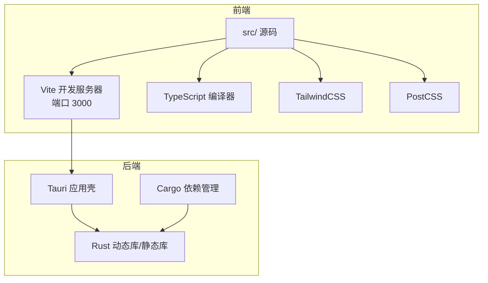
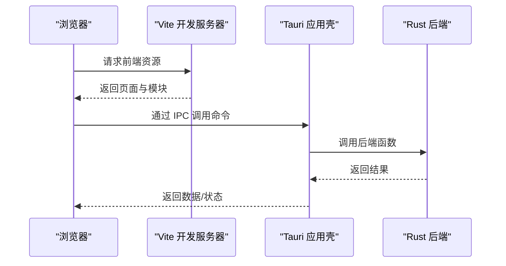
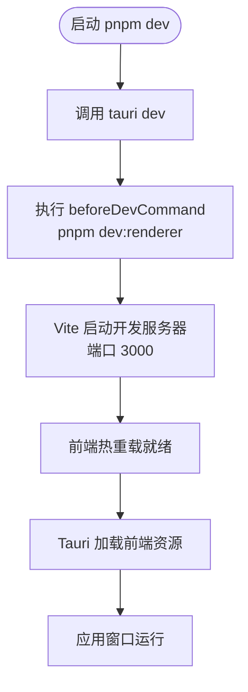
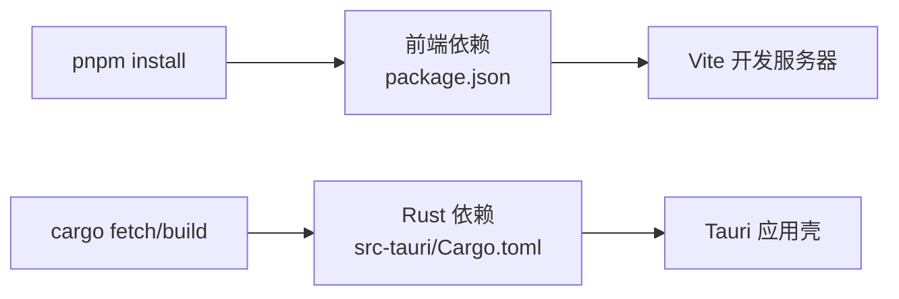

# 开发环境搭建

<cite>
**本文引用的文件**
- [package.json](file://package.json)
- [src-tauri/Cargo.toml](file://src-tauri/Cargo.toml)
- [rust-toolchain.toml](file://rust-toolchain.toml)
- [vite.config.ts](file://vite.config.ts)
- [src-tauri/tauri.conf.json](file://src-tauri/tauri.conf.json)
- [tsconfig.json](file://tsconfig.json)
- [tsconfig.node.json](file://tsconfig.node.json)
- [tailwind.config.cjs](file://tailwind.config.cjs)
- [postcss.config.cjs](file://postcss.config.cjs)
- [pnpm-workspace.yaml](file://pnpm-workspace.yaml)
- [CONTRIBUTING.md](file://CONTRIBUTING.md)
</cite>

## 目录
1. [简介](#简介)
2. [项目结构](#项目结构)
3. [核心组件](#核心组件)
4. [架构总览](#架构总览)
5. [详细组件分析](#详细组件分析)
6. [依赖分析](#依赖分析)
7. [性能考虑](#性能考虑)
8. [故障排查指南](#故障排查指南)
9. [结论](#结论)
10. [附录](#附录)

## 简介
本指南面向希望在本地搭建 CC Switch 开发环境的开发者，覆盖前置条件、安装步骤、依赖安装、开发服务器启动、热重载配置、常用开发命令、最佳实践与常见问题解决。项目采用 Tauri 2.0 + React/Vite 前端 + Rust 后端的混合架构，开发体验通过 Vite 热重载与 Tauri Dev 模式实现一体化联调。

## 项目结构
- 前端位于根目录的 src/，使用 Vite 作为构建与开发服务器，TypeScript 严格模式，TailwindCSS + PostCSS。
- 后端位于 src-tauri/，使用 Cargo 管理 Rust 依赖，Tauri 2.0 提供桌面应用能力与系统集成。
- 顶层配置文件定义了开发脚本、TypeScript 编译选项、Vite 与 Tailwind 的构建行为。

图表来源
- [vite.config.ts:1-33](file://vite.config.ts#L1-L33)
- [src-tauri/tauri.conf.json:1-70](file://src-tauri/tauri.conf.json#L1-L70)
- [tsconfig.json:1-26](file://tsconfig.json#L1-L26)
- [tailwind.config.cjs:1-174](file://tailwind.config.cjs#L1-L174)
- [postcss.config.cjs:1-8](file://postcss.config.cjs#L1-L8)
- [src-tauri/Cargo.toml:1-110](file://src-tauri/Cargo.toml#L1-L110)

章节来源
- [package.json:1-96](file://package.json#L1-L96)
- [vite.config.ts:1-33](file://vite.config.ts#L1-L33)
- [src-tauri/tauri.conf.json:1-70](file://src-tauri/tauri.conf.json#L1-L70)
- [tsconfig.json:1-26](file://tsconfig.json#L1-L26)
- [tailwind.config.cjs:1-174](file://tailwind.config.cjs#L1-L174)
- [postcss.config.cjs:1-8](file://postcss.config.cjs#L1-L8)
- [src-tauri/Cargo.toml:1-110](file://src-tauri/Cargo.toml#L1-L110)

## 核心组件
- 前端开发服务器：Vite 在本地启动，监听 3000 端口，支持热重载与代码检查。
- Tauri 应用壳：通过 Tauri CLI 启动，加载前端构建产物并在窗口中运行。
- Rust 后端：提供系统级能力、网络代理、数据库、插件等，编译为动态库供前端调用。
- 构建与打包：前端构建输出 dist/，Tauri 读取该目录；后端通过 Cargo 管理依赖与特性。

章节来源
- [package.json:6-17](file://package.json#L6-L17)
- [vite.config.ts:20-23](file://vite.config.ts#L20-L23)
- [src-tauri/tauri.conf.json:6-11](file://src-tauri/tauri.conf.json#L6-L11)
- [src-tauri/Cargo.toml:13-16](file://src-tauri/Cargo.toml#L13-L16)

## 架构总览
下图展示了开发时的请求链路：浏览器访问 Vite 开发服务器，Tauri 应用通过 IPC 与 Rust 后端交互，最终渲染到桌面窗口。

图表来源
- [src-tauri/tauri.conf.json:8-9](file://src-tauri/tauri.conf.json#L8-L9)
- [package.json:7](file://package.json#L7)

章节来源
- [src-tauri/tauri.conf.json:1-70](file://src-tauri/tauri.conf.json#L1-L70)
- [package.json:1-96](file://package.json#L1-L96)

## 详细组件分析

### 前端开发服务器与热重载
- Vite 配置
  - 根目录与输出：root 指向 src，构建输出 dist，严格端口绑定，开启本地调试插件。
  - 服务器：默认端口 3000，严格端口，便于 Tauri DevUrl 对齐。
  - 别名：@ 指向 src，提升导入便捷性。
  - 环境变量前缀：VITE_ 与 TAURI_。
- Tauri Dev 集成
  - devUrl 指向 http://localhost:3000，beforeDevCommand 调用 pnpm dev:renderer，实现前后端联调。
- 热重载机制
  - Vite HMR 与 Tauri Dev 模式结合，修改前端代码自动刷新。

图表来源
- [src-tauri/tauri.conf.json:8-10](file://src-tauri/tauri.conf.json#L8-L10)
- [vite.config.ts:20-23](file://vite.config.ts#L20-L23)
- [package.json:7-11](file://package.json#L7-L11)

章节来源
- [vite.config.ts:1-33](file://vite.config.ts#L1-L33)
- [src-tauri/tauri.conf.json:1-70](file://src-tauri/tauri.conf.json#L1-L70)
- [package.json:1-96](file://package.json#L1-L96)

### TypeScript 与样式工具链
- TypeScript
  - 严格模式、路径别名、ESNext 模块解析、隔离模块、无 emit。
- TailwindCSS 与 PostCSS
  - Tailwind 内容扫描 src 下模板与组件，PostCSS 自动添加厂商前缀。
- 代码风格
  - 前端使用 Prettier 与 ESLint（通过工程脚本），严格 TypeScript 类型检查。

章节来源
- [tsconfig.json:1-26](file://tsconfig.json#L1-L26)
- [tsconfig.node.json:1-21](file://tsconfig.node.json#L1-L21)
- [tailwind.config.cjs:1-174](file://tailwind.config.cjs#L1-L174)
- [postcss.config.cjs:1-8](file://postcss.config.cjs#L1-L8)
- [package.json:12-16](file://package.json#L12-L16)

### Rust 后端与 Cargo
- 工具链与版本
  - Rust 最低版本要求 1.85，工具链通道 1.95，包含 rustfmt 与 clippy。
- 依赖与特性
  - Tauri 2.0 生态插件（日志、进程、对话框、存储、更新、深链、窗口状态等）。
  - 网络与并发（reqwest、tokio、hyper、axum）、数据库（rusqlite）、序列化（serde、toml）、加密（sha2、hmac）等。
- 平台依赖
  - Linux：webkit2gtk。
  - Windows：winreg、windows-sys。
  - macOS：objc2、objc2-app-kit。
- 构建优化
  - Release 配置启用 LTO、符号剥离与 panic unwind，减小二进制体积。

章节来源
- [src-tauri/Cargo.toml:1-110](file://src-tauri/Cargo.toml#L1-L110)
- [rust-toolchain.toml:1-5](file://rust-toolchain.toml#L1-L5)

## 依赖分析
- 前端依赖安装
  - 使用 pnpm 8+，执行 pnpm install 安装 package.json 中的依赖与开发依赖。
- 后端依赖安装
  - 进入 src-tauri，执行 cargo fetch 或直接构建以拉取 Cargo.toml 中的依赖。
- 工作空间与构建约束
  - pnpm-workspace.yaml 指定仅构建 @tailwindcss/oxide，避免不必要的包解析。

图表来源
- [package.json:1-96](file://package.json#L1-L96)
- [src-tauri/Cargo.toml:1-110](file://src-tauri/Cargo.toml#L1-L110)
- [pnpm-workspace.yaml:1-5](file://pnpm-workspace.yaml#L1-L5)

章节来源
- [package.json:1-96](file://package.json#L1-L96)
- [src-tauri/Cargo.toml:1-110](file://src-tauri/Cargo.toml#L1-L110)
- [pnpm-workspace.yaml:1-5](file://pnpm-workspace.yaml#L1-L5)

## 性能考虑
- 前端
  - 使用 Vite 的按需模块与 HMR，减少冷启动与热更新开销。
  - Tailwind 按需扫描内容，避免无用 CSS。
- 后端
  - Release 配置启用 LTO 与符号剥离，减小二进制体积，利于分发。
- 开发体验
  - 严格端口与基础路径配置，避免资源加载异常。

章节来源
- [vite.config.ts:16-19](file://vite.config.ts#L16-L19)
- [src-tauri/Cargo.toml:99-106](file://src-tauri/Cargo.toml#L99-L106)

## 故障排查指南
- 端口冲突
  - Vite 默认端口 3000，若被占用，可在 vite.config.ts 中调整或关闭占用进程。
- Tauri DevUrl 不匹配
  - 确保 tauri.conf.json 的 devUrl 与 vite.server.port 一致。
- Rust 工具链版本不符
  - 使用 rust-toolchain.toml 指定的通道与组件，确保 rustc ≥ 1.85，cargo ≥ 1.85。
- pnpm 版本不足
  - 确保 pnpm ≥ 8，以正确解析工作空间与脚本。
- Linux 构建失败
  - 安装 webkit2gtk 开发库，满足 Cargo.toml 中的平台依赖。
- Windows 构建失败
  - 安装 winreg、windows-sys 等依赖所需的系统头文件与 SDK 组件。
- macOS 构建失败
  - 安装 objc2、objc2-app-kit 所需的系统框架与编译器支持。

章节来源
- [vite.config.ts:20-23](file://vite.config.ts#L20-L23)
- [src-tauri/tauri.conf.json:8-9](file://src-tauri/tauri.conf.json#L8-L9)
- [rust-toolchain.toml:1-5](file://rust-toolchain.toml#L1-L5)
- [src-tauri/Cargo.toml:84-97](file://src-tauri/Cargo.toml#L84-L97)

## 结论
通过本指南，您可以在 Windows、macOS、Linux 上完成 CC Switch 的开发环境搭建。遵循前置条件与安装步骤，使用 pnpm dev 启动热重载开发流，配合 Rust 后端与 Tauri 应用壳，即可进行高效的跨平台桌面应用开发。

## 附录

### 前置条件与安装步骤
- 前置条件
  - Node.js 18+ 与 pnpm 8+
  - Rust 1.85+ 与 Cargo
  - Tauri 2.0 前置依赖（各平台系统库与 SDK）
- 安装步骤（通用）
  - 安装 Node.js 与 pnpm
  - 安装 Rust 工具链（使用 rustup，默认通道 1.95）
  - 安装 Tauri 2.0 前置依赖（参考各平台系统库与 SDK）
  - 在项目根目录执行 pnpm install 安装前端依赖
  - 进入 src-tauri 目录执行 cargo fetch 或直接构建以准备后端依赖
- 启动开发服务器
  - 在项目根目录执行 pnpm dev，自动启动 Vite 开发服务器与 Tauri Dev 模式
- 常用开发命令
  - pnpm dev：启动开发服务器（热重载）
  - pnpm build：生产构建
  - pnpm typecheck：TypeScript 类型检查
  - pnpm test:unit / test:unit:watch：运行单元测试
  - pnpm format / format:check：代码格式化与检查
  - cd src-tauri && cargo fmt / clippy / test：Rust 代码格式化、静态检查与测试

章节来源
- [CONTRIBUTING.md:19-69](file://CONTRIBUTING.md#L19-L69)
- [package.json:6-16](file://package.json#L6-L16)
- [src-tauri/Cargo.toml:9-9](file://src-tauri/Cargo.toml#L9-L9)