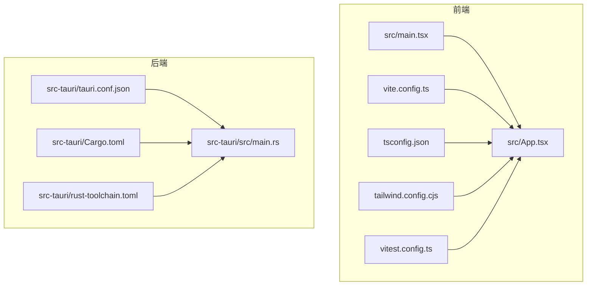
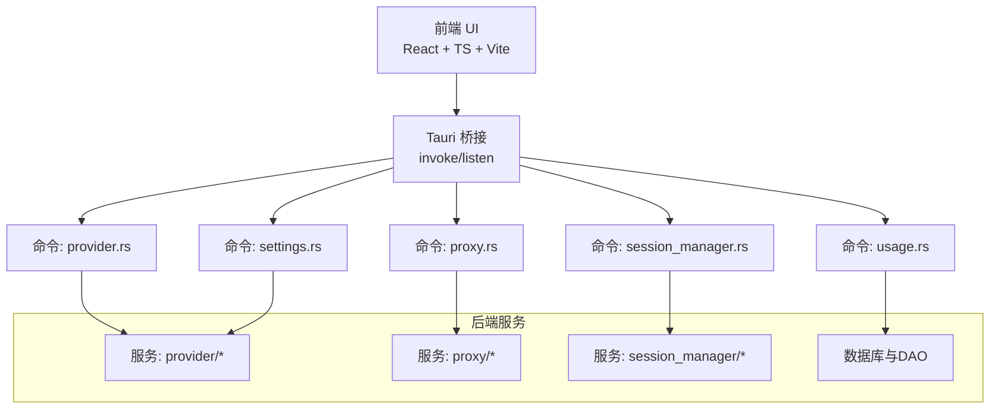
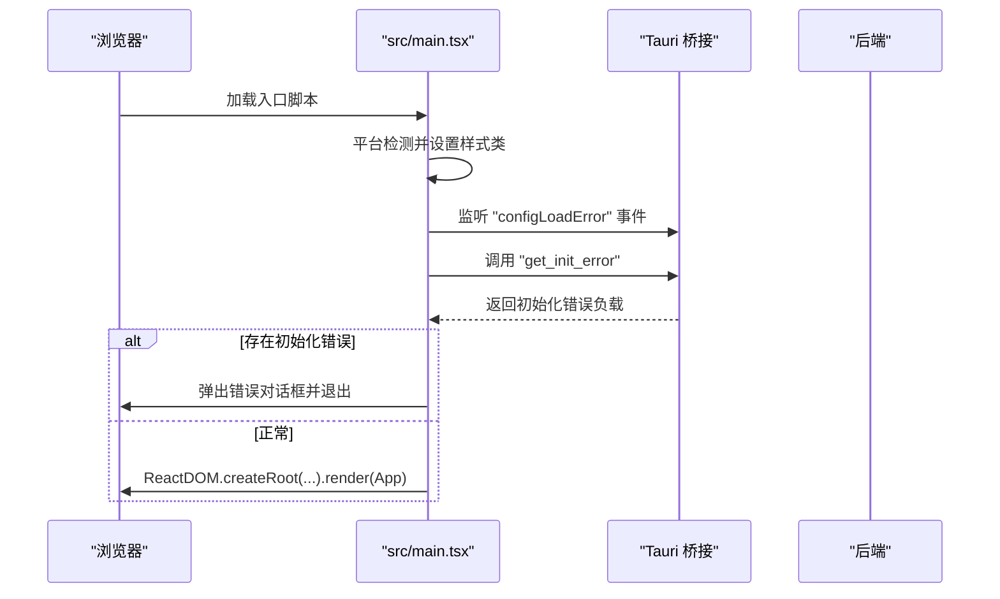
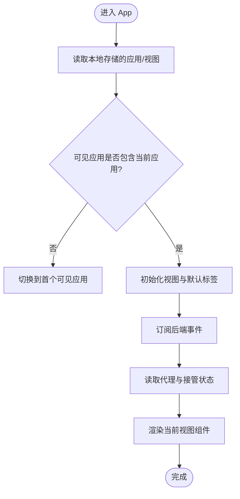
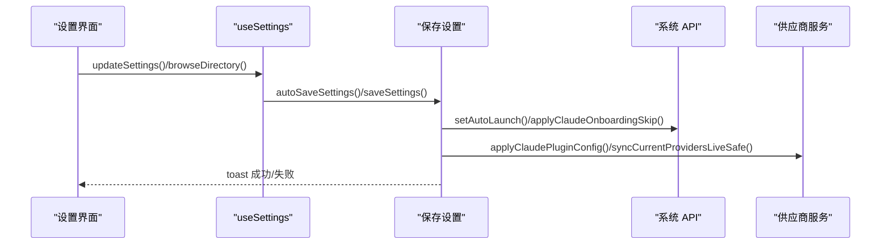
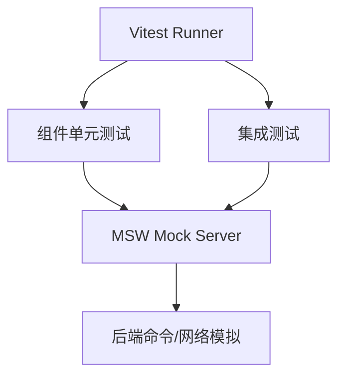
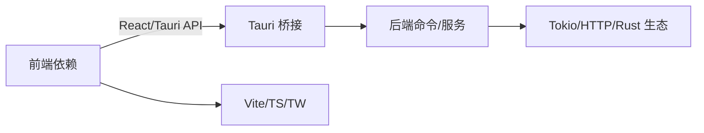

# 开发者指南

<cite>
**本文引用的文件**
- [package.json](file://package.json)
- [CONTRIBUTING.md](file://CONTRIBUTING.md)
- [SECURITY.md](file://SECURITY.md)
- [vite.config.ts](file://vite.config.ts)
- [tsconfig.json](file://tsconfig.json)
- [tailwind.config.cjs](file://tailwind.config.cjs)
- [vitest.config.ts](file://vitest.config.ts)
- [src-tauri/Cargo.toml](file://src-tauri/Cargo.toml)
- [src-tauri/rust-toolchain.toml](file://src-tauri/rust-toolchain.toml)
- [src-tauri/tauri.conf.json](file://src-tauri/tauri.conf.json)
- [src-tauri/src/main.rs](file://src-tauri/src/main.rs)
- [src/main.tsx](file://src/main.tsx)
- [src/App.tsx](file://src/App.tsx)
- [src/lib/utils.ts](file://src/lib/utils.ts)
- [src/hooks/useSettings.ts](file://src/hooks/useSettings.ts)
- [tests/components/ProviderList.test.tsx](file://tests/components/ProviderList.test.tsx)
- [tests/integration/App.test.tsx](file://tests/integration/App.test.tsx)
- [tests/msw/server.ts](file://tests/msw/server.ts)
- [tests/setupTests.ts](file://tests/setupTests.ts)
</cite>

## 目录
1. [简介](#简介)
2. [项目结构](#项目结构)
3. [核心组件](#核心组件)
4. [架构总览](#架构总览)
5. [详细组件分析](#详细组件分析)
6. [依赖关系分析](#依赖关系分析)
7. [性能考量](#性能考量)
8. [故障排查指南](#故障排查指南)
9. [结论](#结论)
10. [附录](#附录)

## 简介
本指南面向 CC Switch 项目的开发者，提供从环境搭建、架构设计、开发流程、测试策略、调试与性能优化到安全与扩展开发的完整说明。项目采用前端（React + TypeScript + Vite + TailwindCSS）与后端（Tauri + Rust）分层架构，结合现代化构建与测试体系，支持多平台打包与自动更新。

## 项目结构
项目采用前后端分离与多包协作的组织方式：
- 前端位于 src 目录，使用 Vite 构建，TypeScript 类型约束，TailwindCSS 样式框架。
- 后端位于 src-tauri 目录，基于 Tauri 2.x 与 Rust 1.85+，通过命令桥接与前端交互。
- 测试位于 tests 目录，包含组件级单元测试、集成测试与基于 MSW 的 API Mock。
- 文档与用户手册位于 docs 目录，涵盖向导、发布说明与用户手册。

**图表来源**
- [src/main.tsx:1-104](file://src/main.tsx#L1-104)
- [src/App.tsx:1-800](file://src/App.tsx#L1-800)
- [vite.config.ts:1-33](file://vite.config.ts#L1-33)
- [tsconfig.json:1-26](file://tsconfig.json#L1-26)
- [tailwind.config.cjs:1-174](file://tailwind.config.cjs#L1-174)
- [vitest.config.ts:1-21](file://vitest.config.ts#L1-21)
- [src-tauri/tauri.conf.json:1-70](file://src-tauri/tauri.conf.json#L1-70)
- [src-tauri/Cargo.toml:1-110](file://src-tauri/Cargo.toml#L1-110)
- [src-tauri/rust-toolchain.toml:1-5](file://src-tauri/rust-toolchain.toml#L1-5)
- [src-tauri/src/main.rs:1-23](file://src-tauri/src/main.rs#L1-23)

**章节来源**
- [package.json:1-96](file://package.json#L1-96)
- [vite.config.ts:1-33](file://vite.config.ts#L1-33)
- [tsconfig.json:1-26](file://tsconfig.json#L1-26)
- [tailwind.config.cjs:1-174](file://tailwind.config.cjs#L1-174)
- [vitest.config.ts:1-21](file://vitest.config.ts#L1-21)
- [src-tauri/tauri.conf.json:1-70](file://src-tauri/tauri.conf.json#L1-70)
- [src-tauri/Cargo.toml:1-110](file://src-tauri/Cargo.toml#L1-110)
- [src-tauri/rust-toolchain.toml:1-5](file://src-tauri/rust-toolchain.toml#L1-5)
- [src-tauri/src/main.rs:1-23](file://src-tauri/src/main.rs#L1-23)

## 核心组件
- 前端启动与初始化：负责平台检测、错误事件监听、主题与全局状态注入、根组件挂载。
- 应用主界面：路由视图、应用切换、托盘菜单、环境冲突提示、代理与故障转移状态联动。
- 设置与目录管理：集中式设置表单、目录解析与变更、开机自启、Claude 插件集成同步。
- 工具函数：类名合并与样式合并工具。
- 测试配置：Vitest 环境、JS DOM、全局设置与覆盖率输出。

**章节来源**
- [src/main.tsx:1-104](file://src/main.tsx#L1-104)
- [src/App.tsx:164-800](file://src/App.tsx#L164-800)
- [src/hooks/useSettings.ts:1-512](file://src/hooks/useSettings.ts#L1-512)
- [src/lib/utils.ts:1-7](file://src/lib/utils.ts#L1-7)
- [vitest.config.ts:1-21](file://vitest.config.ts#L1-21)

## 架构总览
前端通过 Tauri 桥接调用后端命令，实现系统级能力（托盘、对话框、进程、存储、更新等）。后端以模块化服务与命令处理为核心，围绕代理、供应商、会话、使用统计等业务域组织。

**图表来源**
- [src-tauri/src/main.rs:1-23](file://src-tauri/src/main.rs#L1-23)
- [src-tauri/tauri.conf.json:1-70](file://src-tauri/tauri.conf.json#L1-70)
- [src-tauri/Cargo.toml:25-83](file://src-tauri/Cargo.toml#L25-83)

## 详细组件分析

### 前端启动与初始化流程
- 平台检测：根据 UA/平台设置 body 类名，便于样式适配。
- 初始化错误处理：监听后端“配置加载失败”事件，弹出错误并强制退出。
- 早期初始化错误：通过命令查询后端初始化错误，避免事件竞态。
- 根组件挂载：QueryClientProvider、主题、更新上下文、全局通知。

**图表来源**
- [src/main.tsx:17-104](file://src/main.tsx#L17-104)

**章节来源**
- [src/main.tsx:1-104](file://src/main.tsx#L1-104)

### 应用主界面与视图切换
- 视图与应用状态：记忆上次应用与视图，校验可见应用列表，处理会话视图回退。
- 代理与接管状态：联动代理运行状态与接管状态，计算当前活跃供应商。
- 事件监听：统一供应商同步、WebDAV/S3 同步状态、官方代理警告等事件。
- 窗口状态同步：窗口最大化状态与装饰同步。

**图表来源**
- [src/App.tsx:164-226](file://src/App.tsx#L164-226)

**章节来源**
- [src/App.tsx:164-596](file://src/App.tsx#L164-596)

### 设置与目录管理
- 组合层职责：整合表单、目录、元数据，封装保存与重置逻辑。
- 自动保存：即时保存通用设置，处理开机自启、语言偏好、托盘菜单刷新。
- 完整保存：高级设置保存，包含目录覆盖变更后的“当前供应商”回写。
- Claude 插件集成：按启用状态同步至目标应用配置，并安全地同步当前供应商。

**图表来源**
- [src/hooks/useSettings.ts:181-305](file://src/hooks/useSettings.ts#L181-305)
- [src/hooks/useSettings.ts:309-484](file://src/hooks/useSettings.ts#L309-484)

**章节来源**
- [src/hooks/useSettings.ts:1-512](file://src/hooks/useSettings.ts#L1-512)

### 工具函数与样式
- 样式合并：使用 clsx 与 tailwind-merge 合并类名，避免冲突。
- Tailwind 主题：深色模式选择器、颜色系统、动画与阴影扩展。

**章节来源**
- [src/lib/utils.ts:1-7](file://src/lib/utils.ts#L1-7)
- [tailwind.config.cjs:1-174](file://tailwind.config.cjs#L1-174)

### 测试策略与实施
- 单元测试：Vitest + jsdom 环境，使用 setupFiles 注入全局与测试工具。
- 组件测试：覆盖 ProviderList、设置对话框、导入导出、技能面板等。
- 集成测试：App 主流程与设置页面集成验证。
- API Mock：MSW 服务端模拟，统一处理后端命令与网络请求。

**图表来源**
- [vitest.config.ts:12-20](file://vitest.config.ts#L12-20)
- [tests/setupTests.ts](file://tests/setupTests.ts)
- [tests/msw/server.ts](file://tests/msw/server.ts)

**章节来源**
- [vitest.config.ts:1-21](file://vitest.config.ts#L1-21)
- [tests/components/ProviderList.test.tsx](file://tests/components/ProviderList.test.tsx)
- [tests/integration/App.test.tsx](file://tests/integration/App.test.tsx)
- [tests/msw/server.ts](file://tests/msw/server.ts)
- [tests/setupTests.ts](file://tests/setupTests.ts)

## 依赖关系分析
- 前端依赖：React 生态、TanStack React Query、Radix UI、TailwindCSS、i18n、Recharts、CodeMirror 等。
- 后端依赖：Tauri 2.x、reqwest、tokio、hyper、axum、rustls、sqlite、rquickjs 等。
- 构建与工具：Vite、TypeScript、Tailwind、Prettier、ESLint、MSW、Vitest。

**图表来源**
- [package.json:42-94](file://package.json#L42-94)
- [src-tauri/Cargo.toml:25-83](file://src-tauri/Cargo.toml#L25-83)

**章节来源**
- [package.json:1-96](file://package.json#L1-96)
- [src-tauri/Cargo.toml:1-110](file://src-tauri/Cargo.toml#L1-110)

## 性能考量
- 前端性能
  - 使用 React Query 缓存与失效策略，减少重复请求。
  - Tailwind 动画与阴影适度使用，避免过度重排。
  - Vite 构建与按需加载，确保开发与生产体积可控。
- 后端性能
  - 释放优化配置（LTO、符号剥离、panic=unwind），减小二进制体积。
  - 异步运行时（Tokio）与流式处理（SSE/Stream），提升并发与吞吐。
  - 数据库事务与索引优化，避免热点查询阻塞。

[本节为通用指导，无需具体文件分析]

## 故障排查指南
- 配置加载失败
  - 现象：启动即弹出错误并退出。
  - 排查：检查配置路径与 JSON 有效性，查看备份文件恢复。
  - 参考：前端事件监听与错误处理。
- 环境变量冲突
  - 现象：启动或切换应用时出现冲突提示。
  - 排查：查看冲突列表，按提示调整环境变量或应用配置。
  - 参考：应用启动与切换时的冲突检查。
- 代理与接管问题
  - 现象：官方供应商代理接管警告或代理不可用。
  - 排查：切换到第三方供应商，检查代理配置与网络连通性。
  - 参考：代理状态与接管状态联动。
- 设置保存失败
  - 现象：保存设置后未生效或报错。
  - 排查：检查系统权限、目录覆盖变更、托盘菜单刷新。
  - 参考：设置保存与同步逻辑。

**章节来源**
- [src/main.tsx:35-71](file://src/main.tsx#L35-71)
- [src/App.tsx:464-563](file://src/App.tsx#L464-563)
- [src/hooks/useSettings.ts:309-484](file://src/hooks/useSettings.ts#L309-484)

## 结论
本指南提供了 CC Switch 从环境搭建到开发、测试、调试与发布的完整路径。建议在开发过程中严格遵循代码风格与提交规范，充分利用测试与 Mock 能力，关注前后端边界与事件流，确保跨平台稳定性与安全性。

[本节为总结性内容，无需具体文件分析]

## 附录

### 开发环境搭建与依赖安装
- 前端
  - Node.js 18+、pnpm 8+
  - 安装依赖：pnpm install
  - 启动开发：pnpm dev（热重载）
- 后端
  - Rust 1.85+、Cargo
  - Tauri 2.x 前置条件
  - Rust 工具链：rustfmt、clippy
- 构建与测试
  - 生产构建：pnpm build
  - 类型检查：pnpm typecheck
  - 单元测试：pnpm test:unit
  - 格式化：pnpm format / pnpm format:check

**章节来源**
- [CONTRIBUTING.md:19-69](file://CONTRIBUTING.md#L19-69)
- [package.json:6-16](file://package.json#L6-16)
- [src-tauri/rust-toolchain.toml:1-5](file://src-tauri/rust-toolchain.toml#L1-5)

### 代码贡献流程
- 提交前检查
  - TypeScript 类型检查、格式化检查、单元测试
  - 后端 cargo fmt --check、cargo clippy、cargo test
- 提交信息规范
  - Conventional Commits
- Pull Request
  - 先开 Issue 讨论，分支命名规范，PR 模板与检查清单

**章节来源**
- [CONTRIBUTING.md:71-126](file://CONTRIBUTING.md#L71-126)

### 安全策略
- 仅最新 3.x 版本接收安全更新
- 通过 GitHub Security Advisories 私密报告漏洞
- 协调披露流程：确认—修复—补丁发布—公开披露

**章节来源**
- [SECURITY.md:1-59](file://SECURITY.md#L1-59)

### 扩展开发指南
- 插件系统
  - 通过 Tauri 插件机制扩展能力（如 updater、store、process、dialog 等）
  - 前端通过 @tauri-apps/api 调用后端命令
- 自定义供应商
  - 在供应商配置中新增类别与表单字段，配套后端命令与服务
  - 使用统一的 ProviderSchema 与校验工具
- 第三方集成
  - 使用 reqwest、hyper、axum 等生态组件
  - 通过 MSW 进行 API Mock，保障测试隔离

**章节来源**
- [src-tauri/tauri.conf.json:56-68](file://src-tauri/tauri.conf.json#L56-68)
- [src-tauri/Cargo.toml:30-38](file://src-tauri/Cargo.toml#L30-38)
- [tests/msw/server.ts](file://tests/msw/server.ts)