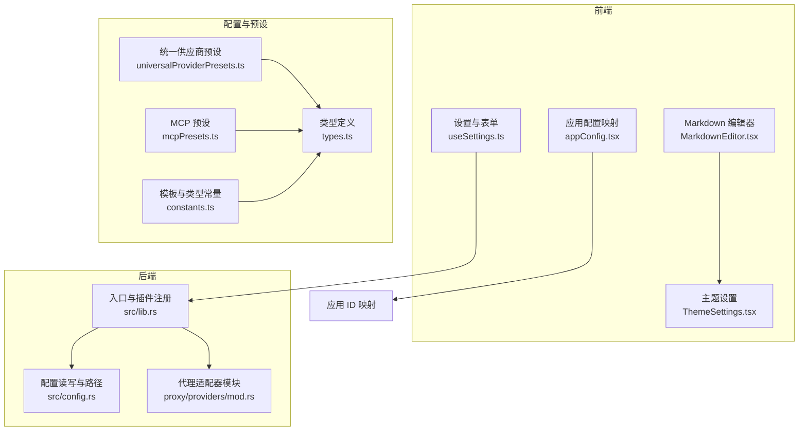
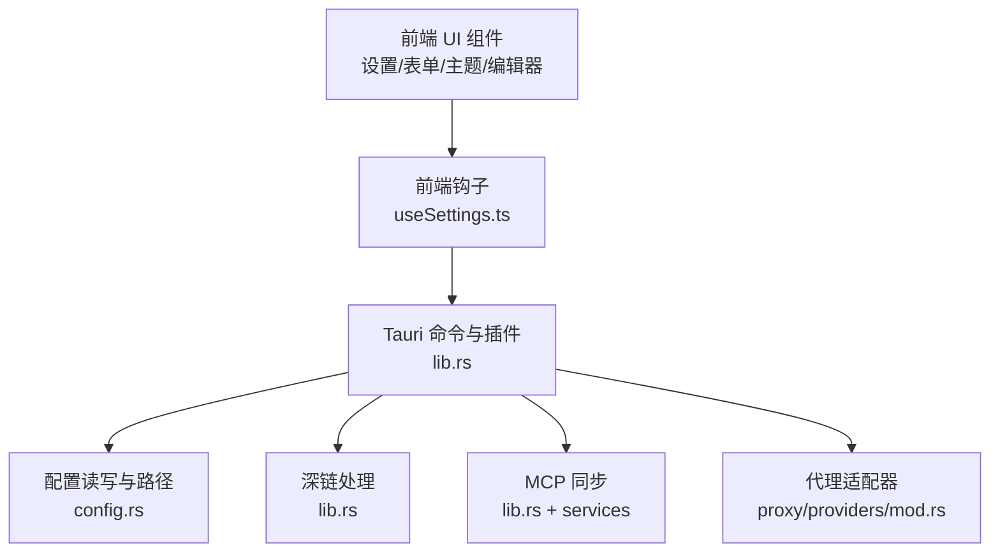
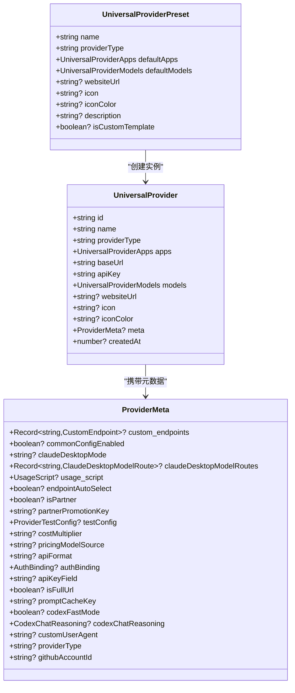
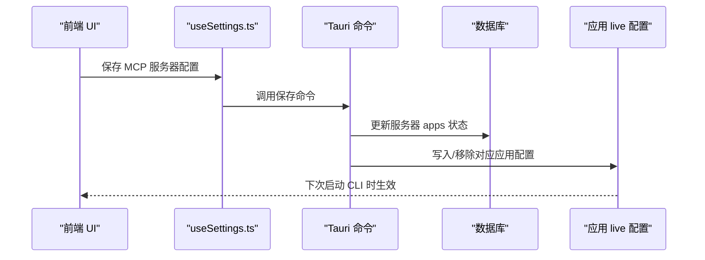
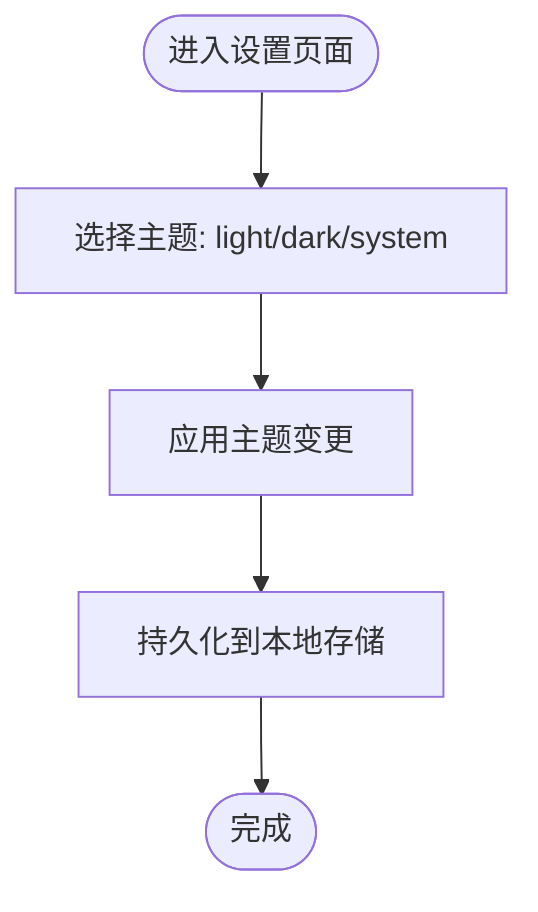
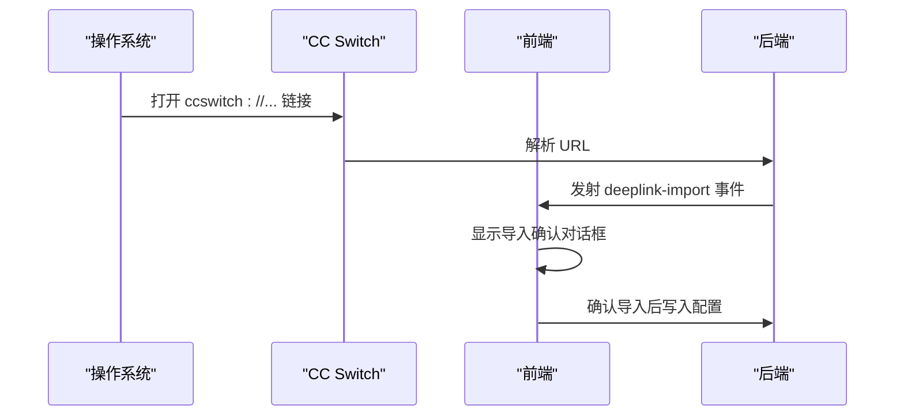
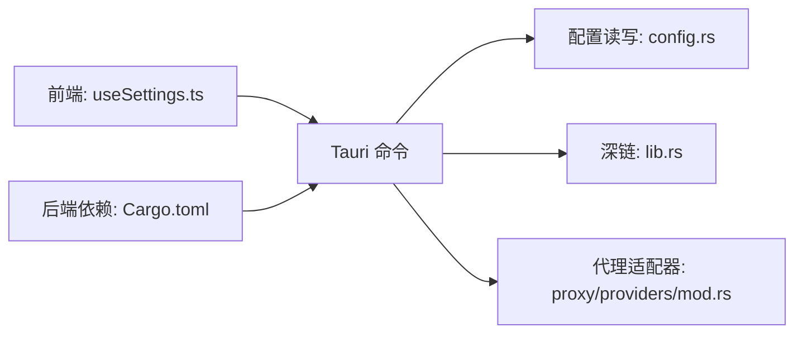

# 扩展开发

<cite>
**本文引用的文件**
- [src/config/universalProviderPresets.ts](file://src/config/universalProviderPresets.ts)
- [src/config/mcpPresets.ts](file://src/config/mcpPresets.ts)
- [src/config/appConfig.tsx](file://src/config/appConfig.tsx)
- [src/config/constants.ts](file://src/config/constants.ts)
- [src/types.ts](file://src/types.ts)
- [src/hooks/useSettings.ts](file://src/hooks/useSettings.ts)
- [src-tauri/src/lib.rs](file://src-tauri/src/lib.rs)
- [src-tauri/src/config.rs](file://src-tauri/src/config.rs)
- [src-tauri/src/proxy/providers/mod.rs](file://src-tauri/src/proxy/providers/mod.rs)
- [src-tauri/Cargo.toml](file://src-tauri/Cargo.toml)
- [docs/user-manual/zh/3-extensions/3.1-mcp.md](file://docs/user-manual/zh/3-extensions/3.1-mcp.md)
- [docs/user-manual/zh/5-faq/5.3-deeplink.md](file://docs/user-manual/zh/5-faq/5.3-deeplink.md)
- [src/components/MarkdownEditor.tsx](file://src/components/MarkdownEditor.tsx)
- [src/components/settings/ThemeSettings.tsx](file://src/components/settings/ThemeSettings.tsx)
</cite>

## 目录
1. [简介](#简介)
2. [项目结构](#项目结构)
3. [核心组件](#核心组件)
4. [架构总览](#架构总览)
5. [详细组件分析](#详细组件分析)
6. [依赖分析](#依赖分析)
7. [性能考量](#性能考量)
8. [故障排查指南](#故障排查指南)
9. [结论](#结论)
10. [附录](#附录)

## 简介
本指南面向希望为 CC Switch 进行扩展开发的工程师与高级用户，系统讲解插件系统架构与扩展点，涵盖以下主题：
- 供应商插件体系：统一供应商（Universal Provider）与各应用供应商（Claude/Codex/Gemini/OpenCode/OpenClaw/Hermes）的扩展方法
- MCP 服务器插件：MCP 预设与自定义服务器的开发与同步机制
- 主题与 UI 扩展：主题开关与自定义编辑器组件的扩展思路
- 第三方集成：深链协议（deeplink）、WebDAV 同步、外部工具集成
- 配置系统扩展：新增配置项与修改既有配置的规范流程
- 实战示例与最佳实践：从预设到自定义的完整开发路径
- 调试与测试：工具链与方法论

## 项目结构
CC Switch 采用前端（React + TypeScript）+ 桌面壳（Tauri Rust）的双层架构。扩展开发主要围绕以下层次展开：
- 前端层：组件、表单、设置、国际化、UI 主题与编辑器
- 后端层：Tauri 命令、服务、代理适配器、配置读写与深链处理
- 配置与预设：统一供应商预设、MCP 预设、应用配置映射与常量定义

**图表来源**
- [src/hooks/useSettings.ts:127-177](file://src/hooks/useSettings.ts#L127-L177)
- [src-tauri/src/lib.rs:267-300](file://src-tauri/src/lib.rs#L267-L300)
- [src-tauri/src/config.rs:89-128](file://src-tauri/src/config.rs#L89-L128)
- [src-tauri/src/proxy/providers/mod.rs:1-35](file://src-tauri/src/proxy/providers/mod.rs#L1-L35)
- [src/config/universalProviderPresets.ts:1-133](file://src/config/universalProviderPresets.ts#L1-L133)
- [src/config/mcpPresets.ts:1-105](file://src/config/mcpPresets.ts#L1-L105)
- [src/config/constants.ts:1-19](file://src/config/constants.ts#L1-L19)
- [src/config/appConfig.tsx:1-112](file://src/config/appConfig.tsx#L1-L112)
- [src/types.ts:1-709](file://src/types.ts#L1-L709)

**章节来源**
- [src-tauri/src/lib.rs:220-320](file://src-tauri/src/lib.rs#L220-L320)
- [src-tauri/src/config.rs:89-128](file://src-tauri/src/config.rs#L89-L128)
- [src/config/universalProviderPresets.ts:1-133](file://src/config/universalProviderPresets.ts#L1-L133)
- [src/config/mcpPresets.ts:1-105](file://src/config/mcpPresets.ts#L1-L105)
- [src/config/appConfig.tsx:1-112](file://src/config/appConfig.tsx#L1-L112)
- [src/config/constants.ts:1-19](file://src/config/constants.ts#L1-L19)
- [src/types.ts:1-709](file://src/types.ts#L1-L709)

## 核心组件
- 统一供应商（Universal Provider）：跨应用共享的供应商配置，支持统一模型映射与图标/颜色配置
- MCP 服务器：MCP 预设与自定义服务器，支持 stdio/http/sse 三种传输类型，并可按应用启用/禁用
- 应用配置映射：APP_IDS、SKILLS_APP_IDS、MCP_APP_IDS 等，用于控制 UI 展示与面板可用性
- 设置与同步：useSettings 钩子负责设置保存、目录覆盖、开机自启、Claude 插件联动等
- 深链与同步：deeplink 协议解析与事件派发，WebDAV/S3 同步配置与状态
- 类型与常量：ProviderMeta、McpServer、Settings、模板类型常量等，支撑扩展的数据契约

**章节来源**
- [src/config/universalProviderPresets.ts:15-133](file://src/config/universalProviderPresets.ts#L15-L133)
- [src/config/mcpPresets.ts:1-105](file://src/config/mcpPresets.ts#L1-L105)
- [src/config/appConfig.tsx:18-112](file://src/config/appConfig.tsx#L18-L112)
- [src/hooks/useSettings.ts:127-177](file://src/hooks/useSettings.ts#L127-L177)
- [src/types.ts:11-228](file://src/types.ts#L11-L228)
- [src/config/constants.ts:1-19](file://src/config/constants.ts#L1-L19)

## 架构总览
下图展示了 CC Switch 的扩展相关架构：前端通过 Tauri 命令与后端交互，后端负责配置读写、深链解析、MCP 同步与代理适配。

**图表来源**
- [src-tauri/src/lib.rs:119-182](file://src-tauri/src/lib.rs#L119-L182)
- [src-tauri/src/lib.rs:267-300](file://src-tauri/src/lib.rs#L267-L300)
- [src-tauri/src/config.rs:89-128](file://src-tauri/src/config.rs#L89-L128)
- [src-tauri/src/proxy/providers/mod.rs:1-35](file://src-tauri/src/proxy/providers/mod.rs#L1-L35)
- [src/hooks/useSettings.ts:127-177](file://src/hooks/useSettings.ts#L127-L177)

## 详细组件分析

### 统一供应商（Universal Provider）扩展
- 目标：为 Claude、Codex、Gemini 等应用提供跨应用共享的供应商配置
- 关键点：
  - 预设定义：包含默认模型映射、图标/颜色、网站链接与描述
  - 创建工厂：根据预设生成具体供应商实例，填充 baseUrl、apiKey、createdAt 等
  - 分类与元数据：支持 ProviderMeta 中的 custom_endpoints、authBinding、apiFormat 等扩展字段
- 开发步骤：
  1) 在预设列表中新增条目，定义 defaultApps/defaultModels/icon 等
  2) 使用工厂函数创建供应商实例，或在 UI 中引导用户填写 baseUrl/apiKey
  3) 通过 ProviderMeta 扩展认证绑定、自定义 UA、端点自动选择等能力
- 最佳实践：
  - 为新供应商提供合理的默认模型映射
  - 使用 isCustomTemplate 标识自定义模板，允许用户完全自定义
  - 通过 websiteUrl/icon/iconColor 提升用户体验

**图表来源**
- [src/config/universalProviderPresets.ts:15-133](file://src/config/universalProviderPresets.ts#L15-L133)
- [src/types.ts:177-228](file://src/types.ts#L177-L228)

**章节来源**
- [src/config/universalProviderPresets.ts:15-133](file://src/config/universalProviderPresets.ts#L15-L133)
- [src/types.ts:177-228](file://src/types.ts#L177-L228)

### MCP 服务器扩展
- 目标：为 Claude、Codex、Gemini、OpenCode、Hermes 等应用提供 MCP 服务器接入
- 关键点：
  - 预设模板：提供 fetch、time、memory、sequential-thinking、context7 等常用服务器
  - 传输类型：stdio（本地进程）、http（远程 HTTP）、sse（Server-Sent Events）
  - 应用绑定：每个服务器可独立控制在各应用中的启用状态
  - 同步机制：启用/禁用时写入对应应用的 live 配置文件
- 开发步骤：
  1) 在 mcpPresets 中新增预设条目，定义 server.type/command/args/url/headers/env 等
  2) 通过 getMcpPresetWithDescription 生成带国际化描述的 McpServer
  3) 在 UI 中展示预设并允许用户自定义配置
  4) 保存后由后端同步到各应用配置文件
- 最佳实践：
  - 为不同平台（Windows/Linux/macOS）提供合适的 stdio 命令包装
  - 为服务器提供清晰的 homepage/docs 链接
  - 严格区分应用绑定，避免不必要的同步

**图表来源**
- [src/config/mcpPresets.ts:31-105](file://src/config/mcpPresets.ts#L31-L105)
- [docs/user-manual/zh/3-extensions/3.1-mcp.md:111-137](file://docs/user-manual/zh/3-extensions/3.1-mcp.md#L111-L137)
- [src/hooks/useSettings.ts:127-177](file://src/hooks/useSettings.ts#L127-L177)

**章节来源**
- [src/config/mcpPresets.ts:1-105](file://src/config/mcpPresets.ts#L1-L105)
- [docs/user-manual/zh/3-extensions/3.1-mcp.md:1-212](file://docs/user-manual/zh/3-extensions/3.1-mcp.md#L1-L212)

### 主题与 UI 组件扩展
- 主题设置：提供 light/dark/system 三态切换，与系统外观联动
- Markdown 编辑器：基于 CodeMirror 的可定制编辑器，支持深色/浅色主题与只读模式
- 扩展建议：
  - 为主题系统增加更多预设与动态色板
  - 为编辑器扩展更多语法高亮与插件生态
  - 通过 ProviderMeta 为特定供应商提供 UI 标识（图标/颜色）

**图表来源**
- [src/components/settings/ThemeSettings.tsx:1-44](file://src/components/settings/ThemeSettings.tsx#L1-L44)
- [src/components/MarkdownEditor.tsx:87-133](file://src/components/MarkdownEditor.tsx#L87-L133)

**章节来源**
- [src/components/settings/ThemeSettings.tsx:1-44](file://src/components/settings/ThemeSettings.tsx#L1-L44)
- [src/components/MarkdownEditor.tsx:87-133](file://src/components/MarkdownEditor.tsx#L87-L133)

### 第三方集成：深链协议（deeplink）
- 协议：ccswitch://v1/import，支持导入供应商、MCP、Prompt、Skill
- 前端：解析 URL、派发 deeplink-import/deeplink-error 事件、聚焦主窗口
- 后端：注册 deep-link 插件、处理协议注册、日志脱敏
- 最佳实践：
  - 严格校验必填参数与数据格式
  - 对敏感信息（如 API Key）进行脱敏显示
  - 提供友好的导入确认对话框

**图表来源**
- [src-tauri/src/lib.rs:119-182](file://src-tauri/src/lib.rs#L119-L182)
- [docs/user-manual/zh/5-faq/5.3-deeplink.md:1-257](file://docs/user-manual/zh/5-faq/5.3-deeplink.md#L1-L257)

**章节来源**
- [src-tauri/src/lib.rs:119-182](file://src-tauri/src/lib.rs#L119-L182)
- [docs/user-manual/zh/5-faq/5.3-deeplink.md:1-257](file://docs/user-manual/zh/5-faq/5.3-deeplink.md#L1-L257)

### WebDAV 同步与外部工具集成
- WebDAV 同步：支持启用/自动同步、基础认证、远程根路径与状态跟踪
- 外部工具：通过 Tauri 插件 opener 调用系统默认应用，结合深链协议实现一键导入
- 最佳实践：
  - 为同步提供进度与错误状态反馈
  - 支持增量同步与冲突处理策略
  - 与设置页联动，提供一键启用/禁用

**章节来源**
- [src/types.ts:282-306](file://src/types.ts#L282-L306)
- [src-tauri/Cargo.toml:32-37](file://src-tauri/Cargo.toml#L32-L37)

### 配置系统扩展：新增与修改
- 新增配置项：
  - 在 Settings 接口中添加字段，确保与后端配置读写兼容
  - 在 useSettings 中处理保存、持久化与系统 API 调用（如开机自启）
  - 通过 useSettingsMetadata 判断是否需要重启
- 修改既有配置：
  - 保持向后兼容，避免破坏现有用户数据
  - 提供迁移逻辑与版本标记
- 最佳实践：
  - 为配置项提供默认值与校验
  - 对敏感配置进行脱敏日志
  - 通过常量与类型约束减少配置错误

**章节来源**
- [src/hooks/useSettings.ts:127-177](file://src/hooks/useSettings.ts#L127-L177)
- [src-tauri/src/config.rs:89-128](file://src-tauri/src/config.rs#L89-L128)
- [src/config/constants.ts:1-19](file://src/config/constants.ts#L1-L19)

## 依赖分析
- 前端依赖：React、TanStack Query、i18n、UI 组件库（如 shadcn）
- 后端依赖：Tauri 生态（deep-link、store、opener、process、updater、window-state）、HTTP 客户端、数据库（rusqlite）
- 关键耦合：
  - 前端通过 useSettings 与后端命令交互
  - 后端通过 config.rs 统一管理路径与原子写入
  - 代理适配器模块为多供应商提供统一抽象

**图表来源**
- [src/hooks/useSettings.ts:127-177](file://src/hooks/useSettings.ts#L127-L177)
- [src-tauri/src/config.rs:89-128](file://src-tauri/src/config.rs#L89-L128)
- [src-tauri/src/lib.rs:267-300](file://src-tauri/src/lib.rs#L267-L300)
- [src-tauri/src/proxy/providers/mod.rs:1-35](file://src-tauri/src/proxy/providers/mod.rs#L1-L35)
- [src-tauri/Cargo.toml:25-82](file://src-tauri/Cargo.toml#L25-L82)

**章节来源**
- [src-tauri/Cargo.toml:25-82](file://src-tauri/Cargo.toml#L25-L82)
- [src-tauri/src/lib.rs:267-300](file://src-tauri/src/lib.rs#L267-L300)

## 性能考量
- 原子写入：配置写入采用临时文件 + 原子替换，避免半写状态与并发冲突
- 日志与状态：后端初始化时统一日志目标与轮转策略，减少 IO 抖动
- 代理适配：通过适配器抽象统一接口，降低多供应商差异带来的性能损耗
- UI 交互：设置保存采用异步与防抖，避免频繁写盘

**章节来源**
- [src-tauri/src/config.rs:180-259](file://src-tauri/src/config.rs#L180-L259)
- [src-tauri/src/lib.rs:332-356](file://src-tauri/src/lib.rs#L332-L356)
- [src-tauri/src/proxy/providers/mod.rs:1-35](file://src-tauri/src/proxy/providers/mod.rs#L1-L35)

## 故障排查指南
- 深链无法打开：
  - 检查协议是否注册（macOS 重新安装；Windows 检查注册表；Linux 检查 .desktop）
  - 验证链接格式与必填参数
- MCP 服务器启动失败：
  - 确认命令在 PATH 中（npx/uvx 等）
  - 检查参数与环境变量
- 配置不生效：
  - 确认对应应用开关已开启
  - 重启相应 CLI 工具
- 设置保存失败：
  - 查看日志与错误提示
  - 检查目录权限与磁盘空间

**章节来源**
- [docs/user-manual/zh/5-faq/5.3-deeplink.md:172-257](file://docs/user-manual/zh/5-faq/5.3-deeplink.md#L172-L257)
- [docs/user-manual/zh/3-extensions/3.1-mcp.md:198-212](file://docs/user-manual/zh/3-extensions/3.1-mcp.md#L198-L212)

## 结论
CC Switch 的扩展开发围绕“统一配置 + 多应用适配 + 深链与同步”的核心理念展开。通过预设与工厂模式快速扩展供应商与 MCP 服务器，借助设置钩子与后端命令实现配置的持久化与系统集成，配合深链与同步能力提升用户体验。遵循本文的最佳实践与流程，可高效构建稳定可靠的扩展方案。

## 附录
- 实战示例路径参考：
  - 统一供应商预设与工厂：[src/config/universalProviderPresets.ts:61-116](file://src/config/universalProviderPresets.ts#L61-L116)
  - MCP 预设与传输类型：[src/config/mcpPresets.ts:31-105](file://src/config/mcpPresets.ts#L31-L105)
  - 设置保存与系统 API 调用：[src/hooks/useSettings.ts:181-305](file://src/hooks/useSettings.ts#L181-L305)
  - 深链协议解析与事件派发：[src-tauri/src/lib.rs:119-182](file://src-tauri/src/lib.rs#L119-L182)
  - 配置读写与原子写入：[src-tauri/src/config.rs:180-259](file://src-tauri/src/config.rs#L180-L259)
  - 代理适配器模块：[src-tauri/src/proxy/providers/mod.rs:1-35](file://src-tauri/src/proxy/providers/mod.rs#L1-L35)