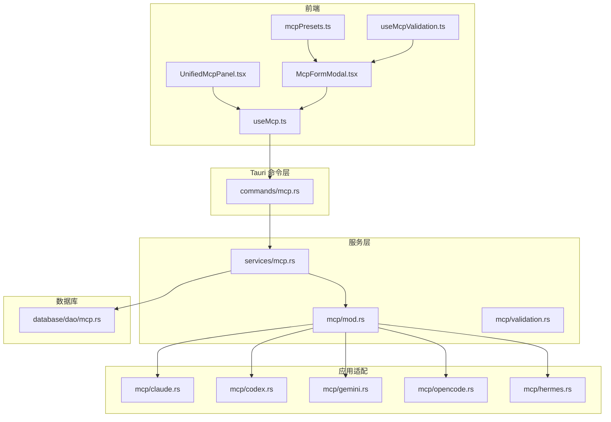
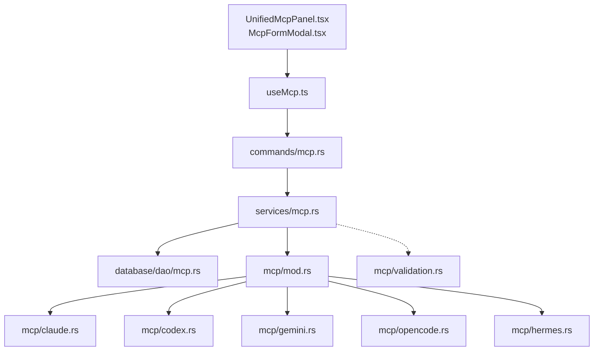
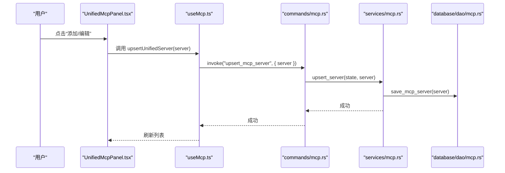
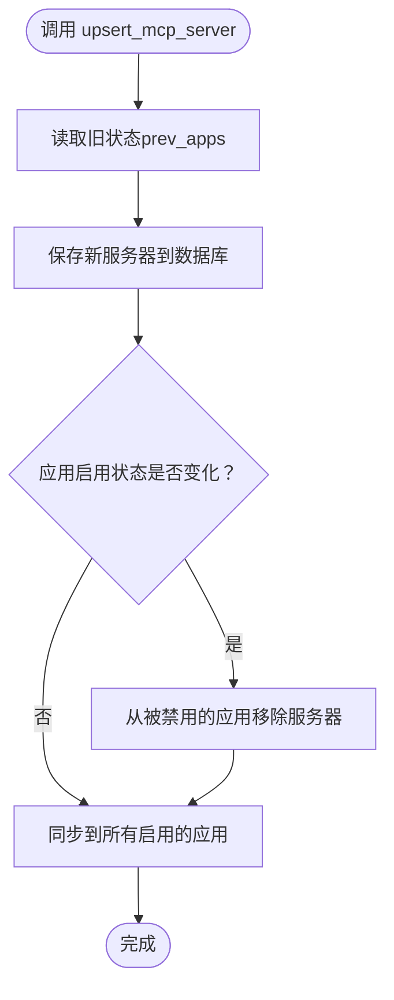
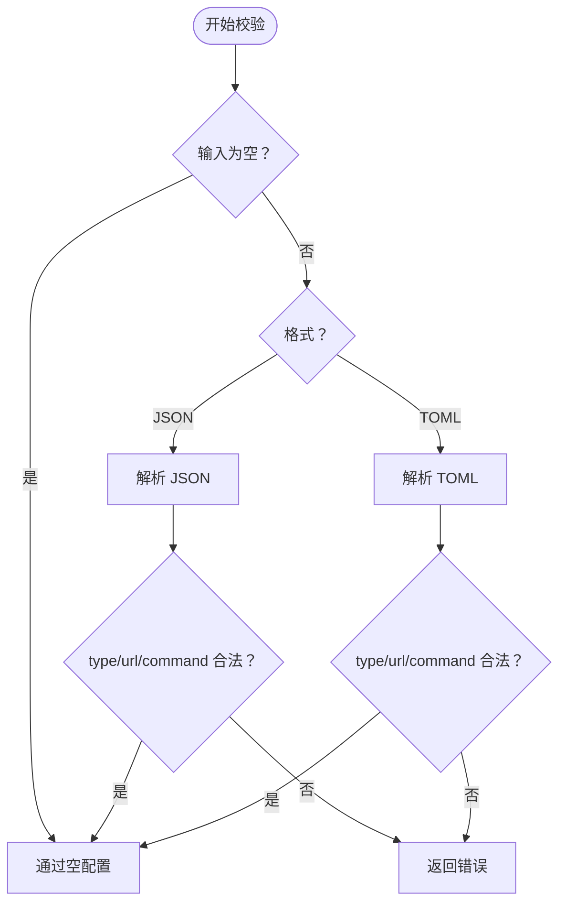
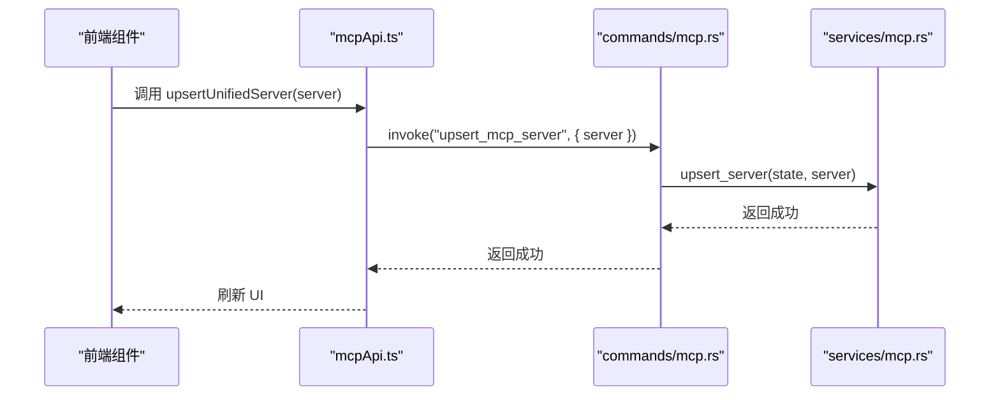
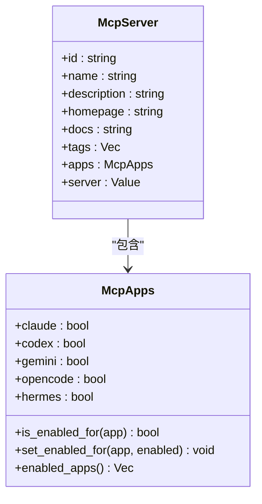
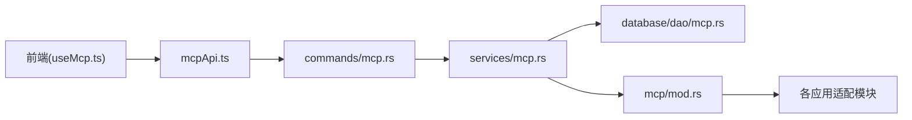

# 插件开发

<cite>
**本文引用的文件**
- [src-tauri/src/commands/mcp.rs](file://src-tauri/src/commands/mcp.rs)
- [src-tauri/src/services/mcp.rs](file://src-tauri/src/services/mcp.rs)
- [src-tauri/src/mcp/mod.rs](file://src-tauri/src/mcp/mod.rs)
- [src-tauri/src/mcp/validation.rs](file://src-tauri/src/mcp/validation.rs)
- [src-tauri/src/mcp/codex.rs](file://src-tauri/src/mcp/codex.rs)
- [src/lib/api/mcp.ts](file://src/lib/api/mcp.ts)
- [src/hooks/useMcp.ts](file://src/hooks/useMcp.ts)
- [src/components/mcp/McpFormModal.tsx](file://src/components/mcp/McpFormModal.tsx)
- [src/components/mcp/UnifiedMcpPanel.tsx](file://src/components/mcp/UnifiedMcpPanel.tsx)
- [src/config/mcpPresets.ts](file://src/config/mcpPresets.ts)
- [src/components/mcp/useMcpValidation.ts](file://src/components/mcp/useMcpValidation.ts)
- [src-tauri/src/app_config.rs](file://src-tauri/src/app_config.rs)
- [src-tauri/src/database/dao/mcp.rs](file://src-tauri/src/database/dao/mcp.rs)
- [src-tauri/src/deeplink/mcp.rs](file://src-tauri/src/deeplink/mcp.rs)
- [src/hooks/useTauriEvent.ts](file://src/hooks/useTauriEvent.ts)
- [src/App.tsx](file://src/App.tsx)
- [docs/user-manual/zh/3-extensions/3.1-mcp.md](file://docs/user-manual/zh/3-extensions/3.1-mcp.md)
- [docs/user-manual/en/3-extensions/3.1-mcp.md](file://docs/user-manual/en/3-extensions/3.1-mcp.md)
- [package.json](file://package.json)
</cite>

## 目录
1. [简介](#简介)
2. [项目结构](#项目结构)
3. [核心组件](#核心组件)
4. [架构总览](#架构总览)
5. [详细组件分析](#详细组件分析)
6. [依赖分析](#依赖分析)
7. [性能考虑](#性能考虑)
8. [故障排查指南](#故障排查指南)
9. [结论](#结论)
10. [附录](#附录)

## 简介
本指南面向希望为 CC Switch 开发 MCP 插件（即 MCP 服务器）的开发者，涵盖插件系统的整体架构、扩展机制、生命周期管理、配置加载与状态维护、与主应用的通信机制（Tauri 命令系统与事件传递）、配置格式与验证规则、插件间依赖关系处理，以及从项目初始化到部署发布的完整开发流程。文档同时提供调试技巧与性能优化建议，并通过具体示例帮助你创建自定义 MCP 服务器、实现认证机制与处理异步操作。

## 项目结构
CC Switch 的插件系统由前端 UI、Tauri 命令层、服务层与数据库层协同组成，形成“统一配置 + 多应用同步”的 MCP 管理体系。关键目录与文件如下：
- 前端 UI：MCP 面板、表单、预设与校验逻辑
- Tauri 命令：暴露统一的 MCP 管理 API
- 服务层：统一的 MCP 业务逻辑与多应用同步
- MCP 模块：针对不同应用（Claude、Codex、Gemini、OpenCode、Hermes）的导入/同步/移除
- 数据库：持久化统一的 MCP 服务器配置
- 配置与预设：跨平台命令封装与常用预设

**图表来源**
- [src/components/mcp/UnifiedMcpPanel.tsx:1-319](file://src/components/mcp/UnifiedMcpPanel.tsx#L1-L319)
- [src/components/mcp/McpFormModal.tsx:1-730](file://src/components/mcp/McpFormModal.tsx#L1-L730)
- [src/hooks/useMcp.ts:1-75](file://src/hooks/useMcp.ts#L1-L75)
- [src/config/mcpPresets.ts:1-105](file://src/config/mcpPresets.ts#L1-L105)
- [src/components/mcp/useMcpValidation.ts:1-98](file://src/components/mcp/useMcpValidation.ts#L1-L98)
- [src-tauri/src/commands/mcp.rs:44-207](file://src-tauri/src/commands/mcp.rs#L44-L207)
- [src-tauri/src/services/mcp.rs:1-438](file://src-tauri/src/services/mcp.rs#L1-L438)
- [src-tauri/src/mcp/mod.rs:1-36](file://src-tauri/src/mcp/mod.rs#L1-L36)
- [src-tauri/src/mcp/validation.rs:1-70](file://src-tauri/src/mcp/validation.rs#L1-L70)
- [src-tauri/src/database/dao/mcp.rs](file://src-tauri/src/database/dao/mcp.rs)

**章节来源**
- [src-tauri/src/commands/mcp.rs:44-207](file://src-tauri/src/commands/mcp.rs#L44-L207)
- [src-tauri/src/services/mcp.rs:1-438](file://src-tauri/src/services/mcp.rs#L1-L438)
- [src-tauri/src/mcp/mod.rs:1-36](file://src-tauri/src/mcp/mod.rs#L1-L36)
- [src-tauri/src/mcp/validation.rs:1-70](file://src-tauri/src/mcp/validation.rs#L1-L70)
- [src-tauri/src/database/dao/mcp.rs](file://src-tauri/src/database/dao/mcp.rs)

## 核心组件
- 前端统一面板与表单
  - UnifiedMcpPanel：展示与管理所有 MCP 服务器，支持启用/禁用到各应用、导入、删除与编辑。
  - McpFormModal：提供 JSON/TOML 编辑器、预设模板、向导与实时校验。
  - useMcp：React Query 钩子，封装统一的 CRUD 与导入操作。
  - mcpPresets：内置常用预设（fetch、time、memory、sequential-thinking、context7），跨平台命令封装。
  - useMcpValidation：JSON/TOML 校验与错误格式化。
- Tauri 命令层
  - 提供统一的 MCP 管理命令：获取、新增/更新、删除、切换应用启用状态、从所有应用导入。
- 服务层
  - McpService：统一业务逻辑，负责持久化、应用启用状态变更、多应用同步与导入。
- MCP 模块
  - 针对 Claude、Codex、Gemini、OpenCode、Hermes 的导入/同步/移除逻辑。
- 数据库层
  - 统一的 MCP 服务器存储结构（含应用启用状态标记）。
- 配置与预设
  - 跨平台 stdio 命令封装（Windows/cmd + npx、Mac/Linux/npx）。
  - 常用预设模板与国际化描述。

**章节来源**
- [src/components/mcp/UnifiedMcpPanel.tsx:1-319](file://src/components/mcp/UnifiedMcpPanel.tsx#L1-L319)
- [src/components/mcp/McpFormModal.tsx:1-730](file://src/components/mcp/McpFormModal.tsx#L1-L730)
- [src/hooks/useMcp.ts:1-75](file://src/hooks/useMcp.ts#L1-L75)
- [src/config/mcpPresets.ts:1-105](file://src/config/mcpPresets.ts#L1-L105)
- [src/components/mcp/useMcpValidation.ts:1-98](file://src/components/mcp/useMcpValidation.ts#L1-L98)
- [src-tauri/src/commands/mcp.rs:44-207](file://src-tauri/src/commands/mcp.rs#L44-L207)
- [src-tauri/src/services/mcp.rs:1-438](file://src-tauri/src/services/mcp.rs#L1-L438)
- [src-tauri/src/mcp/mod.rs:1-36](file://src-tauri/src/mcp/mod.rs#L1-L36)
- [src-tauri/src/database/dao/mcp.rs](file://src-tauri/src/database/dao/mcp.rs)

## 架构总览
下图展示了从前端 UI 到数据库与多应用同步的整体架构，以及 Tauri 命令与服务层的交互关系。

**图表来源**
- [src/components/mcp/UnifiedMcpPanel.tsx:1-319](file://src/components/mcp/UnifiedMcpPanel.tsx#L1-L319)
- [src/components/mcp/McpFormModal.tsx:1-730](file://src/components/mcp/McpFormModal.tsx#L1-L730)
- [src/hooks/useMcp.ts:1-75](file://src/hooks/useMcp.ts#L1-L75)
- [src-tauri/src/commands/mcp.rs:44-207](file://src-tauri/src/commands/mcp.rs#L44-L207)
- [src-tauri/src/services/mcp.rs:1-438](file://src-tauri/src/services/mcp.rs#L1-L438)
- [src-tauri/src/mcp/mod.rs:1-36](file://src-tauri/src/mcp/mod.rs#L1-L36)
- [src-tauri/src/mcp/validation.rs:1-70](file://src-tauri/src/mcp/validation.rs#L1-L70)
- [src-tauri/src/database/dao/mcp.rs](file://src-tauri/src/database/dao/mcp.rs)

## 详细组件分析

### 组件 A：MCP 面板与表单（前端）
- 统一面板 UnifiedMcpPanel
  - 展示服务器列表、应用启用计数、编辑/删除/导入入口。
  - 通过 useMcp 钩子调用统一 API。
- 表单 McpFormModal
  - 支持 JSON/TOML 双格式编辑，智能解析与校验。
  - 预设模板一键应用，向导辅助生成配置。
  - 实时校验：命令/URL 必填、TOML/JSON 结构合法性。
- 预设与校验
  - mcpPresets：内置 fetch、time、memory、sequential-thinking、context7 等预设。
  - useMcpValidation：统一 JSON/TOML 校验与错误提示。

**图表来源**
- [src/components/mcp/UnifiedMcpPanel.tsx:1-319](file://src/components/mcp/UnifiedMcpPanel.tsx#L1-L319)
- [src/hooks/useMcp.ts:1-75](file://src/hooks/useMcp.ts#L1-L75)
- [src-tauri/src/commands/mcp.rs:170-177](file://src-tauri/src/commands/mcp.rs#L170-L177)
- [src-tauri/src/services/mcp.rs:18-51](file://src-tauri/src/services/mcp.rs#L18-L51)
- [src-tauri/src/database/dao/mcp.rs](file://src-tauri/src/database/dao/mcp.rs)

**章节来源**
- [src/components/mcp/UnifiedMcpPanel.tsx:1-319](file://src/components/mcp/UnifiedMcpPanel.tsx#L1-L319)
- [src/components/mcp/McpFormModal.tsx:1-730](file://src/components/mcp/McpFormModal.tsx#L1-L730)
- [src/hooks/useMcp.ts:1-75](file://src/hooks/useMcp.ts#L1-L75)
- [src/config/mcpPresets.ts:1-105](file://src/config/mcpPresets.ts#L1-L105)
- [src/components/mcp/useMcpValidation.ts:1-98](file://src/components/mcp/useMcpValidation.ts#L1-L98)

### 组件 B：Tauri 命令系统与服务层
- 命令层
  - 提供统一的 MCP 管理命令：获取、新增/更新、删除、切换应用启用状态、从所有应用导入。
- 服务层
  - 统一业务逻辑：持久化、应用启用状态变更、多应用同步与导入。
  - 兼容旧 API：保留 v3.6.x 分应用命令，内部转换为统一结构。
- MCP 模块
  - 针对 Claude、Codex、Gemini、OpenCode、Hermes 的导入/同步/移除逻辑。
  - Codex 特殊处理：TOML 格式转换与条件同步。

**图表来源**
- [src-tauri/src/commands/mcp.rs:170-177](file://src-tauri/src/commands/mcp.rs#L170-L177)
- [src-tauri/src/services/mcp.rs:18-51](file://src-tauri/src/services/mcp.rs#L18-L51)
- [src-tauri/src/mcp/mod.rs:1-36](file://src-tauri/src/mcp/mod.rs#L1-L36)

**章节来源**
- [src-tauri/src/commands/mcp.rs:44-207](file://src-tauri/src/commands/mcp.rs#L44-L207)
- [src-tauri/src/services/mcp.rs:1-438](file://src-tauri/src/services/mcp.rs#L1-L438)
- [src-tauri/src/mcp/mod.rs:1-36](file://src-tauri/src/mcp/mod.rs#L1-L36)
- [src-tauri/src/mcp/codex.rs:1-43](file://src-tauri/src/mcp/codex.rs#L1-L43)

### 组件 C：配置格式与验证规则
- 支持的传输类型与字段
  - stdio：type=stdio，必需字段 command；可选 args、env。
  - http：type=http，必需字段 url；可选 headers。
  - sse：type=sse，必需字段 url；可选 headers。
- 前端校验
  - JSON：基础结构校验、单对象要求、type/url/command 必填检查。
  - TOML：语法校验、解析后 type/url/command 必填检查。
- 后端校验
  - 严格校验：type 必须为 stdio/http/sse 或省略（视为 stdio）；stdio 必须有 command；http/sse 必须有 url。

**图表来源**
- [src/components/mcp/useMcpValidation.ts:31-57](file://src/components/mcp/useMcpValidation.ts#L31-L57)
- [src-tauri/src/mcp/validation.rs:8-51](file://src-tauri/src/mcp/validation.rs#L8-L51)

**章节来源**
- [src/components/mcp/useMcpValidation.ts:1-98](file://src/components/mcp/useMcpValidation.ts#L1-L98)
- [src-tauri/src/mcp/validation.rs:1-70](file://src-tauri/src/mcp/validation.rs#L1-L70)
- [docs/user-manual/zh/3-extensions/3.1-mcp.md:1-55](file://docs/user-manual/zh/3-extensions/3.1-mcp.md#L1-L55)
- [docs/user-manual/en/3-extensions/3.1-mcp.md:1-107](file://docs/user-manual/en/3-extensions/3.1-mcp.md#L1-L107)

### 组件 D：与主应用的通信机制（Tauri 命令系统与事件传递）
- 命令系统
  - 前端通过 mcpApi 调用 Tauri 命令，实现统一 MCP 管理。
  - 兼容旧 API：保留分应用命令，内部转换为统一结构。
- 事件传递
  - useTauriEvent：在 useEffect 中监听 Tauri 事件，自动管理异步注册与清理。
  - App.tsx 中示例：监听同步状态更新、代理警告等事件。

**图表来源**
- [src/lib/api/mcp.ts:94-103](file://src/lib/api/mcp.ts#L94-L103)
- [src-tauri/src/commands/mcp.rs:170-177](file://src-tauri/src/commands/mcp.rs#L170-L177)
- [src-tauri/src/services/mcp.rs:18-51](file://src-tauri/src/services/mcp.rs#L18-L51)

**章节来源**
- [src/lib/api/mcp.ts:1-130](file://src/lib/api/mcp.ts#L1-L130)
- [src/hooks/useTauriEvent.ts:1-39](file://src/hooks/useTauriEvent.ts#L1-L39)
- [src/App.tsx:390-431](file://src/App.tsx#L390-L431)

### 组件 E：生命周期管理、配置加载与状态维护
- 生命周期
  - 初始化：从数据库加载统一 MCP 服务器集合。
  - 运行期：编辑/启用/禁用/删除触发同步到目标应用。
  - 关闭：状态持久化至数据库。
- 配置加载
  - 统一结构：McpServer 包含 id/name/description/homepage/docs/tags/apps/server。
  - 应用启用状态：McpApps 标记到 Claude/Codex/Gemini/OpenCode/Hermes 的启用情况。
- 状态维护
  - 编辑时：比较 prev_apps 与新 apps，仅对变化的应用执行移除/同步。
  - 删除：从数据库移除并从所有启用的应用移除。

**图表来源**
- [src-tauri/src/app_config.rs:8-74](file://src-tauri/src/app_config.rs#L8-L74)

**章节来源**
- [src-tauri/src/app_config.rs:1-200](file://src-tauri/src/app_config.rs#L1-L200)
- [src-tauri/src/services/mcp.rs:18-51](file://src-tauri/src/services/mcp.rs#L18-L51)

### 组件 F：插件开发示例（创建自定义 MCP 服务器）
- 创建自定义 MCP 服务器
  - 使用预设模板：在 McpFormModal 中选择预设，或使用向导生成配置。
  - 自定义配置：在 JSON/TOML 编辑器中填写 type/command/url/headers/env 等字段。
  - 应用绑定：选择启用到 Claude/Codex/Gemini/OpenCode/Hermes。
- 实现认证机制
  - stdio：通过 env 注入环境变量（如 API Key）。
  - http/sse：通过 headers 注入认证头（如 Authorization）。
- 处理异步操作
  - 使用 useMcp 钩子进行异步提交与刷新，结合 toast 提示与错误映射。

**章节来源**
- [src/components/mcp/McpFormModal.tsx:285-410](file://src/components/mcp/McpFormModal.tsx#L285-L410)
- [src/config/mcpPresets.ts:1-105](file://src/config/mcpPresets.ts#L1-L105)
- [src/components/mcp/useMcpValidation.ts:31-57](file://src/components/mcp/useMcpValidation.ts#L31-L57)

## 依赖分析
- 前端依赖
  - React Query：统一状态管理与缓存失效。
  - Tauri API：invoke 命令调用。
  - UI 组件库：按钮、输入框、对话框等。
- 后端依赖
  - 应用类型枚举与配置结构：AppType、McpServer、McpApps。
  - MCP 模块：针对不同应用的导入/同步/移除。
  - 数据库 DAO：统一的 MCP 服务器 CRUD。
- 外部集成
  - Claude/Codex/Gemini/OpenCode/Hermes：通过各自配置文件同步 MCP 服务器。

**图表来源**
- [src/hooks/useMcp.ts:1-75](file://src/hooks/useMcp.ts#L1-L75)
- [src/lib/api/mcp.ts:94-128](file://src/lib/api/mcp.ts#L94-L128)
- [src-tauri/src/commands/mcp.rs:44-207](file://src-tauri/src/commands/mcp.rs#L44-L207)
- [src-tauri/src/services/mcp.rs:1-438](file://src-tauri/src/services/mcp.rs#L1-L438)
- [src-tauri/src/mcp/mod.rs:1-36](file://src-tauri/src/mcp/mod.rs#L1-L36)
- [src-tauri/src/database/dao/mcp.rs](file://src-tauri/src/database/dao/mcp.rs)

**章节来源**
- [src/hooks/useMcp.ts:1-75](file://src/hooks/useMcp.ts#L1-L75)
- [src/lib/api/mcp.ts:1-130](file://src/lib/api/mcp.ts#L1-L130)
- [src-tauri/src/commands/mcp.rs:44-207](file://src-tauri/src/commands/mcp.rs#L44-L207)
- [src-tauri/src/services/mcp.rs:1-438](file://src-tauri/src/services/mcp.rs#L1-L438)
- [src-tauri/src/mcp/mod.rs:1-36](file://src-tauri/src/mcp/mod.rs#L1-L36)
- [src-tauri/src/database/dao/mcp.rs](file://src-tauri/src/database/dao/mcp.rs)

## 性能考虑
- 前端
  - 使用 React Query 缓存与批量刷新，减少重复请求。
  - 表单校验采用防抖与即时反馈，避免频繁 invoke。
- 后端
  - 统一结构减少重复转换，仅对启用状态变化的应用执行同步。
  - Codex 使用 TOML 格式转换时进行条件判断，避免不必要的 IO。
- I/O
  - 同步到各应用时尽量合并写入，失败时进行原子回滚（参考测试用例）。

[本节为通用指导，无需列出具体文件来源]

## 故障排查指南
- 常见错误与定位
  - JSON/TOML 解析失败：检查格式与必填字段（command/url）。
  - stdio 命令不可用：确认命令存在于 PATH，Windows 使用 cmd /c 包装。
  - http/sse URL 不可达：检查网络与认证头。
  - 应用同步失败：查看对应应用配置目录是否存在，Codex 未安装时跳过写入。
- 错误映射与提示
  - 前端使用 toast 与错误映射函数，将后端错误转换为用户可读提示。
- 事件监听
  - 使用 useTauriEvent 监听同步状态与警告事件，便于诊断问题。

**章节来源**
- [src/components/mcp/useMcpValidation.ts:21-28](file://src/components/mcp/useMcpValidation.ts#L21-L28)
- [src-tauri/src/mcp/validation.rs:8-51](file://src-tauri/src/mcp/validation.rs#L8-L51)
- [src-tauri/src/mcp/codex.rs:16-20](file://src-tauri/src/mcp/codex.rs#L16-L20)
- [src/hooks/useTauriEvent.ts:1-39](file://src/hooks/useTauriEvent.ts#L1-L39)
- [src/App.tsx:390-431](file://src/App.tsx#L390-L431)

## 结论
CC Switch 的 MCP 插件系统通过“统一配置 + 多应用同步”的设计，实现了跨应用的一致性与易用性。前端提供直观的表单与预设，后端通过服务层与命令层保证一致性与可靠性。开发者可以基于本指南快速创建自定义 MCP 服务器，实现认证与异步操作，并通过统一的生命周期与状态维护机制确保稳定运行。

[本节为总结性内容，无需列出具体文件来源]

## 附录

### A. 开发流程（从初始化到发布）
- 初始化
  - 选择预设或使用向导生成配置，或直接编辑 JSON/TOML。
  - 填写服务器 ID、名称与描述，选择启用的应用。
- 验证与测试
  - 使用前端校验与后端校验双重保障，确保配置合法。
  - 在本地测试 stdio 命令可用性与 http/sse 连通性。
- 同步与导入
  - 保存后自动同步到启用的应用；也可从各应用导入统一管理。
- 发布与维护
  - 通过统一面板进行启停与更新；关注日志与事件提示。

**章节来源**
- [src/components/mcp/McpFormModal.tsx:285-410](file://src/components/mcp/McpFormModal.tsx#L285-L410)
- [src-tauri/src/services/mcp.rs:179-198](file://src-tauri/src/services/mcp.rs#L179-L198)
- [docs/user-manual/zh/3-extensions/3.1-mcp.md:1-55](file://docs/user-manual/zh/3-extensions/3.1-mcp.md#L1-L55)

### B. 配置格式与验证规则（摘要）
- JSON
  - 必填字段：type；stdio 需 command；http/sse 需 url。
- TOML
  - 语法正确且解析后满足上述必填规则。
- 应用绑定
  - 通过 McpApps 标记到 Claude/Codex/Gemini/OpenCode/Hermes 的启用情况。

**章节来源**
- [src-tauri/src/mcp/validation.rs:8-51](file://src-tauri/src/mcp/validation.rs#L8-L51)
- [src-tauri/src/app_config.rs:8-74](file://src-tauri/src/app_config.rs#L8-L74)

### C. 与主应用的通信机制（摘要）
- 命令系统
  - 前端通过 mcpApi 调用统一命令，兼容旧 API。
- 事件传递
  - 使用 useTauriEvent 监听应用事件，自动管理生命周期。

**章节来源**
- [src/lib/api/mcp.ts:94-128](file://src/lib/api/mcp.ts#L94-L128)
- [src/hooks/useTauriEvent.ts:1-39](file://src/hooks/useTauriEvent.ts#L1-L39)

### D. 插件间依赖关系
- 应用维度
  - 每个 MCP 服务器独立控制启用到各应用，彼此互不影响。
- 平台维度
  - 不同应用的 MCP 同步逻辑独立，遵循各自配置格式（如 Codex 使用 TOML）。

**章节来源**
- [src-tauri/src/services/mcp.rs:92-142](file://src-tauri/src/services/mcp.rs#L92-L142)
- [src-tauri/src/mcp/codex.rs:1-43](file://src-tauri/src/mcp/codex.rs#L1-L43)

### E. 调试技巧与性能优化建议
- 调试
  - 使用前端 toast 与错误映射快速定位问题。
  - 监听事件流，观察同步状态与错误信息。
- 性能
  - 合理使用缓存与批量刷新，减少不必要的请求。
  - 后端仅对启用状态变化的应用执行同步，避免冗余写入。

**章节来源**
- [src/components/mcp/useMcpValidation.ts:21-28](file://src/components/mcp/useMcpValidation.ts#L21-L28)
- [src-tauri/src/services/mcp.rs:18-51](file://src-tauri/src/services/mcp.rs#L18-L51)