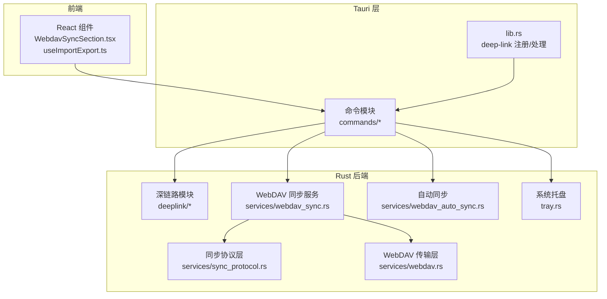
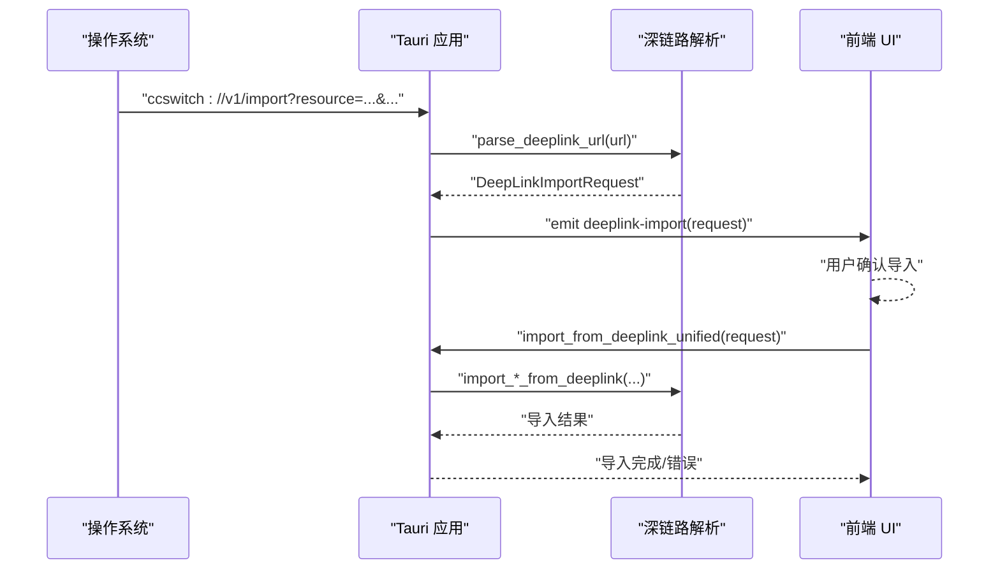
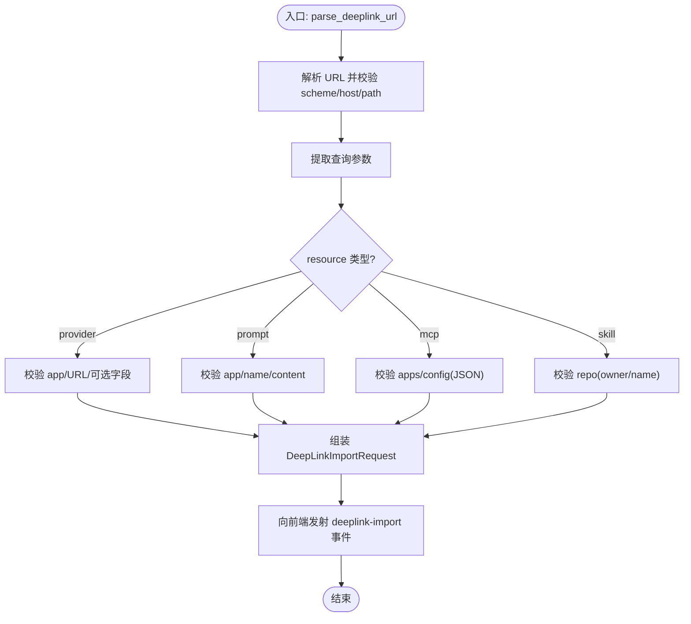
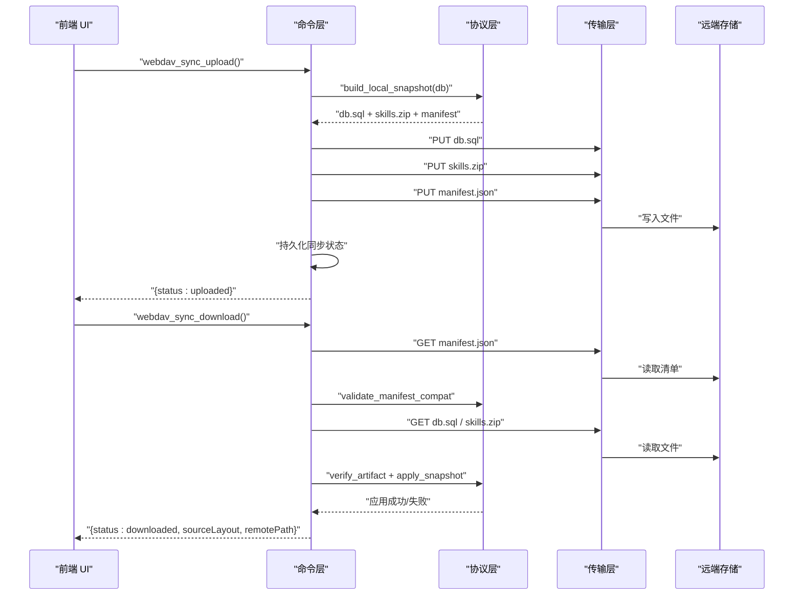
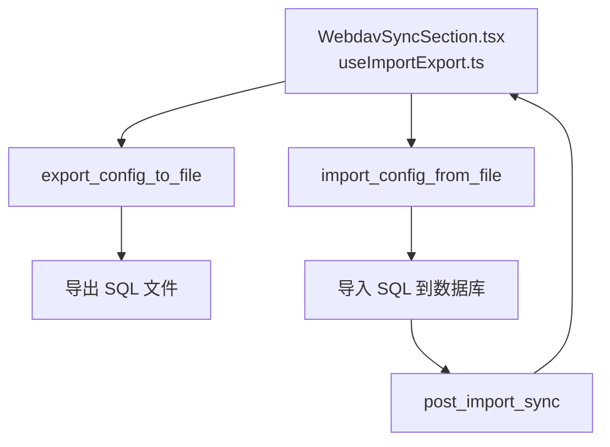
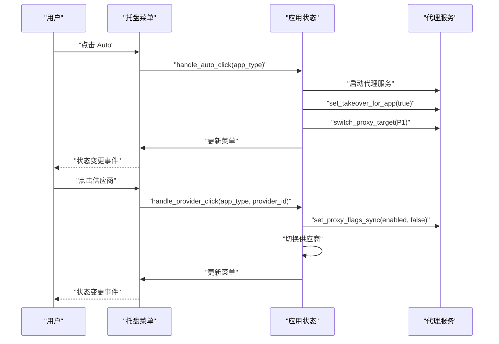
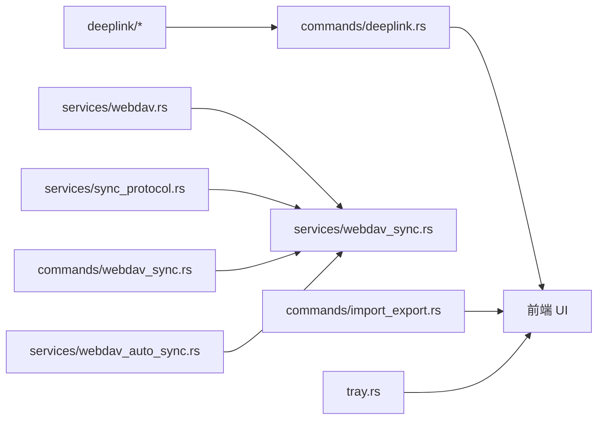

# 第三方集成

<cite>
**本文引用的文件**
- [src-tauri/src/lib.rs](file://src-tauri/src/lib.rs)
- [src-tauri/src/deeplink/mod.rs](file://src-tauri/src/deeplink/mod.rs)
- [src-tauri/src/deeplink/parser.rs](file://src-tauri/src/deeplink/parser.rs)
- [src-tauri/src/deeplink/utils.rs](file://src-tauri/src/deeplink/utils.rs)
- [src-tauri/src/commands/deeplink.rs](file://src-tauri/src/commands/deeplink.rs)
- [src-tauri/src/services/webdav_sync.rs](file://src-tauri/src/services/webdav_sync.rs)
- [src-tauri/src/services/webdav.rs](file://src-tauri/src/services/webdav.rs)
- [src-tauri/src/commands/webdav_sync.rs](file://src-tauri/src/commands/webdav_sync.rs)
- [src-tauri/src/services/sync_protocol.rs](file://src-tauri/src/services/sync_protocol.rs)
- [src-tauri/src/services/webdav_auto_sync.rs](file://src-tauri/src/services/webdav_auto_sync.rs)
- [src-tauri/src/commands/import_export.rs](file://src-tauri/src/commands/import_export.rs)
- [src/components/settings/WebdavSyncSection.tsx](file://src/components/settings/WebdavSyncSection.tsx)
- [src/hooks/useImportExport.ts](file://src/hooks/useImportExport.ts)
- [src-tauri/src/tray.rs](file://src-tauri/src/tray.rs)
</cite>

## 目录
1. [简介](#简介)
2. [项目结构](#项目结构)
3. [核心组件](#核心组件)
4. [架构总览](#架构总览)
5. [详细组件分析](#详细组件分析)
6. [依赖关系分析](#依赖关系分析)
7. [性能考量](#性能考量)
8. [故障排查指南](#故障排查指南)
9. [结论](#结论)
10. [附录](#附录)

## 简介
本指南面向希望基于 CC Switch 构建第三方集成的开发者，涵盖以下主题：
- 深链接协议（ccswitch://）的实现与使用，包括协议定义、参数解析与回调处理
- WebDAV 同步服务的开发，包括同步策略、冲突解决与增量更新
- 外部工具集成（命令行工具调用、进程管理与结果处理）
- 配置导入导出机制（数据格式转换与版本兼容）
- 与桌面应用的系统级集成（系统托盘交互与系统级功能调用）
- 集成示例（云存储服务、IDE 插件与开发工具）
- 集成测试与调试最佳实践

## 项目结构
本项目采用前后端分离的架构：前端使用 React + Tauri，后端 Rust 提供命令与服务层。第三方集成主要涉及：
- 深链接处理：Rust 深链接模块 + Tauri 插件桥接
- 同步服务：WebDAV 协议层与传输层，以及跨传输的协议层
- 导入导出：SQL 文件导入导出与 UI 交互
- 桌面集成：系统托盘菜单与事件处理

图表来源
- [src-tauri/src/lib.rs:119-182](file://src-tauri/src/lib.rs#L119-L182)
- [src-tauri/src/deeplink/mod.rs:1-30](file://src-tauri/src/deeplink/mod.rs#L1-L30)
- [src-tauri/src/services/webdav_sync.rs:1-60](file://src-tauri/src/services/webdav_sync.rs#L1-L60)
- [src-tauri/src/services/webdav.rs:1-40](file://src-tauri/src/services/webdav.rs#L1-L40)
- [src-tauri/src/services/sync_protocol.rs:1-40](file://src-tauri/src/services/sync_protocol.rs#L1-L40)
- [src-tauri/src/services/webdav_auto_sync.rs:1-40](file://src-tauri/src/services/webdav_auto_sync.rs#L1-L40)
- [src-tauri/src/tray.rs:1-40](file://src-tauri/src/tray.rs#L1-L40)

章节来源
- [src-tauri/src/lib.rs:220-300](file://src-tauri/src/lib.rs#L220-L300)
- [src-tauri/src/deeplink/mod.rs:1-30](file://src-tauri/src/deeplink/mod.rs#L1-L30)
- [src-tauri/src/services/webdav_sync.rs:1-60](file://src-tauri/src/services/webdav_sync.rs#L1-L60)

## 核心组件
- 深链接协议与解析：ccswitch://v1/import，支持资源类型 provider/prompt/mcp/skill，参数校验与 Base64 解码
- WebDAV 同步：基于 manifest 的上传/下载，带校验与版本兼容检查
- 导入导出：SQL 文件导入导出，配合 UI 与后端命令
- 系统托盘：菜单构建、事件处理与用量信息展示
- 自动同步：基于数据库变更的去抖与合并上传

章节来源
- [src-tauri/src/deeplink/mod.rs:30-138](file://src-tauri/src/deeplink/mod.rs#L30-L138)
- [src-tauri/src/services/webdav_sync.rs:63-161](file://src-tauri/src/services/webdav_sync.rs#L63-L161)
- [src-tauri/src/commands/import_export.rs:19-76](file://src-tauri/src/commands/import_export.rs#L19-L76)
- [src-tauri/src/tray.rs:487-627](file://src-tauri/src/tray.rs#L487-L627)
- [src-tauri/src/services/webdav_auto_sync.rs:138-194](file://src-tauri/src/services/webdav_auto_sync.rs#L138-L194)

## 架构总览
深链接与 WebDAV 同步的关键流程如下：

图表来源
- [src-tauri/src/lib.rs:119-182](file://src-tauri/src/lib.rs#L119-L182)
- [src-tauri/src/commands/deeplink.rs:8-89](file://src-tauri/src/commands/deeplink.rs#L8-L89)
- [src-tauri/src/deeplink/parser.rs:11-68](file://src-tauri/src/deeplink/parser.rs#L11-L68)

章节来源
- [src-tauri/src/lib.rs:119-182](file://src-tauri/src/lib.rs#L119-L182)
- [src-tauri/src/commands/deeplink.rs:8-89](file://src-tauri/src/commands/deeplink.rs#L8-L89)

## 详细组件分析

### 深链接协议与实现
- 协议定义
  - 方案：ccswitch://
  - 版本：v1（位于 host）
  - 路径：/import
  - 必填参数：resource（provider/prompt/mcp/skill）
- 参数解析与校验
  - URL 格式校验与 scheme/host/path 校验
  - resource 类型分派至对应解析器
  - provider：校验 app 类型、URL 合法性、Base64 内容（可选）
  - prompt：校验 app 与 content（Base64）
  - mcp：校验 apps 列表与 config（JSON）
  - skill：校验 repo 格式（owner/name）
- Base64 解码与 URL 安全处理
  - 处理 + 空格与 URL 安全变体，自动补全填充
- 回调与事件
  - 成功解析后向前端发射 deeplink-import 事件
  - 失败发射 deeplink-error 事件

图表来源
- [src-tauri/src/deeplink/parser.rs:11-68](file://src-tauri/src/deeplink/parser.rs#L11-L68)
- [src-tauri/src/deeplink/parser.rs:70-177](file://src-tauri/src/deeplink/parser.rs#L70-L177)
- [src-tauri/src/deeplink/parser.rs:179-247](file://src-tauri/src/deeplink/parser.rs#L179-L247)
- [src-tauri/src/deeplink/parser.rs:249-312](file://src-tauri/src/deeplink/parser.rs#L249-L312)
- [src-tauri/src/deeplink/parser.rs:314-367](file://src-tauri/src/deeplink/parser.rs#L314-L367)

章节来源
- [src-tauri/src/deeplink/mod.rs:30-138](file://src-tauri/src/deeplink/mod.rs#L30-L138)
- [src-tauri/src/deeplink/parser.rs:11-68](file://src-tauri/src/deeplink/parser.rs#L11-L68)
- [src-tauri/src/deeplink/utils.rs:9-100](file://src-tauri/src/deeplink/utils.rs#L9-L100)
- [src-tauri/src/commands/deeplink.rs:8-89](file://src-tauri/src/commands/deeplink.rs#L8-L89)
- [src-tauri/src/lib.rs:119-182](file://src-tauri/src/lib.rs#L119-L182)

### WebDAV 同步服务
- 协议与布局
  - 协议版本 v2，数据库兼容版本 db-v6
  - 远端布局：{root}/v{PROTOCOL_VERSION}/db-v{DB_COMPAT_VERSION}/{profile}/
  - 清单文件：manifest.json，包含 db.sql 与 skills.zip 的元信息
- 同步流程
  - 上传：构建本地快照（db.sql + skills.zip + manifest），按顺序上传 artifacts，最后上传 manifest，并持久化同步状态
  - 下载：查找远端快照，校验清单与版本兼容，下载并校验 artifacts，应用快照（先 skills，后 db；失败时回滚 skills）
  - 信息获取：仅获取远端清单与元信息，不下载 artifacts
- 错误处理与兼容性
  - manifest 格式/版本/数据库兼容性校验
  - artifacts 大小与 SHA-256 校验
  - 服务特定错误提示（如坚果云的认证与目录限制）
- 自动同步
  - 基于数据库变更信号的去抖与合并，仅对配置相关表触发
  - 支持抑制（AutoSyncSuppressionGuard）以避免下载时触发

图表来源
- [src-tauri/src/services/webdav_sync.rs:63-161](file://src-tauri/src/services/webdav_sync.rs#L63-L161)
- [src-tauri/src/services/sync_protocol.rs:105-162](file://src-tauri/src/services/sync_protocol.rs#L105-L162)
- [src-tauri/src/services/webdav.rs:224-298](file://src-tauri/src/services/webdav.rs#L224-L298)
- [src-tauri/src/commands/webdav_sync.rs:104-139](file://src-tauri/src/commands/webdav_sync.rs#L104-L139)

章节来源
- [src-tauri/src/services/webdav_sync.rs:1-336](file://src-tauri/src/services/webdav_sync.rs#L1-L336)
- [src-tauri/src/services/webdav.rs:1-555](file://src-tauri/src/services/webdav.rs#L1-L555)
- [src-tauri/src/services/sync_protocol.rs:1-649](file://src-tauri/src/services/sync_protocol.rs#L1-L649)
- [src-tauri/src/commands/webdav_sync.rs:1-358](file://src-tauri/src/commands/webdav_sync.rs#L1-L358)
- [src-tauri/src/services/webdav_auto_sync.rs:1-275](file://src-tauri/src/services/webdav_auto_sync.rs#L1-L275)

### 配置导入导出机制
- 导出
  - 命令：export_config_to_file(filePath, state)
  - 行为：将数据库导出为 SQL 文件
- 导入
  - 命令：import_config_from_file(filePath, state)
  - 行为：从 SQL 文件导入数据库，执行导入后的同步并返回警告
- UI 集成
  - useImportExport 钩子封装文件选择、导入/导出状态与 Toast 提示
  - WebdavSyncSection.tsx 提供导入导出 UI 与进度反馈

图表来源
- [src-tauri/src/commands/import_export.rs:19-76](file://src-tauri/src/commands/import_export.rs#L19-L76)
- [src/hooks/useImportExport.ts:31-204](file://src/hooks/useImportExport.ts#L31-L204)
- [src/components/settings/WebdavSyncSection.tsx:143-183](file://src/components/settings/WebdavSyncSection.tsx#L143-L183)

章节来源
- [src-tauri/src/commands/import_export.rs:1-177](file://src-tauri/src/commands/import_export.rs#L1-L177)
- [src/hooks/useImportExport.ts:1-204](file://src/hooks/useImportExport.ts#L1-L204)
- [src/components/settings/WebdavSyncSection.tsx:1-800](file://src/components/settings/WebdavSyncSection.tsx#L1-L800)

### 系统托盘交互与系统级功能
- 菜单构建
  - 按应用类型（Claude/Codex/Gemini）折叠子菜单
  - 当前供应商名称与用量后缀动态更新
  - 官方供应商在代理接管时禁用
- 事件处理
  - Auto 模式：启用代理、故障转移与接管
  - 供应商切换：关闭 auto_failover，切换供应商
- 用量刷新
  - 合并多次快速触发的用量刷新，避免菜单频繁重建
  - 10 秒节流，减少悬停时的请求风暴

图表来源
- [src-tauri/src/tray.rs:321-485](file://src-tauri/src/tray.rs#L321-L485)
- [src-tauri/src/tray.rs:487-627](file://src-tauri/src/tray.rs#L487-L627)

章节来源
- [src-tauri/src/tray.rs:1-800](file://src-tauri/src/tray.rs#L1-L800)

### 外部工具集成（命令行与进程）
- 进程与系统工具
  - 使用 tauri_plugin_process 与 tauri_plugin_opener 进行外部进程与系统打开操作
  - 可用于调用外部 CLI 工具、浏览器、文件管理器等
- 与深链路结合
  - Windows/Linux 命令行参数传递时，单实例回调会尝试解析深链路 URL 并聚焦主窗口

章节来源
- [src-tauri/src/lib.rs:267-295](file://src-tauri/src/lib.rs#L267-L295)
- [src-tauri/src/lib.rs:228-265](file://src-tauri/src/lib.rs#L228-L265)

## 依赖关系分析

图表来源
- [src-tauri/src/commands/deeplink.rs:1-90](file://src-tauri/src/commands/deeplink.rs#L1-L90)
- [src-tauri/src/services/webdav_sync.rs:1-60](file://src-tauri/src/services/webdav_sync.rs#L1-L60)
- [src-tauri/src/services/webdav.rs:1-40](file://src-tauri/src/services/webdav.rs#L1-L40)
- [src-tauri/src/services/sync_protocol.rs:1-40](file://src-tauri/src/services/sync_protocol.rs#L1-L40)
- [src-tauri/src/commands/webdav_sync.rs:1-40](file://src-tauri/src/commands/webdav_sync.rs#L1-L40)
- [src-tauri/src/commands/import_export.rs:1-40](file://src-tauri/src/commands/import_export.rs#L1-L40)
- [src-tauri/src/tray.rs:1-40](file://src-tauri/src/tray.rs#L1-L40)
- [src-tauri/src/services/webdav_auto_sync.rs:1-40](file://src-tauri/src/services/webdav_auto_sync.rs#L1-L40)

章节来源
- [src-tauri/src/commands/deeplink.rs:1-90](file://src-tauri/src/commands/deeplink.rs#L1-L90)
- [src-tauri/src/commands/webdav_sync.rs:1-170](file://src-tauri/src/commands/webdav_sync.rs#L1-L170)
- [src-tauri/src/commands/import_export.rs:1-108](file://src-tauri/src/commands/import_export.rs#L1-L108)
- [src-tauri/src/services/webdav_sync.rs:1-100](file://src-tauri/src/services/webdav_sync.rs#L1-L100)
- [src-tauri/src/services/webdav_auto_sync.rs:1-100](file://src-tauri/src/services/webdav_auto_sync.rs#L1-L100)
- [src-tauri/src/tray.rs:1-100](file://src-tauri/src/tray.rs#L1-L100)

## 性能考量
- WebDAV 同步
  - 传输超时与大文件限制：PUT/GET 默认较长超时，响应体大小限制
  - 并发控制：同步锁保证同一时间只有一个同步任务
  - 自动同步去抖：连续变更合并为一次上传，最长等待约 10 秒
- 深链接解析
  - Base64 解码尝试多种变体与填充，避免重复重试
- 托盘刷新
  - 合并刷新与 10 秒节流，减少高频请求

章节来源
- [src-tauri/src/services/webdav.rs:13-16](file://src-tauri/src/services/webdav.rs#L13-L16)
- [src-tauri/src/services/webdav_sync.rs:32-44](file://src-tauri/src/services/webdav_sync.rs#L32-L44)
- [src-tauri/src/services/webdav_auto_sync.rs:15-16](file://src-tauri/src/services/webdav_auto_sync.rs#L15-L16)
- [src-tauri/src/tray.rs:753-781](file://src-tauri/src/tray.rs#L753-L781)

## 故障排查指南
- WebDAV 连接失败
  - 检查用户名/密码与目录权限；坚果云需使用第三方应用密码并指向 /dav/ 目录
  - MKCOL 失败：确认父目录存在或服务不支持自动创建顶层目录
  - 响应体过大：检查远端文件大小限制
- 深链接解析失败
  - 校验 ccswitch://v1/import 格式与 resource 类型
  - Base64 参数需 URL 安全编码，必要时进行 + 与填充处理
- 导入导出异常
  - SQL 文件损坏或格式不正确；检查导入后同步状态与警告
- 托盘菜单异常
  - 菜单重建失败或被系统关闭：使用就地更新标题而非整菜单重建

章节来源
- [src-tauri/src/services/webdav.rs:368-401](file://src-tauri/src/services/webdav.rs#L368-L401)
- [src-tauri/src/services/webdav.rs:433-468](file://src-tauri/src/services/webdav.rs#L433-L468)
- [src-tauri/src/deeplink/utils.rs:24-80](file://src-tauri/src/deeplink/utils.rs#L24-L80)
- [src-tauri/src/commands/import_export.rs:84-141](file://src-tauri/src/commands/import_export.rs#L84-L141)
- [src-tauri/src/tray.rs:665-677](file://src-tauri/src/tray.rs#L665-L677)

## 结论
本指南提供了 CC Switch 第三方集成的完整路径：从深链接协议到 WebDAV 同步，再到导入导出与系统托盘交互。通过统一的命令与服务层，开发者可以稳定地扩展云存储、IDE 插件与开发工具的集成能力。

## 附录
- 集成示例（概念性说明）
  - 云存储服务：在 WebDAV 传输层基础上，实现类似协议的远程布局与清单校验
  - IDE 插件：通过深链路 ccswitch://v1/import 导入 provider/prompt/mcp/skill
  - 开发工具：使用 tauri_plugin_process 调用外部 CLI，结合深链路参数驱动导入
- 集成测试与调试
  - 使用前端 useImportExport 与 WebdavSyncSection.tsx 验证导入导出流程
  - 通过 deeplink-import/deeplink-error 事件与日志定位问题
  - 利用自动同步与托盘用量刷新验证实时性与稳定性