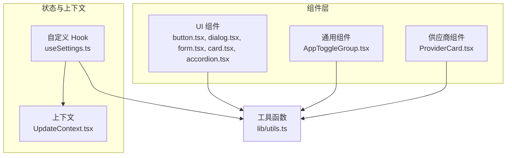
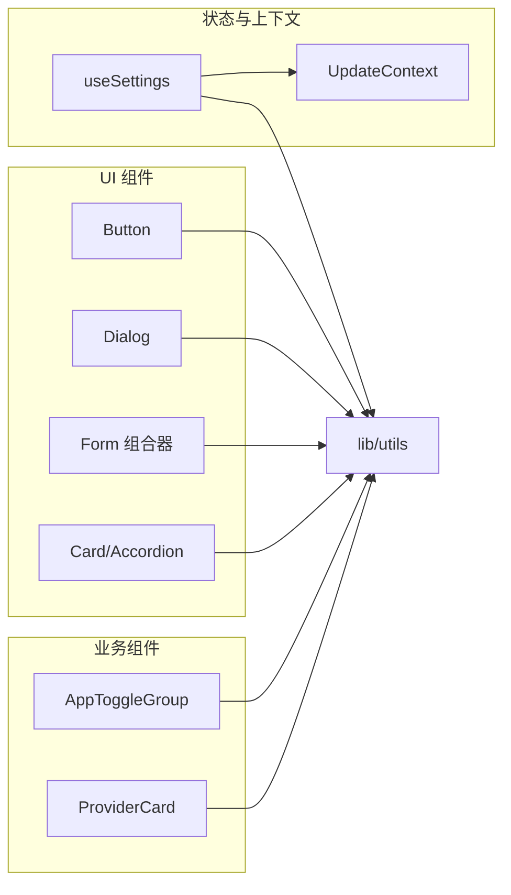
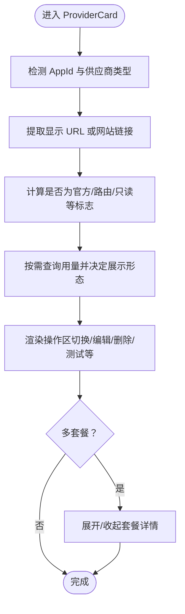
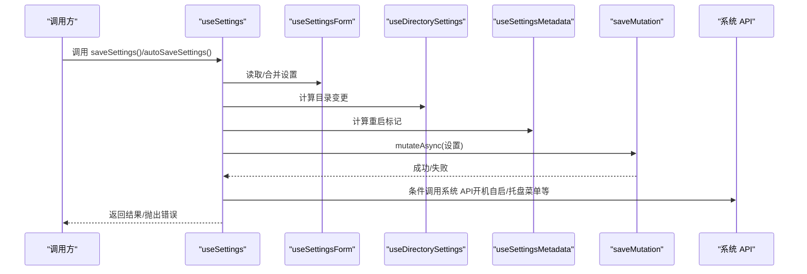
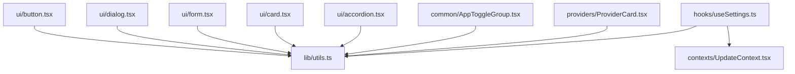

# 组件扩展

<cite>
**本文引用的文件**   
- [src/components/ui/button.tsx](file://src/components/ui/button.tsx)
- [src/components/ui/dialog.tsx](file://src/components/ui/dialog.tsx)
- [src/components/ui/form.tsx](file://src/components/ui/form.tsx)
- [src/components/ui/card.tsx](file://src/components/ui/card.tsx)
- [src/components/ui/accordion.tsx](file://src/components/ui/accordion.tsx)
- [src/components/common/AppToggleGroup.tsx](file://src/components/common/AppToggleGroup.tsx)
- [src/components/providers/ProviderCard.tsx](file://src/components/providers/ProviderCard.tsx)
- [src/contexts/UpdateContext.tsx](file://src/contexts/UpdateContext.tsx)
- [src/hooks/useSettings.ts](file://src/hooks/useSettings.ts)
- [src/lib/utils.ts](file://src/lib/utils.ts)
- [tests/components/AddProviderDialog.test.tsx](file://tests/components/AddProviderDialog.test.tsx)
- [tests/hooks/useSettings.test.tsx](file://tests/hooks/useSettings.test.tsx)
</cite>

## 目录
1. [简介](#简介)
2. [项目结构](#项目结构)
3. [核心组件](#核心组件)
4. [架构总览](#架构总览)
5. [详细组件分析](#详细组件分析)
6. [依赖关系分析](#依赖关系分析)
7. [性能考量](#性能考量)
8. [故障排查指南](#故障排查指南)
9. [结论](#结论)
10. [附录](#附录)

## 简介
本指南面向希望在 CC Switch 项目中进行“组件扩展”的开发者，目标是帮助你：
- 设计可复用的 UI 组件与业务逻辑组件
- 遵循统一的设计原则、样式规范与交互模式
- 掌握架构模式：高阶组件、渲染属性、组合模式
- 扩展组件状态管理：自定义 Hook 的开发与状态提升策略
- 实现组件间通信：事件系统与上下文传递
- 编写组件测试：单元测试与集成测试
- 进行性能优化：懒加载、虚拟化与缓存策略
- 输出组件文档与使用指南

## 项目结构
CC Switch 采用“按功能域分层 + 组件库化”的组织方式：
- 组件层：src/components 下按领域拆分（如 ui、providers、settings、sessions 等），通用 UI 组件集中在 ui 子目录
- 自定义 Hook：src/hooks 下封装状态与副作用
- 上下文：src/contexts 下集中管理跨层级共享状态
- 工具与样式：src/lib/utils.ts 提供样式合并工具，配合 Tailwind 使用
- 测试：tests 下包含组件测试、Hook 测试与集成测试



**图表来源**
- [src/components/ui/button.tsx:1-66](file://src/components/ui/button.tsx#L1-L66)
- [src/components/ui/dialog.tsx:1-158](file://src/components/ui/dialog.tsx#L1-L158)
- [src/components/ui/form.tsx:1-166](file://src/components/ui/form.tsx#L1-L166)
- [src/components/ui/card.tsx:1-87](file://src/components/ui/card.tsx#L1-L87)
- [src/components/ui/accordion.tsx:1-57](file://src/components/ui/accordion.tsx#L1-L57)
- [src/components/common/AppToggleGroup.tsx:1-51](file://src/components/common/AppToggleGroup.tsx#L1-L51)
- [src/components/providers/ProviderCard.tsx:1-606](file://src/components/providers/ProviderCard.tsx#L1-L606)
- [src/hooks/useSettings.ts:1-512](file://src/hooks/useSettings.ts#L1-L512)
- [src/contexts/UpdateContext.tsx:1-156](file://src/contexts/UpdateContext.tsx#L1-L156)
- [src/lib/utils.ts:1-7](file://src/lib/utils.ts#L1-L7)

**章节来源**
- [src/lib/utils.ts:1-7](file://src/lib/utils.ts#L1-L7)
- [src/components/ui/button.tsx:1-66](file://src/components/ui/button.tsx#L1-L66)
- [src/components/ui/dialog.tsx:1-158](file://src/components/ui/dialog.tsx#L1-L158)
- [src/components/ui/form.tsx:1-166](file://src/components/ui/form.tsx#L1-L166)
- [src/components/ui/card.tsx:1-87](file://src/components/ui/card.tsx#L1-L87)
- [src/components/ui/accordion.tsx:1-57](file://src/components/ui/accordion.tsx#L1-L57)
- [src/components/common/AppToggleGroup.tsx:1-51](file://src/components/common/AppToggleGroup.tsx#L1-L51)
- [src/components/providers/ProviderCard.tsx:1-606](file://src/components/providers/ProviderCard.tsx#L1-L606)
- [src/hooks/useSettings.ts:1-512](file://src/hooks/useSettings.ts#L1-L512)
- [src/contexts/UpdateContext.tsx:1-156](file://src/contexts/UpdateContext.tsx#L1-L156)

## 核心组件
本节聚焦于可直接复用与扩展的组件与模式。

- 变体与尺寸的按钮组件：通过变体与尺寸的组合，统一按钮风格，支持透传原生属性与“子元素渲染”能力
- 对话框组件：支持多层级 z-index、变体（默认/全屏）、遮罩层与内容区域分离
- 表单组合器：基于 react-hook-form 的表单上下文、字段上下文与校验消息输出
- 卡片与手风琴：卡片容器与折叠面板，便于组合复杂信息区块
- 应用切换组：图标化开关组，结合 Tooltip 提供交互提示
- 供应商卡片：复杂业务卡片，承载多种状态、操作与用量信息
- 自定义 Hook：useSettings 将多个子状态模块组合为统一的设置管理入口
- 上下文：UpdateContext 提供更新检查、提示与持久化

**章节来源**
- [src/components/ui/button.tsx:1-66](file://src/components/ui/button.tsx#L1-L66)
- [src/components/ui/dialog.tsx:1-158](file://src/components/ui/dialog.tsx#L1-L158)
- [src/components/ui/form.tsx:1-166](file://src/components/ui/form.tsx#L1-L166)
- [src/components/ui/card.tsx:1-87](file://src/components/ui/card.tsx#L1-L87)
- [src/components/ui/accordion.tsx:1-57](file://src/components/ui/accordion.tsx#L1-L57)
- [src/components/common/AppToggleGroup.tsx:1-51](file://src/components/common/AppToggleGroup.tsx#L1-L51)
- [src/components/providers/ProviderCard.tsx:1-606](file://src/components/providers/ProviderCard.tsx#L1-L606)
- [src/hooks/useSettings.ts:1-512](file://src/hooks/useSettings.ts#L1-L512)
- [src/contexts/UpdateContext.tsx:1-156](file://src/contexts/UpdateContext.tsx#L1-L156)

## 架构总览
CC Switch 的组件扩展遵循以下架构原则：
- 组合优先：通过小而专一的组件组合成复杂界面
- 变体与尺寸：统一风格，减少重复样式代码
- 上下文与 Hook：将跨层级状态与副作用抽离为可复用模块
- 事件与回调：通过 props 明确组件间通信契约
- 测试先行：为关键组件与 Hook 提供单元与集成测试



**图表来源**
- [src/components/ui/button.tsx:1-66](file://src/components/ui/button.tsx#L1-L66)
- [src/components/ui/dialog.tsx:1-158](file://src/components/ui/dialog.tsx#L1-L158)
- [src/components/ui/form.tsx:1-166](file://src/components/ui/form.tsx#L1-L166)
- [src/components/ui/card.tsx:1-87](file://src/components/ui/card.tsx#L1-L87)
- [src/components/ui/accordion.tsx:1-57](file://src/components/ui/accordion.tsx#L1-L57)
- [src/components/common/AppToggleGroup.tsx:1-51](file://src/components/common/AppToggleGroup.tsx#L1-L51)
- [src/components/providers/ProviderCard.tsx:1-606](file://src/components/providers/ProviderCard.tsx#L1-L606)
- [src/hooks/useSettings.ts:1-512](file://src/hooks/useSettings.ts#L1-L512)
- [src/contexts/UpdateContext.tsx:1-156](file://src/contexts/UpdateContext.tsx#L1-L156)
- [src/lib/utils.ts:1-7](file://src/lib/utils.ts#L1-L7)

## 详细组件分析

### UI 组件：Button、Dialog、Form、Card、Accordion
这些组件体现了“变体 + 尺寸 + 组合”的设计模式，适合直接扩展或二次封装。

```mermaid
classDiagram
class Button {
+props : ButtonProps
+forwardRef<HTMLButtonElement>
+className : 变体/尺寸/禁用
}
class Dialog {
+Root
+Trigger
+Portal
+Overlay(zIndex)
+Content(zIndex, variant, overlayClassName)
+Header/Footer
+Title/Description
}
class Form {
+FormProvider(Form)
+FormField(Controller)
+FormItem
+FormLabel
+FormControl(Slot)
+FormDescription
+FormMessage
+useFormField()
}
class Card {
+Card
+CardHeader
+CardTitle
+CardDescription
+CardContent
+CardFooter
}
class Accordion {
+Accordion
+AccordionItem
+AccordionTrigger
+AccordionContent
}
Button --> Utils["使用 cn 合并类名"]
Dialog --> Utils
Form --> Utils
Card --> Utils
Accordion --> Utils
```

**图表来源**
- [src/components/ui/button.tsx:1-66](file://src/components/ui/button.tsx#L1-L66)
- [src/components/ui/dialog.tsx:1-158](file://src/components/ui/dialog.tsx#L1-L158)
- [src/components/ui/form.tsx:1-166](file://src/components/ui/form.tsx#L1-L166)
- [src/components/ui/card.tsx:1-87](file://src/components/ui/card.tsx#L1-L87)
- [src/components/ui/accordion.tsx:1-57](file://src/components/ui/accordion.tsx#L1-L57)
- [src/lib/utils.ts:1-7](file://src/lib/utils.ts#L1-L7)

**章节来源**
- [src/components/ui/button.tsx:1-66](file://src/components/ui/button.tsx#L1-L66)
- [src/components/ui/dialog.tsx:1-158](file://src/components/ui/dialog.tsx#L1-L158)
- [src/components/ui/form.tsx:1-166](file://src/components/ui/form.tsx#L1-L166)
- [src/components/ui/card.tsx:1-87](file://src/components/ui/card.tsx#L1-L87)
- [src/components/ui/accordion.tsx:1-57](file://src/components/ui/accordion.tsx#L1-L57)
- [src/lib/utils.ts:1-7](file://src/lib/utils.ts#L1-L7)

### 通用组件：AppToggleGroup
- 功能：以图标化按钮组形式控制应用启用状态
- 设计要点：Tooltip 提示、图标映射、受控/非受控切换
- 扩展建议：支持禁用态、批量操作、排序拖拽

**章节来源**
- [src/components/common/AppToggleGroup.tsx:1-51](file://src/components/common/AppToggleGroup.tsx#L1-L51)

### 业务组件：ProviderCard
- 功能：展示与管理供应商卡片，包含健康度、用量、操作区等
- 设计要点：根据不同 AppId 与供应商类型动态渲染标签与用量展示；支持展开/折叠多套餐
- 扩展建议：支持自定义元数据渲染、快捷操作区、权限控制



**图表来源**
- [src/components/providers/ProviderCard.tsx:1-606](file://src/components/providers/ProviderCard.tsx#L1-L606)

**章节来源**
- [src/components/providers/ProviderCard.tsx:1-606](file://src/components/providers/ProviderCard.tsx#L1-L606)

### 自定义 Hook：useSettings
- 角色：将设置表单、目录管理、元数据管理等子模块组合为统一的设置管理入口
- 关键点：自动保存与完整保存两条路径；与系统 API 的集成（开机自启、托盘菜单、Claude 插件等）；基于缓存的“实时状态”读取，避免闭包陈旧问题
- 扩展建议：新增设置项时，遵循“子模块 + 组合 Hook”的模式；为每个子模块提供独立的 Hook 与测试



**图表来源**
- [src/hooks/useSettings.ts:1-512](file://src/hooks/useSettings.ts#L1-L512)

**章节来源**
- [src/hooks/useSettings.ts:1-512](file://src/hooks/useSettings.ts#L1-L512)

### 上下文：UpdateContext
- 角色：提供检查更新、提示关闭与持久化的能力
- 关键点：localStorage 版本兼容、防重复检查、自动启动时延时检查
- 扩展建议：支持“静默检查”与“强制检查”，提供错误回退策略

**章节来源**
- [src/contexts/UpdateContext.tsx:1-156](file://src/contexts/UpdateContext.tsx#L1-L156)

## 依赖关系分析
- 组件依赖工具函数：所有 UI 组件均依赖 lib/utils 的 cn，确保样式合并与冲突修复
- 业务组件依赖上下文与 Hook：ProviderCard 依赖 useUsageQuery、useProviderHealth 等；useSettings 依赖多个子 Hook 与系统 API
- 测试依赖：组件测试与 Hook 测试通过 Mock 替换外部依赖，保证可重复性与稳定性



**图表来源**
- [src/lib/utils.ts:1-7](file://src/lib/utils.ts#L1-L7)
- [src/components/ui/button.tsx:1-66](file://src/components/ui/button.tsx#L1-L66)
- [src/components/ui/dialog.tsx:1-158](file://src/components/ui/dialog.tsx#L1-L158)
- [src/components/ui/form.tsx:1-166](file://src/components/ui/form.tsx#L1-L166)
- [src/components/ui/card.tsx:1-87](file://src/components/ui/card.tsx#L1-L87)
- [src/components/ui/accordion.tsx:1-57](file://src/components/ui/accordion.tsx#L1-L57)
- [src/components/common/AppToggleGroup.tsx:1-51](file://src/components/common/AppToggleGroup.tsx#L1-L51)
- [src/components/providers/ProviderCard.tsx:1-606](file://src/components/providers/ProviderCard.tsx#L1-L606)
- [src/hooks/useSettings.ts:1-512](file://src/hooks/useSettings.ts#L1-L512)
- [src/contexts/UpdateContext.tsx:1-156](file://src/contexts/UpdateContext.tsx#L1-L156)

**章节来源**
- [src/lib/utils.ts:1-7](file://src/lib/utils.ts#L1-L7)
- [src/components/ui/button.tsx:1-66](file://src/components/ui/button.tsx#L1-L66)
- [src/components/ui/dialog.tsx:1-158](file://src/components/ui/dialog.tsx#L1-L158)
- [src/components/ui/form.tsx:1-166](file://src/components/ui/form.tsx#L1-L166)
- [src/components/ui/card.tsx:1-87](file://src/components/ui/card.tsx#L1-L87)
- [src/components/ui/accordion.tsx:1-57](file://src/components/ui/accordion.tsx#L1-L57)
- [src/components/common/AppToggleGroup.tsx:1-51](file://src/components/common/AppToggleGroup.tsx#L1-L51)
- [src/components/providers/ProviderCard.tsx:1-606](file://src/components/providers/ProviderCard.tsx#L1-L606)
- [src/hooks/useSettings.ts:1-512](file://src/hooks/useSettings.ts#L1-L512)
- [src/contexts/UpdateContext.tsx:1-156](file://src/contexts/UpdateContext.tsx#L1-L156)

## 性能考量
- 懒加载与分割：对重型业务组件（如 ProviderCard）按需渲染，避免一次性加载全部
- 虚拟化：对于长列表（如 Provider 列表），采用虚拟滚动减少 DOM 节点数量
- 缓存策略：利用 react-query 的缓存与失效策略，避免重复请求；useSettings 中通过 queryClient 缓存读取“实时状态”，降低 race 条件
- 样式合并：统一使用 cn/twMerge，减少重复类名与冲突
- 事件与回调：通过 props 明确边界，避免不必要的重渲染

[本节为通用指导，无需列出具体文件来源]

## 故障排查指南
- 对话框遮罩层点击穿透：DialogOverlay 对 onInteractOutside 进行拦截，防止误关闭
- 表单字段错误提示：FormMessage 会根据错误状态渲染，注意 aria-describedby 的正确绑定
- 设置保存失败：useSettings 在保存失败时会弹出通知并抛出错误，检查 mutation 与系统 API 调用链路
- 更新提示忽略：UpdateContext 支持持久化忽略特定版本，注意键名迁移与清理

**章节来源**
- [src/components/ui/dialog.tsx:79-82](file://src/components/ui/dialog.tsx#L79-L82)
- [src/components/ui/form.tsx:132-154](file://src/components/ui/form.tsx#L132-L154)
- [src/hooks/useSettings.ts:293-302](file://src/hooks/useSettings.ts#L293-L302)
- [src/contexts/UpdateContext.tsx:42-59](file://src/contexts/UpdateContext.tsx#L42-L59)

## 结论
通过统一的组件库、清晰的 Hook 分层与上下文管理，CC Switch 为组件扩展提供了良好的基础设施。建议在扩展时坚持“小而专一 + 组合优先”的原则，并配套完善的测试与文档，确保可维护性与可复用性。

[本节为总结性内容，无需列出具体文件来源]

## 附录

### 组件设计原则
- 一致性：统一的变体与尺寸体系
- 可访问性：正确的标签、描述与键盘导航
- 可组合性：通过 asChild、Slot 等模式增强可组合性
- 可测试性：明确的 props 边界与可 Mock 的依赖

[本节为通用指导，无需列出具体文件来源]

### 样式规范
- 使用 cn/twMerge 合并类名，避免冲突
- 通过变体与尺寸控制外观，减少重复样式
- 语义化命名，便于主题与暗色模式适配

**章节来源**
- [src/lib/utils.ts:1-7](file://src/lib/utils.ts#L1-L7)
- [src/components/ui/button.tsx:6-43](file://src/components/ui/button.tsx#L6-L43)

### 交互模式
- 悬停/激活/禁用状态：通过变体与尺寸体现
- 弹层与遮罩：Dialog 提供多层级 z-index 与动画
- 表单反馈：Form 提供标签、描述与错误消息的统一输出

**章节来源**
- [src/components/ui/dialog.tsx:18-37](file://src/components/ui/dialog.tsx#L18-L37)
- [src/components/ui/form.tsx:81-96](file://src/components/ui/form.tsx#L81-L96)

### 架构模式实践
- 高阶组件：通过 asChild/Solt 实现“渲染属性”模式
- 组合模式：将多个小组件组合为复杂 UI
- 状态提升：将跨组件共享的状态放入上下文或 Hook

**章节来源**
- [src/components/ui/button.tsx:51-62](file://src/components/ui/button.tsx#L51-L62)
- [src/components/ui/dialog.tsx:48-90](file://src/components/ui/dialog.tsx#L48-L90)
- [src/contexts/UpdateContext.tsx:31-147](file://src/contexts/UpdateContext.tsx#L31-L147)

### 组件状态管理扩展
- 新增设置项：参考 useSettings 的组合模式，拆分为子 Hook 并在主 Hook 中聚合
- 状态提升策略：将跨页面共享的状态放入上下文，局部状态仍保留在组件内

**章节来源**
- [src/hooks/useSettings.ts:62-511](file://src/hooks/useSettings.ts#L62-L511)
- [src/contexts/UpdateContext.tsx:31-147](file://src/contexts/UpdateContext.tsx#L31-L147)

### 组件间通信扩展
- 事件系统：通过 props 回调传递事件，避免全局状态污染
- 上下文传递：使用 Context 传递跨层级共享状态（如更新检查）

**章节来源**
- [src/components/providers/ProviderCard.tsx:142-165](file://src/components/providers/ProviderCard.tsx#L142-L165)
- [src/contexts/UpdateContext.tsx:122-130](file://src/contexts/UpdateContext.tsx#L122-L130)

### 组件测试扩展
- 单元测试：为组件与 Hook 编写测试，Mock 外部依赖
- 集成测试：验证组件在真实场景下的行为

**章节来源**
- [tests/components/AddProviderDialog.test.tsx:1-129](file://tests/components/AddProviderDialog.test.tsx#L1-L129)
- [tests/hooks/useSettings.test.tsx:1-507](file://tests/hooks/useSettings.test.tsx#L1-L507)

### 组件性能优化技巧
- 懒加载：对重型组件按需加载
- 虚拟化：长列表采用虚拟滚动
- 缓存：合理使用 react-query 缓存与失效策略

**章节来源**
- [src/hooks/useSettings.ts:214-217](file://src/hooks/useSettings.ts#L214-L217)

### 组件开发示例
- 可复用 UI 组件：基于 Button、Dialog、Form、Card、Accordion 的组合
- 业务逻辑组件：ProviderCard 的多态渲染与条件展示
- 自定义 Hook：useSettings 的组合与系统 API 集成

**章节来源**
- [src/components/ui/button.tsx:1-66](file://src/components/ui/button.tsx#L1-L66)
- [src/components/ui/dialog.tsx:1-158](file://src/components/ui/dialog.tsx#L1-L158)
- [src/components/ui/form.tsx:1-166](file://src/components/ui/form.tsx#L1-L166)
- [src/components/ui/card.tsx:1-87](file://src/components/ui/card.tsx#L1-L87)
- [src/components/ui/accordion.tsx:1-57](file://src/components/ui/accordion.tsx#L1-L57)
- [src/components/providers/ProviderCard.tsx:1-606](file://src/components/providers/ProviderCard.tsx#L1-L606)
- [src/hooks/useSettings.ts:1-512](file://src/hooks/useSettings.ts#L1-L512)

### 组件文档与使用指南编写
- 组件 API：明确 props 类型、默认值与行为
- 交互示例：提供常见使用场景与交互说明
- 最佳实践：强调可组合性、可访问性与性能注意事项

[本节为通用指导，无需列出具体文件来源]